## 1. Overview

> **Key point:** The Course map ties every Note together. It shows where each idea sits in an ML project, how ideas connect, what to read first, and which algorithm to choose.

The Notes each teach one lesson. The **Course map** (G-2160) shows how those lessons fit together, in four views:

- [**Pipeline map**](#2-the-pipeline-map) (G-2161): where does this idea sit in a real ML project?
- [**Concept map**](#3-the-concept-map) (G-2162): how is this idea connected to the others?
- [**Learning path**](#4-the-learning-path) (G-2163): which Notes should I read first?
- [**Algorithm chooser**](#5-the-algorithm-chooser) (G-2164): which algorithm suits my problem?

Each idea on the map is a **Concept** (G-2165); the course has 335.

Every Note starts with a *Where this fits* box: a small Pipeline map with that Note's steps highlighted, plus what it builds on and what it leads to.

> **Extra:** This map is generated from one data file, `course_map/concepts.yaml`. An interactive version, where you can zoom, filter by step and click a Concept to see its links and Notes, runs with `python course_map/app.py`.

<!-- playground: images/concept_playground.html -->

## 2. The Pipeline map

> **Key point:** Every ML project moves through the same steps, from framing the problem to monitoring the deployed model. Every Concept belongs to one step.

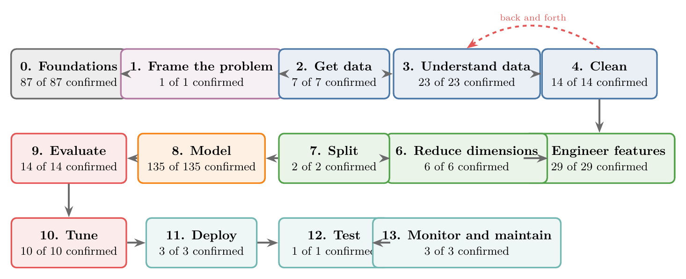

Figure 1 shows the 14 steps. They follow the ML development life cycle, or **MLDLC** (G-1240):

1. frame the problem;
2. get the data and understand it;
3. clean the data;
4. engineer features;
5. train and evaluate models;
6. tune them;
7. deploy, test and keep the model healthy.

Steps 3 (Understand data) and 4 (Clean) loop: exploring reveals what needs cleaning, and cleaning changes the data, so we explore again.

### 2.1 Step 0: Foundations

- [Machine learning](../ML/01-foundations/ML-001-what-is-ml/ML-001-what-is-ml.md#2-defining-machine-learning)
- [Data mining](../ML/01-foundations/ML-001-what-is-ml/ML-001-what-is-ml.md#43-data-mining-finding-hidden-patterns)
- [Artificial intelligence](../ML/01-foundations/ML-002-ai-vs-ml-vs-dl/ML-002-ai-vs-ml-vs-dl.md#2-artificial-intelligence)
- [Symbolic AI and expert systems](../ML/01-foundations/ML-002-ai-vs-ml-vs-dl/ML-002-ai-vs-ml-vs-dl.md#3-symbolic-ai-and-expert-systems)
- [Deep learning](../ML/01-foundations/ML-002-ai-vs-ml-vs-dl/ML-002-ai-vs-ml-vs-dl.md#5-deep-learning)
- [Neural networks](../DL/01-basics/DL-002-what-is-deep-learning/DL-002-what-is-deep-learning.md#22-the-parts-of-a-neural-network)
- [Features](../ML/01-foundations/ML-002-ai-vs-ml-vs-dl/ML-002-ai-vs-ml-vs-dl.md#52-features-chosen-by-us-or-learned)
- [Supervised learning](../ML/01-foundations/ML-003-types-of-ml/ML-003-types-of-ml.md#2-supervised-learning)
- [Regression problems](../ML/01-foundations/ML-003-types-of-ml/ML-003-types-of-ml.md#23-regression-and-classification)
- [Classification problems](../ML/01-foundations/ML-003-types-of-ml/ML-003-types-of-ml.md#23-regression-and-classification)
- [Unsupervised learning](../ML/01-foundations/ML-003-types-of-ml/ML-003-types-of-ml.md#3-unsupervised-learning)
- [Semi-supervised learning](../ML/01-foundations/ML-003-types-of-ml/ML-003-types-of-ml.md#4-semi-supervised-learning)
- [Reinforcement learning](../ML/01-foundations/ML-003-types-of-ml/ML-003-types-of-ml.md#5-reinforcement-learning)
- [Batch (offline) learning](../ML/01-foundations/ML-004-batch-learning/ML-004-batch-learning.md#3-batch-learning)
- [Online learning](../ML/01-foundations/ML-005-online-learning/ML-005-online-learning.md#2-what-online-learning-is)
- [Out-of-core learning](../ML/01-foundations/ML-005-online-learning/ML-005-online-learning.md#6-out-of-core-learning)
- [Instance-based learning](../ML/01-foundations/ML-006-instance-vs-model-based/ML-006-instance-vs-model-based.md#3-instance-based-learning)
- [Model-based learning](../ML/01-foundations/ML-006-instance-vs-model-based/ML-006-instance-vs-model-based.md#4-model-based-learning)
- [Applications of ML](../ML/01-foundations/ML-008-applications-of-ml/ML-008-applications-of-ml.md#2-consumer-and-business-applications)
- [ML development life cycle](../ML/01-foundations/ML-009-mldlc/ML-009-mldlc.md#22-the-machine-learning-development-life-cycle)
- [Tensors](../ML/01-foundations/ML-010-tensors/ML-010-tensors.md#2-what-a-tensor-is)
- [Setup: conda, Jupyter and Colab](../ML/01-foundations/ML-011-setup-anaconda-jupyter-colab/ML-011-setup-anaconda-jupyter-colab.md#2-anaconda-miniforge-and-conda)
- [Chi-square tests](../MA/04-inference/MA-045-chi-square-tests/MA-045-chi-square-tests.md#2-the-chi-square-statistic)
- [Vector magnitude, distance and scalar operations](../MA/05-linear-algebra/MA-049-magnitude-distance-and-scalar-operations/MA-049-magnitude-distance-and-scalar-operations.md#2-magnitude-the-distance-from-the-origin)
- [Normal distribution](../MA/03-distributions/MA-024-normal-distribution/MA-024-normal-distribution.md#2-what-the-normal-distribution-is)
- [Eigenvectors and eigenvalues](../MA/05-linear-algebra/MA-056-eigenvectors-and-eigenvalues/MA-056-eigenvectors-and-eigenvalues.md#2-eigenvectors-stay-on-their-own-span)
- [Dot product](../MA/05-linear-algebra/MA-050-dot-product-and-cosine-similarity/MA-050-dot-product-and-cosine-similarity.md#3-computing-the-dot-product)
- [Linear transformations and matrices](../MA/05-linear-algebra/MA-053-linear-transformations-and-matrices/MA-053-linear-transformations-and-matrices.md#3-what-makes-a-transformation-linear)
- [Derivatives of one variable](../MA/06-calculus/MA-061-derivatives-of-one-variable/MA-061-derivatives-of-one-variable.md#4-the-derivative-shrinking-the-step-to-zero)
- [Equation of a hyperplane](../MA/05-linear-algebra/MA-051-equation-of-a-hyperplane/MA-051-equation-of-a-hyperplane.md#3-from-a-line-to-a-hyperplane)
- [Partial derivatives and gradients](../MA/06-calculus/MA-062-partial-derivatives-and-gradients/MA-062-partial-derivatives-and-gradients.md#4-the-gradient)
- [Conditional probability](../MA/02-probability/MA-014-joint-marginal-conditional-probability/MA-014-joint-marginal-conditional-probability.md#4-conditional-probability)
- [Independent and mutually exclusive events](../MA/02-probability/MA-016-independent-events/MA-016-independent-events.md#2-the-definition)
- [Bayes' theorem](../MA/02-probability/MA-018-bayes-theorem/MA-018-bayes-theorem.md#4-the-formula-and-its-proof)
- [Bernoulli and binomial distributions](../MA/03-distributions/MA-031-bernoulli-and-binomial/MA-031-bernoulli-and-binomial.md#2-the-bernoulli-distribution)
- [Hessian and multivariate Taylor](../MA/06-calculus/MA-064-hessian-and-multivariate-taylor/MA-064-hessian-and-multivariate-taylor.md#5-the-hessian)
- [Taylor series](../MA/06-calculus/MA-061-derivatives-of-one-variable/MA-061-derivatives-of-one-variable.md#6-taylor-polynomials)
- [Probability distributions](../MA/03-distributions/MA-020-random-variables-and-distributions/MA-020-random-variables-and-distributions.md#3-probability-distributions-as-tables)
- [Inferential statistics](../MA/01-descriptive-stats/MA-004-what-is-statistics/MA-004-what-is-statistics.md#3-descriptive-and-inferential-statistics)
- [Population, sample, parameter and statistic](../MA/01-descriptive-stats/MA-004-what-is-statistics/MA-004-what-is-statistics.md#4-population-and-sample)
- [Random variables](../MA/03-distributions/MA-020-random-variables-and-distributions/MA-020-random-variables-and-distributions.md#2-random-variables)
- [Probability mass function (PMF)](../MA/03-distributions/MA-021-pmf-and-discrete-cdf/MA-021-pmf-and-discrete-cdf.md#3-the-probability-mass-function)
- [Uniform distribution](../MA/03-distributions/MA-029-uniform-and-log-normal/MA-029-uniform-and-log-normal.md#2-the-uniform-distribution)
- [Log-normal distribution](../MA/03-distributions/MA-029-uniform-and-log-normal/MA-029-uniform-and-log-normal.md#3-the-log-normal-distribution)
- [Poisson distribution](../MA/03-distributions/MA-032-poisson-distribution/MA-032-poisson-distribution.md#2-what-the-poisson-distribution-describes)
- [Standard normal and the z-table](../MA/03-distributions/MA-025-standard-normal-and-z-table/MA-025-standard-normal-and-z-table.md#2-the-standard-normal-distribution)
- [Pareto distribution and power laws](../MA/03-distributions/MA-030-pareto-and-power-law/MA-030-pareto-and-power-law.md#3-the-pareto-distribution)
- [Sampling distribution and standard error](../MA/04-inference/MA-033-sampling-distribution-and-clt/MA-033-sampling-distribution-and-clt.md#3-sampling-distributions)
- [Central limit theorem](../MA/04-inference/MA-033-sampling-distribution-and-clt/MA-033-sampling-distribution-and-clt.md#4-the-central-limit-theorem)
- [Confidence intervals](../MA/04-inference/MA-035-confidence-intervals-z-procedure/MA-035-confidence-intervals-z-procedure.md#4-confidence-intervals-and-confidence-levels)
- [Student's t-distribution](../MA/04-inference/MA-037-t-procedure/MA-037-t-procedure.md#5-students-t-distribution)
- [Hypothesis testing: null and alternative](../MA/04-inference/MA-038-null-and-alternative-hypotheses/MA-038-null-and-alternative-hypotheses.md#2-the-problem-hypothesis-testing-solves)
- [Z-test and rejection regions](../MA/04-inference/MA-039-rejection-region-and-z-test/MA-039-rejection-region-and-z-test.md#6-the-rejection-region-and-the-critical-value)
- [Type I and II errors, power, tails](../MA/04-inference/MA-040-errors-power-and-tails/MA-040-errors-power-and-tails.md#2-type-i-and-type-ii-errors)
- [P-values](../MA/04-inference/MA-041-p-values/MA-041-p-values.md#2-definition)
- [T-tests: one-sample, two-sample, paired](../MA/04-inference/MA-042-one-sample-t-test/MA-042-one-sample-t-test.md#3-the-three-types-of-t-test)
- [Events and sample spaces](../MA/02-probability/MA-010-events-and-types-of-events/MA-010-events-and-types-of-events.md#2-the-five-basic-terms)
- [Empirical vs theoretical probability, probability rules](../MA/02-probability/MA-011-empirical-and-theoretical-probability/MA-011-empirical-and-theoretical-probability.md#5-from-empirical-to-theoretical)
- [Expected value and variance of a random variable](../MA/02-probability/MA-012-expected-value-and-variance/MA-012-expected-value-and-variance.md#3-expected-value)
- [Venn diagrams and contingency tables](../MA/02-probability/MA-013-venn-diagrams-and-contingency-tables/MA-013-venn-diagrams-and-contingency-tables.md#2-venn-diagrams)
- [Joint and marginal probability](../MA/02-probability/MA-014-joint-marginal-conditional-probability/MA-014-joint-marginal-conditional-probability.md#2-joint-probability)
- [Linear algebra roadmap](../MA/05-linear-algebra/MA-047-linear-algebra-roadmap/MA-047-linear-algebra-roadmap.md#4-the-eight-modules)
- [Vectors and feature vectors](../MA/05-linear-algebra/MA-048-vectors-and-feature-vectors/MA-048-vectors-and-feature-vectors.md#2-what-a-vector-is)
- [Role of mathematics in ML](../MA/00-why-maths/MA-001-role-of-maths-in-ml/MA-001-role-of-maths-in-ml.md#1-overview)
- [Linear combinations, span and basis](../MA/05-linear-algebra/MA-052-linear-combinations-span-and-basis/MA-052-linear-combinations-span-and-basis.md#5-linear-combinations)
- [Matrix multiplication as composition](../MA/05-linear-algebra/MA-054-matrix-multiplication-as-composition/MA-054-matrix-multiplication-as-composition.md#2-composition-one-transformation-after-another)
- [Determinant](../MA/05-linear-algebra/MA-056-eigenvectors-and-eigenvalues/MA-056-eigenvectors-and-eigenvalues.md#32-when-can-a-matrix-send-a-non-zero-vector-to-zero)
- [Choosing a hypothesis test](../MA/04-inference/MA-044-choosing-a-hypothesis-test/MA-044-choosing-a-hypothesis-test.md#2-one-logic-for-every-test)
- [One-sample proportion test](../MA/04-inference/MA-044-choosing-a-hypothesis-test/MA-044-choosing-a-hypothesis-test.md#4-one-categorical-feature-the-one-sample-proportion-test)
- [One-way ANOVA](../MA/04-inference/MA-046-one-way-anova/MA-046-one-way-anova.md#3-splitting-the-variation)
- [How to learn the maths for ML](../MA/00-why-maths/MA-002-learning-maths-for-ml/MA-002-learning-maths-for-ml.md#2-habit-1-change-the-attitude)
- [Jacobian and matrix gradients](../MA/06-calculus/MA-063-jacobian-and-matrix-gradients/MA-063-jacobian-and-matrix-gradients.md#4-the-jacobian)
- [Singular value decomposition](../MA/05-linear-algebra/MA-057-svd-geometry/MA-057-svd-geometry.md#4-rotate-stretch-rotate-a--usigma-vmathsf-t)
- [Lagrange multipliers, KKT and duality](../MA/07-optimisation/MA-066-lagrange-multipliers/MA-066-lagrange-multipliers.md#4-the-lagrangian)
- [Convex sets and convex optimisation](../MA/07-optimisation/MA-067-convex-sets-and-functions/MA-067-convex-sets-and-functions.md#6-convex-optimisation-problems)
- [Linear and quadratic programming](../MA/07-optimisation/MA-068-linear-and-quadratic-programming/MA-068-linear-and-quadratic-programming.md#2-linear-programming)
- [Likelihood](../MA/08-likelihood/MA-069-probability-vs-likelihood/MA-069-probability-vs-likelihood.md#22-likelihood-from-the-event-back-to-the-parameter)
- [Maximum likelihood estimation (MLE)](../MA/08-likelihood/MA-070-maximum-likelihood-estimation/MA-070-maximum-likelihood-estimation.md#7-the-likelihood-function-and-the-mle)
- [Exponential distribution](../MA/08-likelihood/MA-071-mle-for-common-distributions/MA-071-mle-for-common-distributions.md#31-the-distribution-of-waiting-times)
- [Multivariate normal distribution](../MA/08-likelihood/MA-073-gaussian-mixture-models/MA-073-gaussian-mixture-models.md#71-the-multivariate-normal)
- [What deep learning is](../DL/01-basics/DL-002-what-is-deep-learning/DL-002-what-is-deep-learning.md#2-two-definitions-of-deep-learning)
- [Representation learning](../DL/01-basics/DL-002-what-is-deep-learning/DL-002-what-is-deep-learning.md#23-the-technical-definition-representation-learning)
- [History of deep learning](../DL/01-basics/DL-003-nn-types-history-applications/DL-003-nn-types-history-applications.md#3-history-of-deep-learning)
- [Universal approximation theorem](../DL/01-basics/DL-003-nn-types-history-applications/DL-003-nn-types-history-applications.md#33-universal-approximation)
- [Memoization](../DL/01-basics/DL-019-mlp-memoization/DL-019-mlp-memoization.md#3-memoization-on-the-fibonacci-numbers)
- [Exponentially weighted moving average (EWMA)](../DL/03-optimizers/DL-033-exponentially-weighted-moving-average/DL-033-exponentially-weighted-moving-average.md#4-the-formula)
- [Sequential data](../DL/05-rnn/DL-055-why-rnn/DL-055-why-rnn.md#3-sequential-data)

### 2.2 Step 1: Frame the problem

- [Framing an ML problem](../ML/01-foundations/ML-013-framing-ml-problem/ML-013-framing-ml-problem.md#2-why-framing-matters)

### 2.3 Step 2: Get data

- [Labelled data](../ML/01-foundations/ML-007-challenges-in-ml/ML-007-challenges-in-ml.md#32-labelled-data-is-scarce)
- [Enough data](../ML/01-foundations/ML-007-challenges-in-ml/ML-007-challenges-in-ml.md#3-not-enough-data)
- [Sampling noise and bias](../ML/01-foundations/ML-007-challenges-in-ml/ML-007-challenges-in-ml.md#42-sampling-noise-and-sampling-bias)
- [APIs](../ML/02-getting-data/ML-016-fetching-data-from-api/ML-016-fetching-data-from-api.md#2-what-an-api-is)
- [Web scraping](../ML/02-getting-data/ML-017-web-scraping/ML-017-web-scraping.md#2-when-we-need-web-scraping)
- [CSV files](../ML/02-getting-data/ML-014-working-with-csv/ML-014-working-with-csv.md#2-csv-and-tsv-files)
- [JSON and SQL data](../ML/02-getting-data/ML-015-working-with-json-and-sql/ML-015-working-with-json-and-sql.md#2-what-json-is)

### 2.4 Step 3: Understand data

- [Exploratory data analysis](../ML/01-foundations/ML-009-mldlc/ML-009-mldlc.md#6-exploratory-data-analysis-eda)
- [Univariate analysis](../ML/02-getting-data/ML-019-univariate-analysis/ML-019-univariate-analysis.md#2-univariate-bivariate-and-multivariate-analysis)
- [Bivariate and multivariate analysis](../ML/02-getting-data/ML-019-univariate-analysis/ML-019-univariate-analysis.md#2-univariate-bivariate-and-multivariate-analysis)
- [Imbalanced data](../ML/09-clustering-and-more/ML-127-imbalanced-data/ML-127-imbalanced-data.md#2-what-imbalanced-data-looks-like)
- [Variance](../MA/01-descriptive-stats/MA-006-measures-of-dispersion/MA-006-measures-of-dispersion.md#4-variance)
- [Correlation](../MA/01-descriptive-stats/MA-009-covariance-and-correlation/MA-009-covariance-and-correlation.md#4-correlation)
- [Descriptive statistics](../MA/01-descriptive-stats/MA-004-what-is-statistics/MA-004-what-is-statistics.md#3-descriptive-and-inferential-statistics)
- [Probability density function (PDF)](../MA/03-distributions/MA-022-pdf-and-continuous-cdf/MA-022-pdf-and-continuous-cdf.md#4-bars-whose-area-is-probability-the-pdf)
- [Kernel density estimation (KDE)](../MA/03-distributions/MA-023-density-estimation-kde/MA-023-density-estimation-kde.md#5-kernel-density-estimation-kde)
- [Skewness](../MA/03-distributions/MA-026-skewness/MA-026-skewness.md#2-skewness-as-distance-from-the-normal-shape)
- [Kurtosis and moments](../MA/03-distributions/MA-028-kurtosis-and-qq-plots/MA-028-kurtosis-and-qq-plots.md#3-kurtosis-a-measure-of-tailedness)
- [Pandas Profiling](../ML/02-getting-data/ML-021-pandas-profiling/ML-021-pandas-profiling.md#2-building-the-report)
- [Q-Q plot](../MA/03-distributions/MA-028-kurtosis-and-qq-plots/MA-028-kurtosis-and-qq-plots.md#7-building-a-q-q-plot)
- [Covariance and covariance matrix](../MA/01-descriptive-stats/MA-009-covariance-and-correlation/MA-009-covariance-and-correlation.md#3-covariance)
- [Discrete and continuous data](../MA/01-descriptive-stats/MA-004-what-is-statistics/MA-004-what-is-statistics.md#62-discrete-and-continuous-data)
- [Measures of central tendency](../MA/01-descriptive-stats/MA-005-measures-of-central-tendency/MA-005-measures-of-central-tendency.md#2-what-central-tendency-means)
- [Bessel's correction](../MA/01-descriptive-stats/MA-006-measures-of-dispersion/MA-006-measures-of-dispersion.md#6-the-sample-variance-divide-by-n---1)
- [Frequency tables](../MA/01-descriptive-stats/MA-007-frequency-tables-and-graphs/MA-007-frequency-tables-and-graphs.md#21-frequency-distribution-table)
- [Percentiles, quartiles and box plots](../MA/01-descriptive-stats/MA-008-percentiles-and-box-plots/MA-008-percentiles-and-box-plots.md#5-building-a-box-plot-by-hand)
- [Correlation and causation](../MA/01-descriptive-stats/MA-009-covariance-and-correlation/MA-009-covariance-and-correlation.md#5-correlation-does-not-imply-causation)
- [Cumulative distribution function (CDF)](../MA/03-distributions/MA-021-pmf-and-discrete-cdf/MA-021-pmf-and-discrete-cdf.md#8-the-cumulative-distribution-function-of-a-discrete-variable)
- [Density estimation](../MA/03-distributions/MA-023-density-estimation-kde/MA-023-density-estimation-kde.md#2-what-density-estimation-is)
- [Correlation significance test](../MA/04-inference/MA-044-choosing-a-hypothesis-test/MA-044-choosing-a-hypothesis-test.md#7-two-numerical-features-the-correlation-test)

### 2.5 Step 4: Clean

- [Poor-quality data](../ML/01-foundations/ML-007-challenges-in-ml/ML-007-challenges-in-ml.md#5-poor-quality-data)
- [Missing values](../ML/04-missing-data-and-outliers/ML-034-complete-case-analysis/ML-034-complete-case-analysis.md#2-why-missing-values-must-be-handled)
- [Outliers](../ML/04-missing-data-and-outliers/ML-040-what-are-outliers/ML-040-what-are-outliers.md#2-what-an-outlier-is)
- [Simple imputation (mean, median, mode, constant)](../ML/04-missing-data-and-outliers/ML-035-imputing-numerical-data/ML-035-imputing-numerical-data.md#2-mean-and-median-imputation)
- [Complete case analysis](../ML/04-missing-data-and-outliers/ML-034-complete-case-analysis/ML-034-complete-case-analysis.md#4-complete-case-analysis)
- [Missing indicator](../ML/04-missing-data-and-outliers/ML-037-missing-indicator-random-sample/ML-037-missing-indicator-random-sample.md#6-missing-indicator)
- [Random sample imputation](../ML/04-missing-data-and-outliers/ML-037-missing-indicator-random-sample/ML-037-missing-indicator-random-sample.md#2-random-sample-imputation)
- [KNN imputer](../ML/04-missing-data-and-outliers/ML-038-knn-imputer/ML-038-knn-imputer.md#5-filling-the-gap-step-by-step)
- [Iterative imputation (MICE)](../ML/04-missing-data-and-outliers/ML-039-iterative-imputer-mice/ML-039-iterative-imputer-mice.md#6-iteration-1-one-feature-at-a-time)
- [Trimming outliers](../ML/04-missing-data-and-outliers/ML-040-what-are-outliers/ML-040-what-are-outliers.md#71-trimming)
- [Capping (winsorization)](../ML/04-missing-data-and-outliers/ML-040-what-are-outliers/ML-040-what-are-outliers.md#72-capping)
- [Z-score outlier method](../ML/04-missing-data-and-outliers/ML-041-outliers-zscore/ML-041-outliers-zscore.md#3-the-68-95-997-rule)
- [IQR outlier method](../ML/04-missing-data-and-outliers/ML-042-outliers-iqr/ML-042-outliers-iqr.md#3-the-fences)
- [Percentile outlier method](../ML/04-missing-data-and-outliers/ML-043-outliers-percentile/ML-043-outliers-percentile.md#2-the-percentile-rule)

### 2.6 Step 5: Engineer features

- [Feature construction and splitting](../ML/05-dimensionality/ML-044-feature-construction-splitting/ML-044-feature-construction-splitting.md#2-feature-construction)
- [Feature scaling](../ML/03-feature-engineering/ML-023-standardization/ML-023-standardization.md#2-feature-scaling-in-brief)
- [Feature engineering](../ML/03-feature-engineering/ML-022-what-is-feature-engineering/ML-022-what-is-feature-engineering.md#2-what-feature-engineering-is)
- [Feature selection](../ML/03-feature-engineering/ML-022-what-is-feature-engineering/ML-022-what-is-feature-engineering.md#8-feature-selection)
- [Standardization](../ML/03-feature-engineering/ML-023-standardization/ML-023-standardization.md#4-the-standardization-formula)
- [One-hot encoding](../ML/03-feature-engineering/ML-026-one-hot-encoding/ML-026-one-hot-encoding.md#2-how-one-hot-encoding-works)
- [ML pipelines](../ML/03-feature-engineering/ML-028-pipelines/ML-028-pipelines.md#2-what-a-pipeline-is)
- [Encoding categorical data](../ML/03-feature-engineering/ML-025-ordinal-label-encoding/ML-025-ordinal-label-encoding.md#3-why-categories-must-become-numbers)
- [Binning and binarization](../ML/03-feature-engineering/ML-031-binning-binarization/ML-031-binning-binarization.md#3-discretization)
- [Feature transformation](../ML/03-feature-engineering/ML-022-what-is-feature-engineering/ML-022-what-is-feature-engineering.md#6-feature-transformation)
- [Normalization](../ML/03-feature-engineering/ML-024-normalization/ML-024-normalization.md#2-what-normalization-is)
- [Ordinal and label encoding](../ML/03-feature-engineering/ML-025-ordinal-label-encoding/ML-025-ordinal-label-encoding.md#5-how-ordinal-encoding-works)
- [Column transformer](../ML/03-feature-engineering/ML-027-column-transformer/ML-027-column-transformer.md#5-the-easy-way-columntransformer)
- [Function transformer](../ML/03-feature-engineering/ML-029-function-transformer/ML-029-function-transformer.md#3-mathematical-transformers-in-scikit-learn)
- [Power transformer](../ML/03-feature-engineering/ML-030-power-transformer/ML-030-power-transformer.md#2-power-transformer-in-scikit-learn)
- [Mixed variables](../ML/03-feature-engineering/ML-032-mixed-variables/ML-032-mixed-variables.md#2-what-a-mixed-variable-is)
- [Date and time features](../ML/03-feature-engineering/ML-033-date-and-time/ML-033-date-and-time.md#5-extracting-parts-of-a-date)
- [Feature importance](../ML/08-trees-and-ensembles/ML-108-feature-importance/ML-108-feature-importance.md#4-how-a-decision-tree-computes-feature-importance)
- [Permutation importance](../ML/08-trees-and-ensembles/ML-108-feature-importance/ML-108-feature-importance.md#7-permutation-importance)
- [Random under- and oversampling](../ML/09-clustering-and-more/ML-127-imbalanced-data/ML-127-imbalanced-data.md#5-random-undersampling)
- [SMOTE](../ML/09-clustering-and-more/ML-127-imbalanced-data/ML-127-imbalanced-data.md#7-smote)
- [Bag of words](../MA/05-linear-algebra/MA-048-vectors-and-feature-vectors/MA-048-vectors-and-feature-vectors.md#42-bag-of-words)
- [Scaling inputs for neural networks](../DL/02-training/DL-023-data-scaling-in-ann/DL-023-data-scaling-in-ann.md#5-the-fix-scale-the-inputs)
- [Data augmentation](../DL/04-cnn/DL-050-data-augmentation/DL-050-data-augmentation.md#4-the-transformations)
- [Sequence padding](../DL/05-rnn/DL-055-why-rnn/DL-055-why-rnn.md#52-zero-padding-wastes-most-of-the-network)
- [Tokenization and integer encoding of text](../DL/05-rnn/DL-057-rnn-sentiment-analysis/DL-057-rnn-sentiment-analysis.md#3-integer-encoding)
- [Word embeddings](../DL/05-rnn/DL-057-rnn-sentiment-analysis/DL-057-rnn-sentiment-analysis.md#6-word-embeddings)
- [Contextual embeddings](../DL/06-transformers/DL-073-what-is-self-attention/DL-073-what-is-self-attention.md#5-static-and-contextual-embeddings)
- [Meaning as direction in embedding space](../DL/06-transformers/DL-072-meaning-as-direction/DL-072-meaning-as-direction.md#4-the-difference-between-two-words-is-a-direction)

### 2.7 Step 6: Reduce dimensions

- [Dimensionality reduction](../ML/05-dimensionality/ML-045-curse-of-dimensionality/ML-045-curse-of-dimensionality.md#6-the-solution-dimensionality-reduction)
- [PCA](../ML/05-dimensionality/ML-046-pca-geometric-intuition/ML-046-pca-geometric-intuition.md#1-what-pca-is)
- [Feature extraction](../ML/03-feature-engineering/ML-022-what-is-feature-engineering/ML-022-what-is-feature-engineering.md#9-feature-extraction)
- [Curse of dimensionality](../ML/05-dimensionality/ML-045-curse-of-dimensionality/ML-045-curse-of-dimensionality.md#2-what-the-curse-of-dimensionality-is)
- [Low-rank approximation (truncated SVD)](../MA/05-linear-algebra/MA-059-low-rank-approximation/MA-059-low-rank-approximation.md#3-the-rank-k-approximation)
- [Latent semantic analysis](../MA/05-linear-algebra/MA-060-svd-in-machine-learning/MA-060-svd-in-machine-learning.md#3-latent-semantic-analysis)

### 2.8 Step 7: Split

- [Train-test split](../ML/01-foundations/ML-012-toy-project/ML-012-toy-project.md#6-training-and-test-sets)
- [Data leakage](../ML/03-feature-engineering/ML-028-pipelines/ML-028-pipelines.md#81-why-the-preprocessing-must-be-inside-data-leakage)

### 2.9 Step 8: Model

- [Clustering](../ML/01-foundations/ML-003-types-of-ml/ML-003-types-of-ml.md#32-clustering)
- [Anomaly detection](../ML/01-foundations/ML-003-types-of-ml/ML-003-types-of-ml.md#34-anomaly-detection)
- [Association rule learning](../ML/01-foundations/ML-003-types-of-ml/ML-003-types-of-ml.md#35-association-rule-learning)
- [Stochastic gradient descent](../ML/06-regression/ML-058-stochastic-gradient-descent/ML-058-stochastic-gradient-descent.md#3-how-stochastic-gradient-descent-works)
- [K-nearest neighbours](../ML/07-classification/ML-085-knn/ML-085-knn.md#2-how-knn-predicts)
- [Ensemble learning](../ML/08-trees-and-ensembles/ML-095-ensemble-learning/ML-095-ensemble-learning.md#3-how-an-ensemble-predicts)
- [Logistic regression](../ML/07-classification/ML-071-sigmoid-function/ML-071-sigmoid-function.md#5-sigmoid-as-a-probability)
- [Multicollinearity](../ML/03-feature-engineering/ML-026-one-hot-encoding/ML-026-one-hot-encoding.md#32-multicollinearity-inputs-must-not-depend-on-each-other)
- [K-means](../ML/09-clustering-and-more/ML-122-kmeans-intuition/ML-122-kmeans-intuition.md#4-the-five-steps-of-k-means)
- [Simple linear regression](../ML/06-regression/ML-049-simple-linear-regression/ML-049-simple-linear-regression.md#3-a-line-through-the-data)
- [Best-fit line and squared error](../ML/06-regression/ML-049-simple-linear-regression/ML-049-simple-linear-regression.md#34-the-best-fit-line)
- [Ordinary least squares (closed form)](../ML/06-regression/ML-050-linear-regression-maths/ML-050-linear-regression-maths.md#4-finding-the-minimum)
- [Multiple linear regression](../ML/06-regression/ML-052-multiple-linear-regression/ML-052-multiple-linear-regression.md#2-from-a-line-to-a-hyperplane)
- [Normal equation](../ML/06-regression/ML-053-multiple-lr-maths/ML-053-multiple-lr-maths.md#6-the-normal-equation)
- [Assumptions of linear regression](../ML/06-regression/ML-055-linear-regression-assumptions/ML-055-linear-regression-assumptions.md#1-overview)
- [Gradient descent](../ML/06-regression/ML-056-gradient-descent/ML-056-gradient-descent.md#2-the-idea)
- [Convex and non-convex loss](../MA/07-optimisation/MA-065-convex-and-non-convex-cost-functions/MA-065-convex-and-non-convex-cost-functions.md#3-the-chord-test)
- [Batch gradient descent](../ML/06-regression/ML-057-batch-gradient-descent/ML-057-batch-gradient-descent.md#2-gradient-descent-with-many-features)
- [Mini-batch gradient descent](../ML/06-regression/ML-059-mini-batch-gradient-descent/ML-059-mini-batch-gradient-descent.md#3-how-it-works)
- [Polynomial regression](../ML/06-regression/ML-060-polynomial-regression/ML-060-polynomial-regression.md#3-adding-powers-as-new-features)
- [Polynomial features](../ML/06-regression/ML-060-polynomial-regression/ML-060-polynomial-regression.md#3-adding-powers-as-new-features)
- [Regularisation](../ML/06-regression/ML-062-ridge-regression-intuition/ML-062-ridge-regression-intuition.md#3-the-idea-penalise-large-coefficients)
- [Ridge regression](../ML/06-regression/ML-062-ridge-regression-intuition/ML-062-ridge-regression-intuition.md#3-the-idea-penalise-large-coefficients)
- [Lasso regression](../ML/06-regression/ML-066-lasso-regression/ML-066-lasso-regression.md#2-one-feature-the-slope-reaches-exactly-0)
- [Elastic Net](../ML/06-regression/ML-068-elastic-net/ML-068-elastic-net.md#2-the-loss-function)
- [Perceptron trick](../ML/07-classification/ML-069-perceptron-trick/ML-069-perceptron-trick.md#5-the-perceptron-trick)
- [Sigmoid function](../ML/07-classification/ML-071-sigmoid-function/ML-071-sigmoid-function.md#4-the-sigmoid-function)
- [Log loss (binary cross entropy)](../MA/08-likelihood/MA-072-mle-in-machine-learning/MA-072-mle-in-machine-learning.md#4-a-bernoulli-target-gives-the-log-loss)
- [Softmax regression](../ML/07-classification/ML-078-softmax-regression/ML-078-softmax-regression.md#3-how-the-model-predicts)
- [Naive Bayes](../ML/07-classification/ML-081-naive-bayes-intuition/ML-081-naive-bayes-intuition.md#2-the-method-on-one-picture)
- [Support vector machines](../ML/07-classification/ML-086-svm-intuition/ML-086-svm-intuition.md#33-the-core-idea-of-svm)
- [Hinge loss and soft margin](../ML/07-classification/ML-088-svm-soft-margin/ML-088-svm-soft-margin.md#5-the-soft-margin-loss)
- [Kernel trick](../ML/07-classification/ML-089-kernel-trick-intuition/ML-089-kernel-trick-intuition.md#3-the-kernel-trick)
- [Entropy, information gain and Gini](../ML/08-trees-and-ensembles/ML-091-decision-trees-intuition/ML-091-decision-trees-intuition.md#6-entropy)
- [Decision trees](../ML/08-trees-and-ensembles/ML-091-decision-trees-intuition/ML-091-decision-trees-intuition.md#2-a-decision-tree-is-nested-if-else)
- [Regression trees](../ML/08-trees-and-ensembles/ML-093-regression-trees/ML-093-regression-trees.md#3-how-a-regression-tree-predicts)
- [Boosting](../ML/08-trees-and-ensembles/ML-109-adaboost-intuition/ML-109-adaboost-intuition.md#3-a-stage-wise-additive-model)
- [Voting ensembles](../ML/08-trees-and-ensembles/ML-096-voting-ensemble/ML-096-voting-ensemble.md#2-the-core-idea)
- [Bagging](../ML/08-trees-and-ensembles/ML-099-bagging-intuition/ML-099-bagging-intuition.md#2-the-core-idea)
- [Random forest](../ML/08-trees-and-ensembles/ML-102-random-forest-intro/ML-102-random-forest-intro.md#4-how-a-random-forest-works)
- [AdaBoost](../ML/08-trees-and-ensembles/ML-109-adaboost-intuition/ML-109-adaboost-intuition.md#3-a-stage-wise-additive-model)
- [Gradient boosting](../ML/08-trees-and-ensembles/ML-114-gradient-boosting-intuition/ML-114-gradient-boosting-intuition.md#2-boosting-passes-mistakes-forward)
- [XGBoost](../ML/08-trees-and-ensembles/ML-117-xgboost-intro/ML-117-xgboost-intro.md#3-what-xgboost-is)
- [Stacking and blending](../ML/08-trees-and-ensembles/ML-121-stacking-blending/ML-121-stacking-blending.md#3-the-basic-recipe-in-three-steps)
- [Hierarchical clustering](../ML/09-clustering-and-more/ML-125-hierarchical-clustering/ML-125-hierarchical-clustering.md#4-two-kinds-of-hierarchical-clustering)
- [DBSCAN](../ML/09-clustering-and-more/ML-126-dbscan/ML-126-dbscan.md#8-the-dbscan-algorithm-step-by-step)
- [Balanced random forest](../ML/09-clustering-and-more/ML-127-imbalanced-data/ML-127-imbalanced-data.md#8-ensemble-methods-the-balanced-random-forest)
- [Cost-sensitive learning](../ML/09-clustering-and-more/ML-127-imbalanced-data/ML-127-imbalanced-data.md#9-cost-sensitive-learning)
- [Cosine similarity](../MA/05-linear-algebra/MA-050-dot-product-and-cosine-similarity/MA-050-dot-product-and-cosine-similarity.md#6-cosine-similarity)
- [Moore-Penrose pseudo-inverse](../MA/05-linear-algebra/MA-060-svd-in-machine-learning/MA-060-svd-in-machine-learning.md#5-the-pseudo-inverse-and-least-squares)
- [Categorical and sparse categorical cross-entropy](../MA/08-likelihood/MA-072-mle-in-machine-learning/MA-072-mle-in-machine-learning.md#5-a-categorical-target-gives-the-cross-entropy)
- [MAP estimation](../MA/08-likelihood/MA-072-mle-in-machine-learning/MA-072-mle-in-machine-learning.md#7-map-estimation-maximum-likelihood-plus-a-prior)
- [Gaussian mixture model (GMM)](../MA/08-likelihood/MA-073-gaussian-mixture-models/MA-073-gaussian-mixture-models.md#6-the-mixture-density)
- [Expectation maximization (EM)](../MA/08-likelihood/MA-074-expectation-maximization/MA-074-expectation-maximization.md#3-the-two-steps-and-the-algorithm)
- [Types of neural networks](../DL/01-basics/DL-003-nn-types-history-applications/DL-003-nn-types-history-applications.md#2-types-of-neural-networks)
- [Multi-layer perceptron (MLP)](../DL/01-basics/DL-009-mlp-intuition/DL-009-mlp-intuition.md#3-combining-two-perceptrons)
- [Perceptron](../DL/01-basics/DL-004-perceptron/DL-004-perceptron.md#3-the-parts-of-a-perceptron)
- [Perceptron loss](../DL/01-basics/DL-006-perceptron-loss/DL-006-perceptron-loss.md#6-the-perceptron-loss)
- [Problem with the perceptron (XOR)](../DL/01-basics/DL-007-problem-with-perceptron/DL-007-problem-with-perceptron.md#4-what-the-perceptron-learns)
- [MLP notation and parameter count](../DL/01-basics/DL-008-mlp-notation/DL-008-mlp-notation.md#2-the-setup-layers-and-data)
- [Forward propagation](../DL/01-basics/DL-010-forward-propagation/DL-010-forward-propagation.md#6-the-whole-network-in-one-formula)
- [Keras workflow](../DL/01-basics/DL-011-customer-churn-ann/DL-011-customer-churn-ann.md#4-building-a-network-in-keras)
- [ANN for classification](../DL/01-basics/DL-011-customer-churn-ann/DL-011-customer-churn-ann.md#4-building-a-network-in-keras)
- [ANN for regression](../DL/01-basics/DL-013-graduate-admission-ann/DL-013-graduate-admission-ann.md#4-the-regression-network)
- [Loss functions in deep learning](../DL/01-basics/DL-014-dl-loss-functions/DL-014-dl-loss-functions.md#3-why-the-loss-function-matters)
- [Huber loss](../DL/01-basics/DL-014-dl-loss-functions/DL-014-dl-loss-functions.md#7-huber-loss)
- [Backpropagation](../DL/01-basics/DL-015-backpropagation-what/DL-015-backpropagation-what.md#4-the-steps-of-backpropagation)
- [Vanishing gradient](../DL/01-basics/DL-018-vanishing-exploding-gradients/DL-018-vanishing-exploding-gradients.md#3-the-vanishing-gradient-problem)
- [Exploding gradient and gradient clipping](../DL/01-basics/DL-018-vanishing-exploding-gradients/DL-018-vanishing-exploding-gradients.md#7-the-exploding-gradient-problem)
- [ReLU](../DL/02-training/DL-027-activation-functions/DL-027-activation-functions.md#8-relu)
- [Batch size in Keras](../DL/02-training/DL-020-gradient-descent-in-neural-networks/DL-020-gradient-descent-in-neural-networks.md#6-choosing-the-variant-in-keras-batch_size)
- [Dropout](../DL/02-training/DL-024-dropout/DL-024-dropout.md#4-how-dropout-works)
- [L1 and L2 regularisation in neural networks](../DL/02-training/DL-026-regularization-in-dl/DL-026-regularization-in-dl.md#5-the-penalty-term)
- [Activation functions](../DL/02-training/DL-027-activation-functions/DL-027-activation-functions.md#3-what-an-activation-function-is)
- [Tanh](../DL/02-training/DL-027-activation-functions/DL-027-activation-functions.md#7-tanh)
- [Dying ReLU problem](../DL/02-training/DL-028-relu-variants/DL-028-relu-variants.md#3-the-dying-relu-problem)
- [Leaky ReLU, PReLU, ELU and SELU](../DL/02-training/DL-028-relu-variants/DL-028-relu-variants.md#5-linear-variants)
- [GELU activation](../DL/02-training/DL-028-relu-variants/DL-028-relu-variants.md#63-gelu-and-silu-smooth-versions-of-relu)
- [Weight initialisation](../DL/02-training/DL-029-weight-initialization/DL-029-weight-initialization.md#3-why-the-starting-weights-matter)
- [Xavier and He initialisation](../DL/02-training/DL-030-xavier-he-initialization/DL-030-xavier-he-initialization.md#4-xavier-glorot-initialisation)
- [Batch normalisation](../DL/02-training/DL-031-batch-normalization/DL-031-batch-normalization.md#4-how-batch-normalisation-works-during-training)
- [Covariate shift](../DL/02-training/DL-031-batch-normalization/DL-031-batch-normalization.md#32-covariate-shift)
- [Optimizers in deep learning](../DL/03-optimizers/DL-032-optimizers-in-deep-learning/DL-032-optimizers-in-deep-learning.md#3-what-an-optimizer-does)
- [Local minima and saddle points](../DL/03-optimizers/DL-032-optimizers-in-deep-learning/DL-032-optimizers-in-deep-learning.md#55-saddle-points)
- [SGD with momentum](../DL/03-optimizers/DL-034-sgd-with-momentum/DL-034-sgd-with-momentum.md#6-the-update-rule)
- [Nesterov accelerated gradient (NAG)](../DL/03-optimizers/DL-035-nesterov-accelerated-gradient/DL-035-nesterov-accelerated-gradient.md#4-two-pushes-at-once-or-one-after-the-other)
- [AdaGrad](../DL/03-optimizers/DL-036-adagrad/DL-036-adagrad.md#5-the-idea-shrink-the-learning-rate-where-the-gradients-are-large)
- [RMSProp](../DL/03-optimizers/DL-037-rmsprop/DL-037-rmsprop.md#4-the-fix-an-average-that-forgets)
- [Adam](../DL/03-optimizers/DL-038-adam/DL-038-adam.md#4-the-update-rule)
- [Convolutional neural network (CNN)](../DL/04-cnn/DL-040-cnn-intuition/DL-040-cnn-intuition.md#3-what-makes-a-network-a-cnn)
- [Convolution operation and feature maps](../DL/04-cnn/DL-042-convolution-operation/DL-042-convolution-operation.md#6-the-convolution-operation)
- [Padding and strides](../DL/04-cnn/DL-043-padding-and-strides/DL-043-padding-and-strides.md#4-zero-padding)
- [Pooling](../DL/04-cnn/DL-044-pooling/DL-044-pooling.md#4-max-pooling)
- [CNN architecture (LeNet-5)](../DL/04-cnn/DL-045-lenet-5/DL-045-lenet-5.md#3-the-general-cnn-architecture)
- [Backpropagation in a CNN](../DL/04-cnn/DL-047-backpropagation-in-cnn/DL-047-backpropagation-in-cnn.md#5-what-we-need-four-derivatives)
- [Image classification with a CNN (cats vs dogs)](../DL/04-cnn/DL-049-cat-vs-dog-cnn/DL-049-cat-vs-dog-cnn.md#6-the-cnn)
- [Pretrained models and ImageNet](../DL/04-cnn/DL-051-pretrained-models/DL-051-pretrained-models.md#3-why-use-someone-elses-model)
- [Transfer learning (feature extraction and fine-tuning)](../DL/04-cnn/DL-053-transfer-learning/DL-053-transfer-learning.md#6-two-ways-to-transfer)
- [Keras functional API](../DL/04-cnn/DL-054-keras-functional-api/DL-054-keras-functional-api.md#4-building-a-functional-model)
- [Skip connections](../DL/04-cnn/DL-054-keras-functional-api/DL-054-keras-functional-api.md#43-a-skip-connection)
- [Recurrent neural network (RNN)](../DL/05-rnn/DL-055-why-rnn/DL-055-why-rnn.md#6-the-idea-behind-an-rnn)
- [Parameter sharing across time steps](../DL/05-rnn/DL-056-rnn-forward-propagation/DL-056-rnn-forward-propagation.md#62-weight-sharing)
- [Types of RNN (many-to-one, one-to-many, many-to-many)](../DL/05-rnn/DL-058-types-of-rnn/DL-058-types-of-rnn.md#3-many-to-one)
- [Sequence-to-sequence (encoder-decoder)](../DL/06-transformers/DL-068-encoder-decoder/DL-068-encoder-decoder.md#4-the-architecture)
- [Backpropagation through time (BPTT)](../DL/05-rnn/DL-059-backpropagation-through-time/DL-059-backpropagation-through-time.md#6-the-gradient-for-w_i)
- [Long-term dependency problem](../DL/05-rnn/DL-060-problems-with-rnn/DL-060-problems-with-rnn.md#3-the-long-term-dependency-problem)
- [LSTM (long short-term memory)](../DL/05-rnn/DL-061-lstm/DL-061-lstm.md#6-the-core-idea-a-second-path-for-long-term-memory)
- [LSTM gates (forget, input, output) and cell state](../DL/05-rnn/DL-062-lstm-architecture/DL-062-lstm-architecture.md#5-the-forget-gate)
- [Next-word prediction with an LSTM](../DL/05-rnn/DL-063-lstm-next-word-prediction/DL-063-lstm-next-word-prediction.md#3-text-generation-as-a-supervised-learning-problem)
- [GRU (gated recurrent unit)](../DL/05-rnn/DL-064-gru/DL-064-gru.md#4-the-big-idea-one-state-two-gates)
- [Deep (stacked) RNNs](../DL/05-rnn/DL-065-deep-rnns/DL-065-deep-rnns.md#4-the-architecture-of-a-deep-rnn)
- [Bidirectional RNNs](../DL/05-rnn/DL-066-bidirectional-rnn/DL-066-bidirectional-rnn.md#4-how-a-bidirectional-rnn-works)
- [Large language models (LLMs)](../DL/06-transformers/DL-067-history-of-llms/DL-067-history-of-llms.md#8-stage-5-large-language-models-2018-onward)
- [Teacher forcing](../DL/06-transformers/DL-068-encoder-decoder/DL-068-encoder-decoder.md#52-the-forward-pass-and-teacher-forcing)
- [Attention mechanism](../DL/06-transformers/DL-069-attention-mechanism/DL-069-attention-mechanism.md#4-the-idea-look-back-at-the-input-while-writing)
- [Bahdanau (additive) attention](../DL/06-transformers/DL-070-bahdanau-vs-luong-attention/DL-070-bahdanau-vs-luong-attention.md#4-bahdanau-attention)
- [Luong (multiplicative) attention](../DL/06-transformers/DL-070-bahdanau-vs-luong-attention/DL-070-bahdanau-vs-luong-attention.md#5-luong-attention)
- [Transformer](../DL/06-transformers/DL-071-introduction-to-transformers/DL-071-introduction-to-transformers.md#3-what-a-transformer-is)
- [Self-attention (query, key, value)](../DL/06-transformers/DL-074-self-attention-step-by-step/DL-074-self-attention-step-by-step.md#7-three-roles-query-key-and-value)
- [Scaled dot-product attention](../DL/06-transformers/DL-075-scaled-dot-product-attention/DL-075-scaled-dot-product-attention.md#6-choosing-the-scaling-factor)
- [Multi-head attention](../DL/06-transformers/DL-078-multi-head-attention/DL-078-multi-head-attention.md#5-the-idea-several-self-attentions-in-parallel)
- [Positional encoding](../DL/06-transformers/DL-079-positional-encoding/DL-079-positional-encoding.md#5-from-one-sine-wave-to-many)
- [Layer normalisation](../DL/06-transformers/DL-080-layer-normalization/DL-080-layer-normalization.md#6-layer-normalisation)
- [Residual connections and add & norm](../DL/06-transformers/DL-081-transformer-encoder/DL-081-transformer-encoder.md#52-add-and-norm)
- [Transformer encoder](../DL/06-transformers/DL-081-transformer-encoder/DL-081-transformer-encoder.md#5-inside-one-encoder-block)
- [Masked self-attention](../DL/06-transformers/DL-082-masked-self-attention/DL-082-masked-self-attention.md#6-the-fix-mask-the-future)
- [Cross-attention](../DL/06-transformers/DL-083-cross-attention/DL-083-cross-attention.md#5-processing-queries-from-one-side-keys-and-values-from-the-other)
- [Transformer decoder](../DL/06-transformers/DL-084-transformer-decoder/DL-084-transformer-decoder.md#6-inside-one-decoder-block)
- [Transformer inference (autoregressive decoding, KV cache, beam search)](../DL/06-transformers/DL-085-transformer-inference/DL-085-transformer-inference.md#6-later-steps-the-input-grows-by-one-word)
- [The transformer end to end (capstone)](../DL/06-transformers/DL-086-transformer-end-to-end/DL-086-transformer-end-to-end.md#4-one-sentence-through-the-model)
- [Label smoothing](../DL/06-transformers/DL-086-transformer-end-to-end/DL-086-transformer-end-to-end.md#74-regularisation-residual-dropout-and-label-smoothing)
- [Decoder-only GPT](../DL/06-transformers/DL-087-decoder-only-gpt/DL-087-decoder-only-gpt.md#3-from-the-transformer-decoder-to-gpt)
- [Unembedding, logits, temperature and sampling](../DL/06-transformers/DL-088-unembedding-and-sampling/DL-088-unembedding-and-sampling.md#3-the-unembedding-one-dot-product-per-token)
- [MLP blocks as fact storage](../DL/06-transformers/DL-089-mlp-stores-facts/DL-089-mlp-stores-facts.md#4-rows-ask-questions-the-activation-makes-an-and-gate)
- [Superposition and nearly perpendicular directions](../DL/06-transformers/DL-090-superposition/DL-090-superposition.md#8-the-superposition-hypothesis-and-a-toy-model)

### 2.10 Step 9: Evaluate

- [Overfitting](../ML/01-foundations/ML-007-challenges-in-ml/ML-007-challenges-in-ml.md#71-overfitting)
- [Underfitting](../ML/01-foundations/ML-007-challenges-in-ml/ML-007-challenges-in-ml.md#72-underfitting)
- [Accuracy](../ML/07-classification/ML-075-accuracy-confusion-matrix/ML-075-accuracy-confusion-matrix.md#2-accuracy)
- [Cross-validation](../ML/03-feature-engineering/ML-028-pipelines/ML-028-pipelines.md#8-cross-validation-with-a-pipeline)
- [Regression metrics](../ML/06-regression/ML-051-regression-metrics/ML-051-regression-metrics.md#1-overview)
- [Bias-variance trade-off](../ML/06-regression/ML-061-bias-variance/ML-061-bias-variance.md#5-the-trade-off)
- [Confusion matrix](../ML/07-classification/ML-075-accuracy-confusion-matrix/ML-075-accuracy-confusion-matrix.md#4-the-confusion-matrix)
- [Precision, recall and F1](../ML/07-classification/ML-076-precision-recall-f1/ML-076-precision-recall-f1.md#2-precision)
- [ROC curve and AUC](../ML/07-classification/ML-077-roc-auc/ML-077-roc-auc.md#4-the-roc-curve)
- [Decision surface and boundary](../ML/07-classification/ML-085-knn/ML-085-knn.md#5-decision-surfaces)
- [OOB score](../ML/08-trees-and-ensembles/ML-107-oob-score/ML-107-oob-score.md#3-how-the-oob-score-is-computed)
- [Training curves (History)](../DL/01-basics/DL-011-customer-churn-ann/DL-011-customer-churn-ann.md#8-training-curves)
- [Visualising what a CNN learns](../DL/04-cnn/DL-052-visualizing-cnn/DL-052-visualizing-cnn.md#3-two-things-to-look-at)
- [Logit lens](../DL/06-transformers/DL-088-unembedding-and-sampling/DL-088-unembedding-and-sampling.md#7-the-logit-lens-watching-the-guess-form)

### 2.11 Step 10: Tune

- [Learning rate](../ML/01-foundations/ML-005-online-learning/ML-005-online-learning.md#5-the-learning-rate)
- [Hyperparameter tuning](../ML/03-feature-engineering/ML-028-pipelines/ML-028-pipelines.md#9-hyperparameter-tuning-with-a-pipeline)
- [Grid and random search](../ML/08-trees-and-ensembles/ML-093-regression-trees/ML-093-regression-trees.md#72-tuning-with-gridsearchcv-and-randomizedsearchcv)
- [Early stopping](../ML/06-regression/ML-057-batch-gradient-descent/ML-057-batch-gradient-descent.md#5-early-stopping)
- [Elbow method and WCSS](../ML/09-clustering-and-more/ML-122-kmeans-intuition/ML-122-kmeans-intuition.md#5-choosing-k-the-elbow-method)
- [Bayesian optimisation](../ML/09-clustering-and-more/ML-128-optuna/ML-128-optuna.md#3-bayesian-search)
- [Optuna](../ML/09-clustering-and-more/ML-128-optuna/ML-128-optuna.md#5-the-optuna-workflow)
- [Improving a neural network](../DL/02-training/DL-021-improving-a-neural-network/DL-021-improving-a-neural-network.md#3-tuning-the-hyperparameters)
- [Keras Tuner](../DL/03-optimizers/DL-039-keras-tuner/DL-039-keras-tuner.md#5-the-keras-tuner-workflow-choosing-the-optimizer)
- [Learning-rate warm-up schedule](../DL/06-transformers/DL-086-transformer-end-to-end/DL-086-transformer-end-to-end.md#73-the-optimizer-and-the-warm-up-learning-rate)

### 2.12 Step 11: Deploy

- [Deployment](../ML/01-foundations/ML-009-mldlc/ML-009-mldlc.md#9-model-deployment)
- [Software integration](../ML/01-foundations/ML-007-challenges-in-ml/ML-007-challenges-in-ml.md#8-software-integration)
- [Saving models with pickle](../ML/01-foundations/ML-012-toy-project/ML-012-toy-project.md#101-saving-the-model)

### 2.13 Step 12: Test

- [Beta and A/B testing](../ML/01-foundations/ML-009-mldlc/ML-009-mldlc.md#10-testing)

### 2.14 Step 13: Monitor and maintain

- [Model drift](../ML/01-foundations/ML-009-mldlc/ML-009-mldlc.md#112-model-drift-and-retraining)
- [Retraining](../ML/01-foundations/ML-004-batch-learning/ML-004-batch-learning.md#42-retraining-on-a-schedule)
- [MLOps and cost](../ML/01-foundations/ML-007-challenges-in-ml/ML-007-challenges-in-ml.md#10-cost)

## 3. The Concept map

> **Key point:** Concepts are joined by five kinds of Link. Following the Links shows why each idea exists and what it is for.

Every **Link** (G-2166) has one of five types:

- **needs**: must be understood first (logistic regression *needs* gradient descent);
- **is a kind of**: a special case (Ridge *is a kind of* regularisation);
- **fixes**: solves a problem (regularisation *fixes* overfitting);
- **compared with**: often confused or contrasted (bagging *compared with* boosting);
- **used in**: a tool used inside something else (feature scaling *used in* KNN).

The full map has 335 Concepts, too many for one page, so each topic has its own mind map (Figures 2 to 19). Each map tells the topic's story from left to right and shows only its key Concepts and links; the grey number in each box is the Note that teaches it, and dashed boxes lead to other maps. To see every Concept and every link at once, open `course_map/concept_map_3d.html` in a browser: a 3D network you can rotate and zoom, with one colour per area (rebuilt by `python course_map/map_3d.py`). The interactive app (`python course_map/app.py`) lists each Concept's links with the Notes that teach them.

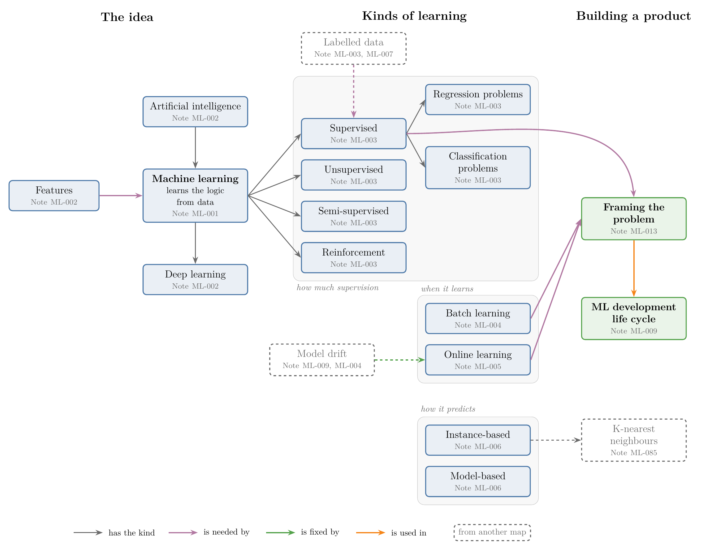{width=100%}

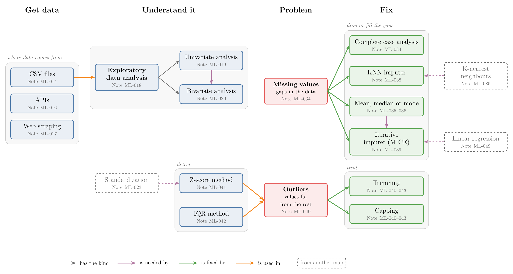{width=100%}

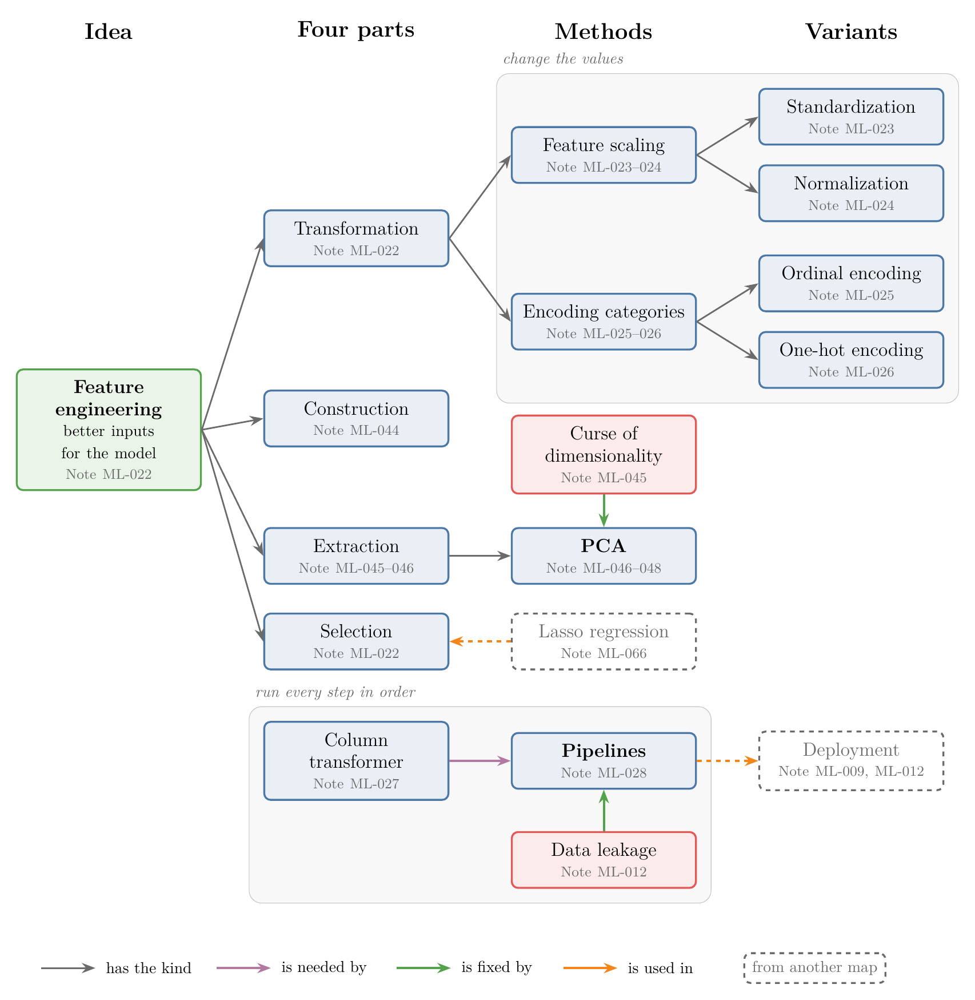{width=100%}

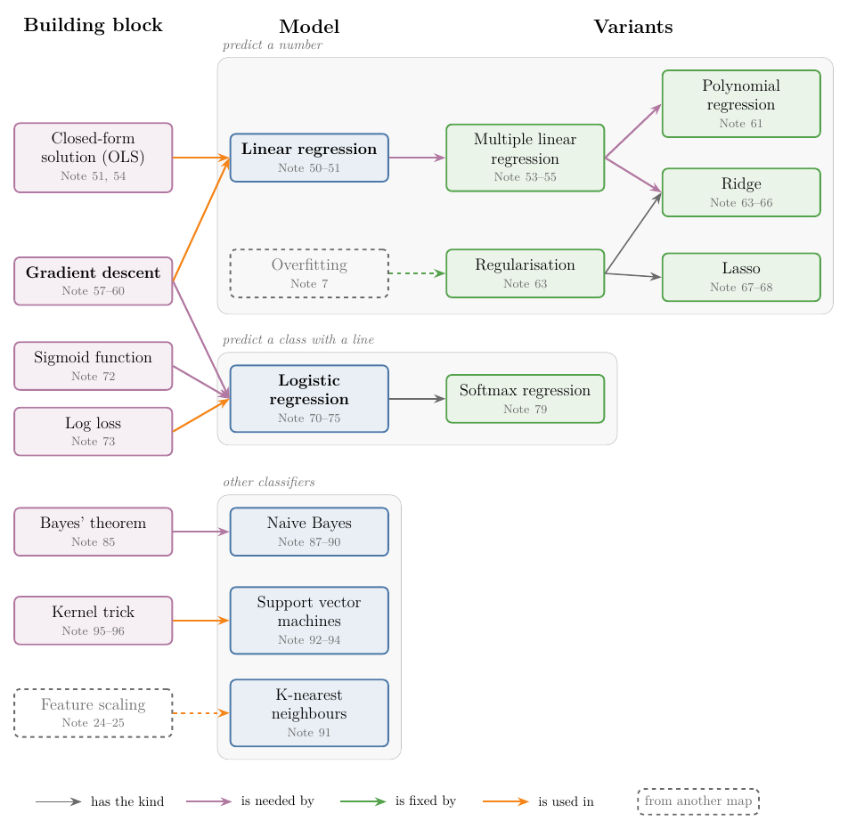{width=100%}

{width=100%}

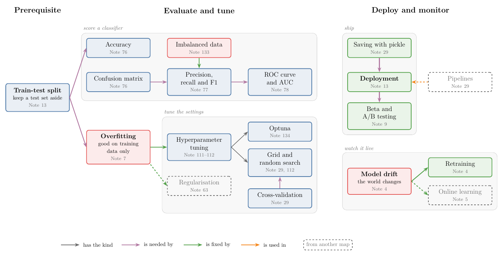{width=100%}

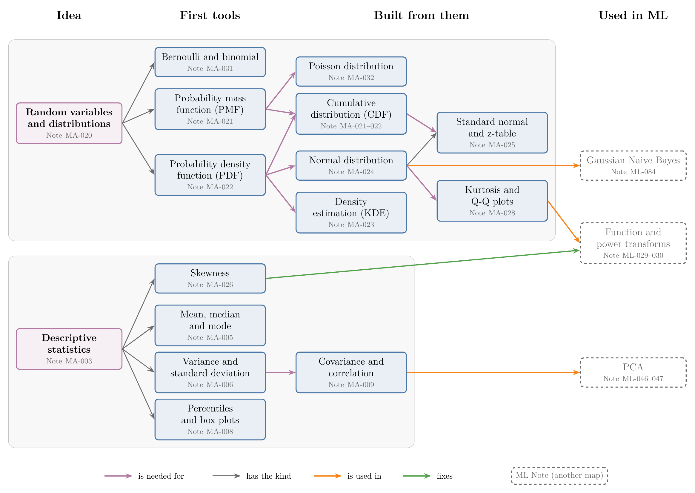{width=100%}

{width=100%}

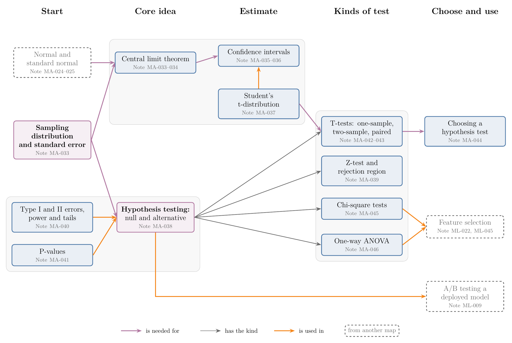{width=100%}

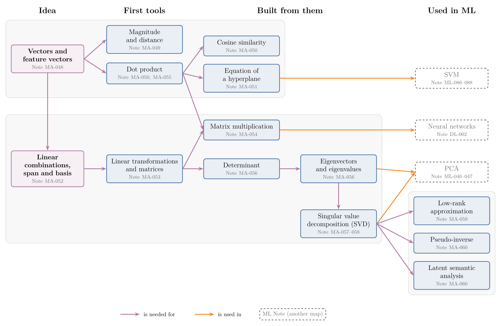{width=100%}

{width=100%}

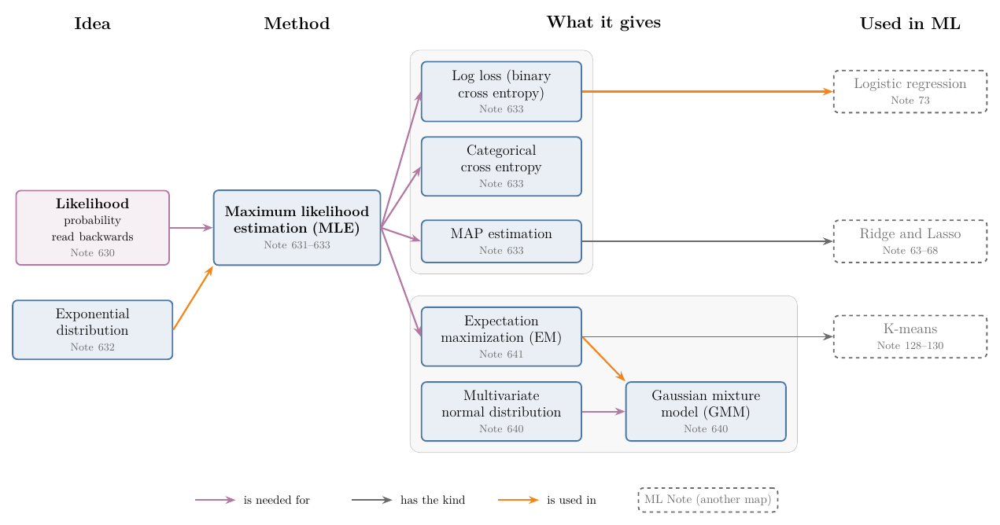{width=100%}

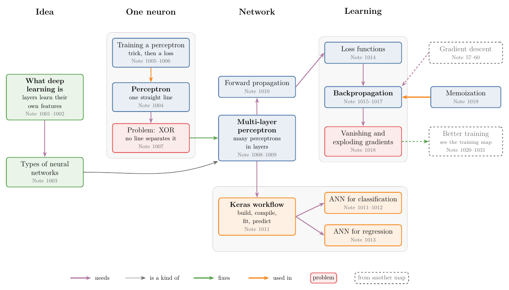{width=100%}

{width=100%}

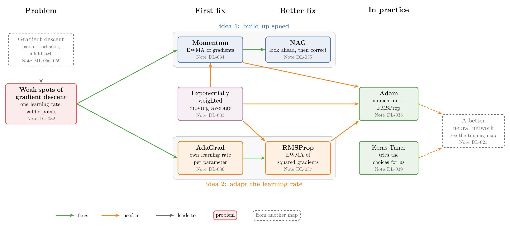{width=100%}

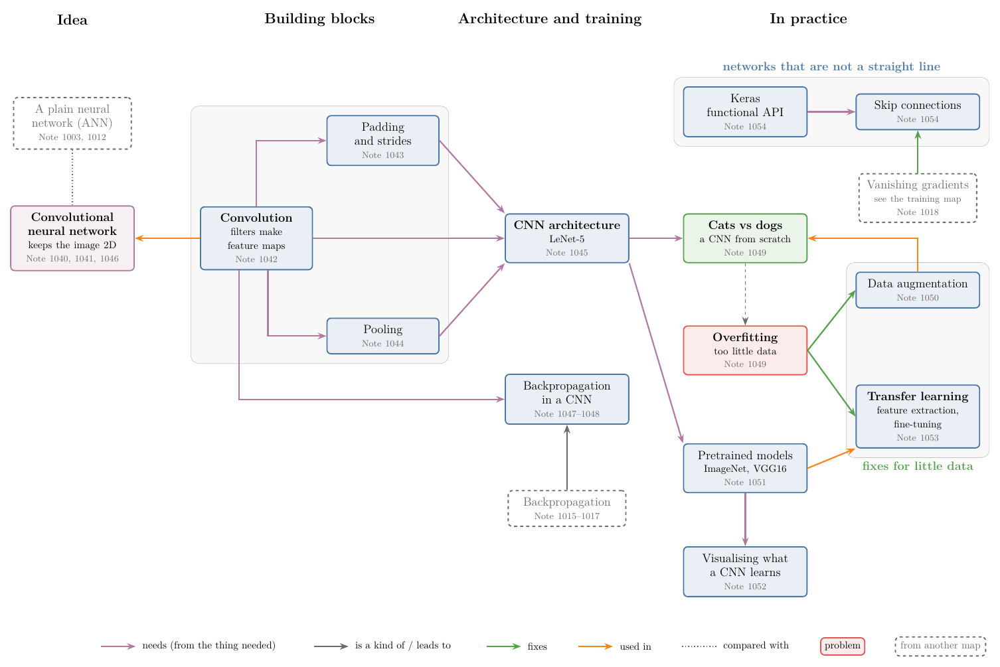{width=100%}

{width=100%}

{width=100%}

## 4. The Learning path

> **Key point:** Before each Note, read the Notes it builds on.

A Note is easiest to read when the ideas it uses are already familiar. The Notes that teach those ideas are its **prerequisites**: the Notes to read first. Each prerequisite has prerequisites of its own, so the reading order grows backwards from the Note we want, one round at a time.

Figure 20 builds the reading order for the perceptron Note (Note DL-004) step by step:

1. **Goal.** We want to read Note DL-004.
2. **Round 1.** Its *Where this fits* box lists Note ML-069, Note ML-071, Note MA-050 and Note MA-051 under "Builds on".
3. **Round 2.** Each of those has its own box: Note ML-069 builds on nothing new; Note ML-071 builds on Note ML-060, Note MA-067, Note MA-072; Note MA-050 builds on Note MA-048; Note MA-051 builds on nothing new.
4. **Reading.** Read the picture from left to right: green Notes first, then blue, then the goal. Every arrow points from a Note to a Note that needs it.

The same list opens every Note, in its *Where this fits* box ("Builds on"). The list comes from the **needs**, **is a kind of**, **fixes** and **used in** Links of section 3.

**The Course order** below puts the whole course in one reading order. The ML and DL Notes keep their order; each maths Note comes just before the first Note that needs it, together with the maths it builds on. Every Note comes after all the Notes it builds on. The order is cut into Stages, one per ML or DL Chapter.

### 4.1 Stage 1: Why maths, and what ML is

1. [MA-001 The Role of Mathematics in Machine Learning](../MA/00-why-maths/MA-001-role-of-maths-in-ml/MA-001-role-of-maths-in-ml.md)
1. [MA-002 How to Learn the Mathematics of Machine Learning](../MA/00-why-maths/MA-002-learning-maths-for-ml/MA-002-learning-maths-for-ml.md)
1. [ML-001 What is Machine Learning?](../ML/01-foundations/ML-001-what-is-ml/ML-001-what-is-ml.md)
1. [ML-002 AI vs ML vs DL](../ML/01-foundations/ML-002-ai-vs-ml-vs-dl/ML-002-ai-vs-ml-vs-dl.md)
1. [ML-003 Types of Machine Learning](../ML/01-foundations/ML-003-types-of-ml/ML-003-types-of-ml.md)
1. [ML-004 Batch (Offline) Machine Learning](../ML/01-foundations/ML-004-batch-learning/ML-004-batch-learning.md)
1. [ML-005 Online Machine Learning](../ML/01-foundations/ML-005-online-learning/ML-005-online-learning.md)
1. [ML-006 Instance-Based vs Model-Based Learning](../ML/01-foundations/ML-006-instance-vs-model-based/ML-006-instance-vs-model-based.md)
1. [ML-007 Challenges in Machine Learning](../ML/01-foundations/ML-007-challenges-in-ml/ML-007-challenges-in-ml.md)
1. [ML-008 Applications of Machine Learning](../ML/01-foundations/ML-008-applications-of-ml/ML-008-applications-of-ml.md)

### 4.2 Stage 2: Describing data, then the ML life cycle

1. [MA-004 What Is Statistics: Population, Sample and Types of Data](../MA/01-descriptive-stats/MA-004-what-is-statistics/MA-004-what-is-statistics.md)
1. [MA-005 Measures of Central Tendency](../MA/01-descriptive-stats/MA-005-measures-of-central-tendency/MA-005-measures-of-central-tendency.md)
1. [MA-006 Measures of Dispersion](../MA/01-descriptive-stats/MA-006-measures-of-dispersion/MA-006-measures-of-dispersion.md)
1. [MA-007 Frequency Tables and Graphs by Data Type](../MA/01-descriptive-stats/MA-007-frequency-tables-and-graphs/MA-007-frequency-tables-and-graphs.md)
1. [MA-008 Percentiles, the Five-Number Summary and Box Plots](../MA/01-descriptive-stats/MA-008-percentiles-and-box-plots/MA-008-percentiles-and-box-plots.md)
1. [MA-009 Covariance and Correlation](../MA/01-descriptive-stats/MA-009-covariance-and-correlation/MA-009-covariance-and-correlation.md)
1. [ML-009 Machine Learning Development Life Cycle (MLDLC)](../ML/01-foundations/ML-009-mldlc/ML-009-mldlc.md)

### 4.3 Stage 3: Vectors, tensors and tools

1. [MA-047 Linear Algebra Roadmap for Machine Learning](../MA/05-linear-algebra/MA-047-linear-algebra-roadmap/MA-047-linear-algebra-roadmap.md)
1. [MA-048 Vectors and Feature Vectors](../MA/05-linear-algebra/MA-048-vectors-and-feature-vectors/MA-048-vectors-and-feature-vectors.md)
1. [MA-049 Magnitude, Distance and Scalar Operations on Vectors](../MA/05-linear-algebra/MA-049-magnitude-distance-and-scalar-operations/MA-049-magnitude-distance-and-scalar-operations.md)
1. [MA-050 Dot Product and Cosine Similarity](../MA/05-linear-algebra/MA-050-dot-product-and-cosine-similarity/MA-050-dot-product-and-cosine-similarity.md)
1. [MA-051 The Equation of a Hyperplane](../MA/05-linear-algebra/MA-051-equation-of-a-hyperplane/MA-051-equation-of-a-hyperplane.md)
1. [ML-010 Tensors](../ML/01-foundations/ML-010-tensors/ML-010-tensors.md)
1. [ML-011 Setting Up: conda, Jupyter and Google Colab](../ML/01-foundations/ML-011-setup-anaconda-jupyter-colab/ML-011-setup-anaconda-jupyter-colab.md)
1. [ML-012 End-to-End Toy Project: Predicting Placement](../ML/01-foundations/ML-012-toy-project/ML-012-toy-project.md)
1. [ML-013 How to Frame a Machine Learning Problem](../ML/01-foundations/ML-013-framing-ml-problem/ML-013-framing-ml-problem.md)

### 4.4 Stage 4: Getting and exploring data

1. [ML-014 Working with CSV Files](../ML/02-getting-data/ML-014-working-with-csv/ML-014-working-with-csv.md)
1. [ML-015 Working with JSON and SQL](../ML/02-getting-data/ML-015-working-with-json-and-sql/ML-015-working-with-json-and-sql.md)
1. [ML-016 Fetching Data From an API](../ML/02-getting-data/ML-016-fetching-data-from-api/ML-016-fetching-data-from-api.md)
1. [ML-017 Fetching Data with Web Scraping](../ML/02-getting-data/ML-017-web-scraping/ML-017-web-scraping.md)
1. [ML-018 Understanding Your Data: Seven First Questions](../ML/02-getting-data/ML-018-understanding-your-data/ML-018-understanding-your-data.md)
1. [ML-019 Univariate Analysis: Exploring One Column at a Time](../ML/02-getting-data/ML-019-univariate-analysis/ML-019-univariate-analysis.md)
1. [ML-020 EDA: Bivariate and Multivariate Analysis](../ML/02-getting-data/ML-020-bivariate-multivariate-analysis/ML-020-bivariate-multivariate-analysis.md)
1. [ML-021 Pandas Profiling: A Full EDA Report in One Line](../ML/02-getting-data/ML-021-pandas-profiling/ML-021-pandas-profiling.md)

### 4.5 Stage 5: Feature engineering 1: scaling and encoding

1. [ML-022 What is Feature Engineering](../ML/03-feature-engineering/ML-022-what-is-feature-engineering/ML-022-what-is-feature-engineering.md)
1. [ML-023 Feature Scaling: Standardization](../ML/03-feature-engineering/ML-023-standardization/ML-023-standardization.md)
1. [ML-024 Feature Scaling: Normalization](../ML/03-feature-engineering/ML-024-normalization/ML-024-normalization.md)
1. [ML-025 Encoding Categorical Data: Ordinal and Label Encoding](../ML/03-feature-engineering/ML-025-ordinal-label-encoding/ML-025-ordinal-label-encoding.md)
1. [ML-026 One-Hot Encoding: Handling Nominal Categorical Data](../ML/03-feature-engineering/ML-026-one-hot-encoding/ML-026-one-hot-encoding.md)
1. [ML-027 Column Transformer](../ML/03-feature-engineering/ML-027-column-transformer/ML-027-column-transformer.md)
1. [ML-028 Machine Learning Pipelines](../ML/03-feature-engineering/ML-028-pipelines/ML-028-pipelines.md)

### 4.6 Stage 6: Random variables and the shape of data

1. [MA-020 Random Variables and Probability Distributions](../MA/03-distributions/MA-020-random-variables-and-distributions/MA-020-random-variables-and-distributions.md)
1. [MA-022 Probability Density Function and the CDF of a Continuous Variable](../MA/03-distributions/MA-022-pdf-and-continuous-cdf/MA-022-pdf-and-continuous-cdf.md)
1. [MA-021 Probability Mass Function and the CDF of a Discrete Variable](../MA/03-distributions/MA-021-pmf-and-discrete-cdf/MA-021-pmf-and-discrete-cdf.md)
1. [MA-024 The Normal Distribution](../MA/03-distributions/MA-024-normal-distribution/MA-024-normal-distribution.md)
1. [MA-025 The Standard Normal Distribution and the Z-table](../MA/03-distributions/MA-025-standard-normal-and-z-table/MA-025-standard-normal-and-z-table.md)
1. [MA-012 Random Variables as Functions, Expected Value and Variance](../MA/02-probability/MA-012-expected-value-and-variance/MA-012-expected-value-and-variance.md)
1. [MA-003 Statistics Roadmap for Machine Learning](../MA/01-descriptive-stats/MA-003-statistics-roadmap/MA-003-statistics-roadmap.md)
1. [MA-023 Density Estimation: Parametric and Kernel Density Estimation](../MA/03-distributions/MA-023-density-estimation-kde/MA-023-density-estimation-kde.md)
1. [MA-026 Skewness in Depth](../MA/03-distributions/MA-026-skewness/MA-026-skewness.md)
1. [MA-027 PDFs and CDFs in Data Analysis](../MA/03-distributions/MA-027-pdf-and-cdf-in-practice/MA-027-pdf-and-cdf-in-practice.md)
1. [MA-028 Kurtosis and Checking Normality with Q-Q Plots](../MA/03-distributions/MA-028-kurtosis-and-qq-plots/MA-028-kurtosis-and-qq-plots.md)
1. [MA-029 Uniform and Log-normal Distributions](../MA/03-distributions/MA-029-uniform-and-log-normal/MA-029-uniform-and-log-normal.md)
1. [MA-030 Pareto Distribution and Power Laws](../MA/03-distributions/MA-030-pareto-and-power-law/MA-030-pareto-and-power-law.md)

### 4.7 Stage 7: Feature engineering 2: transforms, binning, dates

1. [ML-029 Function Transformer: Log, Reciprocal, Square and Square Root Transforms](../ML/03-feature-engineering/ML-029-function-transformer/ML-029-function-transformer.md)
1. [ML-030 Power Transformer: Box-Cox and Yeo-Johnson Transforms](../ML/03-feature-engineering/ML-030-power-transformer/ML-030-power-transformer.md)
1. [ML-031 Binning and Binarization: Equal Width, Equal Frequency and k-means Binning](../ML/03-feature-engineering/ML-031-binning-binarization/ML-031-binning-binarization.md)
1. [ML-032 Handling Mixed Variables](../ML/03-feature-engineering/ML-032-mixed-variables/ML-032-mixed-variables.md)
1. [ML-033 Handling Date and Time Variables](../ML/03-feature-engineering/ML-033-date-and-time/ML-033-date-and-time.md)

### 4.8 Stage 8: Missing data, outliers, the curse of dimensionality

1. [ML-034 Handling Missing Data: Complete Case Analysis](../ML/04-missing-data-and-outliers/ML-034-complete-case-analysis/ML-034-complete-case-analysis.md)
1. [ML-035 Handling Missing Data: Imputing Numerical Columns with SimpleImputer](../ML/04-missing-data-and-outliers/ML-035-imputing-numerical-data/ML-035-imputing-numerical-data.md)
1. [ML-036 Handling Missing Categorical Data: Most Frequent Value and Missing Category](../ML/04-missing-data-and-outliers/ML-036-missing-categorical-data/ML-036-missing-categorical-data.md)
1. [ML-037 Handling Missing Data: Random Sample Imputation, Missing Indicator and Automatic Imputer Selection](../ML/04-missing-data-and-outliers/ML-037-missing-indicator-random-sample/ML-037-missing-indicator-random-sample.md)
1. [ML-038 Handling Missing Data: KNN Imputer](../ML/04-missing-data-and-outliers/ML-038-knn-imputer/ML-038-knn-imputer.md)
1. [ML-039 Handling Missing Data: Iterative Imputer (MICE)](../ML/04-missing-data-and-outliers/ML-039-iterative-imputer-mice/ML-039-iterative-imputer-mice.md)
1. [ML-040 What are Outliers](../ML/04-missing-data-and-outliers/ML-040-what-are-outliers/ML-040-what-are-outliers.md)
1. [ML-041 Outlier Detection with the Z-score Method](../ML/04-missing-data-and-outliers/ML-041-outliers-zscore/ML-041-outliers-zscore.md)
1. [ML-042 Outlier Detection with the IQR Method](../ML/04-missing-data-and-outliers/ML-042-outliers-iqr/ML-042-outliers-iqr.md)
1. [ML-043 Outlier Detection with the Percentile Method and Winsorization](../ML/04-missing-data-and-outliers/ML-043-outliers-percentile/ML-043-outliers-percentile.md)
1. [ML-044 Feature Construction and Feature Splitting](../ML/05-dimensionality/ML-044-feature-construction-splitting/ML-044-feature-construction-splitting.md)
1. [ML-045 Curse of Dimensionality](../ML/05-dimensionality/ML-045-curse-of-dimensionality/ML-045-curse-of-dimensionality.md)

### 4.9 Stage 9: Probability basics and discrete distributions

1. [MA-010 Random Experiments, Sample Spaces and Types of Events](../MA/02-probability/MA-010-events-and-types-of-events/MA-010-events-and-types-of-events.md)
1. [MA-011 Empirical and Theoretical Probability](../MA/02-probability/MA-011-empirical-and-theoretical-probability/MA-011-empirical-and-theoretical-probability.md)
1. [MA-013 Venn Diagrams and Contingency Tables](../MA/02-probability/MA-013-venn-diagrams-and-contingency-tables/MA-013-venn-diagrams-and-contingency-tables.md)
1. [MA-014 Joint, Marginal and Conditional Probability](../MA/02-probability/MA-014-joint-marginal-conditional-probability/MA-014-joint-marginal-conditional-probability.md)
1. [MA-031 Bernoulli and Binomial Distributions](../MA/03-distributions/MA-031-bernoulli-and-binomial/MA-031-bernoulli-and-binomial.md)
1. [MA-032 The Poisson Distribution](../MA/03-distributions/MA-032-poisson-distribution/MA-032-poisson-distribution.md)

### 4.10 Stage 10: Inference: confidence intervals and hypothesis tests

1. [MA-033 Sampling Distributions and the Central Limit Theorem](../MA/04-inference/MA-033-sampling-distribution-and-clt/MA-033-sampling-distribution-and-clt.md)
1. [MA-034 Estimating a Population Mean with the Central Limit Theorem](../MA/04-inference/MA-034-estimating-a-mean-with-the-clt/MA-034-estimating-a-mean-with-the-clt.md)
1. [MA-035 Confidence Intervals and the Z-procedure](../MA/04-inference/MA-035-confidence-intervals-z-procedure/MA-035-confidence-intervals-z-procedure.md)
1. [MA-036 Interpreting Confidence Intervals](../MA/04-inference/MA-036-interpreting-confidence-intervals/MA-036-interpreting-confidence-intervals.md)
1. [MA-037 Confidence Intervals with the T-procedure](../MA/04-inference/MA-037-t-procedure/MA-037-t-procedure.md)
1. [MA-038 Null and Alternative Hypotheses](../MA/04-inference/MA-038-null-and-alternative-hypotheses/MA-038-null-and-alternative-hypotheses.md)
1. [MA-039 The Rejection Region Approach and the Z-test](../MA/04-inference/MA-039-rejection-region-and-z-test/MA-039-rejection-region-and-z-test.md)
1. [MA-040 Type I and Type II Errors, Power, and One- vs Two-tailed Tests](../MA/04-inference/MA-040-errors-power-and-tails/MA-040-errors-power-and-tails.md)
1. [MA-041 P-values](../MA/04-inference/MA-041-p-values/MA-041-p-values.md)
1. [MA-042 The One-sample T-test](../MA/04-inference/MA-042-one-sample-t-test/MA-042-one-sample-t-test.md)
1. [MA-043 Two-sample and Paired T-tests](../MA/04-inference/MA-043-two-sample-and-paired-t-tests/MA-043-two-sample-and-paired-t-tests.md)
1. [MA-044 Choosing a Hypothesis Test](../MA/04-inference/MA-044-choosing-a-hypothesis-test/MA-044-choosing-a-hypothesis-test.md)
1. [MA-045 Chi-square Tests](../MA/04-inference/MA-045-chi-square-tests/MA-045-chi-square-tests.md)
1. [MA-046 One-way ANOVA](../MA/04-inference/MA-046-one-way-anova/MA-046-one-way-anova.md)

### 4.11 Stage 11: Linear algebra 2 and PCA

1. [MA-052 Linear Combinations, Span and Basis](../MA/05-linear-algebra/MA-052-linear-combinations-span-and-basis/MA-052-linear-combinations-span-and-basis.md)
1. [MA-053 Linear Transformations and Matrices](../MA/05-linear-algebra/MA-053-linear-transformations-and-matrices/MA-053-linear-transformations-and-matrices.md)
1. [MA-054 Matrix Multiplication as Composition](../MA/05-linear-algebra/MA-054-matrix-multiplication-as-composition/MA-054-matrix-multiplication-as-composition.md)
1. [MA-055 The Dot Product as Projection, and Duality](../MA/05-linear-algebra/MA-055-dot-product-and-duality/MA-055-dot-product-and-duality.md)
1. [MA-056 Eigenvectors and Eigenvalues in Depth](../MA/05-linear-algebra/MA-056-eigenvectors-and-eigenvalues/MA-056-eigenvectors-and-eigenvalues.md)
1. [MA-057 Singular Value Decomposition: Rotate, Stretch, Rotate](../MA/05-linear-algebra/MA-057-svd-geometry/MA-057-svd-geometry.md)
1. [MA-058 Computing the SVD by Hand](../MA/05-linear-algebra/MA-058-computing-the-svd/MA-058-computing-the-svd.md)
1. [MA-059 Low-Rank Approximation with the SVD](../MA/05-linear-algebra/MA-059-low-rank-approximation/MA-059-low-rank-approximation.md)
1. [ML-046 PCA: Geometric Intuition](../ML/05-dimensionality/ML-046-pca-geometric-intuition/ML-046-pca-geometric-intuition.md)
1. [ML-047 PCA: Problem Formulation and Step-by-Step Solution](../ML/05-dimensionality/ML-047-pca-step-by-step/ML-047-pca-step-by-step.md)
1. [ML-048 PCA in Practice: MNIST](../ML/05-dimensionality/ML-048-pca-mnist/ML-048-pca-mnist.md)
1. [MA-060 The SVD in Machine Learning](../MA/05-linear-algebra/MA-060-svd-in-machine-learning/MA-060-svd-in-machine-learning.md)

### 4.12 Stage 12: Linear regression

1. [ML-049 Simple Linear Regression: Intuition and Code](../ML/06-regression/ML-049-simple-linear-regression/ML-049-simple-linear-regression.md)
1. [ML-050 Simple Linear Regression: The Mathematics from Scratch](../ML/06-regression/ML-050-linear-regression-maths/ML-050-linear-regression-maths.md)
1. [ML-051 Regression Metrics: MAE, MSE, RMSE, R² and Adjusted R²](../ML/06-regression/ML-051-regression-metrics/ML-051-regression-metrics.md)
1. [ML-052 Multiple Linear Regression: Geometric Intuition and Code](../ML/06-regression/ML-052-multiple-linear-regression/ML-052-multiple-linear-regression.md)

### 4.13 Stage 13: Calculus: derivatives, gradients, Hessian, convexity

1. [MA-061 Derivatives of One Variable](../MA/06-calculus/MA-061-derivatives-of-one-variable/MA-061-derivatives-of-one-variable.md)
1. [MA-062 Partial Derivatives and Gradients](../MA/06-calculus/MA-062-partial-derivatives-and-gradients/MA-062-partial-derivatives-and-gradients.md)
1. [MA-063 The Jacobian and Gradients of Matrices](../MA/06-calculus/MA-063-jacobian-and-matrix-gradients/MA-063-jacobian-and-matrix-gradients.md)
1. [MA-064 The Hessian and Multivariate Taylor Series](../MA/06-calculus/MA-064-hessian-and-multivariate-taylor/MA-064-hessian-and-multivariate-taylor.md)
1. [MA-065 Convex and Non-Convex Cost Functions](../MA/07-optimisation/MA-065-convex-and-non-convex-cost-functions/MA-065-convex-and-non-convex-cost-functions.md)

### 4.14 Stage 14: Normal equation, gradient descent, bias-variance

1. [ML-053 Multiple Linear Regression: The Normal Equation](../ML/06-regression/ML-053-multiple-lr-maths/ML-053-multiple-lr-maths.md)
1. [ML-054 Multiple Linear Regression: Code from Scratch](../ML/06-regression/ML-054-multiple-lr-code/ML-054-multiple-lr-code.md)
1. [ML-055 The Five Assumptions of Linear Regression](../ML/06-regression/ML-055-linear-regression-assumptions/ML-055-linear-regression-assumptions.md)
1. [ML-056 Gradient Descent from Scratch](../ML/06-regression/ML-056-gradient-descent/ML-056-gradient-descent.md)
1. [ML-057 Batch Gradient Descent](../ML/06-regression/ML-057-batch-gradient-descent/ML-057-batch-gradient-descent.md)
1. [ML-058 Stochastic Gradient Descent](../ML/06-regression/ML-058-stochastic-gradient-descent/ML-058-stochastic-gradient-descent.md)
1. [ML-059 Mini-Batch Gradient Descent](../ML/06-regression/ML-059-mini-batch-gradient-descent/ML-059-mini-batch-gradient-descent.md)
1. [ML-060 Polynomial Regression](../ML/06-regression/ML-060-polynomial-regression/ML-060-polynomial-regression.md)
1. [ML-061 The Bias-Variance Trade-off](../ML/06-regression/ML-061-bias-variance/ML-061-bias-variance.md)

### 4.15 Stage 15: Maths before ridge: constraints, Bayes, likelihood

1. [MA-066 Constrained Optimisation and Lagrange Multipliers](../MA/07-optimisation/MA-066-lagrange-multipliers/MA-066-lagrange-multipliers.md)
1. [MA-067 Convex Sets, Convex Functions and Convex Optimisation](../MA/07-optimisation/MA-067-convex-sets-and-functions/MA-067-convex-sets-and-functions.md)
1. [MA-015 Naive Bayes Foundations: Conditional Probability](../MA/02-probability/MA-015-conditional-probability/MA-015-conditional-probability.md)
1. [MA-016 Naive Bayes Foundations: Independent Events](../MA/02-probability/MA-016-independent-events/MA-016-independent-events.md)
1. [MA-017 Naive Bayes Foundations: Mutually Exclusive Events](../MA/02-probability/MA-017-mutually-exclusive-events/MA-017-mutually-exclusive-events.md)
1. [MA-018 Naive Bayes Foundations: Bayes' Theorem](../MA/02-probability/MA-018-bayes-theorem/MA-018-bayes-theorem.md)
1. [MA-019 Naive Bayes Foundations: A Bayes' Theorem Problem](../MA/02-probability/MA-019-bayes-problem/MA-019-bayes-problem.md)
1. [MA-069 Probability vs Likelihood](../MA/08-likelihood/MA-069-probability-vs-likelihood/MA-069-probability-vs-likelihood.md)
1. [MA-070 Maximum Likelihood Estimation](../MA/08-likelihood/MA-070-maximum-likelihood-estimation/MA-070-maximum-likelihood-estimation.md)
1. [MA-071 MLE for the Binomial, Exponential and Normal Distributions](../MA/08-likelihood/MA-071-mle-for-common-distributions/MA-071-mle-for-common-distributions.md)
1. [MA-072 Maximum Likelihood in Machine Learning: Losses and Priors](../MA/08-likelihood/MA-072-mle-in-machine-learning/MA-072-mle-in-machine-learning.md)

### 4.16 Stage 16: Regularisation: ridge, lasso, elastic net

1. [ML-062 Ridge Regression: Regularisation and Intuition](../ML/06-regression/ML-062-ridge-regression-intuition/ML-062-ridge-regression-intuition.md)
1. [ML-063 Ridge Regression: The Maths and Code from Scratch](../ML/06-regression/ML-063-ridge-regression-maths/ML-063-ridge-regression-maths.md)
1. [ML-064 Ridge Regression with Gradient Descent](../ML/06-regression/ML-064-ridge-gradient-descent/ML-064-ridge-gradient-descent.md)
1. [ML-065 Ridge Regression: Five Key Points](../ML/06-regression/ML-065-ridge-key-points/ML-065-ridge-key-points.md)
1. [ML-066 Lasso Regression](../ML/06-regression/ML-066-lasso-regression/ML-066-lasso-regression.md)
1. [ML-067 Why Lasso Creates Sparsity](../ML/06-regression/ML-067-lasso-sparsity/ML-067-lasso-sparsity.md)
1. [ML-068 Elastic Net Regression](../ML/06-regression/ML-068-elastic-net/ML-068-elastic-net.md)

### 4.17 Stage 17: Logistic regression and classification metrics

1. [ML-069 Logistic Regression: The Perceptron Trick](../ML/07-classification/ML-069-perceptron-trick/ML-069-perceptron-trick.md)
1. [ML-070 The Perceptron Trick in Code](../ML/07-classification/ML-070-perceptron-code/ML-070-perceptron-code.md)
1. [ML-071 Logistic Regression: The Sigmoid Function](../ML/07-classification/ML-071-sigmoid-function/ML-071-sigmoid-function.md)
1. [ML-072 Logistic Regression: Maximum Likelihood and the Log Loss](../ML/07-classification/ML-072-log-loss/ML-072-log-loss.md)
1. [ML-073 The Derivative of the Sigmoid Function](../ML/07-classification/ML-073-sigmoid-derivative/ML-073-sigmoid-derivative.md)
1. [ML-074 Logistic Regression: Gradient Descent and Code from Scratch](../ML/07-classification/ML-074-logistic-gradient-descent/ML-074-logistic-gradient-descent.md)
1. [ML-075 Classification Metrics: Accuracy and the Confusion Matrix](../ML/07-classification/ML-075-accuracy-confusion-matrix/ML-075-accuracy-confusion-matrix.md)
1. [ML-076 Classification Metrics: Precision, Recall and F1 Score](../ML/07-classification/ML-076-precision-recall-f1/ML-076-precision-recall-f1.md)
1. [ML-077 Classification Metrics: The ROC Curve and AUC](../ML/07-classification/ML-077-roc-auc/ML-077-roc-auc.md)
1. [ML-078 Softmax Regression (Multinomial Logistic Regression)](../ML/07-classification/ML-078-softmax-regression/ML-078-softmax-regression.md)
1. [ML-079 Polynomial Features in Logistic Regression](../ML/07-classification/ML-079-polynomial-logistic-regression/ML-079-polynomial-logistic-regression.md)
1. [ML-080 Logistic Regression Hyperparameters](../ML/07-classification/ML-080-logistic-hyperparameters/ML-080-logistic-hyperparameters.md)

### 4.18 Stage 18: Naive Bayes, KNN and SVM

1. [ML-081 Naive Bayes: The Intuition](../ML/07-classification/ML-081-naive-bayes-intuition/ML-081-naive-bayes-intuition.md)
1. [ML-082 Naive Bayes: The Mathematics](../ML/07-classification/ML-082-naive-bayes-maths/ML-082-naive-bayes-maths.md)
1. [ML-083 Naive Bayes: A Worked Example in Code](../ML/07-classification/ML-083-naive-bayes-code/ML-083-naive-bayes-code.md)
1. [ML-084 Naive Bayes with Numerical Data: Gaussian Naive Bayes](../ML/07-classification/ML-084-gaussian-naive-bayes/ML-084-gaussian-naive-bayes.md)
1. [ML-085 K-Nearest Neighbours (KNN)](../ML/07-classification/ML-085-knn/ML-085-knn.md)
1. [MA-068 Linear and Quadratic Programming](../MA/07-optimisation/MA-068-linear-and-quadratic-programming/MA-068-linear-and-quadratic-programming.md)
1. [ML-086 Support Vector Machines: The Geometric Intuition](../ML/07-classification/ML-086-svm-intuition/ML-086-svm-intuition.md)
1. [ML-087 The Mathematics of SVM: Hard Margin](../ML/07-classification/ML-087-svm-maths/ML-087-svm-maths.md)
1. [ML-088 Soft-Margin SVM: Slack, Hinge Loss and C](../ML/07-classification/ML-088-svm-soft-margin/ML-088-svm-soft-margin.md)
1. [ML-089 The Kernel Trick: Intuition](../ML/07-classification/ML-089-kernel-trick-intuition/ML-089-kernel-trick-intuition.md)
1. [ML-090 The Kernel Trick in Code](../ML/07-classification/ML-090-kernel-trick-code/ML-090-kernel-trick-code.md)

### 4.19 Stage 19: Decision trees

1. [ML-091 Decision Trees: Geometric Intuition, Entropy, Information Gain and Gini](../ML/08-trees-and-ensembles/ML-091-decision-trees-intuition/ML-091-decision-trees-intuition.md)
1. [ML-092 Decision Tree Hyperparameters: Overfitting and Underfitting](../ML/08-trees-and-ensembles/ML-092-decision-tree-hyperparameters/ML-092-decision-tree-hyperparameters.md)
1. [ML-093 Regression Trees](../ML/08-trees-and-ensembles/ML-093-regression-trees/ML-093-regression-trees.md)
1. [ML-094 Visualising Decision Trees with dtreeviz](../ML/08-trees-and-ensembles/ML-094-dtreeviz/ML-094-dtreeviz.md)

### 4.20 Stage 20: Voting, bagging and random forest

1. [ML-095 Introduction to Ensemble Learning](../ML/08-trees-and-ensembles/ML-095-ensemble-learning/ML-095-ensemble-learning.md)
1. [ML-096 Voting Ensemble: Why Majority Voting Works](../ML/08-trees-and-ensembles/ML-096-voting-ensemble/ML-096-voting-ensemble.md)
1. [ML-097 Voting Classifier: Hard and Soft Voting](../ML/08-trees-and-ensembles/ML-097-voting-classifier/ML-097-voting-classifier.md)
1. [ML-098 Voting Regressor](../ML/08-trees-and-ensembles/ML-098-voting-regressor/ML-098-voting-regressor.md)
1. [ML-099 Bagging: Bootstrap Aggregation](../ML/08-trees-and-ensembles/ML-099-bagging-intuition/ML-099-bagging-intuition.md)
1. [ML-100 Bagging Classifier](../ML/08-trees-and-ensembles/ML-100-bagging-classifier/ML-100-bagging-classifier.md)
1. [ML-101 Bagging Regressor](../ML/08-trees-and-ensembles/ML-101-bagging-regressor/ML-101-bagging-regressor.md)
1. [ML-102 Introduction to Random Forest](../ML/08-trees-and-ensembles/ML-102-random-forest-intro/ML-102-random-forest-intro.md)
1. [ML-103 Why Random Forests Work: Bias and Variance](../ML/08-trees-and-ensembles/ML-103-random-forest-bias-variance/ML-103-random-forest-bias-variance.md)
1. [ML-104 Bagging vs Random Forest](../ML/08-trees-and-ensembles/ML-104-bagging-vs-random-forest/ML-104-bagging-vs-random-forest.md)
1. [ML-105 Random Forest Hyperparameters](../ML/08-trees-and-ensembles/ML-105-random-forest-hyperparameters/ML-105-random-forest-hyperparameters.md)
1. [ML-106 Tuning a Random Forest: GridSearchCV and RandomizedSearchCV](../ML/08-trees-and-ensembles/ML-106-random-forest-tuning/ML-106-random-forest-tuning.md)
1. [ML-107 OOB Score: Out-of-Bag Evaluation](../ML/08-trees-and-ensembles/ML-107-oob-score/ML-107-oob-score.md)
1. [ML-108 Feature Importance with Decision Trees and Random Forests](../ML/08-trees-and-ensembles/ML-108-feature-importance/ML-108-feature-importance.md)

### 4.21 Stage 21: Boosting and stacking

1. [ML-109 AdaBoost: How It Works](../ML/08-trees-and-ensembles/ML-109-adaboost-intuition/ML-109-adaboost-intuition.md)
1. [ML-110 AdaBoost Step by Step](../ML/08-trees-and-ensembles/ML-110-adaboost-step-by-step/ML-110-adaboost-step-by-step.md)
1. [ML-111 AdaBoost from Scratch in Python](../ML/08-trees-and-ensembles/ML-111-adaboost-from-scratch/ML-111-adaboost-from-scratch.md)
1. [ML-112 AdaBoost Hyperparameters and Tuning](../ML/08-trees-and-ensembles/ML-112-adaboost-hyperparameters/ML-112-adaboost-hyperparameters.md)
1. [ML-113 Bagging vs Boosting](../ML/08-trees-and-ensembles/ML-113-bagging-vs-boosting/ML-113-bagging-vs-boosting.md)
1. [ML-114 Gradient Boosting: the Intuition](../ML/08-trees-and-ensembles/ML-114-gradient-boosting-intuition/ML-114-gradient-boosting-intuition.md)
1. [ML-115 Gradient Boosting for Regression: the Maths](../ML/08-trees-and-ensembles/ML-115-gradient-boosting-regression-maths/ML-115-gradient-boosting-regression-maths.md)
1. [ML-116 Gradient Boosting for Classification](../ML/08-trees-and-ensembles/ML-116-gradient-boosting-classification/ML-116-gradient-boosting-classification.md)
1. [ML-117 Introduction to XGBoost](../ML/08-trees-and-ensembles/ML-117-xgboost-intro/ML-117-xgboost-intro.md)
1. [ML-118 XGBoost for Regression](../ML/08-trees-and-ensembles/ML-118-xgboost-regression/ML-118-xgboost-regression.md)
1. [ML-119 XGBoost for Classification](../ML/08-trees-and-ensembles/ML-119-xgboost-classification/ML-119-xgboost-classification.md)
1. [ML-120 The Maths Behind XGBoost](../ML/08-trees-and-ensembles/ML-120-xgboost-maths/ML-120-xgboost-maths.md)
1. [ML-121 Stacking and Blending](../ML/08-trees-and-ensembles/ML-121-stacking-blending/ML-121-stacking-blending.md)

### 4.22 Stage 22: Clustering, mixture models, imbalance and tuning

1. [ML-122 K-Means Clustering: How It Works](../ML/09-clustering-and-more/ML-122-kmeans-intuition/ML-122-kmeans-intuition.md)
1. [ML-123 K-Means in Python with scikit-learn](../ML/09-clustering-and-more/ML-123-kmeans-code/ML-123-kmeans-code.md)
1. [ML-124 K-Means from Scratch in Python](../ML/09-clustering-and-more/ML-124-kmeans-from-scratch/ML-124-kmeans-from-scratch.md)
1. [ML-125 Agglomerative Hierarchical Clustering](../ML/09-clustering-and-more/ML-125-hierarchical-clustering/ML-125-hierarchical-clustering.md)
1. [ML-126 DBSCAN: Density-Based Clustering](../ML/09-clustering-and-more/ML-126-dbscan/ML-126-dbscan.md)
1. [MA-073 Gaussian Mixture Models](../MA/08-likelihood/MA-073-gaussian-mixture-models/MA-073-gaussian-mixture-models.md)
1. [MA-074 The Expectation Maximization (EM) Algorithm](../MA/08-likelihood/MA-074-expectation-maximization/MA-074-expectation-maximization.md)
1. [ML-127 Imbalanced Data: Undersampling, Oversampling, SMOTE and Cost-Sensitive Learning](../ML/09-clustering-and-more/ML-127-imbalanced-data/ML-127-imbalanced-data.md)
1. [ML-128 Hyperparameter Tuning with Optuna: Bayesian Optimisation](../ML/09-clustering-and-more/ML-128-optuna/ML-128-optuna.md)

### 4.23 Stage 23: DL: perceptron to MLP

1. [DL-001 Deep Learning: What It Covers and What to Know First](../DL/01-basics/DL-001-dl-scope-and-prerequisites/DL-001-dl-scope-and-prerequisites.md)
1. [DL-002 What Is Deep Learning? Deep Learning vs Machine Learning](../DL/01-basics/DL-002-what-is-deep-learning/DL-002-what-is-deep-learning.md)
1. [DL-003 Types of Neural Networks, History and Applications of Deep Learning](../DL/01-basics/DL-003-nn-types-history-applications/DL-003-nn-types-history-applications.md)
1. [DL-004 The Perceptron: Model, Neuron and Geometry](../DL/01-basics/DL-004-perceptron/DL-004-perceptron.md)
1. [DL-005 Training a Perceptron with the Perceptron Trick](../DL/01-basics/DL-005-perceptron-trick/DL-005-perceptron-trick.md)
1. [DL-006 The Perceptron Loss Function and the Flexible Perceptron](../DL/01-basics/DL-006-perceptron-loss/DL-006-perceptron-loss.md)
1. [DL-007 The Problem with the Perceptron: Non-Linear Data](../DL/01-basics/DL-007-problem-with-perceptron/DL-007-problem-with-perceptron.md)
1. [DL-008 MLP Notation: Naming Weights, Biases and Outputs](../DL/01-basics/DL-008-mlp-notation/DL-008-mlp-notation.md)
1. [DL-009 Multi-Layer Perceptron: Why Stacking Perceptrons Bends the Boundary](../DL/01-basics/DL-009-mlp-intuition/DL-009-mlp-intuition.md)
1. [DL-010 Forward Propagation: How a Neural Network Predicts](../DL/01-basics/DL-010-forward-propagation/DL-010-forward-propagation.md)

### 4.24 Stage 24: DL: loss and backpropagation

1. [DL-011 Customer Churn Prediction with an ANN in Keras](../DL/01-basics/DL-011-customer-churn-ann/DL-011-customer-churn-ann.md)
1. [DL-012 Handwritten Digit Classification (MNIST) with an ANN in Keras](../DL/01-basics/DL-012-mnist-ann/DL-012-mnist-ann.md)
1. [DL-013 Graduate Admission Prediction with an ANN in Keras](../DL/01-basics/DL-013-graduate-admission-ann/DL-013-graduate-admission-ann.md)
1. [DL-014 Loss Functions in Deep Learning](../DL/01-basics/DL-014-dl-loss-functions/DL-014-dl-loss-functions.md)
1. [DL-015 Backpropagation, Part 1: What It Is](../DL/01-basics/DL-015-backpropagation-what/DL-015-backpropagation-what.md)
1. [DL-016 Backpropagation, Part 2: How It Runs in Code](../DL/01-basics/DL-016-backpropagation-how/DL-016-backpropagation-how.md)
1. [DL-017 Backpropagation, Part 3: Why the Update Works](../DL/01-basics/DL-017-backpropagation-why/DL-017-backpropagation-why.md)
1. [DL-018 Vanishing and Exploding Gradients](../DL/01-basics/DL-018-vanishing-exploding-gradients/DL-018-vanishing-exploding-gradients.md)
1. [DL-019 Memoization in Backpropagation](../DL/01-basics/DL-019-mlp-memoization/DL-019-mlp-memoization.md)

### 4.25 Stage 25: DL: training, regularisation, activations

1. [DL-020 Gradient Descent in Neural Networks: Batch, Stochastic and Mini-Batch](../DL/02-training/DL-020-gradient-descent-in-neural-networks/DL-020-gradient-descent-in-neural-networks.md)
1. [DL-021 How to Improve a Neural Network](../DL/02-training/DL-021-improving-a-neural-network/DL-021-improving-a-neural-network.md)
1. [DL-022 Early Stopping in Neural Networks](../DL/02-training/DL-022-early-stopping/DL-022-early-stopping.md)
1. [DL-023 Scaling the Inputs of a Neural Network](../DL/02-training/DL-023-data-scaling-in-ann/DL-023-data-scaling-in-ann.md)
1. [DL-024 Dropout](../DL/02-training/DL-024-dropout/DL-024-dropout.md)
1. [DL-025 Dropout in Code: Regression and Classification](../DL/02-training/DL-025-dropout-code/DL-025-dropout-code.md)
1. [DL-026 L1 and L2 Regularisation in Neural Networks](../DL/02-training/DL-026-regularization-in-dl/DL-026-regularization-in-dl.md)
1. [DL-027 Activation Functions: Sigmoid, Tanh and ReLU](../DL/02-training/DL-027-activation-functions/DL-027-activation-functions.md)
1. [DL-028 ReLU Variants: Leaky ReLU, PReLU, ELU and SELU](../DL/02-training/DL-028-relu-variants/DL-028-relu-variants.md)
1. [DL-029 Weight Initialisation: What Not to Do](../DL/02-training/DL-029-weight-initialization/DL-029-weight-initialization.md)
1. [DL-030 Xavier (Glorot) and He Initialisation](../DL/02-training/DL-030-xavier-he-initialization/DL-030-xavier-he-initialization.md)
1. [DL-031 Batch Normalisation](../DL/02-training/DL-031-batch-normalization/DL-031-batch-normalization.md)

### 4.26 Stage 26: DL: optimisers

1. [DL-032 Optimizers in Deep Learning: Why Gradient Descent Needs Help](../DL/03-optimizers/DL-032-optimizers-in-deep-learning/DL-032-optimizers-in-deep-learning.md)
1. [DL-033 Exponentially Weighted Moving Average (EWMA)](../DL/03-optimizers/DL-033-exponentially-weighted-moving-average/DL-033-exponentially-weighted-moving-average.md)
1. [DL-034 SGD with Momentum](../DL/03-optimizers/DL-034-sgd-with-momentum/DL-034-sgd-with-momentum.md)
1. [DL-035 Nesterov Accelerated Gradient (NAG)](../DL/03-optimizers/DL-035-nesterov-accelerated-gradient/DL-035-nesterov-accelerated-gradient.md)
1. [DL-036 AdaGrad: A Learning Rate for Every Parameter](../DL/03-optimizers/DL-036-adagrad/DL-036-adagrad.md)
1. [DL-037 RMSProp: AdaGrad That Forgets](../DL/03-optimizers/DL-037-rmsprop/DL-037-rmsprop.md)
1. [DL-038 Adam: Momentum and RMSProp Together](../DL/03-optimizers/DL-038-adam/DL-038-adam.md)
1. [DL-039 Hyperparameter Tuning a Neural Network with Keras Tuner](../DL/03-optimizers/DL-039-keras-tuner/DL-039-keras-tuner.md)

### 4.27 Stage 27: DL: convolutional networks

1. [DL-040 What a Convolutional Neural Network Is](../DL/04-cnn/DL-040-cnn-intuition/DL-040-cnn-intuition.md)
1. [DL-041 CNNs and the Visual Cortex: Where the Idea Came From](../DL/04-cnn/DL-041-cnn-vs-visual-cortex/DL-041-cnn-vs-visual-cortex.md)
1. [DL-042 The Convolution Operation](../DL/04-cnn/DL-042-convolution-operation/DL-042-convolution-operation.md)
1. [DL-043 Padding and Strides](../DL/04-cnn/DL-043-padding-and-strides/DL-043-padding-and-strides.md)
1. [DL-044 Pooling](../DL/04-cnn/DL-044-pooling/DL-044-pooling.md)
1. [DL-045 CNN Architecture and LeNet-5](../DL/04-cnn/DL-045-lenet-5/DL-045-lenet-5.md)
1. [DL-046 CNN versus ANN](../DL/04-cnn/DL-046-cnn-vs-ann/DL-046-cnn-vs-ann.md)
1. [DL-047 Backpropagation in a CNN, Part 1: The Setup and the Last Layer](../DL/04-cnn/DL-047-backpropagation-in-cnn/DL-047-backpropagation-in-cnn.md)
1. [DL-048 Backpropagation in a CNN, Part 2: Flatten, Max Pooling and Convolution](../DL/04-cnn/DL-048-backpropagation-cnn-layers/DL-048-backpropagation-cnn-layers.md)
1. [DL-049 Project: A Cat vs Dog Classifier with a CNN](../DL/04-cnn/DL-049-cat-vs-dog-cnn/DL-049-cat-vs-dog-cnn.md)
1. [DL-050 Data Augmentation](../DL/04-cnn/DL-050-data-augmentation/DL-050-data-augmentation.md)
1. [DL-051 Pretrained Models: ImageNet, ILSVRC and Keras](../DL/04-cnn/DL-051-pretrained-models/DL-051-pretrained-models.md)
1. [DL-052 What a CNN Sees: Visualising Filters and Feature Maps](../DL/04-cnn/DL-052-visualizing-cnn/DL-052-visualizing-cnn.md)
1. [DL-053 Transfer Learning: Feature Extraction and Fine-Tuning](../DL/04-cnn/DL-053-transfer-learning/DL-053-transfer-learning.md)
1. [DL-054 The Keras Functional API: Non-Linear Networks](../DL/04-cnn/DL-054-keras-functional-api/DL-054-keras-functional-api.md)

### 4.28 Stage 28: DL: RNN, LSTM, GRU

1. [DL-055 Why Recurrent Neural Networks Are Needed](../DL/05-rnn/DL-055-why-rnn/DL-055-why-rnn.md)
1. [DL-056 RNN Architecture and Forward Propagation](../DL/05-rnn/DL-056-rnn-forward-propagation/DL-056-rnn-forward-propagation.md)
1. [DL-057 Sentiment Analysis with an RNN in Keras](../DL/05-rnn/DL-057-rnn-sentiment-analysis/DL-057-rnn-sentiment-analysis.md)
1. [DL-058 Types of RNN](../DL/05-rnn/DL-058-types-of-rnn/DL-058-types-of-rnn.md)
1. [DL-059 Backpropagation Through Time](../DL/05-rnn/DL-059-backpropagation-through-time/DL-059-backpropagation-through-time.md)
1. [DL-060 Problems with RNNs: Long-Term Dependency and Unstable Gradients](../DL/05-rnn/DL-060-problems-with-rnn/DL-060-problems-with-rnn.md)
1. [DL-061 LSTM: The Core Idea](../DL/05-rnn/DL-061-lstm/DL-061-lstm.md)
1. [DL-062 LSTM Architecture: The Three Gates](../DL/05-rnn/DL-062-lstm-architecture/DL-062-lstm-architecture.md)
1. [DL-063 Next-Word Prediction with an LSTM](../DL/05-rnn/DL-063-lstm-next-word-prediction/DL-063-lstm-next-word-prediction.md)
1. [DL-064 Gated Recurrent Unit (GRU)](../DL/05-rnn/DL-064-gru/DL-064-gru.md)
1. [DL-065 Deep (Stacked) RNNs](../DL/05-rnn/DL-065-deep-rnns/DL-065-deep-rnns.md)
1. [DL-066 Bidirectional RNNs](../DL/05-rnn/DL-066-bidirectional-rnn/DL-066-bidirectional-rnn.md)

### 4.29 Stage 29: DL: attention and self-attention

1. [DL-067 From Encoder–Decoder to ChatGPT: A History of Large Language Models](../DL/06-transformers/DL-067-history-of-llms/DL-067-history-of-llms.md)
1. [DL-068 The Encoder–Decoder Architecture](../DL/06-transformers/DL-068-encoder-decoder/DL-068-encoder-decoder.md)
1. [DL-069 The Attention Mechanism](../DL/06-transformers/DL-069-attention-mechanism/DL-069-attention-mechanism.md)
1. [DL-070 Bahdanau Attention and Luong Attention](../DL/06-transformers/DL-070-bahdanau-vs-luong-attention/DL-070-bahdanau-vs-luong-attention.md)
1. [DL-071 Introduction to Transformers](../DL/06-transformers/DL-071-introduction-to-transformers/DL-071-introduction-to-transformers.md)
1. [DL-072 Meaning as Direction in Embedding Space](../DL/06-transformers/DL-072-meaning-as-direction/DL-072-meaning-as-direction.md)
1. [DL-073 What Is Self-Attention](../DL/06-transformers/DL-073-what-is-self-attention/DL-073-what-is-self-attention.md)
1. [DL-074 Self-Attention Step by Step](../DL/06-transformers/DL-074-self-attention-step-by-step/DL-074-self-attention-step-by-step.md)
1. [DL-075 Scaled Dot-Product Attention: Why Divide by the Square Root of d_k](../DL/06-transformers/DL-075-scaled-dot-product-attention/DL-075-scaled-dot-product-attention.md)
1. [DL-076 Self-Attention, Geometrically](../DL/06-transformers/DL-076-self-attention-geometric-intuition/DL-076-self-attention-geometric-intuition.md)
1. [DL-077 Why Self-Attention Is Called \"Self\"](../DL/06-transformers/DL-077-why-self-attention/DL-077-why-self-attention.md)
1. [DL-078 Multi-Head Attention](../DL/06-transformers/DL-078-multi-head-attention/DL-078-multi-head-attention.md)

### 4.30 Stage 30: DL: the transformer and GPT

1. [DL-079 Positional Encoding](../DL/06-transformers/DL-079-positional-encoding/DL-079-positional-encoding.md)
1. [DL-080 Layer Normalisation](../DL/06-transformers/DL-080-layer-normalization/DL-080-layer-normalization.md)
1. [DL-081 The Transformer Encoder](../DL/06-transformers/DL-081-transformer-encoder/DL-081-transformer-encoder.md)
1. [DL-082 Masked Self-Attention](../DL/06-transformers/DL-082-masked-self-attention/DL-082-masked-self-attention.md)
1. [DL-083 Cross-Attention](../DL/06-transformers/DL-083-cross-attention/DL-083-cross-attention.md)
1. [DL-084 The Transformer Decoder](../DL/06-transformers/DL-084-transformer-decoder/DL-084-transformer-decoder.md)
1. [DL-085 Transformer Inference](../DL/06-transformers/DL-085-transformer-inference/DL-085-transformer-inference.md)
1. [DL-086 The Transformer, End to End](../DL/06-transformers/DL-086-transformer-end-to-end/DL-086-transformer-end-to-end.md)
1. [DL-087 GPT: the Decoder-Only Transformer](../DL/06-transformers/DL-087-decoder-only-gpt/DL-087-decoder-only-gpt.md)
1. [DL-088 From the Last Vector to a Token: Unembedding, Logits and Sampling](../DL/06-transformers/DL-088-unembedding-and-sampling/DL-088-unembedding-and-sampling.md)
1. [DL-089 How the MLP Block Can Store a Fact](../DL/06-transformers/DL-089-mlp-stores-facts/DL-089-mlp-stores-facts.md)
1. [DL-090 Superposition: More Features than Dimensions](../DL/06-transformers/DL-090-superposition/DL-090-superposition.md)

## 5. The Algorithm chooser

> **Key point:** Two questions narrow the choice: do we have labelled outputs, and are they numbers or categories?

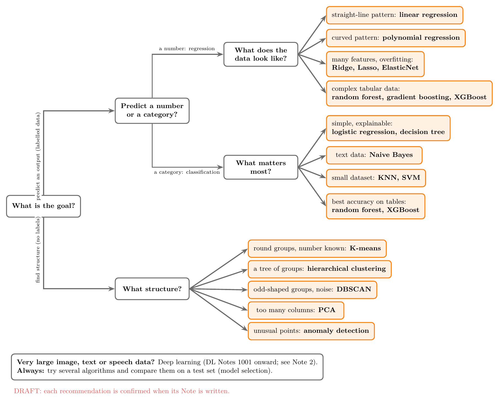

Figure 21 is a starting point, not a rule: in practice we try several suitable algorithms and compare them on a test set. It is a draft until the algorithm Notes are written.

## 6. Sources

**Built from**
- CampusX, "100 Days of Machine Learning", YouTube playlist (134 videos), https://www.youtube.com/playlist?list=PLKnIA16_Rmvbr7zKYQuBfsVkjoLcJgxHH
- CampusX, "100 Days of Deep Learning", YouTube playlist (84 videos), https://www.youtube.com/playlist?list=PLKnIA16_RmvYuZauWaPlRTC54KxSNLtNn
- CampusX, "Maths for Machine Learning", YouTube playlist (23 sessions), https://www.youtube.com/playlist?list=PLKnIA16_RmvbYFaaeLY28cWeqV-3vADST
- Every Note listed in the Learning path: each Note's own Sources name the video, book or paper it was built from.

**Other references**
- The Concept map data: `course_map/concepts.yaml` in this repository.

## 7. Key terms

| Term | Meaning |
|---|---|
| Course map (G-2160) | The overview that ties all Notes together, in four views |
| Pipeline map (G-2161) | Where each Concept sits among the 14 steps of an ML project |
| Concept map (G-2162) | How Concepts are connected by Links |
| Learning path (G-2163) | Which Notes to read before which |
| Algorithm chooser (G-2164) | A flowchart from a problem's properties to suitable algorithms |
| Concept (G-2165) | One idea on the Course map |
| Link (G-2166) | A labelled connection between two Concepts |
