## 1. Overview

> **Key point:** The Course map ties every Note together. It shows where each idea sits in an ML project, how ideas connect, what to read first, and which algorithm to choose.

The Notes each teach one lesson. The Course map shows how those lessons fit together, in four views:

| View | Question it answers |
|---|---|
| **Pipeline map** | Where does this idea sit in a real ML project? |
| **Concept map** | How is this idea connected to the others? |
| **Learning path** | Which Notes should I read first? |
| **Algorithm chooser** | Which algorithm suits my problem? |

Each idea on the map is a **Concept**. Concepts already taught in a written Note are **confirmed**; the others are **draft**, shown faint, and are checked against their source when their Note is written. So far, 335 of 335 Concepts are confirmed.

Every Note starts with a *Where this fits* box: a small Pipeline map with that Note's steps highlighted, plus what it builds on and what it leads to.

> **Extra:** This map is generated from one data file, `course_map/concepts.yaml`. An interactive version, where you can zoom, filter by step and click a Concept to see its links and Notes, runs with `python course_map/app.py`.

## 2. The Pipeline map

> **Key point:** Every ML project moves through the same steps, from framing the problem to monitoring the deployed model. Every Concept belongs to one step.

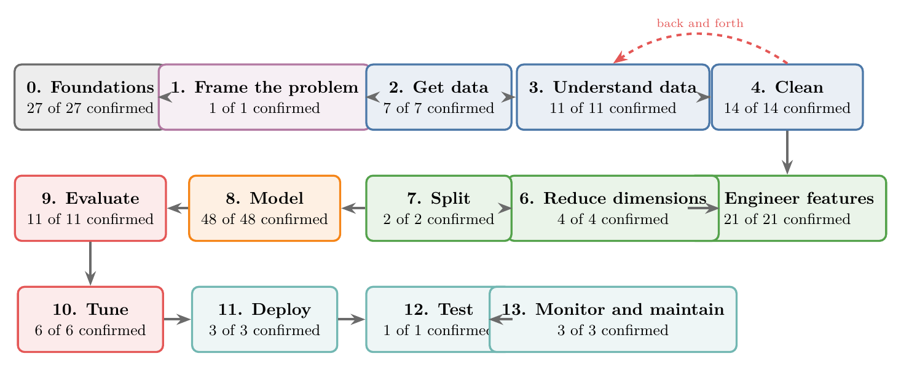

Figure 1 shows the 14 steps. They follow the ML development life cycle, or **MLDLC** (G-1240):

1. frame the problem;
2. get the data and understand it;
3. clean the data;
4. engineer features;
5. train and evaluate models;
6. tune them;
7. deploy, test and keep the model healthy.

Steps 3 (Understand data) and 4 (Clean) loop: exploring reveals what needs cleaning, and cleaning changes the data, so we explore again.

### 2.1 Step 0: Foundations

| Concept | Taught in | Status |
|---|---|---|
| Machine learning | [Note 1](../01-what-is-ml/note.md), [Note 2](../02-ai-vs-ml-vs-dl/note.md) | confirmed |
| Data mining | [Note 1](../01-what-is-ml/note.md), [Note 8](../08-applications-of-ml/note.md) | confirmed |
| Artificial intelligence | [Note 2](../02-ai-vs-ml-vs-dl/note.md) | confirmed |
| Symbolic AI and expert systems | [Note 2](../02-ai-vs-ml-vs-dl/note.md) | confirmed |
| Deep learning | [Note 2](../02-ai-vs-ml-vs-dl/note.md) | confirmed |
| Neural networks | [Note 2](../02-ai-vs-ml-vs-dl/note.md), [Note 1002](../1002-what-is-deep-learning/note.md) | confirmed |
| Features | [Note 2](../02-ai-vs-ml-vs-dl/note.md), [Note 11](../11-tensors/note.md) | confirmed |
| Supervised learning | [Note 3](../03-types-of-ml/note.md) | confirmed |
| Regression problems | [Note 3](../03-types-of-ml/note.md) | confirmed |
| Classification problems | [Note 3](../03-types-of-ml/note.md) | confirmed |
| Unsupervised learning | [Note 3](../03-types-of-ml/note.md) | confirmed |
| Semi-supervised learning | [Note 3](../03-types-of-ml/note.md) | confirmed |
| Reinforcement learning | [Note 3](../03-types-of-ml/note.md) | confirmed |
| Batch (offline) learning | [Note 4](../04-batch-learning/note.md) | confirmed |
| Online learning | [Note 5](../05-online-learning/note.md) | confirmed |
| Out-of-core learning | [Note 5](../05-online-learning/note.md) | confirmed |
| Instance-based learning | [Note 6](../06-instance-vs-model-based/note.md) | confirmed |
| Model-based learning | [Note 6](../06-instance-vs-model-based/note.md) | confirmed |
| Applications of ML | [Note 8](../08-applications-of-ml/note.md) | confirmed |
| ML development life cycle | [Note 9](../09-mldlc/note.md), [Note 13](../13-toy-project/note.md) | confirmed |
| Tensors | [Note 11](../11-tensors/note.md) | confirmed |
| Setup: conda, Jupyter and Colab | [Note 12](../12-setup-anaconda-jupyter-colab/note.md) | confirmed |
| Chi-square tests | [Note 29](../29-pipelines/note.md), [Note 571](../571-chi-square-tests/note.md) | confirmed |
| Vector magnitude, distance and scalar operations | [Note 39](../39-knn-imputer/note.md), [Note 361](../361-magnitude-distance-and-scalar-operations/note.md) | confirmed |
| Normal distribution | [Note 42](../42-outliers-zscore/note.md), [Note 90](../90-gaussian-naive-bayes/note.md), [Note 240](../240-random-variables-and-distributions/note.md), [Note 250](../250-normal-distribution/note.md), [Note 630](../630-probability-vs-likelihood/note.md) | confirmed |
| Eigenvectors and eigenvalues | [Note 48](../48-pca-step-by-step/note.md), [Note 530](../530-eigenvectors-and-eigenvalues/note.md) | confirmed |
| Dot product | [Note 48](../48-pca-step-by-step/note.md), [Note 362](../362-dot-product-and-cosine-similarity/note.md), [Note 520](../520-dot-product-and-duality/note.md) | confirmed |
| Linear transformations and matrices | [Note 48](../48-pca-step-by-step/note.md), [Note 500](../500-linear-transformations-and-matrices/note.md) | confirmed |
| Derivatives of one variable | [Note 51](../51-linear-regression-maths/note.md), [Note 600](../600-derivatives-of-one-variable/note.md) | confirmed |
| Equation of a hyperplane | [Note 53](../53-multiple-linear-regression/note.md), [Note 70](../70-perceptron-trick/note.md), [Note 363](../363-equation-of-a-hyperplane/note.md) | confirmed |
| Partial derivatives and gradients | [Note 57](../57-gradient-descent/note.md), [Note 601](../601-partial-derivatives-and-gradients/note.md) | confirmed |
| Conditional probability | [Note 82](../82-conditional-probability/note.md), [Note 341](../341-joint-marginal-conditional-probability/note.md) | confirmed |
| Independent and mutually exclusive events | [Note 83](../83-independent-events/note.md), [Note 84](../84-mutually-exclusive-events/note.md) | confirmed |
| Bayes' theorem | [Note 85](../85-bayes-theorem/note.md), [Note 86](../86-bayes-problem/note.md), [Note 341](../341-joint-marginal-conditional-probability/note.md) | confirmed |
| Bernoulli and binomial distributions | [Note 102](../102-voting-ensemble/note.md), [Note 241](../241-pmf-and-discrete-cdf/note.md), [Note 270](../270-bernoulli-and-binomial/note.md) | confirmed |
| Hessian and multivariate Taylor | [Note 126](../126-xgboost-maths/note.md), [Note 603](../603-hessian-and-multivariate-taylor/note.md) | confirmed |
| Taylor series | [Note 126](../126-xgboost-maths/note.md), [Note 600](../600-derivatives-of-one-variable/note.md), [Note 603](../603-hessian-and-multivariate-taylor/note.md) | confirmed |
| Probability distributions | [Note 210](../210-statistics-roadmap/note.md), [Note 240](../240-random-variables-and-distributions/note.md) | confirmed |
| Inferential statistics | [Note 210](../210-statistics-roadmap/note.md), [Note 220](../220-what-is-statistics/note.md) | confirmed |
| Population, sample, parameter and statistic | [Note 220](../220-what-is-statistics/note.md) | confirmed |
| Random variables | [Note 240](../240-random-variables-and-distributions/note.md) | confirmed |
| Probability mass function (PMF) | [Note 241](../241-pmf-and-discrete-cdf/note.md) | confirmed |
| Uniform distribution | [Note 241](../241-pmf-and-discrete-cdf/note.md), [Note 261](../261-uniform-and-log-normal/note.md) | confirmed |
| Log-normal distribution | [Note 242](../242-pdf-and-continuous-cdf/note.md), [Note 261](../261-uniform-and-log-normal/note.md) | confirmed |
| Poisson distribution | [Note 242](../242-pdf-and-continuous-cdf/note.md), [Note 560](../560-poisson-distribution/note.md) | confirmed |
| Standard normal and the z-table | [Note 251](../251-standard-normal-and-z-table/note.md) | confirmed |
| Pareto distribution and power laws | [Note 262](../262-pareto-and-power-law/note.md) | confirmed |
| Sampling distribution and standard error | [Note 271](../271-sampling-distribution-and-clt/note.md) | confirmed |
| Central limit theorem | [Note 271](../271-sampling-distribution-and-clt/note.md), [Note 272](../272-estimating-a-mean-with-the-clt/note.md) | confirmed |
| Confidence intervals | [Note 280](../280-confidence-intervals-z-procedure/note.md), [Note 281](../281-interpreting-confidence-intervals/note.md), [Note 282](../282-t-procedure/note.md) | confirmed |
| Student's t-distribution | [Note 282](../282-t-procedure/note.md) | confirmed |
| Hypothesis testing: null and alternative | [Note 290](../290-null-and-alternative-hypotheses/note.md), [Note 291](../291-rejection-region-and-z-test/note.md) | confirmed |
| Z-test and rejection regions | [Note 291](../291-rejection-region-and-z-test/note.md) | confirmed |
| Type I and II errors, power, tails | [Note 292](../292-errors-power-and-tails/note.md) | confirmed |
| P-values | [Note 300](../300-p-values/note.md) | confirmed |
| T-tests: one-sample, two-sample, paired | [Note 301](../301-one-sample-t-test/note.md), [Note 302](../302-two-sample-and-paired-t-tests/note.md), [Note 570](../570-choosing-a-hypothesis-test/note.md) | confirmed |
| Events and sample spaces | [Note 330](../330-events-and-types-of-events/note.md) | confirmed |
| Empirical vs theoretical probability, probability rules | [Note 331](../331-empirical-and-theoretical-probability/note.md), [Note 340](../340-venn-diagrams-and-contingency-tables/note.md) | confirmed |
| Expected value and variance of a random variable | [Note 332](../332-expected-value-and-variance/note.md) | confirmed |
| Venn diagrams and contingency tables | [Note 340](../340-venn-diagrams-and-contingency-tables/note.md) | confirmed |
| Joint and marginal probability | [Note 341](../341-joint-marginal-conditional-probability/note.md) | confirmed |
| Linear algebra roadmap | [Note 350](../350-linear-algebra-roadmap/note.md) | confirmed |
| Vectors and feature vectors | [Note 360](../360-vectors-and-feature-vectors/note.md) | confirmed |
| Role of mathematics in ML | [Note 440](../440-role-of-maths-in-ml/note.md) | confirmed |
| Linear combinations, span and basis | [Note 490](../490-linear-combinations-span-and-basis/note.md) | confirmed |
| Matrix multiplication as composition | [Note 510](../510-matrix-multiplication-as-composition/note.md) | confirmed |
| Determinant | [Note 530](../530-eigenvectors-and-eigenvalues/note.md) | confirmed |
| Choosing a hypothesis test | [Note 570](../570-choosing-a-hypothesis-test/note.md) | confirmed |
| One-sample proportion test | [Note 570](../570-choosing-a-hypothesis-test/note.md) | confirmed |
| One-way ANOVA | [Note 572](../572-one-way-anova/note.md) | confirmed |
| How to learn the maths for ML | [Note 580](../580-learning-maths-for-ml/note.md) | confirmed |
| Jacobian and matrix gradients | [Note 602](../602-jacobian-and-matrix-gradients/note.md) | confirmed |
| Singular value decomposition | [Note 610](../610-svd-geometry/note.md), [Note 611](../611-computing-the-svd/note.md) | confirmed |
| Lagrange multipliers, KKT and duality | [Note 620](../620-lagrange-multipliers/note.md) | confirmed |
| Convex sets and convex optimisation | [Note 621](../621-convex-sets-and-functions/note.md) | confirmed |
| Linear and quadratic programming | [Note 622](../622-linear-and-quadratic-programming/note.md) | confirmed |
| Likelihood | [Note 630](../630-probability-vs-likelihood/note.md) | confirmed |
| Maximum likelihood estimation (MLE) | [Note 631](../631-maximum-likelihood-estimation/note.md), [Note 632](../632-mle-for-common-distributions/note.md), [Note 633](../633-mle-in-machine-learning/note.md) | confirmed |
| Exponential distribution | [Note 632](../632-mle-for-common-distributions/note.md) | confirmed |
| Multivariate normal distribution | [Note 640](../640-gaussian-mixture-models/note.md) | confirmed |
| What deep learning is | [Note 1001](../1001-dl-scope-and-prerequisites/note.md), [Note 1002](../1002-what-is-deep-learning/note.md) | confirmed |
| Representation learning | [Note 1002](../1002-what-is-deep-learning/note.md) | confirmed |
| History of deep learning | [Note 1003](../1003-nn-types-history-applications/note.md) | confirmed |
| Universal approximation theorem | [Note 1003](../1003-nn-types-history-applications/note.md), [Note 1009](../1009-mlp-intuition/note.md) | confirmed |
| Memoization | [Note 1019](../1019-mlp-memoization/note.md) | confirmed |
| Exponentially weighted moving average (EWMA) | [Note 1033](../1033-exponentially-weighted-moving-average/note.md) | confirmed |
| Sequential data | [Note 1055](../1055-why-rnn/note.md) | confirmed |

### 2.2 Step 1: Frame the problem

| Concept | Taught in | Status |
|---|---|---|
| Framing an ML problem | [Note 9](../09-mldlc/note.md), [Note 14](../14-framing-ml-problem/note.md) | confirmed |

### 2.3 Step 2: Get data

| Concept | Taught in | Status |
|---|---|---|
| Labelled data | [Note 3](../03-types-of-ml/note.md), [Note 7](../07-challenges-in-ml/note.md) | confirmed |
| Enough data | [Note 7](../07-challenges-in-ml/note.md) | confirmed |
| Sampling noise and bias | [Note 7](../07-challenges-in-ml/note.md) | confirmed |
| APIs | [Note 7](../07-challenges-in-ml/note.md), [Note 9](../09-mldlc/note.md), [Note 17](../17-fetching-data-from-api/note.md) | confirmed |
| Web scraping | [Note 7](../07-challenges-in-ml/note.md), [Note 9](../09-mldlc/note.md), [Note 18](../18-web-scraping/note.md) | confirmed |
| CSV files | [Note 9](../09-mldlc/note.md), [Note 13](../13-toy-project/note.md), [Note 15](../15-working-with-csv/note.md) | confirmed |
| JSON and SQL data | [Note 16](../16-working-with-json-and-sql/note.md) | confirmed |

### 2.4 Step 3: Understand data

| Concept | Taught in | Status |
|---|---|---|
| Exploratory data analysis | [Note 9](../09-mldlc/note.md), [Note 13](../13-toy-project/note.md), [Note 19](../19-understanding-your-data/note.md) | confirmed |
| Univariate analysis | [Note 9](../09-mldlc/note.md), [Note 20](../20-univariate-analysis/note.md) | confirmed |
| Bivariate and multivariate analysis | [Note 9](../09-mldlc/note.md), [Note 21](../21-bivariate-multivariate-analysis/note.md) | confirmed |
| Imbalanced data | [Note 9](../09-mldlc/note.md), [Note 133](../133-imbalanced-data/note.md) | confirmed |
| Variance | [Note 19](../19-understanding-your-data/note.md), [Note 47](../47-pca-geometric-intuition/note.md), [Note 222](../222-measures-of-dispersion/note.md) | confirmed |
| Correlation | [Note 19](../19-understanding-your-data/note.md), [Note 21](../21-bivariate-multivariate-analysis/note.md), [Note 231](../231-covariance-and-correlation/note.md) | confirmed |
| Descriptive statistics | [Note 19](../19-understanding-your-data/note.md), [Note 210](../210-statistics-roadmap/note.md), [Note 221](../221-measures-of-central-tendency/note.md), [Note 222](../222-measures-of-dispersion/note.md), [Note 223](../223-frequency-tables-and-graphs/note.md), [Note 230](../230-percentiles-and-box-plots/note.md) | confirmed |
| Probability density function (PDF) | [Note 20](../20-univariate-analysis/note.md), [Note 90](../90-gaussian-naive-bayes/note.md), [Note 242](../242-pdf-and-continuous-cdf/note.md) | confirmed |
| Kernel density estimation (KDE) | [Note 20](../20-univariate-analysis/note.md), [Note 243](../243-density-estimation-kde/note.md), [Note 253](../253-pdf-and-cdf-in-practice/note.md) | confirmed |
| Skewness | [Note 20](../20-univariate-analysis/note.md), [Note 252](../252-skewness/note.md) | confirmed |
| Kurtosis and moments | [Note 22](../22-pandas-profiling/note.md), [Note 260](../260-kurtosis-and-qq-plots/note.md) | confirmed |
| Pandas Profiling | [Note 22](../22-pandas-profiling/note.md) | confirmed |
| Q-Q plot | [Note 30](../30-function-transformer/note.md), [Note 260](../260-kurtosis-and-qq-plots/note.md) | confirmed |
| Covariance and covariance matrix | [Note 48](../48-pca-step-by-step/note.md), [Note 231](../231-covariance-and-correlation/note.md) | confirmed |
| Discrete and continuous data | [Note 220](../220-what-is-statistics/note.md) | confirmed |
| Measures of central tendency | [Note 221](../221-measures-of-central-tendency/note.md) | confirmed |
| Bessel's correction | [Note 222](../222-measures-of-dispersion/note.md) | confirmed |
| Frequency tables | [Note 223](../223-frequency-tables-and-graphs/note.md) | confirmed |
| Percentiles, quartiles and box plots | [Note 230](../230-percentiles-and-box-plots/note.md) | confirmed |
| Correlation and causation | [Note 231](../231-covariance-and-correlation/note.md) | confirmed |
| Cumulative distribution function (CDF) | [Note 241](../241-pmf-and-discrete-cdf/note.md), [Note 242](../242-pdf-and-continuous-cdf/note.md), [Note 253](../253-pdf-and-cdf-in-practice/note.md) | confirmed |
| Density estimation | [Note 243](../243-density-estimation-kde/note.md) | confirmed |
| Correlation significance test | [Note 570](../570-choosing-a-hypothesis-test/note.md) | confirmed |

### 2.5 Step 4: Clean

| Concept | Taught in | Status |
|---|---|---|
| Poor-quality data | [Note 7](../07-challenges-in-ml/note.md), [Note 9](../09-mldlc/note.md) | confirmed |
| Missing values | [Note 7](../07-challenges-in-ml/note.md), [Note 9](../09-mldlc/note.md), [Note 23](../23-what-is-feature-engineering/note.md), [Note 35](../35-complete-case-analysis/note.md), [Note 36](../36-imputing-numerical-data/note.md), [Note 37](../37-missing-categorical-data/note.md), [Note 38](../38-missing-indicator-random-sample/note.md), [Note 123](../123-xgboost-intro/note.md) | confirmed |
| Outliers | [Note 7](../07-challenges-in-ml/note.md), [Note 9](../09-mldlc/note.md), [Note 20](../20-univariate-analysis/note.md), [Note 23](../23-what-is-feature-engineering/note.md), [Note 41](../41-what-are-outliers/note.md) | confirmed |
| Simple imputation (mean, median, mode, constant) | [Note 23](../23-what-is-feature-engineering/note.md), [Note 36](../36-imputing-numerical-data/note.md), [Note 37](../37-missing-categorical-data/note.md) | confirmed |
| Complete case analysis | [Note 35](../35-complete-case-analysis/note.md) | confirmed |
| Missing indicator | [Note 38](../38-missing-indicator-random-sample/note.md) | confirmed |
| Random sample imputation | [Note 38](../38-missing-indicator-random-sample/note.md) | confirmed |
| KNN imputer | [Note 39](../39-knn-imputer/note.md) | confirmed |
| Iterative imputation (MICE) | [Note 40](../40-iterative-imputer-mice/note.md) | confirmed |
| Trimming outliers | [Note 41](../41-what-are-outliers/note.md), [Note 42](../42-outliers-zscore/note.md), [Note 43](../43-outliers-iqr/note.md), [Note 44](../44-outliers-percentile/note.md) | confirmed |
| Capping (winsorization) | [Note 41](../41-what-are-outliers/note.md), [Note 42](../42-outliers-zscore/note.md), [Note 43](../43-outliers-iqr/note.md), [Note 44](../44-outliers-percentile/note.md) | confirmed |
| Z-score outlier method | [Note 41](../41-what-are-outliers/note.md), [Note 42](../42-outliers-zscore/note.md), [Note 251](../251-standard-normal-and-z-table/note.md) | confirmed |
| IQR outlier method | [Note 41](../41-what-are-outliers/note.md), [Note 43](../43-outliers-iqr/note.md) | confirmed |
| Percentile outlier method | [Note 41](../41-what-are-outliers/note.md), [Note 44](../44-outliers-percentile/note.md) | confirmed |

### 2.6 Step 5: Engineer features

| Concept | Taught in | Status |
|---|---|---|
| Feature construction and splitting | [Note 3](../03-types-of-ml/note.md), [Note 7](../07-challenges-in-ml/note.md), [Note 9](../09-mldlc/note.md), [Note 23](../23-what-is-feature-engineering/note.md), [Note 45](../45-feature-construction-splitting/note.md) | confirmed |
| Feature scaling | [Note 6](../06-instance-vs-model-based/note.md), [Note 9](../09-mldlc/note.md), [Note 13](../13-toy-project/note.md), [Note 23](../23-what-is-feature-engineering/note.md), [Note 24](../24-standardization/note.md), [Note 1023](../1023-data-scaling-in-ann/note.md) | confirmed |
| Feature engineering | [Note 7](../07-challenges-in-ml/note.md), [Note 9](../09-mldlc/note.md), [Note 23](../23-what-is-feature-engineering/note.md) | confirmed |
| Feature selection | [Note 9](../09-mldlc/note.md), [Note 13](../13-toy-project/note.md), [Note 23](../23-what-is-feature-engineering/note.md), [Note 46](../46-curse-of-dimensionality/note.md) | confirmed |
| Standardization | [Note 9](../09-mldlc/note.md), [Note 13](../13-toy-project/note.md), [Note 24](../24-standardization/note.md), [Note 1023](../1023-data-scaling-in-ann/note.md), [Note 1031](../1031-batch-normalization/note.md) | confirmed |
| One-hot encoding | [Note 11](../11-tensors/note.md), [Note 23](../23-what-is-feature-engineering/note.md), [Note 27](../27-one-hot-encoding/note.md) | confirmed |
| ML pipelines | [Note 13](../13-toy-project/note.md), [Note 29](../29-pipelines/note.md), [Note 38](../38-missing-indicator-random-sample/note.md) | confirmed |
| Encoding categorical data | [Note 23](../23-what-is-feature-engineering/note.md), [Note 26](../26-ordinal-label-encoding/note.md) | confirmed |
| Binning and binarization | [Note 23](../23-what-is-feature-engineering/note.md), [Note 32](../32-binning-binarization/note.md) | confirmed |
| Feature transformation | [Note 23](../23-what-is-feature-engineering/note.md) | confirmed |
| Normalization | [Note 25](../25-normalization/note.md) | confirmed |
| Ordinal and label encoding | [Note 26](../26-ordinal-label-encoding/note.md) | confirmed |
| Column transformer | [Note 28](../28-column-transformer/note.md) | confirmed |
| Function transformer | [Note 30](../30-function-transformer/note.md) | confirmed |
| Power transformer | [Note 31](../31-power-transformer/note.md) | confirmed |
| Mixed variables | [Note 33](../33-mixed-variables/note.md) | confirmed |
| Date and time features | [Note 34](../34-date-and-time/note.md) | confirmed |
| Feature importance | [Note 99](../99-regression-trees/note.md), [Note 100](../100-dtreeviz/note.md), [Note 114](../114-feature-importance/note.md) | confirmed |
| Permutation importance | [Note 114](../114-feature-importance/note.md) | confirmed |
| Random under- and oversampling | [Note 133](../133-imbalanced-data/note.md) | confirmed |
| SMOTE | [Note 133](../133-imbalanced-data/note.md) | confirmed |
| Bag of words | [Note 360](../360-vectors-and-feature-vectors/note.md) | confirmed |
| Scaling inputs for neural networks | [Note 1023](../1023-data-scaling-in-ann/note.md) | confirmed |
| Data augmentation | [Note 1050](../1050-data-augmentation/note.md) | confirmed |
| Sequence padding | [Note 1055](../1055-why-rnn/note.md), [Note 1057](../1057-rnn-sentiment-analysis/note.md) | confirmed |
| Tokenization and integer encoding of text | [Note 1057](../1057-rnn-sentiment-analysis/note.md) | confirmed |
| Word embeddings | [Note 1057](../1057-rnn-sentiment-analysis/note.md) | confirmed |
| Contextual embeddings | [Note 1072](../1072-what-is-self-attention/note.md) | confirmed |
| Meaning as direction in embedding space | [Note 1086](../1086-meaning-as-direction/note.md) | confirmed |

### 2.7 Step 6: Reduce dimensions

| Concept | Taught in | Status |
|---|---|---|
| Dimensionality reduction | [Note 3](../03-types-of-ml/note.md), [Note 46](../46-curse-of-dimensionality/note.md) | confirmed |
| PCA | [Note 3](../03-types-of-ml/note.md), [Note 47](../47-pca-geometric-intuition/note.md), [Note 48](../48-pca-step-by-step/note.md), [Note 49](../49-pca-mnist/note.md) | confirmed |
| Feature extraction | [Note 23](../23-what-is-feature-engineering/note.md), [Note 46](../46-curse-of-dimensionality/note.md), [Note 47](../47-pca-geometric-intuition/note.md) | confirmed |
| Curse of dimensionality | [Note 46](../46-curse-of-dimensionality/note.md), [Note 91](../91-knn/note.md) | confirmed |
| Low-rank approximation (truncated SVD) | [Note 612](../612-low-rank-approximation/note.md) | confirmed |
| Latent semantic analysis | [Note 613](../613-svd-in-machine-learning/note.md) | confirmed |

### 2.8 Step 7: Split

| Concept | Taught in | Status |
|---|---|---|
| Train-test split | [Note 13](../13-toy-project/note.md) | confirmed |
| Data leakage | [Note 13](../13-toy-project/note.md), [Note 91](../91-knn/note.md) | confirmed |

### 2.9 Step 8: Model

| Concept | Taught in | Status |
|---|---|---|
| Clustering | [Note 3](../03-types-of-ml/note.md), [Note 128](../128-kmeans-intuition/note.md), [Note 129](../129-kmeans-code/note.md), [Note 130](../130-kmeans-from-scratch/note.md), [Note 131](../131-hierarchical-clustering/note.md), [Note 132](../132-dbscan/note.md) | confirmed |
| Anomaly detection | [Note 3](../03-types-of-ml/note.md), [Note 132](../132-dbscan/note.md) | confirmed |
| Association rule learning | [Note 3](../03-types-of-ml/note.md) | confirmed |
| Stochastic gradient descent | [Note 5](../05-online-learning/note.md), [Note 59](../59-stochastic-gradient-descent/note.md), [Note 1020](../1020-gradient-descent-in-neural-networks/note.md) | confirmed |
| K-nearest neighbours | [Note 6](../06-instance-vs-model-based/note.md), [Note 91](../91-knn/note.md) | confirmed |
| Ensemble learning | [Note 9](../09-mldlc/note.md), [Note 101](../101-ensemble-learning/note.md) | confirmed |
| Logistic regression | [Note 13](../13-toy-project/note.md), [Note 70](../70-perceptron-trick/note.md), [Note 71](../71-perceptron-code/note.md), [Note 72](../72-sigmoid-function/note.md), [Note 73](../73-log-loss/note.md), [Note 75](../75-logistic-gradient-descent/note.md) | confirmed |
| Multicollinearity | [Note 27](../27-one-hot-encoding/note.md) | confirmed |
| K-means | [Note 32](../32-binning-binarization/note.md), [Note 128](../128-kmeans-intuition/note.md), [Note 129](../129-kmeans-code/note.md), [Note 130](../130-kmeans-from-scratch/note.md), [Note 641](../641-expectation-maximization/note.md) | confirmed |
| Simple linear regression | [Note 50](../50-simple-linear-regression/note.md), [Note 51](../51-linear-regression-maths/note.md) | confirmed |
| Best-fit line and squared error | [Note 50](../50-simple-linear-regression/note.md), [Note 51](../51-linear-regression-maths/note.md) | confirmed |
| Ordinary least squares (closed form) | [Note 51](../51-linear-regression-maths/note.md) | confirmed |
| Multiple linear regression | [Note 53](../53-multiple-linear-regression/note.md), [Note 54](../54-multiple-lr-maths/note.md), [Note 55](../55-multiple-lr-code/note.md) | confirmed |
| Normal equation | [Note 54](../54-multiple-lr-maths/note.md), [Note 55](../55-multiple-lr-code/note.md) | confirmed |
| Assumptions of linear regression | [Note 56](../56-linear-regression-assumptions/note.md) | confirmed |
| Gradient descent | [Note 57](../57-gradient-descent/note.md), [Note 1017](../1017-backpropagation-why/note.md), [Note 1020](../1020-gradient-descent-in-neural-networks/note.md) | confirmed |
| Convex and non-convex loss | [Note 57](../57-gradient-descent/note.md), [Note 590](../590-convex-and-non-convex-cost-functions/note.md), [Note 1017](../1017-backpropagation-why/note.md) | confirmed |
| Batch gradient descent | [Note 58](../58-batch-gradient-descent/note.md), [Note 1020](../1020-gradient-descent-in-neural-networks/note.md) | confirmed |
| Mini-batch gradient descent | [Note 60](../60-mini-batch-gradient-descent/note.md), [Note 1020](../1020-gradient-descent-in-neural-networks/note.md) | confirmed |
| Polynomial regression | [Note 61](../61-polynomial-regression/note.md) | confirmed |
| Polynomial features | [Note 61](../61-polynomial-regression/note.md), [Note 80](../80-polynomial-logistic-regression/note.md) | confirmed |
| Regularisation | [Note 63](../63-ridge-regression-intuition/note.md), [Note 1026](../1026-regularization-in-dl/note.md) | confirmed |
| Ridge regression | [Note 63](../63-ridge-regression-intuition/note.md), [Note 64](../64-ridge-regression-maths/note.md), [Note 65](../65-ridge-gradient-descent/note.md), [Note 66](../66-ridge-key-points/note.md) | confirmed |
| Lasso regression | [Note 67](../67-lasso-regression/note.md), [Note 68](../68-lasso-sparsity/note.md) | confirmed |
| Elastic Net | [Note 69](../69-elastic-net/note.md) | confirmed |
| Perceptron trick | [Note 70](../70-perceptron-trick/note.md), [Note 71](../71-perceptron-code/note.md), [Note 1005](../1005-perceptron-trick/note.md) | confirmed |
| Sigmoid function | [Note 72](../72-sigmoid-function/note.md), [Note 74](../74-sigmoid-derivative/note.md), [Note 1018](../1018-vanishing-exploding-gradients/note.md), [Note 1027](../1027-activation-functions/note.md) | confirmed |
| Log loss (binary cross entropy) | [Note 73](../73-log-loss/note.md), [Note 1014](../1014-dl-loss-functions/note.md), [Note 633](../633-mle-in-machine-learning/note.md) | confirmed |
| Softmax regression | [Note 79](../79-softmax-regression/note.md) | confirmed |
| Naive Bayes | [Note 87](../87-naive-bayes-intuition/note.md), [Note 88](../88-naive-bayes-maths/note.md), [Note 89](../89-naive-bayes-code/note.md), [Note 90](../90-gaussian-naive-bayes/note.md) | confirmed |
| Support vector machines | [Note 92](../92-svm-intuition/note.md), [Note 93](../93-svm-maths/note.md), [Note 94](../94-svm-soft-margin/note.md) | confirmed |
| Hinge loss and soft margin | [Note 94](../94-svm-soft-margin/note.md) | confirmed |
| Kernel trick | [Note 95](../95-kernel-trick-intuition/note.md), [Note 96](../96-kernel-trick-code/note.md) | confirmed |
| Entropy, information gain and Gini | [Note 97](../97-decision-trees-intuition/note.md) | confirmed |
| Decision trees | [Note 97](../97-decision-trees-intuition/note.md), [Note 98](../98-decision-tree-hyperparameters/note.md), [Note 100](../100-dtreeviz/note.md) | confirmed |
| Regression trees | [Note 99](../99-regression-trees/note.md) | confirmed |
| Boosting | [Note 101](../101-ensemble-learning/note.md), [Note 119](../119-bagging-vs-boosting/note.md) | confirmed |
| Voting ensembles | [Note 102](../102-voting-ensemble/note.md), [Note 103](../103-voting-classifier/note.md), [Note 104](../104-voting-regressor/note.md) | confirmed |
| Bagging | [Note 105](../105-bagging-intuition/note.md), [Note 106](../106-bagging-classifier/note.md), [Note 107](../107-bagging-regressor/note.md) | confirmed |
| Random forest | [Note 108](../108-random-forest-intro/note.md), [Note 109](../109-random-forest-bias-variance/note.md), [Note 110](../110-bagging-vs-random-forest/note.md), [Note 111](../111-random-forest-hyperparameters/note.md), [Note 112](../112-random-forest-tuning/note.md), [Note 113](../113-oob-score/note.md), [Note 114](../114-feature-importance/note.md) | confirmed |
| AdaBoost | [Note 115](../115-adaboost-intuition/note.md), [Note 116](../116-adaboost-step-by-step/note.md), [Note 117](../117-adaboost-from-scratch/note.md), [Note 118](../118-adaboost-hyperparameters/note.md) | confirmed |
| Gradient boosting | [Note 120](../120-gradient-boosting-intuition/note.md), [Note 121](../121-gradient-boosting-regression-maths/note.md), [Note 122](../122-gradient-boosting-classification/note.md) | confirmed |
| XGBoost | [Note 123](../123-xgboost-intro/note.md), [Note 124](../124-xgboost-regression/note.md), [Note 125](../125-xgboost-classification/note.md), [Note 126](../126-xgboost-maths/note.md) | confirmed |
| Stacking and blending | [Note 127](../127-stacking-blending/note.md) | confirmed |
| Hierarchical clustering | [Note 131](../131-hierarchical-clustering/note.md) | confirmed |
| DBSCAN | [Note 132](../132-dbscan/note.md) | confirmed |
| Balanced random forest | [Note 133](../133-imbalanced-data/note.md) | confirmed |
| Cost-sensitive learning | [Note 133](../133-imbalanced-data/note.md) | confirmed |
| Cosine similarity | [Note 362](../362-dot-product-and-cosine-similarity/note.md) | confirmed |
| Moore-Penrose pseudo-inverse | [Note 613](../613-svd-in-machine-learning/note.md) | confirmed |
| Categorical and sparse categorical cross-entropy | [Note 1012](../1012-mnist-ann/note.md), [Note 1014](../1014-dl-loss-functions/note.md), [Note 633](../633-mle-in-machine-learning/note.md) | confirmed |
| MAP estimation | [Note 633](../633-mle-in-machine-learning/note.md) | confirmed |
| Gaussian mixture model (GMM) | [Note 640](../640-gaussian-mixture-models/note.md), [Note 641](../641-expectation-maximization/note.md) | confirmed |
| Expectation maximization (EM) | [Note 641](../641-expectation-maximization/note.md) | confirmed |
| Types of neural networks | [Note 1003](../1003-nn-types-history-applications/note.md) | confirmed |
| Multi-layer perceptron (MLP) | [Note 1003](../1003-nn-types-history-applications/note.md), [Note 1009](../1009-mlp-intuition/note.md) | confirmed |
| Perceptron | [Note 1004](../1004-perceptron/note.md) | confirmed |
| Perceptron loss | [Note 1006](../1006-perceptron-loss/note.md) | confirmed |
| Problem with the perceptron (XOR) | [Note 1007](../1007-problem-with-perceptron/note.md) | confirmed |
| MLP notation and parameter count | [Note 1008](../1008-mlp-notation/note.md) | confirmed |
| Forward propagation | [Note 1010](../1010-forward-propagation/note.md) | confirmed |
| Keras workflow | [Note 1011](../1011-customer-churn-ann/note.md), [Note 1012](../1012-mnist-ann/note.md), [Note 1013](../1013-graduate-admission-ann/note.md), [Note 1022](../1022-early-stopping/note.md), [Note 1025](../1025-dropout-code/note.md), [Note 1026](../1026-regularization-in-dl/note.md) | confirmed |
| ANN for classification | [Note 1011](../1011-customer-churn-ann/note.md), [Note 1012](../1012-mnist-ann/note.md) | confirmed |
| ANN for regression | [Note 1013](../1013-graduate-admission-ann/note.md) | confirmed |
| Loss functions in deep learning | [Note 1014](../1014-dl-loss-functions/note.md) | confirmed |
| Huber loss | [Note 1014](../1014-dl-loss-functions/note.md) | confirmed |
| Backpropagation | [Note 1015](../1015-backpropagation-what/note.md), [Note 1016](../1016-backpropagation-how/note.md), [Note 1017](../1017-backpropagation-why/note.md), [Note 1019](../1019-mlp-memoization/note.md) | confirmed |
| Vanishing gradient | [Note 1018](../1018-vanishing-exploding-gradients/note.md), [Note 1029](../1029-weight-initialization/note.md), [Note 1030](../1030-xavier-he-initialization/note.md), [Note 1060](../1060-problems-with-rnn/note.md) | confirmed |
| Exploding gradient and gradient clipping | [Note 1018](../1018-vanishing-exploding-gradients/note.md), [Note 1029](../1029-weight-initialization/note.md), [Note 1060](../1060-problems-with-rnn/note.md) | confirmed |
| ReLU | [Note 1018](../1018-vanishing-exploding-gradients/note.md), [Note 1027](../1027-activation-functions/note.md), [Note 1028](../1028-relu-variants/note.md) | confirmed |
| Batch size in Keras | [Note 1020](../1020-gradient-descent-in-neural-networks/note.md) | confirmed |
| Dropout | [Note 1024](../1024-dropout/note.md), [Note 1025](../1025-dropout-code/note.md) | confirmed |
| L1 and L2 regularisation in neural networks | [Note 1026](../1026-regularization-in-dl/note.md) | confirmed |
| Activation functions | [Note 1027](../1027-activation-functions/note.md) | confirmed |
| Tanh | [Note 1027](../1027-activation-functions/note.md) | confirmed |
| Dying ReLU problem | [Note 1028](../1028-relu-variants/note.md) | confirmed |
| Leaky ReLU, PReLU, ELU and SELU | [Note 1028](../1028-relu-variants/note.md) | confirmed |
| Weight initialisation | [Note 1029](../1029-weight-initialization/note.md), [Note 1030](../1030-xavier-he-initialization/note.md) | confirmed |
| Xavier and He initialisation | [Note 1030](../1030-xavier-he-initialization/note.md) | confirmed |
| Batch normalisation | [Note 1031](../1031-batch-normalization/note.md) | confirmed |
| Covariate shift | [Note 1031](../1031-batch-normalization/note.md) | confirmed |
| Optimizers in deep learning | [Note 1032](../1032-optimizers-in-deep-learning/note.md) | confirmed |
| Local minima and saddle points | [Note 1032](../1032-optimizers-in-deep-learning/note.md), [Note 1034](../1034-sgd-with-momentum/note.md) | confirmed |
| SGD with momentum | [Note 1034](../1034-sgd-with-momentum/note.md) | confirmed |
| Nesterov accelerated gradient (NAG) | [Note 1035](../1035-nesterov-accelerated-gradient/note.md) | confirmed |
| AdaGrad | [Note 1036](../1036-adagrad/note.md) | confirmed |
| RMSProp | [Note 1037](../1037-rmsprop/note.md) | confirmed |
| Adam | [Note 1038](../1038-adam/note.md) | confirmed |
| Convolutional neural network (CNN) | [Note 1040](../1040-cnn-intuition/note.md), [Note 1041](../1041-cnn-vs-visual-cortex/note.md), [Note 1046](../1046-cnn-vs-ann/note.md) | confirmed |
| Convolution operation and feature maps | [Note 1042](../1042-convolution-operation/note.md) | confirmed |
| Padding and strides | [Note 1043](../1043-padding-and-strides/note.md) | confirmed |
| Pooling | [Note 1044](../1044-pooling/note.md) | confirmed |
| CNN architecture (LeNet-5) | [Note 1045](../1045-lenet-5/note.md) | confirmed |
| Backpropagation in a CNN | [Note 1047](../1047-backpropagation-in-cnn/note.md), [Note 1048](../1048-backpropagation-cnn-layers/note.md) | confirmed |
| Image classification with a CNN (cats vs dogs) | [Note 1049](../1049-cat-vs-dog-cnn/note.md) | confirmed |
| Pretrained models and ImageNet | [Note 1051](../1051-pretrained-models/note.md) | confirmed |
| Transfer learning (feature extraction and fine-tuning) | [Note 1053](../1053-transfer-learning/note.md) | confirmed |
| Keras functional API | [Note 1054](../1054-keras-functional-api/note.md) | confirmed |
| Skip connections | [Note 1054](../1054-keras-functional-api/note.md) | confirmed |
| Recurrent neural network (RNN) | [Note 1055](../1055-why-rnn/note.md), [Note 1056](../1056-rnn-forward-propagation/note.md), [Note 1057](../1057-rnn-sentiment-analysis/note.md) | confirmed |
| Parameter sharing across time steps | [Note 1056](../1056-rnn-forward-propagation/note.md), [Note 1059](../1059-backpropagation-through-time/note.md) | confirmed |
| Types of RNN (many-to-one, one-to-many, many-to-many) | [Note 1058](../1058-types-of-rnn/note.md) | confirmed |
| Sequence-to-sequence (encoder-decoder) | [Note 1058](../1058-types-of-rnn/note.md), [Note 1068](../1068-encoder-decoder/note.md) | confirmed |
| Backpropagation through time (BPTT) | [Note 1059](../1059-backpropagation-through-time/note.md) | confirmed |
| Long-term dependency problem | [Note 1060](../1060-problems-with-rnn/note.md) | confirmed |
| LSTM (long short-term memory) | [Note 1061](../1061-lstm/note.md), [Note 1062](../1062-lstm-architecture/note.md), [Note 1063](../1063-lstm-next-word-prediction/note.md) | confirmed |
| LSTM gates (forget, input, output) and cell state | [Note 1062](../1062-lstm-architecture/note.md) | confirmed |
| Next-word prediction with an LSTM | [Note 1063](../1063-lstm-next-word-prediction/note.md) | confirmed |
| GRU (gated recurrent unit) | [Note 1064](../1064-gru/note.md) | confirmed |
| Deep (stacked) RNNs | [Note 1065](../1065-deep-rnns/note.md) | confirmed |
| Bidirectional RNNs | [Note 1066](../1066-bidirectional-rnn/note.md) | confirmed |
| Large language models (LLMs) | [Note 1067](../1067-history-of-llms/note.md) | confirmed |
| Teacher forcing | [Note 1068](../1068-encoder-decoder/note.md), [Note 1081](../1081-masked-self-attention/note.md) | confirmed |
| Attention mechanism | [Note 1069](../1069-attention-mechanism/note.md) | confirmed |
| Bahdanau (additive) attention | [Note 1069](../1069-attention-mechanism/note.md), [Note 1070](../1070-bahdanau-vs-luong-attention/note.md) | confirmed |
| Luong (multiplicative) attention | [Note 1070](../1070-bahdanau-vs-luong-attention/note.md) | confirmed |
| Transformer | [Note 1071](../1071-introduction-to-transformers/note.md), [Note 1080](../1080-transformer-encoder/note.md), [Note 1083](../1083-transformer-decoder/note.md) | confirmed |
| Self-attention (query, key, value) | [Note 1072](../1072-what-is-self-attention/note.md), [Note 1073](../1073-self-attention-step-by-step/note.md), [Note 1075](../1075-self-attention-geometric-intuition/note.md), [Note 1076](../1076-why-self-attention/note.md) | confirmed |
| Scaled dot-product attention | [Note 1074](../1074-scaled-dot-product-attention/note.md) | confirmed |
| Multi-head attention | [Note 1077](../1077-multi-head-attention/note.md) | confirmed |
| Positional encoding | [Note 1078](../1078-positional-encoding/note.md) | confirmed |
| Layer normalisation | [Note 1079](../1079-layer-normalization/note.md) | confirmed |
| Residual connections and add & norm | [Note 1080](../1080-transformer-encoder/note.md) | confirmed |
| Transformer encoder | [Note 1080](../1080-transformer-encoder/note.md) | confirmed |
| Masked self-attention | [Note 1081](../1081-masked-self-attention/note.md) | confirmed |
| Cross-attention | [Note 1082](../1082-cross-attention/note.md) | confirmed |
| Transformer decoder | [Note 1083](../1083-transformer-decoder/note.md) | confirmed |
| Transformer inference (autoregressive decoding, KV cache, beam search) | [Note 1084](../1084-transformer-inference/note.md) | confirmed |
| The transformer end to end (capstone) | [Note 1085](../1085-transformer-end-to-end/note.md) | confirmed |
| Label smoothing | [Note 1085](../1085-transformer-end-to-end/note.md) | confirmed |
| Decoder-only GPT | [Note 1087](../1087-decoder-only-gpt/note.md) | confirmed |
| GELU activation | [Note 1087](../1087-decoder-only-gpt/note.md) | confirmed |
| Unembedding, logits, temperature and sampling | [Note 1088](../1088-unembedding-and-sampling/note.md) | confirmed |
| MLP blocks as fact storage | [Note 1089](../1089-mlp-stores-facts/note.md) | confirmed |
| Superposition and nearly perpendicular directions | [Note 1090](../1090-superposition/note.md) | confirmed |

### 2.10 Step 9: Evaluate

| Concept | Taught in | Status |
|---|---|---|
| Overfitting | [Note 7](../07-challenges-in-ml/note.md), [Note 61](../61-polynomial-regression/note.md), [Note 91](../91-knn/note.md), [Note 1026](../1026-regularization-in-dl/note.md) | confirmed |
| Underfitting | [Note 7](../07-challenges-in-ml/note.md), [Note 61](../61-polynomial-regression/note.md), [Note 91](../91-knn/note.md) | confirmed |
| Accuracy | [Note 13](../13-toy-project/note.md), [Note 76](../76-accuracy-confusion-matrix/note.md), [Note 91](../91-knn/note.md) | confirmed |
| Cross-validation | [Note 29](../29-pipelines/note.md), [Note 30](../30-function-transformer/note.md), [Note 91](../91-knn/note.md), [Note 103](../103-voting-classifier/note.md), [Note 104](../104-voting-regressor/note.md), [Note 112](../112-random-forest-tuning/note.md), [Note 118](../118-adaboost-hyperparameters/note.md), [Note 127](../127-stacking-blending/note.md) | confirmed |
| Regression metrics | [Note 52](../52-regression-metrics/note.md) | confirmed |
| Bias-variance trade-off | [Note 62](../62-bias-variance/note.md), [Note 109](../109-random-forest-bias-variance/note.md) | confirmed |
| Confusion matrix | [Note 76](../76-accuracy-confusion-matrix/note.md) | confirmed |
| Precision, recall and F1 | [Note 77](../77-precision-recall-f1/note.md) | confirmed |
| ROC curve and AUC | [Note 78](../78-roc-auc/note.md) | confirmed |
| Decision surface and boundary | [Note 91](../91-knn/note.md) | confirmed |
| OOB score | [Note 105](../105-bagging-intuition/note.md), [Note 106](../106-bagging-classifier/note.md), [Note 107](../107-bagging-regressor/note.md), [Note 113](../113-oob-score/note.md) | confirmed |
| Training curves (History) | [Note 1011](../1011-customer-churn-ann/note.md), [Note 1012](../1012-mnist-ann/note.md), [Note 1013](../1013-graduate-admission-ann/note.md), [Note 1022](../1022-early-stopping/note.md) | confirmed |
| Visualising what a CNN learns | [Note 1052](../1052-visualizing-cnn/note.md) | confirmed |
| Logit lens | [Note 1088](../1088-unembedding-and-sampling/note.md) | confirmed |

### 2.11 Step 10: Tune

| Concept | Taught in | Status |
|---|---|---|
| Hyperparameter tuning | [Note 9](../09-mldlc/note.md), [Note 81](../81-logistic-hyperparameters/note.md), [Note 91](../91-knn/note.md), [Note 98](../98-decision-tree-hyperparameters/note.md), [Note 111](../111-random-forest-hyperparameters/note.md), [Note 118](../118-adaboost-hyperparameters/note.md), [Note 1021](../1021-improving-a-neural-network/note.md), [Note 1039](../1039-keras-tuner/note.md) | confirmed |
| Grid and random search | [Note 29](../29-pipelines/note.md), [Note 38](../38-missing-indicator-random-sample/note.md), [Note 91](../91-knn/note.md), [Note 99](../99-regression-trees/note.md), [Note 106](../106-bagging-classifier/note.md), [Note 107](../107-bagging-regressor/note.md), [Note 112](../112-random-forest-tuning/note.md), [Note 118](../118-adaboost-hyperparameters/note.md) | confirmed |
| Learning rate | [Note 57](../57-gradient-descent/note.md), [Note 118](../118-adaboost-hyperparameters/note.md), [Note 120](../120-gradient-boosting-intuition/note.md), [Note 1017](../1017-backpropagation-why/note.md) | confirmed |
| Elbow method and WCSS | [Note 128](../128-kmeans-intuition/note.md), [Note 129](../129-kmeans-code/note.md) | confirmed |
| Bayesian optimisation | [Note 134](../134-optuna/note.md) | confirmed |
| Optuna | [Note 134](../134-optuna/note.md) | confirmed |
| Improving a neural network | [Note 1021](../1021-improving-a-neural-network/note.md) | confirmed |
| Early stopping | [Note 1021](../1021-improving-a-neural-network/note.md), [Note 1022](../1022-early-stopping/note.md) | confirmed |
| Keras Tuner | [Note 1039](../1039-keras-tuner/note.md) | confirmed |
| Learning-rate warm-up schedule | [Note 1085](../1085-transformer-end-to-end/note.md) | confirmed |

### 2.12 Step 11: Deploy

| Concept | Taught in | Status |
|---|---|---|
| Deployment | [Note 4](../04-batch-learning/note.md), [Note 7](../07-challenges-in-ml/note.md), [Note 9](../09-mldlc/note.md), [Note 13](../13-toy-project/note.md), [Note 29](../29-pipelines/note.md) | confirmed |
| Software integration | [Note 7](../07-challenges-in-ml/note.md) | confirmed |
| Saving models with pickle | [Note 9](../09-mldlc/note.md), [Note 13](../13-toy-project/note.md), [Note 29](../29-pipelines/note.md) | confirmed |

### 2.13 Step 12: Test

| Concept | Taught in | Status |
|---|---|---|
| Beta and A/B testing | [Note 9](../09-mldlc/note.md), [Note 292](../292-errors-power-and-tails/note.md) | confirmed |

### 2.14 Step 13: Monitor and maintain

| Concept | Taught in | Status |
|---|---|---|
| Model drift | [Note 4](../04-batch-learning/note.md), [Note 9](../09-mldlc/note.md) | confirmed |
| Retraining | [Note 4](../04-batch-learning/note.md), [Note 5](../05-online-learning/note.md), [Note 9](../09-mldlc/note.md) | confirmed |
| MLOps and cost | [Note 7](../07-challenges-in-ml/note.md), [Note 9](../09-mldlc/note.md) | confirmed |

## 3. The Concept map

> **Key point:** Concepts are joined by five kinds of Link. Following the Links shows why each idea exists and what it is for.

Every Link has one of five types:

| Link | Meaning | Example |
|---|---|---|
| **needs** | must be understood first | logistic regression *needs* gradient descent |
| **is a kind of** | a special case | Ridge *is a kind of* regularisation |
| **fixes** | solves a problem | regularisation *fixes* overfitting |
| **compared with** | often confused or contrasted | bagging *compared with* boosting |
| **used in** | a tool used inside something else | feature scaling *used in* KNN |

The full map has 335 Concepts, too many for one page, so each topic has its own mind map (Figures 2 to 19). Each map tells the topic's story from left to right and shows only its key Concepts and links; the grey number in each box is the Note that teaches it, and dashed boxes lead to other maps. To see every Concept and every link at once, open `course_map/concept_map_3d.html` in a browser: a 3D network you can rotate and zoom, with one colour per area (rebuilt by `python course_map/map_3d.py`). The interactive app (`python course_map/app.py`) lists each Concept's links with the Notes that teach them.

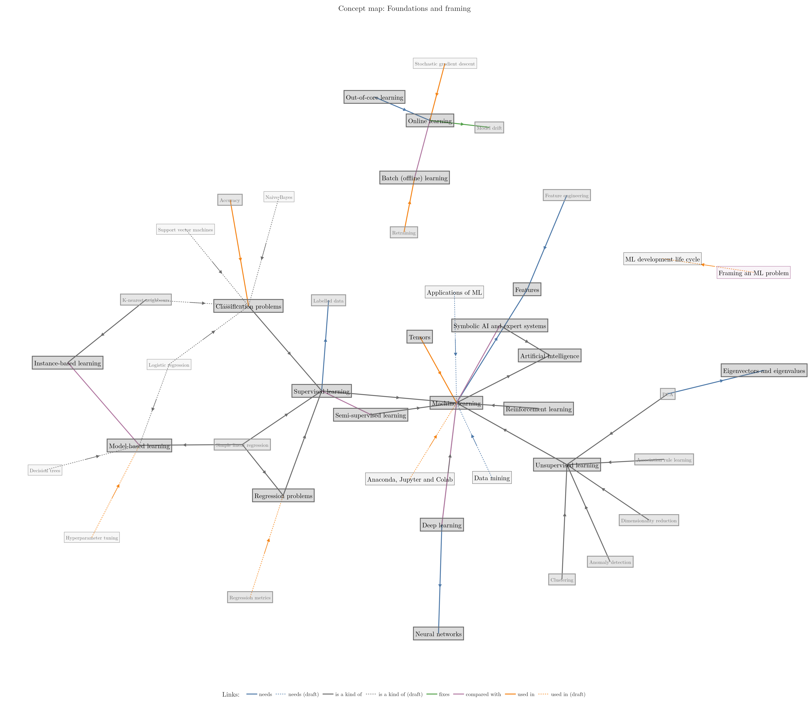{width=100%}

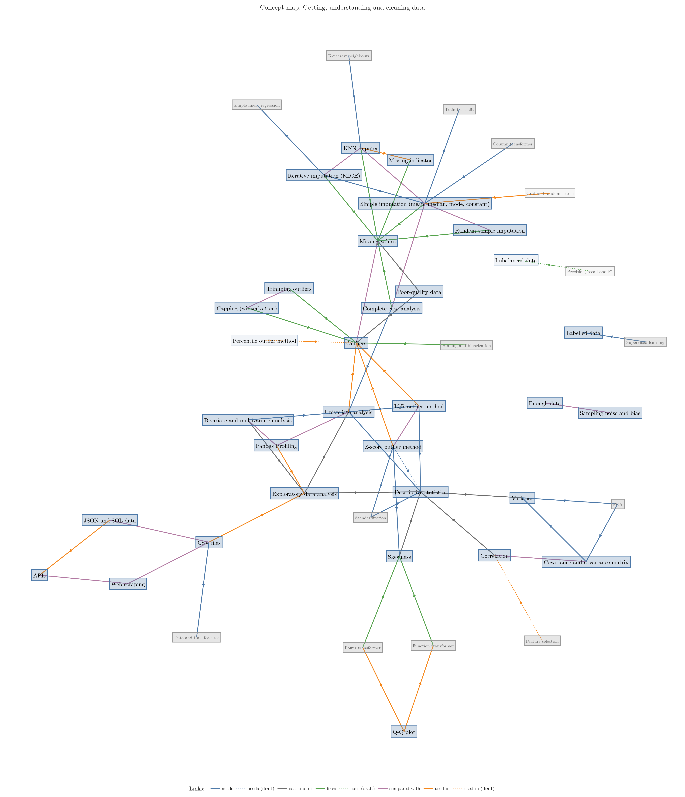{width=100%}

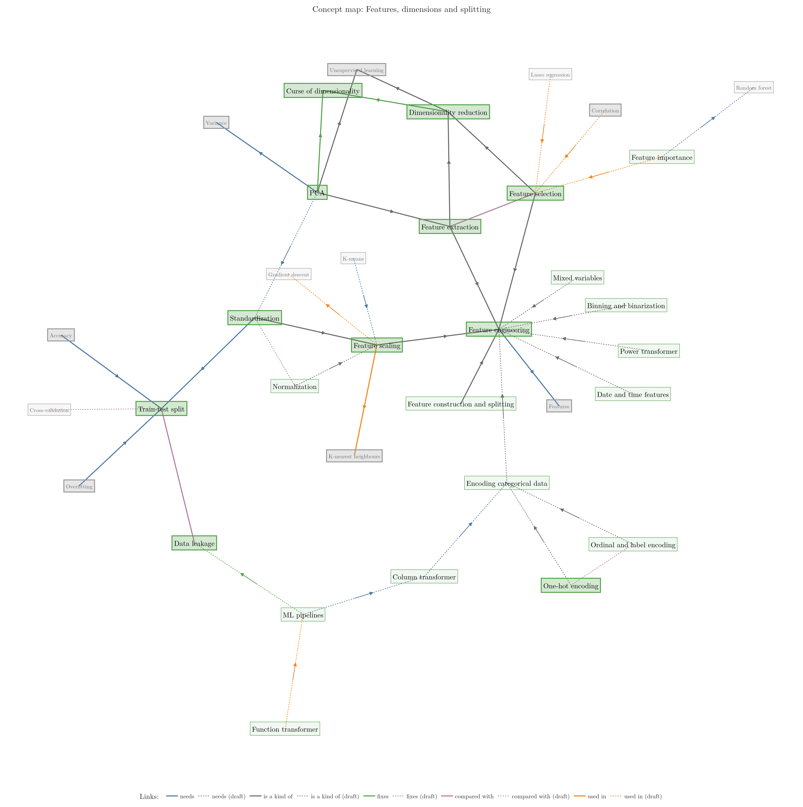{width=100%}

{width=100%}

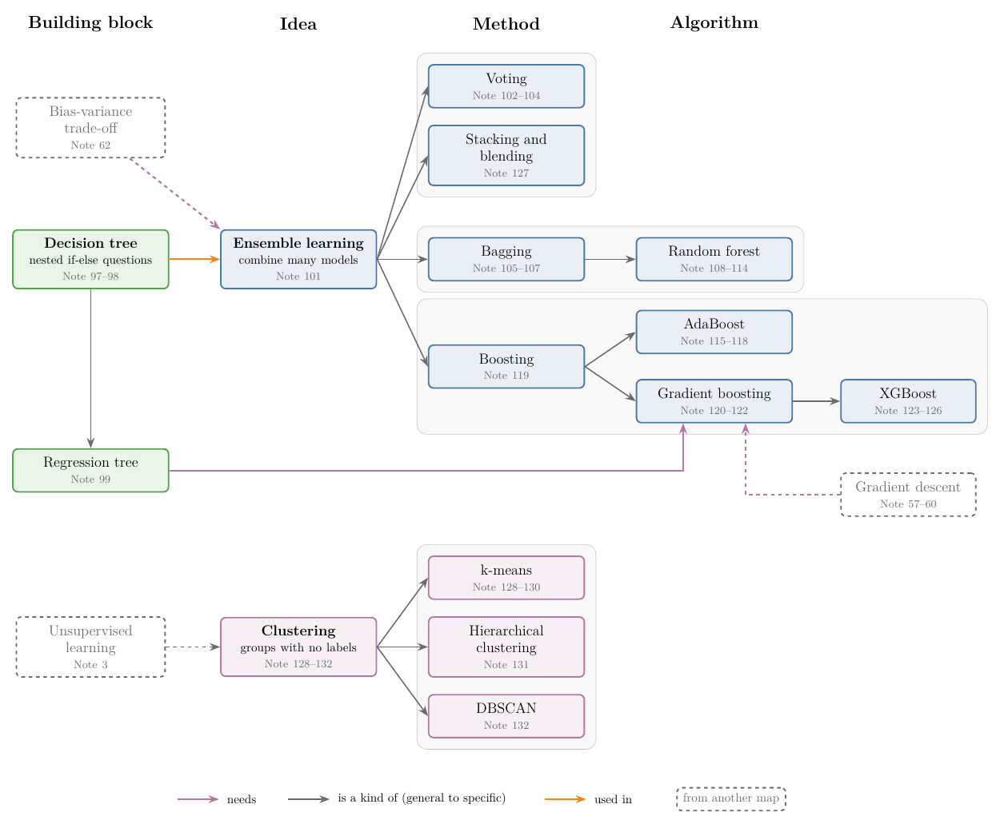{width=100%}

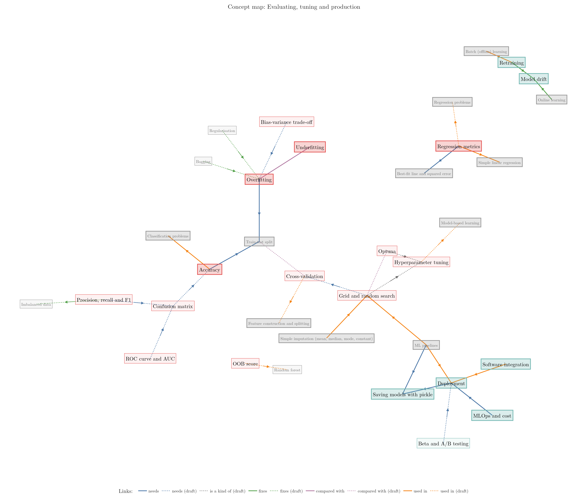{width=100%}

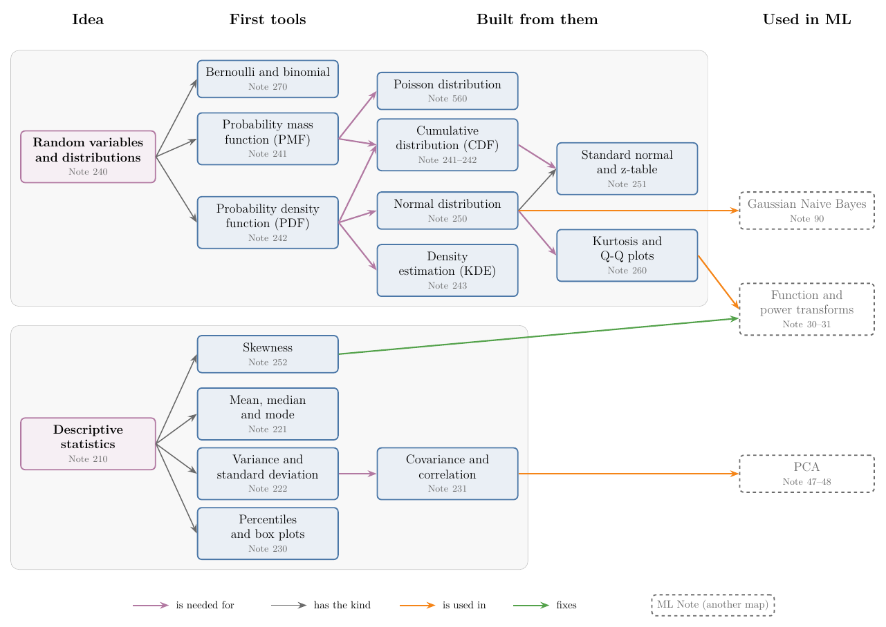{width=100%}

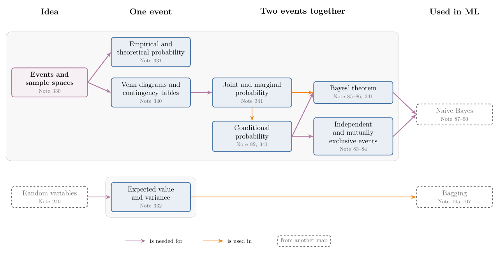{width=100%}

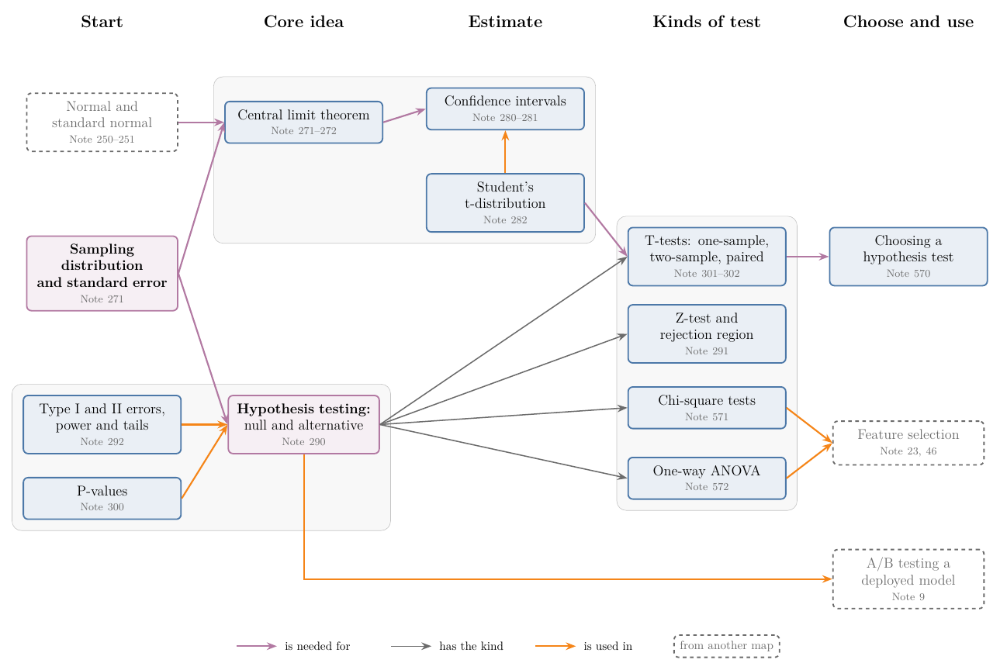{width=100%}

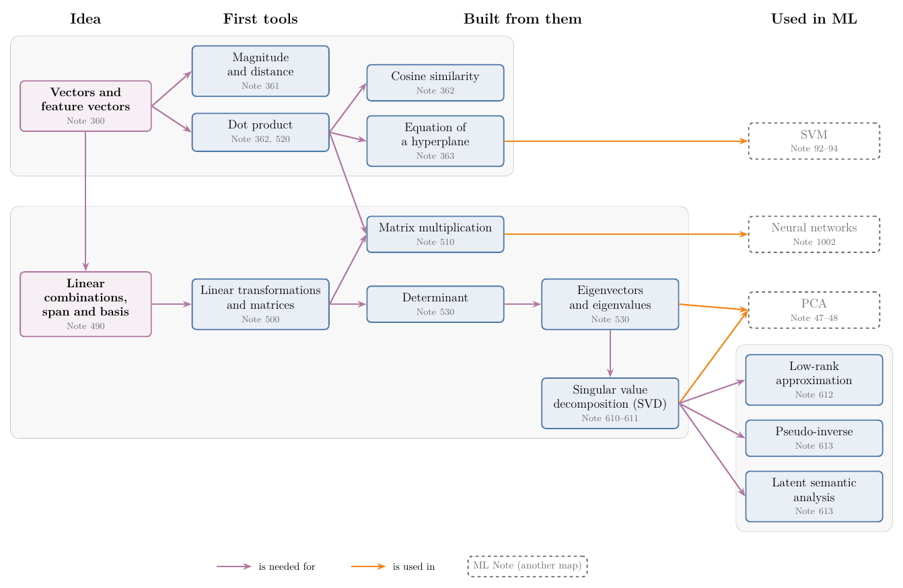{width=100%}

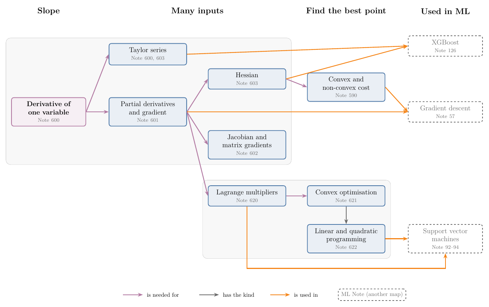{width=100%}

{width=100%}

{width=100%}

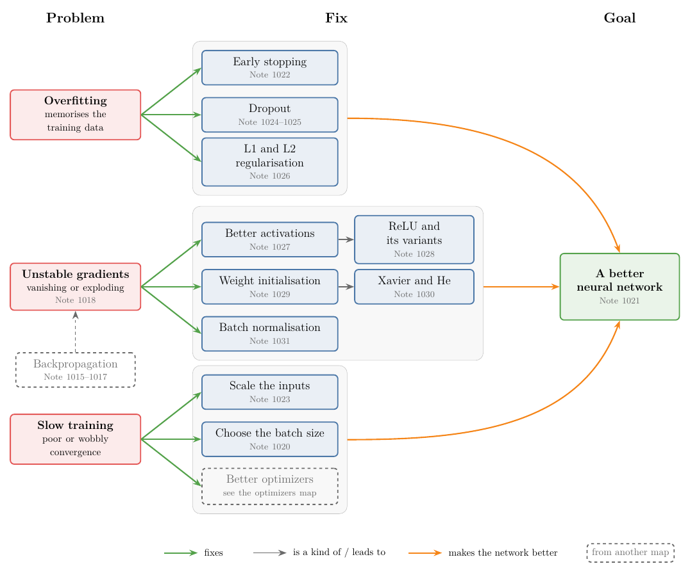{width=100%}

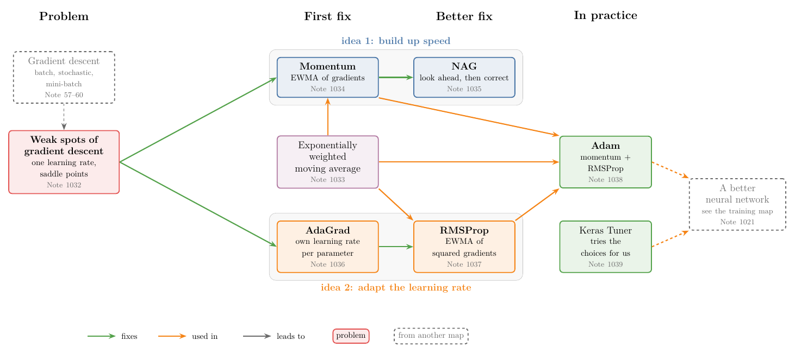{width=100%}

{width=100%}

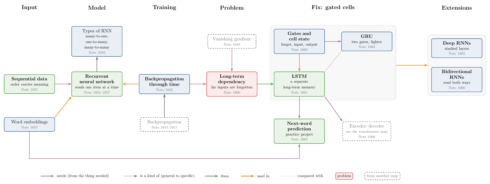{width=100%}

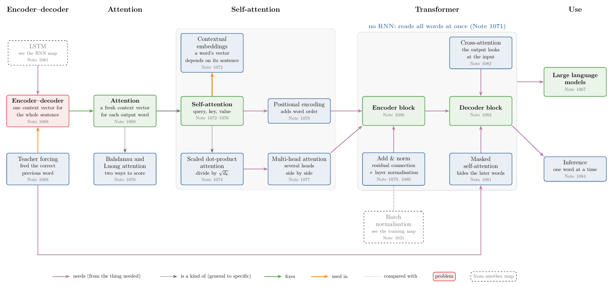{width=100%}

## 4. The Learning path

> **Key point:** Before each Note, read the Notes it builds on.

Each row lists a Note's Concepts and the Notes to read first. Notes marked *coming* or *deferred* are not written yet.

| No. | Concepts | Read first | Note |
|---|---|---|---|
| 1 | Data mining, Machine learning | nothing | written |
| 2 | Artificial intelligence, Deep learning, Features, Machine learning, Neural networks, Symbolic AI and expert systems | nothing | written |
| 3 | Anomaly detection, Association rule learning, Classification problems, Clustering, Dimensionality reduction, Feature construction and splitting, Labelled data, PCA, Regression problems, Reinforcement learning, Semi-supervised learning, Supervised learning, Unsupervised learning | [Note 2](../02-ai-vs-ml-vs-dl/note.md) | written |
| 4 | Batch (offline) learning, Deployment, Model drift, Retraining | nothing | written |
| 5 | Online learning, Out-of-core learning, Retraining, Stochastic gradient descent | [Note 4](../04-batch-learning/note.md) | written |
| 6 | Feature scaling, Instance-based learning, K-nearest neighbours, Model-based learning | [Note 3](../03-types-of-ml/note.md) | written |
| 7 | APIs, Deployment, Enough data, Feature construction and splitting, Feature engineering, Labelled data, MLOps and cost, Missing values, Outliers, Overfitting, Poor-quality data, Sampling noise and bias, Software integration, Underfitting, Web scraping | [Note 2](../02-ai-vs-ml-vs-dl/note.md) | written |
| 8 | Applications of ML, Data mining | [Note 2](../02-ai-vs-ml-vs-dl/note.md), [Note 3](../03-types-of-ml/note.md) | written |
| 9 | APIs, Beta and A/B testing, Bivariate and multivariate analysis, CSV files, Deployment, Ensemble learning, Exploratory data analysis, Feature construction and splitting, Feature engineering, Feature scaling, Feature selection, Framing an ML problem, Hyperparameter tuning, Imbalanced data, ML development life cycle, MLOps and cost, Missing values, Model drift, Outliers, Poor-quality data, Retraining, Saving models with pickle, Standardization, Univariate analysis, Web scraping | [Note 3](../03-types-of-ml/note.md), [Note 4](../04-batch-learning/note.md), [Note 5](../05-online-learning/note.md), [Note 7](../07-challenges-in-ml/note.md) | written |
| 11 | Features, One-hot encoding, Tensors | nothing | written |
| 12 | Setup: conda, Jupyter and Colab | nothing | written |
| 13 | Accuracy, CSV files, Data leakage, Deployment, Exploratory data analysis, Feature scaling, Feature selection, Logistic regression, ML development life cycle, ML pipelines, Saving models with pickle, Standardization, Train-test split | [Note 3](../03-types-of-ml/note.md), [Note 6](../06-instance-vs-model-based/note.md), [Note 7](../07-challenges-in-ml/note.md), [Note 9](../09-mldlc/note.md) | written |
| 14 | Framing an ML problem | [Note 3](../03-types-of-ml/note.md), [Note 4](../04-batch-learning/note.md), [Note 5](../05-online-learning/note.md) | written |
| 15 | CSV files | nothing | written |
| 16 | JSON and SQL data | nothing | written |
| 17 | APIs | [Note 16](../16-working-with-json-and-sql/note.md) | written |
| 18 | Web scraping | nothing | written |
| 19 | Correlation, Descriptive statistics, Exploratory data analysis, Variance | [Note 15](../15-working-with-csv/note.md) | written |
| 20 | Kernel density estimation (KDE), Outliers, Probability density function (PDF), Skewness, Univariate analysis | [Note 9](../09-mldlc/note.md), [Note 19](../19-understanding-your-data/note.md) | written |
| 21 | Bivariate and multivariate analysis, Correlation | [Note 19](../19-understanding-your-data/note.md), [Note 20](../20-univariate-analysis/note.md) | written |
| 22 | Kurtosis and moments, Pandas Profiling | [Note 12](../12-setup-anaconda-jupyter-colab/note.md) | written |
| 23 | Binning and binarization, Encoding categorical data, Feature construction and splitting, Feature engineering, Feature extraction, Feature scaling, Feature selection, Feature transformation, Missing values, One-hot encoding, Outliers, Simple imputation (mean, median, mode, constant) | [Note 11](../11-tensors/note.md), [Note 13](../13-toy-project/note.md), [Note 20](../20-univariate-analysis/note.md), [Note 21](../21-bivariate-multivariate-analysis/note.md) | written |
| 24 | Feature scaling, Standardization | [Note 13](../13-toy-project/note.md), [Note 19](../19-understanding-your-data/note.md), [Note 23](../23-what-is-feature-engineering/note.md) | written |
| 25 | Normalization | [Note 24](../24-standardization/note.md) | written |
| 26 | Encoding categorical data, Ordinal and label encoding | [Note 13](../13-toy-project/note.md), [Note 23](../23-what-is-feature-engineering/note.md) | written |
| 27 | Multicollinearity, One-hot encoding | [Note 26](../26-ordinal-label-encoding/note.md) | written |
| 28 | Column transformer | [Note 23](../23-what-is-feature-engineering/note.md), [Note 26](../26-ordinal-label-encoding/note.md) | written |
| 29 | Chi-square tests, Cross-validation, Deployment, Grid and random search, ML pipelines, Saving models with pickle | [Note 13](../13-toy-project/note.md), [Note 17](../17-fetching-data-from-api/note.md), [Note 23](../23-what-is-feature-engineering/note.md), [Note 28](../28-column-transformer/note.md) | written |
| 30 | Cross-validation, Function transformer, Q-Q plot | [Note 20](../20-univariate-analysis/note.md), [Note 22](../22-pandas-profiling/note.md), [Note 23](../23-what-is-feature-engineering/note.md) | written |
| 31 | Power transformer | [Note 20](../20-univariate-analysis/note.md), [Note 23](../23-what-is-feature-engineering/note.md), [Note 30](../30-function-transformer/note.md) | written |
| 32 | Binning and binarization, K-means | [Note 3](../03-types-of-ml/note.md), [Note 23](../23-what-is-feature-engineering/note.md), [Note 24](../24-standardization/note.md) | written |
| 33 | Mixed variables | [Note 23](../23-what-is-feature-engineering/note.md) | written |
| 34 | Date and time features | [Note 15](../15-working-with-csv/note.md), [Note 23](../23-what-is-feature-engineering/note.md) | written |
| 35 | Complete case analysis, Missing values | [Note 9](../09-mldlc/note.md), [Note 20](../20-univariate-analysis/note.md) | written |
| 36 | Missing values, Simple imputation (mean, median, mode, constant) | [Note 9](../09-mldlc/note.md), [Note 13](../13-toy-project/note.md) | written |
| 37 | Missing values, Simple imputation (mean, median, mode, constant) | [Note 9](../09-mldlc/note.md), [Note 13](../13-toy-project/note.md) | written |
| 38 | Grid and random search, ML pipelines, Missing indicator, Missing values, Random sample imputation | [Note 28](../28-column-transformer/note.md), [Note 29](../29-pipelines/note.md), [Note 30](../30-function-transformer/note.md), [Note 37](../37-missing-categorical-data/note.md) | written |
| 39 | KNN imputer, Vector magnitude, distance and scalar operations | [Note 6](../06-instance-vs-model-based/note.md), [Note 38](../38-missing-indicator-random-sample/note.md) | written |
| 40 | Iterative imputation (MICE) | [Note 37](../37-missing-categorical-data/note.md), [Note 38](../38-missing-indicator-random-sample/note.md) | written |
| 41 | Capping (winsorization), IQR outlier method, Outliers, Percentile outlier method, Trimming outliers, Z-score outlier method | [Note 9](../09-mldlc/note.md), [Note 19](../19-understanding-your-data/note.md), [Note 20](../20-univariate-analysis/note.md), [Note 24](../24-standardization/note.md) | written |
| 42 | Capping (winsorization), Normal distribution, Trimming outliers, Z-score outlier method | [Note 19](../19-understanding-your-data/note.md), [Note 20](../20-univariate-analysis/note.md), [Note 24](../24-standardization/note.md), [Note 41](../41-what-are-outliers/note.md) | written |
| 43 | Capping (winsorization), IQR outlier method, Trimming outliers | [Note 19](../19-understanding-your-data/note.md), [Note 20](../20-univariate-analysis/note.md), [Note 41](../41-what-are-outliers/note.md) | written |
| 44 | Capping (winsorization), Percentile outlier method, Trimming outliers | [Note 41](../41-what-are-outliers/note.md) | written |
| 45 | Feature construction and splitting | [Note 23](../23-what-is-feature-engineering/note.md), [Note 30](../30-function-transformer/note.md), [Note 32](../32-binning-binarization/note.md) | written |
| 46 | Curse of dimensionality, Dimensionality reduction, Feature extraction, Feature selection | [Note 20](../20-univariate-analysis/note.md), [Note 21](../21-bivariate-multivariate-analysis/note.md), [Note 23](../23-what-is-feature-engineering/note.md), [Note 29](../29-pipelines/note.md) | written |
| 47 | Feature extraction, PCA, Variance | [Note 19](../19-understanding-your-data/note.md), [Note 23](../23-what-is-feature-engineering/note.md), [Note 24](../24-standardization/note.md), [Note 46](../46-curse-of-dimensionality/note.md) | written |
| 48 | Covariance and covariance matrix, Dot product, Eigenvectors and eigenvalues, Linear transformations and matrices, PCA | [Note 3](../03-types-of-ml/note.md), [Note 24](../24-standardization/note.md), [Note 46](../46-curse-of-dimensionality/note.md), [Note 47](../47-pca-geometric-intuition/note.md) | written |
| 49 | PCA | [Note 24](../24-standardization/note.md), [Note 46](../46-curse-of-dimensionality/note.md), [Note 47](../47-pca-geometric-intuition/note.md), [Note 48](../48-pca-step-by-step/note.md) | written |
| 50 | Best-fit line and squared error, Simple linear regression | [Note 3](../03-types-of-ml/note.md), [Note 6](../06-instance-vs-model-based/note.md), [Note 27](../27-one-hot-encoding/note.md) | written |
| 51 | Best-fit line and squared error, Derivatives of one variable, Ordinary least squares (closed form), Simple linear regression | [Note 3](../03-types-of-ml/note.md), [Note 6](../06-instance-vs-model-based/note.md), [Note 27](../27-one-hot-encoding/note.md), [Note 48](../48-pca-step-by-step/note.md) | written |
| 52 | Regression metrics | [Note 51](../51-linear-regression-maths/note.md) | written |
| 53 | Equation of a hyperplane, Multiple linear regression | [Note 3](../03-types-of-ml/note.md), [Note 48](../48-pca-step-by-step/note.md), [Note 51](../51-linear-regression-maths/note.md) | written |
| 54 | Multiple linear regression, Normal equation | [Note 3](../03-types-of-ml/note.md), [Note 51](../51-linear-regression-maths/note.md) | written |
| 55 | Multiple linear regression, Normal equation | [Note 3](../03-types-of-ml/note.md), [Note 51](../51-linear-regression-maths/note.md) | written |
| 56 | Assumptions of linear regression | [Note 27](../27-one-hot-encoding/note.md), [Note 30](../30-function-transformer/note.md) | written |
| 57 | Convex and non-convex loss, Gradient descent, Learning rate, Partial derivatives and gradients | [Note 24](../24-standardization/note.md), [Note 51](../51-linear-regression-maths/note.md) | written |
| 58 | Batch gradient descent | [Note 57](../57-gradient-descent/note.md) | written |
| 59 | Stochastic gradient descent | [Note 57](../57-gradient-descent/note.md) | written |
| 60 | Mini-batch gradient descent | [Note 57](../57-gradient-descent/note.md) | written |
| 61 | Overfitting, Polynomial features, Polynomial regression, Underfitting | [Note 13](../13-toy-project/note.md), [Note 55](../55-multiple-lr-code/note.md) | written |
| 62 | Bias-variance trade-off | [Note 61](../61-polynomial-regression/note.md) | written |
| 63 | Regularisation, Ridge regression | [Note 55](../55-multiple-lr-code/note.md), [Note 57](../57-gradient-descent/note.md), [Note 61](../61-polynomial-regression/note.md), [Note 62](../62-bias-variance/note.md) | written |
| 64 | Ridge regression | [Note 55](../55-multiple-lr-code/note.md), [Note 57](../57-gradient-descent/note.md), [Note 62](../62-bias-variance/note.md), [Note 63](../63-ridge-regression-intuition/note.md) | written |
| 65 | Ridge regression | [Note 55](../55-multiple-lr-code/note.md), [Note 57](../57-gradient-descent/note.md), [Note 62](../62-bias-variance/note.md), [Note 63](../63-ridge-regression-intuition/note.md) | written |
| 66 | Ridge regression | [Note 55](../55-multiple-lr-code/note.md), [Note 57](../57-gradient-descent/note.md), [Note 62](../62-bias-variance/note.md), [Note 63](../63-ridge-regression-intuition/note.md) | written |
| 67 | Lasso regression | [Note 63](../63-ridge-regression-intuition/note.md) | written |
| 68 | Lasso regression | [Note 63](../63-ridge-regression-intuition/note.md) | written |
| 69 | Elastic Net | [Note 27](../27-one-hot-encoding/note.md), [Note 63](../63-ridge-regression-intuition/note.md), [Note 66](../66-ridge-key-points/note.md), [Note 68](../68-lasso-sparsity/note.md) | written |
| 70 | Equation of a hyperplane, Logistic regression, Perceptron trick | [Note 6](../06-instance-vs-model-based/note.md), [Note 48](../48-pca-step-by-step/note.md), [Note 57](../57-gradient-descent/note.md), [Note 61](../61-polynomial-regression/note.md) | written |
| 71 | Logistic regression, Perceptron trick | [Note 6](../06-instance-vs-model-based/note.md), [Note 57](../57-gradient-descent/note.md), [Note 61](../61-polynomial-regression/note.md), [Note 70](../70-perceptron-trick/note.md) | written |
| 72 | Logistic regression, Sigmoid function | [Note 6](../06-instance-vs-model-based/note.md), [Note 57](../57-gradient-descent/note.md), [Note 61](../61-polynomial-regression/note.md), [Note 71](../71-perceptron-code/note.md) | written |
| 73 | Log loss (binary cross entropy), Logistic regression | [Note 57](../57-gradient-descent/note.md), [Note 61](../61-polynomial-regression/note.md), [Note 71](../71-perceptron-code/note.md), [Note 72](../72-sigmoid-function/note.md) | written |
| 74 | Sigmoid function | nothing | written |
| 75 | Logistic regression | [Note 61](../61-polynomial-regression/note.md), [Note 71](../71-perceptron-code/note.md), [Note 73](../73-log-loss/note.md), [Note 74](../74-sigmoid-derivative/note.md) | written |
| 76 | Accuracy, Confusion matrix | [Note 9](../09-mldlc/note.md), [Note 13](../13-toy-project/note.md) | written |
| 77 | Precision, recall and F1 | [Note 9](../09-mldlc/note.md), [Note 76](../76-accuracy-confusion-matrix/note.md) | written |
| 78 | ROC curve and AUC | [Note 76](../76-accuracy-confusion-matrix/note.md), [Note 77](../77-precision-recall-f1/note.md) | written |
| 79 | Softmax regression | [Note 27](../27-one-hot-encoding/note.md), [Note 75](../75-logistic-gradient-descent/note.md) | written |
| 80 | Polynomial features | nothing | written |
| 81 | Hyperparameter tuning | [Note 61](../61-polynomial-regression/note.md) | written |
| 82 | Conditional probability | nothing | written |
| 83 | Independent and mutually exclusive events | [Note 82](../82-conditional-probability/note.md) | written |
| 84 | Independent and mutually exclusive events | [Note 82](../82-conditional-probability/note.md) | written |
| 85 | Bayes' theorem | [Note 82](../82-conditional-probability/note.md) | written |
| 86 | Bayes' theorem | [Note 82](../82-conditional-probability/note.md) | written |
| 87 | Naive Bayes | [Note 20](../20-univariate-analysis/note.md), [Note 42](../42-outliers-zscore/note.md), [Note 84](../84-mutually-exclusive-events/note.md), [Note 86](../86-bayes-problem/note.md) | written |
| 88 | Naive Bayes | [Note 20](../20-univariate-analysis/note.md), [Note 42](../42-outliers-zscore/note.md), [Note 84](../84-mutually-exclusive-events/note.md), [Note 86](../86-bayes-problem/note.md) | written |
| 89 | Naive Bayes | [Note 20](../20-univariate-analysis/note.md), [Note 42](../42-outliers-zscore/note.md), [Note 84](../84-mutually-exclusive-events/note.md), [Note 86](../86-bayes-problem/note.md) | written |
| 90 | Naive Bayes, Normal distribution, Probability density function (PDF) | [Note 3](../03-types-of-ml/note.md), [Note 84](../84-mutually-exclusive-events/note.md), [Note 86](../86-bayes-problem/note.md) | written |
| 91 | Accuracy, Cross-validation, Curse of dimensionality, Data leakage, Decision surface and boundary, Grid and random search, Hyperparameter tuning, K-nearest neighbours, Overfitting, Underfitting | [Note 24](../24-standardization/note.md), [Note 37](../37-missing-categorical-data/note.md), [Note 38](../38-missing-indicator-random-sample/note.md), [Note 39](../39-knn-imputer/note.md) | written |
| 92 | Support vector machines | [Note 48](../48-pca-step-by-step/note.md), [Note 63](../63-ridge-regression-intuition/note.md), [Note 70](../70-perceptron-trick/note.md), [Note 71](../71-perceptron-code/note.md) | written |
| 93 | Support vector machines | [Note 48](../48-pca-step-by-step/note.md), [Note 63](../63-ridge-regression-intuition/note.md), [Note 70](../70-perceptron-trick/note.md), [Note 71](../71-perceptron-code/note.md) | written |
| 94 | Hinge loss and soft margin, Support vector machines | [Note 48](../48-pca-step-by-step/note.md), [Note 63](../63-ridge-regression-intuition/note.md), [Note 70](../70-perceptron-trick/note.md), [Note 71](../71-perceptron-code/note.md) | written |
| 95 | Kernel trick | nothing | written |
| 96 | Kernel trick | nothing | written |
| 97 | Decision trees, Entropy, information gain and Gini | [Note 6](../06-instance-vs-model-based/note.md), [Note 91](../91-knn/note.md) | written |
| 98 | Decision trees, Hyperparameter tuning | [Note 6](../06-instance-vs-model-based/note.md), [Note 91](../91-knn/note.md), [Note 97](../97-decision-trees-intuition/note.md) | written |
| 99 | Feature importance, Grid and random search, Regression trees | [Note 38](../38-missing-indicator-random-sample/note.md), [Note 52](../52-regression-metrics/note.md), [Note 91](../91-knn/note.md), [Note 98](../98-decision-tree-hyperparameters/note.md) | written |
| 100 | Decision trees, Feature importance | [Note 6](../06-instance-vs-model-based/note.md), [Note 91](../91-knn/note.md), [Note 97](../97-decision-trees-intuition/note.md) | written |
| 101 | Boosting, Ensemble learning | [Note 62](../62-bias-variance/note.md), [Note 91](../91-knn/note.md), [Note 100](../100-dtreeviz/note.md) | written |
| 102 | Bernoulli and binomial distributions, Voting ensembles | [Note 84](../84-mutually-exclusive-events/note.md), [Note 91](../91-knn/note.md), [Note 101](../101-ensemble-learning/note.md) | written |
| 103 | Cross-validation, Voting ensembles | [Note 84](../84-mutually-exclusive-events/note.md), [Note 101](../101-ensemble-learning/note.md), [Note 102](../102-voting-ensemble/note.md) | written |
| 104 | Cross-validation, Voting ensembles | [Note 84](../84-mutually-exclusive-events/note.md), [Note 101](../101-ensemble-learning/note.md), [Note 102](../102-voting-ensemble/note.md) | written |
| 105 | Bagging, OOB score | [Note 91](../91-knn/note.md), [Note 99](../99-regression-trees/note.md), [Note 100](../100-dtreeviz/note.md), [Note 101](../101-ensemble-learning/note.md) | written |
| 106 | Bagging, Grid and random search, OOB score | [Note 98](../98-decision-tree-hyperparameters/note.md), [Note 100](../100-dtreeviz/note.md), [Note 101](../101-ensemble-learning/note.md), [Note 104](../104-voting-regressor/note.md) | written |
| 107 | Bagging, Grid and random search, OOB score | [Note 98](../98-decision-tree-hyperparameters/note.md), [Note 100](../100-dtreeviz/note.md), [Note 101](../101-ensemble-learning/note.md), [Note 104](../104-voting-regressor/note.md) | written |
| 108 | Random forest | [Note 91](../91-knn/note.md), [Note 98](../98-decision-tree-hyperparameters/note.md), [Note 100](../100-dtreeviz/note.md), [Note 107](../107-bagging-regressor/note.md) | written |
| 109 | Bias-variance trade-off, Random forest | [Note 91](../91-knn/note.md), [Note 98](../98-decision-tree-hyperparameters/note.md), [Note 100](../100-dtreeviz/note.md), [Note 107](../107-bagging-regressor/note.md) | written |
| 110 | Random forest | [Note 91](../91-knn/note.md), [Note 98](../98-decision-tree-hyperparameters/note.md), [Note 100](../100-dtreeviz/note.md), [Note 107](../107-bagging-regressor/note.md) | written |
| 111 | Hyperparameter tuning, Random forest | [Note 91](../91-knn/note.md), [Note 100](../100-dtreeviz/note.md), [Note 107](../107-bagging-regressor/note.md) | written |
| 112 | Cross-validation, Grid and random search, Random forest | [Note 91](../91-knn/note.md), [Note 100](../100-dtreeviz/note.md), [Note 107](../107-bagging-regressor/note.md), [Note 111](../111-random-forest-hyperparameters/note.md) | written |
| 113 | OOB score, Random forest | [Note 100](../100-dtreeviz/note.md), [Note 107](../107-bagging-regressor/note.md), [Note 111](../111-random-forest-hyperparameters/note.md), [Note 112](../112-random-forest-tuning/note.md) | written |
| 114 | Feature importance, Permutation importance, Random forest | [Note 107](../107-bagging-regressor/note.md), [Note 111](../111-random-forest-hyperparameters/note.md), [Note 112](../112-random-forest-tuning/note.md), [Note 113](../113-oob-score/note.md) | written |
| 115 | AdaBoost | [Note 100](../100-dtreeviz/note.md), [Note 101](../101-ensemble-learning/note.md), [Note 111](../111-random-forest-hyperparameters/note.md) | written |
| 116 | AdaBoost | [Note 100](../100-dtreeviz/note.md), [Note 101](../101-ensemble-learning/note.md), [Note 111](../111-random-forest-hyperparameters/note.md) | written |
| 117 | AdaBoost | [Note 100](../100-dtreeviz/note.md), [Note 101](../101-ensemble-learning/note.md), [Note 111](../111-random-forest-hyperparameters/note.md) | written |
| 118 | AdaBoost, Cross-validation, Grid and random search, Hyperparameter tuning, Learning rate | [Note 38](../38-missing-indicator-random-sample/note.md), [Note 91](../91-knn/note.md), [Note 100](../100-dtreeviz/note.md), [Note 101](../101-ensemble-learning/note.md) | written |
| 119 | Boosting | [Note 91](../91-knn/note.md), [Note 101](../101-ensemble-learning/note.md), [Note 109](../109-random-forest-bias-variance/note.md) | written |
| 120 | Gradient boosting, Learning rate | [Note 73](../73-log-loss/note.md), [Note 74](../74-sigmoid-derivative/note.md), [Note 99](../99-regression-trees/note.md), [Note 119](../119-bagging-vs-boosting/note.md) | written |
| 121 | Gradient boosting | [Note 74](../74-sigmoid-derivative/note.md), [Note 99](../99-regression-trees/note.md), [Note 119](../119-bagging-vs-boosting/note.md), [Note 120](../120-gradient-boosting-intuition/note.md) | written |
| 122 | Gradient boosting | [Note 74](../74-sigmoid-derivative/note.md), [Note 99](../99-regression-trees/note.md), [Note 119](../119-bagging-vs-boosting/note.md), [Note 120](../120-gradient-boosting-intuition/note.md) | written |
| 123 | Missing values, XGBoost | [Note 9](../09-mldlc/note.md), [Note 32](../32-binning-binarization/note.md), [Note 63](../63-ridge-regression-intuition/note.md), [Note 122](../122-gradient-boosting-classification/note.md) | written |
| 124 | XGBoost | [Note 32](../32-binning-binarization/note.md), [Note 63](../63-ridge-regression-intuition/note.md), [Note 122](../122-gradient-boosting-classification/note.md), [Note 123](../123-xgboost-intro/note.md) | written |
| 125 | XGBoost | [Note 32](../32-binning-binarization/note.md), [Note 63](../63-ridge-regression-intuition/note.md), [Note 122](../122-gradient-boosting-classification/note.md), [Note 123](../123-xgboost-intro/note.md) | written |
| 126 | Hessian and multivariate Taylor, Taylor series, XGBoost | [Note 57](../57-gradient-descent/note.md), [Note 63](../63-ridge-regression-intuition/note.md), [Note 122](../122-gradient-boosting-classification/note.md), [Note 123](../123-xgboost-intro/note.md) | written |
| 127 | Cross-validation, Stacking and blending | [Note 101](../101-ensemble-learning/note.md) | written |
| 128 | Clustering, Elbow method and WCSS, K-means | [Note 3](../03-types-of-ml/note.md), [Note 24](../24-standardization/note.md) | written |
| 129 | Clustering, Elbow method and WCSS, K-means | [Note 3](../03-types-of-ml/note.md), [Note 24](../24-standardization/note.md) | written |
| 130 | Clustering, K-means | [Note 3](../03-types-of-ml/note.md), [Note 24](../24-standardization/note.md), [Note 129](../129-kmeans-code/note.md) | written |
| 131 | Clustering, Hierarchical clustering | [Note 3](../03-types-of-ml/note.md) | written |
| 132 | Anomaly detection, Clustering, DBSCAN | [Note 3](../03-types-of-ml/note.md) | written |
| 133 | Balanced random forest, Cost-sensitive learning, Imbalanced data, Random under- and oversampling, SMOTE | [Note 78](../78-roc-auc/note.md), [Note 91](../91-knn/note.md), [Note 114](../114-feature-importance/note.md), [Note 127](../127-stacking-blending/note.md) | written |
| 134 | Bayesian optimisation, Optuna | [Note 118](../118-adaboost-hyperparameters/note.md), [Note 127](../127-stacking-blending/note.md) | written |
| 210 | Descriptive statistics, Inferential statistics, Probability distributions | [Note 19](../19-understanding-your-data/note.md) | written |
| 220 | Discrete and continuous data, Inferential statistics, Population, sample, parameter and statistic | [Note 7](../07-challenges-in-ml/note.md) | written |
| 221 | Descriptive statistics, Measures of central tendency | [Note 19](../19-understanding-your-data/note.md) | written |
| 222 | Bessel's correction, Descriptive statistics, Variance | [Note 19](../19-understanding-your-data/note.md), [Note 220](../220-what-is-statistics/note.md) | written |
| 223 | Descriptive statistics, Frequency tables | [Note 19](../19-understanding-your-data/note.md) | written |
| 230 | Descriptive statistics, Percentiles, quartiles and box plots | [Note 19](../19-understanding-your-data/note.md), [Note 223](../223-frequency-tables-and-graphs/note.md) | written |
| 231 | Correlation, Correlation and causation, Covariance and covariance matrix | [Note 222](../222-measures-of-dispersion/note.md), [Note 230](../230-percentiles-and-box-plots/note.md) | written |
| 240 | Normal distribution, Probability distributions, Random variables | [Note 90](../90-gaussian-naive-bayes/note.md), [Note 220](../220-what-is-statistics/note.md) | written |
| 241 | Bernoulli and binomial distributions, Cumulative distribution function (CDF), Probability mass function (PMF), Uniform distribution | [Note 90](../90-gaussian-naive-bayes/note.md), [Note 240](../240-random-variables-and-distributions/note.md) | written |
| 242 | Cumulative distribution function (CDF), Log-normal distribution, Poisson distribution, Probability density function (PDF) | [Note 240](../240-random-variables-and-distributions/note.md), [Note 241](../241-pmf-and-discrete-cdf/note.md) | written |
| 243 | Density estimation, Kernel density estimation (KDE) | [Note 220](../220-what-is-statistics/note.md), [Note 242](../242-pdf-and-continuous-cdf/note.md) | written |
| 250 | Normal distribution | [Note 240](../240-random-variables-and-distributions/note.md), [Note 242](../242-pdf-and-continuous-cdf/note.md) | written |
| 251 | Standard normal and the z-table, Z-score outlier method | [Note 24](../24-standardization/note.md), [Note 230](../230-percentiles-and-box-plots/note.md), [Note 242](../242-pdf-and-continuous-cdf/note.md), [Note 250](../250-normal-distribution/note.md) | written |
| 252 | Skewness | [Note 230](../230-percentiles-and-box-plots/note.md) | written |
| 253 | Cumulative distribution function (CDF), Kernel density estimation (KDE) | [Note 241](../241-pmf-and-discrete-cdf/note.md), [Note 242](../242-pdf-and-continuous-cdf/note.md), [Note 243](../243-density-estimation-kde/note.md) | written |
| 260 | Kurtosis and moments, Q-Q plot | [Note 250](../250-normal-distribution/note.md) | written |
| 261 | Log-normal distribution, Uniform distribution | [Note 240](../240-random-variables-and-distributions/note.md) | written |
| 262 | Pareto distribution and power laws | nothing | written |
| 270 | Bernoulli and binomial distributions | [Note 240](../240-random-variables-and-distributions/note.md) | written |
| 271 | Central limit theorem, Sampling distribution and standard error | [Note 220](../220-what-is-statistics/note.md), [Note 250](../250-normal-distribution/note.md) | written |
| 272 | Central limit theorem | [Note 250](../250-normal-distribution/note.md), [Note 271](../271-sampling-distribution-and-clt/note.md) | written |
| 280 | Confidence intervals | [Note 251](../251-standard-normal-and-z-table/note.md), [Note 272](../272-estimating-a-mean-with-the-clt/note.md) | written |
| 281 | Confidence intervals | [Note 251](../251-standard-normal-and-z-table/note.md), [Note 272](../272-estimating-a-mean-with-the-clt/note.md) | written |
| 282 | Confidence intervals, Student's t-distribution | [Note 222](../222-measures-of-dispersion/note.md), [Note 251](../251-standard-normal-and-z-table/note.md), [Note 272](../272-estimating-a-mean-with-the-clt/note.md) | written |
| 290 | Hypothesis testing: null and alternative | [Note 220](../220-what-is-statistics/note.md), [Note 271](../271-sampling-distribution-and-clt/note.md) | written |
| 291 | Hypothesis testing: null and alternative, Z-test and rejection regions | [Note 220](../220-what-is-statistics/note.md), [Note 251](../251-standard-normal-and-z-table/note.md), [Note 271](../271-sampling-distribution-and-clt/note.md), [Note 272](../272-estimating-a-mean-with-the-clt/note.md) | written |
| 292 | Beta and A/B testing, Type I and II errors, power, tails | [Note 29](../29-pipelines/note.md), [Note 291](../291-rejection-region-and-z-test/note.md) | written |
| 300 | P-values | [Note 253](../253-pdf-and-cdf-in-practice/note.md) | written |
| 301 | T-tests: one-sample, two-sample, paired | [Note 282](../282-t-procedure/note.md), [Note 291](../291-rejection-region-and-z-test/note.md) | written |
| 302 | T-tests: one-sample, two-sample, paired | [Note 282](../282-t-procedure/note.md), [Note 291](../291-rejection-region-and-z-test/note.md) | written |
| 330 | Events and sample spaces | nothing | written |
| 331 | Empirical vs theoretical probability, probability rules | [Note 330](../330-events-and-types-of-events/note.md) | written |
| 332 | Expected value and variance of a random variable | [Note 240](../240-random-variables-and-distributions/note.md) | written |
| 340 | Empirical vs theoretical probability, probability rules, Venn diagrams and contingency tables | [Note 330](../330-events-and-types-of-events/note.md) | written |
| 341 | Bayes' theorem, Conditional probability, Joint and marginal probability | [Note 330](../330-events-and-types-of-events/note.md), [Note 340](../340-venn-diagrams-and-contingency-tables/note.md) | written |
| 350 | Linear algebra roadmap | nothing | written |
| 360 | Bag of words, Vectors and feature vectors | [Note 11](../11-tensors/note.md) | written |
| 361 | Vector magnitude, distance and scalar operations | [Note 360](../360-vectors-and-feature-vectors/note.md) | written |
| 362 | Cosine similarity, Dot product | [Note 360](../360-vectors-and-feature-vectors/note.md) | written |
| 363 | Equation of a hyperplane | [Note 362](../362-dot-product-and-cosine-similarity/note.md) | written |
| 440 | Role of mathematics in ML | nothing | written |
| 490 | Linear combinations, span and basis | [Note 360](../360-vectors-and-feature-vectors/note.md) | written |
| 500 | Linear transformations and matrices | [Note 490](../490-linear-combinations-span-and-basis/note.md) | written |
| 510 | Matrix multiplication as composition | [Note 362](../362-dot-product-and-cosine-similarity/note.md), [Note 500](../500-linear-transformations-and-matrices/note.md) | written |
| 520 | Dot product | [Note 360](../360-vectors-and-feature-vectors/note.md) | written |
| 530 | Determinant, Eigenvectors and eigenvalues | [Note 500](../500-linear-transformations-and-matrices/note.md) | written |
| 560 | Poisson distribution | [Note 241](../241-pmf-and-discrete-cdf/note.md), [Note 332](../332-expected-value-and-variance/note.md) | written |
| 570 | Choosing a hypothesis test, Correlation significance test, One-sample proportion test, T-tests: one-sample, two-sample, paired | [Note 231](../231-covariance-and-correlation/note.md), [Note 282](../282-t-procedure/note.md), [Note 291](../291-rejection-region-and-z-test/note.md) | written |
| 571 | Chi-square tests | [Note 291](../291-rejection-region-and-z-test/note.md), [Note 341](../341-joint-marginal-conditional-probability/note.md) | written |
| 572 | One-way ANOVA | [Note 222](../222-measures-of-dispersion/note.md), [Note 291](../291-rejection-region-and-z-test/note.md) | written |
| 580 | How to learn the maths for ML | [Note 440](../440-role-of-maths-in-ml/note.md) | written |
| 590 | Convex and non-convex loss | [Note 126](../126-xgboost-maths/note.md) | written |
| 600 | Derivatives of one variable, Taylor series | nothing | written |
| 601 | Partial derivatives and gradients | [Note 600](../600-derivatives-of-one-variable/note.md) | written |
| 602 | Jacobian and matrix gradients | [Note 500](../500-linear-transformations-and-matrices/note.md), [Note 510](../510-matrix-multiplication-as-composition/note.md), [Note 601](../601-partial-derivatives-and-gradients/note.md) | written |
| 603 | Hessian and multivariate Taylor, Taylor series | [Note 530](../530-eigenvectors-and-eigenvalues/note.md), [Note 600](../600-derivatives-of-one-variable/note.md), [Note 601](../601-partial-derivatives-and-gradients/note.md) | written |
| 610 | Singular value decomposition | [Note 500](../500-linear-transformations-and-matrices/note.md), [Note 530](../530-eigenvectors-and-eigenvalues/note.md) | written |
| 611 | Singular value decomposition | [Note 500](../500-linear-transformations-and-matrices/note.md), [Note 530](../530-eigenvectors-and-eigenvalues/note.md) | written |
| 612 | Low-rank approximation (truncated SVD) | [Note 611](../611-computing-the-svd/note.md) | written |
| 613 | Latent semantic analysis, Moore-Penrose pseudo-inverse | [Note 27](../27-one-hot-encoding/note.md), [Note 360](../360-vectors-and-feature-vectors/note.md), [Note 611](../611-computing-the-svd/note.md) | written |
| 620 | Lagrange multipliers, KKT and duality | [Note 601](../601-partial-derivatives-and-gradients/note.md) | written |
| 621 | Convex sets and convex optimisation | [Note 590](../590-convex-and-non-convex-cost-functions/note.md), [Note 620](../620-lagrange-multipliers/note.md) | written |
| 622 | Linear and quadratic programming | [Note 621](../621-convex-sets-and-functions/note.md) | written |
| 630 | Likelihood, Normal distribution | [Note 240](../240-random-variables-and-distributions/note.md), [Note 242](../242-pdf-and-continuous-cdf/note.md) | written |
| 631 | Maximum likelihood estimation (MLE) | [Note 600](../600-derivatives-of-one-variable/note.md), [Note 601](../601-partial-derivatives-and-gradients/note.md), [Note 630](../630-probability-vs-likelihood/note.md) | written |
| 632 | Exponential distribution, Maximum likelihood estimation (MLE) | [Note 242](../242-pdf-and-continuous-cdf/note.md), [Note 600](../600-derivatives-of-one-variable/note.md), [Note 601](../601-partial-derivatives-and-gradients/note.md), [Note 630](../630-probability-vs-likelihood/note.md) | written |
| 633 | Categorical and sparse categorical cross-entropy, Log loss (binary cross entropy), MAP estimation, Maximum likelihood estimation (MLE) | [Note 600](../600-derivatives-of-one-variable/note.md), [Note 601](../601-partial-derivatives-and-gradients/note.md), [Note 630](../630-probability-vs-likelihood/note.md), [Note 632](../632-mle-for-common-distributions/note.md) | written |
| 640 | Gaussian mixture model (GMM), Multivariate normal distribution | [Note 231](../231-covariance-and-correlation/note.md), [Note 341](../341-joint-marginal-conditional-probability/note.md), [Note 630](../630-probability-vs-likelihood/note.md), [Note 633](../633-mle-in-machine-learning/note.md) | written |
| 641 | Expectation maximization (EM), Gaussian mixture model (GMM), K-means | [Note 132](../132-dbscan/note.md), [Note 341](../341-joint-marginal-conditional-probability/note.md), [Note 633](../633-mle-in-machine-learning/note.md), [Note 640](../640-gaussian-mixture-models/note.md) | written |
| 1001 | What deep learning is | [Note 2](../02-ai-vs-ml-vs-dl/note.md) | written |
| 1002 | Neural networks, Representation learning, What deep learning is | [Note 2](../02-ai-vs-ml-vs-dl/note.md), [Note 500](../500-linear-transformations-and-matrices/note.md), [Note 510](../510-matrix-multiplication-as-composition/note.md) | written |
| 1003 | History of deep learning, Multi-layer perceptron (MLP), Types of neural networks, Universal approximation theorem | [Note 74](../74-sigmoid-derivative/note.md), [Note 1002](../1002-what-is-deep-learning/note.md) | written |
| 1004 | Perceptron | [Note 71](../71-perceptron-code/note.md), [Note 363](../363-equation-of-a-hyperplane/note.md), [Note 520](../520-dot-product-and-duality/note.md) | written |
| 1005 | Perceptron trick | [Note 363](../363-equation-of-a-hyperplane/note.md) | written |
| 1006 | Perceptron loss | [Note 59](../59-stochastic-gradient-descent/note.md), [Note 1005](../1005-perceptron-trick/note.md) | written |
| 1007 | Problem with the perceptron (XOR) | [Note 1004](../1004-perceptron/note.md) | written |
| 1008 | MLP notation and parameter count | nothing | written |
| 1009 | Multi-layer perceptron (MLP), Universal approximation theorem | [Note 1003](../1003-nn-types-history-applications/note.md), [Note 1004](../1004-perceptron/note.md), [Note 1007](../1007-problem-with-perceptron/note.md), [Note 1008](../1008-mlp-notation/note.md) | written |
| 1010 | Forward propagation | [Note 510](../510-matrix-multiplication-as-composition/note.md), [Note 1008](../1008-mlp-notation/note.md) | written |
| 1011 | ANN for classification, Keras workflow, Training curves (History) | [Note 91](../91-knn/note.md), [Note 133](../133-imbalanced-data/note.md), [Note 633](../633-mle-in-machine-learning/note.md), [Note 1009](../1009-mlp-intuition/note.md) | written |
| 1012 | ANN for classification, Categorical and sparse categorical cross-entropy, Keras workflow, Training curves (History) | [Note 91](../91-knn/note.md), [Note 133](../133-imbalanced-data/note.md), [Note 633](../633-mle-in-machine-learning/note.md), [Note 1009](../1009-mlp-intuition/note.md) | written |
| 1013 | ANN for regression, Keras workflow, Training curves (History) | [Note 25](../25-normalization/note.md), [Note 52](../52-regression-metrics/note.md), [Note 91](../91-knn/note.md), [Note 1009](../1009-mlp-intuition/note.md) | written |
| 1014 | Categorical and sparse categorical cross-entropy, Huber loss, Log loss (binary cross entropy), Loss functions in deep learning | [Note 27](../27-one-hot-encoding/note.md), [Note 79](../79-softmax-regression/note.md), [Note 633](../633-mle-in-machine-learning/note.md), [Note 1010](../1010-forward-propagation/note.md) | written |
| 1015 | Backpropagation | [Note 600](../600-derivatives-of-one-variable/note.md), [Note 601](../601-partial-derivatives-and-gradients/note.md), [Note 1010](../1010-forward-propagation/note.md), [Note 1014](../1014-dl-loss-functions/note.md) | written |
| 1016 | Backpropagation | [Note 600](../600-derivatives-of-one-variable/note.md), [Note 601](../601-partial-derivatives-and-gradients/note.md), [Note 1010](../1010-forward-propagation/note.md), [Note 1014](../1014-dl-loss-functions/note.md) | written |
| 1017 | Backpropagation, Convex and non-convex loss, Gradient descent, Learning rate | [Note 601](../601-partial-derivatives-and-gradients/note.md), [Note 603](../603-hessian-and-multivariate-taylor/note.md), [Note 1010](../1010-forward-propagation/note.md), [Note 1014](../1014-dl-loss-functions/note.md) | written |
| 1018 | Exploding gradient and gradient clipping, ReLU, Sigmoid function, Vanishing gradient | [Note 1013](../1013-graduate-admission-ann/note.md), [Note 1017](../1017-backpropagation-why/note.md) | written |
| 1019 | Backpropagation, Memoization | [Note 1010](../1010-forward-propagation/note.md), [Note 1014](../1014-dl-loss-functions/note.md), [Note 1017](../1017-backpropagation-why/note.md), [Note 1018](../1018-vanishing-exploding-gradients/note.md) | written |
| 1020 | Batch gradient descent, Batch size in Keras, Gradient descent, Mini-batch gradient descent, Stochastic gradient descent | [Note 51](../51-linear-regression-maths/note.md), [Note 600](../600-derivatives-of-one-variable/note.md), [Note 601](../601-partial-derivatives-and-gradients/note.md), [Note 1017](../1017-backpropagation-why/note.md) | written |
| 1021 | Early stopping, Hyperparameter tuning, Improving a neural network | [Note 91](../91-knn/note.md), [Note 1013](../1013-graduate-admission-ann/note.md), [Note 1018](../1018-vanishing-exploding-gradients/note.md), [Note 1019](../1019-mlp-memoization/note.md) | written |
| 1022 | Early stopping, Keras workflow, Training curves (History) | [Note 91](../91-knn/note.md), [Note 1009](../1009-mlp-intuition/note.md) | written |
| 1023 | Feature scaling, Scaling inputs for neural networks, Standardization | [Note 23](../23-what-is-feature-engineering/note.md), [Note 25](../25-normalization/note.md), [Note 230](../230-percentiles-and-box-plots/note.md), [Note 1020](../1020-gradient-descent-in-neural-networks/note.md) | written |
| 1024 | Dropout | [Note 63](../63-ridge-regression-intuition/note.md), [Note 91](../91-knn/note.md) | written |
| 1025 | Dropout, Keras workflow | [Note 63](../63-ridge-regression-intuition/note.md), [Note 91](../91-knn/note.md), [Note 1009](../1009-mlp-intuition/note.md) | written |
| 1026 | Keras workflow, L1 and L2 regularisation in neural networks, Overfitting, Regularisation | [Note 13](../13-toy-project/note.md), [Note 361](../361-magnitude-distance-and-scalar-operations/note.md), [Note 1009](../1009-mlp-intuition/note.md), [Note 1020](../1020-gradient-descent-in-neural-networks/note.md) | written |
| 1027 | Activation functions, ReLU, Sigmoid function, Tanh | [Note 1004](../1004-perceptron/note.md), [Note 1018](../1018-vanishing-exploding-gradients/note.md) | written |
| 1028 | Dying ReLU problem, Leaky ReLU, PReLU, ELU and SELU, ReLU | [Note 1018](../1018-vanishing-exploding-gradients/note.md), [Note 1027](../1027-activation-functions/note.md) | written |
| 1029 | Exploding gradient and gradient clipping, Vanishing gradient, Weight initialisation | [Note 1019](../1019-mlp-memoization/note.md), [Note 1022](../1022-early-stopping/note.md), [Note 1027](../1027-activation-functions/note.md) | written |
| 1030 | Vanishing gradient, Weight initialisation, Xavier and He initialisation | [Note 1019](../1019-mlp-memoization/note.md), [Note 1022](../1022-early-stopping/note.md), [Note 1027](../1027-activation-functions/note.md), [Note 1029](../1029-weight-initialization/note.md) | written |
| 1031 | Batch normalisation, Covariate shift, Standardization | [Note 13](../13-toy-project/note.md), [Note 230](../230-percentiles-and-box-plots/note.md), [Note 1020](../1020-gradient-descent-in-neural-networks/note.md), [Note 1023](../1023-data-scaling-in-ann/note.md) | written |
| 1032 | Local minima and saddle points, Optimizers in deep learning | [Note 621](../621-convex-sets-and-functions/note.md), [Note 1019](../1019-mlp-memoization/note.md), [Note 1020](../1020-gradient-descent-in-neural-networks/note.md) | written |
| 1033 | Exponentially weighted moving average (EWMA) | nothing | written |
| 1034 | Local minima and saddle points, SGD with momentum | [Note 621](../621-convex-sets-and-functions/note.md), [Note 1032](../1032-optimizers-in-deep-learning/note.md), [Note 1033](../1033-exponentially-weighted-moving-average/note.md) | written |
| 1035 | Nesterov accelerated gradient (NAG) | [Note 1032](../1032-optimizers-in-deep-learning/note.md), [Note 1034](../1034-sgd-with-momentum/note.md) | written |
| 1036 | AdaGrad | [Note 1017](../1017-backpropagation-why/note.md), [Note 1032](../1032-optimizers-in-deep-learning/note.md) | written |
| 1037 | RMSProp | [Note 1032](../1032-optimizers-in-deep-learning/note.md), [Note 1033](../1033-exponentially-weighted-moving-average/note.md), [Note 1036](../1036-adagrad/note.md) | written |
| 1038 | Adam | [Note 1032](../1032-optimizers-in-deep-learning/note.md), [Note 1033](../1033-exponentially-weighted-moving-average/note.md), [Note 1034](../1034-sgd-with-momentum/note.md), [Note 1037](../1037-rmsprop/note.md) | written |
| 1039 | Hyperparameter tuning, Keras Tuner | [Note 1026](../1026-regularization-in-dl/note.md) | written |
| 1040 | Convolutional neural network (CNN) | [Note 1002](../1002-what-is-deep-learning/note.md) | written |
| 1041 | Convolutional neural network (CNN) | [Note 1002](../1002-what-is-deep-learning/note.md) | written |
| 1042 | Convolution operation and feature maps | nothing | written |
| 1043 | Padding and strides | [Note 1042](../1042-convolution-operation/note.md) | written |
| 1044 | Pooling | [Note 1042](../1042-convolution-operation/note.md) | written |
| 1045 | CNN architecture (LeNet-5) | [Note 1042](../1042-convolution-operation/note.md), [Note 1043](../1043-padding-and-strides/note.md), [Note 1044](../1044-pooling/note.md) | written |
| 1046 | Convolutional neural network (CNN) | [Note 1002](../1002-what-is-deep-learning/note.md), [Note 1042](../1042-convolution-operation/note.md), [Note 1044](../1044-pooling/note.md) | written |
| 1047 | Backpropagation in a CNN | [Note 1019](../1019-mlp-memoization/note.md), [Note 1042](../1042-convolution-operation/note.md) | written |
| 1048 | Backpropagation in a CNN | [Note 1019](../1019-mlp-memoization/note.md), [Note 1042](../1042-convolution-operation/note.md) | written |
| 1049 | Image classification with a CNN (cats vs dogs) | [Note 1023](../1023-data-scaling-in-ann/note.md), [Note 1026](../1026-regularization-in-dl/note.md), [Note 1045](../1045-lenet-5/note.md) | written |
| 1050 | Data augmentation | [Note 7](../07-challenges-in-ml/note.md), [Note 1026](../1026-regularization-in-dl/note.md) | written |
| 1051 | Pretrained models and ImageNet | [Note 7](../07-challenges-in-ml/note.md), [Note 1045](../1045-lenet-5/note.md) | written |
| 1052 | Visualising what a CNN learns | [Note 1042](../1042-convolution-operation/note.md), [Note 1051](../1051-pretrained-models/note.md) | written |
| 1053 | Transfer learning (feature extraction and fine-tuning) | [Note 7](../07-challenges-in-ml/note.md), [Note 1026](../1026-regularization-in-dl/note.md), [Note 1051](../1051-pretrained-models/note.md) | written |
| 1054 | Keras functional API, Skip connections | [Note 1026](../1026-regularization-in-dl/note.md), [Note 1030](../1030-xavier-he-initialization/note.md) | written |
| 1055 | Recurrent neural network (RNN), Sequence padding, Sequential data | [Note 1010](../1010-forward-propagation/note.md), [Note 1027](../1027-activation-functions/note.md), [Note 1029](../1029-weight-initialization/note.md) | written |
| 1056 | Parameter sharing across time steps, Recurrent neural network (RNN) | [Note 1010](../1010-forward-propagation/note.md), [Note 1027](../1027-activation-functions/note.md), [Note 1029](../1029-weight-initialization/note.md), [Note 1055](../1055-why-rnn/note.md) | written |
| 1057 | Recurrent neural network (RNN), Sequence padding, Tokenization and integer encoding of text, Word embeddings | [Note 1027](../1027-activation-functions/note.md), [Note 1029](../1029-weight-initialization/note.md), [Note 1055](../1055-why-rnn/note.md), [Note 1056](../1056-rnn-forward-propagation/note.md) | written |
| 1058 | Sequence-to-sequence (encoder-decoder), Types of RNN (many-to-one, one-to-many, many-to-many) | [Note 1057](../1057-rnn-sentiment-analysis/note.md) | written |
| 1059 | Backpropagation through time (BPTT), Parameter sharing across time steps | [Note 1019](../1019-mlp-memoization/note.md) | written |
| 1060 | Exploding gradient and gradient clipping, Long-term dependency problem, Vanishing gradient | [Note 1019](../1019-mlp-memoization/note.md), [Note 1022](../1022-early-stopping/note.md), [Note 1027](../1027-activation-functions/note.md), [Note 1059](../1059-backpropagation-through-time/note.md) | written |
| 1061 | LSTM (long short-term memory) | [Note 1057](../1057-rnn-sentiment-analysis/note.md), [Note 1060](../1060-problems-with-rnn/note.md) | written |
| 1062 | LSTM (long short-term memory), LSTM gates (forget, input, output) and cell state | [Note 1057](../1057-rnn-sentiment-analysis/note.md), [Note 1060](../1060-problems-with-rnn/note.md) | written |
| 1063 | LSTM (long short-term memory), Next-word prediction with an LSTM | [Note 1057](../1057-rnn-sentiment-analysis/note.md), [Note 1060](../1060-problems-with-rnn/note.md), [Note 1062](../1062-lstm-architecture/note.md) | written |
| 1064 | GRU (gated recurrent unit) | [Note 1057](../1057-rnn-sentiment-analysis/note.md), [Note 1062](../1062-lstm-architecture/note.md) | written |
| 1065 | Deep (stacked) RNNs | [Note 1057](../1057-rnn-sentiment-analysis/note.md), [Note 1063](../1063-lstm-next-word-prediction/note.md), [Note 1064](../1064-gru/note.md) | written |
| 1066 | Bidirectional RNNs | [Note 1057](../1057-rnn-sentiment-analysis/note.md), [Note 1063](../1063-lstm-next-word-prediction/note.md), [Note 1064](../1064-gru/note.md) | written |
| 1067 | Large language models (LLMs) | nothing | written |
| 1068 | Sequence-to-sequence (encoder-decoder), Teacher forcing | [Note 1058](../1058-types-of-rnn/note.md), [Note 1063](../1063-lstm-next-word-prediction/note.md) | written |
| 1069 | Attention mechanism, Bahdanau (additive) attention | [Note 1068](../1068-encoder-decoder/note.md) | written |
| 1070 | Bahdanau (additive) attention, Luong (multiplicative) attention | [Note 1069](../1069-attention-mechanism/note.md) | written |
| 1071 | Transformer | [Note 1068](../1068-encoder-decoder/note.md) | written |
| 1072 | Contextual embeddings, Self-attention (query, key, value) | [Note 1057](../1057-rnn-sentiment-analysis/note.md), [Note 1069](../1069-attention-mechanism/note.md) | written |
| 1073 | Self-attention (query, key, value) | [Note 1069](../1069-attention-mechanism/note.md) | written |
| 1074 | Scaled dot-product attention | [Note 1073](../1073-self-attention-step-by-step/note.md) | written |
| 1075 | Self-attention (query, key, value) | [Note 1069](../1069-attention-mechanism/note.md) | written |
| 1076 | Self-attention (query, key, value) | [Note 1069](../1069-attention-mechanism/note.md) | written |
| 1077 | Multi-head attention | [Note 1074](../1074-scaled-dot-product-attention/note.md) | written |
| 1078 | Positional encoding | [Note 1076](../1076-why-self-attention/note.md) | written |
| 1079 | Layer normalisation | nothing | written |
| 1080 | Residual connections and add & norm, Transformer, Transformer encoder | [Note 1068](../1068-encoder-decoder/note.md), [Note 1077](../1077-multi-head-attention/note.md), [Note 1078](../1078-positional-encoding/note.md), [Note 1079](../1079-layer-normalization/note.md) | written |
| 1081 | Masked self-attention, Teacher forcing | [Note 1076](../1076-why-self-attention/note.md) | written |
| 1082 | Cross-attention | nothing | written |
| 1083 | Transformer, Transformer decoder | [Note 1068](../1068-encoder-decoder/note.md), [Note 1080](../1080-transformer-encoder/note.md), [Note 1081](../1081-masked-self-attention/note.md), [Note 1082](../1082-cross-attention/note.md) | written |
| 1084 | Transformer inference (autoregressive decoding, KV cache, beam search) | [Note 1083](../1083-transformer-decoder/note.md) | written |
| 1085 | Label smoothing, Learning-rate warm-up schedule, The transformer end to end (capstone) | [Note 1038](../1038-adam/note.md), [Note 1080](../1080-transformer-encoder/note.md), [Note 1083](../1083-transformer-decoder/note.md), [Note 1084](../1084-transformer-inference/note.md) | written |
| 1086 | Meaning as direction in embedding space | [Note 520](../520-dot-product-and-duality/note.md), [Note 1057](../1057-rnn-sentiment-analysis/note.md) | written |
| 1087 | Decoder-only GPT, GELU activation | [Note 1027](../1027-activation-functions/note.md), [Note 1081](../1081-masked-self-attention/note.md), [Note 1083](../1083-transformer-decoder/note.md) | written |
| 1088 | Logit lens, Unembedding, logits, temperature and sampling | [Note 79](../79-softmax-regression/note.md) | written |
| 1089 | MLP blocks as fact storage | [Note 1087](../1087-decoder-only-gpt/note.md) | written |
| 1090 | Superposition and nearly perpendicular directions | [Note 1086](../1086-meaning-as-direction/note.md) | written |

## 5. The Algorithm chooser

> **Key point:** Two questions narrow the choice: do we have labelled outputs, and are they numbers or categories?

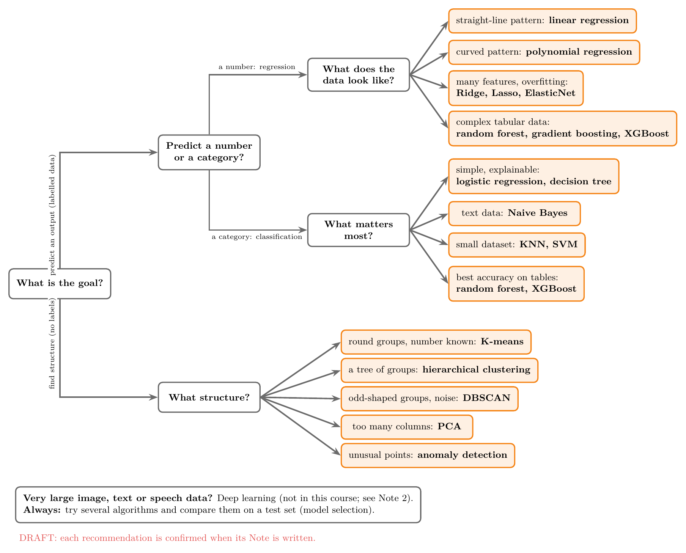

Figure 8 is a starting point, not a rule: in practice we try several suitable algorithms and compare them on a test set. It is a draft until the algorithm Notes are written.

## 6. Sources

**Built from**
- CampusX, "100 Days of Machine Learning", YouTube playlist (134 videos), https://www.youtube.com/playlist?list=PLKnIA16_Rmvbr7zKYQuBfsVkjoLcJgxHH
- CampusX, "100 Days of Deep Learning", YouTube playlist (84 videos), https://www.youtube.com/playlist?list=PLKnIA16_RmvYuZauWaPlRTC54KxSNLtNn
- CampusX, "Maths for Machine Learning", YouTube playlist (23 sessions), https://www.youtube.com/playlist?list=PLKnIA16_RmvbYFaaeLY28cWeqV-3vADST
- Every Note listed in the Learning path: each Note's own Sources name the video, book or paper it was built from.

**Other references**
- The Concept map data: `course_map/concepts.yaml` in this repository.

## 7. Key terms

| Term | Meaning |
|---|---|
| Course map | The overview that ties all Notes together, in four views |
| Pipeline map | Where each Concept sits among the 14 steps of an ML project |
| Concept map | How Concepts are connected by Links |
| Learning path | Which Notes to read before which |
| Algorithm chooser | A flowchart from a problem's properties to suitable algorithms |
| Concept | One idea on the Course map |
| Link | A labelled connection between two Concepts |
| Draft / confirmed | Guessed from titles / checked against a written Note |
