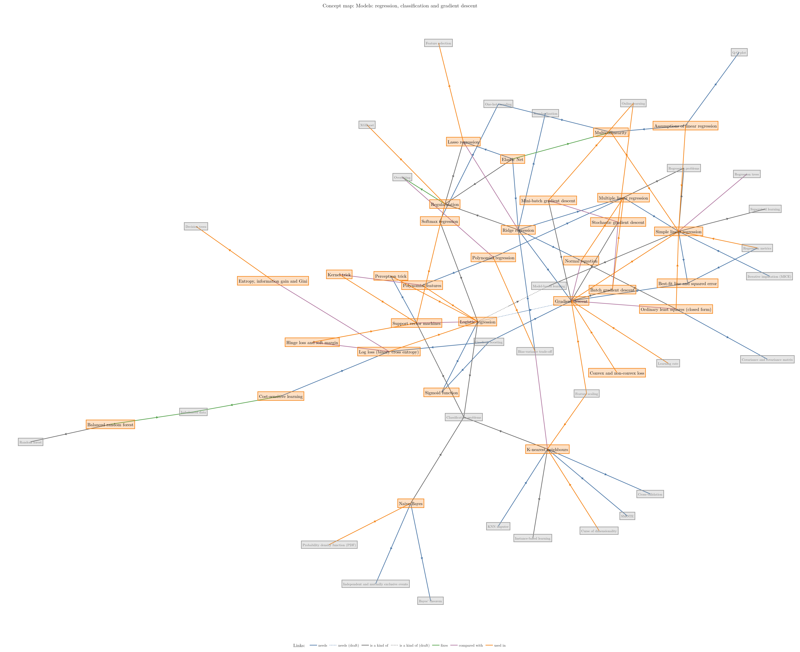
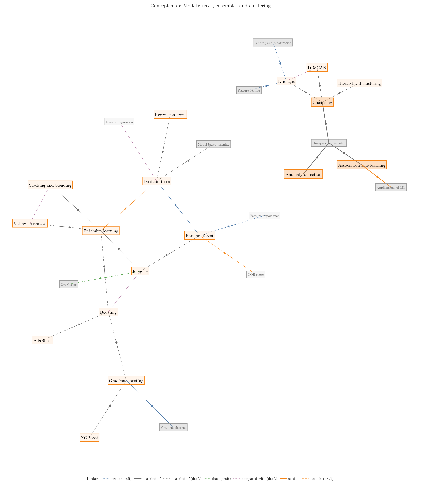

## 1. Overview

> **Key point:** The Course map ties every Note together. It shows where each idea sits in an ML project, how ideas connect, what to read first, and which algorithm to choose.

The Notes each teach one lesson. The Course map shows how those lessons fit together, in four views:

| View | Question it answers |
|---|---|
| **Pipeline map** | Where does this idea sit in a real ML project? |
| **Concept map** | How is this idea connected to the others? |
| **Learning path** | Which Notes should I read first? |
| **Algorithm chooser** | Which algorithm suits my problem? |

Each idea on the map is a **Concept**. Concepts already taught in a written Note are **confirmed**; the others are **draft**, shown faint, and are checked against their Video when their Note is written. So far, 57 of 130 Concepts are confirmed.

Every Note starts with a *Where this fits* box: a small Pipeline map with that Note's steps highlighted, plus what it builds on and what it leads to.

> **Extra:** This map is generated from one data file, `course_map/concepts.yaml`. An interactive version, where you can zoom, filter by step and click a Concept to see its links and Notes, runs with `python course_map/app.py`.

## 2. The Pipeline map

> **Key point:** Every ML project moves through the same steps, from framing the problem to monitoring the deployed model. Every Concept belongs to one step.

Figure 1 shows the 14 steps. They follow the ML development life cycle: frame the problem, get and understand the data, clean it, engineer features, train and evaluate models, tune them, deploy, test and keep the model healthy.

Steps 3 (Understand data) and 4 (Clean) loop: exploring reveals what needs cleaning, and cleaning changes the data, so we explore again.

### 2.1 Step 0: Foundations

| Concept | Taught in | Status |
|---|---|---|
| Machine learning | Video 1, coming, [Note 2](../02-ai-vs-ml-vs-dl/note.md) | confirmed |
| Data mining | Video 1, coming | draft |
| Artificial intelligence | [Note 2](../02-ai-vs-ml-vs-dl/note.md) | confirmed |
| Symbolic AI and expert systems | [Note 2](../02-ai-vs-ml-vs-dl/note.md) | confirmed |
| Deep learning | [Note 2](../02-ai-vs-ml-vs-dl/note.md) | confirmed |
| Neural networks | [Note 2](../02-ai-vs-ml-vs-dl/note.md) | confirmed |
| Features | [Note 2](../02-ai-vs-ml-vs-dl/note.md), [Note 11](../11-tensors/note.md) | confirmed |
| Supervised learning | [Note 3](../03-types-of-ml/note.md) | confirmed |
| Regression problems | [Note 3](../03-types-of-ml/note.md) | confirmed |
| Classification problems | [Note 3](../03-types-of-ml/note.md) | confirmed |
| Unsupervised learning | [Note 3](../03-types-of-ml/note.md) | confirmed |
| Semi-supervised learning | [Note 3](../03-types-of-ml/note.md) | confirmed |
| Reinforcement learning | [Note 3](../03-types-of-ml/note.md) | confirmed |
| Batch (offline) learning | [Note 4](../04-batch-learning/note.md) | confirmed |
| Online learning | [Note 5](../05-online-learning/note.md) | confirmed |
| Out-of-core learning | [Note 5](../05-online-learning/note.md) | confirmed |
| Instance-based learning | [Note 6](../06-instance-vs-model-based/note.md) | confirmed |
| Model-based learning | [Note 6](../06-instance-vs-model-based/note.md) | confirmed |
| Applications of ML | Video 8, coming | draft |
| ML development life cycle | Video 9, coming, [Note 13](../13-toy-project/note.md) | draft |
| Tensors | [Note 11](../11-tensors/note.md) | confirmed |
| Anaconda, Jupyter and Colab | Video 12, coming | draft |

### 2.2 Step 1: Frame the problem

| Concept | Taught in | Status |
|---|---|---|
| Framing an ML problem | Video 9, coming, Video 14, coming | draft |

### 2.3 Step 2: Get data

| Concept | Taught in | Status |
|---|---|---|
| Labelled data | [Note 3](../03-types-of-ml/note.md), [Note 7](../07-challenges-in-ml/note.md) | confirmed |
| Enough data | [Note 7](../07-challenges-in-ml/note.md) | confirmed |
| Sampling noise and bias | [Note 7](../07-challenges-in-ml/note.md) | confirmed |
| APIs | [Note 7](../07-challenges-in-ml/note.md), [Note 17](../17-fetching-data-from-api/note.md) | confirmed |
| Web scraping | [Note 7](../07-challenges-in-ml/note.md), [Note 18](../18-web-scraping/note.md) | confirmed |
| CSV files | [Note 13](../13-toy-project/note.md), [Note 15](../15-working-with-csv/note.md) | confirmed |
| JSON and SQL data | [Note 16](../16-working-with-json-and-sql/note.md) | confirmed |

### 2.4 Step 3: Understand data

| Concept | Taught in | Status |
|---|---|---|
| Imbalanced data | Video 9, coming, Video 133, coming | draft |
| Exploratory data analysis | [Note 13](../13-toy-project/note.md), [Note 19](../19-understanding-your-data/note.md) | confirmed |
| Variance | [Note 19](../19-understanding-your-data/note.md), [Note 47](../47-pca-geometric-intuition/note.md) | confirmed |
| Correlation | [Note 19](../19-understanding-your-data/note.md), [Note 21](../21-bivariate-multivariate-analysis/note.md) | confirmed |
| Descriptive statistics | [Note 19](../19-understanding-your-data/note.md) | confirmed |
| Univariate analysis | [Note 20](../20-univariate-analysis/note.md) | confirmed |
| Skewness | [Note 20](../20-univariate-analysis/note.md) | confirmed |
| Bivariate and multivariate analysis | [Note 21](../21-bivariate-multivariate-analysis/note.md) | confirmed |
| Pandas Profiling | Video 22, coming | draft |

### 2.5 Step 4: Clean

| Concept | Taught in | Status |
|---|---|---|
| Poor-quality data | [Note 7](../07-challenges-in-ml/note.md) | confirmed |
| Missing values | [Note 7](../07-challenges-in-ml/note.md), Video 35, coming, Video 36, coming | draft |
| Outliers | [Note 7](../07-challenges-in-ml/note.md), [Note 20](../20-univariate-analysis/note.md), Video 41, coming | draft |
| Complete case analysis | Video 35, coming | draft |
| Simple imputation (mean, median, mode) | Video 36, coming, Video 37, coming | draft |
| Missing indicator | Video 38, coming | draft |
| KNN imputer | Video 39, coming | draft |
| Iterative imputation (MICE) | Video 40, coming | draft |
| Z-score outlier method | Video 42, coming | draft |
| IQR outlier method | Video 43, coming | draft |
| Percentile outlier method | Video 44, coming | draft |

### 2.6 Step 5: Engineer features

| Concept | Taught in | Status |
|---|---|---|
| Feature scaling | [Note 6](../06-instance-vs-model-based/note.md), [Note 13](../13-toy-project/note.md), Video 24, coming | confirmed |
| Feature engineering | [Note 7](../07-challenges-in-ml/note.md), Video 23, coming | confirmed |
| Feature construction and splitting | [Note 7](../07-challenges-in-ml/note.md), Video 45, coming | draft |
| Feature selection | Video 9, coming, [Note 13](../13-toy-project/note.md), [Note 46](../46-curse-of-dimensionality/note.md) | confirmed |
| One-hot encoding | [Note 11](../11-tensors/note.md), Video 27, coming | confirmed |
| Standardization | [Note 13](../13-toy-project/note.md), Video 24, coming | confirmed |
| ML pipelines | [Note 13](../13-toy-project/note.md), Video 29, coming | draft |
| Normalization | Video 25, coming | draft |
| Encoding categorical data | Video 26, coming | draft |
| Ordinal and label encoding | Video 26, coming | draft |
| Column transformer | Video 28, coming | draft |
| Function transformer | Video 30, coming | draft |
| Power transformer | Video 31, coming | draft |
| Binning and binarization | Video 32, coming | draft |
| Mixed variables | Video 33, coming | draft |
| Date and time features | Video 34, coming | draft |
| Feature importance | Video 114, coming | draft |

### 2.7 Step 6: Reduce dimensions

| Concept | Taught in | Status |
|---|---|---|
| Dimensionality reduction | [Note 3](../03-types-of-ml/note.md), [Note 46](../46-curse-of-dimensionality/note.md) | confirmed |
| PCA | [Note 3](../03-types-of-ml/note.md), [Note 47](../47-pca-geometric-intuition/note.md), Video 48, coming, Video 49, coming | confirmed |
| Curse of dimensionality | [Note 46](../46-curse-of-dimensionality/note.md) | confirmed |
| Feature extraction | [Note 46](../46-curse-of-dimensionality/note.md), [Note 47](../47-pca-geometric-intuition/note.md) | confirmed |

### 2.8 Step 7: Split

| Concept | Taught in | Status |
|---|---|---|
| Train-test split | [Note 13](../13-toy-project/note.md) | confirmed |
| Data leakage | [Note 13](../13-toy-project/note.md) | confirmed |

### 2.9 Step 8: Model

| Concept | Taught in | Status |
|---|---|---|
| Clustering | [Note 3](../03-types-of-ml/note.md), Video 128, coming | confirmed |
| Anomaly detection | [Note 3](../03-types-of-ml/note.md) | confirmed |
| Association rule learning | [Note 3](../03-types-of-ml/note.md) | confirmed |
| Stochastic gradient descent | [Note 5](../05-online-learning/note.md), Video 59, coming | draft |
| K-nearest neighbours | [Note 6](../06-instance-vs-model-based/note.md), Video 91, coming | confirmed |
| Logistic regression | [Note 13](../13-toy-project/note.md), Video 70, coming, Video 71, coming, Video 72, coming, Video 73, coming, Video 75, coming | draft |
| Simple linear regression | Video 50, coming, Video 51, coming | draft |
| Multiple linear regression | Video 53, coming, Video 54, coming, Video 55, coming | draft |
| Assumptions of linear regression | Video 56, coming | draft |
| Gradient descent | Video 57, coming | draft |
| Batch gradient descent | Video 58, coming | draft |
| Mini-batch gradient descent | Video 60, coming | draft |
| Polynomial regression | Video 61, coming | draft |
| Polynomial features | Video 61, coming, Video 80, coming | draft |
| Regularisation | Video 63, coming | draft |
| Ridge regression | Video 63, coming, Video 64, coming, Video 65, coming, Video 66, coming | draft |
| Lasso regression | Video 67, coming, Video 68, coming | draft |
| ElasticNet | Video 69, coming | draft |
| Sigmoid function | Video 74, coming | draft |
| Softmax regression | Video 79, coming | draft |
| Naive Bayes | Video 82, coming, Video 83, coming, Video 84, coming, Video 85, coming, Video 86, coming, Video 87, coming, Video 88, coming, Video 89, coming, Video 90, coming | draft |
| Support vector machines | Video 92, coming, Video 93, coming, Video 94, coming | draft |
| Kernel trick | Video 95, coming, Video 96, coming | draft |
| Decision trees | Video 97, coming, Video 98, coming, Video 100, coming | draft |
| Regression trees | Video 99, coming | draft |
| Ensemble learning | Video 101, coming | draft |
| Voting ensembles | Video 102, coming, Video 103, coming, Video 104, coming | draft |
| Bagging | Video 105, coming, Video 106, coming, Video 107, coming | draft |
| Random forest | Video 108, coming, Video 109, coming, Video 110, coming, Video 111, coming | draft |
| AdaBoost | Video 115, coming, Video 116, coming, Video 117, coming, Video 118, coming | draft |
| Boosting | Video 119, coming | draft |
| Gradient boosting | Video 120, coming, Video 121, coming, Video 122, coming | draft |
| XGBoost | Video 123, coming, Video 124, coming, Video 125, coming, Video 126, coming | draft |
| Stacking and blending | Video 127, coming | draft |
| K-means | Video 128, coming, Video 129, coming, Video 130, coming | draft |
| Hierarchical clustering | Video 131, coming | draft |
| DBSCAN | Video 132, coming | draft |

### 2.10 Step 9: Evaluate

| Concept | Taught in | Status |
|---|---|---|
| Overfitting | [Note 7](../07-challenges-in-ml/note.md) | confirmed |
| Underfitting | [Note 7](../07-challenges-in-ml/note.md) | confirmed |
| Accuracy | [Note 13](../13-toy-project/note.md), Video 76, coming | confirmed |
| Regression metrics | Video 52, coming | draft |
| Bias-variance trade-off | Video 62, coming, Video 109, coming | draft |
| Confusion matrix | Video 76, coming | draft |
| Precision, recall and F1 | Video 77, coming | draft |
| ROC curve and AUC | Video 78, coming | draft |
| Cross-validation | Video 112, coming | draft |
| OOB score | Video 113, coming | draft |

### 2.11 Step 10: Tune

| Concept | Taught in | Status |
|---|---|---|
| Hyperparameter tuning | Video 9, coming, Video 81, coming, Video 98, coming, Video 111, coming, Video 118, coming | draft |
| Grid and random search | Video 112, coming | draft |
| Optuna | Video 134, coming | draft |

### 2.12 Step 11: Deploy

| Concept | Taught in | Status |
|---|---|---|
| Deployment | [Note 4](../04-batch-learning/note.md), [Note 7](../07-challenges-in-ml/note.md), [Note 13](../13-toy-project/note.md) | confirmed |
| Software integration | [Note 7](../07-challenges-in-ml/note.md) | confirmed |
| Saving models with pickle | [Note 13](../13-toy-project/note.md) | confirmed |

### 2.13 Step 12: Test

| Concept | Taught in | Status |
|---|---|---|
| Beta and A/B testing | Video 9, coming | draft |

### 2.14 Step 13: Monitor and maintain

| Concept | Taught in | Status |
|---|---|---|
| Model drift | [Note 4](../04-batch-learning/note.md) | confirmed |
| Retraining | [Note 4](../04-batch-learning/note.md), [Note 5](../05-online-learning/note.md) | confirmed |
| MLOps and cost | [Note 7](../07-challenges-in-ml/note.md) | confirmed |

## 3. The Concept map

> **Key point:** Concepts are joined by five kinds of Link. Following the Links shows why each idea exists and what it is for.

Every Link has one of five types:

| Link | Meaning | Example |
|---|---|---|
| **needs** | must be understood first | logistic regression *needs* gradient descent |
| **is a kind of** | a special case | Ridge *is a kind of* regularisation |
| **fixes** | solves a problem | regularisation *fixes* overfitting |
| **compared with** | often confused or contrasted | bagging *compared with* boosting |
| **used in** | a tool used inside something else | feature scaling *used in* KNN |

The full map has 130 Concepts, too many for one page, so it is shown in six areas (Figures 2 to 7). In each figure, the area's own Concepts are large and coloured by pipeline step; Concepts from other areas that link in are small and grey. Faint dots and dotted lines are drafts.

{height=88%}

{height=88%}

{height=88%}

{height=88%}

{height=88%}

{height=88%}

## 4. The Learning path

> **Key point:** Before each Video, read the Notes it builds on.

Each row lists a Video's Concepts and the Notes to read first. Videos marked *coming* or *deferred* do not have a Note yet.

| Video | Concepts | Read first | Note |
|---|---|---|---|
| 1 | Data mining, Machine learning | nothing | written |
| 2 | Artificial intelligence, Deep learning, Features, Machine learning, Neural networks, Symbolic AI and expert systems | nothing | written |
| 3 | Anomaly detection, Association rule learning, Classification problems, Clustering, Dimensionality reduction, Labelled data, PCA, Regression problems, Reinforcement learning, Semi-supervised learning, Supervised learning, Unsupervised learning | [Note 2](../02-ai-vs-ml-vs-dl/note.md) | written |
| 4 | Batch (offline) learning, Deployment, Model drift, Retraining | nothing | written |
| 5 | Online learning, Out-of-core learning, Retraining, Stochastic gradient descent | [Note 4](../04-batch-learning/note.md) | written |
| 6 | Feature scaling, Instance-based learning, K-nearest neighbours, Model-based learning | [Note 3](../03-types-of-ml/note.md) | written |
| 7 | APIs, Deployment, Enough data, Feature construction and splitting, Feature engineering, Labelled data, MLOps and cost, Missing values, Outliers, Overfitting, Poor-quality data, Sampling noise and bias, Software integration, Underfitting, Web scraping | [Note 2](../02-ai-vs-ml-vs-dl/note.md) | written |
| 8 | Applications of ML | [Note 2](../02-ai-vs-ml-vs-dl/note.md) | deferred |
| 9 | Beta and A/B testing, Feature selection, Framing an ML problem, Hyperparameter tuning, Imbalanced data, ML development life cycle | [Note 3](../03-types-of-ml/note.md), [Note 7](../07-challenges-in-ml/note.md) | deferred |
| 11 | Features, One-hot encoding, Tensors | nothing | written |
| 12 | Anaconda, Jupyter and Colab | nothing | deferred |
| 13 | Accuracy, CSV files, Data leakage, Deployment, Exploratory data analysis, Feature scaling, Feature selection, Logistic regression, ML development life cycle, ML pipelines, Saving models with pickle, Standardization, Train-test split | [Note 3](../03-types-of-ml/note.md), [Note 6](../06-instance-vs-model-based/note.md), [Note 7](../07-challenges-in-ml/note.md), Video 9, coming | written |
| 14 | Framing an ML problem | nothing | deferred |
| 15 | CSV files | nothing | written |
| 16 | JSON and SQL data | nothing | written |
| 17 | APIs | [Note 16](../16-working-with-json-and-sql/note.md) | written |
| 18 | Web scraping | nothing | written |
| 19 | Correlation, Descriptive statistics, Exploratory data analysis, Variance | [Note 15](../15-working-with-csv/note.md) | written |
| 20 | Outliers, Skewness, Univariate analysis | [Note 7](../07-challenges-in-ml/note.md), [Note 19](../19-understanding-your-data/note.md) | written |
| 21 | Bivariate and multivariate analysis, Correlation | [Note 19](../19-understanding-your-data/note.md), [Note 20](../20-univariate-analysis/note.md) | written |
| 22 | Pandas Profiling | nothing | coming |
| 23 | Feature engineering | [Note 11](../11-tensors/note.md) | coming |
| 24 | Feature scaling, Standardization | [Note 13](../13-toy-project/note.md), Video 23, coming | coming |
| 25 | Normalization | Video 24, coming | coming |
| 26 | Encoding categorical data, Ordinal and label encoding | Video 23, coming | coming |
| 27 | One-hot encoding | Video 26, coming | coming |
| 28 | Column transformer | Video 26, coming | coming |
| 29 | ML pipelines | [Note 13](../13-toy-project/note.md), Video 28, coming | coming |
| 30 | Function transformer | nothing | coming |
| 31 | Power transformer | Video 23, coming | coming |
| 32 | Binning and binarization | Video 23, coming | coming |
| 33 | Mixed variables | Video 23, coming | coming |
| 34 | Date and time features | Video 23, coming | coming |
| 35 | Complete case analysis, Missing values | [Note 7](../07-challenges-in-ml/note.md) | coming |
| 36 | Missing values, Simple imputation (mean, median, mode) | [Note 7](../07-challenges-in-ml/note.md) | coming |
| 37 | Simple imputation (mean, median, mode) | Video 36, coming | coming |
| 38 | Missing indicator | Video 36, coming | coming |
| 39 | KNN imputer | [Note 6](../06-instance-vs-model-based/note.md), Video 36, coming | coming |
| 40 | Iterative imputation (MICE) | Video 36, coming | coming |
| 41 | Outliers | [Note 7](../07-challenges-in-ml/note.md), [Note 20](../20-univariate-analysis/note.md) | coming |
| 42 | Z-score outlier method | [Note 19](../19-understanding-your-data/note.md), Video 41, coming | coming |
| 43 | IQR outlier method | [Note 19](../19-understanding-your-data/note.md), Video 41, coming | coming |
| 44 | Percentile outlier method | Video 41, coming | coming |
| 45 | Feature construction and splitting | Video 23, coming | coming |
| 46 | Curse of dimensionality, Dimensionality reduction, Feature extraction, Feature selection | [Note 3](../03-types-of-ml/note.md), [Note 21](../21-bivariate-multivariate-analysis/note.md), Video 23, coming | written |
| 47 | Feature extraction, PCA, Variance | [Note 19](../19-understanding-your-data/note.md), Video 23, coming, Video 24, coming, [Note 46](../46-curse-of-dimensionality/note.md) | written |
| 48 | PCA | [Note 3](../03-types-of-ml/note.md), Video 24, coming, [Note 46](../46-curse-of-dimensionality/note.md), [Note 47](../47-pca-geometric-intuition/note.md) | coming |
| 49 | PCA | [Note 3](../03-types-of-ml/note.md), Video 24, coming, [Note 46](../46-curse-of-dimensionality/note.md), [Note 47](../47-pca-geometric-intuition/note.md) | coming |
| 50 | Simple linear regression | [Note 3](../03-types-of-ml/note.md), [Note 6](../06-instance-vs-model-based/note.md) | coming |
| 51 | Simple linear regression | [Note 3](../03-types-of-ml/note.md), [Note 6](../06-instance-vs-model-based/note.md) | coming |
| 52 | Regression metrics | nothing | coming |
| 53 | Multiple linear regression | Video 51, coming | coming |
| 54 | Multiple linear regression | Video 51, coming | coming |
| 55 | Multiple linear regression | Video 51, coming | coming |
| 56 | Assumptions of linear regression | nothing | coming |
| 57 | Gradient descent | Video 24, coming | coming |
| 58 | Batch gradient descent | Video 57, coming | coming |
| 59 | Stochastic gradient descent | Video 57, coming | coming |
| 60 | Mini-batch gradient descent | Video 57, coming | coming |
| 61 | Polynomial features, Polynomial regression | Video 55, coming | coming |
| 62 | Bias-variance trade-off | [Note 7](../07-challenges-in-ml/note.md) | coming |
| 63 | Regularisation, Ridge regression | [Note 7](../07-challenges-in-ml/note.md), Video 55, coming | coming |
| 64 | Ridge regression | Video 55, coming, Video 63, coming | coming |
| 65 | Ridge regression | Video 55, coming, Video 63, coming | coming |
| 66 | Ridge regression | Video 55, coming, Video 63, coming | coming |
| 67 | Lasso regression | Video 63, coming | coming |
| 68 | Lasso regression | Video 63, coming | coming |
| 69 | ElasticNet | Video 63, coming | coming |
| 70 | Logistic regression | [Note 3](../03-types-of-ml/note.md), [Note 6](../06-instance-vs-model-based/note.md), Video 57, coming, Video 61, coming | coming |
| 71 | Logistic regression | [Note 3](../03-types-of-ml/note.md), [Note 6](../06-instance-vs-model-based/note.md), Video 57, coming, Video 61, coming | coming |
| 72 | Logistic regression | [Note 3](../03-types-of-ml/note.md), [Note 6](../06-instance-vs-model-based/note.md), Video 57, coming, Video 61, coming | coming |
| 73 | Logistic regression | [Note 3](../03-types-of-ml/note.md), [Note 6](../06-instance-vs-model-based/note.md), Video 57, coming, Video 61, coming | coming |
| 74 | Sigmoid function | nothing | coming |
| 75 | Logistic regression | [Note 6](../06-instance-vs-model-based/note.md), Video 57, coming, Video 61, coming, Video 74, coming | coming |
| 76 | Accuracy, Confusion matrix | [Note 13](../13-toy-project/note.md) | coming |
| 77 | Precision, recall and F1 | Video 9, coming, Video 76, coming | coming |
| 78 | ROC curve and AUC | Video 76, coming | coming |
| 79 | Softmax regression | Video 75, coming | coming |
| 80 | Polynomial features | nothing | coming |
| 81 | Hyperparameter tuning | nothing | coming |
| 82 | Naive Bayes | [Note 3](../03-types-of-ml/note.md) | coming |
| 83 | Naive Bayes | [Note 3](../03-types-of-ml/note.md) | coming |
| 84 | Naive Bayes | [Note 3](../03-types-of-ml/note.md) | coming |
| 85 | Naive Bayes | [Note 3](../03-types-of-ml/note.md) | coming |
| 86 | Naive Bayes | [Note 3](../03-types-of-ml/note.md) | coming |
| 87 | Naive Bayes | [Note 3](../03-types-of-ml/note.md) | coming |
| 88 | Naive Bayes | [Note 3](../03-types-of-ml/note.md) | coming |
| 89 | Naive Bayes | [Note 3](../03-types-of-ml/note.md) | coming |
| 90 | Naive Bayes | [Note 3](../03-types-of-ml/note.md) | coming |
| 91 | K-nearest neighbours | [Note 3](../03-types-of-ml/note.md), [Note 6](../06-instance-vs-model-based/note.md), Video 24, coming | coming |
| 92 | Support vector machines | [Note 3](../03-types-of-ml/note.md) | coming |
| 93 | Support vector machines | [Note 3](../03-types-of-ml/note.md) | coming |
| 94 | Support vector machines | [Note 3](../03-types-of-ml/note.md) | coming |
| 95 | Kernel trick | nothing | coming |
| 96 | Kernel trick | nothing | coming |
| 97 | Decision trees | [Note 6](../06-instance-vs-model-based/note.md) | coming |
| 98 | Decision trees, Hyperparameter tuning | [Note 6](../06-instance-vs-model-based/note.md) | coming |
| 99 | Regression trees | Video 98, coming | coming |
| 100 | Decision trees | [Note 6](../06-instance-vs-model-based/note.md) | coming |
| 101 | Ensemble learning | Video 100, coming | coming |
| 102 | Voting ensembles | Video 101, coming | coming |
| 103 | Voting ensembles | Video 101, coming | coming |
| 104 | Voting ensembles | Video 101, coming | coming |
| 105 | Bagging | [Note 7](../07-challenges-in-ml/note.md), Video 101, coming | coming |
| 106 | Bagging | [Note 7](../07-challenges-in-ml/note.md), Video 101, coming | coming |
| 107 | Bagging | [Note 7](../07-challenges-in-ml/note.md), Video 101, coming | coming |
| 108 | Random forest | Video 100, coming, Video 107, coming | coming |
| 109 | Bias-variance trade-off, Random forest | [Note 7](../07-challenges-in-ml/note.md), Video 100, coming, Video 107, coming | coming |
| 110 | Random forest | Video 100, coming, Video 107, coming | coming |
| 111 | Hyperparameter tuning, Random forest | Video 100, coming, Video 107, coming | coming |
| 112 | Cross-validation, Grid and random search | Video 111, coming | coming |
| 113 | OOB score | nothing | coming |
| 114 | Feature importance | Video 111, coming | coming |
| 115 | AdaBoost | nothing | coming |
| 116 | AdaBoost | nothing | coming |
| 117 | AdaBoost | nothing | coming |
| 118 | AdaBoost, Hyperparameter tuning | nothing | coming |
| 119 | Boosting | Video 101, coming | coming |
| 120 | Gradient boosting | Video 57, coming, Video 119, coming | coming |
| 121 | Gradient boosting | Video 57, coming, Video 119, coming | coming |
| 122 | Gradient boosting | Video 57, coming, Video 119, coming | coming |
| 123 | XGBoost | Video 122, coming | coming |
| 124 | XGBoost | Video 122, coming | coming |
| 125 | XGBoost | Video 122, coming | coming |
| 126 | XGBoost | Video 122, coming | coming |
| 127 | Stacking and blending | Video 101, coming | coming |
| 128 | Clustering, K-means | [Note 3](../03-types-of-ml/note.md), Video 24, coming | coming |
| 129 | K-means | Video 24, coming, Video 128, coming | coming |
| 130 | K-means | Video 24, coming, Video 128, coming | coming |
| 131 | Hierarchical clustering | Video 128, coming | coming |
| 132 | DBSCAN | Video 128, coming | coming |
| 133 | Imbalanced data | nothing | coming |
| 134 | Optuna | Video 118, coming | coming |

## 5. The Algorithm chooser

> **Key point:** Two questions narrow the choice: do we have labelled outputs, and are they numbers or categories?

Figure 8 is a starting point, not a rule: in practice we try several suitable algorithms and compare them on a test set. It is a draft until the algorithm Notes are written.

## 6. Key terms

| Term | Meaning |
|---|---|
| Course map | The overview that ties all Notes together, in four views |
| Pipeline map | Where each Concept sits among the 14 steps of an ML project |
| Concept map | How Concepts are connected by Links |
| Learning path | Which Notes to read before which |
| Algorithm chooser | A flowchart from a problem's properties to suitable algorithms |
| Concept | One idea on the Course map |
| Link | A labelled connection between two Concepts |
| Draft / confirmed | Guessed from titles / checked against a written Note |
