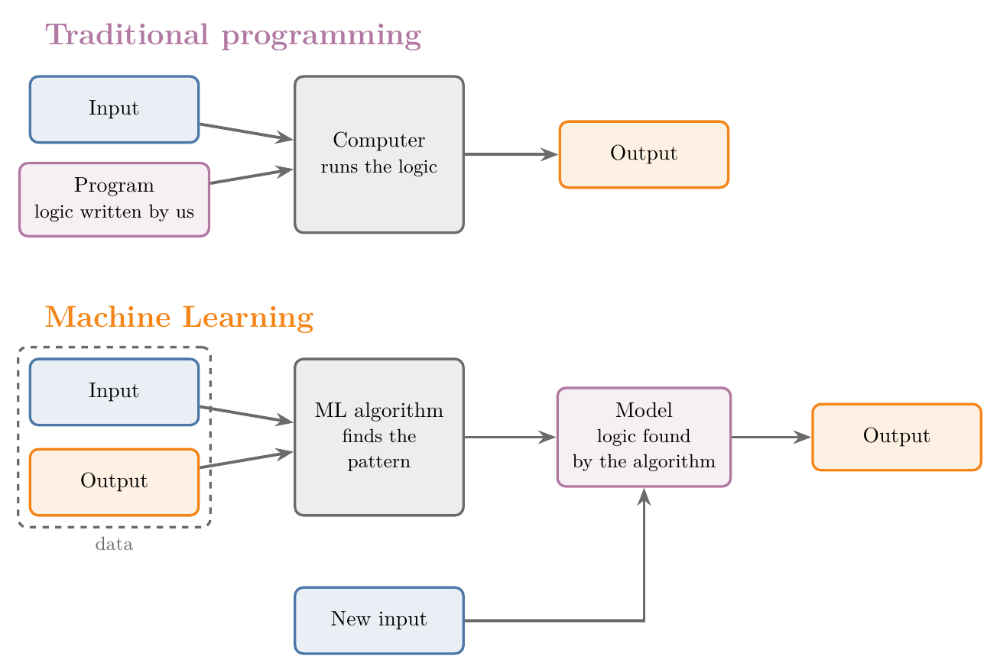
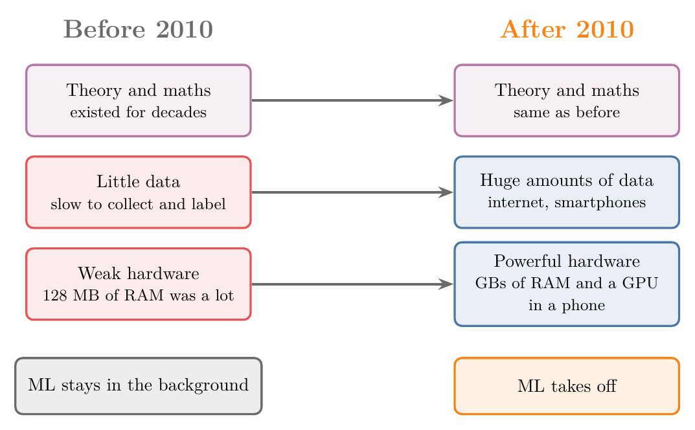
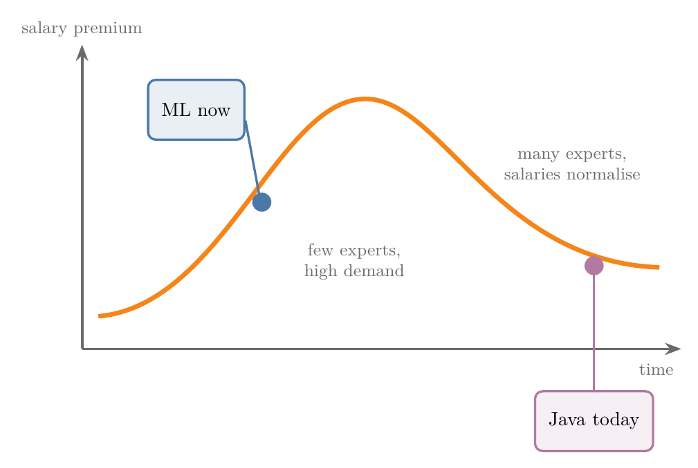

<!-- where-this-fits: generated by course_map/build_map.py; edit concepts.yaml, not this block -->
> **Where this fits:** Pipeline map step 0 (Foundations). See the [Course map](../01-course-map/note.md).
>
> 
>
> - **Leads to:** Deep learning ([Note 2](../02-ai-vs-ml-vs-dl/note.md)); Supervised learning ([Note 3](../03-types-of-ml/note.md)); Unsupervised learning ([Note 3](../03-types-of-ml/note.md)); Semi-supervised learning ([Note 3](../03-types-of-ml/note.md)); Reinforcement learning ([Note 3](../03-types-of-ml/note.md)); Applications of ML (Video 8, coming).
> - **Compare with:** Symbolic AI and expert systems ([Note 2](../02-ai-vs-ml-vs-dl/note.md)); Deep learning ([Note 2](../02-ai-vs-ml-vs-dl/note.md)); Exploratory data analysis ([Note 13](../13-toy-project/note.md)).
<!-- /where-this-fits -->

## 1. Overview

> **Key point:** Machine Learning lets a computer learn the logic from data, instead of us writing that logic by hand.

This Note is the second part of Note 1; the first part is the [Course map](../01-course-map/note.md).

Figure 1 shows the core idea. In traditional programming, we write the logic and the computer applies it. In Machine Learning, we give the computer inputs together with their outputs, and an algorithm finds the logic for us.

The rest of this Note covers:

- what Machine Learning is, and what "explicit programming" means,
- three situations where ML beats hand-written code,
- why ML only became popular after 2010,
- why ML skills are in demand.

## 2. Defining Machine Learning

> **Key point:** Machine Learning is learning from data, without being explicitly programmed.

The formal definition:

**Machine Learning (ML)** is a field of computer science that uses statistical techniques to give computer systems the ability to *learn* with data, without being explicitly programmed.

In simpler terms: Machine Learning is all about learning from data.

> **Extra:** The phrase "without being explicitly programmed" is usually credited to Arthur Samuel, who coined the term *machine learning* in 1959 while building a checkers program that improved by playing against itself. A more precise definition, from Tom Mitchell (1997): a program **learns** from experience E at a task T, measured by P, if its performance at T, measured by P, improves with E. For a spam filter: T is sorting emails into spam and not spam, E is a set of emails already labelled, and P is the share of emails it sorts correctly.

## 3. Explicit programming vs learning from data

> **Key point:** In explicit programming, we write code for every case. In ML, an algorithm finds the pattern between inputs and outputs, and handles the cases for us.

### 3.1 Explicit programming

> **Key point:** Explicit programming means writing code for each specific scenario.

**Explicit programming** means writing code for each specific scenario. For every situation the program must handle, we write the logic for it.

This is how traditional software is built. The top half of Figure 1 shows the flow: we write a **program** containing our logic, give it an input, and get an output.

### 3.2 Learning patterns from data

> **Key point:** We give the algorithm inputs and outputs; it finds the pattern; then we give it new inputs and it produces the outputs.

In ML we do not write the logic. The bottom half of Figure 1 shows what we do instead:

1. We collect **data** that contains both inputs and their outputs.
2. We give the data to an **ML algorithm**, a general method for finding patterns.
3. The algorithm explores the data and finds the **pattern** between input and output. This step is called **training**.
4. The result is a **model**: the logic, found by the algorithm instead of written by us.
5. We give the model new inputs, and it produces the outputs.

The advantage: we do not have to write code for each condition or case. The ML algorithm handles them automatically.

### 3.3 Example: adding numbers

> **Key point:** A hand-written sum program only does what we coded. A model that learned "addition" from data is not tied to the cases we thought of.

*Traditional programming.* We write a program that adds two numbers. Whenever we give it two numbers, it returns their sum.

*Machine Learning.* We do not write the addition ourselves. Instead, we give the algorithm a spreadsheet in which each row holds some numbers and their sum:

| Numbers | Sum |
|---|---|
| 2, 3 | 5 |
| 10, 4 | 14 |
| 1, 6, 2 | 9 |
| 5, 5, 5, 5 | 20 |

When the model trains on this data, it discovers that the pattern is addition. After training, whether we give it two, four or ten numbers, it adds them all.

The hand-written program cannot do this. It was coded to add exactly two numbers, so with more than two it fails until we rewrite it. This is the key difference, and a large part of why ML is so powerful in industry.

> **Extra:** Addition is a toy example; in practice we would just write the one line of code. Also, a model only learns the cases its data covers: a basic model trained only on pairs of numbers expects exactly two inputs, so to handle four or ten numbers, the training data must include rows like that. The point holds: the logic comes from the data, so new cases are handled by adding data, not by rewriting code.

## 4. When to use Machine Learning

> **Key point:** ML is the better choice when the rules keep changing, when there are too many cases to write, and when we want to dig out hidden patterns (data mining).

Not every problem needs ML. Three situations where it clearly beats traditional software development:

1. The rules keep changing (Section 4.1).
2. There are too many cases to even list (Section 4.2).
3. We want to find hidden patterns in data: data mining (Section 4.3).

There are other situations too, but these three are the most important.

### 4.1 When the rules keep changing: spam filtering

> **Key point:** Hand-written rules must be rewritten every time the world changes. An ML model updates itself from new data.

Suppose we must build an **email spam classifier**: a program that decides whether an email is spam or not.

*With explicit programming*, we would:

1. Collect a bunch of emails, each marked spam or not spam.
2. Look for patterns by hand. For example, spam often repeats words such as "discount", "sale" or "awesome", or is full of pictures.
3. Write a long **if-else ladder**: one `if` condition for each pattern we found.

Say one of our rules is: *if "huge" appears more than three times, mark the email as spam*. Figure 2 (left) shows what happens next.

Advertising companies find out about the rule and write "big" or "massive" instead of "huge". Our program no longer catches their emails, so we change the logic. They experiment with other words, and we have to change it again, and again.

*With Machine Learning* (Figure 2, right), the logic comes from the data. When advertisers change their words, we add the new labelled emails to the data, and the change is reflected in the logic automatically. We write one algorithm, and it handles everything else.

> **Extra:** This is how real spam filters moved to ML. In 2002, Paul Graham's essay *A Plan for Spam* popularised a simple statistical filter that learns word probabilities from labelled emails and outperformed hand-written rules; that method, Naive Bayes, is covered in [Note 87](../87-naive-bayes-intuition/note.md).

### 4.2 When there are too many cases: recognising dogs

> **Key point:** Some problems have so many cases that no one can write them all. We learn them from examples instead, as humans do.

Suppose we want a program that tells whether a picture contains a dog. This is an **image classification** problem.

There are hundreds of dog breeds:

- some large, some small,
- in many colours,
- with different ears, tails, coats and shapes.

To write this program by hand, we would need a case for every breed and every look. We cannot even imagine how many cases that is, so we cannot code it.

Instead, we use the same technique humans use. From childhood we were shown animals and told "this is a dog", "that is not a dog, that is a cat". Our mind kept tagging names to animals and learned from that data. An ML model learns from labelled photos in the same way.

### 4.3 Data mining: finding hidden patterns

> **Key point:** Data analysis finds patterns we can see in graphs. Data mining uses ML to find patterns too hidden for graphs.

First, what data analysis is. **Data analysis** is the process of searching data for patterns and hidden information, mostly by plotting graphs.

Sometimes the information is too well hidden to show up in any graph. For example, just by reading emails, we may be unable to spot which words make an email spam.

**Data mining** means applying an ML algorithm to data to extract such hidden patterns. Figure 3 contrasts the two:

{width=80%}

1. We build a prediction model, for example the email spam classifier.
2. We inspect the patterns the model has learned. For example: when "huge" occurs often, the email is labelled spam; when it is rare, the email is not spam.
3. The useful information we extract this way is the result of data mining.

Most of the time, when we need to extract hidden patterns from data, we use ML. ML is a very important tool for data mining.

> **Extra:** More broadly, data mining is the discovery of useful patterns in large datasets, using methods from ML, statistics and databases. It is also called *knowledge discovery in databases* (KDD). Data analysis and data mining overlap a lot; the difference is mainly how hidden the patterns are and whether a model is needed to find them.

## 5. A short history of Machine Learning

> **Key point:** ML is decades old. It took off only after 2010, once we had enough data and hardware powerful enough to learn from it.

### 5.1 Old ideas, late success

> **Key point:** Like an actor who plays small roles for years before becoming a star, ML existed long before it became famous.

The history of ML resembles the career of the actor Nawazuddin Siddiqui. He worked in films for years in tiny roles, such as a small part in *Munna Bhai MBBS* (2003), before becoming one of the country's biggest actors. A shift in the industry made the difference: OTT platforms and audiences who preferred content-driven films.

ML is similar. Its theory and mathematics have existed for 40 to 50 years, but it stayed out of the limelight, unlike other major technologies. Only from the 2010s did it rise to where it is today.

> **Extra:** The roots go back even further. Frank Rosenblatt built the perceptron, an early learning machine, in 1957, and Arthur Samuel named the field in 1959. A well-known turning point came in 2012, when a deep neural network (AlexNet) won the ImageNet image recognition contest by a wide margin.

### 5.2 Why ML took off after 2010

> **Key point:** Two problems held ML back: too little data and too weak hardware. The internet and smartphones solved both.

ML needs a significant amount of data. Before 2010, two things held it back (Figure 4, left):

1. **Data:** collecting and labelling data was slow, tedious work.
2. **Hardware:** computers were not powerful enough to run the algorithms on large data. Even 128 MB of RAM was a big deal.

After 2010, the internet and smartphones solved both problems (Figure 4, right).

*Data.* We now generate data at a huge pace. Think of everything one person does on a phone from morning until bed; then multiply by about 4 billion internet users around the world.

*Hardware.* Many of us carry phones with up to 12 GB of RAM and a GPU in our pocket, more than research scientists once had.

With good hardware, plenty of data and the algorithms, ML is now enjoying its success, and its growth is not expected to stop any time soon.

> **Extra:** The data figures move fast. A widely quoted IBM estimate from 2013 said that 90% of the world's data had been created in the previous two years. The number of internet users passed 5 billion in 2022 (ITU estimates about 5.5 billion in 2024).

## 6. Machine Learning jobs

> **Key point:** ML salaries are high because demand for ML skills is far greater than supply. As more people learn ML, salaries will settle, so early learners gain the most.

### 6.1 Supply and demand: the Java story

> **Key point:** When a new technology arrives, few people know it, so companies compete for them and salaries rise.

Today's ML jobs and salaries will not stay the same forever. The reason is simple economics, and the history of Java shows it:

1. When Java entered the market, only a handful of people knew it.
2. Companies needed Java because their competitors were using it.
3. When they went to hire, they found a lack of talent.
4. All the companies fought for the few Java professionals, so those people got higher salaries.

### 6.2 Where ML is on the curve

> **Key point:** ML is still on the rising part of the curve: few people know it well, so demand is high.

The same trend is happening with ML now. Many colleges do not teach ML yet, so when a company recruits at a college, it finds few students who know it. Companies compete for those students, which pushes salaries up.

Higher salaries make more people learn the technology. In a few years, most engineers may know ML, as most know Java today. Companies will then have many more options, and salaries will normalise.

Figure 5 shows this pattern for any technology: the salary premium first rises, then falls back as experts become common. ML is still on the rising part, so if we learn it well now, we can benefit from that growth.

> **Extra:** Figure 5 is a sketch of the supply-and-demand argument, not measured data. Real salaries depend on the role, country and skill level.

## 7. Summary

| | Traditional programming | Machine Learning |
|---|---|---|
| Who writes the logic | We do, case by case | The algorithm finds it in data |
| What we provide | Input + program | Input + output (data) |
| New case appears | Rewrite the code | Add data and retrain |
| Rules that keep changing (spam) | Endless rewrites | Logic updates from data |
| Too many cases (dog photos) | Impossible to code | Learned from labelled examples |

- ML: learning from data, without explicit programming.
- Explicit programming: writing code for every scenario.
- Use ML when rules keep changing, when cases are too many to write, and for data mining.
- Data mining uses ML to dig out patterns too hidden for graphs.
- ML is decades old; data and hardware made it take off after 2010.
- ML skills pay well because demand is ahead of supply; this will even out over time.

## 8. Key terms

| Term | Meaning |
|---|---|
| Machine Learning (ML) | A field of computer science where computers learn from data without being explicitly programmed |
| Explicit programming | Writing code for each specific scenario a program must handle |
| Program | Logic written by us that turns an input into an output |
| Data | Examples of inputs together with their outputs |
| ML algorithm | A general method that finds the pattern between inputs and outputs in data |
| Pattern | The relationship between input and output that the algorithm discovers |
| Training | The step in which an algorithm learns the pattern from data |
| Model | The logic produced by training, used to give outputs for new inputs |
| Spam classifier | A program that decides whether an email is spam or not |
| If-else ladder | A long chain of hand-written conditions, one per case |
| Image classification | Deciding what a picture contains, e.g. dog or not dog |
| Data analysis | Finding patterns and hidden information in data, mainly by plotting graphs |
| Data mining | Using ML on data to extract patterns too hidden for graphs |
