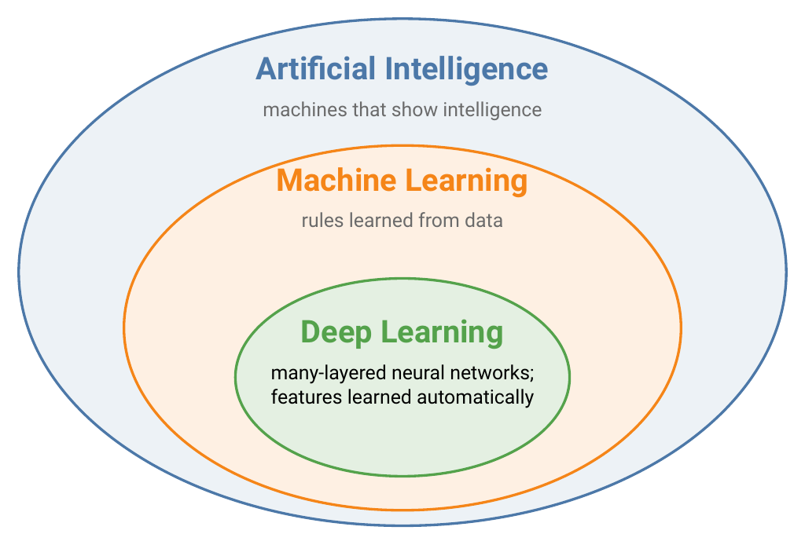
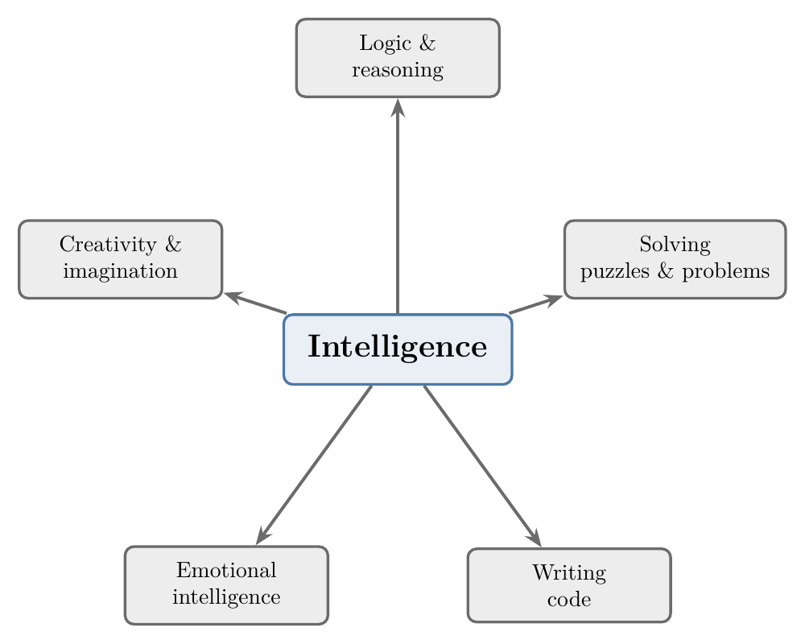
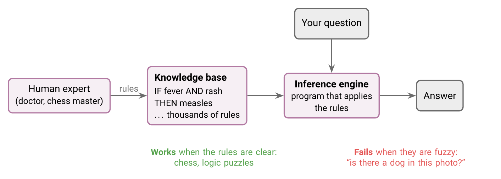
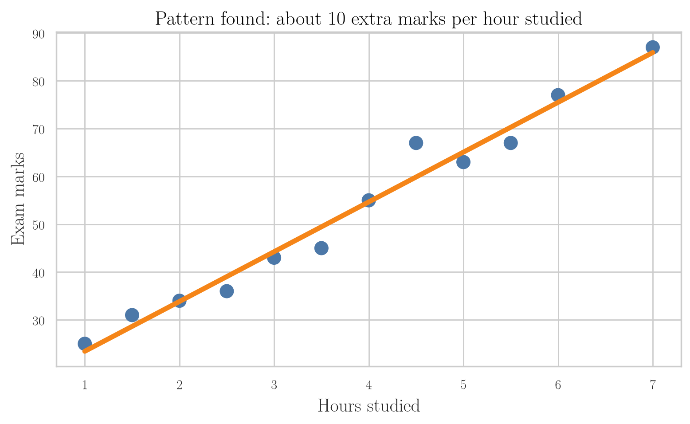
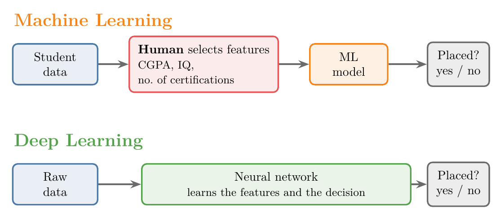
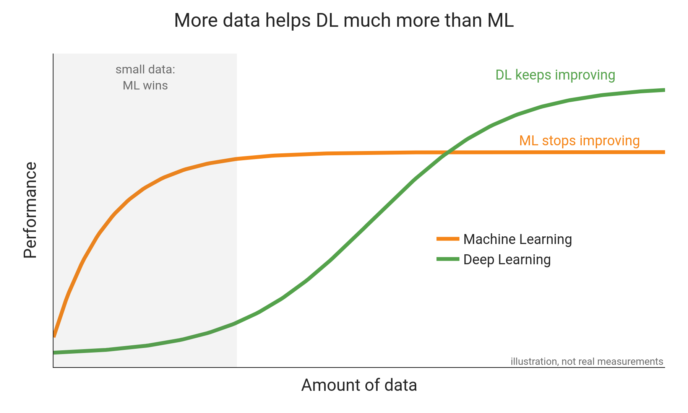

<!-- where-this-fits: generated by course_map/build_map.py; edit concepts.yaml, not this block -->
> **Where this fits:** Pipeline map step 0 (Foundations). See the [Course map](../01-course-map/note.md).
>
> 
>
> - **Leads to:** Supervised learning ([Note 3](../03-types-of-ml/note.md)); Unsupervised learning ([Note 3](../03-types-of-ml/note.md)); Semi-supervised learning ([Note 3](../03-types-of-ml/note.md)); Reinforcement learning ([Note 3](../03-types-of-ml/note.md)); Feature engineering ([Note 7](../07-challenges-in-ml/note.md)); Applications of ML ([Note 8](../08-applications-of-ml/note.md)).
> - **Compare with:** What deep learning is ([Note 1001](../1001-dl-scope-and-prerequisites/note.md)).
<!-- /where-this-fits -->

## 1. Overview

> **Key point:** Deep Learning is a part of Machine Learning, and Machine Learning is a part of Artificial Intelligence.

Figure 1 shows the three fields as nested circles. Every DL system is also an ML system, and every ML system is also an AI system.

## 2. Artificial Intelligence

> **Key point:** AI is the field of building machines that show intelligence. Every AI system in use today handles one narrow task.

**Artificial Intelligence (AI)** is the field of building machines that show intelligence. To see what that involves, we first need to look at what intelligence is.

### 2.1 Intelligence is many abilities

> **Key point:** Intelligence is not one ability but a combination of many, and some of them cannot even be defined precisely.

Figure 2 shows some of the abilities that make up human intelligence. We use different ones for different jobs: logic to write code, problem solving to crack a puzzle, imagination to create something new.

Some of these abilities, such as logic, are well defined. Others, such as creativity or emotional intelligence, have no precise definition. An ability we cannot define is very hard to build into a machine.

### 2.2 Narrow AI and general AI

> **Key point:** All AI today is narrow AI. General AI, a machine with every human ability, does not exist yet.

- **Narrow AI**: a system that performs one specific task, such as recognising faces, translating text or playing chess.
- **Artificial general intelligence (AGI)**: a single machine with all the abilities in Figure 2, like a human.

AGI is the long-term goal of the field. Every AI system we use today is narrow AI.

## 3. Symbolic AI and expert systems

> **Key point:** Early AI worked by having humans write down rules. This works for problems with clear rules and fails for everything else.

Figure 3 shows how approaches to AI changed over time. Serious work on AI began in the 1950s.

The first approach was **symbolic AI**: humans write down the knowledge a machine needs, as explicit rules. The machine then follows those rules.

> **Extra:** The start of AI is usually dated to Alan Turing's 1950 paper *Computing Machinery and Intelligence*, which asked "Can machines think?". The middle two eras in Figure 3 are approximate.

### 3.1 How an expert system works

> **Key point:** An expert system stores an expert's knowledge as rules and uses a program to apply them.

The best-known product of symbolic AI is the **expert system**. Figure 4 shows how one is built and used.

1. We collect knowledge from a **human expert**, such as a doctor or a chess master.
2. We write that knowledge as rules in a **knowledge base**.
3. An **inference engine**, a program, applies those rules to answer questions.

Chess-playing computers are a classic example.

### 3.2 Why expert systems fail

> **Key point:** Expert systems need clear, fixed rules. Most real-world problems do not have them.

Expert systems work well when a problem has clear, fixed rules, as in chess or logic puzzles. They fail when the rules are fuzzy.

Take the question: *does this photo contain a dog?* Hundreds of breeds, looks, angles and lights make the rules impossible to write down (see the dog example in Section 4.2 of the [what is ML Note](../01-what-is-ml/note.md)). Speech recognition fails for the same reason, and Machine Learning was developed to solve exactly this kind of problem.

## 4. Machine Learning

> **Key point:** In Machine Learning, we do not write the rules. We give the machine examples with answers, and it works out the rules itself.

**Machine Learning (ML)** is a branch of computer science that uses statistical techniques to find patterns in data. It became practical only once we had enough data and fast hardware (see Section 5.2 of the [what is ML Note](../01-what-is-ml/note.md)).

### 4.1 Learning rules from data

> **Key point:** Traditional programming turns rules into answers. ML turns answers into rules.

Instead of writing every rule by hand (explicit programming), we give the machine data and the correct answers, and it finds the rules itself (see Section 3 of the [what is ML Note](../01-what-is-ml/note.md)). Finding the rules from examples is called **learning**. Once a machine has learned, it can **predict**: give an answer for new data it has never seen.

> **Extra:** What does "finding a pattern" look like? Suppose we record how many hours 12 students studied and the marks each one scored. Plotted together (Figure 5), the points rise from left to right, and the line through them says: each extra hour of study adds about 10 marks. That line *is* the pattern. A student who studies 5 hours can now be predicted to score about 65, even though we never saw that student. Finding the best line through data like this is one of the statistical techniques ML uses (covered later as *linear regression*).

### 4.2 Teaching a machine to recognise dogs

> **Key point:** We stop writing rules and start providing labelled examples.

An ML model learns what a dog looks like from labelled photos, as children do (see Section 4.2 of the [what is ML Note](../01-what-is-ml/note.md)). Compared with symbolic AI:

| Approach | What we do | Result |
|---|---|---|
| Symbolic AI | Write rules for every breed, colour and shape | Impossible to finish |
| ML | Show thousands of photos labelled "dog" or "not dog" | The machine learns what a dog looks like and can classify new photos |

## 5. Deep Learning

> **Key point:** DL is ML that uses neural networks. Its big advantage: it finds the features by itself, and it keeps improving as we give it more data.

**Deep Learning (DL)** is a subset of ML that took off after about 2010.

The process is the same as in ML. We give data to an algorithm and **train** it: the algorithm makes predictions, measures how wrong they are, and adjusts itself to be less wrong. Then we use it to predict on new data. What changes is the algorithm.

### 5.1 Neural networks

> **Key point:** Neural networks are inspired by the brain, but they do not work like the brain.

DL uses **neural networks**, which are loosely inspired by the neurons in the brain. How the brain works is still not fully understood, so a neural network is not a copy of it. It is a mathematical model that borrows one idea: many simple units connected together.

The smallest unit of a neural network is the **perceptron**, an artificial neuron. It is covered in detail in later Notes.

### 5.2 Features: chosen by us or learned

> **Key point:** In ML, we choose the features. In DL, the network learns them.

A **feature** is one piece of information about an example that a model uses to make its decision. For example, to predict whether a student will get a job in campus placements, our data might look like this:

| Student | CGPA | IQ | Certifications | Placed? |
|---|---|---|---|---|
| A | 8.9 | 120 | 3 | Yes |
| B | 6.1 | 105 | 0 | No |
| C | 7.5 | 112 | 2 | Yes |

Here CGPA, IQ and Certifications are the features, and "Placed?" is the answer we want to predict.

Figure 6 shows the difference:

- **ML:** we decide which features matter and supply them. Choosing well requires a good understanding of the data. A useful feature we leave out can never be used by the model.
- **DL:** we supply the raw data, and the network works out which information matters.

This makes DL valuable when nobody knows what the right features are. For example, nobody can list the features that make a photo a dog photo.

### 5.3 Layers build up understanding

> **Key point:** Each layer of a neural network combines what the previous layer found into something bigger.

A neural network is organised in **layers** of neurons. Each layer works on the output of the layer before it. Adding layers lets the network detect more complex patterns, and a network with many layers is called *deep*.

Figure 7 shows a network recognising a handwritten digit:

1. The first layer detects **edges**: short straight segments.
2. The next layer combines edges into **shapes**: a horizontal bar and a slanted line.
3. The next layer combines the shapes into the answer: 7.

> **Extra:** Nobody tells the layers to look for "edges" or "shapes". When researchers inspected trained networks, they found that early layers tend to respond to edges and later layers to larger parts. Figure 7 is a simplified version of this.

### 5.4 More data helps DL more

> **Key point:** ML stops improving after a point. DL keeps improving as data grows.

Figure 8 shows how performance changes as we add data:

- **ML** improves at first, then levels off.
- **DL** keeps improving as data grows.

This is why DL now outperforms ML on tasks with very large datasets: image classification, object detection, and text and speech tasks.

## 6. Choosing between ML and DL

> **Key point:** Lots of data, especially images, text or speech: use DL. Small or tabular data: use ML.

DL needs large amounts of data. With small datasets it performs worse than ML, as the shaded region of Figure 8 shows.

Many organisations, such as banks and insurance companies, do not have that much data. For them, ML remains the standard choice.

| Our data | Use |
|---|---|
| Small or medium, especially tables of numbers | ML |
| Very large, especially images, text or speech | DL |

## 7. Summary

| | AI | ML | DL |
|---|---|---|---|
| What it is | Machines that show intelligence | Machines that learn rules from data | ML with many-layered neural networks |
| Who writes the rules | Humans (symbolic AI) | The machine | The machine |
| Who chooses the features | No learning involved | We do | The network |
| Data needed | None | Moderate | Very large |
| Strong at | Problems with clear rules | Tables of data | Images, text, speech |

- AI $\supset$ ML $\supset$ DL.
- Expert systems fail on problems whose rules cannot be written down.
- ML: data + answers $\rightarrow$ rules. No explicit programming.
- DL learns its own features.
- With more data, DL keeps improving while ML levels off.
- With little data, use ML.

## 8. Key terms

| Term | Meaning |
|---|---|
| Artificial Intelligence (AI) | The field of building machines that show intelligence |
| Narrow AI | AI that performs one specific task |
| Artificial general intelligence (AGI) | A machine with all human abilities; does not exist yet |
| Symbolic AI | AI built from rules written by humans |
| Expert system | Symbolic AI system: an expert's rules plus a program that applies them |
| Knowledge base | The set of rules inside an expert system |
| Inference engine | The program that applies an expert system's rules |
| Machine Learning (ML) | Using statistical techniques to let a machine find patterns in data |
| Learning | Finding rules (patterns) from examples |
| Predict | Give an answer for new, unseen data |
| Deep Learning (DL) | ML using neural networks with many layers |
| Train | Let a model learn by repeatedly reducing its errors |
| Neural network | A model of many connected simple units, loosely inspired by the brain |
| Perceptron | The smallest unit of a neural network; an artificial neuron |
| Feature | One piece of information about an example that a model uses |
| Layer | One stage of a neural network, building on the previous stage |
