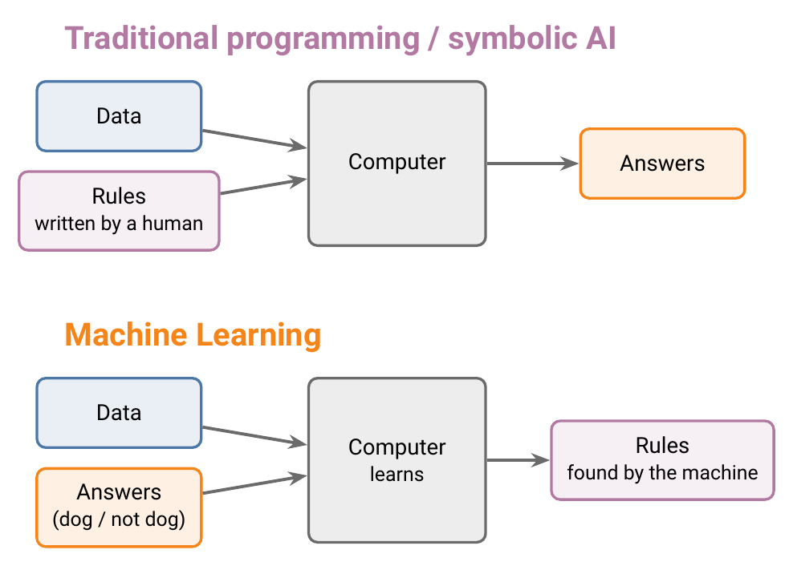

Source: [AI Vs ML Vs DL for Beginners](https://www.youtube.com/watch?v=1v3_AQ26jZ0)

## 1. Overview

Deep Learning is a subset of Machine Learning, and Machine Learning is a subset of Artificial Intelligence. Every DL system is an ML system, and every ML system is an AI system.

## 2. Artificial Intelligence

**Artificial Intelligence (AI)** is the field of building machines that show intelligence.

### 2.1 What intelligence is

Intelligence is not a single ability. It is a combination of many:

Some of these, such as logic, are well defined. Others, such as creativity or emotional intelligence, have no precise definition, which makes them very hard to build into a machine.

### 2.2 Narrow AI and general AI

- **Artificial general intelligence (AGI)**: one machine with all of these abilities, like a human. It does not exist yet, and it remains the long-term goal of the field.
- **Narrow AI**: a system that performs one specific task, such as recognising faces, translating text or playing chess. All AI in use today is narrow AI.

## 3. Symbolic AI and expert systems

The first approach to AI, starting in the 1950s, was **symbolic AI**: humans write down the knowledge a machine needs, as explicit rules.

Its best-known product is the **expert system**:

1. Knowledge is collected from a **human expert**, such as a doctor or a chess master.
2. It is written as rules in a **knowledge base**.
3. An **inference engine**, a program, applies those rules to answer questions.

Chess-playing computers are an example.

### 3.1 Limitation

Expert systems work only when the problem has **clear, fixed rules**, as in chess or logic puzzles. They fail when the rules are fuzzy.

*Example: does this photo contain a dog?* There are hundreds of breeds, each with a different size, colour, ear shape and tail, and a photo can be taken from any angle and in any light. No one can write rules covering all of this. Speech recognition fails for the same reason.

Machine Learning was developed to solve this class of problem.

> **Extra:** The 1950s start is usually dated to Alan Turing's 1950 paper *Computing Machinery and Intelligence*, which asked "Can machines think?". The middle two eras on the timeline are approximate.

## 4. Machine Learning

**Machine Learning (ML)** is a branch of computer science that uses **statistical techniques to find patterns in data**.

ML requires **no explicit programming**: no human writes the rules. The machine is given data together with the correct answers, and it works out the rules itself.

### 4.1 Example: detecting a dog

| Approach | Method | Result |
|---|---|---|
| Symbolic AI | Write rules for every breed, colour and shape | Impossible to complete |
| ML | Provide thousands of photos labelled "dog" or "not dog" | The system learns the pattern itself and can then classify new photos |

Finding the pattern from labelled examples is called **learning**. A model that has learned can then **predict**: give an answer for new data it has never seen.

The human's job changes from writing rules to providing good data. This mirrors how children learn: from examples ("this is a dog, this is not"), not from a rulebook.

### 4.2 Why ML became dominant

ML methods are decades old but became dominant in industry over the last 20 to 30 years, because of:

1. **Large amounts of data**, from the internet and phones.
2. **Fast, cheap hardware** that can learn from that data.

## 5. Deep Learning

**Deep Learning (DL)** is a subset of ML. It took off after about 2010.

The process is the same as in ML: give data to an algorithm, **train** it (let it learn while reducing its errors), then use it to predict on new data. The difference is the algorithm.

### 5.1 Neural networks

DL uses **neural networks**, which are loosely inspired by the neurons of the brain. Inspired by does not mean the same as: how the brain works is still not fully understood, so a neural network is a mathematical model, not a copy of the brain. Its smallest unit is the **perceptron**, an artificial neuron (covered later in the course).

### 5.2 Automatic feature extraction

A **feature** is one piece of information about an example that a model uses to make its decision.

In ML, **a human must choose the features**. In DL, **the network finds them itself**.

*Example: predicting whether a student will be placed in campus placements.*

- **ML:** you decide which features matter (CGPA, IQ, number of certifications) and supply them. Choosing well requires a good understanding of the data, and a useful feature that you leave out can never be used by the model.
- **DL:** you supply the raw data, and the network works out which information matters.

This makes DL especially useful when no one knows what the right features are. For example, nobody can list the features that make a photo a dog photo.

### 5.3 Layers

A neural network is organised in **layers** of neurons. Each layer builds on the output of the previous one, so adding layers lets the network detect more complex patterns. A network with many layers is called *deep*.

*Example: recognising a handwritten digit.*

1. The first layer detects **edges**: short straight segments.
2. The next layer combines edges into **shapes**: a horizontal bar, a slanted line.
3. The next layer combines shapes into the **answer**: 7.

> **Extra:** Layers are not told to look for "edges" or "shapes". When researchers inspected trained networks, they found that early layers tend to respond to edges and later layers to larger parts. The figure is a simplified version of this.

### 5.4 Data and performance

- **ML** performance improves with more data up to a point, then levels off.
- **DL** performance keeps improving as data grows.

As a result, DL outperforms ML on tasks with very large datasets: **image classification, object detection, and text and speech tasks**.

## 6. Choosing between ML and DL

DL needs **large amounts of data**. With small datasets it performs worse than ML (shaded region of the chart).

Many organisations, such as banks and insurance companies, do not have that much data, so ML remains the standard choice there.

| Data | Use |
|---|---|
| Small or medium, especially tables of numbers | ML |
| Very large, especially images, text or speech | DL |

## 7. Summary

| | AI | ML | DL |
|---|---|---|---|
| Definition | Machines that show intelligence | Machine learns rules from data | ML with many-layered neural networks |
| Who writes the rules | Humans (symbolic AI) | The machine | The machine |
| Who chooses the features | No learning involved | A human | The network |
| Data needed | None | Moderate | Very large |
| Strong at | Problems with clear rules | Tabular data | Images, text, speech |

- AI $\supset$ ML $\supset$ DL.
- Expert systems fail on problems whose rules cannot be written down.
- ML: data + answers $\rightarrow$ rules, with no explicit programming.
- DL removes manual feature selection.
- More data: DL keeps improving, ML levels off.
- Small data: use ML.

Terms: see the [glossary](../glossary.md).
