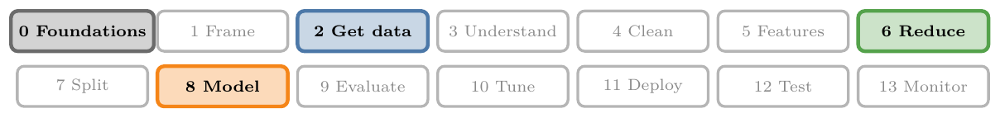
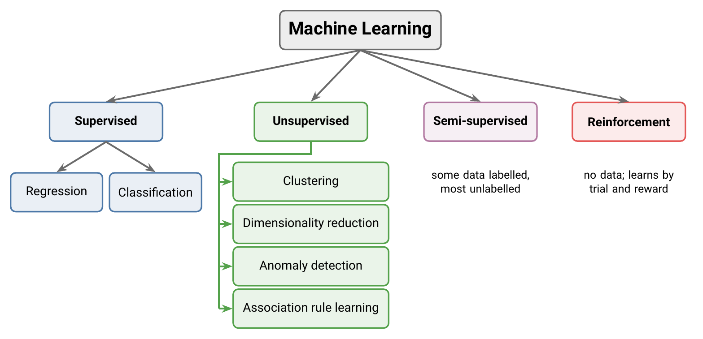
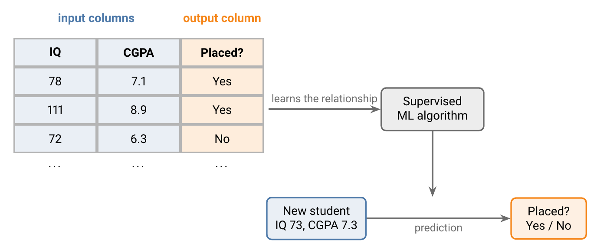
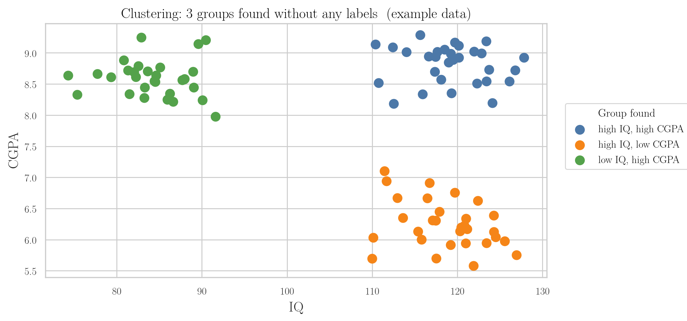
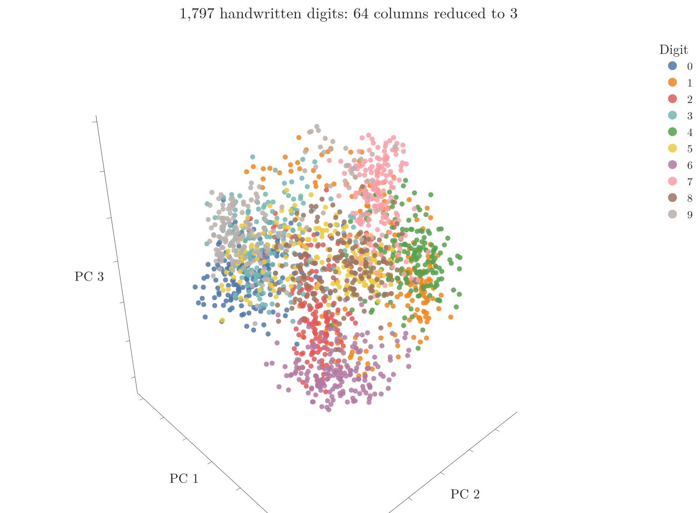
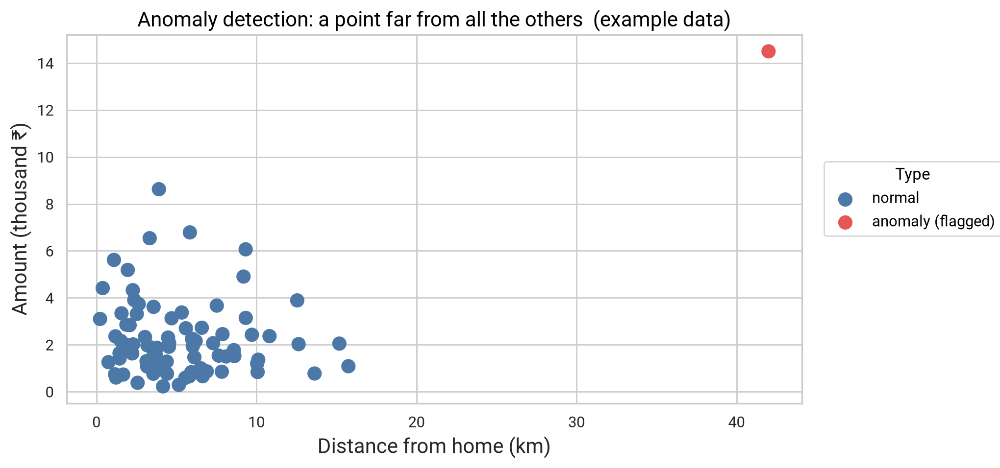
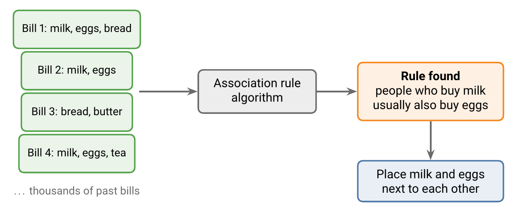
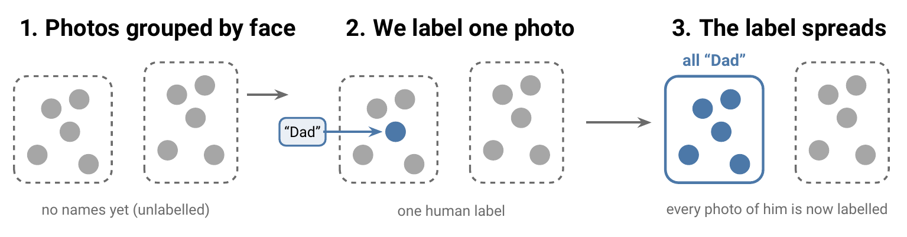
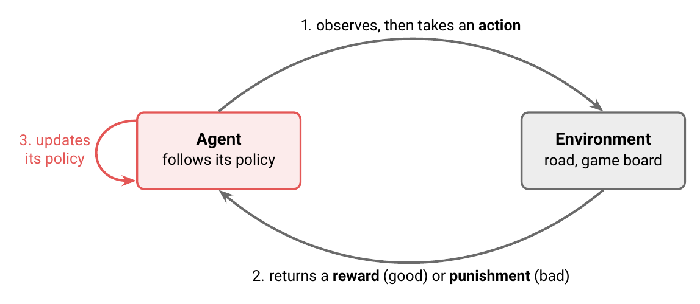

<!-- where-this-fits: generated by course_map/build_map.py; edit concepts.yaml, not this block -->
> **Where this fits:** Pipeline map steps 0 (Foundations), 2 (Get data), 6 (Reduce dimensions), 8 (Model). See the [Course map](../01-course-map/note.md).
>
> 
>
> - **Builds on:** Machine learning ([Note 2](../02-ai-vs-ml-vs-dl/note.md)).
> - **Leads to:** K-nearest neighbours ([Note 6](../06-instance-vs-model-based/note.md)); Feature selection (Video 9, coming); Feature extraction ([Note 46](../46-curse-of-dimensionality/note.md)); Logistic regression ([Note 13](../13-toy-project/note.md)); Simple linear regression (Video 50, coming); Naive Bayes (Video 82, coming).
<!-- /where-this-fits -->

## 1. Overview

> **Key point:** Based on how much supervision they need, ML algorithms fall into four types: supervised, unsupervised, semi-supervised and reinforcement learning.

ML algorithms can be grouped in three different ways:

- by **how much supervision** they need (this Note),
- by whether they learn all at once or keep learning over time (batch vs online),
- by how they generalise to new data (instance-based vs model-based).

**Supervision** means correct answers that guide the algorithm while it learns. Figure 1 shows the four types this produces and their sub-types.

## 2. Supervised learning

> **Key point:** In supervised learning, the data has both inputs and outputs. The algorithm learns how the output depends on the inputs, then predicts the output for new inputs.

### 2.1 Learning from inputs and outputs

> **Key point:** Input columns + output column $\rightarrow$ learn the relationship $\rightarrow$ predict the output for new rows.

In **supervised learning**, every row of the data has both **input** values and the correct **output**. The algorithm learns the mathematical relationship between them.

*Example: campus placements.* We have data on 5,000 past students (Figure 2):

- **Inputs:** IQ and CGPA.
- **Output:** whether the student was placed.

After learning, the algorithm can take a new student, say IQ 73 and CGPA 7.3, and predict *yes* or *no*. Most of the ML used in industry is supervised learning.

> **Extra:** The output column is also called the **target** or the **label**. Data that includes it is called **labelled data**.

### 2.2 Numerical and categorical data

> **Key point:** Data is either numerical (numbers) or categorical (categories).

Before splitting supervised learning further, we need the two basic types of data:

| Type | What it holds | Examples |
|---|---|---|
| **Numerical** | Numbers | Age, weight, height, IQ |
| **Categorical** | Categories | Gender, nationality, phone brand |

### 2.3 Regression and classification

> **Key point:** Numerical output: regression. Categorical output: classification.

Supervised learning has two sub-types. Which one we have depends only on the **output column**:

- **Regression:** the output is numerical. *Example:* predicting a student's salary package (4.5 LPA, 3.0 LPA, ...) from IQ and CGPA.
- **Classification:** the output is categorical. *Example:* predicting placed / not placed from IQ and CGPA.

In Figure 3, regression draws a line that gives a number for any input. Classification draws a boundary that splits the inputs into categories.

| Problem | Output | Type |
|---|---|---|
| Price of a house | A number | Regression |
| Is this email spam? | Yes / No | Classification |
| Will it rain today? | Yes / No | Classification |
| Is there a dog in this image? | Yes / No | Classification |

## 3. Unsupervised learning

> **Key point:** In unsupervised learning, the data has inputs only. There is nothing to predict, so the algorithm finds structure instead: groups, simpler columns, oddities or links.

### 3.1 Learning from inputs only

> **Key point:** No output column means no prediction. The algorithm describes the data instead.

In **unsupervised learning**, the data has only input columns. For example, we have the IQ and CGPA of students, but no placement column.

Without an output, we cannot predict anything. Unsupervised learning performs four other jobs, covered in Sections 3.2 to 3.5.

### 3.2 Clustering

> **Key point:** Clustering finds groups of similar rows, without being told what the groups are.

**Clustering** splits the data into groups (**clusters**) of similar rows. Figure 4 shows students plotted by IQ and CGPA; the algorithm found three groups on its own.

What the groups give us:

- **A category for each student:** for example, high IQ but low CGPA. A new student can be placed in one of the groups.
- **Labels for free:** we can number the groups (0, 1, 2) and then use them as an output column for supervised learning.
- **Customer segments:** an e-commerce site can group its customers by how they behave and treat each group differently.

With two columns we could spot the groups by eye. Clustering also works with hundreds of columns, where no human can see the groups.

### 3.3 Dimensionality reduction

> **Key point:** Dimensionality reduction cuts down the number of input columns while keeping the information. It speeds up learning and lets us plot high-dimensional data.

Each input column is a **dimension**. Images and text can have thousands of input columns, which causes two problems:

1. Algorithms become **slow**.
2. After a point, extra columns **stop improving** the results.

**Dimensionality reduction** removes the extra columns.

*Example: house prices.* Number of rooms and number of washrooms carry related information. We can combine them into one column, area (Figure 5).

Creating a new column from existing ones like this is called **feature extraction**. The data has one column fewer and loses almost no information.

**Visualisation.** A graph can show at most 3 dimensions. To see data with hundreds of columns, we reduce it to 2 or 3 columns and plot that.

*Example: handwritten digits.* Each digit is an 8 x 8 grid of pixels, which makes 64 columns. Figure 6 reduces them to 3 columns: images of the same digit land close together.

The technique used for Figure 6 is **PCA** (principal component analysis), covered in detail later in the course. The Notebook for this Note (`notebook.ipynb`) shows Figure 6 as a 3D plot that we can rotate.

> **Extra:** The best-known digits dataset, MNIST, uses 28 x 28 pixel images, which gives 784 columns. The idea is the same.

### 3.4 Anomaly detection

> **Key point:** Anomaly detection learns what normal data looks like and flags anything far from it.

**Anomaly detection** finds rows that do not fit the pattern of the rest. Typical uses:

- spotting defects in manufacturing,
- catching credit card fraud,
- flagging unusual loan applications.

In Figure 7, almost all transactions are small and close to home. The red one, large and 42 km away, is far from every normal point, so the system flags it.

### 3.5 Association rule learning

> **Key point:** Association rule learning finds items that tend to occur together.

**Association rule learning** looks for "if this, then that" patterns in data. Its classic use is deciding which products a shop places next to each other.

*Example: a supermarket.* We scan all the bills from the last one or two years (Figure 8). Suppose milk appears in 8 of 100 bills, and eggs appear in 6 of those 8. Then people who buy milk usually buy eggs as well, so the shop places the two together.

A famous case: a large US retailer found that customers buying baby diapers often also bought beer. Placing the two side by side increased sales. Hidden patterns like this are hard to spot by hand and easy for an algorithm.

> **Extra:** The diapers-and-beer story is usually told about Walmart. It most likely comes from a 1992 data analysis for the Osco Drug chain, and its details are disputed. It is still the standard example of association rules.

## 4. Semi-supervised learning

> **Key point:** Semi-supervised learning labels a few rows by hand and lets the algorithm label the rest.

Labels are **expensive**. Collecting inputs is easy; for example, we can download thousands of images in minutes. But someone has to look at each image and write down what is in it, which costs time and money.

**Semi-supervised learning** works with data where only a small part is labelled. We label a few rows, and the algorithm labels the rest automatically.

*Example: Google Photos* (Figure 9).

1. The app groups photos by the faces in them, without knowing any names. This step is unsupervised.
2. We tag one photo with a name, such as "Dad".
3. The name spreads to every photo in that group.

One human label replaced hundreds.

## 5. Reinforcement learning

> **Key point:** In reinforcement learning, there is no data. An agent learns by acting, getting rewards or punishments, and improving its rules.

### 5.1 Agent, environment, policy and reward

> **Key point:** The agent acts, the environment rewards or punishes, and the agent updates its policy. Repeat.

**Reinforcement learning (RL)** starts with no data at all. The algorithm learns from its own experience, getting better over time.

The parts of an RL system:

- **Agent:** the learner, for example a self-driving car or a game-playing program.
- **Environment:** the world the agent acts in, for example the road or the game board.
- **Policy:** the agent's rule book, saying which action to take in each situation.
- **Reward / punishment:** feedback from the environment after each action, good or bad.

Figure 10 shows the loop. The agent observes the environment, takes an action according to its policy, receives a reward or punishment, and updates its policy. The goal is to collect as much reward and as little punishment as possible.

### 5.2 Example: fire or water

> **Key point:** A bad result changes the policy, so the next choice is better.

Figure 11 shows an agent that can walk to fire or to water.

1. Its policy says *go to the fire*. It does, and gets a punishment.
2. It updates its policy to *go to the water*.
3. It goes to the water and gets a reward.

This is how people learn many things too: nobody hands us a dataset for living in a new city; we try, make mistakes and adjust. Training a pet with treats works the same way.

### 5.3 Where RL is used

> **Key point:** RL beat the world champion at Go and is used for self-driving cars, but it is harder to build than the other types.

- **Self-driving cars:** the car learns to drive by acting on the road and receiving feedback.
- **Games:** Go is far more complex than chess, and beating top humans was thought to be years away. In 2016, DeepMind's agent **AlphaGo** beat world champion Lee Sedol in four out of five games.

RL is harder to set up than the other types, but its use is growing fast.

## 6. Summary

| Type | Data | Goal | Example |
|---|---|---|---|
| Supervised: regression | Inputs + numerical output | Predict a number | Salary package from IQ and CGPA |
| Supervised: classification | Inputs + categorical output | Predict a category | Placed or not |
| Unsupervised: clustering | Inputs only | Find groups | Customer segments |
| Unsupervised: dimensionality reduction | Inputs only | Fewer columns | Rooms + washrooms $\rightarrow$ area |
| Unsupervised: anomaly detection | Inputs only | Flag unusual rows | Card fraud |
| Unsupervised: association rules | Inputs only | Find items that go together | Milk and eggs |
| Semi-supervised | A few labels, many unlabelled rows | Label the rest | Google Photos faces |
| Reinforcement | No data; rewards from an environment | Learn the best actions | AlphaGo |

- To identify a supervised problem, look at the **output column**: number $\rightarrow$ regression, category $\rightarrow$ classification.
- No output column $\rightarrow$ unsupervised.
- Few labels $\rightarrow$ semi-supervised.
- No data, only feedback $\rightarrow$ reinforcement.

## 7. Key terms

| Term | Meaning |
|---|---|
| Supervision | Correct answers that guide an algorithm while it learns |
| Supervised learning | Learning from data with inputs and outputs, to predict outputs |
| Input / output | The columns we know / the column we want to predict |
| Target, label | Other names for the output column |
| Labelled data | Data that includes the output column |
| Numerical data | Data made of numbers |
| Categorical data | Data made of categories |
| Regression | Supervised learning with a numerical output |
| Classification | Supervised learning with a categorical output |
| Unsupervised learning | Learning from inputs only, to find structure |
| Clustering | Splitting data into groups of similar rows |
| Cluster | One group found by clustering |
| Dimension | One input column |
| Dimensionality reduction | Reducing the number of input columns while keeping the information |
| Feature extraction | Creating a new column from existing ones |
| PCA | Principal component analysis, a dimensionality reduction technique |
| Anomaly detection | Finding rows that do not fit the pattern of the rest |
| Association rule learning | Finding items that tend to occur together |
| Semi-supervised learning | Learning from a few labelled rows and many unlabelled ones |
| Reinforcement learning | Learning by acting and receiving rewards or punishments |
| Agent | The learner in reinforcement learning |
| Environment | The world the agent acts in |
| Policy | The agent's rules for which action to take |
| Reward / punishment | Good / bad feedback after an action |
