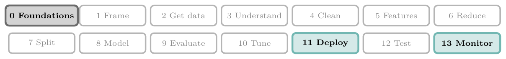
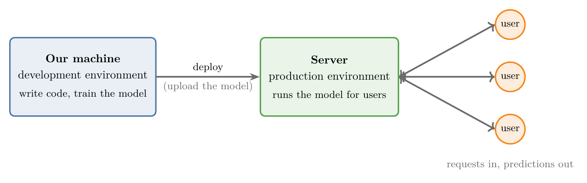
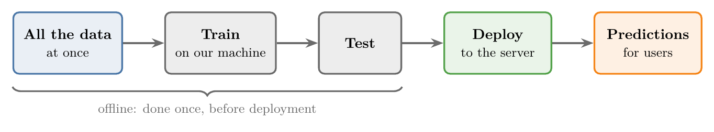
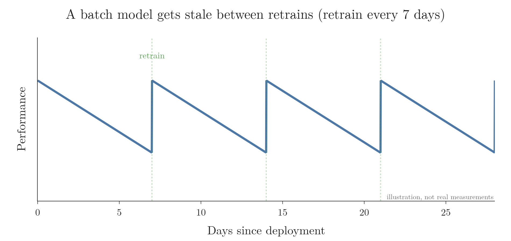
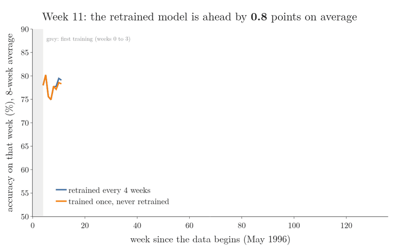
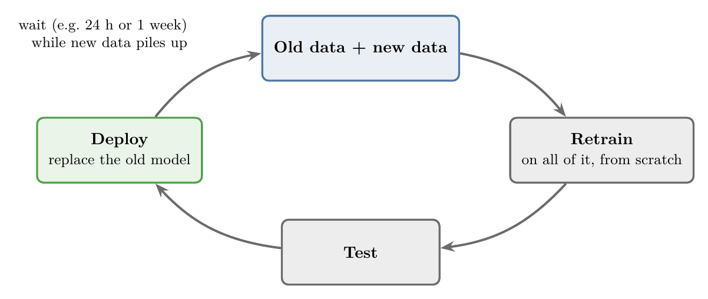
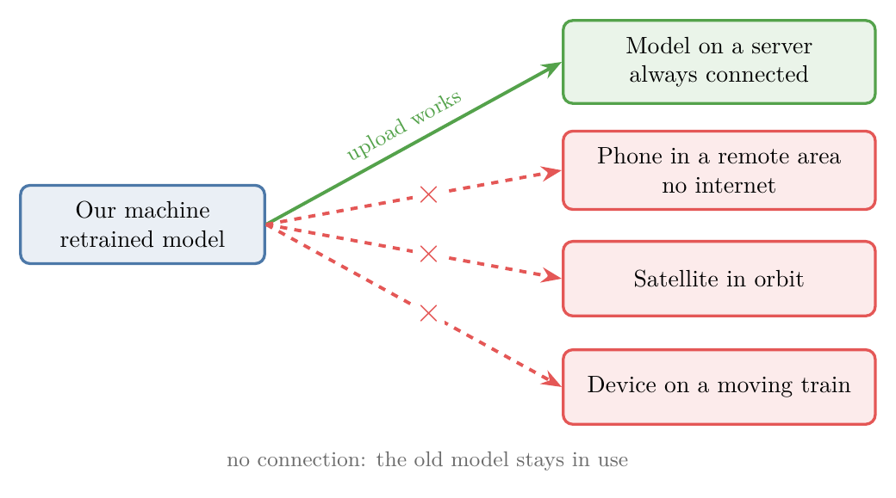
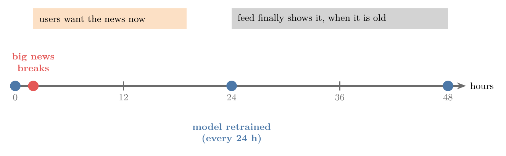

<!-- where-this-fits: generated by course_map/build_map.py; edit concepts.yaml, not this block -->
> **Where this fits:** Pipeline map steps 0 (Foundations), 11 (Deploy), 13 (Monitor and maintain). See the [Course map](../01-course-map/note.md).
>
> 
>
> - **Builds on:** APIs ([Note 7](../07-challenges-in-ml/note.md)); Software integration ([Note 7](../07-challenges-in-ml/note.md)); Saving models with pickle ([Note 9](../09-mldlc/note.md)); ML pipelines ([Note 13](../13-toy-project/note.md)).
> - **Leads to:** Online learning ([Note 5](../05-online-learning/note.md)); MLOps and cost ([Note 7](../07-challenges-in-ml/note.md)); Framing an ML problem ([Note 9](../09-mldlc/note.md)); Beta and A/B testing ([Note 9](../09-mldlc/note.md)).
> - **Compare with:** Online learning ([Note 5](../05-online-learning/note.md)).
<!-- /where-this-fits -->

## 1. Overview

> **Key point:** In batch learning, we train the model on all the data at once, on our own machine, and then deploy it. The deployed model never learns anything new until we retrain it.

This Note groups ML algorithms in a second way: **by how a model is trained once it is in production**. There are two types:

- **Batch learning**, also called **offline learning** (this Note),
- **Online learning** (the next Note).

## 2. Development and production

> **Key point:** We build a model on our own machine (development), then put it on a server where users can reach it (production).

A model is only useful once other people can use it. For that, it has to run on a **server** (G-1779): a computer that is always on and that users can reach over the internet.

Figure 1 shows the two places a model lives:

- **Development environment** (G-599): our own machine, where we write code and train the model.
- **Production environment** (G-1579): the server, where the model answers users' requests.

Moving a model from development to production is called **deploying** (G-592) it. How the model keeps learning after deployment is what separates batch learning from online learning.

## 3. Batch learning

> **Key point:** Batch learning trains on the whole dataset in one go, offline, and deploys the finished model.

### 3.1 How batch learning works

> **Key point:** All the data $\rightarrow$ train $\rightarrow$ test $\rightarrow$ deploy. Training happens once, before deployment.

**Batch learning** (G-265) is the conventional way to train an ML model: we use **the whole dataset at once**. Batch learning is not **incremental** (G-931): we do not feed the data in small groups of observations (**mini-batches**, G-263) over time.

Training on a large dataset is slow and expensive, so it is rarely done on the production server. Instead, a data scientist or ML engineer trains the model **offline**, on their own machine. Training offline is why batch learning is also called **offline learning** (G-1377).

Figure 2 shows the steps:

1. Take all the data.
2. Train the model on it.
3. Test that the model's predictions are correct.
4. Deploy the trained model to the server.
5. The model now makes predictions for every user who sends it data.

### 3.2 Example: a movie recommender

> **Key point:** A recommender trained this way keeps suggesting movies from the data it was trained on.

Suppose we work at Netflix and build a **recommendation engine** (G-1644) that suggests movies to users. With batch learning:

1. We train the recommender on our machine, using all the data we have.
2. We deploy it to Netflix's servers.
3. The recommender automatically suggests movies to every user.

## 4. Keeping a batch model up to date

> **Key point:** A batch model is frozen, but the world keeps changing. To stay useful, the model must be retrained regularly.

### 4.1 Models go stale

> **Key point:** Once deployed, a batch model learns nothing new, so it slowly falls out of date.

Once deployed, a batch model is **static** (a **static model**, G-1878): it keeps using what it learned from the old data. But real-world situations keep changing:

- **Movies:** new movies are added every week. Our recommender was trained before they existed, so it can never suggest them.
- **Spam:** a spam classifier that is accurate today will be out of date in a year, because spammers keep inventing new tricks.

Figure 3 sketches the effect (an illustration, not measured data). Performance slowly drops after each deployment and jumps back up each time we retrain.

Figure 4 measures the same effect on real data: the Electricity dataset, 45,312 half-hour records of the New South Wales electricity market from May 1996 to December 1998 (Harries 1999; OpenML dataset 151).

1. **The task.** For each half hour, predict whether the price goes up or down compared with the last 24 hours. The features are the time of day and the prices and demand in two states.
2. **The first model.** A **logistic regression** (G-1120; a classifier taught in [Note 72](../72-sigmoid-function/note.md)) is trained on the first 4 weeks (the grey strip). Both lines start from this same model.
3. **Frozen.** The orange model is never retrained. As the market changes, its accuracy falls from about 78 percent to below 60 percent within five months.
4. **Retrained.** The blue model is retrained every 4 weeks on all the data so far, so it keeps up with the market.
5. **The result.** Over the 130 weeks, the retrained model is right 73.3 percent of the time and the frozen one 68.0 percent: 5.4 points better on average.

Both lines go up and down together because some weeks are harder to predict for any model. The gap between them is the cost of a stale model.

> **Extra:** The slow loss of accuracy is often called **model drift** (G-1253). When the cause is that the link between the **features** (G-772; the input variables) and the **target** (G-1949; the output we predict) changes over time, the change is called **concept drift** (Gama et al. 2014, §2.1).

### 4.2 Retraining on a schedule

> **Key point:** Combine old and new data, retrain from scratch, test, redeploy, and repeat.

To keep a batch model current, we **retrain** (G-1689) it on a regular schedule. Figure 5 shows the cycle:

1. New data keeps arriving and is added to the old data.
2. We retrain the model **on all of it, from scratch**.
3. We test the new model.
4. We deploy it, replacing the old one.
5. We wait, and repeat.

How often we repeat depends on how long training takes, which depends on how much data we have. Common schedules are every 24 hours or once a week.

On the Electricity data of Figure 4, more frequent retraining gives a more accurate model:

| Retrain the model | Average weekly accuracy |
|---|---|
| never | 68.0 percent |
| every 13 weeks | 72.4 percent |
| every 4 weeks | 73.3 percent |
| every week | 73.7 percent |

Each extra retrain costs another full training run on all the data, so the schedule is a trade-off between accuracy and training cost.

## 5. Problems with batch learning

> **Key point:** Batch learning struggles with very large data, with models we cannot reach, and with situations that change fast.

Batch learning is the usual choice, and most deployed models are trained this way. It causes problems only in a few specific situations.

### 5.1 Too much data

> **Key point:** Batch learning must process all the data at once, and data keeps growing.

Data keeps growing. A social network, for example, adds huge amounts of new data every month.

Because batch learning trains on **all** the data at once, the dataset can eventually become too large for our tools to process in one go. We have no option to train on just part of it.

### 5.2 No connection to the model

> **Key point:** Retraining needs a connection to the deployed model. Some models run where there is none.

Retraining means bringing the model back, training it on new data and uploading it again. Retraining requires a connection to wherever the model is running. Sometimes there is none:

- An app used by the army in a remote area like Ladakh, running on phones with no internet access.
- Software running on a satellite once it is in orbit.
- A device installed on a moving train.

Figure 6 shows the difference. A retrained model reaches a server over the network at any time. The other three devices have no working link, so the new model cannot be uploaded and the old one stays in use.

In these cases, we cannot update the model frequently, so batch learning is a poor fit.

### 5.3 Slow to react

> **Key point:** A model retrained every 24 hours needs up to 24 hours to respond to anything new.

Suppose a social network ranks each user's feed with a model that is retrained every 24 hours, based on users' interests.

Now a big story breaks, such as the 2016 demonetisation announcement in India. Everyone wants to read about it, including users who usually read only about sport.

Figure 7 shows the problem:

- Users want the news **now**, but the model learns about the new interest only at the next retrain, up to 24 hours later.
- When it does update, the feed fills up with news that is already a day old.

Batch learning cannot handle situations that change this quickly. For these, a different approach is used: **online learning** (G-1391), the topic of the next Note.

## 6. Summary

| | Batch (offline) learning |
|---|---|
| Training data | The whole dataset, at once |
| Where training happens | On our own machine, before deployment |
| After deployment | The model is static; it learns nothing new |
| Staying up to date | Retrain from scratch on old + new data, on a schedule (e.g. daily or weekly) |
| Weak spots | Very large data, no connection to the model, fast-changing situations |
| Example | A movie recommender retrained every week |

- **Development** = our machine. **Production** = the server users reach. **Deploying** moves a model from one to the other.
- Batch models go stale because the world changes; regular retraining fixes this.
- Retraining is from scratch on all the data, so it gets slower as data grows.
- For fast-changing situations, use online learning instead.

The Notebook for this Note (`notebook.ipynb`) has a slider for the retraining schedule, showing how stale the model gets between retrains.

## 7. Sources

**Built from**

- CampusX, "Batch Machine Learning | Offline Vs Online Learning | Machine Learning Types", YouTube, https://www.youtube.com/watch?v=nPrhFxEuTYU

**Other references**

- Gama, J., Žliobaitė, I., Bifet, A., Pechenizkiy, M. and Bouchachia, A. (2014). A Survey on Concept Drift Adaptation. *ACM Computing Surveys* 46(4).
- Harries, M. (1999). *Splice-2 Comparative Evaluation: Electricity Pricing*. Technical report, University of New South Wales. The data as OpenML dataset 151, "electricity" (normalised by A. Bifet), https://www.openml.org/d/151

## 8. Key terms

| Term | Meaning |
|---|---|
| Server | A computer that is always on and that users reach over the internet |
| Development environment | Our own machine, where we build and train a model |
| Production environment | The server where a model serves real users |
| Deploy (G-592) | Move a model from development to production |
| Batch learning | Training on the whole dataset at once, offline, then deploying |
| Offline learning | Another name for batch learning |
| Incremental learning (G-931) | Training on small pieces of data over time (the opposite of batch) |
| Recommendation engine (G-1644) | A model that suggests items, such as movies, to users |
| Static model | A model that learns nothing new after deployment |
| Retrain | Train a model again, here from scratch on old + new data |
| Model drift / concept drift | A model's accuracy dropping as the real world changes |
