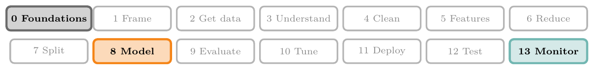
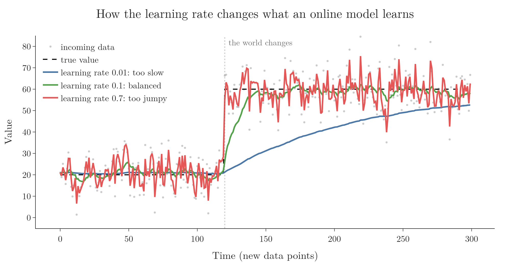
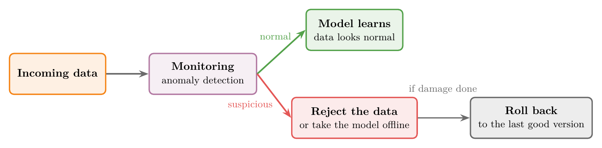

<!-- where-this-fits: generated by course_map/build_map.py; edit concepts.yaml, not this block -->
> **Where this fits:** Pipeline map steps 0 (Foundations), 8 (Model), 13 (Monitor and maintain). See the [Course map](../01-course-map/note.md).
>
> 
>
> - **Builds on:** Model drift ([Note 4](../04-batch-learning/note.md)).
> - **Leads to:** Framing an ML problem ([Note 9](../09-mldlc/note.md)); Perceptron loss ([Note 1006](../1006-perceptron-loss/note.md)); Batch size in Keras ([Note 1020](../1020-gradient-descent-in-neural-networks/note.md)).
> - **Compare with:** Batch (offline) learning ([Note 4](../04-batch-learning/note.md)); Batch gradient descent ([Note 58](../58-batch-gradient-descent/note.md)); Mini-batch gradient descent ([Note 60](../60-mini-batch-gradient-descent/note.md)).
<!-- /where-this-fits -->

## 1. Overview

> **Key point:** In online learning, the model keeps learning after deployment. New data arrives in small mini-batches, and the model updates itself on the server after each one.


When a company says "the more you use our product, the better it gets", it is usually describing online learning. The model is not frozen after deployment: it trains on new data while it is live.

## 2. What online learning is

> **Key point:** Training is incremental: small mini-batches arrive one after another, and the model improves after each.

### 2.1 Learning in small steps

> **Key point:** Many small updates instead of one big training run.

**Online learning** trains a model **incrementally**. Instead of using the whole dataset at once (as in batch learning), we feed the model data **sequentially**, in small groups called **mini-batches**, one after another. After each mini-batch, the model improves a little.

Each mini-batch is small, so each training step is fast and cheap. That makes it possible to train the model on the production server itself, while it is online. Hence the name.


Figure 1 compares the two:

- **Batch:** all the data goes in once, and the model is then frozen. New data waits for the next retrain.
- **Online:** mini-batches stream in one by one, and the model updates after every one.

### 2.2 The online learning workflow

> **Key point:** Train on a little data, deploy, then predict and learn at the same time.


Figure 2 shows the steps:

1. Start with a small amount of data and train the model on it.
2. Test it, then deploy it to the server.
3. New data keeps arriving. The model makes predictions on it and learns from it at the same time.

As new data arrives, the model's performance keeps improving to match it.

### 2.3 Examples

> **Key point:** Chatbots, smart keyboards and video feeds adapt to us as we use them.

- **Chatbots and voice assistants** such as Google Assistant, Alexa and Siri keep learning from new conversations after deployment.
- **Smart keyboards** such as SwiftKey get better at predicting our words the more we type.
- **YouTube:** after we watch a video and go back to the feed, the feed has already changed to show related videos. The clicks we just made became new training data.

Many companies still use batch learning, but the industry is moving towards online learning.

## 3. When to use online learning

> **Key point:** Use online learning when the problem keeps changing, when the data is huge, or when results are needed fast.

1. **The problem changes over time.** Some problems keep shifting: stock prices, or an e-commerce site where trends and customer behaviour change constantly. Here the model must keep adapting, which is exactly what online learning does.
2. **Cost.** Retraining a batch model on a very large dataset is expensive. Online learning works with small mini-batches, so each step costs little.
3. **Speed.** Each training step is tiny, so the model reflects new data almost immediately.

For problems that do not change, batch learning is still simpler and works well.

## 4. Implementing online learning

> **Key point:** Use a model with `partial_fit` in scikit-learn, or a dedicated library such as River or Vowpal Wabbit.

### 4.1 scikit-learn's `partial_fit`

> **Key point:** `fit` starts from scratch on all the data; `partial_fit` continues from where the model left off.

Most scikit-learn models are trained with `fit`, which uses all the data at once. Some models also have **`partial_fit`**, which trains on the data given and keeps what the model already learned. Calling it again with new data continues the training.

One such model is **`SGDRegressor`**. It does the same job as linear regression (covered in later Notes), but learns step by step, which is what makes `partial_fit` possible.

> **Python:** Training one row at a time.
>
> ```python
> import numpy as np
> from sklearn.linear_model import SGDRegressor
>
> model = SGDRegressor()
>
> # first row: 3 inputs, output 10
> model.partial_fit(np.array([[1.0, 2.0, 3.0]]), np.array([10.0]))
>
> # a new row arrives: training continues
> model.partial_fit(np.array([[2.0, 1.0, 0.5]]), np.array([6.0]))
> ```
>
> `np.array([[...]])` is a table with one row; `np.array([...])` holds its output value. Each `partial_fit` call takes a fraction of a second, so the model can keep learning as each new row arrives.

### 4.2 Dedicated libraries

> **Key point:** River and Vowpal Wabbit are built specifically for online learning.

- **River:** a Python library for online machine learning on streaming data. It was formed by merging two earlier libraries, creme and scikit-multiflow.
- **Vowpal Wabbit:** a very fast library, widely used in reinforcement learning, that also supports online learning.

## 5. The learning rate

> **Key point:** The learning rate controls how fast the model adapts. Too high and it forgets the past; too low and it is slow to learn anything new.

The **learning rate** sets how strongly each new mini-batch changes the model.

- **Too high:** the model changes very quickly and forgets what it learned before. It chases every bit of noise.
- **Too low:** the model barely changes. It remembers the past well but is slow to learn anything new.

We want a balance: the model should learn new patterns while still remembering the old ones.



In Figure 3, the true value jumps at step 120. With a rate of 0.01, the model takes a very long time to catch up. With 0.7, it reacts to every noisy point. With 0.1, it follows the change quickly and stays steady.

Setting the learning rate is the most important decision in online learning. If it is wrong, the model can behave badly or stop working.

## 6. Out-of-core learning

> **Key point:** When data is too big to fit in memory, we split it into chunks and train on them one at a time.

Sometimes a dataset is too large to load at once. For example, a 50 GB dataset cannot be loaded on a machine with 8 GB of RAM, so it cannot be trained with batch learning.

**Out-of-core learning** solves this with the online-learning technique:


1. Split the dataset into small chunks (Figure 4).
2. Feed the chunks to the model one at a time, training incrementally.
3. Deploy the trained model.

All of this happens offline, on our own machine. So out-of-core learning is not online learning, even though it uses the same incremental technique.

## 7. Risks of online learning

> **Key point:** Online learning is hard to run reliably, and bad incoming data can damage the model. Monitor it and be ready to roll back.

### 7.1 Hard to run reliably

> **Key point:** Training a model is easy; keeping it learning correctly on a live server is not.

Running online learning in production means handling a constant stream of data, choosing the right learning rate and keeping everything working, all at once. This is especially hard when data arrives in real time.

The tools are also young. Most are open-source libraries built by small groups, without the enterprise-grade reliability of established batch tools.

### 7.2 Bad data can damage the model

> **Key point:** The model learns from whatever arrives, including bad data.

An online model changes according to the data it receives. If that data goes wrong, for example because the server is hacked and fake requests flood in, the model learns from it and becomes biased towards wrong answers.

The defences (Figure 5):



- **Monitoring:** watch the system constantly. An **anomaly detection** algorithm can flag unusual incoming data.
- **Reject or go offline:** when data looks suspicious, refuse it or take the model offline.
- **Roll back:** if damage is already done, restore the model to its last good version.

## 8. Batch vs online learning

> **Key point:** Batch is simpler and proven; online adapts continuously but is harder to run.

| | Batch (offline) learning | Online learning |
|---|---|---|
| Complexity | Low: train on our machine, deploy, predict | Higher: the model keeps changing and must be monitored |
| Computing power | Large training runs, occasionally | Small updates, continuously |
| Use in production | Easier to implement | Harder to implement |
| Best for | Problems that do not change (e.g. classifying dog breeds: a dog is still a dog in 10 years) | Problems that keep changing (e.g. weather, stock prices, trends) |
| Tools | Mature, industry-proven | Newer, still an active research area |

Building a model with high accuracy is only part of the job. In industry, we also have to think about what happens after deployment: how much the server costs, and how the model reacts when the data changes.

The Notebook for this Note (`notebook.ipynb`) trains a model one row at a time with `partial_fit`, then compares a batch model and an online model when the data suddenly changes.

## 9. Summary

| | Online learning |
|---|---|
| Training data | Small mini-batches, arriving one after another |
| Where training happens | On the production server, while the model is live |
| After deployment | The model keeps learning from new data |
| Key setting | The learning rate |
| Strong at | Changing problems, huge data, fast updates |
| Weak spots | Hard to run, young tools, vulnerable to bad data |
| Examples | Chatbots, smart keyboards, video feeds |

- Online learning = incremental training on mini-batches, while the model is live.
- In scikit-learn, models with `partial_fit` can learn this way.
- The learning rate balances learning new patterns against remembering old ones.
- Out-of-core learning uses the same technique offline, for data too big for memory.
- Protect an online model with monitoring, anomaly detection and rollback.

## 10. Key terms

| Term | Meaning |
|---|---|
| Online learning | Training incrementally on mini-batches while the model is live in production |
| Incremental training | Training in small steps, keeping what was learned before |
| Sequential data | Data fed one piece after another, in order |
| Mini-batch | A small group of data points used for one training step |
| `partial_fit` | A scikit-learn method that continues training from where the model left off |
| `SGDRegressor` | A scikit-learn model that does linear regression step by step |
| River | A Python library for online machine learning |
| Vowpal Wabbit | A fast learning library that supports online learning |
| Learning rate | How strongly each new piece of data changes the model |
| Out-of-core learning | Training on data too big for memory by feeding it in chunks, offline |
| Biased model | A model pushed towards wrong answers, e.g. by bad data |
| Rollback | Restoring a model to an earlier, good version |
