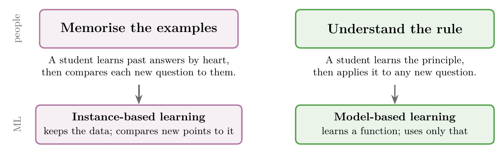
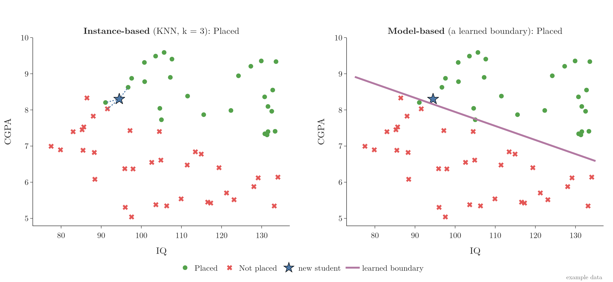
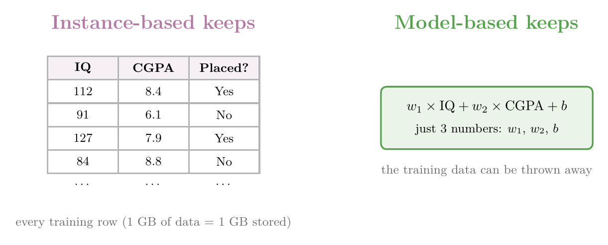

<!-- where-this-fits: generated by course_map/build_map.py; edit concepts.yaml, not this block -->
> **Where this fits:** Pipeline map steps 0 (Foundations), 5 (Engineer features), 8 (Model). See the [Course map](../01-course-map/note.md).
>
> 
>
> - **Builds on:** Classification problems ([Note 3](../03-types-of-ml/note.md)).
> - **Leads to:** Standardization ([Note 9](../09-mldlc/note.md)); Logistic regression ([Note 13](../13-toy-project/note.md)); Normalization ([Note 25](../25-normalization/note.md)); K-means ([Note 32](../32-binning-binarization/note.md)); KNN imputer ([Note 39](../39-knn-imputer/note.md)); PCA ([Note 47](../47-pca-geometric-intuition/note.md)).
> - **Compare with:** Bias-variance trade-off ([Note 62](../62-bias-variance/note.md)); Decision trees ([Note 97](../97-decision-trees-intuition/note.md)); ANN for classification ([Note 1011](../1011-customer-churn-ann/note.md)).
<!-- /where-this-fits -->

## 1. Overview

> **Key point:** Some ML algorithms memorise the training data and compare new points to it (instance-based). Others learn a general rule from the data and use only that rule (model-based).

This Note groups ML algorithms in a third way: **by how a model learns**. There are two types:

- **Instance-based learning**,
- **Model-based learning**.

We have not studied any algorithms yet. The aim here is to be able to tell, for every algorithm we meet later, which of the two it is.

## 2. Two ways to learn

> **Key point:** Memorising examples vs understanding the rule behind them: people learn both ways, and so do ML algorithms.

People learn in two broad ways:

- **Memorising:** learning past answers by heart, then comparing each new question with them. Many of us studied some exam subjects this way.
- **Understanding:** learning the underlying principle, then applying it to any new question.

ML algorithms work the same way (Figure 1).

- **Instance-based learning** memorises: it keeps the training data and compares new points with it.
- **Model-based learning** understands: it extracts the underlying pattern as a mathematical function and uses that.

Both are explained below with the same example: predicting whether a student will be placed, from their IQ and CGPA.

## 3. Instance-based learning

> **Key point:** Training = storing the data. Prediction = find the most similar stored points and copy their answer.

### 3.1 How it works

> **Key point:** Nothing is learned until a question arrives. Then the algorithm looks at the stored points nearest to it.

In **instance-based learning**, training does nothing except store the training data. All the work happens when a new point arrives:

Figure 2 shows the steps for a new student with IQ 94.5 and CGPA 8.3:

1. **Store:** keep every training point. Green points were placed, red were not.
2. **Measure:** compute the **distance** from the new student to every stored student. Distance measures **similarity**: the closer two points are, the more alike the students.
3. **Pick the nearest:** keep the *k* closest points. Here *k* = 3.
4. **Vote:** 2 of the 3 nearest students were placed, so the prediction is *placed*.

The idea behind step 4: points that are close together tend to share the same answer. A student who looks like placed students will probably be placed too.

This procedure is the **K-nearest neighbours (KNN)** algorithm, covered in detail in later Notes.

> **Extra:** IQ ranges over about 60 points, while CGPA ranges over about 5. Measured raw, distances would depend almost only on IQ. So before measuring distances, both columns are put on the same scale (**feature scaling**, see Section 7 of the [toy project Note](../13-toy-project/note.md)). The neighbours in Figures 2 and 3 were found this way.

### 3.2 No real training

> **Key point:** An instance-based model does nothing until it is asked a question.

Until the new student arrived, the algorithm did nothing with the data: it simply held on to it. Only when the question came did it look at the data and work out an answer.

So in instance-based learning, there is no real training step. This is why it is also called **lazy learning**.

## 4. Model-based learning

> **Key point:** The algorithm learns a mathematical function from the data, such as a boundary between classes. After that, it needs only the function.

### 4.1 Learning a decision boundary

> **Key point:** A model learns where one class ends and the other begins, then classifies new points by which side they fall on.

In **model-based learning**, the algorithm studies the training data and builds a mathematical function that connects the inputs to the output.

For a classification problem, this function is a **decision boundary**: a line (or curve) that separates the classes. Every point on one side is predicted *placed*; every point on the other side, *not placed*.

Figure 3 shows both approaches on the same data, classifying the same new student:

- **Left (instance-based):** the answer comes from the 3 nearest stored students.
- **Right (model-based):** the answer comes from the side of the learned boundary the student falls on. Both models were trained with scikit-learn.

### 4.2 The training data is no longer needed

> **Key point:** Once the function is learned, the training data can be thrown away.

After training, a model-based algorithm keeps only the function. To classify a new student, we check which side of the boundary they fall on; the training points play no part.

The function is described by a few numbers called **parameters**. For example:

- in a straight-line model, the parameters are the line's slope and intercept;
- in a neural network, the parameters are its weights.

Figure 4 shows the difference in what is kept: the whole table for instance-based learning, just a few numbers for model-based learning.

### 4.3 Examples

> **Key point:** Most algorithms are model-based; KNN is the classic instance-based one.

| Instance-based | Model-based |
|---|---|
| K-nearest neighbours (KNN) | Linear regression |
| Kernel machines | Logistic regression |
| RBF networks | Decision trees, neural networks and most other algorithms |

> **Extra:** Model-based learning is sometimes called **eager learning**, the opposite of lazy learning: all the work is done up front, before any question arrives.

## 5. Comparing the two

> **Key point:** Model-based learning generalises once and stores little; instance-based learning generalises at every question and stores everything.

| | Model-based | Instance-based |
|---|---|---|
| Data preparation | Needed (e.g. handling outliers, turning categories into numbers) | Needed, the same |
| What training produces | A model with parameters | Nothing: the data is just stored |
| When it generalises | Before any question, by learning the rule | At each question, from the nearby points |
| How it predicts | Applies the model | Compares the new point with the training data |
| Training data after training | Can be thrown away | Must always be kept |
| Needs a similarity measure | No | Yes, e.g. distance |
| Storage | Small: just the parameters | Large: the whole dataset (1 GB of data = 1 GB stored) |
| Other name | Eager learning | Lazy learning |

The Notebook for this Note (`notebook.ipynb`) is a small app: move a new student with sliders and change *k*, and see what each approach predicts.

## 6. Summary

- **Instance-based learning** memorises: it stores the data and, for each new point, copies the answer of the most similar stored points (KNN).
- **Model-based learning** generalises: it learns a function, such as a decision boundary, and predicts with that alone.
- Instance-based learning is lazy: no real training, all the work happens at prediction time, and all the data must be kept.
- Model-based learning keeps only a few parameters, so it is small and fast at prediction time.
- For any new algorithm, ask: does it keep the data, or does it learn a rule?

## 7. Key terms

| Term | Meaning |
|---|---|
| Instance-based learning | Learning by storing the training data and comparing new points with it |
| Model-based learning | Learning a mathematical function from the data and predicting with it |
| Distance | A number measuring how far apart two points are; small distance = similar |
| Similarity | How alike two data points are |
| K-nearest neighbours (KNN) | Predicting from the answers of the *k* closest stored points |
| Lazy learning | Another name for instance-based learning: no work until a question arrives |
| Eager learning | Another name for model-based learning: all the work done up front |
| Decision boundary | A line or curve that separates the classes in classification |
| Parameters | The numbers that describe a learned model, e.g. slope and intercept |
| Feature scaling | Putting columns on the same scale, so no column dominates distances |
