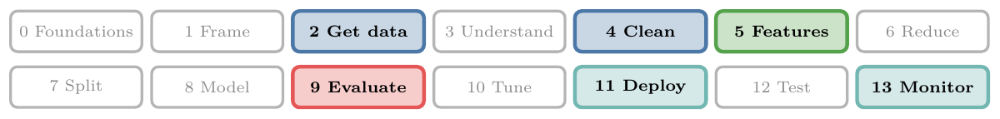
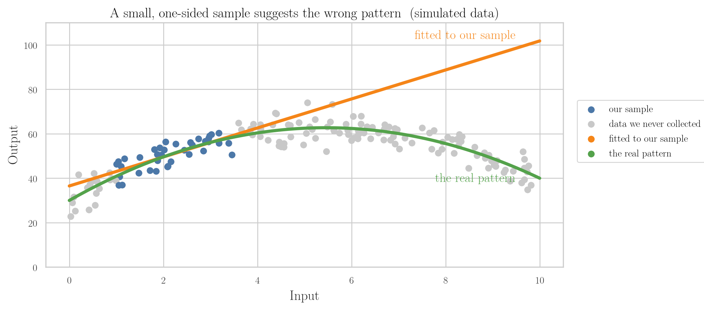
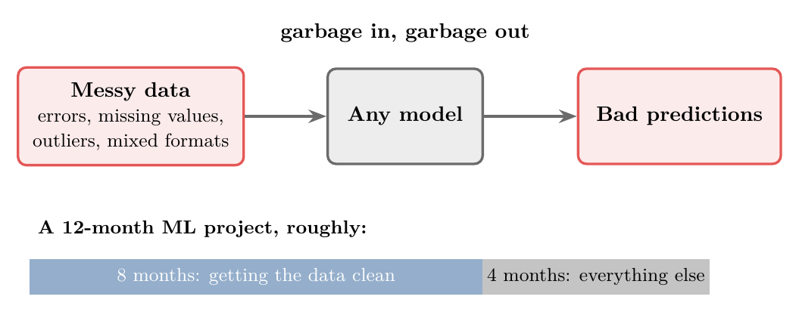
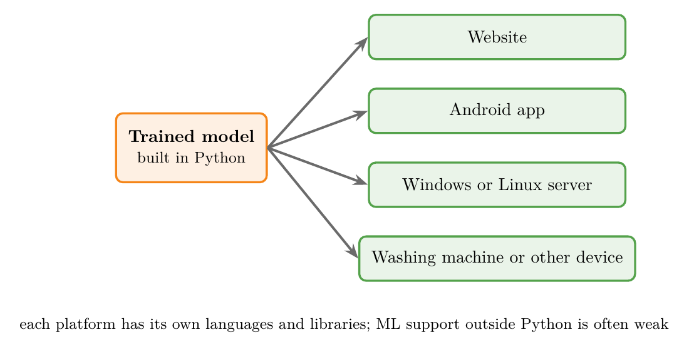

<!-- where-this-fits: generated by course_map/build_map.py; edit concepts.yaml, not this block -->
> **Where this fits:** Pipeline map steps 2 (Get data), 4 (Clean), 5 (Engineer features), 9 (Evaluate), 11 (Deploy), 13 (Monitor and maintain). See the [Course map](../01-course-map/note.md).
>
> 
>
> - **Builds on:** Features ([Note 2](../02-ai-vs-ml-vs-dl/note.md)).
> - **Leads to:** Feature scaling ([Note 9](../09-mldlc/note.md)); Feature selection ([Note 9](../09-mldlc/note.md)); Hyperparameter tuning ([Note 9](../09-mldlc/note.md)); Beta and A/B testing ([Note 9](../09-mldlc/note.md)); Simple imputation (mean, median, mode, constant) ([Note 23](../23-what-is-feature-engineering/note.md)); Binning and binarization ([Note 23](../23-what-is-feature-engineering/note.md)).
> - **Compare with:** CSV files ([Note 9](../09-mldlc/note.md)); Feature extraction ([Note 23](../23-what-is-feature-engineering/note.md)); Polynomial regression ([Note 61](../61-polynomial-regression/note.md)); Decision surface and boundary ([Note 91](../91-knn/note.md)); Representation learning ([Note 1002](../1002-what-is-deep-learning/note.md)).
<!-- /where-this-fits -->

## 1. Overview

> **Key point:** Most problems in an ML project come from the data, some from the model, and the rest from putting the model into a real product.

Before we start building models, it helps to know what tends to go wrong. Figure 1 groups the ten main challenges into three areas.

Each one comes back in later Notes, with tools to handle it.

## 2. Collecting data

> **Key point:** In a course, data is handed to us. In a company, we usually have to collect it ourselves.

ML learns from data, so without data there is nothing to learn.

- **While learning:** data comes ready-made, as CSV files from sites like Kaggle or from course material.
- **In a company:** we usually have to gather it ourselves. The two main ways are calling an **API** (a service that returns data on request) and **web scraping** (writing code that extracts data from web pages).

Both ways bring their own problems, because we are pulling large amounts of data from systems we do not control. Both are covered in later Notes.

## 3. Not enough data

> **Key point:** With enough data, the choice of algorithm matters much less. But most projects do not have that much data, and labelled data is the hardest to get.

### 3.1 More data beats a better algorithm

> **Key point:** Given huge amounts of data, very different algorithms end up performing about the same.

Suppose we have two algorithms: A is clearly better than B. We give A a small dataset and B a much larger one. Very often, B ends up performing better.

Researchers tested this on a language task: choosing the right word in sentences such as "*to* / *two* / *too*". They trained several very different algorithms on more and more data. As the data grew, the algorithms' accuracies came closer and closer together (Figure 2).

This effect is known as the **unreasonable effectiveness of data**. The catch: few projects have that much data. Most of us work with small or medium datasets, where the choice of algorithm still matters a lot.

> **Extra:** The word-choice experiment is by Michele Banko and Eric Brill at Microsoft (Banko and Brill 2001). The phrase "the unreasonable effectiveness of data" comes from a 2009 article of that name by three Google researchers (Halevy et al. 2009). Figure 2 illustrates the idea; it does not show their measurements.

### 3.2 Labelled data is scarce

> **Key point:** Inputs are easy to collect; the correct answers usually need a human.

For supervised learning, every row needs its correct output (its label). Collecting inputs is often easy: we can download thousands of images in minutes. But someone still has to look at each image and write down whether it shows a cat or a dog.

So even with plenty of data, we may not have enough **labelled** data.

## 4. Non-representative data

> **Key point:** If our data covers only part of the real situation, the model learns the wrong pattern.

### 4.1 A sample that tells the wrong story

> **Key point:** A model can only learn the pattern that is in its data.

Our data is a **sample**: a small part of everything that exists in the real world. It is **representative** when it reflects the whole situation fairly.

In Figure 3, we collected data only from one narrow range (blue points), so the best fit to our sample is a rising straight line (orange). The full data (grey points) shows that the real pattern rises and then falls (green). A model trained on our sample would make badly wrong predictions for large inputs.

### 4.2 Sampling noise and sampling bias

> **Key point:** A sample can be unrepresentative because it is too small (noise) or because of how it was collected (bias).

Suppose we run a survey: *which team will win the T20 World Cup?* Figure 4 shows three ways to do it.

- **Sampling noise:** the sample is so small that the result depends on luck. Asking 5 random fans can give almost any answer.
- **Sampling bias:** the way we collect the data favours some answers. Asking 1000 fans, all of them Indian, gives a large sample, but almost all will say "India". Asking fans abroad does not fix this if most of the fans we reach are still Indian.
- **Representative:** ask, say, 100 local fans in every country that is playing. Every team gets a fair chance.

A large sample does not protect against bias: a huge but skewed dataset is still skewed.

## 5. Poor-quality data

> **Key point:** Messy data ruins any model, and cleaning it takes most of the time in a real project.

Real data is messy:

- errors and typos,
- **missing values** (empty cells),
- **outliers** (values far from the rest, often mistakes),
- the same thing written in different formats.

No algorithm can make good predictions from bad data. This is often summed up as **garbage in, garbage out** (Figure 5).

Fixing data quality is called **data cleaning**. It takes most of a project's time: in a one-year project, we can spend around eight months just getting the data right. Many later Notes are about exactly this.

## 6. Irrelevant features

> **Key point:** Columns that say nothing about the output only add noise. Remove them, or combine columns into more useful ones.

Data often contains features (columns) that have nothing to do with what we want to predict. They do not help the model, and can make it worse: garbage in, garbage out again.

*Example: predicting who will run a marathon.* We have each person's weight, height, age and location.

- **Location** says nothing about fitness: people in Chennai are not fitter than people in Noida. We drop it.
- **Weight and height** are useful, but together they say more than separately. We combine them into one feature, **BMI** (body mass index).

**BMI**, step by step:

1. **In words:** weight compared with height, squared. A higher BMI means more weight for the same height.
2. **Formula:**
   $$\text{BMI} = \frac{\text{weight (kg)}}{\text{height (m)}^2}$$
3. **Example:** a person who weighs 62 kg and is 1.70 m tall has
   $$\text{BMI} = \frac{62}{1.70^2} = \frac{62}{2.89} \approx 21.5.$$

Figure 6 shows the result. Choosing, removing and creating features like this is called **feature engineering**. Deciding which columns to keep is hard, and gets easier with experience.

## 7. Overfitting and underfitting

> **Key point:** A good model learns the pattern, not the noise. Too simple misses the pattern (underfitting); too complex memorises the noise (overfitting).

### 7.1 Overfitting

> **Key point:** An overfit model memorises its training data and fails on new data.

**Overfitting** happens when a model learns its training data too closely, noise and accidents included, instead of the general pattern. It looks perfect on the training data and does badly on new data.

People do this too. Someone moves to Gurgaon, pays 500 rupees for one movie ticket, and concludes that *everything* in Gurgaon is expensive. One example was turned into a general rule.

The last stage of Figure 7 shows an overfit model: its curve passes exactly through all 12 training points, so its error on the training data is 0. But it twists wildly between them, and its error on new data is twice that of the good fit.

Overfitting is one of the biggest challenges in ML. For every algorithm in these Notes, we will ask how it can overfit and how to prevent it.

### 7.2 Underfitting

> **Key point:** An underfit model is too simple to capture the pattern, so it is bad on all data.

**Underfitting** is the opposite: the model is too simple for the data. In the first stage of Figure 7, a straight line cannot follow the wave in the data. It does badly on the training data and on new data alike.

The middle stage is a **good fit**: it follows the overall wave and ignores the small noise in individual points. Its error on new data is the lowest of the three.

A model that scores 100% on its training data is a warning sign, not a success. It has probably memorised the data.

The Notebook for this Note (`notebook.ipynb`) has a slider for model complexity, showing the training error and the new-data error at every step.

## 8. Software integration

> **Key point:** A model is only useful inside a product, and every platform needs it in a different form.

A model is never the end product. It is a part of some software that helps users: a recommender inside a website, a fraud detector inside a banking app.

So after building the model, we have to **integrate** it into that software, and the software may run on many platforms (Figure 8).

Each platform has its own languages and libraries, and ML support outside Python is often weak:

- **Java**, one of the most popular programming languages, still has limited ML support.
- **JavaScript** runs all front-end web development, and has only recently gained a serious ML library (TensorFlow.js).

Getting one model to work reliably on all of these is hard. Still, a model only creates value once users can reach it, for example as a website or an Android app.

## 9. Retraining and deployment

> **Key point:** Keeping a model updated in production is hard, whether we retrain it in batches or let it learn online.

As covered in Notes 4 and 5:

- **Batch learning:** to update the model, we take it offline, retrain it on all the data, and upload it again, over and over.
- **Online learning:** the model updates itself on the server, which is harder to build and riskier to run.

**Deployment**, putting a model on a server for users, is itself difficult. Cloud providers such as AWS (Amazon), Google Cloud and Microsoft Azure offer services for it, but they are not yet as smooth as the tools for ordinary software. Monitoring a live model and fixing it in real time still takes a lot of effort.

## 10. Cost

> **Key point:** In a real product, the model is a small part of a large and expensive system.

At scale, the costs are surprising. A model used by 10,000 or 100,000 people needs servers, data pipelines, monitoring, testing and much more, and each of these has costs that are easy to miss while building the model (Figure 9).

Managing all of this is a growing field of its own, **MLOps** (machine learning operations): running ML models in production, the way DevOps runs ordinary software.

The best way to learn these challenges is to go one step further than building a model: turn it into a real product, deploy it on a server and let real users use it.

> **Extra:** A well-known paper on these hidden costs is *Hidden Technical Debt in Machine Learning Systems* (Sculley et al. 2015). Its Figure 1 makes the same point as Figure 9: the ML code is a small box in a much larger system.

## 11. Summary

| # | Challenge | In one line |
|---|---|---|
| 1 | Collecting data | Real projects must gather their own data (APIs, web scraping) |
| 2 | Not enough data | More data often beats a better algorithm; labels are scarce |
| 3 | Non-representative data | A one-sided sample teaches the wrong pattern |
| 4 | Poor-quality data | Garbage in, garbage out; cleaning takes most of the time |
| 5 | Irrelevant features | Drop useless columns; combine useful ones (feature engineering) |
| 6 | Overfitting | Memorises the training data; fails on new data |
| 7 | Underfitting | Too simple; fails on all data |
| 8 | Software integration | Every platform needs the model in a different form |
| 9 | Retraining and deployment | Keeping a live model updated is hard |
| 10 | Cost | The model is a small part of an expensive system (MLOps) |

- Most challenges are about **data**: getting it, getting enough, getting a fair sample, cleaning it, choosing its features.
- A model must learn the **pattern**, not the noise.
- A model creates value only once it runs inside a product that real users can reach.

## Sources

- Banko, M. and Brill, E. (2001). Scaling to Very Very Large Corpora for Natural Language Disambiguation. *Proceedings of ACL*.
- Halevy, A., Norvig, P. and Pereira, F. (2009). The Unreasonable Effectiveness of Data. *IEEE Intelligent Systems* 24(2).
- Sculley, D. et al. (2015). Hidden Technical Debt in Machine Learning Systems. *NeurIPS*.

## 12. Key terms

| Term | Meaning |
|---|---|
| API | A service that returns data when our code asks for it |
| Web scraping | Writing code that extracts data from web pages |
| Unreasonable effectiveness of data | With enough data, different algorithms perform about the same |
| Labelled data | Data whose rows include the correct output |
| Sample | The part of the real world that our data covers |
| Representative sample | A sample that reflects the whole situation fairly |
| Sampling noise | An unrepresentative sample caused by being too small |
| Sampling bias | An unrepresentative sample caused by how the data was collected |
| Missing values | Empty cells in the data |
| Outliers | Values far from the rest, often mistakes |
| Garbage in, garbage out | Bad input data always gives bad results |
| Data cleaning | Fixing errors, gaps and inconsistencies in data |
| Feature engineering | Choosing, removing and creating features |
| BMI | Body mass index: weight (kg) divided by height (m) squared |
| Overfitting | Learning the training data too closely, noise included; fails on new data |
| Underfitting | Being too simple to capture the pattern; fails on all data |
| Good fit | Capturing the pattern while ignoring the noise |
| Software integration | Building a model into the software that users use |
| Deployment | Putting a model on a server so users can reach it |
| MLOps | Running and maintaining ML models in production |
