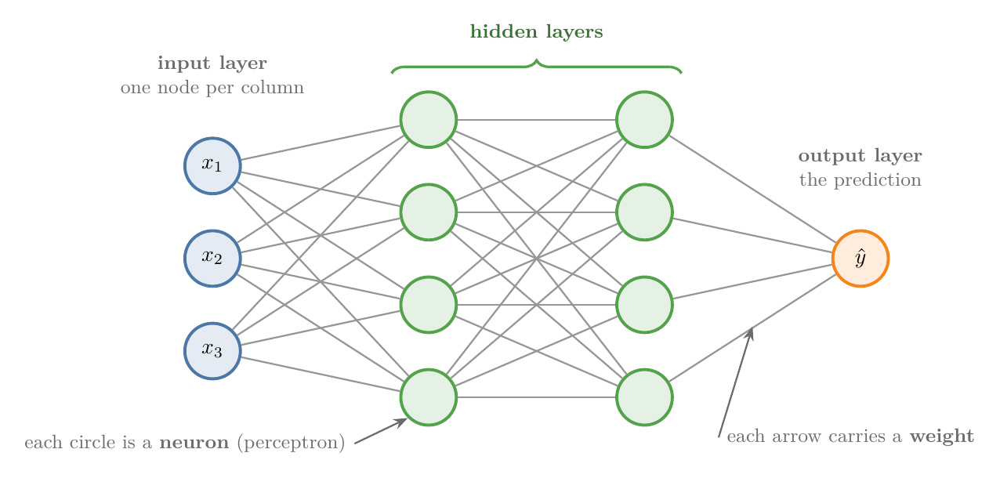
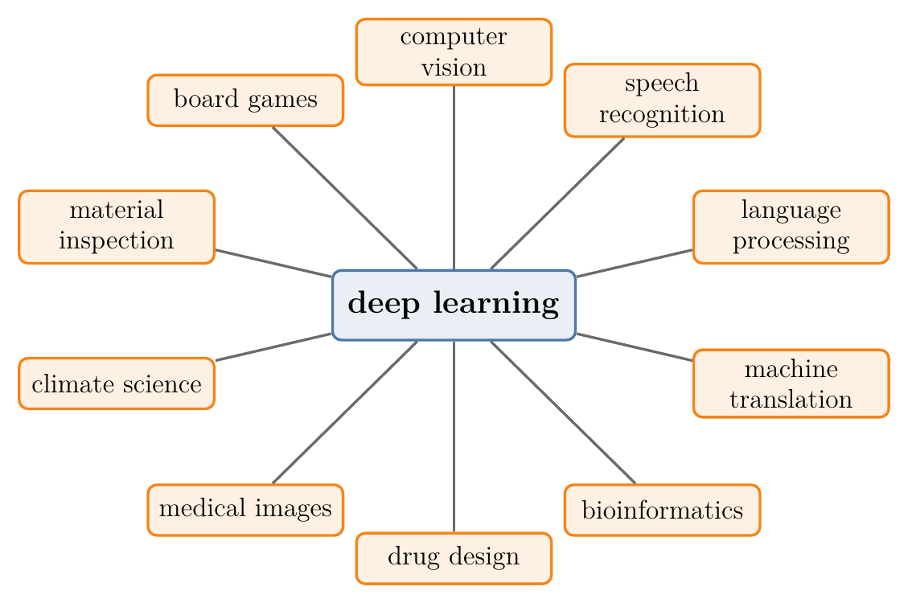
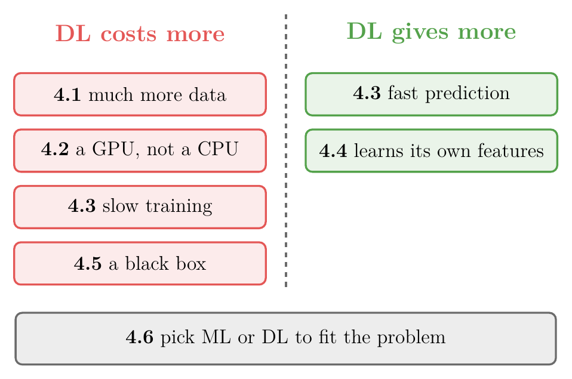

<!-- where-this-fits: generated by course_map/build_map.py; edit concepts.yaml, not this block -->
> **Where this fits:** Pipeline map step 0 (Foundations). See the [Course map](../01-course-map/note.md).
>
> 
>
> - **Builds on:** Machine learning ([Note 2](../02-ai-vs-ml-vs-dl/note.md)); Linear transformations and matrices ([Note 500](../500-linear-transformations-and-matrices/note.md)); Matrix multiplication as composition ([Note 510](../510-matrix-multiplication-as-composition/note.md)).
> - **Leads to:** Types of neural networks ([Note 1003](../1003-nn-types-history-applications/note.md)); Multi-layer perceptron (MLP) ([Note 1003](../1003-nn-types-history-applications/note.md)); Convolutional neural network (CNN) ([Note 1040](../1040-cnn-intuition/note.md)).
> - **Compare with:** Machine learning ([Note 2](../02-ai-vs-ml-vs-dl/note.md)); Feature engineering ([Note 23](../23-what-is-feature-engineering/note.md)).
<!-- /where-this-fits -->

## 1. Overview

> **Key point:** Deep learning is the part of ML that uses neural networks: layers of simple units that learn their own features from raw data. Deep learning needs more data, hardware and time than ML, and it is harder to explain, but on images, text and speech it is far stronger.

The [AI vs ML vs DL Note](../02-ai-vs-ml-vs-dl/note.md) already placed deep learning (DL) inside ML and showed its two big advantages: it learns features by itself, and it keeps improving with more data. This Note goes further in three directions:

1. What a neural network looks like, and the technical definition of DL built on **representation learning**.
2. Five practical differences between DL and ML.
3. Why DL took off only after about 2012, although its ideas are much older.

{width=95%}

Figure 1 shows the idea that runs through this Note: in DL the features come from the network's layers, not from us.

## 2. Two definitions of deep learning

> **Key point:** The simple definition: DL is ML with neural networks, inspired by the brain. The technical one: DL learns its own representations, layer by layer, from raw data.

### 2.1 The simple definition: ML with neural networks

> **Key point:** ML finds the input-output relationship with statistical techniques; DL finds it with a neural network.

Both ML and DL do the same job: in supervised learning, they find the relationship between the inputs and the output. Most ML algorithms do it with statistical techniques. DL does it with a **neural network**, a structure loosely inspired by the brain (see section 5.1 of the [AI vs ML vs DL Note](../02-ai-vs-ml-vs-dl/note.md)).

The reasoning behind the brain as a model is simple: to build intelligent machines, copy the most intelligent thing we know. The copy is very loose, as the [perceptron Note](../1004-perceptron/note.md) shows.

### 2.2 The parts of a neural network

> **Key point:** Neurons are arranged in layers: an input layer, one or more hidden layers and an output layer. Each connection carries a weight. Many hidden layers make a network "deep".

{height=40%}

Figure 2 shows the simplest kind of network, the **artificial neural network (ANN)**:

- Each circle is a **neuron**, also called a **perceptron**: the network's basic unit.
- Each line connecting two neurons carries a **weight**, a number the network learns.
- Neurons in one column form a layer. The **input layer** takes the data, one node per **feature** (an input variable, one column of the data table). The **output layer** gives the prediction.
- Every layer in between is a **hidden layer**. We can add as many as we like.

A network with many hidden layers is called **deep**, and this is where the name "deep learning" comes from.

The ANN is only one type of network. Convolutional neural networks (CNNs) work best on images, recurrent neural networks (RNNs) on speech and text, and generative adversarial networks (GANs) create new images and text. The [types of neural networks Note](../1003-nn-types-history-applications/note.md) describes each one.

### 2.3 The technical definition: representation learning

> **Key point:** Representation learning means the algorithm finds the useful features in raw data by itself, instead of us engineering them by hand.

A more technical definition reads: deep learning is part of the broader family of ML methods based on artificial neural networks **with representation learning**. Its algorithms use multiple layers to progressively extract higher-level features from the raw input.

**Representation learning** (also called **feature learning**) is a set of techniques that let a system discover, from raw data, the features it needs for a task. Representation learning replaces manual [feature engineering](../23-what-is-feature-engineering/note.md): the machine both learns the features and uses them.

Take a dog-vs-cat classifier:

- **With ML**, we design the features ourselves: size (dogs are usually bigger), colour, and other physical attributes. Then we give these features to the algorithm.
- **With DL**, we give the network the image itself, pixel by pixel, in the right format. The network extracts the features on its own.

### 2.4 Layers extract features of rising complexity

> **Key point:** Early layers find edges, middle layers find shapes, late layers find whole objects such as faces.

The second half of the technical definition says how the layers share the work. In a dog-vs-cat or face classifier:

1. The first hidden layers detect **primitive features**: edges.
2. The next layers combine edges into **shapes**.
3. The deepest layers combine shapes into **high-level concepts**: a face, a digit, a letter.

The output layer then gives the answer. Section 5.3 of the [AI vs ML vs DL Note](../02-ai-vs-ml-vs-dl/note.md) animates the same idea for a handwritten 7.

## 3. Why deep learning became famous

> **Key point:** Two reasons: it applies to a huge range of problems, and in many of them it gives the best results ever recorded, sometimes better than human experts.

### 3.1 Applicability

> **Key point:** The same family of methods works on images, speech, text, medicine, science and games.

DL is used in computer vision, speech recognition, natural language processing, machine translation, bioinformatics, drug design, medical image analysis, climate science, material inspection and board-game programs. Few methods reach that many fields.

{width=80%}

Figure 3 shows the reach: one family of methods, ten very different fields.

### 3.2 Performance

> **Key point:** In many fields DL holds the state-of-the-art result, and in some it beats human experts.

In most of these fields, the best results today come from DL. In March 2016 the program AlphaGo, built on deep networks, beat Lee Sedol, one of the world's best players of the board game Go, by 4 games to 1 (Silver et al. 2017). Self-driving cars, new drug candidates and new chemistry research are further examples.

## 4. Five differences between DL and ML

> **Key point:** DL needs more data, stronger hardware and longer training, but it predicts fast, learns its own features, and is hard to interpret.

{width=75%}

Figure 4 is the balance this section weighs: four costs on the left, two gains on the right.

### 4.1 Data

> **Key point:** With little data ML wins; with lots of data DL keeps improving while ML levels off.

DL is **data hungry**: its results become reliable only with a lot of data. Figure 8 of the [AI vs ML vs DL Note](../02-ai-vs-ml-vs-dl/note.md) shows the classic curves. With little data, ML performs better; beyond some amount, ML stagnates while DL keeps rising.

### 4.2 Hardware

> **Key point:** ML trains on an ordinary CPU; DL needs a GPU, because it multiplies very large matrices.

A neural network does huge numbers of matrix multiplications. A [GPU](../12-setup-anaconda-jupyter-colab/note.md) with plenty of memory does them in parallel, while a CPU does them slowly. So ML runs on cheap hardware, and DL needs costly hardware.

### 4.3 Training time and prediction time

> **Key point:** DL trains slowly (days to months on big data) but predicts fast; ML trains in minutes to hours, and its prediction speed depends on the algorithm.

- **Training time:** a DL model on a large dataset can train for weeks, and some research models for months. Most ML models train in minutes, at most hours.
- **Prediction time:** a trained network predicts quickly, because a prediction is only a fixed series of matrix products (the [forward propagation Note](../1010-forward-propagation/note.md) shows it). In ML it varies: [KNN](../91-knn/note.md), for example, predicts slowly because it compares the new point with every stored **observation** (one record, one row of the data table).

### 4.4 Feature selection

> **Key point:** In ML we build the features with domain experts; in DL the network extracts them.

Suppose we predict whether a student will be placed from the content of their resume:

- **With ML**, we extract features first: 12th marks, 10th marks, number of achievements, number of courses, quality of college. Choosing them needs domain experts, such as HR staff or teachers.
- **With DL**, we give the whole resume, in a suitable form, to the network. The network extracts the features behind the scenes and predicts.

Letting the network extract the features is representation learning (section 2.3), and it is one of DL's biggest practical benefits.

### 4.5 Interpretability

> **Key point:** A trained network is a black box: it cannot say why it gave an answer. Linear models and decision trees can.

**Interpretability** is how well people can understand why a model makes its decisions. The features a network learns are internal numbers that no one chose, so we cannot say what each one means. A trained network is a [black box](../91-knn/note.md): it gives an answer without the reasons.

Interpretability matters wherever we must justify a decision. Suppose a social network bans users based on their comments, using a DL model. A banned user asks why, and we have no answer.

ML models are often much easier to explain:

- **Logistic regression** on CGPA and IQ learns two weights, $w_1$ and $w_2$. The larger weight marks the more important input (on inputs of similar scale), so we can tell a student "your CGPA is too low".
- **A decision tree** is a flowchart of questions, so it shows exactly why a point got its class (see the [decision trees Note](../97-decision-trees-intuition/note.md)).

> **Extra:** Researchers have built tools that explain single predictions of any model, including networks, such as LIME and SHAP, and heat maps of the image regions a CNN used. LIME, for example, fits a simple model that imitates the network near one input (Ribeiro et al. 2016, §3). So these tools explain the network from outside; its own weights stay unreadable.

### 4.6 DL does not replace ML

> **Key point:** Use a needle to sew and a sword to fight: pick ML or DL to fit the problem.

| | Machine learning | Deep learning |
|---|---|---|
| Data | works with little data, levels off | needs a lot, keeps improving |
| Hardware | CPU | GPU (or TPU) |
| Training time | minutes to hours | hours to months |
| Prediction time | depends on the algorithm (KNN is slow) | fast |
| Features | engineered by us | learned by the network |
| Interpretability | often high (linear models, trees) | low: a black box |

Since DL is so strong, why not use it everywhere? Because on small or tabular data (section 4.1; Grinsztajn et al. 2022), or when decisions must be explained (section 4.5), ML is the better tool. An old saying puts it well: where a needle is needed, a sword is no use. Section 6 of the [AI vs ML vs DL Note](../02-ai-vs-ml-vs-dl/note.md) gives the rule of thumb for choosing.

## 5. Why deep learning took off after 2010

> **Key point:** Five forces: large public datasets, faster hardware, easy frameworks, ready-made architectures, and a large community.

The core ideas of neural networks are decades old (the [history section](../1003-nn-types-history-applications/note.md) tells the story), yet DL became famous only around 2012. Figure 5 shows the five forces behind the change.

{height=42%}

### 5.1 Datasets

> **Key point:** Smartphones and cheap internet created huge amounts of data; big companies labelled some of it and made it public.

Around 2010 two revolutions met: smartphones, and much cheaper mobile internet (in India, Jio's free and then very cheap data from 2016). With billions of people on social media apps, the amount of data generated every year began to grow exponentially.

Raw data alone is not enough. To train a dog-vs-cat classifier we need photos **labelled** "dog" or "cat", and a photo uploaded to a social network carries no such label. Companies such as Microsoft, Google and Facebook paid to label large datasets, and then released them as **public datasets** that anyone may use, because open data speeds up research for everyone:

| Data type | Public dataset | Contents |
|---|---|---|
| Images | Microsoft COCO | images with a labelled box around every object; used for object detection |
| Video | YouTube-8M | about 6.1 million labelled online video clips |
| Text | SQuAD | about 150,000 questions and answers on Wikipedia articles |
| Audio | Google AudioSet | about 2 million labelled sound clips in over 600 categories |

Thousands more are available today, for example on Kaggle. Without data there would be no deep learning, so datasets are the biggest single reason.

### 5.2 Hardware

> **Key point:** Moore's law made chips steadily faster and cheaper, and GPUs turned out to do a network's matrix maths in parallel, 10 to 20 times faster than a CPU.

**Moore's law**, stated by Intel co-founder Gordon Moore, says that the number of transistors on a microchip doubles about every two years. Electronics therefore get faster and cheaper every year: phones went from about 128 MB of memory in the mid-2000s to 12 GB today.

Around 2010, researchers realised that a network's matrix multiplications can run in parallel, just like the graphics work a GPU was built for. NVIDIA's **CUDA**, a platform for programming GPUs, made this practical, and training on GPUs became the norm. A GPU typically cuts training time by a factor of 10 to 20 compared with a CPU.

> **Extra:** CUDA 1.0 came out in 2007 (NVIDIA 2007). Deep networks were trained on GPUs by 2009 (Raina et al. 2009), and the 2012 ImageNet winner described in the [history section](../1003-nn-types-history-applications/note.md) was trained on two GPUs (Krizhevsky et al. 2012, §3.2).

Once the speed-up was clear, chips designed for DL followed:

- **FPGA** (field-programmable gate array): a reprogrammable chip that is fast and low-power, but expensive. Microsoft runs much of its search engine's AI on FPGAs.
- **ASIC** (application-specific integrated circuit): a chip custom-made for one job, costly to design but cheap in large numbers. Examples: Google's **TPU** (tensor processing unit), the small **Edge TPU** for drones, smartwatches and smart glasses, and the **NPU** (neural processing unit) in phones.

Which hardware to use depends on the job:

| Situation | Hardware |
|---|---|
| Learning, small projects | CPU |
| Training large networks | GPU (e.g. NVIDIA RTX series) or TPU |
| DL inside a phone app | mobile CPU or GPU, digital signal processors, NPU |
| DL on a smartwatch, drone or smart glasses | Edge TPU or NPU |

### 5.3 Frameworks

> **Key point:** Libraries do the hard maths behind the scenes, as scikit-learn does for ML: TensorFlow with Keras in industry, PyTorch in research.

Writing a network's training code from scratch takes longer than the problem it solves. Deep learning needed libraries that handle this code, just as scikit-learn does for ML. Two families dominate:

- **TensorFlow (Google):** Google built an internal framework, DistBelief, in 2011, and released TensorFlow publicly in 2015. TensorFlow was powerful but hard to use, so **Keras**, a simpler library running on top of it, became popular. Since TensorFlow 2.0 (2019), Keras is built in.
- **PyTorch (Facebook, now Meta):** released in 2016, it became the favourite of researchers. Facebook's Caffe2, a library for running models on servers, was merged into it in 2018.

Today TensorFlow with Keras is used more in industry, and PyTorch more in research. Converting a model from one to the other is awkward, so drag-and-drop tools appeared that build a network in a browser and export code for either: Google's AutoML, Microsoft's Custom Vision and Apple's Create ML.

> **Extra:** Since Keras 3 (2023), Keras can again run on several back ends: JAX, TensorFlow or PyTorch (Keras 3 docs).

### 5.4 Architectures and transfer learning

> **Key point:** Researchers publish trained state-of-the-art networks; we download one and apply it to our problem instead of designing our own.

A network's **architecture** is how its nodes are connected by weights: how many nodes, what kind, and which connections. Different problems need different architectures, and finding a good one takes many experiments, which cost time, effort and money.

Instead, we can reuse an architecture that researchers already designed and trained on a big dataset. Downloading such a trained network and applying it to our own problem is called **transfer learning**, taught in detail later. Well-known ready-made architectures:

| Task | Architecture |
|---|---|
| Image classification | ResNet |
| Text classification, other language tasks | BERT (a transformer) |
| Image segmentation | U-Net |
| Image-to-image translation | pix2pix |
| Object detection | YOLO (You Only Look Once) |
| Speech generation | WaveNet |

These models reach the best known accuracy, in some tasks above human level, and transfer learning made adopting DL far easier.

### 5.5 Community

> **Key point:** People who believed in neural networks through decades of failure, plus today's engineers, teachers, students and communities like Kaggle.

None of the above would exist without people. Researchers worked on neural networks from the 1960s and failed several times before succeeding around 2012. Today engineers, teachers, students and communities such as Kaggle keep the field moving.

## 6. Summary

| Reason DL took off | What changed |
|---|---|
| Datasets | smartphones and cheap internet; public labelled datasets (COCO, YouTube-8M, SQuAD, AudioSet) |
| Hardware | Moore's law; GPUs with CUDA; FPGAs, TPUs, Edge TPUs, NPUs |
| Frameworks | TensorFlow with Keras (industry), PyTorch (research) |
| Architectures | ready-made trained networks (ResNet, BERT, YOLO) and transfer learning |
| Community | researchers, engineers, teachers, students, Kaggle |

- DL is ML with neural networks: neurons in an input layer, hidden layers and an output layer, joined by weights.
- Many hidden layers make a network deep.
- Representation learning: the network learns its own features, edges first and whole objects last.
- DL needs more data, a GPU and longer training, predicts fast, and is a black box.
- ML stays the better choice for small or tabular data and when decisions must be explained.

## 7. Sources

**Built from**

- CampusX, "What is Deep Learning? Deep Learning Vs Machine Learning | Complete Deep Learning Course", YouTube, https://www.youtube.com/watch?v=fHF22Wxuyw4

**Other references**

- Silver et al., "Mastering the game of Go without human knowledge", *Nature*, 2017 (AlphaGo against Lee Sedol, March 2016).
- NVIDIA, "CUDA Toolkit Archive" (CUDA Toolkit 1.0, June 2007), developer.nvidia.com.
- Raina, Madhavan and Ng, "Large-scale Deep Unsupervised Learning using Graphics Processors", ICML 2009.
- Krizhevsky, Sutskever and Hinton, "ImageNet Classification with Deep Convolutional Neural Networks", NeurIPS 2012.
- Keras documentation, "Introducing Keras 3.0", keras.io.
- Ribeiro, Singh and Guestrin, "Why Should I Trust You? Explaining the Predictions of Any Classifier", KDD 2016 (LIME). Lundberg and Lee, "A Unified Approach to Interpreting Model Predictions", NeurIPS 2017 (SHAP).
- Grinsztajn, Oyallon and Varoquaux, "Why do tree-based models still outperform deep learning on typical tabular data?", NeurIPS 2022 (Datasets and Benchmarks).

## 8. Key terms

| Term | Meaning |
|---|---|
| Artificial neural network (ANN) | The simplest neural network: neurons in layers, each layer connected to the next by weights |
| Neuron (in a network) | One unit of a neural network; in an ANN, a perceptron |
| Weight (in a network) | A learned number on a connection between two neurons |
| Input layer | The first layer, with one node per feature |
| Output layer | The last layer, which gives the prediction |
| Hidden layer | Any layer between the input and output layers |
| Deep network | A neural network with many hidden layers |
| Representation learning (feature learning) | Letting the algorithm discover useful features from raw data, instead of engineering them by hand |
| Data hungry | Needing a lot of data before results become reliable |
| Public dataset | A labelled dataset released for anyone to use |
| Moore's law | The number of transistors on a chip doubles about every two years |
| CUDA | NVIDIA's platform for programming GPUs |
| FPGA | A reprogrammable chip: fast and low-power, but expensive |
| ASIC | A chip custom-made for one job, such as the TPU |
| Edge TPU | A small Google chip for running networks on drones, watches and glasses |
| NPU | A neural processing unit: a chip in phones that speeds up networks |
| Architecture (of a network) | How a network's nodes are connected: how many, of what kind, and which connections |
| Transfer learning | Reusing a network trained by others on a big dataset for our own problem |
