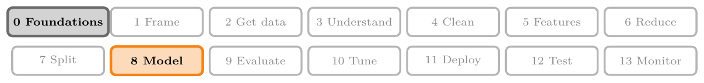
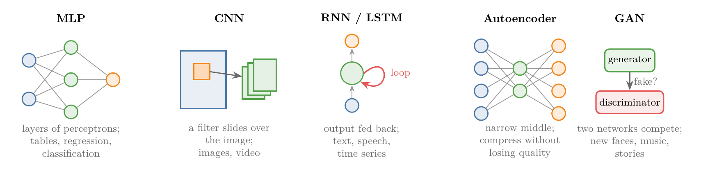
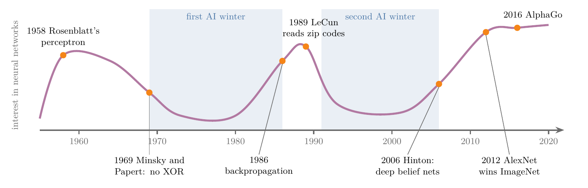

<!-- where-this-fits: generated by course_map/build_map.py; edit concepts.yaml, not this block -->
> **Where this fits:** Pipeline map steps 0 (Foundations), 8 (Model). See the [Course map](../01-course-map/note.md).
>
> 
>
> - **Builds on:** Sigmoid function ([Note 74](../74-sigmoid-derivative/note.md)); What deep learning is ([Note 1002](../1002-what-is-deep-learning/note.md)); Neural networks ([Note 1002](../1002-what-is-deep-learning/note.md)).
> - **Leads to:** Keras workflow ([Note 1011](../1011-customer-churn-ann/note.md)); ANN for classification ([Note 1011](../1011-customer-churn-ann/note.md)).
<!-- /where-this-fits -->

## 1. Overview

> **Key point:** Five main types of network (MLP, CNN, RNN, autoencoder, GAN) each suit a kind of data or task. Neural networks rose and fell twice before deep learning took off in 2012, and today they power cars, games, assistants and creative tools.

This Note gives the big picture before the technical Notes start. The Note has three parts:

1. **Types of neural networks:** what each of the five main types is for (Figure 1).
2. **History:** from the first perceptron in 1958 to the ImageNet breakthrough of 2012 (Figure 2).
3. **Applications:** where deep learning is used today.

The [what is deep learning Note](../1002-what-is-deep-learning/note.md) already introduced the parts of a network (input, hidden and output layers) and the five forces behind deep learning's success. This Note builds on both.

## 2. Types of neural networks

> **Key point:** MLPs for general supervised learning, CNNs for images, RNNs and LSTMs for sequences, autoencoders for compression, GANs for generating new data.

There are many types of neural networks, and each type is a large subject on its own. Figure 1 shows the five main ones.

### 2.1 Multi-layer perceptron (MLP)

> **Key point:** Perceptrons organised in layers; the simplest network, good at non-linear relationships in ordinary supervised problems.

A **multi-layer perceptron (MLP)** is many perceptrons organised in layers: an input layer, one or more hidden layers and an output layer. The MLP is the simplest type of network; until the other types appeared, "MLP" and "artificial neural network" meant the same thing.

MLPs work on any supervised problem, regression or classification. Adding hidden layers helps them capture non-linear relationships, which a single perceptron cannot (the [MLP intuition Note](../1009-mlp-intuition/note.md) shows why).

### 2.2 Convolutional neural network (CNN)

> **Key point:** At least one convolutional layer; the standard network for images and video.

A **convolutional neural network (CNN)** is a network with at least one **convolutional layer**, a layer that slides small filters over an image (taught in the CNN Notes). CNNs power almost every image and video application: self-driving cars, or scanning chest images for cancer. Yann LeCun is known as the father of CNNs.

### 2.3 Recurrent neural network (RNN) and LSTM

> **Key point:** Information loops back from a hidden layer, so the network remembers earlier steps of a sequence; LSTM is a stronger variant.

MLPs and CNNs are **feed-forward networks**: information moves in one direction only, from the first layer to the last. In a **recurrent neural network (RNN)**, the output of a hidden layer is fed back into the network as feedback, so earlier inputs influence later ones.

A popular improved variant is the **LSTM** (long short-term memory). RNNs and LSTMs are used heavily in natural language processing: voice assistants such as Google Now, Siri and Cortana, and chatbots.

### 2.4 Autoencoder

> **Key point:** Input and output layers have the same size, the middle is narrow; the network learns to squeeze data and rebuild it.

An **autoencoder** is used to compress data, such as an image, a file or a video, while keeping its quality as far as possible. Its input and output layers have the same number of nodes, and its hidden layers have fewer. The network learns to pass the data through the narrow middle and rebuild it on the other side.

> **Extra:** The narrow middle layer cannot hold a full copy of the input, so the autoencoder learns to keep only the most important features, and the rebuilt output loses some detail (Goodfellow et al. 2016, §14.1). Trained to rebuild clean inputs from noisy copies, an autoencoder removes noise (§14.5). Inputs that rebuild badly can be flagged as unusual: anomaly detection (Sakurada and Yairi 2014).

### 2.5 Generative adversarial network (GAN)

> **Key point:** A generator makes fakes, a discriminator judges real or fake; competing, the generator learns to create realistic new data.

A **generative adversarial network (GAN)**, introduced by Ian Goodfellow and colleagues in 2014 (Goodfellow et al. 2014), is two networks playing a game against each other:

- The **generator** creates new data, for example photos of faces.
- The **discriminator** decides whether each photo is real or fake.

As the game goes on, the generator learns to fool the discriminator. Its output is then new data that never existed: faces of people who never lived, music, stories and handwriting.

## 3. History of deep learning

> **Key point:** Two booms and two winters: the perceptron (1958) and its XOR failure (1969), backpropagation (1986) and its scaling failure, then deep belief nets (2006) and the 2012 ImageNet win.

Deep learning is a young field, and many of the people who shaped it are still active. Its history has two rises and two falls (Figure 2).

### 3.1 The perceptron and the first AI winter

> **Key point:** Rosenblatt's perceptron promised learning machines; Minsky and Papert showed it cannot learn XOR, and funding dried up.

After the Second World War, countries, above all the United States, invested heavily in computer science research. In 1958 the psychologist **Frank Rosenblatt** introduced the **perceptron**, a model that learns, loosely based on a neuron in the brain (Rosenblatt 1958). The press hailed it as the true start of artificial intelligence, and Rosenblatt himself made bold claims for it.

In 1969 **Marvin Minsky** and Seymour Papert showed a major limitation: a single perceptron can never learn the **XOR** function, however long it is trained. The reason is that a perceptron draws a straight line, and XOR's classes cannot be split by one line (the [problem with the perceptron Note](../1007-problem-with-perceptron/note.md) shows this in code).

Funding, media attention and research on neural networks dropped sharply. A period like this, when interest and money for AI collapse, is called an **AI winter**; this was the first.

> **Extra:** Minsky and Papert's 1969 work was a book, *Perceptrons* (MIT Press). The first AI winter of the 1970s had other causes too, such as the critical Lighthill report on AI research in the United Kingdom (1973), after which the UK government ended support for AI research at all but a few universities (Russell and Norvig, §1.3).

### 3.2 Backpropagation and the second boom

> **Key point:** Many perceptrons in layers can learn non-linear functions, and backpropagation can train them.

In 1986, **Geoffrey Hinton**, now known as a father of deep learning, published with David Rumelhart and Ronald Williams the paper *Learning representations by back-propagating errors* (Rumelhart et al. 1986). The paper's message:

- A single perceptron can only learn linear functions.
- Many perceptrons arranged in layers, with hidden layers, can learn non-linear ones.
- Such a network can be trained with **backpropagation**: differentiate the error and use the derivatives to adjust every weight (taught in the backpropagation Notes).

Training layered networks with backpropagation overcame the perceptron's biggest flaw, and enthusiasm returned. In 1989 Yann LeCun, a former postdoctoral researcher with Hinton (ACM 2019), used a network trained by backpropagation to read handwritten zip codes from images (LeCun et al. 1989).

> **Extra:** Hinton is the great-great-grandson of the mathematician George Boole, after whom Boolean logic is named. He shared the 2018 Turing Award with Yann LeCun and Yoshua Bengio, and the 2024 Nobel Prize in Physics with John Hopfield (ACM 2019; Nobel Prize 2024).

### 3.3 Universal approximation

> **Key point:** A network with a hidden layer and enough neurons can approximate any continuous function as closely as we like.

The **universal approximation theorem** states that a neural network with at least one hidden layer and enough neurons can approximate any continuous function, to any accuracy we want. The theorem is why neural networks are called **universal function approximators**.

> **Extra:** The theorem was proved by George Cybenko (1989) and Kurt Hornik (1991), not in the 1986 backpropagation paper. One hidden layer is already enough in principle, though that layer may need an enormous number of neurons; deeper networks often need far fewer. The theorem says a good network exists; it does not promise that training will find it (Goodfellow et al. 2016, §6.4.1).

### 3.4 The second AI winter

> **Key point:** Networks failed on large problems: too little labelled data, too little computing power, random weight initialisation, and stronger rivals such as SVM and random forests.

By the early 1990s it became clear that networks did not perform well on large problems. Four reasons stood out:

1. **Too little labelled data.**
2. **Too little computing power** to compute all the weights with backpropagation and add many layers.
3. **No good way to initialise the weights:** they started at random values, which caused errors in training.
4. **Better rivals:** algorithms such as the [support vector machine](../92-svm-intuition/note.md) and [random forest](../108-random-forest-intro/note.md) trained well on less data.

Interest fell again for about 15 years: the second AI winter.

### 3.5 Deep belief networks and the name "deep learning"

> **Key point:** In 2006 Hinton showed how to start the weights well, so that networks with many layers could be trained; the field was renamed deep learning.

In 2006, Hinton (with Simon Osindero and Yee-Whye Teh) published a method for training **deep belief networks** (Hinton et al. 2006). The method's key idea, **unsupervised pre-training**, sets the starting weights with a network trained layer by layer, instead of at random. With it, networks with many layers could be trained.

From then on, the field of artificial neural networks was rebranded as **deep learning**. Between 2006 and 2010, many papers followed.

### 3.6 2012: ImageNet and after

> **Key point:** In 2012 a deep network trained on GPUs cut the ImageNet error from about 26% to about 15%; from then on deep learning never looked back.

**ImageNet** is a very large dataset of labelled images, and from 2010 a yearly competition asked teams to classify its images. The best error rates in 2010 and 2011 were around 28% and 26%.

In 2012, Hinton's team (Alex Krizhevsky, Ilya Sutskever and Hinton) entered a deep network, later called **AlexNet**, trained on GPUs. Its error was about 15%, almost half that of the best other entry. Google, Facebook and other companies took notice, researchers flooded in, and a whole ecosystem grew.

Further milestones:

- **2014:** Ian Goodfellow introduces GANs.
- **2016:** DeepMind's **AlphaGo** beats Lee Sedol, winner of 18 international titles, by 4 games to 1. Go is a board game far more complex than chess: about 250 possible moves per turn against about 35 (Silver et al. 2016).
- **Today:** almost every digital product uses deep learning somewhere, and universities teach it widely.

> **Extra:** The 2012 figure is the top-5 error (the right answer is among the model's five guesses): 15.3% for AlexNet against 26.2% for the second-best entry (Krizhevsky et al. 2012). Lee Sedol retired from professional Go in November 2019, calling AI "an entity that cannot be defeated" (Yonhap 2019).

The reasons for this final success are the five forces of section 5 in the [what is deep learning Note](../1002-what-is-deep-learning/note.md): more labelled data, stronger hardware, better algorithms and frameworks, and a growing community.

## 4. Applications of deep learning

> **Key point:** Since 2012 deep learning has entered almost every field: driving, games, assistants, translation, photos, and the creative work of GANs.

Deep learning is everywhere: recommendation engines such as Netflix's, chatbots, and much more. The [applications of ML Note](../08-applications-of-ml/note.md) covers business uses such as retail and banking; this section lists uses that rely on deep learning.

### 4.1 Mainstream applications

> **Key point:** Self-driving cars, game-playing agents, and virtual assistants.

- **Self-driving cars:** an ordinary car with sensors: cameras on every side, **LiDAR** on the roof to measure the distance to nearby objects, and GPS. A computer runs deep learning models on all this input and controls the car's mechanics. Waymo (part of Google's parent company Alphabet), Tesla and Uber have worked on such cars.
- **Game-playing agents:** **deep reinforcement learning**, the combination of deep learning and [reinforcement learning](../03-types-of-ml/note.md), raised the skill of game programs enormously. AlphaGo, by Google's DeepMind, beat the Go champion of its time, in a game with more possible positions than there are atoms in the universe.
- **Virtual assistants and chatbots:** Google Now, Siri and Cortana understand speech and follow the context of a conversation. Their quality jumped once deep learning, such as RNNs, became mainstream around 2015, and most companies now run chatbots built on it.

### 4.2 Image, sound and text applications

> **Key point:** Networks colour old photos, add sound to silent video, caption images, translate signs live, sharpen blurry photos and sort photo albums.

- **Image colourisation:** a network predicts the colour of every pixel of a black-and-white photo; used to colour old films.
- **Sound for silent video:** a network watches a silent clip and generates matching sound.
- **Image caption generation:** a network writes a sentence describing what happens in a photo; similar models write taglines from movie posters.
- **Text translation:** point a phone camera at a sign in an unknown language and read it translated in real time. Much of Google Translate runs on deep learning, which helps travellers with signboards and bus numbers.
- **Pixel restoration:** Google Brain researchers turned very low-resolution photos into sharper, higher-resolution ones by predicting the missing pixels from their neighbours, which revives old, blurry photos.
- **Object detection and identification:** Google Photos detects the people, pets and objects in our photos, identifies them, and groups them into albums automatically. Google Photos even assembles a slideshow of a growing child, with a caption, without anyone asking.

### 4.3 Generative applications

> **Key point:** GANs create new faces, music, handwriting and stories.

GANs generate data that never existed: photos of people who never lived, a prediction of what a couple's baby would look like, new music, handwriting in a given style, and stories (one AI-written story was made into a short film). **DeepDream**, another Google technique (not a GAN), changes an image so that a network's layer responds to it more strongly, which exaggerates the patterns the layer looks for and produces dream-like pictures (Olah et al. 2017).

### 4.4 Everyday industry uses

> **Key point:** Medicine, finance and education use deep learning for drugs, fraud and student performance.

- **Medicine:** drug research, genetics and vaccine development.
- **Finance:** fraud detection and customer churn prediction.
- **Education:** measuring and predicting students' performance.

## 5. Summary

| Type | Structure | Good for |
|---|---|---|
| MLP | perceptrons in layers, feed-forward | supervised learning on tables; non-linear relationships |
| CNN | at least one convolutional layer | images, video |
| RNN, LSTM | output fed back into the network | text, speech, sequences |
| Autoencoder | narrow middle layer | compression, denoising |
| GAN | generator against discriminator | generating new images, music, text |

| Year | Event |
|---|---|
| 1958 | Rosenblatt's perceptron |
| 1969 | Minsky and Papert: a perceptron cannot learn XOR; first AI winter |
| 1986 | Rumelhart, Hinton and Williams: backpropagation trains multi-layer networks |
| 1989 | LeCun reads handwritten zip codes |
| 1990s | second AI winter: too little data and computing power, random initialisation, SVM and random forests |
| 2006 | Hinton: deep belief networks and pre-training; the name "deep learning" |
| 2012 | AlexNet on GPUs nearly halves the ImageNet error |
| 2016 | AlphaGo beats Lee Sedol |

- Feed-forward networks (MLP, CNN) pass information one way; RNNs loop it back.
- A network with a hidden layer and enough neurons can approximate any continuous function.
- Data, hardware, frameworks and community ended the winters.

## 6. Sources

- Goodfellow, Bengio and Courville, *Deep Learning*, MIT Press, 2016: §6.4.1 (universal approximation, depth), §14.1 and §14.5 (autoencoders, denoising).
- Goodfellow et al., "Generative Adversarial Nets", NeurIPS 2014.
- Sakurada and Yairi, "Anomaly Detection Using Autoencoders with Nonlinear Dimensionality Reduction", MLSDA workshop, 2014.
- Rosenblatt, "The perceptron: a probabilistic model for information storage and organization in the brain", *Psychological Review*, 1958.
- Minsky and Papert, *Perceptrons*, MIT Press, 1969.
- Russell and Norvig, *Artificial Intelligence: A Modern Approach*, 4th ed., 2020, §1.3 (the Lighthill report and the first AI winter).
- Rumelhart, Hinton and Williams, "Learning representations by back-propagating errors", *Nature*, 1986.
- Hinton, Osindero and Teh, "A Fast Learning Algorithm for Deep Belief Nets", *Neural Computation*, 2006.
- LeCun et al., "Backpropagation Applied to Handwritten Zip Code Recognition", *Neural Computation*, 1989.
- ACM, 2018 A.M. Turing Award announcement, March 2019, and laureate profile of Yann LeCun (postdoctoral work with Hinton in Toronto, 1987 to 1988), amturing.acm.org; The Nobel Prize in Physics 2024, nobelprize.org.
- Cybenko, "Approximation by Superpositions of a Sigmoidal Function", 1989; Hornik, "Approximation Capabilities of Multilayer Feedforward Networks", 1991.
- Krizhevsky, Sutskever and Hinton, "ImageNet Classification with Deep Convolutional Neural Networks", NeurIPS 2012.
- Silver et al., "Mastering the game of Go with deep neural networks and tree search", *Nature*, 2016 (search-tree sizes of Go and chess).
- Yonhap News Agency interview with Lee Sedol, November 2019.
- Olah, Mordvintsev and Schubert, "Feature Visualization", *Distill*, 2017 (describes DeepDream, introduced by Mordvintsev, Olah and Tyka in 2015).

## 7. Key terms

| Term | Meaning |
|---|---|
| Multi-layer perceptron (MLP) | Many perceptrons organised in layers: input, hidden and output |
| Convolutional neural network (CNN) | A network with at least one convolutional layer; the standard network for images |
| Convolutional layer | A layer that slides small filters over an image |
| Feed-forward network | A network in which information moves only from the first layer to the last |
| Recurrent neural network (RNN) | A network whose hidden-layer output is fed back in, so it remembers earlier steps of a sequence |
| LSTM (long short-term memory) | An improved RNN that remembers over longer sequences |
| Autoencoder | A network with a narrow middle layer that learns to compress data and rebuild it |
| Generative adversarial network (GAN) | A generator and a discriminator competing, so that the generator learns to create realistic new data |
| Generator | The GAN network that creates new data |
| Discriminator | The GAN network that judges whether data is real or fake |
| XOR | The logic function that outputs 1 when exactly one of two inputs is 1 |
| AI winter | A period when funding and interest in AI collapse |
| Backpropagation | The algorithm that trains a network by differentiating its error and adjusting every weight |
| Universal approximation theorem | A network with a hidden layer and enough neurons can approximate any continuous function |
| Deep belief network | Hinton's 2006 many-layered network, trained with unsupervised pre-training |
| Unsupervised pre-training | Setting a network's starting weights with a network trained layer by layer, instead of at random |
| ImageNet | A very large labelled image dataset with a yearly classification competition |
| AlexNet | The deep network on GPUs that won ImageNet 2012 |
| LiDAR | A sensor that measures distances to nearby objects with laser light |
| Deep reinforcement learning | Reinforcement learning with deep neural networks |
