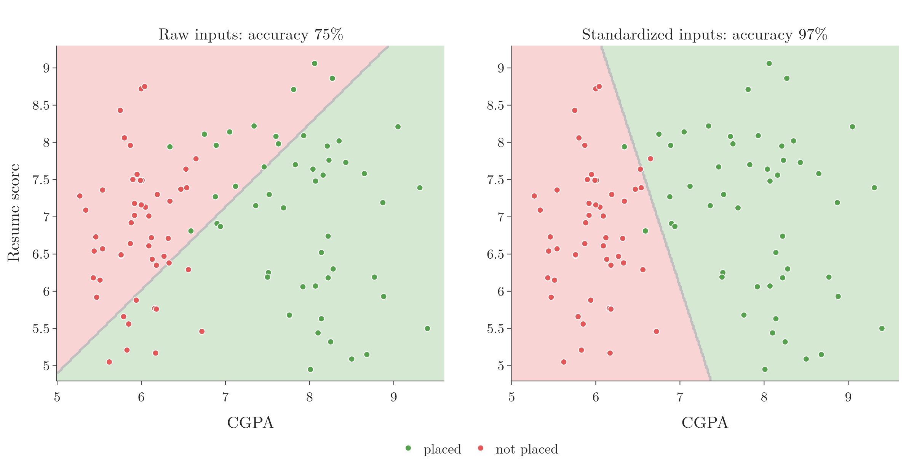

<!-- where-this-fits: generated by course_map/build_map.py; edit concepts.yaml, not this block -->
> **Where this fits:** Pipeline map step 8 (Model). See the [Course map](../01-course-map/note.md).
>
> 
>
> - **Builds on:** Perceptron trick ([Note 71](../71-perceptron-code/note.md)); Equation of a hyperplane ([Note 363](../363-equation-of-a-hyperplane/note.md)); Dot product ([Note 520](../520-dot-product-and-duality/note.md)).
> - **Leads to:** Problem with the perceptron (XOR) ([Note 1007](../1007-problem-with-perceptron/note.md)); Multi-layer perceptron (MLP) ([Note 1009](../1009-mlp-intuition/note.md)).
<!-- /where-this-fits -->

## 1. Overview

> **Key point:** A perceptron multiplies each input by a weight, adds a bias, and passes the sum through an activation function. With a step activation it draws one straight line and puts each class on one side.


The **perceptron** is the building block of every neural network (see the [what is deep learning Note](../1002-what-is-deep-learning/note.md)). It is also a supervised learning algorithm in its own right, like linear regression or logistic regression. Figure 1 shows its whole design.

This Note builds the model, uses it to predict, compares it with a brain cell, and shows what it does geometrically. How it learns its weights comes in the next three Notes.

## 2. Prerequisites

- The general form of a line, its positive and negative sides, and the step function: the [perceptron trick Note](../70-perceptron-trick/note.md), sections 3 and 7.
- Lines, planes and hyperplanes: the [equation of a hyperplane Note](../363-equation-of-a-hyperplane/note.md).
- The dot product: the [dot product Note](../362-dot-product-and-cosine-similarity/note.md).

## 3. The parts of a perceptron

> **Key point:** Inputs, weights, a bias, a summation block that computes z, and an activation function that turns z into the output.

### 3.1 Inputs, weights and bias

> **Key point:** Each input has its own weight; the bias is the weight on a constant input of 1.

In Figure 1, the data enters on the left. Each input column gets one node: $x_1$ and $x_2$.

- The connection from each input carries a weight ($w_1$, $w_2$; see the [what is deep learning Note](../1002-what-is-deep-learning/note.md)). It says how strongly that input counts.
- One extra input is always 1. Its connection carries the **bias** $b$. The bias lets the line sit anywhere, not only through the origin.

The weights and the bias are the numbers the perceptron learns. Together they are its [parameters](../06-instance-vs-model-based/note.md): the numbers a trained model is described by.

### 3.2 The summation

> **Key point:** z is the dot product of the weights with the inputs, plus the bias.

The orange block adds up every input times its weight:

1. **In words:** multiply each input by its weight, add them up, and add the bias.
2. **Formula:**
   $$z = w_1 x_1 + w_2 x_2 + b$$
3. **Example:** with $w_1 = 1$, $w_2 = 2$, $b = 3$ and inputs $x_1 = 100$, $x_2 = 5.1$:
   $$z = 1 \times 100 + 2 \times 5.1 + 3 \times 1 = 113.2$$

The sum $w_1x_1 + w_2x_2$ is the dot product of the weight vector with the input vector (see the [dot product Note](../362-dot-product-and-cosine-similarity/note.md)).

### 3.3 The activation function

> **Key point:** The activation function maps z, which can be any number, into a fixed range. The perceptron uses the step function: 1 if z ≥ 0, else 0.

$z$ can be any number, large or small, positive or negative. The green block in Figure 1 is the **activation function**: a function that brings $z$ into a fixed range.

The classic perceptron uses the [step function](../70-perceptron-trick/note.md): output 1 when $z \geq 0$ and 0 otherwise. Other activation functions exist (sigmoid, tanh, ReLU and more), with ranges such as 0 to 1 or −1 to 1. Later Notes use them.

> **Extra:** Whether $z = 0$ counts as 1 or 0 is a convention. The [perceptron trick Note](../70-perceptron-trick/note.md) uses $z > 0$, here we use $z \geq 0$. A point with $z$ exactly 0 lies on the line, so the choice almost never matters.

## 4. Training and prediction

> **Key point:** Training finds the weights and bias from labelled data. Prediction puts a new row through the perceptron with those fixed numbers.

Take 1,000 students with their IQ, their CGPA and whether they were placed (1) or not (0). One row might be IQ 78, CGPA 7.8, placed 1; another IQ 69, CGPA 5.1, placed 0. We want a model that predicts placement for a new student.

Like any ML algorithm, the perceptron works in two stages:

1. **Training:** feed the students one by one ($x_1$ = IQ, $x_2$ = CGPA), compare the output with the true label, and adjust $w_1$, $w_2$ and $b$. The goal of training is only these three numbers.
2. **Prediction:** with the learned numbers fixed, compute $z$ for a new student and pass it through the step function.

Suppose training gave $w_1 = 1$, $w_2 = 2$ and $b = 3$. A new student has IQ 100 and CGPA 5.1. Section 3.2 already computed $z = 113.2$. Since $z \geq 0$, the step function outputs 1: we predict this student will be placed.

### 4.1 More inputs

> **Key point:** One more input column means one more input node and one more weight; nothing else changes.

If we also know each student's state (encoded as a number, see the [one-hot encoding Note](../27-one-hot-encoding/note.md)), we add an input $x_3$ with weight $w_3$:

$$z = w_1x_1 + w_2x_2 + w_3x_3 + b$$

With $n$ inputs, $z$ is the sum of $n$ products plus the bias. The summation and the activation stay as they are.

## 5. Perceptron and biological neuron

> **Key point:** The perceptron is loosely inspired by a brain cell, but it is far simpler and is not a copy of it.


The nervous system is a network of billions of **neurons**, the brain cells. Figure 2 sets one beside a perceptron:

| Neuron | Role | Perceptron |
|---|---|---|
| **Dendrites** | receive signals | inputs and weights |
| **Nucleus** (cell body) | processes them | summation and activation |
| **Axon** | sends the result on | output |

Neurons connect to each other to form the nervous system; perceptrons connect to each other to form a neural network. This is the extent of the similarity.

### 5.1 Three differences

> **Key point:** A neuron is complex, its processing is not understood, and its connections change over time. A perceptron is simple, its processing is two known operations, and its connections are fixed once trained.

1. **Complexity:** a neuron takes a very large number of inputs and is wired to many other neurons. A perceptron has a handful of inputs and one output.
2. **Processing:** inside a neuron, electrochemical reactions decide the output, and scientists still do not fully understand them. Inside a perceptron there are exactly two operations: a weighted sum and a step.
3. **Neuroplasticity:** the connections between neurons get stronger or weaker over time, disappear, or form anew; this is how we learn new skills. A trained perceptron's connections (its weights) do not change.

So the perceptron is weakly inspired by the neuron. Calling it a model of the brain would be wrong.

## 6. Weights as feature importance

> **Key point:** A bigger weight means a stronger connection: that input has more say in the decision.

Suppose training on the placement data gave $w_1 = 2$ for IQ, $w_2 = 4$ for CGPA and $b = 1$. The weight of CGPA is twice the weight of IQ. So, for this model, CGPA matters about twice as much as IQ in deciding placement.

In this way the weights tell us the **feature importance** of each input. The bias does not belong to any input; its role is to shift the line (Section 7).

> **Extra:** This reading is only fair when the inputs are on the same scale. IQ runs to about 150 while CGPA stops at 10, so a weight on IQ is multiplied by much bigger numbers. Standardize the inputs first (see the [standardization Note](../24-standardization/note.md)) and then compare the size of the weights. Section 8 shows a case where the raw weights even get the sign wrong.

## 7. What a perceptron does geometrically

> **Key point:** z = 0 is a line (a plane in 3D, a hyperplane beyond). The perceptron predicts 1 on one side and 0 on the other: it is a binary classifier that draws one straight boundary.

Rename $w_1, w_2, b$ as $A, B, C$ and $x_1, x_2$ as $x, y$. Then $z = 0$ reads $Ax + By + C = 0$: the general form of a line (see the [perceptron trick Note](../70-perceptron-trick/note.md), section 3).

- $z \geq 0$ is the region on the positive side of the line: predict 1, placed.
- $z < 0$ is the region on the negative side: predict 0, not placed.

So a trained perceptron is nothing more than a line that splits the plane into two regions, one per class. That is why it is a **binary classifier**: it separates exactly two classes.

With three inputs the points live in 3D and $z = 0$ is a plane, like a sheet held across a room. With four or more inputs it is a hyperplane (see the [equation of a hyperplane Note](../363-equation-of-a-hyperplane/note.md)). In every case there are two regions.

### 7.1 The big limitation

> **Key point:** A perceptron only works on data that a straight boundary can (roughly) separate.

A perceptron can only classify [linearly separable](../70-perceptron-trick/note.md) data, or data that is almost so: a few points on the wrong side only lower the accuracy. If one class surrounds the other, no line can split them and the perceptron fails, whatever we do. The [problem with the perceptron Note](../1007-problem-with-perceptron/note.md) shows this in code.

## 8. A perceptron in scikit-learn

> **Key point:** scikit-learn's Perceptron learns w₁, w₂ and b with fit; coef_ holds the weights and intercept_ the bias.

The data has 100 students with two inputs, CGPA and a resume score (both from 0 to 10), and the output `placed`. Fifty were placed and fifty not.

> **Python:** Training a perceptron.
>
> ```python
> import pandas as pd
> from sklearn.linear_model import Perceptron
>
> df = pd.read_csv("data/placement.csv")
> X = df[["cgpa", "resume_score"]]
> y = df["placed"]
>
> p = Perceptron(random_state=0)
> p.fit(X, y)
> p.coef_        # [[40.26, -36.0]]: w1 (CGPA), w2 (resume score)
> p.intercept_   # [-25.0]: the bias b
> ```
>
> `Perceptron` lives in `sklearn.linear_model`, next to `LogisticRegression`. `random_state` fixes the order in which it visits the rows.

So the learned line is $40.26\,x_1 - 36\,x_2 - 25 = 0$, with $x_1$ = CGPA and $x_2$ = resume score.



Figure 3 (left) colours each region by the class the perceptron predicts there. The line divides the data, but badly: the training accuracy is only 75%. The weight on resume score is even negative, which would mean a better resume lowers the chance of placement.

> **Extra:** Standardizing both inputs first (Figure 3, right) gives a much better line: 97% training accuracy, with weights 5.82 for CGPA and 1.48 for resume score. The perceptron trick takes steps whose size depends on the raw input values, so unscaled inputs make it settle on a poor line. On scaled inputs, the weights also make sense as feature importance: CGPA counts about four times as much as the resume score.

The data here is small and nothing was tuned, so the raw result is not the best a perceptron can do. The aim is to see the three learned numbers and the line they describe.

> **Python:** Drawing the regions. The figure colours a fine grid of points by `p.predict`, as in the [toy project Note](../13-toy-project/note.md) (Figure 5). The Notebook has the code; it uses Plotly instead of the `mlxtend` library's `plot_decision_regions`.

## 9. Summary

| Part | What it does | In the placement example |
|---|---|---|
| Inputs $x_1, x_2$ | the row's values | CGPA, resume score |
| Weights $w_1, w_2$ | how much each input counts | learned: 40.26, −36 |
| Bias $b$ | shifts the line | learned: −25 |
| Summation | $z = w_1x_1 + w_2x_2 + b$ | one number per student |
| Activation (step) | 1 if $z \geq 0$, else 0 | placed or not |

- A perceptron is a weighted sum plus a bias, followed by an activation function.
- Training finds the weights and bias; prediction applies them to a new row.
- It is loosely inspired by a neuron (dendrites, nucleus, axon) but far simpler, and its weights are fixed once trained.
- On standardized inputs, larger weights mean more important inputs.
- Geometrically it is a line, plane or hyperplane: a binary classifier for linearly separable data only.

## 10. Key terms

| Term | Meaning |
|---|---|
| Perceptron | A model that computes a weighted sum of its inputs plus a bias and passes it through an activation function |
| Bias (of a perceptron) | The weight on a constant input of 1; it shifts the boundary away from the origin |
| Summation ($z$) | The weighted sum $w_1x_1 + w_2x_2 + \dots + b$ inside a perceptron |
| Activation function | The function that turns $z$ into the output, bringing it into a fixed range |
| Neuron | A brain cell: dendrites take signals in, the nucleus processes them, the axon sends the result on |
| Dendrites, nucleus, axon | The input branches, the processing centre and the output fibre of a neuron |
| Neuroplasticity | The brain's connections strengthening, weakening, vanishing or forming over time |
| Feature importance (weights) | Reading the size of a weight as how much its input matters, fair only on scaled inputs |
| Binary classifier | A model that separates exactly two classes |
