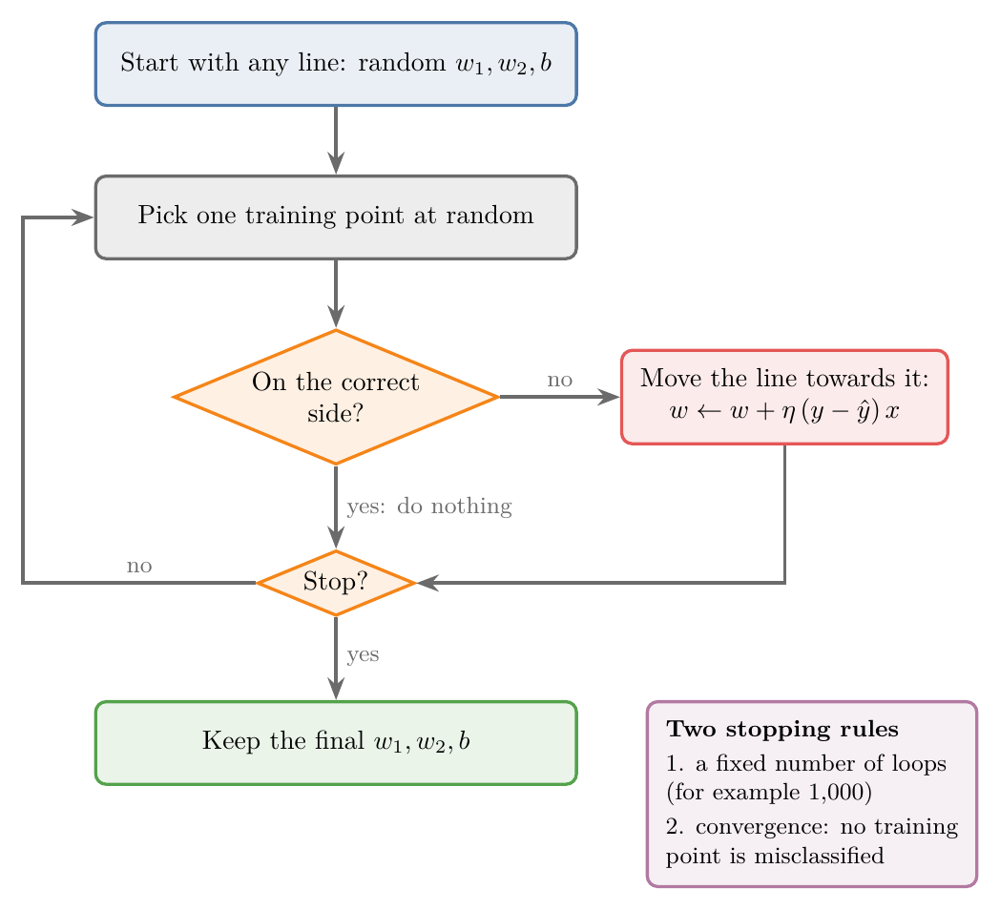

<!-- where-this-fits: generated by course_map/build_map.py; edit concepts.yaml, not this block -->
> **Where this fits:** Pipeline map step 8 (Model). See the [Course map](../01-course-map/note.md).
>
> 
>
> - **Builds on:** Equation of a hyperplane ([Note 363](../363-equation-of-a-hyperplane/note.md)).
> - **Leads to:** Perceptron loss ([Note 1006](../1006-perceptron-loss/note.md)).
<!-- /where-this-fits -->

## 1. Overview

> **Key point:** Training a perceptron means finding its weights and bias. The perceptron trick does it by starting from any line and pulling it towards every misclassified point it picks, until a stopping rule ends the loop.

{height=48%}

The [perceptron Note](../1004-perceptron/note.md) showed how a trained perceptron predicts. This Note covers how it gets its numbers: the **perceptron trick**, the simplest training method. Figure 1 shows the whole loop.

The trick itself is taught in full in two earlier Notes, and we do not repeat it here:

- the [perceptron trick Note](../70-perceptron-trick/note.md): positive and negative sides of a line, how $A$, $B$ and $C$ move it, the add-or-subtract update, the learning rate, and the single rule $w \leftarrow w + \eta(y - \hat{y})x$;
- the [perceptron code Note](../71-perceptron-code/note.md): the code, an animation of the line moving update by update (its Figure 1), and why the final line depends on the random order.

This Note adds what is new when we see the trick as the training of a perceptron.

## 2. Prerequisites

- The [perceptron Note](../1004-perceptron/note.md): weights, bias, summation and step activation.
- The [perceptron trick Note](../70-perceptron-trick/note.md) and the [perceptron code Note](../71-perceptron-code/note.md).

## 3. The trick in perceptron terms

> **Key point:** The line Ax + By + C = 0 of the trick is the perceptron's z = 0. A and B are the weights, C is the bias, and the column of 1s is the bias input.

The perceptron trick works on the line $Ax_1 + Bx_2 + C = 0$. The perceptron's boundary is $z = w_1x_1 + w_2x_2 + b = 0$. They are the same line with different names:

| Perceptron trick | Perceptron | Role |
|---|---|---|
| $A$ ($w_1$) | weight $w_1$ | how much $x_1$ counts |
| $B$ ($w_2$) | weight $w_2$ | how much $x_2$ counts |
| $C$ ($w_0$) | bias $b$ | shifts the line |
| column $x_0 = 1$ | the constant input 1 | carries the bias |

So the column of 1s added in the trick's code is exactly the extra input "1" of the perceptron diagram (Figure 1 of the [perceptron Note](../1004-perceptron/note.md)). The update $w \leftarrow w + \eta(y - \hat{y})x$ changes both weights and the bias in one step.

Training and prediction then split cleanly:

1. **Training:** run the loop of Figure 1 on the labelled data. Its only output is the three numbers $w_1$, $w_2$ and $b$.
2. **Prediction:** freeze them, compute $z$ for a new point and apply the step function.

## 4. When to stop

> **Key point:** Either run a fixed number of loops, or stop at convergence: the moment no training point is misclassified.

The loop in Figure 1 needs a rule to end it. Two are common:

1. **A fixed number of loops**, for example 1,000. If the line is not good yet, run more, such as 10,000.
2. **[Convergence](../70-perceptron-trick/note.md):** after every update, count the misclassified training points. Stop as soon as the count is 0, since no point can move the line any more.

Rule 2 only ever stops on linearly separable data: if no line separates the classes, some point is always misclassified. Data that no line separates is why the two rules are often combined: stop at convergence, or after the maximum number of loops, whichever comes first.

> **Extra:** scikit-learn's `Perceptron` uses a similar combination, with a looser early stop. `max_iter` caps the number of epochs (default 1,000). With `tol` set (default $10^{-3}$), training also stops once the loss has failed to improve by at least `tol` for `n_iter_no_change` epochs in a row (default 5) (scikit-learn docs, `Perceptron`). This stop can fire before every point is classified correctly: in the [perceptron Note](../1004-perceptron/note.md), section 8, it ended training after 7 epochs at 75% training accuracy.

## 5. Loops and epochs

> **Key point:** One random pick is one update, not one epoch. An epoch is one pass over the whole training set, so with 100 points, 1,000 single picks are about 10 epochs.

Each loop of the trick looks at one randomly chosen point. The number of loops is sometimes loosely called the number of "epochs", but that is not the standard meaning.

An [epoch](../57-gradient-descent/note.md) is one full pass over the training set. In the trick, one pass means as many picks as there are points:

1. **In words:** divide the number of single-point updates by the number of training points.
2. **Formula:**
   $$\text{epochs} = \frac{\text{number of loops}}{\text{number of training points}}$$
3. **Example:** 1,000 loops on 100 points:
   $$\frac{1000}{100} = 10 \text{ epochs}$$

Because the picks are random, a stretch of 100 picks does not visit every point once. A given point is missed by one pick with probability $1 - 1/100$, so it is missed by all 100 picks with probability $(1 - 1/100)^{100} \approx 0.37$: in each stretch, about a third of the points are not seen, while others are seen twice or more. Visiting the points in a shuffled order, each once per epoch, avoids this; that is how stochastic gradient descent goes through the data (see the [stochastic gradient descent Note](../59-stochastic-gradient-descent/note.md)).

## 6. Why it is only a trick

> **Key point:** The trick finds a separating line, but cannot say how good that line is, and different random orders give different lines.

The perceptron trick is simple and usually works. But on the same data, different random orders give different final lines, some hugging one class (see section 6 of the [perceptron code Note](../71-perceptron-code/note.md)). Nothing in the trick measures which line is better. The trick is like a student who stops revising the moment every practice question is right: they pass, but they never learn their score, so they cannot tell a narrow pass from a safe one.

The fix is a [loss function](../73-log-loss/note.md): a number that scores every possible line, so training can look for the best one. The [perceptron loss Note](../1006-perceptron-loss/note.md) builds it.

## 7. Summary

| Idea | Meaning |
|---|---|
| Training | Finding $w_1$, $w_2$ and $b$ from labelled data |
| Perceptron trick | Pick a random point; if it is misclassified, pull the line towards it |
| Update | $w \leftarrow w + \eta(y - \hat{y})x$, with $x_0 = 1$ for the bias |
| Stop: fixed loops | Run, for example, 1,000 picks |
| Stop: convergence | Stop when no training point is misclassified |
| Epoch | One pass over the whole training set, not one pick |

- The trick's $A$, $B$, $C$ are the perceptron's $w_1$, $w_2$, $b$.
- Convergence is only reached on linearly separable data, so a maximum number of loops is kept as a backstop.
- 1,000 random picks on 100 points are about 10 epochs.
- The trick cannot score a line; a loss function can.

## 8. Sources

- scikit-learn documentation, `sklearn.linear_model.Perceptron`.

## 9. Key terms

| Term | Meaning |
|---|---|
| Training (a perceptron) | Finding its weights and bias from labelled data |
| Stopping rule | The condition that ends a training loop: a fixed number of loops, or convergence |
