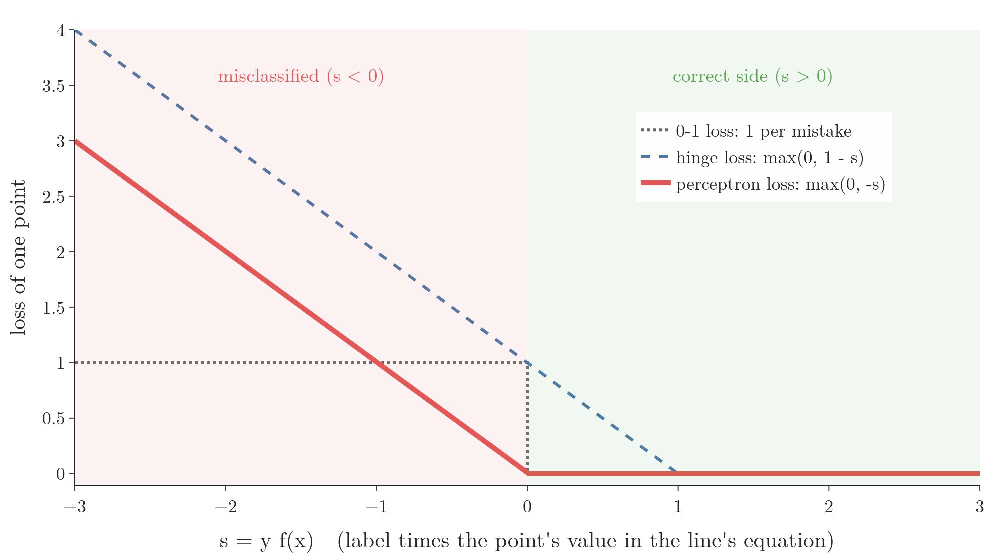

<!-- where-this-fits: generated by course_map/build_map.py; edit concepts.yaml, not this block -->
> **Where this fits:** Pipeline map step 8 (Model). See the [Course map](../01-course-map/note.md).
>
> 
>
> - **Builds on:** Stochastic gradient descent ([Note 59](../59-stochastic-gradient-descent/note.md)); Perceptron trick ([Note 1005](../1005-perceptron-trick/note.md)).
> - **Compare with:** Hinge loss and soft margin ([Note 94](../94-svm-soft-margin/note.md)).
<!-- /where-this-fits -->

## 1. Overview

> **Key point:** A loss function gives every possible line one number: its error. Training a perceptron then means finding the w₁, w₂, b with the smallest loss, using gradient descent. Swapping the activation and the loss turns the same perceptron into logistic regression, softmax regression or linear regression.

{height=60%}

The [perceptron trick Note](../1005-perceptron-trick/note.md) trained a perceptron by pulling a line towards misclassified points. This Note replaces the trick with a proper method: write down a loss, then minimise it. Figure 1 shows the result: the line moves and the loss falls to 0.

The last section shows why the perceptron is so useful as a building block. The perceptron's design lets us change two parts, the activation and the loss, and get a whole family of models.

## 2. Prerequisites

- The [perceptron Note](../1004-perceptron/note.md) and the [perceptron trick Note](../1005-perceptron-trick/note.md).
- Loss functions and log loss: the [log loss Note](../73-log-loss/note.md).
- Gradient descent and partial derivatives: the [gradient descent Note](../57-gradient-descent/note.md) and the [stochastic gradient descent Note](../59-stochastic-gradient-descent/note.md).

## 3. What is wrong with the perceptron trick

> **Key point:** The trick cannot tell us how good a line is, and nothing guarantees it settles on a good one.

The perceptron trick usually finds a line that separates the classes. The trick has two weaknesses:

1. **The trick cannot quantify its result.** Two different lines can both separate the training data. Different random orders give different lines (see section 6 of the [perceptron code Note](../71-perceptron-code/note.md)), and the trick has no number that says which one is better.
2. **The trick may not converge.** The trick only moves when it happens to pick a misclassified point, so a long run of correct picks leaves the line where it is. On data that no line can separate, it never stops changing at all (see the [problem with the perceptron Note](../1007-problem-with-perceptron/note.md)).

ML algorithms avoid both problems with a [loss function](../73-log-loss/note.md): a single number that scores how good the current parameters are.

## 4. A loss function for a line

> **Key point:** The loss is a function of w₁, w₂ and b. Every line gets one number; the best line is the one with the smallest number.

A [loss function](../73-log-loss/note.md) measures how wrong a model is. For a perceptron with two inputs, the data is fixed, so the loss depends only on the three parameters:

$$L = L(w_1, w_2, b)$$

Changing any of $w_1$, $w_2$ or $b$ moves the line and changes $L$. Suppose one line gives $L = 25$ and, after moving it, the new line gives $L = 23$. The second line is better. Training means finding the $w_1$, $w_2$, $b$ where $L$ is smallest; that line is the final model.

Familiar examples: linear regression uses the mean squared error (see the [regression metrics Note](../52-regression-metrics/note.md)), logistic regression the [log loss](../73-log-loss/note.md), and the SVM the [hinge loss](../94-svm-soft-margin/note.md). We can also design our own, as the next section does.

> **Extra:** A loss read as a function of the parameters is also called a cost function (see the [convex and non-convex cost functions Note](../590-convex-and-non-convex-cost-functions/note.md)).

## 5. Designing a loss for the perceptron

> **Key point:** Counting mistakes treats them all alike. Measuring how far each mistake is from the line is better, and putting the point into the line's equation gives a number proportional to that distance.

### 5.1 Count the mistakes

> **Key point:** The 0-1 loss counts misclassified points, so a point just over the line costs as much as one far away.

The simplest loss is the number of misclassified points. A line with 7 mistakes is worse than a line with 5. The mistake count is called the **0-1 loss**: each point costs 1 if it is misclassified and 0 if not.

The flaw of the 0-1 loss is that every mistake counts the same. A point just across the line is a small mistake; a point far on the wrong side is a big one. A good loss should weigh mistakes by their size.

> **Extra:** The 0-1 loss is also useless for gradient descent. Moving the line a little usually changes no point's class, so the loss stays flat and its slope is 0 almost everywhere: there is no direction to follow.

### 5.2 Use the distance

> **Key point:** Add up the perpendicular distances of the misclassified points from the line.

A better loss adds up the perpendicular distance of every misclassified point from the line. With two mistakes at distances $d_1 = 10$ and $d_2 = 13$, the loss is $10 + 13 = 23$. Big mistakes now count more than small ones, much as a speeding fine grows with how far over the limit a driver was, instead of being the same for 1 km/h and 50 km/h.

### 5.3 Use the value in the line's equation

> **Key point:** Put each misclassified point into Ax + By + C and add up the absolute values. The sum is proportional to the distance and needs only a dot product.

Computing distances takes some work. A simpler number does the same job: put the point into the left-hand side of the line's equation, as in the side test of the [perceptron trick Note](../70-perceptron-trick/note.md).

1. **In words:** for every misclassified point, compute $Ax + By + C$, take its absolute value, and add them up.
2. **Formula:**
   $$L = \sum_{\text{misclassified}} \left| A x_i + B y_i + C \right|$$
3. **Example:** the line $2x + 3y + 4 = 0$ misclassifies the points $(4, 6)$ and $(-2, -2)$:
   $$|2 \times 4 + 3 \times 6 + 4| + |2 \times (-2) + 3 \times (-2) + 4| = |30| + |-6| = 30 + 6 = 36$$

The further a point is from the line, the bigger this value. The perceptron loss uses exactly this idea.

> **Extra:** The value is the distance times a fixed number. The distance from a point to the line $Ax + By + C = 0$ is $|Ax + By + C| / \sqrt{A^2 + B^2}$ (see the [equation of a hyperplane Note](../363-equation-of-a-hyperplane/note.md)). Here $\sqrt{2^2 + 3^2} = 3.61$, so the distances are $30 / 3.61 = 8.32$ and $6 / 3.61 = 1.66$. Dividing every term by the same 3.61 does not change which line is best.

## 6. The perceptron loss

> **Key point:** With labels −1 and +1, the loss of one point is max(0, −y f(x)): zero when the point is on its correct side, and |f(x)| when it is not.

### 6.1 The formula

> **Key point:** L = (1/n) Σ max(0, −yᵢ f(xᵢ)), where f(x) = w₁x₁ + w₂x₂ + b.

scikit-learn's documentation for `SGDClassifier` gives the loss it uses for the perceptron (scikit-learn User Guide, SGD). For this loss, the two classes are labelled $y = +1$ and $y = -1$, not 1 and 0.

1. **In words:** for each **observation** (one record, one row of the data table), multiply its label by its value $f(x)$ in the line's equation and flip the sign; keep it if it is positive, otherwise use 0; then average over all observations.
2. **Formula:** with $f(x_i) = w_1 x_{i1} + w_2 x_{i2} + b$ (observation $i$, **features** 1 and 2, where a feature is an input variable, one column of the data table) and $n$ observations,
   $$L(w_1, w_2, b) = \frac{1}{n} \sum_{i=1}^{n} \max\big(0,\ -y_i\thinspace f(x_i)\big)$$
3. **Example:** for the line $2x + 3y + 4 = 0$ and the two misclassified points of Section 5.3, $(4, 6)$ with $y = -1$ and $(-2, -2)$ with $y = +1$:
   $$\max(0, -(-1)(30)) + \max(0, -(1)(-6)) = 30 + 6 = 36,$$
   and dividing by $n = 2$ gives $L = 18$.

$f(x_i)$ is the perceptron's $z$ for observation $i$. The quantity $\max(0, s)$ is just "$s$ if $s$ is positive, otherwise 0".

> **Extra:** The full formula in scikit-learn also adds a regularisation term $\alpha R(w)$, as in [Ridge regression](../63-ridge-regression-intuition/note.md). We leave it out here (no regularisation).

### 6.2 What it does in each case

> **Key point:** Correctly classified points add 0; each misclassified point adds |f(x)|, which grows with its distance from the line.

A point can relate to the line in four ways:

| True label $y$ | Side of the line, sign of $f(x)$ | $-y f(x)$ | Loss of the point |
|---|---|---|---|
| $+1$ | positive | negative | 0 (correct) |
| $-1$ | negative | negative | 0 (correct) |
| $+1$ | negative | positive | $\lvert f(x) \rvert$ (mistake) |
| $-1$ | positive | positive | $\lvert f(x) \rvert$ (mistake) |

So the formula is the "value in the line's equation" loss of Section 5.3, written in one line with no if-statements. The label $y$ only has size 1, so it fixes the sign and the size comes from $f(x)$.

{height=38%}

Figure 2 plots the loss of one point against $s = y f(x)$. The perceptron loss (red) is 0 for every point on its correct side and rises steadily the further a point is on the wrong side.

> **Extra:** The SVM's [hinge loss](../94-svm-soft-margin/note.md) is $\max(0, 1 - s)$ (blue, dashed): the same shape shifted right by 1. A point must be correct by a margin ($s \geq 1$) before it costs nothing. The perceptron loss accepts any correct point, however close to the line. Once every point is on its correct side, every observation's gradient is 0 (section 7.1), so the updates stop at the first separating line reached, even one that passes very close to the points of one class.

### 6.3 Minimising it

> **Key point:** Training is argmin over w₁, w₂, b of L, solved with gradient descent.

Only $w_1$, $w_2$ and $b$ can change; the inputs $x_{i1}, x_{i2}$ and labels $y_i$ are fixed by the data. So training is

$$w_1, w_2, b = \underset{w_1, w_2, b}{\arg\min}\ \frac{1}{n} \sum_{i=1}^{n} \max\big(0,\ -y_i f(x_i)\big)$$

**argmin** means "the values of the variables that make the expression smallest". We find them with gradient descent: start with any values, then repeat for a number of epochs

$$w_1 \leftarrow w_1 - \eta\thinspace\frac{\partial L}{\partial w_1}, \qquad w_2 \leftarrow w_2 - \eta\thinspace\frac{\partial L}{\partial w_2}, \qquad b \leftarrow b - \eta\thinspace\frac{\partial L}{\partial b}$$

with a learning rate $\eta$ such as 0.1 (see the [gradient descent Note](../57-gradient-descent/note.md)).

## 7. The gradient of the perceptron loss

> **Key point:** For a misclassified observation, $\partial L/\partial w_1 = -y x_1$, $\partial L/\partial w_2 = -y x_2$ and $\partial L/\partial b = -y$; for a correct observation, all three are 0.

### 7.1 The derivatives

> **Key point:** The chain rule splits the derivative into $\partial L/\partial f$, which is 0 or $-y$, times $\partial f/\partial w_1$, which is $x_1$.

Take the loss of one observation, $L_i = \max(0, -y_i f(x_i))$. By the [chain rule](../74-sigmoid-derivative/note.md),

$$\frac{\partial L_i}{\partial w_1} = \frac{\partial L_i}{\partial f} \cdot \frac{\partial f}{\partial w_1}$$

- $\partial f / \partial w_1 = x_{i1}$, because $f = w_1 x_{i1} + w_2 x_{i2} + b$.
- $\partial L_i / \partial f$ depends on which part of the max is active: 0 when $y_i f(x_i) \geq 0$ (the loss is the flat 0), and $-y_i$ when $y_i f(x_i) < 0$ (the loss is $-y_i f$).

Putting them together:

1. **In words:** a correct observation has no slope; a misclassified observation has slope $-y$ times the input (and $-y$ for the bias, whose input is 1).
2. **Formula:**
   $$\frac{\partial L_i}{\partial w_1} = \begin{cases} 0 & y_i f(x_i) \geq 0 \cr-y_i\thinspace x_{i1} & y_i f(x_i) < 0 \end{cases} \qquad \frac{\partial L_i}{\partial w_2} = \begin{cases} 0 \cr-y_i\thinspace x_{i2} \end{cases} \qquad \frac{\partial L_i}{\partial b} = \begin{cases} 0 \cr-y_i \end{cases}$$
3. **Example:** line $2x_1 + 3x_2 + 4 = 0$ and the point $(-2, -2)$ with $y = +1$. Then $f = -6$, so $y f = -6 < 0$: misclassified, loss 6. The slopes are $-1 \times (-2) = 2$, $2$ and $-1$. One step with $\eta = 0.1$:
   $$w_1 = 2 - 0.1 \times 2 = 1.8, \quad w_2 = 3 - 0.1 \times 2 = 2.8, \quad b = 4 - 0.1 \times (-1) = 4.1$$
   The point's value becomes $1.8(-2) + 2.8(-2) + 4.1 = -5.1$: its loss drops from 6 to 5.1.

> **Extra:** At exactly $y f = 0$ the max has a corner and no true derivative. Any slope between the two one-sided slopes, 0 and $-y x_1$, is a valid **subgradient** there: the slope of a line that touches the corner and stays below the loss. The code takes 0, because it updates only when $y f < 0$.

### 7.2 The update rule

> **Key point:** For each misclassified observation: w ← w + η y x. The update is the perceptron trick's update, now derived from a loss.

Subtracting $\eta$ times the slope gives, for a misclassified observation,

$$w_1 \leftarrow w_1 + \eta\thinspace y_i x_{i1}, \qquad w_2 \leftarrow w_2 + \eta\thinspace y_i x_{i2}, \qquad b \leftarrow b + \eta\thinspace y_i$$

and no change for a correct observation. Updating after every observation, instead of averaging over all observations first, is [stochastic gradient descent](../59-stochastic-gradient-descent/note.md).

> **Python:** Training with the perceptron loss.
>
> ```python
> def perceptron(X, y, lr=0.1, epochs=1000):
>     # y must hold -1 and +1
>     w1, w2, b = -1.0, 1.0, 0.5
>     for _ in range(epochs):
>         for i in range(X.shape[0]):
>             z = w1 * X[i, 0] + w2 * X[i, 1] + b
>             if y[i] * z < 0:          # misclassified
>                 w1 += lr * y[i] * X[i, 0]
>                 w2 += lr * y[i] * X[i, 1]
>                 b += lr * y[i]
>     return w1, w2, b
>
> y_pm = np.where(y == 1, 1, -1)       # 0/1 labels -> -1/+1
> ```
>
> `np.where(condition, a, b)` takes `a` where the condition holds and `b` elsewhere.

Figure 1 runs this on 100 points made with `make_classification` (`class_sep=15`, `random_state=41`), starting from the poor line $-x_1 + x_2 + 0.5 = 0$. In the first epoch, 12 observations are misclassified when visited; after those 12 updates the average loss is 0, and later epochs change nothing.

The loss is the average over all observations, while each update looks at one observation. So a single update can raise the total loss: here the first update moves it from 1.687 to 1.712. The trend is still steadily down.

> **Extra:** With labels $\pm 1$, $\eta\thinspace y\thinspace x$ is exactly the perceptron trick's $\eta(y - \hat{y})x$ up to a factor of 2: a positive point on the wrong side gets $+\eta x$, a negative one $-\eta x$. So the trick was gradient descent on the perceptron loss all along. What the loss adds is a number we can watch go down, and compare between lines.

> **Extra:** The labels must be $-1$ and $+1$. With `make_classification`'s labels 0 and 1, `y[i] * z` is 0 for every class-0 observation, so the condition `< 0` never holds and those observations never update the line. The model then learns only from class 1. From the start line of Figure 1 it ends with all 50 class-0 points misclassified; from the start $(1, 1, 1)$ it happens to work, because class 0 is already on the correct side of that line.

## 8. One perceptron, many models

> **Key point:** Keep the weighted sum; choose the activation and the loss. Step + perceptron loss is the perceptron, sigmoid + binary cross-entropy is logistic regression, softmax + categorical cross-entropy is softmax regression, and no activation + MSE is linear regression.

{height=45%}

The perceptron's design has two free slots (Figure 3): the activation function, which shapes the output, and the loss function, used in training. The weighted sum and the training method (gradient descent) stay the same.

- **Step + perceptron loss:** the perceptron of this Note. Output: a class, $+1$ or $-1$.
- **[Sigmoid](../72-sigmoid-function/note.md) + [binary cross-entropy](../73-log-loss/note.md):** output a probability between 0 and 1 for two classes. Sigmoid with binary cross-entropy is logistic regression. The loss is
  $$L = -\frac{1}{n}\sum_{i=1}^{n} \big[ y_i \log \hat y_i + (1 - y_i)\log(1 - \hat y_i) \big]$$
- **[Softmax](../79-softmax-regression/note.md) + categorical cross-entropy:** one output per class, probabilities that add to 1. Softmax with categorical cross-entropy is softmax regression, for more than two classes.
- **Linear (no activation) + mean squared error:** the output is $z$ itself, any number. No activation with mean squared error is linear regression, with loss $\frac{1}{n}\sum (y_i - \hat y_i)^2$ (see the [simple linear regression Note](../50-simple-linear-regression/note.md)).

So "a perceptron is logistic regression" is only true for one choice of the two slots: sigmoid and binary cross-entropy. The same flexibility carries over to every neuron of a neural network: regression networks end in a linear output, and classification networks in a sigmoid or softmax output.

> **Python:** scikit-learn's `SGDClassifier` trains the same linear model with any of these losses.
>
> ```python
> from sklearn.linear_model import SGDClassifier
>
> sgd = SGDClassifier(loss="perceptron", penalty=None,
>                     learning_rate="constant", eta0=0.1, random_state=0)
> sgd.fit(X, y)    # labels 0/1 are fine: it converts them itself
> ```
>
> `loss="log_loss"` gives logistic regression and `loss="hinge"` a linear SVM. The `Perceptron` class is this same model with `eta0=1` (scikit-learn docs, `Perceptron`).

On the 100 points, `Perceptron` and `SGDClassifier(loss="perceptron", eta0=0.1)` find the same line, one with weights ten times the other: $(2.35, -0.19, 2.0)$ and $(0.235, -0.019, 0.2)$. Multiplying all of $w_1$, $w_2$, $b$ by one positive number leaves the line $z = 0$ where it is. Both classify all 100 points correctly.

## 9. Summary

| Activation | Loss | Model | Output |
|---|---|---|---|
| step | perceptron loss $\max(0, -y f(x))$ | perceptron | class $\pm 1$ |
| sigmoid | binary cross-entropy | logistic regression | probability, 2 classes |
| softmax | categorical cross-entropy | softmax regression | probabilities, $k$ classes |
| linear (none) | mean squared error | linear regression | any number |

- The perceptron trick cannot score a line; a loss function can.
- Counting mistakes (0-1 loss) treats all mistakes alike; the value $|f(x)|$ grows with the distance from the line.
- Perceptron loss: $L = \frac{1}{n}\sum \max(0, -y_i f(x_i))$ with labels $\pm 1$; correct points cost 0.
- The loss's gradient for a misclassified observation is $-y x$ (and $-y$ for $b$), so SGD updates $w \leftarrow w + \eta\thinspace y\thinspace x$: the perceptron trick, derived.
- Changing the activation and the loss turns one perceptron into several classic models.

## 10. Sources

- scikit-learn User Guide, Stochastic Gradient Descent, Mathematical formulation.
- scikit-learn documentation, `sklearn.linear_model.Perceptron` (equivalent to `SGDClassifier(loss="perceptron", eta0=1, learning_rate="constant", penalty=None)`).

## 11. Key terms

| Term | Meaning |
|---|---|
| 0-1 loss | A loss that counts 1 for every misclassified point and 0 for every correct one |
| Perceptron loss | $\max(0, -y f(x))$ per point, with labels $\pm 1$: 0 when correct, $\lvert f(x) \rvert$ when not |
| argmin | The values of the variables that make an expression smallest |
| Subgradient | A slope used at a corner of a function, where the ordinary derivative does not exist |
| SGDClassifier | scikit-learn's linear classifier trained with SGD, with a choice of loss (perceptron, log loss, hinge, ...) |
