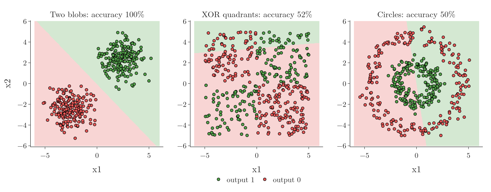

<!-- where-this-fits: generated by course_map/build_map.py; edit concepts.yaml, not this block -->
> **Where this fits:** Pipeline map step 8 (Model). See the [Course map](../01-course-map/note.md).
>
> 
>
> - **Builds on:** Perceptron ([Note 1004](../1004-perceptron/note.md)).
> - **Leads to:** Multi-layer perceptron (MLP) ([Note 1009](../1009-mlp-intuition/note.md)).
<!-- /where-this-fits -->

## 1. Overview

> **Key point:** A perceptron draws one straight line. It learns AND and OR easily, but no line can separate XOR, so on XOR (and on any data that needs a curved boundary) it fails, however long it trains.


The [perceptron Note](../1004-perceptron/note.md) showed that a perceptron is a line, plane or hyperplane. This Note shows in code what that means for data that no line can split. Figure 1 is the whole story: two easy tables and one impossible one.

The XOR weakness stalled perceptron research for years (see the [history of deep learning Note](../1003-nn-types-history-applications/note.md)), and the reason multi-layer perceptrons were needed.

## 2. Prerequisites

- The [perceptron Note](../1004-perceptron/note.md): a perceptron is a linear boundary.
- The [perceptron loss Note](../1006-perceptron-loss/note.md): how a perceptron is trained.

## 3. Three tiny datasets: AND, OR and XOR

> **Key point:** Each table has two binary inputs and four rows. AND outputs 1 only when both inputs are 1; OR when at least one is; XOR when exactly one is.

The three datasets are the logic functions **AND**, **OR** and XOR (exclusive or, defined in the [history section](../1003-nn-types-history-applications/note.md)). Each has inputs $x_1, x_2 \in \lbrace 0, 1\rbrace $, so there are only four possible rows. Each row is one **observation** (one record of the table); $x_1$ and $x_2$ are its two **features** (input variables), and the AND, OR or XOR column is the **target** (the output we predict):

| $x_1$ | $x_2$ | AND | OR | XOR |
|---|---|---|---|---|
| 0 | 0 | 0 | 0 | 0 |
| 0 | 1 | 0 | 1 | 1 |
| 1 | 0 | 0 | 1 | 1 |
| 1 | 1 | 1 | 1 | 0 |

Plotted, the four observations are the corners of a square (Figure 1). For AND, the single 1 sits in one corner; for OR, the single 0 does. For XOR, the 1s sit on opposite corners, and so do the 0s.

> **Python:** Building the tables and training one perceptron per table.
>
> ```python
> import numpy as np
> from sklearn.linear_model import Perceptron
>
> X = np.array([[0, 0], [0, 1], [1, 0], [1, 1]])
> y_and = np.array([0, 0, 0, 1])
> y_or = np.array([0, 1, 1, 1])
> y_xor = np.array([0, 1, 1, 0])
>
> for y in (y_and, y_or, y_xor):
>     p = Perceptron(random_state=0).fit(X, y)
>     print(p.coef_, p.intercept_, p.score(X, y))
> ```

## 4. What the perceptron learns

> **Key point:** AND and OR get a separating line and 100% accuracy. XOR ends with all weights 0, no line at all, and 50% accuracy.

The three perceptrons give:

| Table | $w_1$ | $w_2$ | $b$ | Line | Accuracy |
|---|---|---|---|---|---|
| AND | 2 | 2 | $-2$ | $x_1 + x_2 = 1$ | 100% |
| OR | 2 | 2 | $-1$ | $x_1 + x_2 = 0.5$ | 100% |
| XOR | 0 | 0 | 0 | none | 50% |

For AND and OR, one line puts the 1s on one side and the 0s on the other (Figure 1, left and middle). For XOR, the Notebook prints the weights after each epoch: they are back at $(0, 0, 0)$ every time. The update for a misclassified observation adds $y_i(x_{i1}, x_{i2}, 1)$ to $(w_1, w_2, b)$, with labels $\pm 1$ (see the [perceptron loss Note](../1006-perceptron-loss/note.md), section 7.2). For the four XOR observations these add up to zero:

$$-(0, 0, 1) + (0, 1, 1) + (1, 0, 1) - (1, 1, 1) = (0, 0, 0)$$

So when all four observations are misclassified in turn, as here, each epoch's updates cancel and the epoch ends where it began. Training stops with all weights at 0: $z = 0$ everywhere, the whole plane gets one class, and only half the observations are right (Figure 1, right).

More epochs would not help. Whatever the perceptron does, it can only ever draw one straight line.

> **Extra:** Why no line can separate XOR. A line works if $b < 0$ for $(0, 0)$, $w_2 + b \geq 0$ for $(0, 1)$, $w_1 + b \geq 0$ for $(1, 0)$, and $w_1 + w_2 + b < 0$ for $(1, 1)$. Adding the middle two gives $w_1 + w_2 + 2b \geq 0$, so $w_1 + w_2 + b \geq -b$. Since $b < 0$, $-b > 0$, so $w_1 + w_2 + b > 0$, which contradicts the last condition. No $w_1, w_2, b$ can satisfy all four.

## 5. The same failure on larger data

> **Key point:** One sigmoid neuron separates two blobs perfectly but stays near 50% on XOR-shaped and circular data.

The **TensorFlow Playground** (playground.tensorflow.org) is a website that trains small neural networks in the browser, with no code. Removing every hidden layer leaves a single neuron (with a sigmoid activation, that is logistic regression; see the [perceptron loss Note](../1006-perceptron-loss/note.md), section 8). On two separate clusters it finds a line almost at once; on XOR-shaped data its error stays high no matter how many epochs it runs.

The Notebook repeats this experiment in scikit-learn with `LogisticRegression`, which is exactly one sigmoid neuron:



- **Two blobs** (Figure 2, left): a line separates them, accuracy 100%.
- **XOR quadrants** (middle): class 1 where $x_1$ and $x_2$ have the same sign. A line cuts across all four quadrants, accuracy 52%.
- **Circles** (right): one class inside a ring of the other. A line cannot enclose anything, accuracy 50%.

So the problem is not the four-row table: any data whose classes need a bent or closed boundary defeats a single neuron. Such data is called [non-linear data](../95-kernel-trick-intuition/note.md): no line, plane or hyperplane separates its classes.

> **Extra:** Two ways out exist.
>
> 1. **Add a feature by hand.** Feed $x_1 x_2$ as a third input, like the [polynomial features](../61-polynomial-regression/note.md) of linear regression (the Playground offers this input too). With it, one neuron reaches 99% on the XOR quadrants in the Notebook. On the four table observations, $x_1 + x_2 - 2x_1x_2$ equals XOR exactly, so $z = x_1 + x_2 - 2x_1x_2 - 0.5$ is a plane in the three inputs $x_1, x_2, x_1x_2$ that puts the 1s at $z = 0.5$ and the 0s at $z = -0.5$.
> 2. **Add hidden layers**, so the network builds such features itself (next section).

## 6. The way forward

> **Key point:** Combining several perceptrons in layers gives curved boundaries: the multi-layer perceptron.

A single perceptron is a linear model, so it can only capture linear relationships. The fix is to use several perceptrons and feed their outputs into another one. The [MLP intuition Note](../1009-mlp-intuition/note.md) shows how two lines combined give a curved boundary, and how such a network solves XOR on the Playground.

## 7. Summary

| Data | Separable by a line? | Single perceptron or neuron |
|---|---|---|
| AND | yes | 100% |
| OR | yes | 100% |
| XOR (4 observations) | no | 50%, all weights end at 0 |
| Two blobs | yes | 100% |
| XOR quadrants | no | 52% |
| Circles | no | 50% |

- A perceptron can only draw one straight boundary.
- XOR puts each class on opposite corners of a square: no line separates them, which a short proof confirms.
- More training never fixes this; more neurons, in layers, do.

## 8. Key terms

| Term | Meaning |
|---|---|
| AND, OR | Logic functions: 1 when both inputs are 1 (AND), or when at least one is (OR) |
| TensorFlow Playground | A website that trains small neural networks in the browser and shows their boundaries |
