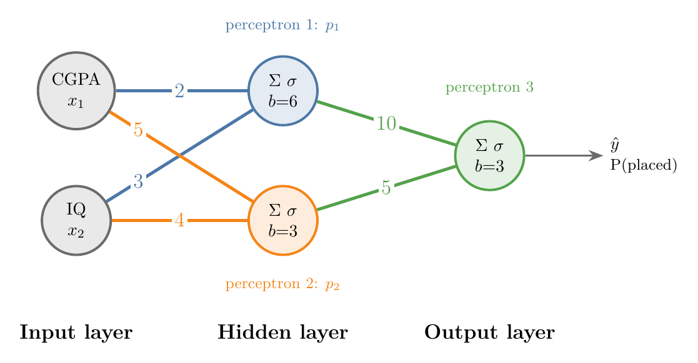
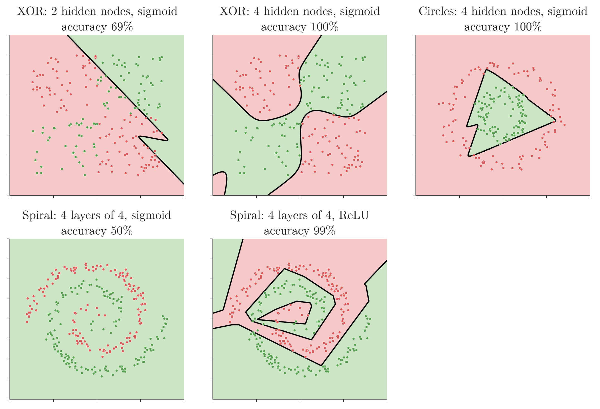

<!-- where-this-fits: generated by course_map/build_map.py; edit concepts.yaml, not this block -->
> **Where this fits:** Pipeline map steps 0 (Foundations), 8 (Model). See the [Course map](../01-course-map/note.md).
>
> 
>
> - **Builds on:** Sigmoid function ([Note 74](../74-sigmoid-derivative/note.md)); Neural networks ([Note 1002](../1002-what-is-deep-learning/note.md)); Perceptron ([Note 1004](../1004-perceptron/note.md)); Problem with the perceptron (XOR) ([Note 1007](../1007-problem-with-perceptron/note.md)); MLP notation and parameter count ([Note 1008](../1008-mlp-notation/note.md)).
> - **Leads to:** Keras workflow ([Note 1011](../1011-customer-churn-ann/note.md)); ANN for classification ([Note 1011](../1011-customer-churn-ann/note.md)).
<!-- /where-this-fits -->

## 1. Overview

> **Key point:** One perceptron draws one straight line. Feeding the outputs of several perceptrons into another perceptron combines their lines into a curved boundary, and that combination is a multi-layer perceptron.

A single perceptron cannot separate data whose classes need a curved boundary, such as XOR (see the [problem with the perceptron Note](../1007-problem-with-perceptron/note.md)). The fix must be built from perceptrons themselves. This Note builds the **multi-layer perceptron (MLP)** from first principles: two perceptrons, one way to combine them, and then larger networks.

Throughout this Note every perceptron uses the **sigmoid** activation, not the step function. So each perceptron outputs a probability between 0 and 1, exactly like logistic regression.

## 2. One perceptron with a sigmoid

> **Key point:** A perceptron with a sigmoid gives every point a probability: 0.5 on its line, rising towards 1 on one side and falling towards 0 on the other.

With the sigmoid as activation and binary cross-entropy as loss, a perceptron is logistic regression (see the [perceptron loss Note](../1006-perceptron-loss/note.md)). For a student with CGPA $x_1$ and IQ $x_2$ it computes

$$\hat{y} = \sigma(w_1 x_1 + w_2 x_2 + b),$$

the probability that the student is placed. The probability of not being placed is $1 - \hat{y}$.

The [sigmoid function Note](../72-sigmoid-function/note.md) (section 5.2) draws this as a map. On the line $w_1 x_1 + w_2 x_2 + b = 0$ the probability is 0.5. Lines parallel to it carry 0.6, 0.7, 0.8, ... on one side and 0.4, 0.3, ... on the other, so the probability changes gradually across the plane.

## 3. Combining two perceptrons

> **Key point:** Two perceptrons give two probability maps; adding them and passing the sum through a sigmoid gives a new map whose 0.5 boundary is curved.

### 3.1 The idea: superimpose, then smooth

> **Key point:** Lay the two maps on top of each other, then smooth the result back into a probability.

Suppose the green points sit in a wedge, as in Figure 1. Perceptron 1 (left) separates them from the points above-left; perceptron 2 (middle) separates them from the points below-left. Neither line alone works: perceptron 1 misclassifies 44 of the 160 points, perceptron 2 misclassifies 40.

{height=30%}

If we could lay the two maps on top of each other and smooth the result, we would get the right panel: a boundary that follows perceptron 1's line at the top, perceptron 2's line at the bottom, and bends round between them. The next two sections show the arithmetic that does this.

### 3.2 Adding the probabilities

> **Key point:** For each point, add the two perceptrons' probabilities and pass the sum through a sigmoid, so the result is again a probability.

Take one student. Perceptron 1 says the probability of placement is 0.7, perceptron 2 says 0.8. Adding them gives 1.5, which cannot be a probability. The sigmoid fixes that:

1. **In words:** add the two probabilities, then squeeze the sum back into the range 0 to 1 with the sigmoid.
2. **Formula:**
   $$\hat{y} = \sigma(p_1 + p_2)$$
3. **Example:** with $p_1 = 0.7$ and $p_2 = 0.8$,
   $$\hat{y} = \sigma(1.5) = \frac{1}{1 + e^{-1.5}} = 0.818$$

We repeat this for every point. Adding is the superimposing; the sigmoid is the smoothing.

### 3.3 Weights and a bias

> **Key point:** A weighted sum plus a bias lets one perceptron count more than the other, and lets us shift the result.

Plain adding treats both perceptrons equally. To make perceptron 1 count twice as much, we multiply its output by a weight of 10 and perceptron 2's by 5, and add a bias of 3:

1. **In words:** multiply each perceptron's probability by its weight, add the bias, and take the sigmoid.
2. **Formula:**
   $$\hat{y} = \sigma(w_1 p_1 + w_2 p_2 + b)$$
3. **Example:** with $w_1 = 10$, $w_2 = 5$, $b = 3$:
   $$z = 10 \times 0.7 + 5 \times 0.8 + 3 = 14, \qquad \hat{y} = \sigma(14) = 0.99999917 \approx 1.000$$

Figure 1 uses this rule with $w_1 = w_2 = 8$ and $b = -12$. The bias $-12$ is what makes the combination demand **both** probabilities to be high:

| Point $(x_1, x_2)$ | $p_1$ | $p_2$ | $z = 8p_1 + 8p_2 - 12$ | $\hat{y}$ |
|---|---|---|---|---|
| $(1, 0)$ | 0.953 | 0.953 | 3.24 | 0.962 |
| $(0, 0)$ | 0.5 | 0.5 | $-4.00$ | 0.018 |

The point $(0, 0)$ lies on both lines, so each perceptron alone gives it 0.5. The combination gives it 0.018, firmly red: its boundary has bent away from both lines, which is the rounded tip in Figure 1.

### 3.4 The combiner is a perceptron

> **Key point:** Weighted sum, bias, sigmoid: the combining step is itself a perceptron, whose inputs are the outputs of perceptrons 1 and 2.

Look again at $\sigma(w_1 p_1 + w_2 p_2 + b)$. It is exactly what a perceptron computes, except that its inputs are not columns of the data but the outputs of two other perceptrons. So the whole model is three perceptrons connected together (Figure 2).

{height=34%}

- Perceptron 1 computes $p_1 = \sigma(2 x_1 + 3 x_2 + 6)$, perceptron 2 computes $p_2 = \sigma(5 x_1 + 4 x_2 + 3)$.
- Both read the same two inputs, so CGPA and IQ each connect to both of them.
- Perceptron 3 computes $\hat{y} = \sigma(10 p_1 + 5 p_2 + 3)$.

The nodes now sit in layers: an **input layer** (CGPA, IQ), a **hidden layer** (perceptrons 1 and 2) and an **output layer** (perceptron 3). This is a multi-layer perceptron. The idea behind it is short: a weighted (linear) combination of perceptrons, passed through a sigmoid, captures non-linearity that no single perceptron can.

> **Extra:** The sigmoid between the layers is essential. Without it, the hidden layer would output $2x_1 + 3x_2 + 6$ and $5x_1 + 4x_2 + 3$, and the output layer would add multiples of them: still a straight line. The [matrix multiplication Note](../510-matrix-multiplication-as-composition/note.md) (section 7.2) shows the general version: stacked linear layers collapse into one.

## 4. Four ways to change the architecture

> **Key point:** We can add hidden nodes, input nodes, output nodes or hidden layers. Each answers a different need.

The **architecture** of a neural network is how its nodes are arranged and connected: how many layers, how many nodes in each, and which nodes are joined by weights. Figure 3 shows four ways to change it, with the changed part in red.

{height=46%}

### 4.1 More nodes in a hidden layer

> **Key point:** Each extra hidden node adds one more line to combine, so the boundary can bend in more places.

With three hidden perceptrons instead of two (Figure 3a), the output perceptron combines three lines. The formula just gains a term. For hidden outputs 0.2, 0.3 and 0.4, weights 1, 2 and 3 and a bias of 10:

$$z = 1 \times 0.2 + 2 \times 0.3 + 3 \times 0.4 + 10 = 12.0, \qquad \hat{y} = \sigma(12.0) = 0.99999$$

More hidden nodes let the network fit data with more non-linearity.

### 4.2 More nodes in the input layer

> **Key point:** One input node per input column; with three columns, each hidden perceptron is a plane instead of a line.

The input layer has one node per input column, so we add input nodes only when the data gains a column (Figure 3b). With 12th marks as a third column, every point lives in 3D. Each hidden perceptron is then a plane, and the output perceptron combines planes in exactly the same way. With four or more columns the planes become hyperplanes (see the [equation of a hyperplane Note](../363-equation-of-a-hyperplane/note.md)).

### 4.3 More nodes in the output layer

> **Key point:** For multi-class classification, one output node per class; the class with the highest output wins.

So far the output layer had one node. To tell whether a photo shows a dog, a cat or a human, we give the output layer three nodes, one per class (Figure 3c). Each gives a score for its class, and we predict the class with the highest one.

> **Extra:** In practice the three output scores are turned into probabilities that add up to 1 with the softmax function, exactly as in [softmax regression](../79-softmax-regression/note.md). This is the softmax plus categorical cross-entropy combination from the [perceptron loss Note](../1006-perceptron-loss/note.md).

### 4.4 More hidden layers

> **Key point:** A second hidden layer combines the curved boundaries of the first, so the network can draw even more complex shapes.

We can also add whole hidden layers (Figure 3d). The first hidden layer still draws straight lines. The second combines those into curves, the third combines curves into more complex shapes, and so on.

With enough hidden nodes and layers, and enough training time, an MLP can approximate any function: the **universal approximation theorem** (see the [types of neural networks Note](../1003-nn-types-history-applications/note.md)). The price is more parameters and longer training.

## 5. Seeing it work

> **Key point:** On XOR, circles and spirals, small MLPs find the curved boundaries a single perceptron cannot. Too few nodes, or a poor setup, still fails.

TensorFlow Playground (see the [problem with the perceptron Note](../1007-problem-with-perceptron/note.md)) lets us build small networks in the browser and watch them train. Figure 4 repeats its demos in Python, with scikit-learn's `MLPClassifier`, so the results can be rerun from the Notebook.

{height=58%}

Reading the panels in order:

- **XOR, 2 hidden nodes:** the training got stuck at 69%. The boundary bends, but not enough.
- **XOR, 4 hidden nodes:** 100%. The extra nodes give the network enough lines to combine.
- **Circles, 4 hidden nodes:** 100%. Four lines combine into a closed shape around the inner circle.
- **Spirals, 4 hidden layers of 4 sigmoid nodes:** 50%, no better than guessing. The network predicts one class everywhere.
- **Spirals, same layers with ReLU:** 99%. Changing only the activation function makes the deep network trainable.

Two changes did the work: more hidden nodes fixed XOR, and a different activation fixed the deep network on the spirals. TensorFlow Playground also draws what each hidden node has learned: the nodes of the first hidden layer always draw straight lines, and the later layers combine them into curves.

> **Python:** An MLP in scikit-learn.
>
> ```python
> from sklearn.neural_network import MLPClassifier
>
> # one hidden layer with 4 nodes, sigmoid activation
> clf = MLPClassifier(hidden_layer_sizes=(4,),
>                     activation="logistic",
>                     solver="lbfgs", max_iter=5000,
>                     random_state=1)
> clf.fit(X, y)
> clf.score(X, y)      # 1.0 on the XOR data
> ```
>
> `hidden_layer_sizes=(4, 4, 4, 4)` gives four hidden layers of 4 nodes. scikit-learn calls the sigmoid `"logistic"`. The input and output layers are sized automatically from `X` and `y`.

> **Extra:** Two hidden nodes are in fact enough for XOR: one weight setting separates it perfectly. Training simply did not find it from that random start, which is common with very small networks. This is one reason networks are usually built a little larger than the minimum.

> **Extra:** **ReLU** is another activation function, used far more than the sigmoid in deep networks; the activation function Notes later explain why the sigmoid stalls in deep networks while ReLU does not. The `solver` (lbfgs or adam) is the method used to find the weights; adam is one of the optimizers covered later. The spirals use adam, the others lbfgs, because each worked best on its data.

## 6. Summary

| Change | What it adds | When |
|---|---|---|
| More hidden nodes | More lines to combine | Data with more non-linearity |
| More input nodes | Planes or hyperplanes instead of lines | Data with more input columns |
| More output nodes | One output per class | Multi-class classification |
| More hidden layers | Combinations of combinations | Very complex boundaries |

- A sigmoid perceptron gives every point a probability; its 0.5 line is a straight boundary.
- Combining perceptrons: $\hat{y} = \sigma(w_1 p_1 + w_2 p_2 + b)$, itself a perceptron.
- Input layer, hidden layer, output layer: that is a multi-layer perceptron.
- The sigmoid between layers is what lets the combined boundary curve.
- With enough nodes and layers an MLP can approximate any function; in practice the setup (size, activation, solver) decides whether training finds it.

## 7. Key terms

| Term | Meaning |
|---|---|
| Combining perceptrons | Feeding several perceptrons' outputs, weighted and with a bias, into another perceptron |
| Architecture (of a neural network) | How the nodes are arranged in layers and connected by weights |
| Multi-class output layer | An output layer with one node per class; the highest output gives the prediction |
| MLPClassifier | scikit-learn's multi-layer perceptron for classification |
| hidden_layer_sizes | MLPClassifier setting: the number of nodes in each hidden layer, e.g. (4, 4) |
| ReLU | An activation function used in most deep networks, taught in a later Note |
