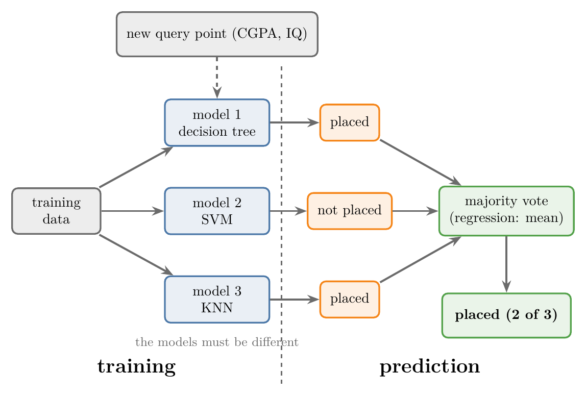
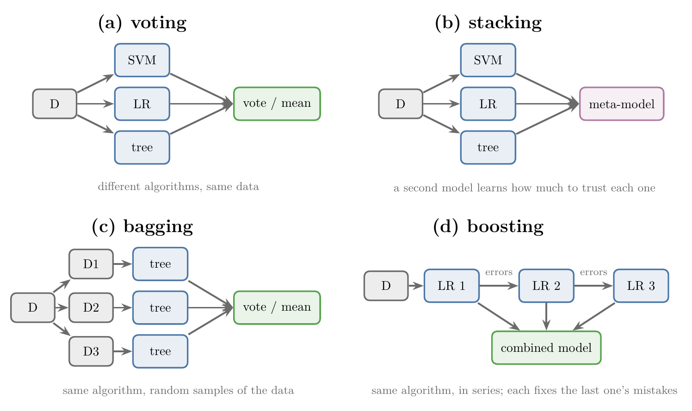
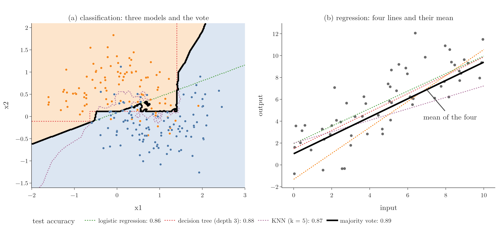

<!-- where-this-fits: generated by course_map/build_map.py; edit concepts.yaml, not this block -->
> **Where this fits:** Pipeline map step 8 (Model). See the [Course map](../01-course-map/note.md).
>
> 
>
> - **Builds on:** Bias-variance trade-off ([Note 62](../62-bias-variance/note.md)); Underfitting ([Note 91](../91-knn/note.md)); Decision trees ([Note 100](../100-dtreeviz/note.md)).
> - **Leads to:** Voting ensembles ([Note 102](../102-voting-ensemble/note.md)); Bagging ([Note 105](../105-bagging-intuition/note.md)); AdaBoost ([Note 115](../115-adaboost-intuition/note.md)); Gradient boosting ([Note 120](../120-gradient-boosting-intuition/note.md)); Stacking and blending ([Note 127](../127-stacking-blending/note.md)).
> - **Compare with:** Bagging ([Note 105](../105-bagging-intuition/note.md)); Stacking and blending ([Note 127](../127-stacking-blending/note.md)).
<!-- /where-this-fits -->

## 1. Overview

> **Key point:** An ensemble trains several different models and combines their answers: a majority vote for classification, a mean for regression. The combined model is usually better than any one of them.

{height=38%}

The word **ensemble** means a group, for example a group of musicians. Ensemble learning (first met in the [MLDLC Note](../09-mldlc/note.md), section 8.4) combines several ML models into one bigger, stronger model (Figure 1).

Ensembles are tried in almost every serious ML project and in almost every Kaggle competition. This Note covers:

- the idea behind ensembles, the wisdom of the crowd;
- how an ensemble predicts, and why its models must differ;
- the four main types: voting, stacking, bagging and boosting (each gets its own Notes later);
- why ensembles work, what they cost, and when to use them.

## 2. The wisdom of the crowd

> **Key point:** The combined judgement of many people is often more accurate than the judgement of any one of them. Ensemble learning applies the same idea to models.

The **wisdom of the crowd** is the observation that a crowd, taken together, often knows the answer better than a single member. We rely on it every day:

- **Audience poll in a quiz show.** In *Kaun Banega Crorepati* (*Who Wants to Be a Millionaire*), a contestant can ask the studio audience. The most popular answer is right most of the time, although no single person in the audience is an expert in everything.
- **Product reviews.** A product rated 4.5 out of 5 by 15,000 buyers feels safe to buy. The same 4.5 from one buyer does not.
- **Film ratings.** An IMDb rating such as 8.5 is the combined opinion of many viewers.
- **Democracy.** Everyone votes, and the party with the most votes wins, because we trust what most people support.
- **Guessing a weight.** At a fair, visitors guessed the weight of an animal on show. Nobody guessed it exactly, but the average of all the guesses was very close to the true weight.

> **Extra:** The weight-guessing story is real. At a fair in Plymouth, England, in 1906, about 800 visitors guessed the weight of an ox. Francis Galton reported that the middle guess (the median) was 1,207 pounds, within 1% of the true 1,198 pounds (Galton 1907). The book *The Wisdom of Crowds* collects many such cases (Surowiecki 2004).

Ensemble learning rests on the same fact: a crowd of models knows more than one model.

## 3. How an ensemble predicts

> **Key point:** Every base model predicts; the ensemble takes the majority vote (classification) or the mean (regression).

Every ML algorithm has two stages: **training**, where it finds the pattern in the data, and **prediction**, where it answers for a new query point (a new **observation**, one record or row of the data table, as in the [KNN Note](../91-knn/note.md)). Each observation has **features** (input variables, one column each) and a **target** (the output we predict). Training differs between the types of ensemble (section 4). Prediction works the same way for all of them.

An ensemble is a collection of smaller models, called **base models**. They can be any algorithms: decision trees, SVMs, KNN, linear regression and so on.

### 3.1 The base models must be different

> **Key point:** A crowd only helps if its members know different things. We make models different by using different algorithms, different data, or both.

Picture the quiz-show audience again. If everyone in it is a software developer, the poll helps with a computer science question and fails on everything else. If the audience mixes an accountant, an engineer, a doctor, a politician and a philosopher, someone is likely to know the answer whatever the topic.

Models are the same: an ensemble of identical models makes the same mistakes as one model. There are three ways to make the base models different:

1. **Different algorithms, same data:** for example a linear model, an SVM and a decision tree, all trained on the full dataset.
2. **Same algorithm, different data:** for example three linear models, each trained on a different part of the data. Different data makes them learn differently.
3. **Both:** different algorithms, each shown different data.

### 3.2 Classification: majority vote

> **Key point:** Each model votes for a class, and the class with the most votes wins.

Take the placement data: from a student's CGPA and IQ, predict *placed* or *not placed* (the [toy project Note](../13-toy-project/note.md)). We have 5 trained base models and one new student.

We give the student's CGPA and IQ to every model. Suppose 3 models say *placed* and 2 say *not placed*. The ensemble answers *placed*: the majority vote, exactly as KNN votes among neighbours (Figure 1 shows the same with 3 models).

### 3.3 Regression: the mean

> **Key point:** Each model predicts a number, and the ensemble returns their average.

Now the task is to predict the package, in lakh rupees per year (LPA), from CGPA and IQ. Every base model is a regression model and outputs a number.

1. **In words:** the ensemble's prediction is the mean of the base models' predictions.
2. **Formula:** with $n$ base models predicting $\hat y_1, \dots, \hat y_n$,
   $$\hat{y} = \frac{1}{n}\sum_{i=1}^{n} \hat y_i$$
3. **Example:** three models predict 6.2, 5.8 and 7.0 LPA:
   $$\hat{y} = \frac{6.2 + 5.8 + 7.0}{3} = \frac{19.0}{3} = 6.33 \text{ LPA}$$

## 4. The four types of ensemble

> **Key point:** Voting and stacking use different algorithms on the same data; bagging and boosting use one algorithm on varied data. They differ in how the models are trained and combined.

{height=50%}

Figure 2 shows the four types. Each one is taught in full in later Notes; here we only meet them.

### 4.1 Voting

> **Key point:** Different algorithms, all trained on the same data; the final answer is the majority vote or the mean.

Take, say, an SVM, a logistic regression and a decision tree, and train all three on the same dataset D. For a new query point, each predicts, and we take the majority (classification) or the mean (regression). The variety comes from the algorithms being different. Voting is the subject of the next three Notes, starting with the [voting ensemble Note](../102-voting-ensemble/note.md).

### 4.2 Stacking

> **Key point:** Voting plus one more model on top, which learns how much weight each base model's opinion deserves.

Stacking starts like voting: different algorithms trained on the same data. Then a further model, the **meta-model** (for example KNN), is trained on the base models' outputs.

Each training observation gives the meta-model one example: what the SVM said, what the logistic regression said, what the tree said, and what the true answer was. For instance, (1, 0, 1) with true answer 1, or (0, 0, 1) with true answer 1.

From such observations the meta-model learns a weight for each base model: more weight to the models that are usually right, less to the ones that often err. In voting every model's vote counts the same, as in a democracy. In stacking, some votes count more than others. Stacking comes last in the ensemble Notes.

### 4.3 Bagging

> **Key point:** One algorithm, many copies, each trained on a different random sample of the observations; the answers are then voted or averaged.

**Bagging** is short for **bootstrap aggregation**. All base models use the same algorithm, for example three SVMs or three logistic regressions. The variety comes from the data.

Suppose the data D has 1,000 students and we decide to show each model 500 of them. We draw 500 observations at random, with replacement (each drawn observation is put back, so the same one can be drawn twice), to make D1 and train model 1 on it. Then we draw another 500 the same way for D2, and so on. Drawing random samples like this is called **bootstrapping**.

The samples differ, so the models learn differently. At prediction time we vote or average as before.

When the base models are decision trees, the bagging ensemble gets its own name: a **random forest**, a "forest" of trees. Strictly, a random forest also picks a random subset of the features at every split (Breiman 2001); the [bagging vs random forest Note](../110-bagging-vs-random-forest/note.md) covers the difference. Bagging is taught in the [bagging Note](../105-bagging-intuition/note.md); random forests in the [random forest Note](../108-random-forest-intro/note.md).

### 4.4 Boosting

> **Key point:** Models are trained one after another; each one concentrates on the mistakes of the one before.

**Boosting** also uses one algorithm, but the models are trained **in series**, not side by side. The first model is trained on the data and notes which observations it got wrong. The next model is told about those observations and pays extra attention to them, fixing some of them.

The second model then passes its own mistakes to the third model, and so on. Down the chain the mistakes shrink, and the combined model makes far fewer than the first. Boosting is the most powerful of the four, and also the most complex; it has several Notes of its own, starting with AdaBoost.

## 5. Why ensembles work

> **Key point:** Each model makes its own random mistakes; combining them cancels much of that noise, leaving a smoother, more reliable answer.

{height=45%}

**Classification.** In Figure 3a, three different models are trained on the same two-moons data (two interlocking half-moon classes):

- **logistic regression** draws a straight line;
- a **decision tree** of depth 3 draws boxes;
- **KNN** with k = 5 draws a wiggly curve.

Each boundary is wrong in its own places. The majority vote (black) follows a boundary where at least two of the three agree, so the quirks of any single model are outvoted. On 200 test points, the three models score 0.860, 0.875 and 0.870; the vote scores **0.890**, better than each.

**Regression.** In Figure 3b, four lines are fitted, each to a different set of 10 random points. One is too steep, one too flat, two are in between. Their mean (black) is not extreme in any direction: it lands in the middle, close to the real trend.

The vote does not always beat the best model; the [voting classifier Note](../103-voting-classifier/note.md) shows a case where it does not. Why and when combining helps is proved with probability in the [voting ensemble Note](../102-voting-ensemble/note.md).

## 6. Costs and benefits

> **Key point:** An ensemble costs more computation. In return it usually gives better performance, lower bias and variance, and more robust results.

### 6.1 The cost: more computation

> **Key point:** Training many models takes longer than training one.

Where we used to train one model, we now train many: tens, hundreds, even thousands. Training and prediction take longer. So an ensemble needs a solid advantage to be worth it, and it has three.

### 6.2 Benefit 1: better performance

> **Key point:** The combined model usually scores better than its base models.

As section 5 showed, combining models usually improves accuracy (classification) or $R^2$ (regression).

### 6.3 Benefit 2: lower bias and variance

> **Key point:** Ensembles can reach low bias and low variance together, which a single model rarely can.

A single model usually trades bias against variance (the [bias-variance Note](../62-bias-variance/note.md)). Ensembles escape the trade-off: bagging takes low-bias models such as deep trees and cuts their variance (the [bagging Note](../105-bagging-intuition/note.md), section 3), while boosting takes simple high-bias models and cuts their bias (the [bagging vs boosting Note](../119-bagging-vs-boosting/note.md)).

### 6.4 Benefit 3: robustness

> **Key point:** The ensemble's performance changes little when the data changes.

A **robust** model keeps performing well when the data it sees changes somewhat. Robustness is closely related to low variance, but it is often listed as a benefit in its own right.

## 7. When to use an ensemble

> **Key point:** Almost always: try one at the end of every project, after cleaning, feature engineering, training and evaluating single models.

There is rarely a reason not to try an ensemble. In a project, it usually comes last: after data cleaning, preprocessing, feature engineering, model building and evaluation, we combine models and check whether the result improves. Most of the time it does.

Ensembles made Kaggle competitions famous, and Kaggle in turn made XGBoost, a boosting algorithm, famous: in 2015, 17 of the 29 winning solutions published on Kaggle's blog used XGBoost (Chen and Guestrin 2016). On small and medium-sized tables of data, tree ensembles often beat deep learning; on very large datasets, deep learning can take the lead. A benchmark on 45 medium-sized tables found tree-based models still ahead of deep networks (Grinsztajn et al. 2022).

The order of the coming Notes: voting, then bagging, then random forests, then boosting, and stacking last.

## 8. Summary

| Type | Base models | Data each model sees | Combined by | Mainly reduces |
|---|---|---|---|---|
| Voting | different algorithms | the same data | majority vote or mean | errors of individual models |
| Stacking | different algorithms | the same data | a meta-model that learns weights | errors of individual models |
| Bagging | one algorithm (random forest: trees) | random samples of the observations | majority vote or mean | variance |
| Boosting | one algorithm, in series | observations weighted toward earlier mistakes | weighted combination | bias |

- An ensemble combines several base models: majority vote for classification, mean for regression.
- The base models must differ: different algorithms, different data, or both.
- Ensembles cost more computation but usually improve performance, lower bias and variance, and are more robust.
- On two-moons data, three models scoring 0.860 to 0.875 give a vote scoring 0.890.

## 9. Sources

- **Breiman 2001:** L. Breiman, "Random Forests", *Machine Learning* 45, 5–32, 2001.
- **Chen and Guestrin 2016:** T. Chen and C. Guestrin, "XGBoost: A Scalable Tree Boosting System", *Proceedings of KDD 2016*, 785–794. arxiv.org/abs/1603.02754
- **Galton 1907:** F. Galton, "Vox Populi", *Nature* 75, 450–451, 1907.
- **Grinsztajn et al. 2022:** L. Grinsztajn, E. Oyallon and G. Varoquaux, "Why do tree-based models still outperform deep learning on typical tabular data?", NeurIPS 2022 Datasets and Benchmarks Track.
- **Surowiecki 2004:** J. Surowiecki, *The Wisdom of Crowds*, Doubleday, 2004.

## 10. Key terms

| Term | Meaning |
|---|---|
| Wisdom of the crowd | The combined judgement of many is often more accurate than any one member's |
| Base model | One of the models inside an ensemble |
| Meta-model | The model in stacking that is trained on the base models' predictions |
| Robustness | Performing well even when the data changes somewhat |
