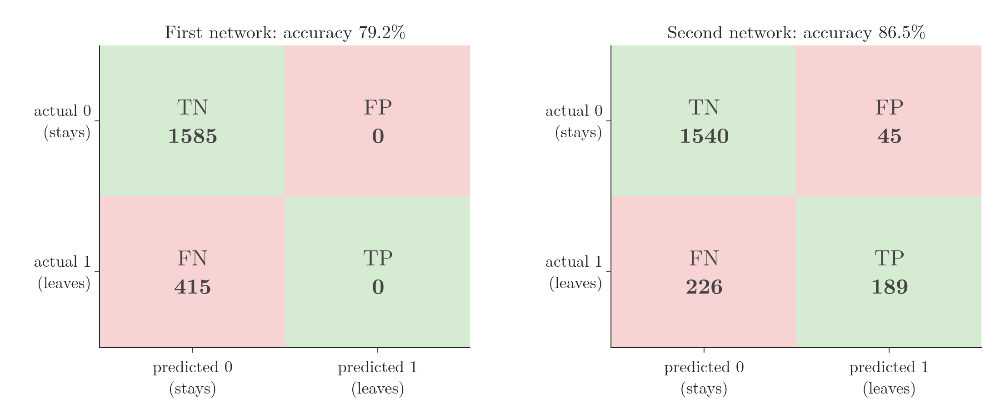

<!-- where-this-fits: generated by course_map/build_map.py; edit concepts.yaml, not this block -->
> **Where this fits:** Pipeline map steps 8 (Model), 9 (Evaluate). See the [Course map](../01-course-map/note.md).
>
> 
>
> - **Builds on:** Standardization ([Note 24](../24-standardization/note.md)); One-hot encoding ([Note 27](../27-one-hot-encoding/note.md)); Log loss (binary cross entropy) ([Note 73](../73-log-loss/note.md)); Confusion matrix ([Note 76](../76-accuracy-confusion-matrix/note.md)); Softmax regression ([Note 79](../79-softmax-regression/note.md)); Overfitting ([Note 91](../91-knn/note.md)).
> - **Leads to:** ANN for regression ([Note 1013](../1013-graduate-admission-ann/note.md)).
> - **Compare with:** K-nearest neighbours ([Note 91](../91-knn/note.md)); ANN for regression ([Note 1013](../1013-graduate-admission-ann/note.md)).
<!-- /where-this-fits -->

## 1. Overview

> **Key point:** We build, train and improve our first neural network in Keras, on real bank data: which customers will leave the bank?

The Notes so far built the multi-layer perceptron (MLP) on paper: how it is organised (see the [MLP notation Note](../1008-mlp-notation/note.md)), why it can draw curved boundaries (see the [MLP intuition Note](../1009-mlp-intuition/note.md)) and how it predicts (see the [forward propagation Note](../1010-forward-propagation/note.md)). How it *learns* its weights is backpropagation, the subject of later Notes. Before that theory, three small projects show a network being built, trained and used in code:

| Project | Problem type | This Note? |
|---|---|---|
| Customer churn | Binary classification | yes |
| Handwritten digits (MNIST) | Multi-class classification | [MNIST Note](../1012-mnist-ann/note.md) |
| Graduate admissions | Regression | [graduate admission Note](../1013-graduate-admission-ann/note.md) |

The goal is not the best possible model. It is to see every step of a Keras project once, so that the training theory has something concrete to attach to.


Figure 1 shows the steps. Preparing the data is the same as in the [toy project Note](../13-toy-project/note.md); the four Keras steps (build, compile, fit, predict) are new. The Notebook (`notebook.ipynb`) runs every step.

## 2. The churn data

> **Key point:** 10,000 bank customers, 13 possible inputs and one output, `Exited`: 1 if the customer left the bank.

**Churn** means customers leaving a service (see the [framing an ML problem Note](../14-framing-ml-problem/note.md)). Banks, phone companies and streaming services all try to predict it, so that they can act before a customer goes. Our data holds 10,000 customers of one bank, 14 columns each:

| Column | Meaning |
|---|---|
| RowNumber, CustomerId, Surname | Identifiers |
| CreditScore | How creditworthy the customer is |
| Geography | France, Germany or Spain |
| Gender | Male or Female |
| Age | Age in years |
| Tenure | Years with the bank |
| Balance | Account balance |
| NumOfProducts | Number of bank products used (cards, deposits, funds, ...) |
| HasCrCard | 1 if the customer has a credit card |
| IsActiveMember | 1 if the customer uses the account actively |
| EstimatedSalary | The bank's estimate of the yearly salary |
| Exited | **Output:** 1 if the customer left, 0 if not |

> **Extra:** The file is `Churn_Modelling.csv` (10,000 rows, 685 KB), published on Kaggle as a bank churn dataset; the copy in `data/` is the full file.

> **Python:** Loading and checking the data.
>
> ```python
> import pandas as pd
>
> df = pd.read_csv("data/Churn_Modelling.csv")
> df.shape                     # (10000, 14)
> df.info()                    # no missing values
> df.duplicated().sum()        # 0 duplicated rows
> df["Exited"].value_counts()  # 0: 7963, 1: 2037
> ```

The checks find no missing values and no duplicated rows. About 8,000 customers stayed and 2,000 left, so the classes are imbalanced, 4 to 1. That matters for reading accuracy, as Section 6 shows (see also the [imbalanced data Note](../133-imbalanced-data/note.md)).

The two text columns are balanced enough: France 5,014, Germany 2,509, Spain 2,477; male 5,457, female 4,543.

## 3. Preparing the inputs

> **Key point:** Drop the three identifier columns, one-hot encode Geography and Gender, split 80/20, then standardize.

### 3.1 Dropping and encoding

> **Key point:** Identifiers carry no pattern; text columns become 0/1 columns.

RowNumber, CustomerId and Surname identify a customer but say nothing about whether they will leave, so we drop them. A careful project would first check every other column with exploratory analysis; here we keep the remaining ten.

A network only takes numbers, so Geography and Gender are one-hot encoded with `get_dummies` and `drop_first=True` (see the [one-hot encoding Note](../27-one-hot-encoding/note.md), section 6). Geography becomes two columns, `Geography_Germany` and `Geography_Spain` (France is 0, 0), and Gender becomes one, `Gender_Male` (female is 0). That leaves 11 input columns.

> **Python:** Dropping and encoding.
>
> ```python
> df = df.drop(columns=["RowNumber", "CustomerId", "Surname"])
> df = pd.get_dummies(df, columns=["Geography", "Gender"],
>                     drop_first=True, dtype=int)
> ```
>
> Since pandas 2, `get_dummies` writes `True`/`False`; `dtype=int` gives 0/1 instead.

### 3.2 Splitting and scaling

> **Key point:** 8,000 customers to train on, 2,000 to test; every column standardized with the training set's mean and spread.

We separate X (11 columns) from y (`Exited`) and split 80/20 with `train_test_split`, as in the [toy project Note](../13-toy-project/note.md). This leaves 8,000 training rows and 2,000 test rows.

The columns live on very different scales: Balance and EstimatedSalary run to six digits, NumOfProducts is 1 to 4. With such inputs the weights take much longer to settle during training (the forward propagation Note shows what raw inputs do to a sigmoid, in section 2). So before a network sees any data we **standardize** every column to mean 0, standard deviation 1 (see the [standardization Note](../24-standardization/note.md)).

> **Python:** Split, then scale.
>
> ```python
> from sklearn.model_selection import train_test_split
> from sklearn.preprocessing import StandardScaler
>
> X = df.drop(columns="Exited")
> y = df["Exited"]
> X_train, X_test, y_train, y_test = train_test_split(
>     X, y, test_size=0.2, random_state=1)
>
> scaler = StandardScaler()
> X_train_scaled = scaler.fit_transform(X_train)
> X_test_scaled = scaler.transform(X_test)
> ```

## 4. Building a network in Keras

> **Key point:** A `Sequential` model is a stack of layers; each `Dense` layer is a row of perceptrons connected to every node of the layer before.

**Keras** is the high-level interface of TensorFlow for defining and training networks (see the [deep learning scope Note](../1001-dl-scope-and-prerequisites/note.md)). Keras has two ways to build a model:

- **Sequential model:** layers stacked one after the other, each feeding the next. Every MLP is of this kind.
- **Functional (non-sequential) model:** layers wired in any pattern, for example with branches. It comes in later Notes.

### 4.1 The first architecture

> **Key point:** 11 inputs, one hidden layer of 3 sigmoid nodes, one sigmoid output node.

We start small: an input layer of 11 nodes, one per column; a hidden layer of 3 perceptrons; and an output layer of 1 perceptron. All of them use the sigmoid activation, so the output is the probability that the customer leaves. Figure 2(a) shows this 11-3-1 network.


A **dense layer** (also **fully connected layer**) is a layer in which every node receives the output of every node in the layer before. Every layer of an MLP is dense, so in Keras each one is a `Dense`.

> **Python:** Building the 11-3-1 network.
>
> ```python
> import keras
> from keras import layers
>
> model = keras.Sequential([
>     keras.Input(shape=(11,)),               # 11 input columns
>     layers.Dense(3, activation="sigmoid"),  # hidden layer
>     layers.Dense(1, activation="sigmoid"),  # output layer
> ])
> ```
>
> `Dense(3, ...)` is a layer of 3 nodes. `keras.Input(shape=(11,))` tells the first layer how many inputs each row has; Keras works out the inputs of every later layer by itself.

> **Extra:** Older code passes the input size to the first layer, `Dense(3, activation="sigmoid", input_dim=11)`, and imports from `tensorflow.keras`. Keras 3 drops `input_dim`: we write `keras.Input` as the first item instead and `import keras` directly.

### 4.2 Counting the parameters with summary

> **Key point:** `model.summary()` lists each layer and its trainable parameters: 36 + 4 = 40.

`model.summary()` prints one line per layer. Keras does not list the input layer, because it has no parameters:

| Layer | Output shape | Param # |
|---|---|---|
| dense (Dense) | (None, 3) | 36 |
| dense_1 (Dense) | (None, 1) | 4 |
| **Total** | | **40** |

The counts follow the rule of the [MLP notation Note](../1008-mlp-notation/note.md): one weight per pair of connected nodes, one bias per node. Into the hidden layer, $11 \times 3 + 3 = 36$; into the output, $3 \times 1 + 1 = 4$. Training must find these 40 numbers. `None` in the output shape stands for the number of rows, which can be anything.

## 5. Compiling and training

> **Key point:** `compile` chooses the loss and the optimizer; `fit` runs the training for a set number of epochs and prints the loss after each.

### 5.1 Compile: loss and optimizer

> **Key point:** Two classes and a sigmoid output: the loss is binary cross-entropy. The optimizer is Adam.

Compiling tells Keras how the model will be trained. Two settings are needed:

- **Loss:** the number that training makes smaller. For two classes with a sigmoid output it is binary cross-entropy, also called log loss (see the [log loss Note](../73-log-loss/note.md) and the [perceptron loss Note](../1006-perceptron-loss/note.md), section 8).
- **Optimizer:** the method that updates the weights to reduce the loss, a variant of gradient descent. We use **Adam**, which usually works well; optimizers are taught in later Notes.

> **Python:** Compiling.
>
> ```python
> model.compile(loss="binary_crossentropy", optimizer="adam")
> ```

### 5.2 Fit: epochs

> **Key point:** One epoch is one pass over all 8,000 training customers; after 10 epochs the loss fell from 0.71 to 0.43.

`fit` does the training. We give it the scaled training inputs, the training outputs and the number of **epochs**: how many times the network goes through the whole training set (see the [gradient descent Note](../57-gradient-descent/note.md)). We choose 10.

> **Python:** Training for 10 epochs.
>
> ```python
> history1 = model.fit(X_train_scaled, y_train, epochs=10)
> ```

Keras prints one line per epoch. The loss falls quickly at first, then more slowly:

| Epoch | 1 | 2 | 3 | 5 | 10 |
|---|---|---|---|---|---|
| Loss | 0.713 | 0.569 | 0.502 | 0.455 | 0.430 |

> **Extra:** Each epoch line also shows `250/250`. Keras does not update the weights once per epoch: by default it updates them after every **batch** of 32 rows, which is mini-batch gradient descent (see the [mini-batch gradient descent Note](../60-mini-batch-gradient-descent/note.md)). 8,000 rows / 32 = 250 updates per epoch. The `batch_size` argument of `fit` changes this.

### 5.3 Where the weights are stored

> **Key point:** Each layer keeps its weight matrix and its bias vector; `get_weights()` returns them.

After training, the 40 parameters live inside the model, one layer at a time. `model.layers[0]` is the hidden layer, `model.layers[1]` the output layer.

> **Python:** Reading the trained weights.
>
> ```python
> W1, b1 = model.layers[0].get_weights()
> W1.shape, b1.shape      # (11, 3), (3,)
> W2, b2 = model.layers[1].get_weights()
> W2.ravel(), b2          # [-0.734 -1.314 0.572], [-0.571]
> ```

The weight matrix has one row per input node and one column per receiving node, exactly the $W^{1}$ of the [forward propagation Note](../1010-forward-propagation/note.md). Its $11 \times 3 = 33$ weights plus 3 biases are the 36 of the summary.

## 6. Predicting and measuring accuracy

> **Key point:** `predict` gives probabilities; a threshold of 0.5 turns them into 0 or 1, and accuracy compares those with the true labels.

### 6.1 From probabilities to classes

> **Key point:** Above 0.5 means "will leave" (1); 0.5 or below means "stays" (0).

`model.predict` runs forward propagation on every test row. Because the output node uses a sigmoid, each answer is a probability between 0 and 1, not a class: the first five test customers get 0.128, 0.146, 0.135, 0.113 and 0.102.

To get a class we pick a **threshold**: a probability above it means 1, at or below it means 0. We use 0.5.

> **Python:** Predicting and thresholding.
>
> ```python
> import numpy as np
> from sklearn.metrics import accuracy_score
>
> y_log = model.predict(X_test_scaled)        # probabilities
> y_pred = np.where(y_log > 0.5, 1, 0)        # classes
> accuracy_score(y_test, y_pred)              # 0.7925
> ```
>
> `np.where(condition, a, b)` gives `a` where the condition holds and `b` elsewhere.

> **Extra:** 0.5 is only the default. The best threshold for a problem can be found from the ROC curve (see the [ROC and AUC Note](../78-roc-auc/note.md)); a bank that would rather contact too many customers than miss leavers might choose a lower one.

### 6.2 Why 79% means nothing here

> **Key point:** 79.25% is exactly the share of customers who stay: the first network predicts "stays" for everyone.

The first network scores 79.25% accuracy on the 2,000 test customers. But 1,585 of them, 79.25%, stayed. A "model" that answers 0 for every customer scores the same.



Figure 3 (left) confirms it: the first network predicted "leaves" for nobody. After 10 epochs its probabilities run from 0.069 to 0.498: even the most likely leaver falls just short of the 0.5 threshold. This is the trap of accuracy on imbalanced data, described in section 6 of the [accuracy and confusion matrix Note](../76-accuracy-confusion-matrix/note.md). The confusion matrix shows it at once; accuracy alone hides it.

> **Extra:** The exact result depends on the random starting weights, so another run can flag a few leavers and score slightly higher. Either way, a network this small, trained for 10 epochs, has barely learned the pattern.

## 7. Improving the network

> **Key point:** Four things to try: more epochs, ReLU in the hidden layers, more nodes per hidden layer, more hidden layers.

### 7.1 Four changes

> **Key point:** Each change gives the network more time or more capacity; too much capacity leads to overfitting.

A first network is rarely the best one. We experiment with:

1. **More epochs:** more passes over the data, more time to find good weights. We go from 10 to 100.
2. **ReLU in the hidden layers:** hidden layers with the ReLU activation usually train better than sigmoid ones (see the [MLP intuition Note](../1009-mlp-intuition/note.md), section 5). The output stays sigmoid, since we still want a probability. Activation functions get their own Notes later.
3. **More nodes per hidden layer:** 11 instead of 3.
4. **More hidden layers:** two instead of one.

Changes 3 and 4 add parameters, so the network can fit more complex patterns. Too many, and it starts to memorise the training rows instead of learning the pattern: **overfitting** (see the [challenges in ML Note](../07-challenges-in-ml/note.md) and the [bias-variance Note](../62-bias-variance/note.md)). Finding the right size takes experiments.

### 7.2 The second architecture

> **Key point:** 11-11-11-1 with ReLU: 132 + 132 + 12 = 276 parameters.

Figure 2(b) shows the new network. Counting its parameters:

1. **In words:** for each layer, weights from every node before plus one bias per node.
2. **Formula:** $n_{l-1}\, n_l + n_l$ per layer, added up.
3. **Example:**
   $$(11 \times 11 + 11) + (11 \times 11 + 11) + (11 \times 1 + 1) = 132 + 132 + 12 = 276$$

`model.summary()` prints the same 276.

> **Python:** The second network.
>
> ```python
> model2 = keras.Sequential([
>     keras.Input(shape=(11,)),
>     layers.Dense(11, activation="relu"),
>     layers.Dense(11, activation="relu"),
>     layers.Dense(1, activation="sigmoid"),
> ])
> ```

### 7.3 Tracking accuracy and a validation set

> **Key point:** `metrics=["accuracy"]` reports accuracy every epoch; `validation_split=0.2` holds back 20% of the training rows and reports the loss and accuracy on them too.

Two additions make training easier to watch:

- **`metrics=["accuracy"]`** in `compile`: Keras reports the accuracy after each epoch, next to the loss. A **metric** is only reported; training does not minimise it.
- **`validation_split=0.2`** in `fit`: Keras sets aside 20% of the 8,000 training rows as a **validation set** (see the [OOB score Note](../113-oob-score/note.md)). It trains on the other 6,400 and, after each epoch, measures the loss and accuracy on the 1,600 it never trains on.

> **Python:** Compiling and training with both.
>
> ```python
> model2.compile(loss="binary_crossentropy", optimizer="adam",
>                metrics=["accuracy"])
> history = model2.fit(X_train_scaled, y_train, epochs=100,
>                      validation_split=0.2)
> ```

Each epoch line now has four numbers. For the last epoch:

| loss | accuracy | val_loss | val_accuracy |
|---|---|---|---|
| 0.325 | 0.864 | 0.359 | 0.853 |

We want the loss to fall and the accuracy to rise on **both** sets. If the training accuracy keeps rising while the validation accuracy stalls or falls, the network is overfitting. Here training (86.4%) is a little ahead of validation (85.3%): a slight gap.

> **Extra:** `validation_split` takes the **last** 20% of the rows, not a random 20%. Our rows were already shuffled by `train_test_split`, so that is fine; on data sorted by date or by class, shuffle first or pass `validation_data=(X_val, y_val)` instead.

On the test set the second network scores **86.45%**, against 79.25%. Figure 3 (right) shows what changed: it now finds 189 of the 415 customers who left, while wrongly flagging only 45 who stayed.

## 8. Training curves

> **Key point:** `fit` returns a History object: the loss and accuracy of every epoch, on both sets. Plotting them shows how training went and whether it overfits.

`fit` returns a **History** object. Its `.history` attribute is a dictionary with one list per quantity, one value per epoch: `loss`, `accuracy`, `val_loss` and `val_accuracy`. Plotting these lists against the epoch number gives the **training curves** (also **learning curves**) in Figure 4.


Reading Figure 4:

- **Loss (left):** both losses fall fast for about 10 epochs, then slowly. The training loss keeps falling to the end; the validation loss is lowest around epoch 40 (0.355) and then creeps up to 0.359.
- **Accuracy (right):** both rise together at first; after about 20 epochs training accuracy stays roughly 1 point above validation accuracy.

The gap between the two curves measures overfitting. Here it is small, but it is opening: more epochs would not help. Techniques that close such a gap (regularization, dropout, stopping training early) come in later Notes.

> **Python:** Plotting the curves with Plotly.
>
> ```python
> import plotly.graph_objects as go
>
> h = history.history
> fig = go.Figure()
> fig.add_scatter(y=h["loss"], name="training loss")
> fig.add_scatter(y=h["val_loss"], name="validation loss")
> fig.show()
> ```

## 9. Summary

| Step | First network | Second network |
|---|---|---|
| Architecture | 11-3-1 | 11-11-11-1 |
| Hidden activation | sigmoid | ReLU |
| Parameters | 40 | 276 |
| Epochs | 10 | 100, with 20% validation |
| Test accuracy | 79.25% (predicts "stays" for all) | 86.45% |

- Prepare as usual: drop identifiers, one-hot encode, split, standardize.
- Keras: `Sequential` + `Dense` layers, `summary`, `compile` (loss, optimizer, metrics), `fit` (epochs, validation split), `predict`.
- Binary classification: one sigmoid output node, binary cross-entropy loss, threshold 0.5 on the probability.
- On imbalanced data, compare accuracy with always predicting the majority class, and look at the confusion matrix.
- Improve by changing epochs, activation, nodes and layers; watch the training curves for a gap that signals overfitting.

## 10. Key terms

| Term | Meaning |
|---|---|
| Keras workflow | Build, compile, fit, predict: the four steps of every Keras model |
| Sequential model | A Keras model whose layers form one stack, each feeding the next |
| Dense (fully connected) layer | A layer whose every node receives the output of every node in the layer before |
| `keras.Input` | The first item of a Sequential model; gives the shape of one input row |
| `model.summary()` | Prints each layer's output shape and number of trainable parameters |
| Compile | Choosing the loss, the optimizer and the metrics before training |
| Adam | The optimizer used in these projects; optimizers are taught later |
| `fit` | Trains the model on given inputs and outputs for a number of epochs |
| Batch | The rows used for one weight update; Keras uses 32 by default |
| `get_weights()` | Returns a layer's weight matrix and bias vector |
| Threshold (classification) | The probability above which a prediction counts as class 1 |
| Metric | A score reported during training, such as accuracy, that training does not minimise |
| `validation_split` | The share of the training rows Keras holds back as a validation set |
| History object | What `fit` returns: the loss and metrics of every epoch |
| Training curves (learning curves) | Loss or accuracy plotted against the epoch, for the training and validation sets |
