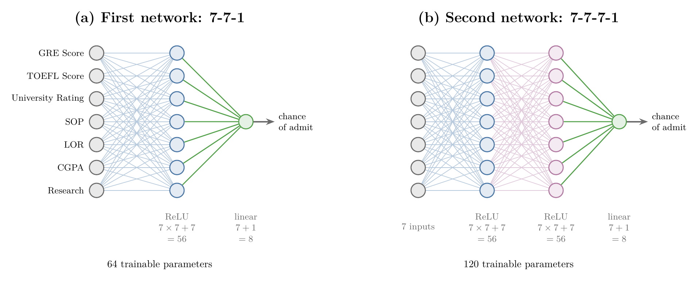
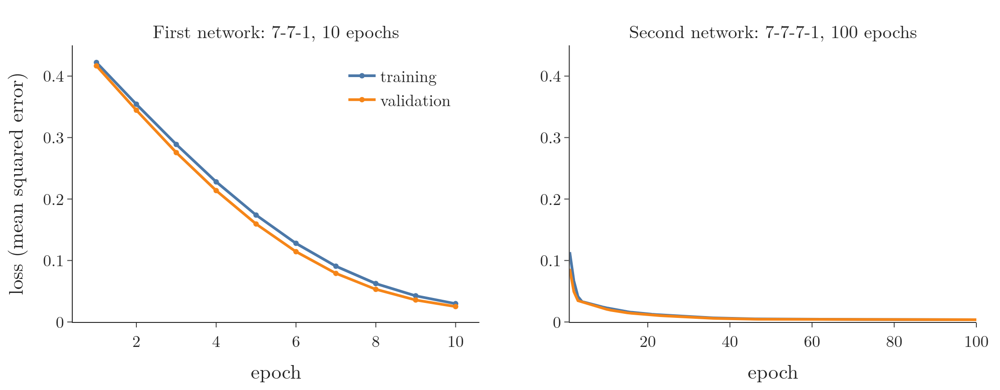

<!-- where-this-fits: generated by course_map/build_map.py; edit concepts.yaml, not this block -->
> **Where this fits:** Pipeline map steps 8 (Model), 9 (Evaluate). See the [Course map](../01-course-map/note.md).
>
> 
>
> - **Builds on:** Normalization ([Note 25](../25-normalization/note.md)); Regression metrics ([Note 52](../52-regression-metrics/note.md)); Overfitting ([Note 91](../91-knn/note.md)); Multi-layer perceptron (MLP) ([Note 1009](../1009-mlp-intuition/note.md)).
> - **Leads to:** Vanishing gradient ([Note 1018](../1018-vanishing-exploding-gradients/note.md)); Early stopping ([Note 1021](../1021-improving-a-neural-network/note.md)).
> - **Compare with:** Multiple linear regression ([Note 55](../55-multiple-lr-code/note.md)); ANN for classification ([Note 1012](../1012-mnist-ann/note.md)).
<!-- /where-this-fits -->

## 1. Overview

> **Key point:** For regression, a network ends in one node with a linear activation and is trained with mean squared error; everything else is the same Keras workflow.

The [customer churn Note](../1011-customer-churn-ann/note.md) and the [MNIST Note](../1012-mnist-ann/note.md) used networks for classification, with two and with ten classes. Here the output is a **number**: a student's chance of admission to a graduate programme, between 0 and 1. Predicting a number is **regression**.

The Keras workflow is unchanged: prepare, build, compile, fit, predict (Figure 1 of the churn Note). Three things are new:

1. **Output layer:** one node with the **linear** activation, so it can give any number.
2. **Loss:** **mean squared error**.
3. **Score:** **R²** instead of accuracy.

The goal is to see a network solve a regression problem, not to build the best model. The Notebook (`notebook.ipynb`) runs every step.

## 2. The graduate admission data

> **Key point:** 500 students, 7 inputs (test scores, ratings, CGPA, research) and one output: the chance of admission, between 0 and 1.

Students applying to universities abroad take the **GRE** and **TOEFL** exams and send a profile with a **statement of purpose (SOP)** and **letters of recommendation (LOR)**. The data holds 500 such students:

| Column | Meaning | Range |
|---|---|---|
| Serial No. | Row number | 1 to 500 |
| GRE Score | Graduate Record Examination score | up to 340 |
| TOEFL Score | English test score | up to 120 |
| University Rating | Rating of the student's undergraduate university | 1 to 5 |
| SOP | Strength of the statement of purpose: an essay on why the student wants the programme | 1 to 5 |
| LOR | Strength of the letters of recommendation, usually from professors | 1 to 5 |
| CGPA | Undergraduate grade average | up to 10 |
| Research | 1 if the student has research experience | 0 or 1 |
| Chance of Admit | **Output:** chance of admission | 0 to 1 |

> **Extra:** The file is `Admission_Predict_Ver1.1.csv` (500 rows, 16 KB) from the Graduate Admission 2 dataset on Kaggle. An older version, `Admission_Predict.csv`, has only the first 400 rows; we use the newer one. Two column names end in a stray space (`"LOR "`, `"Chance of Admit "`); the Notebook strips them.

> **Python:** Loading and checking the data.
>
> ```python
> import pandas as pd
>
> df = pd.read_csv("data/Admission_Predict_Ver1.1.csv")
> df.columns = df.columns.str.strip()  # remove stray spaces
> df.shape                # (500, 9)
> df.info()               # no missing values
> df.duplicated().sum()   # 0
> ```

There are no missing values and no duplicated rows, and every column is already numeric. The chance of admission averages 0.72 and runs from 0.34 to 0.97.

## 3. Preparing the inputs

> **Key point:** Drop the serial number, split 80/20, and min-max scale the 7 inputs, because every column has a known upper and lower limit.

The serial number is a row label with no pattern in it, so we drop it. The other 7 columns are the inputs, and `Chance of Admit` is the output. A test size of 0.2 gives 400 training and 100 test students.

The inputs differ widely in size: a GRE score of 337 sits next to an SOP rating of 4.5. As in the other two projects, unequal scales slow training down, so we scale. This time we use **min-max scaling** rather than standardization: it is the usual choice when every column has a known minimum and maximum (see the [normalization Note](../25-normalization/note.md), section 10). GRE stops at 340, TOEFL at 120, the ratings at 5, so every column is bounded. Each column then runs from 0 to 1.

> **Python:** Splitting and min-max scaling.
>
> ```python
> from sklearn.model_selection import train_test_split
> from sklearn.preprocessing import MinMaxScaler
>
> df = df.drop(columns="Serial No.")
> X = df.iloc[:, 0:-1]     # all columns but the last
> y = df.iloc[:, -1]       # the last column
> X_train, X_test, y_train, y_test = train_test_split(
>     X, y, test_size=0.2, random_state=1)
>
> scaler = MinMaxScaler()
> X_train_scaled = scaler.fit_transform(X_train)
> X_test_scaled = scaler.transform(X_test)
> ```

## 4. The regression network

> **Key point:** 7 inputs, a hidden layer of 7 ReLU nodes, and one output node with the linear activation: 64 parameters.

### 4.1 The linear output node

> **Key point:** A linear output passes its weighted sum through unchanged, so the network can predict any number.

In classification the output node squeezes its weighted sum into a probability with a sigmoid or softmax. In regression we want the number itself, so the output node uses the **linear activation**: it returns its input unchanged, $f(z) = z$. With a linear output and the mean squared error loss, a single perceptron is linear regression (see the [perceptron loss Note](../1006-perceptron-loss/note.md), section 8).

The rule: **for regression, the output layer has one node per number to predict, with the linear activation.** Hidden layers keep a non-linear activation such as ReLU; otherwise the whole network would collapse into one linear model (see the [MLP intuition Note](../1009-mlp-intuition/note.md), section 3.4).

> **Extra:** A linear output is not limited to 0 to 1, and in our results a few predictions come out slightly above 1 (up to 1.01). Since the target here is a proportion, a sigmoid output node would keep every prediction inside 0 to 1. The linear output is the general rule because most regression targets, such as prices or temperatures, have no such limit.

### 4.2 The first architecture

> **Key point:** $7 \times 7 + 7 = 56$ into the hidden layer, $7 + 1 = 8$ into the output: 64 in total.



Figure 1(a) shows the first network. The input layer has 7 nodes, one per column; the hidden layer has 7 ReLU nodes; the output layer has 1 linear node. Counting with the rule of the [MLP notation Note](../1008-mlp-notation/note.md):

$$(7 \times 7 + 7) + (7 \times 1 + 1) = 56 + 8 = 64$$

`model.summary()` prints the same 56, 8 and 64.

> **Python:** Building the network.
>
> ```python
> import keras
> from keras import layers
>
> model = keras.Sequential([
>     keras.Input(shape=(7,)),
>     layers.Dense(7, activation="relu"),
>     layers.Dense(1, activation="linear"),
> ])
> ```
>
> `activation="linear"` is also the default: a `Dense` layer with no activation given is linear.

## 5. Compiling, training and scoring

> **Key point:** Mean squared error as the loss, Adam as the optimizer, 10 epochs; the result is an R² of about 0, no better than predicting the average.

### 5.1 Mean squared error as the loss

> **Key point:** The loss is the average squared difference between the predicted and the true chance.

For regression the usual loss is **mean squared error (MSE)**: the average of the squared differences between the true and the predicted values (see the [regression metrics Note](../52-regression-metrics/note.md), section 3). It is the same quantity linear regression minimises. No accuracy metric is added, since there are no classes to count.

> **Python:** Compiling and training.
>
> ```python
> model.compile(loss="mean_squared_error", optimizer="adam")
> history1 = model.fit(X_train_scaled, y_train, epochs=10,
>                      validation_split=0.2)
> ```
>
> The loss is named `"mean_squared_error"` (or `"mse"`); a wrong name such as `"mean_squared_loss"` raises an error.

### 5.2 Scoring with R²

> **Key point:** R² compares the model's squared error with that of always predicting the average; the first network scores $-0.06$.

`model.predict` returns one number per test student, the predicted chance. We score the predictions with **R²** (see the [regression metrics Note](../52-regression-metrics/note.md), section 6): 1 means perfect, 0 means no better than predicting the average for everyone.

> **Python:** Predicting and scoring.
>
> ```python
> from sklearn.metrics import r2_score
>
> y_pred = model.predict(X_test_scaled)
> r2_score(y_test, y_pred)     # -0.055
> ```

The first network scores **$R^2 = -0.06$**: worse than predicting the average 0.725 for every student. In numbers, its mean squared error on the test set is 0.0204, while always predicting the average gives 0.0193, and $1 - 0.0204 / 0.0193 = -0.06$.

Figure 2 (left) shows why: after 10 epochs the loss is still falling steeply. The network simply has not finished learning.



## 6. Improving the network

> **Key point:** One more hidden layer and 100 epochs instead of 10 raise R² from $-0.06$ to 0.80.

Two changes, as in the other projects:

1. **More epochs:** 100 instead of 10, so the weights have time to settle.
2. **One more hidden layer** of 7 ReLU nodes (Figure 1(b)): $56 + 56 + 8 = 120$ parameters.

> **Python:** The second network.
>
> ```python
> model2 = keras.Sequential([
>     keras.Input(shape=(7,)),
>     layers.Dense(7, activation="relu"),
>     layers.Dense(7, activation="relu"),
>     layers.Dense(1, activation="linear"),
> ])
> model2.compile(loss="mean_squared_error", optimizer="adam")
> history = model2.fit(X_train_scaled, y_train, epochs=100,
>                      validation_split=0.2)
> ```

The test R² rises to **0.80**. Figure 2 (right) shows the loss falling fast in the first few epochs and then levelling off near 0.004. The training and validation losses stay together all the way (0.0037 and 0.0037 at the end): the network is **not overfitting**. A few more epochs might lower the loss a little further.


Figure 3 shows the difference on the test students. The first network's predictions scatter widely around the dashed line of perfect predictions; the second network's hug it, with a few misses among students with a low chance.

> **Extra:** On this small table of 400 rows, plain linear regression on the same scaled inputs scores $R^2 = 0.82$, slightly better than our network (see the [multiple linear regression Note](../53-multiple-linear-regression/note.md)). The relationship here is close to linear, and a network needs much data and tuning before its extra flexibility pays off. Deep learning shines on large data and on images, text and sound, not necessarily on small tables (see the [what is deep learning Note](../1002-what-is-deep-learning/note.md), section 4).

## 7. Summary

The three projects side by side:

| | Churn | MNIST | Admission |
|---|---|---|---|
| Problem | binary classification | multi-class classification | regression |
| Scaling | standardization | divide by 255 | min-max |
| Output layer | 1 node, sigmoid | 10 nodes, softmax | 1 node, linear |
| Loss | binary cross-entropy | sparse categorical cross-entropy | mean squared error |
| From output to answer | probability > 0.5 | argmax | the number itself |
| Score | accuracy 86.45% | accuracy 97.63% | R² 0.80 |

- Regression output: one node per predicted number, linear activation; hidden layers stay non-linear (ReLU).
- Loss for regression: mean squared error; score with R² instead of accuracy.
- Min-max scaling suits inputs with known limits, such as exam scores.
- A network that stops too early can score below 0 in R²: worse than predicting the average. More epochs and a little more capacity fixed it.
- Training and validation losses that stay together mean no overfitting.

## 8. Key terms

| Term | Meaning |
|---|---|
| Linear activation | $f(z) = z$: the node outputs its weighted sum unchanged; used in the output layer for regression |
| Regression output layer | One node per predicted number, with the linear activation |
| Mean squared error loss | The loss for regression in Keras: the average squared difference between true and predicted values |
| GRE, TOEFL | Exams taken by students applying to graduate programmes abroad; the first two inputs of the admission data |
