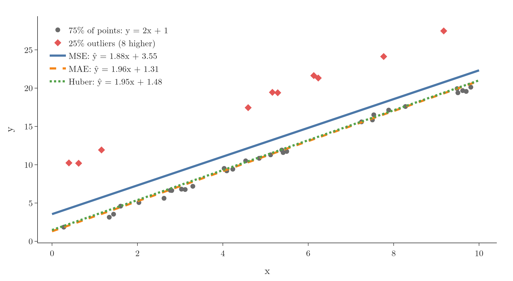

<!-- where-this-fits: generated by course_map/build_map.py; edit concepts.yaml, not this block -->
> **Where this fits:** Pipeline map step 8 (Model). See the [Course map](../01-course-map/note.md).
>
> 
>
> - **Builds on:** One-hot encoding ([Note 27](../27-one-hot-encoding/note.md)); Softmax regression ([Note 79](../79-softmax-regression/note.md)); Forward propagation ([Note 1010](../1010-forward-propagation/note.md)).
> - **Leads to:** Backpropagation ([Note 1015](../1015-backpropagation-what/note.md)).
> - **Compare with:** Regression metrics ([Note 52](../52-regression-metrics/note.md)); Hinge loss and soft margin ([Note 94](../94-svm-soft-margin/note.md)); Entropy, information gain and Gini ([Note 97](../97-decision-trees-intuition/note.md)).
<!-- /where-this-fits -->

## 1. Overview

> **Key point:** A loss function scores how wrong the network is on one **observation** (one record, one row of the data table). Training changes the weights and biases until that score is as small as possible. Which loss we use depends on the problem, and it fixes the activation of the output layer.

A [loss function](../73-log-loss/note.md) measures how wrong a model's predictions are. The loss is a function of the model's parameters: change any weight or bias, and the loss changes (see the [convex and non-convex cost functions Note](../590-convex-and-non-convex-cost-functions/note.md), section 2). A large loss means the model is doing badly; a small one means it is doing well.

{height=38%}

Figure 1 groups the loss functions by problem. This Note covers the dashed part: three losses for regression and three for classification, with the output layer and Keras setting each one needs.

## 2. Prerequisites

- [Forward propagation](../1010-forward-propagation/note.md): how a network turns an observation into a prediction.
- MSE and MAE as metrics: the [regression metrics Note](../52-regression-metrics/note.md).
- Binary cross-entropy: the [log loss Note](../73-log-loss/note.md). Categorical cross-entropy and softmax: the [softmax regression Note](../79-softmax-regression/note.md).

## 3. Why the loss function matters

> **Key point:** We cannot improve what we cannot measure. The loss is the number training watches: every weight update is decided by it.

### 3.1 The loss in machine learning

> **Key point:** Start with a random line, measure its loss, move the line, measure again; stop when the loss is smallest.

In simple linear regression, the loss is the mean squared error, and $\hat{y}_i = m x_i + b$. So the loss is a function of $m$ and $b$ only. Gradient descent starts from a random line, computes its loss, and changes $m$ and $b$ to lower it, again and again (see the [gradient descent Note](../57-gradient-descent/note.md)).

The loss is the algorithm's eyes. Without it, the algorithm has no way to know which direction is better.

### 3.2 The loss inside a neural network

> **Key point:** Each observation goes forward through the network, its loss is computed, and the weights and biases are adjusted to lower that loss. Repeat for every observation, for many epochs.

A network is trained in the same spirit. Take the student data (CGPA, IQ, package in LPA):

1. Start with random weights and biases.
2. Feed the first student forward (7.1 and 83 into the input nodes) and get a prediction, say $\hat{y} = 3.7$.
3. Put $y$ and $\hat{y}$ into the loss function, here the mean squared error, because the output is a number.
4. Use that loss to adjust every weight and bias with gradient descent.
5. Take the next student and repeat; go over the whole dataset many times (epochs).

The weights and biases that give the smallest loss are the trained network. How step 4 is done, for every weight at once, is **backpropagation**, taught in the [backpropagation Note](../1015-backpropagation-what/note.md).

## 4. Loss function versus cost function

> **Key point:** The loss is computed on one observation; the cost is the average loss over a batch or the whole training set. Many people use the two words for the same thing.

Strictly, the two words mean different things:

- **Loss function** (also called **error function**): the error on a single training observation, e.g. $(y_i - \hat{y}_i)^2$.
- **Cost function**: the average of the losses over a batch of observations, or over the whole training set, e.g. $\frac{1}{n}\sum (y_i - \hat{y}_i)^2$.

Four students show the difference:

| Student | $y$ (LPA) | $\hat{y}$ | $y - \hat{y}$ | Loss $(y - \hat{y})^2$ |
|---|---|---|---|---|
| 1 | 6.3 | 6.1 | 0.2 | 0.04 |
| 2 | 4.1 | 4.0 | 0.1 | 0.01 |
| 3 | 3.5 | 3.7 | $-0.2$ | 0.04 |
| 4 | 7.2 | 7.0 | 0.2 | 0.04 |

1. **In words:** compute the loss of each observation, then average them.
2. **Formula:**
   $$J = \frac{1}{n}\sum_{i=1}^{n} L_i$$
3. **Example:**
   $$J = \frac{0.04 + 0.01 + 0.04 + 0.04}{4} = 0.0325$$

> **Extra:** Other Notes, such as the [convex and non-convex cost functions Note](../590-convex-and-non-convex-cost-functions/note.md), use "cost function" loosely as another name for the loss. Libraries also blur the line: by default Keras averages the losses over the batch and reports that average as the loss (Keras docs, Losses).

## 5. Mean squared error

> **Key point:** MSE squares each error: far-off observations get much bigger weight updates. Use it for regression without outliers, with a linear output node.

### 5.1 The formula

> **Key point:** Loss $(y - \hat{y})^2$; cost $\frac{1}{n}\sum (y_i - \hat{y}_i)^2$. Also called squared loss or L2 loss.

The **mean squared error** (MSE) is defined in the [regression metrics Note](../52-regression-metrics/note.md), section 3. As a training loss it is also called the **squared loss** or **L2 loss**.

The square is there so that errors cannot cancel. In the table of Section 4, the raw errors add up to $0.2 + 0.1 - 0.2 + 0.2 = 0.3$: student 3's negative error hides part of the others. Squaring makes every error count as positive.

### 5.2 Far observations push harder

> **Key point:** The slope of the loss is $-2(y - \hat{y})$. An observation with an error of 42 pushes the weights 42 times harder than an observation with an error of 1.

Squaring has a second effect: errors grow quadratically. An error of 1 costs 1, an error of 2 costs 4, an error of 4 costs 16.

What moves the weights is the slope of the loss, $\partial L/\partial \hat{y}$ (backpropagation multiplies every weight's update by it):

1. **In words:** for MSE, the slope is $-2$ times the error, so the push grows in proportion to the error.
2. **Formula:**
   $$\frac{\partial}{\partial \hat{y}}(y - \hat{y})^2 = -2(y - \hat{y})$$
3. **Example:** a student with package 8 predicted as 7 has slope $-2 \times 1 = -2$. A student with a package of 50 lakhs predicted as 8 has loss $42^2 = 1764$ and slope $-2 \times 42 = -84$: a 42 times bigger push.

{height=33%}

Figure 2 (blue) shows both: the loss is a parabola, and its slope a straight line through 0. Observations far from the prediction drive the weight updates.

### 5.3 Advantages and disadvantages

> **Key point:** Easy to read and smooth everywhere, but in squared units and pulled hard by outliers.

Advantages:

- **Easy to interpret:** the formula says exactly how the error is measured.
- **Differentiable everywhere:** the parabola has no corners, so gradient descent can always compute a slope.
- **One minimum** for a linear model such as linear regression (see section 5.1 of the [convex and non-convex cost functions Note](../590-convex-and-non-convex-cost-functions/note.md)).

Disadvantages:

- **Squared units:** a loss of 5 means 5 LPA², not 5 LPA. Its square root, the RMSE, is back in LPA.
- **Not robust to outliers:** the 50-lakh student of Section 5.2 dominates the updates, and the network bends towards it, away from the other students (Figure 3 in Section 7).

> **Extra:** "One minimum" holds for a linear model only. As a function of a network's weights, even the MSE has several minima, because the network sits between the loss and the weights (see section 5.2 of the [convex and non-convex cost functions Note](../590-convex-and-non-convex-cost-functions/note.md)). This is true for every loss in this Note.

### 5.4 MSE in a Keras network

> **Key point:** The output node must be linear, so it can output any number. Hidden layers can use any activation.

With MSE, the output layer needs a linear activation (no activation at all), because a package can be any number. A sigmoid output would trap every prediction between 0 and 1. The hidden layers can use any activation, such as ReLU or sigmoid.

> **Python:** A regression network with MSE.
>
> ```python
> import keras
>
> model = keras.Sequential([
>     keras.Input(shape=(2,)),
>     keras.layers.Dense(3, activation="relu"),
>     keras.layers.Dense(1, activation="linear"),  # any number
> ])
> model.compile(optimizer="sgd", loss="mse")
> ```
>
> `loss="mse"` is short for `"mean_squared_error"`. `activation="linear"` is the default of `Dense`, so it can also be left out.

## 6. Mean absolute error

> **Key point:** MAE takes the absolute error instead of the square. Its units are those of $y$ and outliers pull less, but its slope jumps at 0.

The **mean absolute error** (MAE) is defined in the [regression metrics Note](../52-regression-metrics/note.md), section 2. As a training loss it is also called **L1 loss**: loss $|y_i - \hat{y}_i|$ for one observation, cost $\frac{1}{n}\sum |y_i - \hat{y}_i|$ over $n$ observations.

The only change from MSE is the absolute value in place of the square. The MAE's slope (Figure 2, orange) is $-1$ or $+1$, whatever the size of the error. The 50-lakh student now pushes exactly as hard as a student whose prediction is off by 1.

Advantages:

- **Intuitive:** the average size of the error.
- **Same units as $y$:** an MAE of 2 means the predictions are off by 2 LPA on average.
- **Robust to outliers:** no square, so far observations do not dominate.

Disadvantage: the loss has a corner at an error of 0, where it has no derivative, and its slope jumps from $-1$ to $+1$ there. Gradient descent then needs a special rule at that point (a **subgradient**, see section 7.1 of the [perceptron loss Note](../1006-perceptron-loss/note.md)), which makes the computation more awkward.

So: no outliers, use MSE; outliers in the data, use MAE. In Keras, `loss="mae"`, again with a linear output node.

## 7. Huber loss

> **Key point:** Huber loss is MSE for small errors and MAE for large ones. The threshold $\delta$ decides which errors count as outliers.

### 7.1 When neither MSE nor MAE fits

> **Key point:** With many outliers, MSE follows them and MAE ignores them; Huber loss sits in between.

Suppose 25% of the points are outliers. So many outliers are no longer rare mistakes: they are part of the data. MSE gives them a huge pull; MAE treats them like any other point. **Huber loss** (Huber 1964) combines the two:

- if an observation's error is small ($|y - \hat{y}| \le \delta$), it behaves like MSE;
- if the error is large, it behaves like MAE.

### 7.2 The formula

> **Key point:** $\frac{1}{2}e^2$ up to $|e| = \delta$, then a straight line $\delta(|e| - \frac{1}{2}\delta)$ that continues it smoothly.

1. **In words:** with error $e = y - \hat{y}$, use half the squared error while the error is within $\delta$; beyond it, use a straight line that rises by $\delta$ per unit of error.
2. **Formula:**
   $$L_\delta(e) = \begin{cases} \frac{1}{2} e^2 & |e| \le \delta \cr  \delta \left(|e| - \frac{1}{2}\delta\right) & |e| > \delta \end{cases}$$
3. **Example:** with $\delta = 1$, an error of 0.5 costs $\frac{1}{2} \times 0.5^2 = 0.125$; an error of 3 costs $1 \times (3 - 0.5) = 2.5$; the 50-lakh student's error of 42 costs $1 \times (42 - 0.5) = 41.5$, not 1764.

The two pieces meet at $|e| = \delta$ with the same value and the same slope, so the loss is smooth everywhere (Figure 2, green). The Huber slope is the error itself for small errors and $\pm\delta$ beyond, so no observation can push harder than $\delta$.

$\delta$ is a hyperparameter: we try several values and keep the one that works best. In Keras: `loss=keras.losses.Huber(delta=1.0)`, which uses this same formula (Keras docs, Huber).

> **Extra:** The $\frac{1}{2}$ only makes the slope come out as $e$ instead of $2e$. The factor changes the size of every update by the same factor, so it plays the same role as the learning rate.

### 7.3 The three losses on data with outliers

> **Key point:** On data with 25% outliers, MSE lifts the line by about 2; MAE and Huber stay on the main points.

{height=40%}

Figure 3 fits a straight line to 40 points: 30 follow $y = 2x + 1$, and 10 (25%) sit 8 units above it. Each loss gives a different line:

| Loss | Fitted line |
|---|---|
| MSE | $\hat{y} = 1.88x + 3.55$ |
| MAE | $\hat{y} = 1.96x + 1.31$ |
| Huber, $\delta = 1$ | $\hat{y} = 1.95x + 1.48$ |

MSE has moved the line up by about $0.25 \times 8 = 2$, between the two groups. MAE and Huber stay with the 75% of points that follow the pattern. With $\delta = 1$, Huber treats every outlier error of about 8 like MAE, so its line is close to MAE's; a larger $\delta$ would move it towards MSE's.

> **Extra:** Here Huber does not land halfway between MSE and MAE: it behaves like MSE only for errors below $\delta$. Huber's real gain is that it is smooth (no corner at 0, unlike MAE) while still resisting outliers.

## 8. Binary cross-entropy

> **Key point:** For two classes. One sigmoid output node; loss $-y\log\hat{y} - (1 - y)\log(1 - \hat{y})$.

**Binary cross-entropy**, also called **log loss**, is the loss of logistic regression. The formula and where it comes from (maximum likelihood) are in the [log loss Note](../73-log-loss/note.md):

$$L = -y \log \hat{y} - (1 - y)\log(1 - \hat{y}), \qquad J = -\frac{1}{n}\sum_{i=1}^{n}\big[y_i \log \hat{y}_i + (1 - y_i)\log(1 - \hat{y}_i)\big]$$

We use it only when the output has two classes, such as placed (1) or not placed (0). In a network:

- the **output layer has one node with a sigmoid activation**, so $\hat{y}$ is a probability between 0 and 1;
- the hidden layers can use any activation.

Two students, with natural logs:

1. Student 1 is placed ($y = 1$) and the network gives $\hat{y} = 0.73$. Only the first term is on: $L = -\log 0.73 = 0.315$.
2. Student 2 is not placed ($y = 0$) and $\hat{y} = 0.25$. Only the second term is on: $L = -\log(1 - 0.25) = -\log 0.75 = 0.288$.

After each loss, gradient descent updates the weights, then the next student comes.

- **Advantage:** it is differentiable, so gradient descent applies directly.
- **Disadvantage:** it is less intuitive than MSE or MAE: the number has no everyday unit.

> **Extra:** The log here is the natural log, as in Keras. With base-10 logs the same two students would give 0.137 and 0.125: the same ranking, but different numbers from what any library reports.

> **Python:** A binary classifier.
>
> ```python
> model = keras.Sequential([
>     keras.Input(shape=(2,)),
>     keras.layers.Dense(3, activation="relu"),
>     keras.layers.Dense(1, activation="sigmoid"),
> ])
> model.compile(optimizer="sgd", loss="binary_crossentropy")
> ```

## 9. Categorical cross-entropy

> **Key point:** For more than two classes. One softmax output node per class; one-hot labels; only the log probability of the true class counts.

### 9.1 The setup

> **Key point:** $k$ classes means $k$ output nodes with softmax, and one-hot encoded labels.

Suppose the output has three classes: placed *yes*, *no* or *maybe*. **Categorical cross-entropy** is the loss of softmax regression (see section 4.2 of the [softmax regression Note](../79-softmax-regression/note.md)). For one observation with $k$ classes:

$$L = -\sum_{j=1}^{k} y_j \log \hat{y}_j = -y_1 \log \hat{y}_1 - y_2 \log \hat{y}_2 - y_3 \log \hat{y}_3$$

and the cost over $n$ observations is $J = -\frac{1}{n}\sum_{i=1}^{n}\sum_{j=1}^{k} y_{ij}\log \hat{y}_{ij}$.

The network changes in two ways:

- the **output layer has one node per class** (here 3: yes, no, maybe);
- they all use the **softmax** activation, $\hat{y}_j = e^{z_j} / (e^{z_1} + e^{z_2} + e^{z_3})$, so the three outputs lie between 0 and 1 and add up to 1 (see the [softmax regression Note](../79-softmax-regression/note.md), section 2).

The labels are [one-hot encoded](../27-one-hot-encoding/note.md): yes = (1, 0, 0), no = (0, 1, 0), maybe = (0, 0, 1). A handwritten-digit network is the same idea with 10 classes (0 to 9) and 10 softmax output nodes.

### 9.2 Two students

> **Key point:** The one-hot label switches off every term except the true class.

1. Student 1 (CGPA 8, IQ 80) is a *yes*: $y = (1, 0, 0)$. The network outputs $\hat{y} = (0.2, 0.3, 0.5)$. Only $y_1$ is 1:
   $$L = -1 \times \log 0.2 = 1.609$$
2. Student 2 (6, 60) is a *no*: $y = (0, 1, 0)$, and $\hat{y} = (0.3, 0.6, 0.1)$:
   $$L = -1 \times \log 0.6 = 0.511$$

Student 1 gets a large loss because the network gave its true class only 0.2. After each loss, gradient descent updates the weights.

## 10. Sparse categorical cross-entropy

> **Key point:** The same loss as categorical cross-entropy, but the labels stay integers. No one-hot encoding is needed, and with many classes it saves memory and time.

**Sparse categorical cross-entropy** uses exactly the same network (one softmax node per class) and the same loss. Only the labels differ: *yes*, *no*, *maybe* become the integers 0, 1, 2 instead of one-hot vectors.

1. **In words:** read the true class from the integer label, pick that class's predicted probability, and take minus its log.
2. **Formula:** for an observation with label $c$,
   $$L = -\log \hat{y}_c$$
3. **Example:** student 1 has label 0 and $\hat{y} = (0.2, 0.3, 0.5)$, so $L = -\log 0.2 = 1.609$; student 2 has label 1, so $L = -\log 0.6 = 0.511$. These are exactly the numbers of Section 9.2.

The one-hot version multiplies the logs of all $k$ classes by $y_j$, most of them by 0. The sparse version goes straight to one log. With 10 classes the difference is small; with thousands of classes (words in a vocabulary, for instance) it saves both the one-hot matrix and the wasted work.

> **Python:** The two multi-class set-ups.
>
> ```python
> model = keras.Sequential([
>     keras.Input(shape=(2,)),
>     keras.layers.Dense(3, activation="relu"),
>     keras.layers.Dense(3, activation="softmax"),  # one per class
> ])
> # labels one-hot: [[1, 0, 0], [0, 1, 0], ...]
> model.compile(optimizer="sgd", loss="categorical_crossentropy")
> # labels as integers: [0, 1, ...]
> model.compile(optimizer="sgd",
>               loss="sparse_categorical_crossentropy")
> ```
>
> Keras counts classes from 0. On the two students, both losses give the same average, 1.060. The Notebook checks every number of this Note with `keras.losses`.

## 11. Choosing a loss

> **Key point:** Regression: MSE, or MAE with outliers, or Huber with many. Two classes: binary cross-entropy. More classes: categorical cross-entropy, or its sparse version with many classes.

Loss functions are not limited to these. Variational autoencoders use the KL divergence (Kingma and Welling 2014), GANs a discriminator (min-max) loss (Goodfellow et al. 2014), object detection the focal loss (Lin et al. 2017), and embeddings the triplet loss (Schroff et al. 2015) (Figure 1); the SVM's [hinge loss](../94-svm-soft-margin/note.md) also works for classification. Researchers design new losses for new problems, and Keras accepts our own loss functions too. Each loss has its strengths, and a poorly chosen one keeps the network from its best solution.

## 12. Summary

| Problem | Output layer | Loss |
|---|---|---|
| Regression | 1 node, linear | MSE |
| Regression with outliers | 1 node, linear | MAE |
| Regression, many outliers | 1 node, linear | Huber |
| Two classes | 1 node, sigmoid | binary cross-entropy |
| $k$ classes, one-hot labels | $k$ nodes, softmax | categorical cross-entropy |
| $k$ classes, integer labels | $k$ nodes, softmax | sparse categorical cross-entropy |

- The loss scores one observation; the cost averages the losses over a batch or the training set.
- MSE's slope grows with the error, so far observations drive the updates; MAE's slope is always $\pm 1$.
- Huber loss is MSE inside $\pm\delta$ and MAE outside, and smooth everywhere.
- The loss decides the output layer: linear for MSE, MAE and Huber, sigmoid for binary cross-entropy, softmax for the categorical ones.
- Sparse categorical cross-entropy is the same loss with integer labels.
- Keras names:
  - regression: `"mse"`, `"mae"`, `keras.losses.Huber(delta)`;
  - two classes: `"binary_crossentropy"`;
  - more classes: `"categorical_crossentropy"`;
  - more classes, integer labels: `"sparse_categorical_crossentropy"`.

## 13. Sources

- Keras documentation, Losses (default reduction `"sum_over_batch_size"`: the average over the batch); `keras.losses.Huber`.
- Huber, P. J., "Robust Estimation of a Location Parameter", *Annals of Mathematical Statistics*, 1964.
- Kingma and Welling, "Auto-Encoding Variational Bayes", ICLR 2014.
- Goodfellow et al., "Generative Adversarial Nets", NeurIPS 2014.
- Lin, Goyal, Girshick, He and Dollár, "Focal Loss for Dense Object Detection", ICCV 2017.
- Schroff, Kalenichenko and Philbin, "FaceNet: A Unified Embedding for Face Recognition and Clustering", CVPR 2015.

## 14. Key terms

| Term | Meaning |
|---|---|
| Loss function (error function) | The error of the model on one training observation |
| Cost function | The average loss over a batch or the whole training set |
| Squared loss (L2 loss) | Another name for the mean squared error used as a training loss |
| L1 loss | Another name for the mean absolute error used as a training loss |
| Huber loss | Half the squared error for errors up to $\delta$, a straight line beyond; MSE for small errors, MAE for large ones |
| $\delta$ (Huber) | The error size where Huber loss switches from squared to absolute; a hyperparameter |
| Categorical cross-entropy | $-\sum_j y_j \log \hat{y}_j$ with one-hot labels; the loss for more than two classes, with a softmax output |
| Sparse categorical cross-entropy | Categorical cross-entropy with integer labels: $-\log \hat{y}_c$ for the true class $c$ |
| KL divergence, focal loss, triplet loss | Losses for variational autoencoders, object detection and embeddings, taught with those networks |
