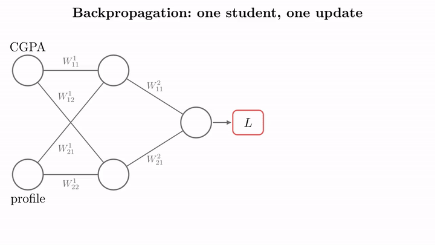
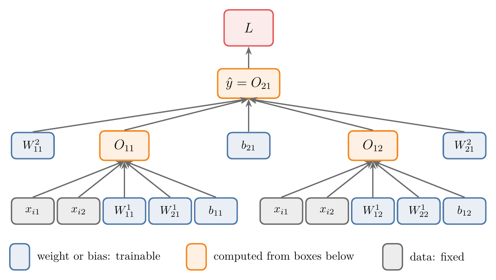

<!-- where-this-fits: generated by course_map/build_map.py; edit concepts.yaml, not this block -->
> **Where this fits:** Pipeline map step 8 (Model). See the [Course map](../01-course-map/note.md).
>
> 
>
> - **Builds on:** Gradient descent ([Note 57](../57-gradient-descent/note.md)); Sigmoid function ([Note 74](../74-sigmoid-derivative/note.md)); Derivatives of one variable ([Note 600](../600-derivatives-of-one-variable/note.md)); Partial derivatives and gradients ([Note 601](../601-partial-derivatives-and-gradients/note.md)); Forward propagation ([Note 1010](../1010-forward-propagation/note.md)); Loss functions in deep learning ([Note 1014](../1014-dl-loss-functions/note.md)).
> - **Leads to:** Vanishing gradient ([Note 1018](../1018-vanishing-exploding-gradients/note.md)); Improving a neural network ([Note 1021](../1021-improving-a-neural-network/note.md)).
<!-- /where-this-fits -->

## 1. Overview

> **Key point:** Backpropagation is the algorithm that trains a neural network. For each **observation** (one record, one row of the data table) it predicts, measures the loss, then works backwards through the network with the chain rule to find how the loss changes with every weight and bias, and moves each one a small step downhill.

**Backpropagation**, short for *backward propagation of errors*, is the algorithm used to train neural networks. Given a network and a loss function, it computes the gradient of the loss with respect to every weight and bias; gradient descent then uses that gradient to update them.

Training a network means finding the values of its weights and biases that make its predictions on the data as good as possible. Backpropagation is how we find them.

{height=42%}

Figure 1 runs the whole algorithm once, for one student. The rest of this Note builds it step by step. Backpropagation takes three Notes: this one says **what** it is; the [backpropagation how Note](../1016-backpropagation-how/note.md) runs it in code on a regression and a classification problem; the [backpropagation why Note](../1017-backpropagation-why/note.md) explains why the update rule works.

## 2. Prerequisites

- [Gradient descent](../57-gradient-descent/note.md): the update $w \leftarrow w - \eta\thinspace\partial L/\partial w$.
- [Forward propagation](../1010-forward-propagation/note.md): how a network makes a prediction.
- The [MLP notation Note](../1008-mlp-notation/note.md): $W_{ij}^{k}$, $b_{ij}$, $O_{ij}$.
- The chain rule: section 5.3 of the [derivatives Note](../600-derivatives-of-one-variable/note.md).

## 3. The data and the network

> **Key point:** Four students, two **features** (input variables: CGPA, profile score), one **target** (the output we predict: package). A 2-2-1 network with linear activations has 6 weights and 3 biases: 9 trainable parameters.

We predict a student's package (LPA) from their CGPA and profile score, both out of 10:

| Student | CGPA $x_{i1}$ | Profile score $x_{i2}$ | Package $y_i$ (LPA) |
|---|---|---|---|
| 1 | 8 | 8 | 4 |
| 2 | 7 | 9 | 5 |
| 3 | 6 | 10 | 6 |
| 4 | 5 | 12 | 7 |

The network has 2 input nodes, one hidden layer of 2 nodes and 1 output node (Figure 1). Predicting a package is a regression problem, so every node uses a **linear activation**: a node outputs its weighted sum plus bias, with no sigmoid.

In the notation of the [MLP notation Note](../1008-mlp-notation/note.md):

- Layer 1 has the weights $W_{11}^{1}, W_{12}^{1}, W_{21}^{1}, W_{22}^{1}$ and the biases $b_{11}, b_{12}$; its nodes output $O_{11}$ and $O_{12}$.
- Layer 2 has the weights $W_{11}^{2}, W_{21}^{2}$ and the bias $b_{21}$; its node outputs $O_{21} = \hat{y}$.

The count is $(2 \times 2 + 2) + (2 \times 1 + 1) = 6 + 3 = 9$ trainable parameters.

> **Extra:** Both inputs are scores out of 10, so they sit on the same scale. With IQ (around 80 to 120) next to CGPA, the IQ weights would get gradients about 10 times larger, because a weight's gradient is multiplied by its input ($\partial O_{11}/\partial W_{11}^{1} = x_{i1}$, section 6). One learning rate would then be too large for the IQ weights or too small for the CGPA weights.

## 4. The steps of backpropagation

> **Key point:** Step 0: initialise. Then, for each student: forward propagation, loss, update all 9 parameters with gradient descent.

### 4.1 Step 0: initialise the weights and biases

> **Key point:** We set every weight to 0.1 and every bias to 0.

Training needs starting values. Common choices are random numbers, or all weights 1 and all biases 0; how well backpropagation works depends on this choice, and later Notes compare the options. To keep the arithmetic easy, we set **every weight to 0.1 and every bias to 0**.

### 4.2 Steps 1 to 3: one student forward, one loss

> **Key point:** Student 1 gets $\hat{y} = 0.32$ LPA against a real 4 LPA: a loss of 13.54.

1. **Select an observation:** student 1, with $x_{11} = 8$, $x_{12} = 8$ and $y = 4$.
2. **Predict with forward propagation** (see the [forward propagation Note](../1010-forward-propagation/note.md)):
   $$O_{11} = W_{11}^{1} x_{11} + W_{21}^{1} x_{12} + b_{11} = 0.1 \times 8 + 0.1 \times 8 + 0 = 1.6, \qquad O_{12} = 1.6$$
   $$\hat{y} = O_{21} = W_{11}^{2} O_{11} + W_{21}^{2} O_{12} + b_{21} = 0.1 \times 1.6 + 0.1 \times 1.6 + 0 = 0.32$$
3. **Compute the loss.** For regression we use the squared error (see the [loss functions Note](../1014-dl-loss-functions/note.md)):
   $$L = (y - \hat{y})^2 = (4 - 0.32)^2 = 13.54$$

The network says 0.32 LPA where the data says 4. The loss is large because the weights are wrong.

### 4.3 Step 4: update every weight and bias

> **Key point:** Each of the 9 parameters moves by the learning rate times the derivative of the loss with respect to it.

Every parameter is updated with the [gradient descent](../57-gradient-descent/note.md) rule:

$$W_{\text{new}} = W_{\text{old}} - \eta \frac{\partial L}{\partial W_{\text{old}}}, \qquad b_{\text{new}} = b_{\text{old}} - \eta \frac{\partial L}{\partial b_{\text{old}}}$$

For $W_{11}^{2}$ this reads $W_{11}^{2} \leftarrow W_{11}^{2} - \eta\thinspace\partial L/\partial W_{11}^{2}$, and the same for the other 8. The old value (0.1 or 0) and the learning rate $\eta$ are known. What we still need are the **9 derivatives**: how the loss changes when each parameter changes. Computing them is the heart of backpropagation, and it is exactly the definition of Section 1: the gradient of the loss with respect to the network's weights.

## 5. Why the error goes backwards

> **Key point:** We cannot change $y$, only $\hat{y}$; $\hat{y}$ depends on three parameters and two hidden outputs, and each hidden output depends on three more parameters. So we fix the error by working back from the output.

{height=33%}

The loss $L = (y - \hat{y})^2$ has two parts. $y$ is the true package, fixed by the data. So the only way to lower the loss is to change $\hat{y}$: here, to make it bigger than 0.32.

Figure 2 shows what $\hat{y}$ depends on. Since $\hat{y} = W_{11}^{2} O_{11} + W_{21}^{2} O_{12} + b_{21}$, it depends on 5 things:

- $W_{11}^{2}$, $W_{21}^{2}$ and $b_{21}$: parameters we can change directly;
- $O_{11}$ and $O_{12}$: outputs of the hidden nodes, which are not parameters themselves.

Each hidden output depends on 5 things in turn. $O_{11}$ depends on the two inputs (fixed data), the weights $W_{11}^{1}$, $W_{21}^{1}$ and the bias $b_{11}$. $O_{12}$ depends on the inputs, $W_{12}^{1}$, $W_{22}^{1}$ and $b_{12}$.

Think of a relay team that lost a race: the coach starts with the last runner, sees how much time was lost there, then asks how much of that came from the handover before, and so on back to the first runner. So the loss is reduced by starting at the output and going **backwards**, layer by layer, adjusting the weights and biases in each. The backward direction gives the algorithm its name: the error is propagated backwards.

## 6. The nine derivatives

> **Key point:** Every derivative is a chain: $\partial L/\partial \hat{y}$, times how $\hat{y}$ depends on the next thing, and so on down to the parameter. The first link, $-2(y - \hat{y})$, is shared by all nine.

### 6.1 What a derivative tells us here

> **Key point:** $\partial L/\partial W_{11}^{2}$ is how much the loss changes for a tiny change in $W_{11}^{2}$.

A derivative $dy/dx$ measures how much $y$ changes when $x$ changes a little (see the [derivatives Note](../600-derivatives-of-one-variable/note.md)). So $\partial L/\partial W_{11}^{2}$ asks: if we nudge $W_{11}^{2}$, how much does the loss move?

$W_{11}^{2}$ does not appear in $L$ directly. A change in $W_{11}^{2}$ changes $\hat{y}$, and the change in $\hat{y}$ changes $L$. The **chain rule** handles exactly this: multiply the two rates (see section 5.3 of the [derivatives Note](../600-derivatives-of-one-variable/note.md)):

$$\frac{\partial L}{\partial W_{11}^{2}} = \frac{\partial L}{\partial \hat{y}} \cdot \frac{\partial \hat{y}}{\partial W_{11}^{2}}$$

### 6.2 The output layer: three derivatives

> **Key point:** $\partial L/\partial \hat{y} = -2(y - \hat{y})$, then multiply by $O_{11}$, $O_{12}$ or 1.

The two factors:

- From $L = (y - \hat{y})^2$: $\partial L/\partial \hat{y} = -2(y - \hat{y})$ (the $-1$ comes from differentiating $-\hat{y}$ inside the bracket).
- From $\hat{y} = W_{11}^{2} O_{11} + W_{21}^{2} O_{12} + b_{21}$: only the first term contains $W_{11}^{2}$, so $\partial \hat{y}/\partial W_{11}^{2} = O_{11}$. In the same way $\partial \hat{y}/\partial W_{21}^{2} = O_{12}$ and $\partial \hat{y}/\partial b_{21} = 1$.

So the three derivatives of the output layer are:

$$\frac{\partial L}{\partial W_{11}^{2}} = -2(y - \hat{y})\thinspace O_{11}, \qquad \frac{\partial L}{\partial W_{21}^{2}} = -2(y - \hat{y})\thinspace O_{12}, \qquad \frac{\partial L}{\partial b_{21}} = -2(y - \hat{y})$$

### 6.3 The hidden layer: six derivatives

> **Key point:** One more link in the chain: $\partial \hat{y}/\partial O_{11} = W_{11}^{2}$, then $\partial O_{11}/\partial W_{11}^{1} = x_{i1}$.

$W_{11}^{1}$ is further away. Changing it changes $O_{11}$, which changes $\hat{y}$, which changes $L$. The chain has three links:

$$\frac{\partial L}{\partial W_{11}^{1}} = \frac{\partial L}{\partial \hat{y}} \cdot \frac{\partial \hat{y}}{\partial O_{11}} \cdot \frac{\partial O_{11}}{\partial W_{11}^{1}}$$

- $\partial \hat{y}/\partial O_{11} = W_{11}^{2}$, because $O_{11}$ appears in $\hat{y}$ only in the term $W_{11}^{2} O_{11}$. Likewise $\partial \hat{y}/\partial O_{12} = W_{21}^{2}$.
- From $O_{11} = W_{11}^{1} x_{i1} + W_{21}^{1} x_{i2} + b_{11}$: $\partial O_{11}/\partial W_{11}^{1} = x_{i1}$, $\partial O_{11}/\partial W_{21}^{1} = x_{i2}$ and $\partial O_{11}/\partial b_{11} = 1$. The same holds for $O_{12}$ and its own weights.

Here $x_{i1}$ and $x_{i2}$ are the CGPA and profile score of the student $i$ being processed. The six derivatives of the hidden layer:

| Parameter | $\partial L / \partial(\text{parameter})$ |
|---|---|
| $W_{11}^{1}$ | $-2(y - \hat{y})\thinspace W_{11}^{2}\thinspace x_{i1}$ |
| $W_{21}^{1}$ | $-2(y - \hat{y})\thinspace W_{11}^{2}\thinspace x_{i2}$ |
| $b_{11}$ | $-2(y - \hat{y})\thinspace W_{11}^{2}$ |
| $W_{12}^{1}$ | $-2(y - \hat{y})\thinspace W_{21}^{2}\thinspace x_{i1}$ |
| $W_{22}^{1}$ | $-2(y - \hat{y})\thinspace W_{21}^{2}\thinspace x_{i2}$ |
| $b_{12}$ | $-2(y - \hat{y})\thinspace W_{21}^{2}$ |

### 6.4 The pattern

> **Key point:** Every formula is made of numbers we already have after the forward pass: $y$, $\hat{y}$, the hidden outputs, the current weights and the inputs.

Read all nine together:

- The first factor, $-2(y - \hat{y})$, is the same in all of them. We compute it once.
- The next factor depends on where the parameter sits: the hidden output it multiplies ($O_{11}$, $O_{12}$), or, one layer further back, the weight that carries its node's output forward ($W_{11}^{2}$, $W_{21}^{2}$).
- The last factor is the input the weight multiplies ($x_{i1}$, $x_{i2}$, $O_{11}$, $O_{12}$), or 1 for a bias.

After forward propagation we know $y$, $\hat{y}$, $O_{11}$, $O_{12}$, every weight and both inputs. So all nine derivatives are plain arithmetic, and step 4 can run.

## 7. One update with real numbers

> **Key point:** For student 1, $\partial L/\partial \hat{y} = -7.36$. With learning rate 0.001, all weights rise slightly and the loss on the same student drops from 13.54 to 13.06.

### 7.1 The nine gradients

> **Key point:** Output-layer weights: $-11.78$; hidden weights: $-5.89$; hidden biases: $-0.736$; output bias: $-7.36$.

For student 1: $y = 4$, $\hat{y} = 0.32$, $O_{11} = O_{12} = 1.6$, $x_{11} = x_{12} = 8$, every weight 0.1.

1. **In words:** compute the shared factor once, then multiply by each parameter's own factors.
2. **Formula:** $\partial L/\partial \hat{y} = -2(y - \hat{y})$, then the formulas of Sections 6.2 and 6.3.
3. **Example:**
   $$\frac{\partial L}{\partial \hat{y}} = -2(4 - 0.32) = -7.36$$
   $$\frac{\partial L}{\partial W_{11}^{2}} = -7.36 \times 1.6 = -11.776, \qquad \frac{\partial L}{\partial b_{21}} = -7.36$$
   $$\frac{\partial L}{\partial W_{11}^{1}} = -7.36 \times 0.1 \times 8 = -5.888, \qquad \frac{\partial L}{\partial b_{11}} = -7.36 \times 0.1 = -0.736$$

| Parameters | Gradient |
|---|---|
| $W_{11}^{2}$, $W_{21}^{2}$ | $-11.776$ |
| $b_{21}$ | $-7.36$ |
| $W_{11}^{1}$, $W_{21}^{1}$, $W_{12}^{1}$, $W_{22}^{1}$ | $-5.888$ |
| $b_{11}$, $b_{12}$ | $-0.736$ |

Every gradient is negative: raising any parameter would lower the loss, which fits a prediction that is far too small. Figure 1 shows these numbers appearing on the network, from the output back to the inputs.

> **Python:** The 9 gradients for one observation.
>
> ```python
> import numpy as np
>
> W1 = np.full((2, 2), 0.1); b1 = np.zeros(2)  # W1[i-1, j-1] = W^1_ij
> W2 = np.full(2, 0.1); b2 = 0.0
> x, y = np.array([8.0, 8.0]), 4.0
>
> O1 = W1.T @ x + b1                 # forward: O11, O12
> y_hat = W2 @ O1 + b2               # forward: y_hat
> g = -2 * (y - y_hat)               # dL/dy_hat, shared
> dW2, db2 = g * O1, g               # output layer
> dW1 = np.outer(x, g * W2)          # dW1[i-1, j-1] = g * W2_j1 * x_i
> db1 = g * W2                       # hidden biases
> ```
>
> `np.outer(a, b)` makes the table of all products `a[i] * b[j]`: here all four hidden-layer weight gradients at once.

> **Extra:** Two independent checks agree to every digit (Notebook). Nudging each parameter by $10^{-6}$ and measuring the change in the loss gives the same nine numbers (the numerical check of section 7 of the [partial derivatives Note](../601-partial-derivatives-and-gradients/note.md)). TensorFlow's `tf.GradientTape`, which records the forward computation and differentiates it automatically, also returns them. Automatic differentiation is how Keras computes the gradients of any network (see section 10 of the [Jacobian Note](../602-jacobian-and-matrix-gradients/note.md); TensorFlow guide, Automatic differentiation).

### 7.2 The update

> **Key point:** $W_{11}^{2}$: $0.1 \to 0.1118$; $W_{11}^{1}$: $0.1 \to 0.1059$; the prediction rises from 0.32 to 0.386.

With learning rate $\eta = 0.001$:

1. **In words:** subtract the learning rate times the gradient from each parameter.
2. **Formula:** $W_{\text{new}} = W_{\text{old}} - \eta\thinspace\partial L/\partial W$.
3. **Example:**
   $$W_{11}^{2} = 0.1 - 0.001 \times (-11.776) = 0.111776, \qquad b_{21} = 0 - 0.001 \times (-7.36) = 0.00736$$
   $$W_{11}^{1} = 0.1 - 0.001 \times (-5.888) = 0.105888, \qquad b_{11} = 0 - 0.001 \times (-0.736) = 0.000736$$

Running the same student forward again gives $\hat{y} = 0.386$ and a loss of $(4 - 0.386)^2 = 13.06$, down from 13.54. One small step in the right direction.

> **Extra:** All four first-layer weights got the same gradient, and they still share one value. Because we started every weight at 0.1, the two hidden nodes compute the same thing and receive the same updates, so they stay identical forever and act like a single node. Starting from different (random) values avoids this (Goodfellow et al. 2016, §8.4); the weight initialisation Notes later cover it.

## 8. The full algorithm

> **Key point:** Repeat the four steps for every observation (inner loop), then for many epochs (outer loop), until the loss stops falling.

One student moved the weights a little. Training repeats the steps:

1. **Initialise** all weights and biases (here 0.1 and 0).
2. **For each epoch:**
   - for each observation of the data (4 here):
     a. forward propagation: predict $\hat{y}$;
     b. compute the loss;
     c. compute the 9 derivatives and update all 9 parameters.
   - compute the average loss of the epoch.
3. **Stop** after a fixed number of epochs, or at **convergence**: when the loss stops falling.

In the first epoch the four students give losses of 13.54, 21.29, 30.43 and 40.12, an average of 26.35. Each update helps the next prediction a little; the predictions rise from 0.32 to 0.67 over the four students. Running the outer loop 100 or 1,000 times brings the predictions close to the real packages, as the [backpropagation how Note](../1016-backpropagation-how/note.md) shows.

Updating after every single observation, as here, is [stochastic gradient descent](../59-stochastic-gradient-descent/note.md); the [gradient descent in neural networks Note](../1020-gradient-descent-in-neural-networks/note.md) compares it with updating after many observations.

## 9. Summary

| Step | What happens | Student 1 |
|---|---|---|
| 0 | Initialise weights 0.1, biases 0 | 9 parameters |
| 1 | Pick an observation | CGPA 8, profile 8, package 4 |
| 2 | Forward propagation | $O_{11} = O_{12} = 1.6$, $\hat{y} = 0.32$ |
| 3 | Loss | $(4 - 0.32)^2 = 13.54$ |
| 4a | Derivatives by the chain rule | $\partial L/\partial \hat{y} = -7.36$, $\partial L/\partial W_{11}^{2} = -11.78$, $\partial L/\partial W_{11}^{1} = -5.89$ |
| 4b | Gradient descent update, $\eta = 0.001$ | $W_{11}^{2} = 0.1118$, $W_{11}^{1} = 0.1059$; loss 13.06 |

- Backpropagation trains a network: it finds the derivative of the loss with respect to every weight and bias, and gradient descent uses them.
- Only $\hat{y}$ can change the loss, and $\hat{y}$ depends on earlier layers, so we work backwards from the output.
- Each derivative is a chain rule product; the factor $\partial L/\partial \hat{y}$ is shared by all of them.
- All the numbers needed come from the forward pass.
- Observations go one at a time; the whole data is repeated for many epochs.

## 10. Sources

- TensorFlow guide, "Introduction to gradients and automatic differentiation" (`tf.GradientTape`).
- Goodfellow, Bengio and Courville, *Deep Learning*, MIT Press, 2016, §8.4 (random initial values break the symmetry between hidden units).

## 11. Key terms

| Term | Meaning |
|---|---|
| Backpropagation | The algorithm that trains a neural network: forward pass, loss, then the chain rule backwards to get every weight's gradient, then a gradient-descent update |
| Linear activation | No activation: a node outputs its weighted sum plus bias unchanged |
| Initialisation | Choosing the starting values of the weights and biases |
| Gradient of the loss | The collection of the derivatives of the loss with respect to every weight and bias |
| Convergence | The point where further updates no longer lower the loss |
| tf.GradientTape | TensorFlow's tool that records a computation and returns its exact derivatives automatically |
