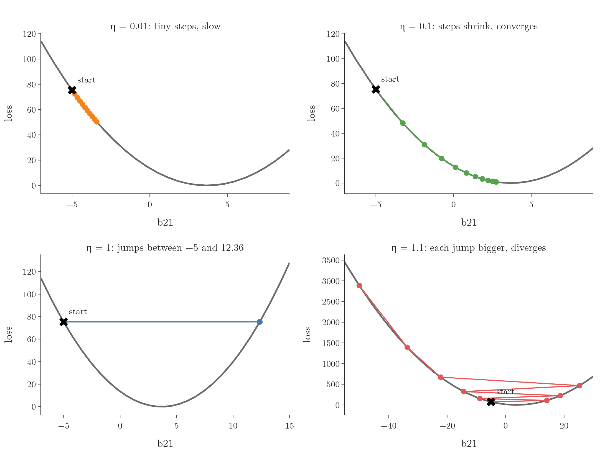

<!-- where-this-fits: generated by course_map/build_map.py; edit concepts.yaml, not this block -->
> **Where this fits:** Pipeline map steps 8 (Model), 10 (Tune). See the [Course map](../01-course-map/note.md).
>
> 
>
> - **Builds on:** Feature scaling ([Note 24](../24-standardization/note.md)); Best-fit line and squared error ([Note 51](../51-linear-regression-maths/note.md)); Sigmoid function ([Note 74](../74-sigmoid-derivative/note.md)); Derivatives of one variable ([Note 600](../600-derivatives-of-one-variable/note.md)); Partial derivatives and gradients ([Note 601](../601-partial-derivatives-and-gradients/note.md)); Hessian and multivariate Taylor ([Note 603](../603-hessian-and-multivariate-taylor/note.md)).
> - **Leads to:** Vanishing gradient ([Note 1018](../1018-vanishing-exploding-gradients/note.md)); Batch gradient descent ([Note 1020](../1020-gradient-descent-in-neural-networks/note.md)); Stochastic gradient descent ([Note 1020](../1020-gradient-descent-in-neural-networks/note.md)); Mini-batch gradient descent ([Note 1020](../1020-gradient-descent-in-neural-networks/note.md)); Improving a neural network ([Note 1021](../1021-improving-a-neural-network/note.md)); Scaling inputs for neural networks ([Note 1023](../1023-data-scaling-in-ann/note.md)).
> - **Compare with:** Ordinary least squares (closed form) ([Note 51](../51-linear-regression-maths/note.md)); Normal equation ([Note 55](../55-multiple-lr-code/note.md)).
<!-- /where-this-fits -->

## 1. Overview

> **Key point:** The loss of a network is one function of all its weights and biases. Each derivative tells how the loss responds to one parameter, in size and sign. Stepping against it, by a learning rate times its size, walks every parameter downhill until the slope reaches zero.

The [backpropagation what Note](../1015-backpropagation-what/note.md) and the [backpropagation how Note](../1016-backpropagation-how/note.md) showed what backpropagation does and how to code it. All the learning happens in one line, the update

$$W_{\text{new}} = W_{\text{old}} - \eta\,\frac{\partial L}{\partial W}$$

This Note explains why that line works. The Note reuses ideas from earlier Notes (derivatives, gradients, minima, the learning rate) and applies them to the 2-2-1 regression network.

{height=58%}

## 2. Prerequisites

- The [backpropagation what Note](../1015-backpropagation-what/note.md): the 2-2-1 network, the four students and the 9 derivatives.
- [Gradient descent](../57-gradient-descent/note.md), including its learning rate and stopping rule.
- [Derivatives](../600-derivatives-of-one-variable/note.md) and [partial derivatives and gradients](../601-partial-derivatives-and-gradients/note.md).

## 3. The loss is a function of all nine parameters

> **Key point:** Write $\hat{y}$ out in full and the inputs and $y$ become constants: what is left is a function of the 6 weights and 3 biases. Training is turning 9 knobs until the loss is smallest.

For the regression network, $L = (y - \hat{y})^2$. The package $y$ comes from the data, so for a given student it is a constant. Only $\hat{y}$ can vary, and $\hat{y}$ is built from the hidden outputs:

$$\hat{y} = W^{2}_{11} O_{11} + W^{2}_{21} O_{12} + b_{21}$$

Putting in what $O_{11}$ and $O_{12}$ are writes the whole network as one formula:

$$\hat{y} = W^{2}_{11}\big(W^{1}_{11} x_{i1} + W^{1}_{21} x_{i2} + b_{11}\big) + W^{2}_{21}\big(W^{1}_{12} x_{i1} + W^{1}_{22} x_{i2} + b_{12}\big) + b_{21}$$

In this formula $x_{i1}$ and $x_{i2}$ are the two **features** of student $i$ (input variables, one column of the data table each: CGPA and profile score), so they are constants. Everything else is a parameter:

$$L = L\big(W^{1}_{11}, W^{1}_{12}, W^{1}_{21}, W^{1}_{22}, b_{11}, b_{12}, W^{2}_{11}, W^{2}_{21}, b_{21}\big)$$

$y = f(x)$ is a function of one variable; the loss is a function of nine. Picture the network as a box with 9 knobs: turning any of them changes the loss, and training turns all of them until the loss is as small as possible. The knob picture is the general idea of section 2 of the [convex and non-convex cost functions Note](../590-convex-and-non-convex-cost-functions/note.md), for this network.

## 4. What the gradient is

> **Key point:** One derivative per parameter, each with the others held fixed. For our loss that is 9 partial derivatives; together they are the gradient.

For a function of one variable, such as $y = x^2 + x$, the derivative is $dy/dx = 2x + 1$. For a function of several variables, such as $z = x^2 + y^2$, we take one **partial derivative** per variable, holding the others fixed: $\partial z/\partial x = 2x$ and $\partial z/\partial y = 2y$. The **gradient** collects them all (see the [partial derivatives and gradients Note](../601-partial-derivatives-and-gradients/note.md)).

So "computing the gradient of the loss" means computing its 9 partial derivatives, one per knob: exactly the 9 formulas of the [backpropagation what Note](../1015-backpropagation-what/note.md). Geometrically, each one is the slope of the loss along one of 9 directions.

> **Extra:** A gradient is more than "a fancy word for a derivative". The gradient is the vector of all partial derivatives, and as an arrow it points in the direction in which the loss rises fastest (section 4.2 of the [partial derivatives and gradients Note](../601-partial-derivatives-and-gradients/note.md)). Gradient descent steps along the opposite arrow, which is where its name comes from.

## 5. What a derivative tells us

> **Key point:** A derivative is a rate of change. Its size says how strongly the loss reacts, and its sign says in which direction.

A derivative is a **rate of change**: $dy/dx = 2$ means that increasing $x$ by a small amount increases $y$ by twice that amount; $dy/dx = -2$ means $y$ decreases by twice that amount. Both the size and the sign carry information (see the [derivatives Note](../600-derivatives-of-one-variable/note.md)).

A derivative at a point is the slope there. For $y = x^2 + x$, $dy/dx = 2x + 1$; at $x = 5$ it is 11, so near $x = 5$ the function rises 11 times as fast as $x$.

For the network, $\partial L/\partial W^{1}_{11}$ says how the loss responds to a small change in $W^{1}_{11}$. For student 1 at the start it is $-5.888$: raising $W^{1}_{11}$ by 0.001 lowers the loss by about 0.006.

## 6. Minimum by setting the derivatives to zero

> **Key point:** At a minimum every slope is zero. For $z = x^2 + y^2$ we can solve that by hand; for a network's loss we cannot, so we walk downhill instead.

At the lowest point of a smooth curve the slope is zero. For $y = x^2$, $dy/dx = 2x = 0$ gives $x = 0$. With two variables, $z = x^2 + y^2$, both partial derivatives must be zero: $2x = 0$ and $2y = 0$, so the minimum is at $(0, 0)$.

For our network the same idea says: set all 9 partial derivatives to zero and solve. But those 9 equations are tangled together through products such as $W^{2}_{11} W^{1}_{11}$, and for any real network there are thousands of them, with no formula for the solution: networks are trained with iterative, gradient-based methods instead (Goodfellow et al. 2016, §6.2). So instead of solving, we start somewhere and walk downhill with gradient descent, as the [gradient descent Note](../57-gradient-descent/note.md) does for linear regression.

## 7. Why we subtract the derivative

> **Key point:** A positive slope means the loss rises as the parameter rises, so we lower the parameter; a negative slope means the opposite. The minus sign handles both cases in one rule.

### 7.1 One parameter at a time

> **Key point:** Freeze the other 8 parameters: for student 1 the loss in $b_{21}$ alone is the parabola $(3.68 - b_{21})^2$, lowest at $b_{21} = 3.68$.

To see the update in action, freeze 8 of the 9 parameters at their starting values (weights 0.1, other biases 0) and keep only $b_{21}$ free. For student 1 the forward pass gives $0.32 + b_{21}$, so

$$L(b_{21}) = \big(4 - (0.32 + b_{21})\big)^2 = (3.68 - b_{21})^2$$

The loss $L(b_{21})$ is a parabola with its lowest point at $b_{21} = 3.68$ (Figure 1). Its slope is

$$\frac{\partial L}{\partial b_{21}} = -2(3.68 - b_{21})$$

### 7.2 The sign decides the direction

> **Key point:** At $b_{21} = -5$ the slope is $-17.36$, so the update adds to $b_{21}$; at $b_{21} = 5$ it is $+2.64$, so the update subtracts.

The algorithm cannot see the curve; it only knows the slope where it stands. Two cases:

- **Slope positive** (at $b_{21} = 5$, the slope is $+2.64$): raising $b_{21}$ raises the loss. We must lower $b_{21}$, and $b_{21} - \eta \times 2.64$ does.
- **Slope negative** (at $b_{21} = -5$, the slope is $-17.36$): raising $b_{21}$ lowers the loss. We must raise $b_{21}$, and $b_{21} - \eta \times (-17.36) = b_{21} + 17.36\,\eta$ does.

The minus sign does the right thing in both cases: we always move against the slope, in the direction of the **negative gradient**. The step is also proportional to the slope's size: big where the curve is steep and far from the minimum, small near the bottom where it flattens.

## 8. Why we need a learning rate

> **Key point:** Without a learning rate ($\eta = 1$), $b_{21}$ jumps between $-5$ and 12.36 forever. $\eta = 0.1$ settles in; $\eta = 0.01$ crawls; $\eta = 1.1$ blows up.

Starting from $b_{21} = -5$, where the slope is $-17.36$:

1. **In words:** the new value is the old value minus the learning rate times the slope.
2. **Formula:** $b_{21} \leftarrow b_{21} - \eta\,\partial L/\partial b_{21}$.
3. **Example:** with $\eta = 1$, $b_{21} = -5 - (-17.36) = 12.36$. There the slope is $-2(3.68 - 12.36) = 17.36$, so the next value is $12.36 - 17.36 = -5$, back at the start. With $\eta = 0.1$: $b_{21} = -5 + 0.1 \times 17.36 = -3.264$, a smaller and safer step.

Figure 1 runs 10 updates with four learning rates:

- $\eta = 0.01$: $-5,\ -4.83,\ -4.66,\ -4.49, \dots$, and $-3.41$ after 10 steps. Tiny steps: slow.
- $\eta = 0.1$: $-5,\ -3.26,\ -1.88,\ -0.76, \dots$, and 2.75 after 10 steps. The steps shrink as the slope flattens, and $b_{21}$ converges to 3.68.
- $\eta = 1$: $-5,\ 12.36,\ -5,\ 12.36, \dots$ The value zigzags across the bowl forever.
- $\eta = 1.1$: $-5,\ 14.10,\ -8.82,\ 18.68, \dots$, and $-50.06$ after 10 steps. Each jump overshoots more: the updates diverge.

Multiplying the slope by a small factor such as 0.1 or 0.01 turns the zigzag into small steps. As we near the minimum the slope shrinks, so the steps shrink with it. Too small a learning rate wastes time; too large overshoots and can run away. The learning rate is a hyperparameter to tune (see section 5 of the [gradient descent Note](../57-gradient-descent/note.md)).

> **Extra:** On this parabola the update is $b_{21} - 3.68 \leftarrow (1 - 2\eta)(b_{21} - 3.68)$: each step multiplies the distance to the minimum by $1 - 2\eta$. The factor is 0.8 for $\eta = 0.1$ (shrinks), $-1$ for $\eta = 1$ (same size, flipped side), and $-1.2$ for $\eta = 1.1$ (grows). Any $\eta$ above 1 diverges here; how large a rate is safe depends on how steep the loss is.

In the real network all 9 parameters move at once, each against its own slope. The loss surface has 9 dimensions instead of one, but the reasoning is the same along every direction.

## 9. When to stop: convergence

> **Key point:** At the minimum the slope is zero, so $W_{\text{new}} = W_{\text{old}}$: updates stop changing anything. In practice we run a fixed number of epochs.

The algorithm has **converged** when the updates stop changing the parameters: $W_{\text{new}} \approx W_{\text{old}}$. Convergence happens when $\eta\,\partial L/\partial W \approx 0$, that is, when the slope is close to zero: we are at a minimum.

So the "right" loop is "repeat until convergence". In practice we write a loop over a fixed number of epochs, such as 100 or 1,000, chosen large enough for the loss to settle (the stopping rules of section 2.3 of the [gradient descent Note](../57-gradient-descent/note.md)).

> **Extra:** A slope of zero only proves a *local* minimum. A network's loss is not one bowl, so gradient descent can settle in a dip that is not the lowest (see the [convex and non-convex cost functions Note](../590-convex-and-non-convex-cost-functions/note.md)).

## 10. Summary

| Question | Answer |
|---|---|
| What is the loss a function of? | All weights and biases; data and $y$ are constants |
| What is the gradient? | The partial derivatives of the loss, one per parameter (9 here) |
| What does each derivative say? | How the loss changes with that parameter: size and sign |
| Why subtract it? | To move against the slope, downhill, whichever its sign |
| Why a learning rate? | To take small steps: $\eta = 1$ zigzags, $\eta = 1.1$ diverges, $\eta = 0.1$ converges |
| When to stop? | When updates no longer change the parameters; in practice after a fixed number of epochs |

- Writing $\hat{y}$ out shows $L$ as one function of the 9 parameters.
- We cannot solve "all derivatives = 0" for a network, so we walk downhill.
- The minus sign moves each parameter the right way; the slope's size makes steps shrink near the minimum.
- On $L(b_{21}) = (3.68 - b_{21})^2$ each update multiplies the distance to the minimum by $1 - 2\eta$.

## 11. Sources

- Goodfellow, Bengio and Courville, *Deep Learning*, MIT Press, 2016, §6.2 (non-convex losses; iterative gradient-based training).

## 12. Key terms

| Term | Meaning |
|---|---|
| Rate of change | How much one quantity changes per unit change of another; the meaning of a derivative |
| Negative gradient | The gradient with its sign flipped: the direction in which the loss falls fastest |
| Divergence | Updates that overshoot more and more, so the parameter and the loss run away |
| Convergence | The state where updates no longer change the parameters because the slope is about zero |
