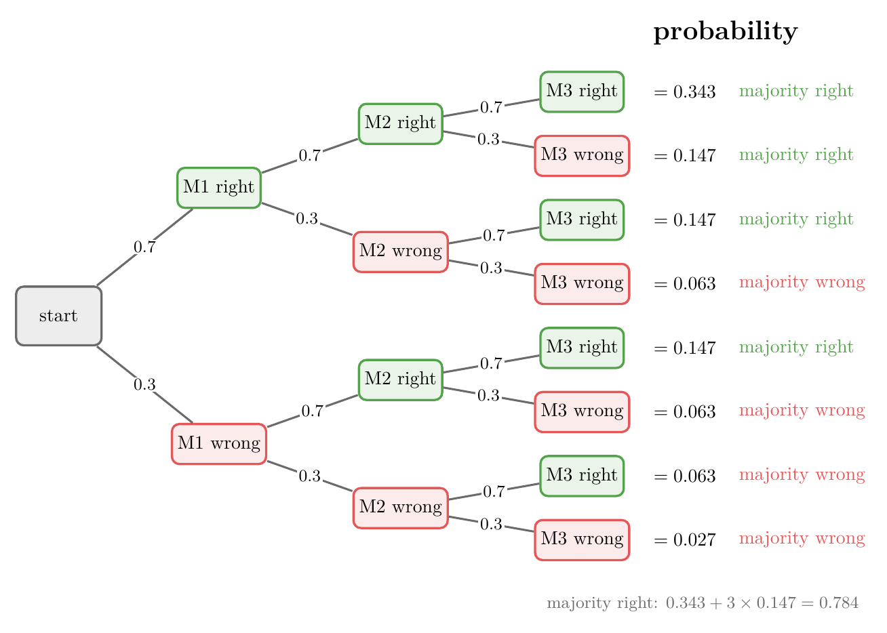

<!-- where-this-fits: generated by course_map/build_map.py; edit concepts.yaml, not this block -->
> **Where this fits:** Pipeline map step 8 (Model). See the [Course map](../01-course-map/note.md).
>
> 
>
> - **Builds on:** Independent and mutually exclusive events ([Note 84](../84-mutually-exclusive-events/note.md)); Cross-validation ([Note 91](../91-knn/note.md)); Ensemble learning ([Note 101](../101-ensemble-learning/note.md)).
> - **Compare with:** Bagging ([Note 105](../105-bagging-intuition/note.md)); Stacking and blending (Video 127, coming).
<!-- /where-this-fits -->

## 1. Overview

> **Key point:** A voting ensemble trains several models on the same data and lets them vote. If the models are independent and each is right more than half the time, the vote is right more often than any one of them.

A **voting ensemble** is the simplest ensemble ([introduction to ensemble learning Note](../101-ensemble-learning/note.md), section 4.1). This Note and the next two cover it:

- this Note: the core idea, why voting works (with probability), and the two assumptions it needs;
- hard and soft voting, code and hyperparameters: the [voting classifier Note](../103-voting-classifier/note.md);
- the same ideas for regression: the [voting regressor Note](../104-voting-regressor/note.md).

## 2. The core idea

> **Key point:** Train every model on the same data, independently; to predict, ask them all and take the majority (classification) or the mean (regression).

Take a few models, say M1, M2 and M3. They can be different algorithms or the same algorithm with different settings; the [voting classifier Note](../103-voting-classifier/note.md) shows both.

**Training:** each model is trained on the **same** dataset, independently of the others.

**Prediction:** a new query point $x_q$ goes to every trained model, through its `predict` method.

- **Classification:** say M1 predicts 1, M2 predicts 0 and M3 predicts 0. Most models say 0, so the voting ensemble answers **0**.
- **Regression:** say the models predict 0.5, 0.8 and 2. The ensemble answers their mean, $(0.5 + 0.8 + 2)/3 = 1.1$.

That is the whole algorithm. It works like an election, which is where the name comes from.

## 3. The puzzle

> **Key point:** How can models with accuracies 0.7, 0.6 and 0.55 combine into one with accuracy above 0.7?

Suppose one model has accuracy 0.7, another 0.6 and a third 0.55. Combining them by vote gives a new model whose accuracy can be **higher than 0.7**, the best of the three. How can a vote reach further than its best member?

The answer needs two assumptions and a little probability.

## 4. The two assumptions

> **Key point:** (1) The models must be independent: the more different, the better. (2) Each model must be right more than 50% of the time.

**Assumption 1: the base models are independent.** Their mistakes should not be related: when one model is wrong, the others should not be wrong for the same reason. The more different the models are, the better the vote works; if they are very similar, voting gains little.

**Assumption 2: every model's accuracy is above 50%.** A model that is right less than half the time does harm: a vote of such models is **worse than the worst of them**.

For two classes, 50% accuracy is what random guessing gives. Beating a coin toss is not hard, so in practice voting is a safe technique that usually helps.

### 4.1 Why independence matters: a diverse audience

> **Key point:** In a mixed crowd, what one member does not know, another does.

Democracy relies on voting because people come from different backgrounds with different knowledge. When one person does not know something, someone else does, and the group covers the gap.

On a quiz show, an audience made only of programmers helps with a computer science question and with little else. An audience of an accountant, an engineer, a doctor, a painter and a poet can help with far more. Models are the same: models that make the **same** mistakes cannot correct each other.

## 5. Why voting works: the probability

> **Key point:** With three independent models of accuracy 0.7, the vote is right whenever at least two are right, which happens with probability 0.784.

Take three independent models, M1, M2 and M3, each with accuracy 0.7. On a new point, each is right with probability 0.7 and wrong with probability 0.3.

Because the models are independent, the probability of a combination of outcomes is the product of the separate probabilities (the multiplication rule, [independent events Note](../83-independent-events/note.md)). Figure 1 lists all 8 combinations.

{height=50%}

The majority is right when **at least two** models are right. Four of the eight combinations qualify.

1. **In words:** add the probabilities of "all three right" and of the three ways to have exactly two right.
2. **Formula:** with each model right with probability $p$,
   $$P(\text{vote right}) = p^3 + 3\,p^2(1-p)$$
3. **Example:** with $p = 0.7$,
   $$P(\text{vote right}) = 0.7^3 + 3 \times 0.7^2 \times 0.3 = 0.343 + 3 \times 0.147 = 0.343 + 0.441 = 0.784$$

So three models of accuracy 0.7 make a vote of accuracy **0.784**, better than each one. The vote is wrong only when two or three models are wrong at the same time, and with independent models that is rarer than one model being wrong.

### 5.1 Below 50%: the vote is worse than the worst

> **Key point:** With three models of accuracy 0.3, the vote is right with probability only 0.216.

Now let each model be right with probability $p = 0.3$. The same formula gives:

$$P(\text{vote right}) = 0.3^3 + 3 \times 0.3^2 \times 0.7 = 0.027 + 3 \times 0.063 = 0.027 + 0.189 = 0.216$$

That is about 22%, worse than every single model (30%). It is also $1 - 0.784$: the four combinations left over in Figure 1, with the roles of right and wrong swapped. This proves assumption 2: voting amplifies whatever the models are, good or bad.

> **Extra:** With $n$ models (an odd number, so there are no ties), the vote is right when more than half are right. The number of right models follows a **binomial distribution**, so
> $$P(\text{vote right}) = \sum_{k > n/2} \binom{n}{k} p^k (1-p)^{n-k}$$
> where $\binom{n}{k}$ counts the ways to choose which $k$ models are right. For $n = 3$ this gives the $p^3 + 3p^2(1-p)$ above. This result is known as **Condorcet's jury theorem** (1785).

### 5.2 More models, and correlated models

> **Key point:** With independent models above 50%, more models push the vote toward 100%; once the models start copying each other, the benefit disappears.

{height=45%}

Figure 2a uses the formula of the Extra box for 1 to 101 models:

| Each model | 3 models | 11 models | 101 models |
|---|---|---|---|
| 0.7 | 0.784 | 0.922 | 1.000 |
| 0.6 | 0.648 | 0.753 | 0.979 |
| 0.5 | 0.500 | 0.500 | 0.500 |
| 0.3 | 0.216 | 0.078 | 0.000 |

Even models only slightly better than chance (0.6) reach a vote of 0.98 with 101 of them. Models at exactly 0.5 gain nothing, and models below 0.5 drive the vote to 0.

The dots in Figure 2a come from a simulation: 20,000 random trials of independent models of accuracy 0.6. They sit on the formula's line, so the formula is right.

Figure 2b tests assumption 1. Eleven models of accuracy 0.7 vote, but each answer is, with some probability, copied from one shared source instead of being the model's own:

- with no copying (independent models), the vote scores about **0.92**;
- with half the answers copied, about **0.74**;
- with everything copied, the eleven models act as one, and the vote scores **0.7**, no better than a single model.

> **Extra:** Real models trained on the same data are never fully independent: they tend to fail on the same hard rows. So real gains are smaller than Figure 2a promises. This is why ensembles work to make their models different: different algorithms (voting), different samples of the data (bagging), or both.

## 6. Summary

| Situation | Each model right | Vote of 3 models right |
|---|---|---|
| Independent, better than chance | 0.7 | 0.784 (better than each) |
| Independent, worse than chance | 0.3 | 0.216 (worse than each) |
| Fully correlated | 0.7 | 0.7 (no gain) |

- A voting ensemble trains several models on the same data; classification takes the majority vote, regression the mean.
- It needs two assumptions: independent (different) models, and every model better than 50%.
- For three models, $P(\text{vote right}) = p^3 + 3p^2(1-p)$: 0.784 for $p = 0.7$.
- More independent models help more; correlated models help less.

## 7. Key terms

| Term | Meaning |
|---|---|
| Voting ensemble | Several models trained on the same data, combined by majority vote (classification) or mean (regression) |
| Independent models | Models whose mistakes are unrelated, so one being wrong says nothing about the others |
| Binomial distribution | The distribution of the number of successes in $n$ independent trials with the same success probability |
| Condorcet's jury theorem | A majority of independent voters, each right with probability above 0.5, is right more often than any one voter, and more so as voters are added |
