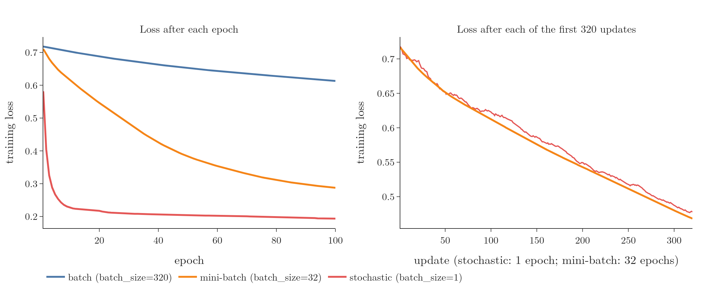

<!-- where-this-fits: generated by course_map/build_map.py; edit concepts.yaml, not this block -->
> **Where this fits:** Pipeline map step 8 (Model). See the [Course map](../01-course-map/note.md).
>
> 
>
> - **Builds on:** Feature scaling ([Note 24](../24-standardization/note.md)); Best-fit line and squared error ([Note 51](../51-linear-regression-maths/note.md)); Derivatives of one variable ([Note 600](../600-derivatives-of-one-variable/note.md)); Partial derivatives and gradients ([Note 601](../601-partial-derivatives-and-gradients/note.md)); Learning rate ([Note 1017](../1017-backpropagation-why/note.md)); Convex and non-convex loss ([Note 1017](../1017-backpropagation-why/note.md)).
> - **Leads to:** Scaling inputs for neural networks ([Note 1023](../1023-data-scaling-in-ann/note.md)); L1 and L2 regularisation in neural networks ([Note 1026](../1026-regularization-in-dl/note.md)).
> - **Compare with:** Ordinary least squares (closed form) ([Note 51](../51-linear-regression-maths/note.md)); Normal equation ([Note 55](../55-multiple-lr-code/note.md)).
<!-- /where-this-fits -->

## 1. Overview

> **Key point:** Batch, stochastic and mini-batch gradient descent differ only in how many **observations** (records, one row of the data table each) feed each update. In Keras one setting chooses between them: `batch_size`. Big batches finish an epoch faster; small batches get further per epoch, on a noisier path.

The three variants of gradient descent are taught in the [batch](../58-batch-gradient-descent/note.md), [stochastic](../59-stochastic-gradient-descent/note.md) and [mini-batch gradient descent Notes](../60-mini-batch-gradient-descent/note.md):

- **Batch:** one update per epoch, from all $n$ observations.
- **Stochastic (SGD):** $n$ updates per epoch, one per observation.
- **Mini-batch:** one update per batch of observations, typically 32.

The three variants trade the accuracy of each update against the time it takes. This Note places them inside the backpropagation algorithm of a neural network and runs all three in Keras on the same network and data. Figure 1 shows how the choice cuts the rows into updates.

{width=100%}

## 2. Prerequisites

- The [backpropagation what Note](../1015-backpropagation-what/note.md): the training loop of a network.
- The [gradient descent Note](../57-gradient-descent/note.md) and the three Notes above on its variants.

## 3. Where gradient descent sits in backpropagation

> **Key point:** The update step of backpropagation is gradient descent. Updating after every single observation, as in the backpropagation Notes, is stochastic gradient descent.

Gradient descent minimises the loss, a function of all the weights and biases, by moving each parameter against its gradient by a learning rate (see the [backpropagation why Note](../1017-backpropagation-why/note.md)). In backpropagation this is the update step:

$$W_{\text{new}} = W_{\text{old}} - \eta\,\frac{\partial L}{\partial W}$$

The loop of the [backpropagation what Note](../1015-backpropagation-what/note.md) picks one observation, predicts, computes the loss and updates, then moves to the next observation. With 50 observations, the loop makes 50 updates in every epoch. Updating after every observation is **stochastic** gradient descent. The other variants change only how many observations go into each update.

## 4. Batch gradient descent in a network

> **Key point:** No inner loop: predict all observations at once with one matrix product, average the loss over them, update once. Updates = epochs.

Batch gradient descent (also **vanilla gradient descent**, the plain version) uses the whole training set for every update:

1. For each epoch:
   a. predict all $n$ observations at once with forward propagation;
   b. compute the loss averaged over all $n$ observations;
   c. compute the gradients of that average and update every weight and bias once.

Step (a) needs no loop over observations. Stacking the observations as the rows of a matrix $X$, each layer becomes one matrix product $\sigma(XW + b)$ (see the Extra at the end of section 6 of the [forward propagation Note](../1010-forward-propagation/note.md)), which returns all $n$ predictions together. With 10 epochs the weights are updated exactly 10 times: **the number of updates equals the number of epochs**.

> **Python:** Batch gradient descent, as pseudocode.
>
> ```python
> for epoch in range(10):
>     y_hat = forward(X, params)    # all n observations, one matrix product
>     loss = mean_loss(y, y_hat)    # one number for all observations
>     params = params - lr * gradient(loss, params)   # 1 update
> ```

## 5. Stochastic gradient descent in a network

> **Key point:** Shuffle, then update after every observation: $n$ updates per epoch. With 50 observations and 10 epochs, 500 updates.

1. For each epoch:
   - shuffle the observations;
   - for each of the $n$ observations: predict it, compute its loss, update every parameter.
   - report the average loss of the epoch.

With 50 observations and 10 epochs the weights are updated $10 \times 50 = 500$ times, against 10 times for batch gradient descent. The observations are shuffled each epoch so that their order cannot bias the updates (see the [stochastic gradient descent Note](../59-stochastic-gradient-descent/note.md)).

## 6. Choosing the variant in Keras: `batch_size`

> **Key point:** `batch_size` = number of training observations gives batch gradient descent; 1 gives stochastic; anything between gives mini-batch. The default is 32.

Keras has no separate switch for the three variants. `model.fit` takes a `batch_size`, the number of observations used for each update:

| `batch_size` | Variant | Updates per epoch on 320 observations |
|---|---|---|
| 320 (all observations) | batch | 1 |
| 32 (the default) | mini-batch | 10 |
| 1 | stochastic | 320 |

The progress bar Keras prints during training counts the updates: `1/1` per epoch with `batch_size=320`, `320/320` with `batch_size=1`.

> **Python:** One network, three variants.
>
> ```python
> model.compile(optimizer=keras.optimizers.SGD(learning_rate=0.01),
>               loss="binary_crossentropy", metrics=["accuracy"])
> model.fit(X_train, y_train, epochs=10, batch_size=320)  # batch
> model.fit(X_train, y_train, epochs=10, batch_size=1)    # stochastic
> model.fit(X_train, y_train, epochs=10, batch_size=32)   # mini-batch
> ```
>
> Plain `SGD` as the optimizer makes each update exactly the learning rate times the gradient, so `batch_size` alone decides which variant runs. (Keras calls the optimizer SGD whatever the batch size.)

The experiments below use the Social Network Ads data: 400 customers with their age and estimated salary, and the **target** (the output we predict): whether they bought a product. The two **features** (input variables) are standardized (salary is in tens of thousands, age in tens; see the [standardization Note](../24-standardization/note.md)), and 320 observations are used for training. The network has two hidden layers of 10 ReLU nodes and one sigmoid output node: 151 parameters. Every run starts from the same weights.

## 7. Which is faster?

> **Key point:** For the same number of epochs, batch gradient descent finishes first (1.0 s against 15 s for 10 epochs). But stochastic gets much further in those epochs (validation accuracy 96% against 53%).

The question "which is faster?" has two answers, depending on what we count.

**Time for a fixed number of epochs.** Training for 10 epochs:

| `batch_size` | Updates per epoch | Time for 10 epochs (varies slightly per run) |
|---|---|---|
| 320 (batch) | 1 | 1.0 s |
| 32 (mini-batch) | 10 | 1.3 s |
| 1 (stochastic) | 320 | 15.0 s |

Every update has a fixed cost, so 320 updates per epoch take far longer than 1. Batch gradient descent completes its epochs fastest.

**Progress in a fixed number of epochs.** Training on all 400 observations, with the last 20% held back for validation (`validation_split=0.2`), for 10 epochs:

| `batch_size` | Training loss after 10 epochs | Validation accuracy |
|---|---|---|
| 320 (batch) | 0.705 | 52.5% |
| 32 (mini-batch) | 0.590 | 62.5% |
| 1 (stochastic) | 0.255 | 96.2% |

In the same 10 epochs, stochastic gradient descent made 3,200 updates and batch gradient descent 10. More updates move the weights further towards a solution, so stochastic gradient descent **converges** in far fewer epochs.

Both statements are true, which is why sources disagree about which is "faster": batch is faster per epoch, stochastic is faster per epoch of progress.

## 8. The path to the minimum

> **Key point:** Batch gradient descent lowers the loss smoothly; stochastic zigzags, because each step follows one random observation. The noise can shake it out of a local minimum, but stops it from settling exactly.

{height=33%}

Figure 2 (left) trains each variant for 100 epochs:

| `batch_size` | Loss after 100 epochs | Test accuracy |
|---|---|---|
| 320 (batch) | 0.613 | 78.8% |
| 32 (mini-batch) | 0.288 | 85.0% |
| 1 (stochastic) | 0.194 | 87.5% |

Measured once per epoch, all three curves look smooth. The difference shows when we measure after every update (Figure 2, right). Over its first 320 updates, stochastic gradient descent made the loss on the whole training set **rise** 60 times: each step follows the gradient of one random observation, which points only roughly downhill. Mini-batch gradient descent, averaging 32 observations per step, never made it rise.

Batch gradient descent walks smoothly into the valley of the loss; stochastic gradient descent staggers in. Think of asking for directions: batch asks the whole town and takes the average answer before each step, so every step is good but slow to get; stochastic asks one passer-by per step, so the steps come fast but some point the wrong way. The noise has two sides (see section 5 of the [stochastic gradient descent Note](../59-stochastic-gradient-descent/note.md)):

- **Advantage:** a network's loss has many local minima (see the [convex and non-convex cost functions Note](../590-convex-and-non-convex-cost-functions/note.md)). Smooth batch descent stays in the first dip it reaches; the random jumps of SGD can carry it out of a poor dip towards a better one.
- **Disadvantage:** near the minimum it keeps jumping around instead of settling, so the answer is approximate.

## 9. Vectorisation and memory

> **Key point:** Batch gradient descent replaces the loop over observations with one matrix product, which is fast, but needs every observation in memory at once; on very large data that is impossible.

Batch gradient descent needs no loop over observations because one matrix product computes all predictions. Replacing a loop by operations on whole arrays is **vectorisation** (see the [batch gradient descent Note](../58-batch-gradient-descent/note.md)). Libraries run these products in optimised code, much faster than a Python loop.

The downside is memory. To multiply all observations at once, all observations must be loaded at once. A dataset of 10 crore (100 million) observations does not fit in a computer's memory, so batch gradient descent cannot run on it. Stochastic gradient descent needs only one observation at a time, but cannot use vectorisation at all.

## 10. Mini-batch: the middle ground

> **Key point:** Batches of, say, 32 observations: vectorised within each batch, only one batch in memory, $n/32$ updates per epoch, and a much smoother path than SGD. Mini-batch is what deep learning uses almost everywhere.

Mini-batch gradient descent cuts the shuffled observations into batches and updates once per batch (see the [mini-batch gradient descent Note](../60-mini-batch-gradient-descent/note.md)). With 320 observations and batches of 32, that is 10 batches and 10 updates per epoch. On every count it sits between the other two:

| | Batch | Mini-batch | Stochastic |
|---|---|---|---|
| Time per epoch | fastest | middle | slowest |
| Progress per epoch | slowest | middle | fastest |
| Path of the loss | smooth | slightly noisy | jagged |
| Vectorised | yes | yes, within a batch | no |
| Memory | all observations | one batch | one observation |

Each batch is vectorised, only one batch has to be in memory, and the average over 32 observations removes most of SGD's noise. Mini-batch's balance is why Keras uses mini-batches by default (`batch_size` defaults to 32; Keras docs, `Model.fit`), and why "gradient descent" in deep learning almost always means mini-batch (Goodfellow et al. 2016, §8.1.3).

## 11. Two practical questions about `batch_size`

> **Key point:** Powers of 2 are customary for hardware efficiency but not required. When the batch size does not divide the number of observations, the last batch is simply smaller.

### 11.1 Why powers of 2?

> **Key point:** 16, 32, 64, ... suit how hardware processes arrays; any value works.

Batch sizes in examples are nearly always 16, 32, 64 or 128. Computer memory and processors, GPUs especially, handle arrays of these sizes efficiently, so they can run slightly faster (Goodfellow et al. 2016, §8.1.3; see also the Extra in section 5 of the [mini-batch gradient descent Note](../60-mini-batch-gradient-descent/note.md)). Powers of 2 are a convention, not a rule: 10, 15 or 100 work just as well.

### 11.2 When the batch size does not divide the number of observations

> **Key point:** 400 observations with `batch_size=150` give batches of 150, 150 and 100: 3 updates per epoch.

With 400 observations and `batch_size=150`, $400/150 = 2.67$ batches would be needed. Keras makes 3 (Figure 1):

- two full batches of 150 observations;
- one last batch with the remaining 100 observations.

So there are 3 updates per epoch, the last from fewer observations. With `batch_size=250` there are 2 updates (250 and 150 observations), and with the default 32 there are 13 (twelve of 32 and one of 16). In general, updates per epoch $= \lceil n / \text{batch size} \rceil$, the division rounded up.

## 12. Summary

| `batch_size` | Variant | Updates per epoch | 10 epochs here | Validation accuracy after 10 epochs |
|---|---|---|---|---|
| $n$ | batch | 1 | 1.0 s | 52.5% |
| 32 | mini-batch | $\lceil n/32 \rceil$ | 1.3 s | 62.5% |
| 1 | stochastic | $n$ | 15.0 s | 96.2% |

- The update step of backpropagation is gradient descent; the variants differ only in observations per update.
- In Keras, `batch_size` chooses the variant; the default, 32, is mini-batch.
- Batch finishes epochs fastest; stochastic needs the fewest epochs to converge.
- Stochastic's path is jagged: it can escape local minima but never settles exactly.
- Batch is vectorised but needs all observations in memory; mini-batch keeps the vectorisation with one batch in memory.
- A batch size that does not divide the number of observations leaves a smaller last batch.

## 13. Sources

- Keras documentation, `Model.fit` (`batch_size` default 32; `validation_split` takes the last fraction of the data).
- Goodfellow, Bengio and Courville, *Deep Learning*, MIT Press, 2016, §8.1.3 (minibatch algorithms; power-of-2 batch sizes on GPUs).

## 14. Key terms

| Term | Meaning |
|---|---|
| Vanilla gradient descent | Another name for batch gradient descent, the plain version |
| `batch_size` | Keras setting: the number of observations used for each update; $n$, 1 or in between gives batch, stochastic or mini-batch |
| Updates per epoch | $\lceil n / \text{batch size} \rceil$: the number of batches in one pass over the data |
| `validation_split` | Keras setting that holds back the last fraction of the observations to measure the model during training |
| Convergence speed | How many epochs a method needs to reach a good solution, as opposed to the time per epoch |
