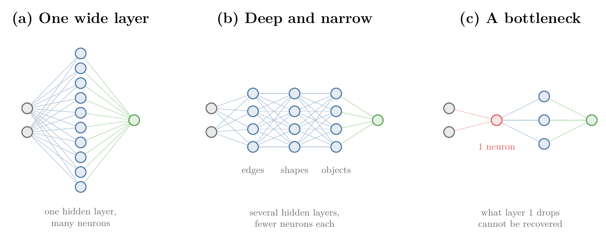

<!-- where-this-fits: generated by course_map/build_map.py; edit concepts.yaml, not this block -->
> **Where this fits:** Pipeline map step 10 (Tune). See the [Course map](../01-course-map/note.md).
>
> 
>
> - **Builds on:** Overfitting ([Note 91](../91-knn/note.md)); Training curves (History) ([Note 1013](../1013-graduate-admission-ann/note.md)); Vanishing gradient ([Note 1018](../1018-vanishing-exploding-gradients/note.md)); Backpropagation ([Note 1019](../1019-mlp-memoization/note.md)).
<!-- /where-this-fits -->

## 1. Overview

> **Key point:** A network gets better in two ways: choose its hyperparameters well, and fix the four problems that break training (vanishing or exploding gradients, too little data, slow training, overfitting).

Building a network in Keras and reaching some accuracy is easy, as the churn, MNIST and admission projects showed. The hard part is taking a network from, say, 90% to 92%. This Note is a map of the techniques that do that; each technique gets its own Note.

{height=45%}

Figure 1 shows the plan:

1. **Tune the hyperparameters** (section 3): the number of hidden layers, the neurons per layer, the learning rate, the optimizer, the batch size, the activation function and the number of epochs.
2. **Fix the problems** (section 4): even with good hyperparameters, a network can train badly. Four problems cause most of it, and each has known fixes.

## 2. Prerequisites

- The [customer churn Note](../1011-customer-churn-ann/note.md): a Keras network, its training curves and a validation set.
- The [gradient descent in neural networks Note](../1020-gradient-descent-in-neural-networks/note.md): batch, stochastic and mini-batch gradient descent, and `batch_size`.
- The [vanishing and exploding gradients Note](../1018-vanishing-exploding-gradients/note.md).

## 3. Tuning the hyperparameters

> **Key point:** Seven settings that we choose before training decide much of a network's performance.

A hyperparameter is a setting of an algorithm chosen before training (see the [pipelines Note](../29-pipelines/note.md)); the network does not learn it. In a Keras network, we choose seven of them every time we write the code. Setting them well already improves performance, without any further technique.

### 3.1 Number of hidden layers

> **Key point:** Several narrow hidden layers usually beat one wide one. Keep adding layers until the network starts to overfit.

A network has three kinds of layer: the input layer, where the data enters; the output layer, where the prediction comes out; and the hidden layers in between. How many hidden layers to use is the first question.

In theory one hidden layer with many neurons can capture complex patterns. In practice, several hidden layers with fewer neurons each usually work better. For example, three hidden layers of 32 neurons give better results in more problems than one hidden layer of 512 neurons. Figure 2 (a) and (b) shows the two shapes.

The reason is representation learning (see the [what is deep learning Note](../1002-what-is-deep-learning/note.md), section 2.4). The first hidden layers pick up primitive features such as lines and edges. The middle layers combine them into shapes, and the last layers combine shapes into complex patterns such as a face. A deep network captures this hierarchy naturally; one wide layer has to learn everything in a single step.

The hierarchy has a second benefit, transfer learning (also from the [what is deep learning Note](../1002-what-is-deep-learning/note.md), section 5.4):

- Suppose a network was trained to recognise human faces, and a new project needs monkey faces.
- At the primitive level (lines, edges, simple shapes) the two kinds of face look alike.
- So instead of training a new network from scratch, we keep the trained early layers and retrain only the last layers on monkey faces.

How many layers, then: 3, 30 or 300? We keep adding hidden layers while the results improve, and stop as soon as the network starts to overfit (section 4.4).

### 3.2 Neurons per layer

> **Key point:** The input and output layers are fixed by the data and the problem. For hidden layers, use a sufficient number of neurons: start generous and cut back if the network overfits.

Two layers are already decided:

- **Input layer:** one neuron per input column. A placement problem with the columns CGPA and IQ has 2 input neurons.
- **Output layer:** one neuron for regression and for binary classification; one neuron per class for multi-class classification.

For the hidden layers there is no hard and fast rule; people go by experience. An older rule of thumb was the **pyramid structure**: fewer neurons in each later hidden layer, for example 64, then 32, then 16. The logic was that there are many primitive features and fewer combined ones.

Experiments later showed that the pyramid makes little difference: three hidden layers of 32 neurons each perform about the same as 64-32-16. So the pyramid is an option, not a rule.

What does matter is that every layer has a **sufficient** number of neurons. Figure 2 (c) shows why. With 2 inputs and a first hidden layer of only 1 neuron, that one neuron has to carry every primitive feature; whatever it ignores is lost, and later layers cannot recover it. So we start with more neurons than we think we need, and reduce them only if the network overfits.

### 3.3 Learning rate and optimizer

> **Key point:** The learning rate sets the step size of gradient descent; the optimizer is the rule that turns gradients into weight updates. Both mainly decide how fast training goes.

The learning rate decides how big each gradient descent step is. Too low, and training is slow; too high, and the steps overshoot and the results are poor (see the [backpropagation why Note](../1017-backpropagation-why/note.md)).

An **optimizer** is the rule that turns the gradients into weight updates. Plain gradient descent is one; in practice we use improved versions, such as Adam, that reach a good solution faster. Since both settings mainly change the training speed, they come up again under slow training (section 4.3).

### 3.4 Batch size

> **Key point:** Small batches (8 to 32) train slowly but generalise well; large batches (up to about 8,192) train fast but are less stable. A learning rate warm-up can give large batches the good results too.

Mini-batch gradient descent updates the weights after every `batch_size` rows (see the [gradient descent in neural networks Note](../1020-gradient-descent-in-neural-networks/note.md), section 6). The batch size is a hyperparameter, and there are two schools of thought:

| | Small batches (8 to 32) | Large batches (up to about 8,192) |
|---|---|---|
| Training speed | slow | fast |
| Training | stable | less stable |
| Results on new data | better, a proven approach | often worse |

The upper limit of a large batch depends on the memory of the GPU.

To keep the speed of large batches and still get good results, some researchers use a **learning rate warm-up**: the learning rate starts very small in the first epochs and is then increased quickly. Training with large batches and a warm-up is both fast and accurate.

A practical order follows. First try large batches with a warm-up; if it works, we have speed and accuracy. If it does not, fall back to small batches, which are slower but reliably give good results.

> **Extra:** Changing the learning rate during training is the job of a **learning rate scheduler** (section 4.3). The warm-up idea comes from Goyal and colleagues (2017), who trained an image network with batches of 8,192 images in one hour by warming up over the first 5 epochs and scaling the learning rate in proportion to the batch size.

### 3.5 Activation function

> **Key point:** The choice of activation function decides, among other things, whether gradients vanish.

Sigmoid was the activation of the early Notes. Switching the hidden layers to another function, ReLU above all, is one of the fixes for the vanishing gradient (section 4.1). The options are compared in the [activation functions Note](../1027-activation-functions/note.md).

### 3.6 Epochs

> **Key point:** Set a large number of epochs and let early stopping end training when the validation results stop improving.

How long should we train? Some people try 100 epochs, then 500, then 1,000. The better answer is to set a large number and use early stopping (see the [batch gradient descent Note](../58-batch-gradient-descent/note.md), section 5): during training, Keras watches the results on the validation data and stops once they no longer improve. In Keras it is a callback, taught in the [early stopping Note](../1022-early-stopping/note.md).

## 4. Fixing the four problems

> **Key point:** Vanishing or exploding gradients, not enough data, slow training and overfitting. Each has its own set of fixes.

### 4.1 Vanishing and exploding gradients

> **Key point:** Fixes: better weight initialisation, other activation functions, batch normalisation, and gradient clipping for exploding gradients.

With sigmoid in a deep network, the gradients shrink layer by layer on the way back, and the early layers stop learning; with factors above 1 they explode instead (see the [vanishing and exploding gradients Note](../1018-vanishing-exploding-gradients/note.md)). Four fixes:

- **Weight initialisation:** start the weights from well-chosen random values instead of all 1 or 0.1 (see the [weight initialisation Note](../1029-weight-initialization/note.md)).
- **Activation function:** replace sigmoid with ReLU or one of its variants (see the [activation functions Note](../1027-activation-functions/note.md)).
- **Batch normalisation:** a more recent technique, widely used today (see the [batch normalisation Note](../1031-batch-normalization/note.md)).
- **Gradient clipping:** caps the size of the gradients; it is used for exploding gradients only (see the [vanishing and exploding gradients Note](../1018-vanishing-exploding-gradients/note.md), section 7.3).

> **Extra:** Keras does not start from equal weights. A `Dense` layer draws its starting weights at random from the Glorot uniform scheme and sets its biases to 0.

### 4.2 Not enough data

> **Key point:** Deep learning is data hungry. Without enough data, reuse a network trained on similar data (transfer learning), or pre-train on unlabelled data.

The biggest difference between ML and DL is that deep learning needs a lot of data (see the [what is deep learning Note](../1002-what-is-deep-learning/note.md), section 4.1). Two techniques help when we have too little:

- **Transfer learning** (section 3.1): reuse a network that someone trained on a large, similar dataset, at least its early layers.
- **Unsupervised pre-training:** first train the early layers on plenty of unlabelled data, then train the whole network on the few labelled rows.

### 4.3 Slow training

> **Key point:** Better optimizers and a learning rate scheduler make training faster, and often the results better too.

Two techniques speed up training:

- **Optimizers** other than plain gradient descent, such as Adam, which the Keras projects already used.
- A learning rate scheduler, which changes the learning rate as the epochs go by, like the warm-up of section 3.4.

### 4.4 Overfitting

> **Key point:** A network with millions of weights easily overfits. Fixes: L1 and L2 regularisation, dropout, and early stopping.

Overfitting means learning the training data too closely, noise included, so that the model fails on new data (see the [bias-variance Note](../62-bias-variance/note.md)). A deep network has many parameters, some have millions of weights, so it tends to overfit. Three fixes have their own Notes:

- **L1 and L2 regularisation**, as for linear models (see the [ridge regression Note](../63-ridge-regression-intuition/note.md)), adapted to networks in the [regularisation in deep learning Note](../1026-regularization-in-dl/note.md).
- **Dropout**: switch off random neurons during training (see the [dropout Note](../1024-dropout/note.md)).
- **Early stopping** (section 3.6, and the [early stopping Note](../1022-early-stopping/note.md)).

## 5. Summary

| Route | What to do | Main effect |
|---|---|---|
| Hidden layers | several narrow layers; stop adding when it overfits | captures a hierarchy of features |
| Neurons per layer | sufficient, start generous; pyramid optional | no feature lost early |
| Learning rate, optimizer | tune; use Adam and similar | training speed |
| Batch size | large with warm-up, else 8 to 32 | speed against generalisation |
| Activation function | ReLU and its variants in hidden layers | avoids vanishing gradients |
| Epochs | many, with early stopping | trains just long enough |
| Vanishing or exploding gradients | initialisation, activation, batch normalisation, clipping | early layers learn |
| Not enough data | transfer learning, unsupervised pre-training | needs less labelled data |
| Slow training | optimizers, learning rate scheduler | faster training |
| Overfitting | L1 and L2 regularisation, dropout, early stopping | better results on new data |

- Hyperparameters first: good values alone already improve a network.
- Deep and narrow beats shallow and wide; it also makes transfer learning possible.
- Never starve a layer of neurons: what an early layer drops is lost for good.
- The four problems each have their own Notes, starting with early stopping.

## 6. Key terms

| Term | Meaning |
|---|---|
| Pyramid structure | Hidden layers with fewer neurons in each later layer, such as 64-32-16; an old rule of thumb, not needed |
| Optimizer | The rule that turns gradients into weight updates, such as plain gradient descent or Adam |
| Learning rate warm-up | Starting training with a very small learning rate and raising it over the first epochs |
| Learning rate scheduler | A rule that changes the learning rate as training goes on |
| Unsupervised pre-training | Training a network's early layers on unlabelled data before training it on the labelled data |
