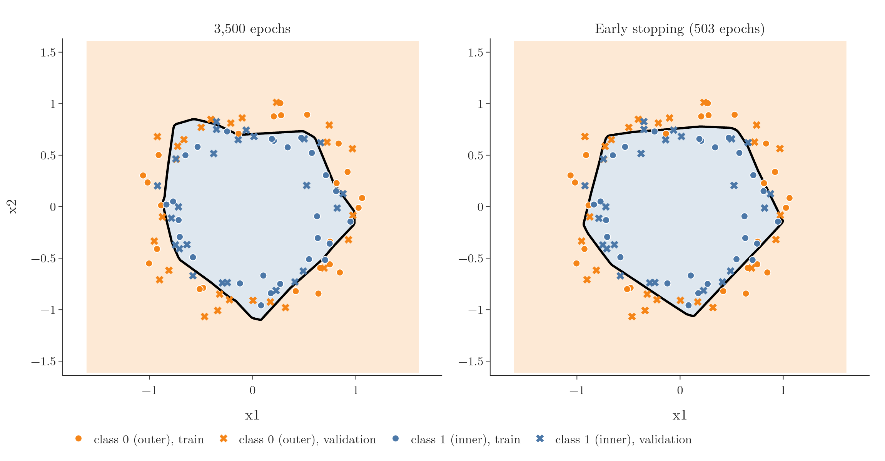

<!-- where-this-fits: generated by course_map/build_map.py; edit concepts.yaml, not this block -->
> **Where this fits:** Pipeline map steps 8 (Model), 9 (Evaluate), 10 (Tune). See the [Course map](../01-course-map/note.md).
>
> 
>
> - **Builds on:** Overfitting ([Note 91](../91-knn/note.md)); Multi-layer perceptron (MLP) ([Note 1009](../1009-mlp-intuition/note.md)).
<!-- /where-this-fits -->

## 1. Overview

> **Key point:** Instead of guessing the number of epochs, we set a large number and let Keras stop training once the validation loss stops improving.

Every call to `fit` needs a number of epochs: 100, 1,000, 10,000? Training too long is not harmless. On some data the network starts to overfit: its results keep improving on the training data and get worse on new data. Early stopping (see the [batch gradient descent Note](../58-batch-gradient-descent/note.md), section 5) means stopping training when the score on held-out data is best; this Note shows how Keras does it for us.


Figure 1 shows the whole story. Section 3 trains a network for 3,500 epochs and watches it overfit; section 4 adds the `EarlyStopping` callback; section 5 explains its settings. The Notebook (`notebook.ipynb`) runs every step.

## 2. Prerequisites

- The [customer churn Note](../1011-customer-churn-ann/note.md): `fit`, validation data and training curves.
- The [bias-variance Note](../62-bias-variance/note.md): overfitting.
- The [improving a neural network Note](../1021-improving-a-neural-network/note.md): where early stopping fits among the techniques.

## 3. Training too long

> **Key point:** After 3,500 epochs, the training loss is still falling but the validation loss has risen since epoch 469: the network overfits.

### 3.1 The data and the network

> **Key point:** 100 points in two noisy circles; one hidden layer of 256 ReLU nodes.

The data comes from scikit-learn's `make_circles`: 100 points, an inner circle (class 1) inside an outer one (class 0), with noise. We use 50 points for training and 50 for validation.

The network has an input layer of 2 nodes, one hidden layer of 256 ReLU nodes and a sigmoid output node: 1,025 trainable parameters. It is compiled with Adam and binary cross-entropy.

> **Python:** The data and the network.
>
> ```python
> from sklearn.datasets import make_circles
>
> X, y = make_circles(n_samples=100, noise=0.1, random_state=1)
> X_train, X_test, y_train, y_test = train_test_split(
>     X, y, test_size=0.5, random_state=2)
>
> model = keras.Sequential([
>     keras.Input(shape=(2,)),
>     keras.layers.Dense(256, activation="relu"),
>     keras.layers.Dense(1, activation="sigmoid"),
> ])
> model.compile(optimizer="adam", loss="binary_crossentropy",
>               metrics=["accuracy"])
> ```

### 3.2 3,500 epochs

> **Key point:** The gap between the two curves keeps widening after epoch 469.

We train for 3,500 epochs, passing the validation set as `validation_data` (`validation_split` would work too, see the [customer churn Note](../1011-customer-churn-ann/note.md), section 7.3). With `verbose=0` Keras prints nothing during training.

> **Python:** Training for 3,500 epochs.
>
> ```python
> history = model.fit(X_train, y_train, epochs=3500,
>                     validation_data=(X_test, y_test), verbose=0)
> ```

Figure 1 (left) plots both losses:

| Epoch | Training loss | Validation loss | Validation accuracy |
|---|---|---|---|
| 1 | 0.690 | 0.689 | 50% |
| 469 | 0.237 | **0.449** (lowest) | 76% |
| 1,000 | 0.174 | 0.518 | 74% |
| 2,000 | 0.151 | 0.668 | 70% |
| 3,500 | 0.118 | 0.769 | 74% |

Up to epoch 469 the validation loss (orange) falls. After that it rises, while the training loss (blue) keeps falling. The widening gap between the curves says the network is overfitting: it keeps fitting the 50 training points better at the expense of new points.

So the right number of epochs here was about 470. The other 3,000 epochs cost time and made the model worse.

> **Extra:** The decision boundary hardly changes after epoch 469 (Figure 2): what grows is the network's confidence. Its predicted probabilities move towards 0 and 1, and every validation point on the wrong side then costs more loss. That is why the validation loss rises by 70% while the validation accuracy only moves between 70% and 76%. The Notebook checks both halves of this story: the two models give the same class on 98% of the plotted area, and the average distance of a validation prediction from 0.5 grows from 0.30 to 0.42. A misclassified validation point now costs 2.74 on average instead of 1.25.



## 4. Early stopping in Keras

> **Key point:** An `EarlyStopping` object passed to `fit` as a callback stops training once the validation loss has not improved for a set number of epochs.

### 4.1 Callbacks

> **Key point:** A callback is a function Keras runs at set points in training, for example after every epoch.

Keras implements early stopping as a **callback**: an object whose code Keras runs at set points during training, here after every epoch. After each epoch, the `EarlyStopping` callback checks whether the monitored score has improved. If it has not improved for long enough, it stops training. Keras has other callbacks too, such as one that changes the learning rate during training.

### 4.2 The same network with early stopping

> **Key point:** Same model, same compile; only `callbacks=[callback]` is new. Training stops at epoch 503, 34 epochs after the best one.

We build and compile exactly the same network, with the same starting weights. Then we create an `EarlyStopping` object and pass it to `fit` in a list.

> **Python:** Adding the callback.
>
> ```python
> from keras.callbacks import EarlyStopping
>
> callback = EarlyStopping(
>     monitor="val_loss",
>     min_delta=0.00001,
>     patience=50,
>     verbose=1,
>     mode="auto",
>     baseline=None,
>     restore_best_weights=False,
> )
> history = model.fit(X_train, y_train, epochs=3500,
>                     validation_data=(X_test, y_test),
>                     verbose=0, callbacks=[callback])
> # Epoch 503: early stopping
> ```
>
> `epochs=3500` is now only an upper limit. `callbacks` takes a list, so several callbacks can run together.

Training stops by itself at epoch 503 (Figure 1, right). The best validation loss, 0.449, was at epoch 469, the same epoch as in the long run; Keras waited 50 more epochs for an improvement, saw none, and stopped.

The result:

| | Epochs | Validation loss | Validation accuracy |
|---|---|---|---|
| 3,500 epochs | 3,500 | 0.769 | 74% |
| Early stopping | 503 | 0.450 | 76% |

The model trained in 14% of the epochs is better on the validation data. In Figure 2 its boundary is a smoother version of the long-trained one. With real data, this is how we train: set a generous upper limit and leave the decision to early stopping.

## 5. The settings of `EarlyStopping`

> **Key point:** `monitor` says what to watch, `min_delta` how much counts as an improvement, `patience` how long to wait, `restore_best_weights` whether to go back to the best epoch.

| Setting | Meaning | Our value |
|---|---|---|
| `monitor` | the quantity to watch | `"val_loss"` |
| `min_delta` | the smallest change that counts as an improvement | 0.00001 |
| `patience` | how many epochs without improvement before stopping | 50 |
| `verbose` | 1 prints the epoch at which training stopped | 1 |
| `mode` | `"min"`, `"max"` or `"auto"`: whether lower or higher is better | `"auto"` |
| `baseline` | a value the monitored quantity must beat, or training stops | `None` |
| `restore_best_weights` | at the end, put back the weights of the best epoch | `False` |

### 5.1 monitor and mode

> **Key point:** Usually the validation loss; `mode="auto"` works out from the name whether lower or higher is better.

We almost always monitor a score on the validation data, because that is where overfitting shows. The validation loss is the usual choice; the validation accuracy also works.

For a loss, lower is better, so training stops when it stops decreasing (`mode="min"`). For an accuracy, higher is better, so training stops when it stops increasing (`mode="max"`). With `mode="auto"` Keras works this out from the name of the monitored quantity, which is right in almost every case.

### 5.2 min_delta and patience

> **Key point:** Patience lets training ride out short bumps; too little patience stops training too early.

`min_delta` sets how much the monitored quantity must improve to count. A drop of the validation loss smaller than `min_delta` counts as no improvement.

**Patience** is the number of epochs without improvement that Keras waits before stopping. With `patience=3`, it waits 3 epochs; with `patience=5`, 5. Waiting matters because the validation loss does not move smoothly: it can rise for a few epochs and then fall again.

Our data shows this. In the first epochs the validation loss rises a little, from 0.6892 at epoch 1 to 0.6947 at epoch 10, before it starts its long fall. With `patience=20` the Notebook stops at epoch 21 with 50% validation accuracy, before the network has learned anything. With `patience=50` it waits out this bump.

### 5.3 baseline

> **Key point:** Stop if the monitored quantity does not beat a given value; rarely used.

`baseline` is a value the monitored quantity must beat. If it does not improve on the baseline within the patience window, training stops. Choosing such a number needs a good understanding of the data, so it is usually left at `None`.

### 5.4 restore_best_weights

> **Key point:** With `True`, the model ends with the weights of the best epoch, not the last one.

When training stops at epoch 503, the model holds the weights of epoch 503, not of the best epoch 469. With `restore_best_weights=True`, Keras keeps a copy of the best weights and puts them back at the end.

Here the difference is tiny: validation loss 0.449 with the restored weights against 0.450 without, because the loss barely moved in those 34 epochs. With a larger patience or a faster-rising validation loss, the difference grows, so `True` is a sensible choice to try.

## 6. Summary

| | Without early stopping | With early stopping |
|---|---|---|
| Epochs | fixed, chosen by guessing | upper limit; Keras stops |
| Here | 3,500 epochs, validation loss 0.769 | 503 epochs, validation loss 0.450 |
| Risk | overfitting, wasted time | stopping too early if patience is small |

- Training too long overfits: the training loss falls while the validation loss rises.
- `EarlyStopping` is a callback: it checks the validation loss after every epoch and stops when it has not improved for `patience` epochs.
- Monitor a validation score; leave `mode="auto"`.
- Give it enough patience to ride out short bumps; consider `restore_best_weights=True`.

## 7. Key terms

| Term | Meaning |
|---|---|
| Callback | An object whose code Keras runs at set points during training, for example after every epoch |
| `EarlyStopping` | The Keras callback that stops training when a monitored quantity stops improving |
| Patience | The number of epochs without improvement that early stopping waits before stopping |
| `min_delta` | The smallest change of the monitored quantity that counts as an improvement |
| `restore_best_weights` | `EarlyStopping` setting that puts back the weights of the best epoch at the end |
