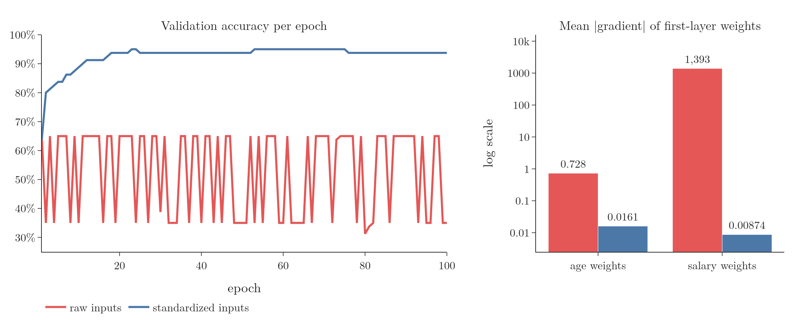
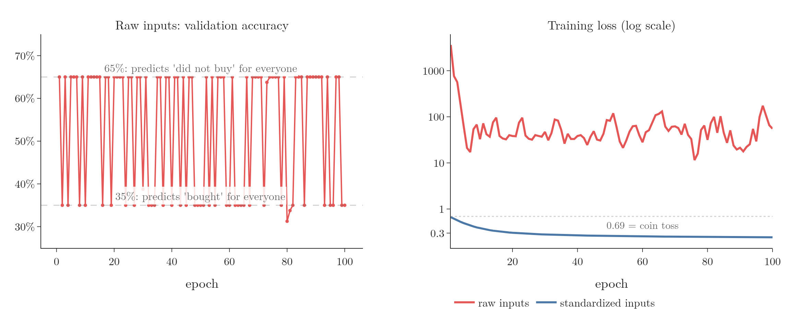
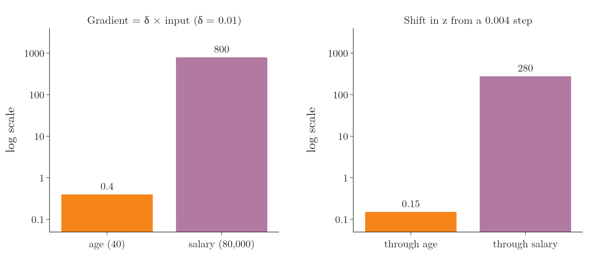
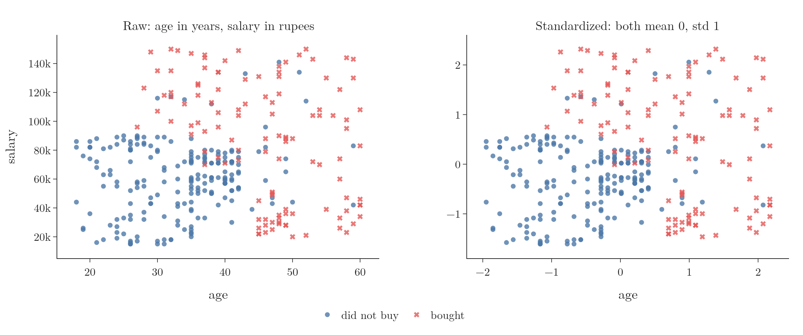

<!-- where-this-fits: generated by course_map/build_map.py; edit concepts.yaml, not this block -->
> **Where this fits:** Pipeline map step 5 (Engineer features). See the [Course map](../01-course-map/note.md).
>
> 
>
> - **Builds on:** Train-test split ([Note 13](../13-toy-project/note.md)); Feature engineering ([Note 23](../23-what-is-feature-engineering/note.md)); Feature transformation ([Note 23](../23-what-is-feature-engineering/note.md)); Normalization ([Note 25](../25-normalization/note.md)); Descriptive statistics ([Note 230](../230-percentiles-and-box-plots/note.md)); Gradient descent ([Note 1020](../1020-gradient-descent-in-neural-networks/note.md)).
> - **Leads to:** Batch normalisation ([Note 1031](../1031-batch-normalization/note.md)); Image classification with a CNN (cats vs dogs) ([Note 1049](../1049-cat-vs-dog-cnn/note.md)).
> - **Compare with:** Normalization ([Note 25](../25-normalization/note.md)); Decision trees ([Note 100](../100-dtreeviz/note.md)).
<!-- /where-this-fits -->

## 1. Overview

> **Key point:** When the input features live on very different scales, a network trains slowly or not at all. Bringing every feature to the same scale before training fixes it.

Suppose a network predicts whether a user buys a product from two **features** (G-772) (input variables, one column each of the data table): age, in tens, and salary, in tens of thousands. Whether the user buys is the **target** (G-1949) (the output we predict), and each user is one **observation** (G-1374) (one record, one row of the table). Fed the raw features, the network in this Note never gets past guessing. Fed the same features standardized, it reaches 94% accuracy within 20 epochs.



Figure 1 shows both runs and the reason. This Note:

- shows the problem in Keras (section 3);
- explains why it happens (section 4);
- fixes it (section 5).

The Notebook (`notebook.ipynb`) runs every step.

## 2. Prerequisites

- The [standardization Note](../24-standardization/note.md) and the [normalization Note](../25-normalization/note.md): the two ways to put features on one scale.
- The [gradient descent Note](../57-gradient-descent/note.md), section 9: what unscaled inputs do to the shape of the loss.
- The [customer churn Note](../1011-customer-churn-ann/note.md): a Keras network and its validation accuracy.

## 3. The problem in Keras

> **Key point:** On raw age and salary, the validation accuracy jumps between about 30% and 65% for 100 epochs: the network keeps predicting one class for everyone.

### 3.1 The data and the network

> **Key point:** 400 users, two features on very different scales, one 0/1 target; one hidden layer of 128 ReLU nodes.

The data is `Social_Network_Ads.csv`, also used in the [standardization Note](../24-standardization/note.md). It holds 400 users of a social network, and we keep three columns:

| Column | Range | Meaning |
|---|---|---|
| Age | 18 to 60 | age in years |
| EstimatedSalary | 15,000 to 150,000 | estimated yearly salary |
| Purchased | 0 or 1 | **target:** 1 if the user bought the advertised product |

Age is in tens and salary in tens of thousands: the salary feature is about 2,000 times larger. We split 80/20, leaving 320 users for training and 80 for validation.

The network has an input layer of 2 nodes, one hidden layer of 128 ReLU nodes and one sigmoid output node, since this is binary classification. The network is compiled with Adam, binary cross-entropy and accuracy, and trained for 100 epochs.

> **Python:** The network, trained on the raw columns.
>
> ```python
> model = keras.Sequential([
>     keras.Input(shape=(2,)),
>     keras.layers.Dense(128, activation="relu"),
>     keras.layers.Dense(1, activation="sigmoid"),
> ])
> model.compile(optimizer="adam", loss="binary_crossentropy",
>               metrics=["accuracy"])
> history = model.fit(X_train, y_train, epochs=100,
>                     validation_data=(X_test, y_test))
> ```

### 3.2 What happens

> **Key point:** The accuracy never converges, and the loss stays in the tens.

Figure 1 (left, red) shows the validation accuracy. The accuracy jumps up and down between 31% and 65% for all 100 epochs and never settles; in the last 10 epochs it takes only two values, 35% and 65%.

The two values give the game away. Of the 80 validation users, 65% did not buy and 35% did. An accuracy of 65% means the network predicted "did not buy" for everyone; 35% means it predicted "bought" for everyone. The network flips between the two and never learns to separate the users.

The training loss tells the same story. Binary cross-entropy of a coin toss is 0.69, yet the loss starts at 3,618 and still swings between about 20 and 170 in the last 10 epochs.



In Figure 2, watch how almost every point lands on one of the two dashed lines: the network is not learning slowly, it is flipping between two useless answers, while its loss never comes down to the coin-toss line that the standardized run passes in the first epoch.

## 4. Why unscaled inputs break training

> **Key point:** The gradient of a weight is proportional to its input (LeCun et al. 1998, §4.3). The salary weights get gradients about 2,000 times larger than the age weights, so training attends to salary and ignores age.

### 4.1 The weight of a large input gets a large gradient

> **Key point:** For a first-layer weight, gradient = (error signal of its node) × (its input).

Call the two inputs $x_1$ (age) and $x_2$ (salary), and their weights into one hidden node $w_1$ and $w_2$. **Backpropagation** (G-247) updates both with $w_{\text{new}} = w_{\text{old}} - \eta\thinspace\partial L/\partial w$.

1. **In words:** the node computes $z = w_1 x_1 + w_2 x_2 + b$. By the **chain rule** (G-371), the gradient of each weight is the node's error signal $\delta = \partial L/\partial z$ times that weight's input.
2. **Formula:**
   $$\frac{\partial L}{\partial w_1} = \delta \cdot x_1, \qquad \frac{\partial L}{\partial w_2} = \delta \cdot x_2$$
3. **Example:** a user aged 40 earning 80,000, and $\delta = 0.01$:
   $$\frac{\partial L}{\partial w_1} = 0.01 \times 40 = 0.4, \qquad \frac{\partial L}{\partial w_2} = 0.01 \times 80{,}000 = 800$$
   The salary weight gets a gradient 2,000 times larger.



In Figure 3, the two panels look alike: the 2,000 times gap in the gradients (left) reappears as a similar gap (about 1,900 times) in how far $z$ moves (right), which is why Adam's equal-sized steps do not save the raw run.

So salary takes over. With plain gradient descent, nearly all the change would go into $w_2$. Our network uses Adam, which moves every weight by about the same small amount (Kingma and Ba 2015, §2.1), but salary still takes over, because the same small step moves $z$ 2,000 times further through salary than through age. Think of two volume knobs, one normal and one extremely sensitive: the same small twist barely changes the first, but makes the second jump from silent to full blast.

In numbers: in the first epoch both kinds of weight moved by about 0.004, which shifts $z$ by about $0.004 \times 70{,}000 = 280$ through salary and only $0.004 \times 38 = 0.15$ through age. So $z$ swings wildly from step to step, the predictions flip between all 0 and all 1, and training is unstable, as in Figure 1.

> **Extra:** The Notebook tests this by scaling one feature at a time. Standardizing only salary gives 85% to 86% validation accuracy over the last 10 epochs; standardizing only age leaves the accuracy jumping between 35% and 85%. A 100 times smaller **learning rate** (G-1068) on the raw features does not help either: the network then predicts "did not buy" for everyone (65%).

The Notebook measures this on the real network before any training (Figure 1, right). With raw inputs, the salary weights' gradients average 1,393 and the age weights' 0.73: about 1,900 times smaller, close to the ratio of the average salary to the average age (69,742 / 38). After standardizing, both are around 0.01, within a factor of 2.

### 4.2 The shape of the loss

> **Key point:** Unscaled inputs make the loss a long, narrow valley that gradient descent zigzags across or crawls along; scaled inputs make it round.

The same effect has a geometric picture, taught in the [gradient descent Note](../57-gradient-descent/note.md), section 9. With inputs on very different scales, the contours of the loss are long, narrow ellipses: steep in one direction, flat in the other. A step large enough to make progress along the flat direction makes gradient descent oscillate across the valley; a step small enough for the steep direction makes it crawl along the valley floor. Either way it is slow. With inputs on the same scale, the contours are nearly circles, and gradient descent heads straight for the minimum (LeCun et al. 1998, §4.3 and §5.3).

{height=50%}

Figure 4 shows both pictures for our data on the simplest model, a single sigmoid node. Watch the left run: it drops quickly to the floor of the long valley, then crawls along it and needs 82 steps to come within 0.001 of the lowest loss. The standardized run on the right, on nearly round contours, gets there in 2. The narrowness can be measured as the ratio of the steepest to the flattest curvature at the minimum: about 23 on the left and 2.8 on the right. With salary in plain rupees the ratio is about 16 million, and 2,000 steps do not reach the minimum.

## 5. The fix: scale the inputs

> **Key point:** Standardize (or normalize) every input feature, fitting the scaler on the training rows only. The same network then reaches 94%.

### 5.1 Standardization or normalization

> **Key point:** Either works; standardization is the usual choice, normalization when a feature's minimum and maximum are known.

Both techniques put the features on one scale (see the [feature scaling Notes](../24-standardization/note.md)):

- **Standardization** (G-1874) subtracts the mean and divides by the standard deviation: every column gets mean 0 and standard deviation 1.
- **Normalization** (G-1349) (min-max scaling) subtracts the minimum and divides by the range: every column lands between 0 and 1 (see the [normalization Note](../25-normalization/note.md)).

Which to use follows the rules of the [normalization Note](../25-normalization/note.md), section 10. In short: normalize when the minimum and maximum are known in advance, such as a CGPA from 0 to 10; otherwise standardize, especially when the feature is close to normally distributed. Salary has no known maximum, so we standardize.

> **Extra:** Standardized values are not confined to $-1$ to $+1$. They have standard deviation 1, so most values fall between about $-2$ and $+2$, and outliers further out. Here age runs from $-1.95$ to $2.17$ and salary from $-1.61$ to $2.32$. Only min-max scaling guarantees a fixed range.

### 5.2 The same network on standardized inputs

> **Key point:** 80% validation accuracy after 2 epochs, 94% after 20, and stable from there.

> **Python:** Standardizing, then training the same network.
>
> ```python
> from sklearn.preprocessing import StandardScaler
>
> scaler = StandardScaler()
> X_train_scaled = scaler.fit_transform(X_train)
> X_test_scaled = scaler.transform(X_test)
>
> history = model.fit(X_train_scaled, y_train, epochs=100,
>                     validation_data=(X_test_scaled, y_test))
> ```
>
> The scaler learns the mean and standard deviation from the training rows only, then applies them to both sets (see the [standardization Note](../24-standardization/note.md), section 6.3).

Plotted as a scatter, the scaled data looks exactly like the raw data; only the numbers on the axes change (see the [standardization Note](../24-standardization/note.md), section 7.1). Nothing else changes either: same network, same starting weights, same 100 epochs.



Compare the two panels of Figure 5 point by point: the cloud has exactly the same shape, and only the axis numbers change, from 18 to 60 and 15,000 to 150,000 down to about $-2$ to $+2$ on both axes.

The result is Figure 1 (left, blue). The validation accuracy climbs steadily: 80% after 2 epochs, 94% after 20, and it stays there. The training loss falls smoothly from 0.67 to 0.24.

### 5.3 When to scale

> **Key point:** Scale the inputs of every network; features already on the same scale can skip it.

Scaling is a standard pre-processing step whenever data goes into a neural network: LeCun et al. (1998, §4.3) recommend shifting every input to mean about 0 and giving all inputs about the same spread. In cases like this one, scaling decides whether the network learns at all. The only exception is data whose features are already on the same scale, such as the pixels of an image, which all run from 0 to 255 and are simply divided by 255 (see the [MNIST Note](../1012-mnist-ann/note.md), section 3).

## 6. Summary

| | Raw inputs | Standardized inputs |
|---|---|---|
| Age, salary range | 18 to 60, 15,000 to 150,000 | about $-2$ to $+2$ each |
| Mean gradient, age weights | 0.73 | 0.016 |
| Mean gradient, salary weights | 1,393 | 0.009 |
| Validation accuracy | jumps between 31% and 65% | 94% from epoch 20 |
| Training loss after 100 epochs | 55 | 0.24 |

- A weight's gradient is proportional to its input, so large inputs dominate the updates.
- Geometrically, unscaled inputs stretch the loss into a narrow valley that gradient descent zigzags across or crawls along.
- Standardize (or normalize) every input, fitting the scaler on the training data only.
- Make it a habit: scale before any data reaches a network.

## 7. Sources

**Built from**

- CampusX, "Data Scaling in Neural Network | Feature Scaling in ANN | End to End Deep Learning Course", YouTube, https://www.youtube.com/watch?v=mzRO0cVppQ0

**Other references**

- LeCun, Y., Bottou, L., Orr, G. B. and Müller, K.-R. (1998). Efficient BackProp. In *Neural Networks: Tricks of the Trade*, Springer, §4.3 "Normalizing the inputs" (shift inputs to mean 0 and scale them to equal spread, so all weights learn at similar speed) and §5.3 (inputs with very different spreads make the cost surface steep in some directions and shallow in others, so learning is slow).
- Kingma and Ba, "Adam: A Method for Stochastic Optimization", ICLR 2015, §2.1 (step size about the learning rate, invariant to the scale of the gradient).

## 8. Key terms

| Term | Meaning |
|---|---|
| Normalizing inputs | Bringing every input feature of a network to the same scale before training, by standardization or normalization |
