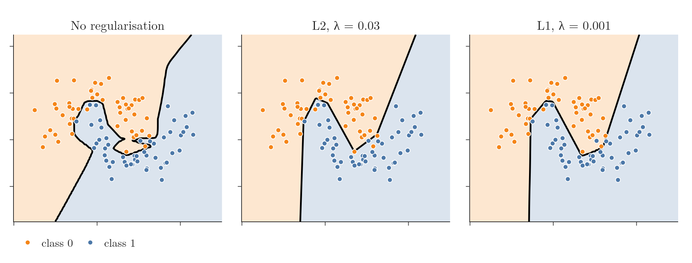
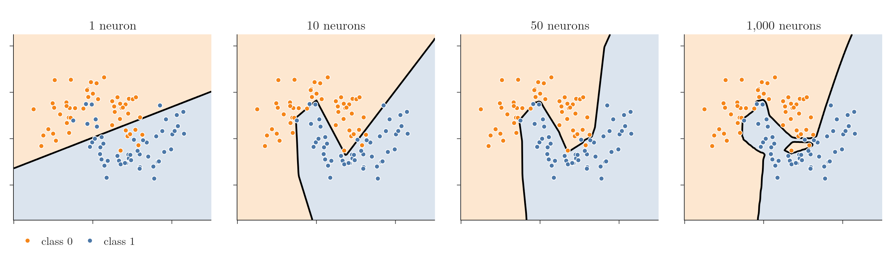
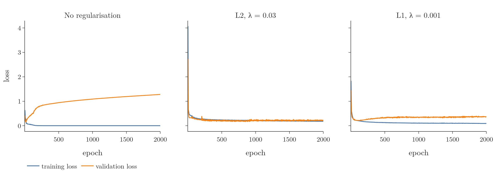
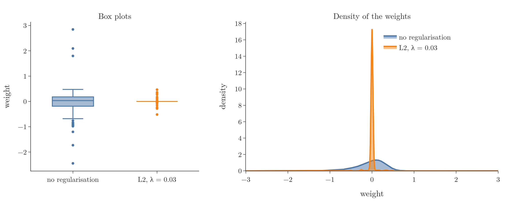

<!-- where-this-fits: generated by course_map/build_map.py; edit concepts.yaml, not this block -->
> **Where this fits:** Pipeline map steps 8 (Model), 9 (Evaluate). See the [Course map](../01-course-map/note.md).
>
> 
>
> - **Builds on:** Train-test split ([Note 13](../13-toy-project/note.md)); Vector magnitude, distance and scalar operations ([Note 361](../361-magnitude-distance-and-scalar-operations/note.md)); Multi-layer perceptron (MLP) ([Note 1009](../1009-mlp-intuition/note.md)); Gradient descent ([Note 1020](../1020-gradient-descent-in-neural-networks/note.md)).
> - **Compare with:** Polynomial regression ([Note 61](../61-polynomial-regression/note.md)); Ridge regression ([Note 66](../66-ridge-key-points/note.md)); Lasso regression ([Note 68](../68-lasso-sparsity/note.md)); Decision surface and boundary ([Note 91](../91-knn/note.md)); Underfitting ([Note 91](../91-knn/note.md)); Dropout ([Note 1025](../1025-dropout-code/note.md)).
<!-- /where-this-fits -->

## 1. Overview

> **Key point:** Adding a penalty on the size of the weights to the loss pushes every weight towards 0 at each update. The network becomes simpler and overfits less. In Keras it is one argument per layer: `kernel_regularizer`.

Regularisation was taught for linear models: Ridge adds the squared coefficients to the loss, Lasso their absolute values (see the [ridge regression Note](../63-ridge-regression-intuition/note.md) and the [Lasso Note](../67-lasso-regression/note.md)). The same idea works for neural networks, where it is used whenever a network overfits.



Figure 1 shows the effect. This Note explains why networks overfit (section 3), the ways to fight it (section 4), the penalty and why it shrinks the weights (sections 5 and 6), and the Keras code with its results (section 7). The Notebook (`notebook.ipynb`) runs every step.

## 2. Prerequisites

- The [ridge regression Note](../63-ridge-regression-intuition/note.md), the [ridge gradient descent Note](../65-ridge-gradient-descent/note.md) and the [Lasso Note](../67-lasso-regression/note.md).
- The [bias-variance Note](../62-bias-variance/note.md): overfitting and underfitting.
- The [loss functions Note](../1014-dl-loss-functions/note.md): loss versus cost function.

## 3. Why neural networks overfit

> **Key point:** Each neuron can contribute one more line to the decision boundary. With hundreds of neurons, the boundary can bend around every training point.

Overfitting means a model does very well on the training data and poorly on new data: it memorises the training data, minor patterns included, instead of learning the concept (see the [bias-variance Note](../62-bias-variance/note.md)). Like a student who learns every formula by heart without understanding: new questions in the exam go badly.

Complex models such as neural networks or very deep decision trees are prone to it, because their training aims to make no mistake on the training data. The main cause is the complexity of the network: many nodes, all connected to each other.

Figure 2 makes this concrete. A network with one hidden layer is trained on the same 100 points, with more and more neurons in that layer.



| Hidden neurons | Training accuracy | Decision boundary |
|---|---|---|
| 1 | 86% | a straight line |
| 10 | 94% | a few straight pieces |
| 50 | 96% | more pieces, following the moons |
| 1,000 | 100% | bends and pockets around single points |

One neuron can only draw one line, like a perceptron. Two neurons can draw two lines, three neurons three, and a thousand neurons have the capacity to combine a thousand lines. That capacity lets the network add pieces to the boundary just to capture single training points, as in the 1,000-neuron panel.

So one way to fix overfitting is to remove nodes. Removing does not have to be literal: if a node's weights are pushed close to 0, the node barely contributes, and the network behaves like a smaller, simpler one. This is what regularisation does.

## 4. Ways to reduce overfitting

> **Key point:** Two routes: more data (collect it, or create it by data augmentation), or a simpler model (dropout, early stopping, regularisation).

| Route | Technique | Note |
|---|---|---|
| More data | collect more rows | |
| More data | data augmentation | [uniform and log-normal Note](../261-uniform-and-log-normal/note.md) |
| Simpler model | dropout | [dropout Note](../1024-dropout/note.md) |
| Simpler model | early stopping | [early stopping Note](../1022-early-stopping/note.md) |
| Simpler model | L1, L2 or L1 + L2 regularisation | this Note |

More data helps because the network sees the bigger picture and stops focusing on small details. Data is costly, though, so we often create extra rows from existing ones: data augmentation (see the [uniform and log-normal Note](../261-uniform-and-log-normal/note.md)) makes changed copies of examples, such as cropped, flipped or rotated images of a dog. It is used with images and convolutional networks.

There are three kinds of regularisation: L1, L2, and both together. In deep learning, L2 is used almost always and usually gives better results than L1; this Note focuses on L2 and shows L1 for comparison.

## 5. The penalty term

> **Key point:** Cost = usual cost + $\lambda/(2n)$ × (sum of all squared weights). Biases are not included.

### 5.1 L2 regularisation

> **Key point:** Add the sum of every squared weight in the network, times $\lambda/(2n)$, to the cost.

Training finds the weights and biases that minimise a cost function: the average of the loss over the $n$ rows, such as the mean squared error for regression or binary cross-entropy for classification (see the [loss functions Note](../1014-dl-loss-functions/note.md)). L2 regularisation adds a penalty term to it.

1. **In words:** add the sum of the squares of all $k$ weights of the network, multiplied by $\lambda/(2n)$.
2. **Formula:**
   $$J = \frac{1}{n}\sum_{i=1}^{n} L(y_i, \hat{y}_i) + \frac{\lambda}{2n}\sum_{j=1}^{k} w_j^{2}$$
3. **Example:** a network with 10 weights $w_1$ to $w_{10}$ adds $\lambda/(2n)(w_1^2 + w_2^2 + \dots + w_{10}^2)$. With $\lambda = 0.03$, $n = 100$ rows and the weights $0.5, -1, 2$ and $0.1$ (the others 0):
   $$\frac{0.03}{200}(0.25 + 1 + 4 + 0.01) = 0.00015 \times 5.26 = 0.00079$$

Some points about this formula:

- **$\lambda$** is a hyperparameter. Larger $\lambda$ means stronger regularisation; too large, and the network moves from overfitting to underfitting. With $\lambda = 0$ the penalty vanishes and we are back to the plain cost.
- **$n$** is the number of rows. The 2 is only for convenience: it cancels when we differentiate. Some books leave it out.
- **Biases are never penalised**, only weights.

In a network the weights live in layers, so the sum is often written per layer. With $w^{(l)}_{ij}$ the weight from node $i$ of layer $l-1$ to node $j$ of layer $l$, and $L$ layers:

$$\frac{\lambda}{2n}\sum_{l=1}^{L}\sum_{i}\sum_{j}\left(w^{(l)}_{ij}\right)^{2}$$

This is the same sum, every weight squared once; it just matches how the weights are stored, which makes it the natural form in code.

### 5.2 L1 regularisation and both together

> **Key point:** L1 uses absolute values instead of squares and gives a sparse model; L1 + L2 combines both.

L1 regularisation replaces the squares with absolute values, the L1 norm of the weights:

$$J = \frac{1}{n}\sum_{i=1}^{n} L(y_i, \hat{y}_i) + \frac{\lambda}{2n}\sum_{j=1}^{k} |w_j|$$

As with Lasso, L1 can push weights to exactly 0, giving a sparse model (see the [Lasso sparsity Note](../68-lasso-sparsity/note.md)); in a network, a node whose weights are all 0 is eliminated. L2, like Ridge, makes weights small but never exactly 0 (see the [ridge key points Note](../66-ridge-key-points/note.md), section 2). Using both penalties together is the idea of Elastic Net (see the [Elastic Net Note](../69-elastic-net/note.md)).

## 6. Why the weights shrink: weight decay

> **Key point:** With the L2 penalty, every update first multiplies each weight by $1 - \eta\lambda$, a number just below 1, then takes the usual step. The weights decay towards 0.

The penalty is added to the loss, but how does that make the weights small? Look at the update of one weight $w$. For one row, the new loss is $L' = L + (\lambda/2)\sum_j w_j^2$ (no $n$, since this is the loss of a single row, not the cost). Differentiating the penalty with respect to $w$ leaves only its own term: $(\lambda/2) \cdot 2w = \lambda w$. Rearranged, the update becomes the same as for Ridge (see the [ridge gradient descent Note](../65-ridge-gradient-descent/note.md), section 2.3):

1. **In words:** first shrink the weight by the factor $1 - \eta\lambda$, then take the ordinary gradient descent step.
2. **Formula:**
   $$w_{\text{new}} = w_{\text{old}} - \eta\left(\frac{\partial L}{\partial w} + \lambda w_{\text{old}}\right) = (1 - \eta\lambda)\,w_{\text{old}} - \eta\,\frac{\partial L}{\partial w}$$
3. **Example:** with learning rate $\eta = 0.1$ and $\lambda = 0.03$, the factor is $1 - 0.1 \times 0.03 = 0.997$. A weight of 2 becomes $0.997 \times 2 = 1.994$ before the usual step is subtracted.

The second form is the update without regularisation, except that $w_{\text{old}}$ is first multiplied by $1 - \eta\lambda$. Since $\eta$ and $\lambda$ are positive, this factor is below 1, and it acts at every update of every epoch. So the weights keep moving towards 0. They get very small but never reach exactly 0.

Because the weight shrinks by a fixed factor at each step, L2 regularisation is often called weight decay in neural networks, and $1 - \eta\lambda$ the weight decay factor.

> **Extra:** Strictly, weight decay means multiplying the weights by $1 - \eta\lambda$ directly, outside the gradient. With plain gradient descent this is exactly L2 regularisation, as shown above. With Adam it is not: Adam rescales each weight's step by the size of its past gradients, which changes how strongly the penalty acts. Loshchilov and Hutter (2019) showed that true weight decay works better with Adam; Keras offers it as `keras.optimizers.AdamW`, and every Keras optimizer accepts a `weight_decay` argument.

## 7. Regularisation in Keras

> **Key point:** Pass `kernel_regularizer=regularizers.L2(0.03)` to each hidden `Dense` layer. The boundary becomes smooth, the validation loss stops rising, and the weights shrink into the range $-0.5$ to $0.5$.

### 7.1 The data and the network

> **Key point:** 100 points of `make_moons` with noise 0.25; two hidden layers of 128 ReLU nodes; 2,000 epochs.

The data is `make_moons` from scikit-learn: 100 points in two noisy half-moons. The network has an input layer of 2 nodes, two hidden layers of 128 ReLU nodes and one sigmoid output node:

| Layer | Parameters |
|---|---|
| Hidden layer 1 | $2 \times 128 + 128 = 384$ |
| Hidden layer 2 | $128 \times 128 + 128 = 16{,}512$ |
| Output layer | $128 + 1 = 129$ |
| Total | 17,025 |

Seventeen thousand parameters for 100 points: plenty of room to overfit. It is compiled with Adam (learning rate 0.01) and binary cross-entropy, and trained for 2,000 epochs, deliberately long, with `validation_split=0.2`.

### 7.2 Without regularisation

> **Key point:** 100% training accuracy, a boundary full of pockets, and a validation loss that climbs to 1.28.

The network reaches 100% training accuracy. Its boundary (Figure 1, left) twists into pockets and narrow fingers to capture single points: clear overfitting. The training curves show it too (Figure 3, left): the training loss drops to almost 0 while the validation loss rises steadily after the first few epochs, to 1.28 after 2,000 epochs.



### 7.3 With L2

> **Key point:** Only `kernel_regularizer` is new; training and validation loss now run side by side.

> **Python:** The same network with L2 regularisation.
>
> ```python
> from keras import regularizers
>
> model = keras.Sequential([
>     keras.Input(shape=(2,)),
>     keras.layers.Dense(128, activation="relu",
>                        kernel_regularizer=regularizers.L2(0.03)),
>     keras.layers.Dense(128, activation="relu",
>                        kernel_regularizer=regularizers.L2(0.03)),
>     keras.layers.Dense(1, activation="sigmoid"),
> ])
> ```
>
> The **kernel** is Keras' name for a layer's weight matrix; `kernel_regularizer` penalises the weights only, which matches the rule that biases are not penalised. A separate `bias_regularizer` exists but is rarely used.

The boundary (Figure 1, middle) is now a clean shape of a few straight pieces that follows the two moons, which should do much better on new data. In Figure 3 (middle) the training and validation curves move side by side for all 2,000 epochs:

| | Training accuracy | Validation accuracy | Final validation loss |
|---|---|---|---|
| No regularisation | 100% | 95% | 1.28 |
| L2, $\lambda = 0.03$ | 95% | 95% | 0.22 |
| L1, $\lambda = 0.001$ | 96% | 95% | 0.36 |

The validation set has only 20 points, so the accuracies are equal (19 of 20 right). The validation loss shows the difference: without regularisation the network is confidently wrong on its mistakes; with L2 it is not.

> **Extra:** Keras' `L2(0.03)` adds $0.03 \times \sum w^2$ to the loss of each batch: no $1/2$ and no $1/n$. The Notebook checks this on a small matrix: for the weights $0.5, -1, 2, 0.1$ the penalty is $0.03 \times 5.26 = 0.158$. So a Keras $\lambda$ is not the same number as the $\lambda$ of the formula in section 5; when moving a value between books and code, check which convention is used.

### 7.4 The weights shrink

> **Key point:** Without regularisation the 256 first-layer weights range from $-2.45$ to $2.85$; with L2, from $-0.52$ to $0.47$, most of them close to 0.

`model.get_weights()` returns every weight and bias array of the network. The first one, `get_weights()[0]`, holds the weights of the first hidden layer, with shape $(2, 128)$: 2 inputs times 128 nodes, 256 weights.

> **Python:** Reading the first-layer weights.
>
> ```python
> W1 = model.get_weights()[0]   # shape (2, 128)
> w = W1.reshape(256)           # one flat array of 256 weights
> w.min(), w.max()
> ```

Figure 4 compares the two networks.



| | Smallest weight | Largest weight |
|---|---|---|
| No regularisation | $-2.45$ | 2.85 |
| L2, $\lambda = 0.03$ | $-0.52$ | 0.47 |

Without regularisation, most weights lie between about $-0.7$ and $0.5$, with outliers out to $-2.45$ and $2.85$. With L2 the whole range has shrunk: the box collapses to a line at 0, and the density curve (orange) is one tall peak at 0, while the unregularised one (blue) is spread out. The weights have decayed.

> **Extra:** In this run, 92% of the L2 network's first-layer weights ended up smaller than 0.001 in size, which leaves most first-layer nodes with almost no input. With plain gradient descent, L2 only shrinks weights in proportion to their size, as section 6 shows. Adam, however, scales each weight's step by its own gradient history, so for a weight the data does not need, even the small pull of the penalty produces full-size steps towards 0. This is another face of the L2-versus-weight-decay difference behind AdamW.

### 7.5 L1

> **Key point:** Swap `L2` for `L1`; $\lambda$ needs retuning. Here $\lambda = 0.001$ works, with a little more overfitting than L2.

Switching to L1 only needs `regularizers.L1(...)` in place of `regularizers.L2(...)`. The L1 penalty needs its own value of $\lambda$, found by trying a few (hyperparameter tuning). With $\lambda = 0.001$ (Figure 1, right) the boundary is clean, but the validation loss creeps up from about epoch 100 (Figure 3, right): a little more overfitting than with L2. Its first-layer weights range from $-1.70$ to $1.17$.

> **Extra:** With Adam, L1 does not drive weights to exactly 0, as Lasso's coordinate descent does: each step overshoots 0 slightly and the weight hovers around it. Here 54% of the L1 network's first-layer weights end up below 0.001 in size. Exact zeros need a different optimizer or pruning the small weights afterwards.

## 8. Summary

| | Penalty added to the cost | Effect on weights | In deep learning |
|---|---|---|---|
| L2 | $\lambda/(2n)\sum w^2$ | shrink towards 0, never exactly 0 (weight decay) | the usual choice |
| L1 | $\lambda/(2n)\sum \lvert w \rvert$ | many exactly 0: a sparse model | less used |
| L1 + L2 | both | both | occasionally |

- Networks overfit because many neurons can draw many small pieces of boundary.
- More data, dropout, early stopping and regularisation all reduce overfitting.
- L2 regularisation multiplies every weight by $1 - \eta\lambda$ before each update; biases are not penalised.
- In Keras: `kernel_regularizer=regularizers.L2(λ)` on each hidden layer. Here it turned a validation loss of 1.28 into 0.22 and shrank the weights from $\pm 2.8$ to $\pm 0.5$.

## 9. Key terms

| Term | Meaning |
|---|---|
| Penalty term | The extra term added to the cost to discourage large weights |
| Weight decay factor | $1 - \eta\lambda$, the factor by which L2 regularisation shrinks every weight at each update |
| `kernel_regularizer` | Keras `Dense` setting that adds an L1 or L2 penalty on the layer's weights |
| Kernel | Keras' name for a layer's weight matrix |
| `get_weights` | Keras method that returns every weight and bias array of a model |
| AdamW | Adam with true weight decay applied directly to the weights, not through the loss |
