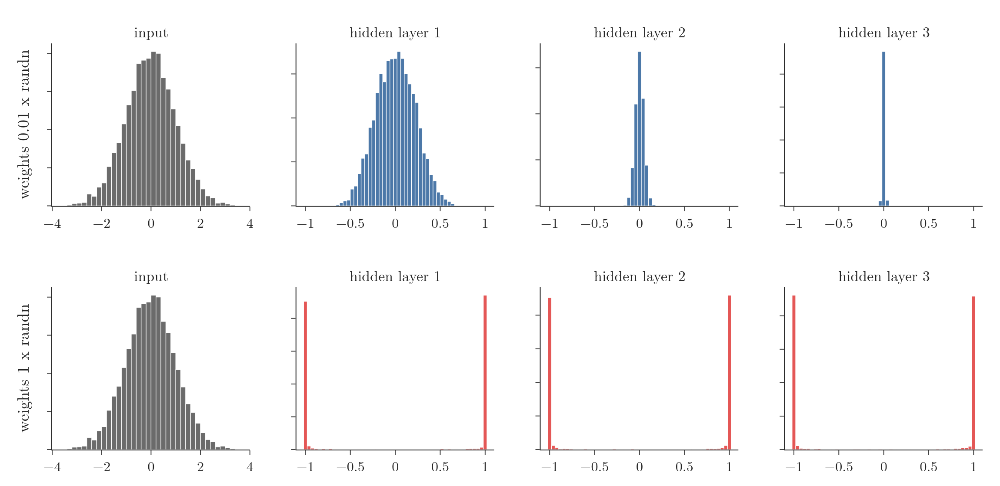
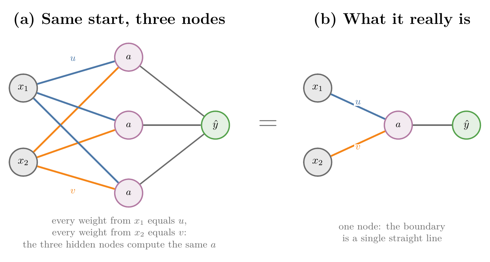
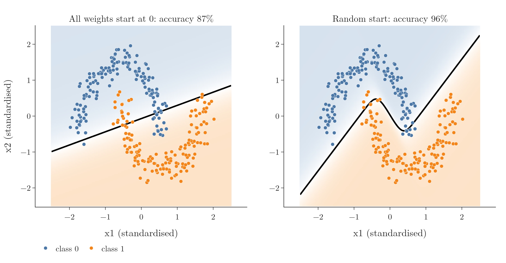
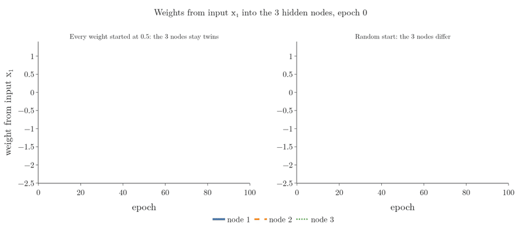
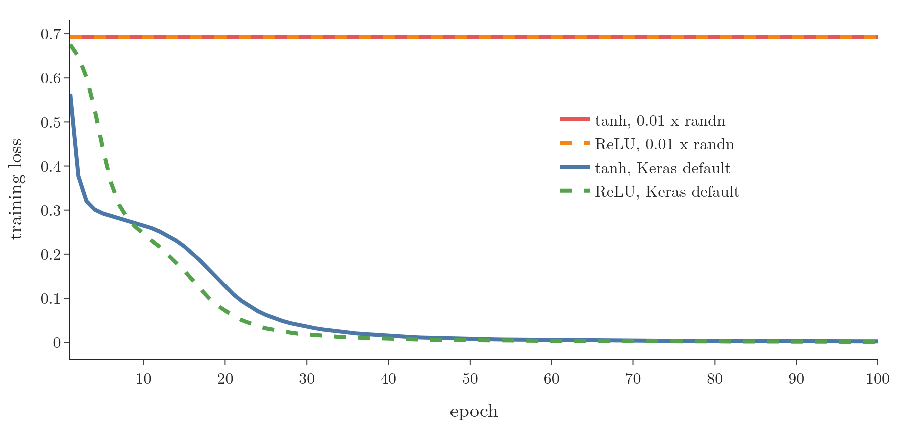

<!-- where-this-fits: generated by course_map/build_map.py; edit concepts.yaml, not this block -->
> **Where this fits:** Pipeline map step 8 (Model). See the [Course map](../01-course-map/note.md).
>
> 
>
> - **Builds on:** Backpropagation ([Note 1019](../1019-mlp-memoization/note.md)); Training curves (History) ([Note 1022](../1022-early-stopping/note.md)); Sigmoid function ([Note 1027](../1027-activation-functions/note.md)).
> - **Leads to:** Xavier and He initialisation ([Note 1030](../1030-xavier-he-initialization/note.md)); Skip connections ([Note 1054](../1054-keras-functional-api/note.md)); Recurrent neural network (RNN) ([Note 1055](../1055-why-rnn/note.md)); Long-term dependency problem ([Note 1060](../1060-problems-with-rnn/note.md)).
<!-- /where-this-fits -->

## 1. Overview

> **Key point:** The starting weights decide whether a network trains at all. Four starts fail: all zeros, one shared constant, very small random numbers and large random numbers. The weights must be random, with a spread that is neither too small nor too large.

Training a network begins with one step before the loop: giving every weight and bias a starting value, its **[initialisation](../1015-backpropagation-what/note.md)** (G-947). A bad start can cause three problems:

- the **vanishing gradient** (G-2070) problem: the early layers stop learning;
- the **exploding gradient** (G-731) problem: updates become huge and erratic;
- **slow convergence** (G-472): the network gets to a good solution only after very many **epochs** (G-696).

This Note tries the four bad starts one by one, each in Keras or numpy, and shows which problem it causes. The good starts, Xavier and He, are in the [Xavier and He initialisation Note](../1030-xavier-he-initialization/note.md).

{width=100%}

Figure 1 shows the two random starts that fail: too small, and the signal dies out; too large, and every node saturates.

## 2. Prerequisites

- The [backpropagation what Note](../1015-backpropagation-what/note.md): the training loop and its Extra on nodes that start equal.
- The [vanishing and exploding gradients Note](../1018-vanishing-exploding-gradients/note.md).
- The [activation functions Note](../1027-activation-functions/note.md): sigmoid, tanh, ReLU and saturation.

## 3. Why the starting weights matter

> **Key point:** Initialisation is step 0 of training, and it alone can decide between learning and not learning. Bad starts, with the sigmoid, stalled deep learning research for years.

Training a network repeats four steps after the start (see the [backpropagation what Note](../1015-backpropagation-what/note.md)):

0. **Initialise** every weight and bias, and choose an **optimizer** (G-1401).
1. **Forward propagation** (G-797): compute $\hat{y}$ for an input.
2. **Loss:** compare $\hat{y}$ with $y$.
3. **Gradients:** compute the derivative of the loss for every parameter.
4. **Update:** move every parameter against its gradient.

Steps 1 to 4 all start from what step 0 chose. When researchers in the 1990s and 2000s finally understood why deep networks would not train, they found two culprits behind the vanishing gradient: the sigmoid activation and badly chosen starting weights (Glorot and Bengio 2010). Research on initialisation has continued ever since.

## 4. Do not start every weight at zero

> **Key point:** With ReLU or tanh, all-zero weights never change: training does nothing. With sigmoid the weights change, but every node in a layer stays identical, so the layer acts like one node.

### 4.1 The setup

> **Key point:** Two inputs (CGPA, IQ), one hidden layer of two nodes, one output node; every weight and bias starts at 0.

Take a regression problem:

- each **observation** (G-1374; one record) is a student;
- the two **features** (G-772; input variables) are CGPA $x_1$ and IQ $x_2$;
- the **target** (G-1949; the output we predict) is the placement package in lakhs.

The network has two hidden nodes and one linear output node. Write $W_{ij}^1$ for the weight from input $i$ to hidden node $j$, so the hidden nodes compute

$$z_{11} = W_{11}^1 x_1 + W_{21}^1 x_2 + b_{11}, \qquad z_{12} = W_{12}^1 x_1 + W_{22}^1 x_2 + b_{12}$$

and output $a_{11} = g(z_{11})$, $a_{12} = g(z_{12})$. With every weight and bias at 0, both $z$ are 0 for every student.

### 4.2 ReLU and tanh: nothing moves

> **Key point:** Both give $a = 0$ at $z = 0$. Every gradient into or out of the hidden layer then contains a 0 factor, so no weight is ever updated.

With **ReLU** (G-1668), $a_{11} = \max(0, 0) = 0$; with **tanh** (G-1947), $a_{11} = \tanh(0) = (1 - 1)/(1 + 1) = 0$. The same holds for $a_{12}$. Now look at the gradients:

1. **In words:** a weight's gradient contains the signal flowing in (an activation or input) and the signal flowing back (through the weights after it). Here one of the two is always 0.
2. **Formula:** for an output weight and a hidden weight,
   $$\frac{\partial L}{\partial W_{11}^2} = \frac{\partial L}{\partial \hat{y}}\thinspace a_{11}, \qquad \frac{\partial L}{\partial W_{11}^1} = \frac{\partial L}{\partial \hat{y}}\thinspace W_{11}^2\thinspace g'(z_{11})\thinspace x_1$$
3. **Example:** $a_{11} = 0$ makes the first gradient 0, and $W_{11}^2 = 0$ makes the second 0, whatever $\partial L/\partial \hat{y}$ and $x_1$ are. So $W_{\text{new}} = W_{\text{old}} - \eta \cdot 0 = 0$.

The weights are 0 after the first update, so the same happens again, forever. Only the output bias, whose gradient is just $\partial L/\partial \hat{y}$, can move. The network predicts one constant for every input.

We check this in Keras on 300 observations of `make_moons` (G-111; two features, two classes), with two ReLU hidden nodes and a sigmoid output. We overwrite Keras' starting weights with zeros and train for 100 epochs:

- every hidden and output weight is still exactly 0;
- only the output bias moved, to $-0.0024$;
- the accuracy is 47%: every observation gets the same prediction.

Tanh gives the same numbers.

> **Extra:** For ReLU, the slope at 0 is also 0 (TensorFlow's convention, checked in the Notebook of the [activation functions Note](../1027-activation-functions/note.md)), a second zero factor. Tanh's slope at 0 is 1, not 0, so for tanh the zeros come only from $a = 0$ and the zero weights after the node. The result is the same.

> **Python:** Overwriting the starting weights.
>
> ```python
> weights = model.get_weights()   # list of arrays
> zeros = [np.zeros_like(w) for w in weights]
> model.set_weights(zeros)
> ```
>
> `get_weights()` returns every weight matrix and bias vector in order; `set_weights()` replaces them with arrays of the same shapes.

### 4.3 Sigmoid: every node becomes the same node

> **Key point:** $\sigma(0) = 0.5$, so the weights do move, but nodes that start equal get equal gradients and stay equal. Ten hidden nodes act like one, and the decision boundary is a straight line.

With the **sigmoid** (G-1798), $a_{11} = a_{12} = \sigma(0) = 0.5$. The activations are no longer 0, so the output weights get non-zero gradients and training starts. The problem is that the two activations are equal, and stay equal.

Compare the gradients of the two weights leaving $x_1$, by the **chain rule** (G-371):

$$\frac{\partial L}{\partial W_{11}^1} = \frac{\partial L}{\partial \hat{y}} \cdot \frac{\partial \hat{y}}{\partial a_{11}} \cdot \frac{\partial a_{11}}{\partial z_{11}} \cdot x_1, \qquad \frac{\partial L}{\partial W_{12}^1} = \frac{\partial L}{\partial \hat{y}} \cdot \frac{\partial \hat{y}}{\partial a_{12}} \cdot \frac{\partial a_{12}}{\partial z_{12}} \cdot x_1$$

- The first factor is shared.
- $\partial \hat{y}/\partial a_{11} = W_{11}^2$ and $\partial \hat{y}/\partial a_{12} = W_{12}^2$, which start equal and receive equal updates.
- $z_{11} = z_{12}$, so the sigmoid slopes are equal.
- The last factor is $x_1$ in both.

So the two gradients are equal at every step. Think of two identical twins who sit the same lessons, hear the same feedback and make the same corrections: nothing ever makes them differ. The two weights from $x_1$ start equal and move together; so do the two weights from $x_2$. Equal gradients for equal weights are the symmetry (the **symmetry problem**, G-1933) noted in the Extra of section 7.2 of the [backpropagation what Note](../1015-backpropagation-what/note.md): nodes that start identical stay identical.

{width=90%}

Figure 2 shows the consequence. However many nodes the layer has, they compute the same thing, so the network behaves like one with a single hidden node. A single sigmoid node has a straight **decision boundary** (G-555), the line where the predicted class changes:

1. the output $\sigma(w\thinspace a + b)$, with $a = \sigma(u x_1 + v x_2 + c)$, only grows or only shrinks as $u x_1 + v x_2$ grows;
2. so the output crosses 0.5 where $u x_1 + v x_2$ equals one constant;
3. that set of points, $u x_1 + v x_2 = \text{constant}$, is a straight line, and it is the decision boundary.

The network is in effect a **perceptron** (G-1486): a linear model that cannot capture non-linear patterns.

The Notebook trains a layer of 10 sigmoid nodes from all zeros for 200 epochs. Afterwards:

- all 10 weights from $x_1$ are 0.436, and all 10 weights from $x_2$ are $-1.186$;
- all 10 biases are $-0.822$;
- the decision boundary is a straight line, with 87% accuracy (Figure 3, left).

The same network with Keras' random start bends around the moons and reaches 96% (Figure 3, right).

{width=100%}

## 5. Do not start every weight at the same non-zero value

> **Key point:** Starting all weights at 0.5 avoids the zeros but not the symmetry: with ReLU, tanh or sigmoid, every node in a layer stays identical and the network stays linear.

Starting every weight and bias at a non-zero constant, say 0.5, removes the zeros of section 4.2. With ReLU,

$$z_{11} = 0.5\thinspace x_1 + 0.5\thinspace x_2 + 0.5 = z_{12}$$

is now some non-zero value, so $a_{11} = a_{12} \ne 0$. But the two are equal, which is exactly the situation of section 4.3. Every weight leaving one input gets the same gradient, the nodes stay identical, and the layer acts like one node.

The stuck classifier in section 8 of the [backpropagation how Note](../1016-backpropagation-how/note.md), where every weight starts at 0.1, is this same problem.

The Notebook confirms it with 3 hidden nodes and 100 epochs:

| Activation | Weights from $x_1$ | Weights from $x_2$ | Accuracy |
|---|---|---|---|
| ReLU | 0.312, 0.312, 0.312 | $-0.842$, $-0.842$, $-0.842$ | 88% |
| Tanh | 0.192, 0.192, 0.192 | $-0.544$, $-0.544$, $-0.544$ | 88% |
| Sigmoid | 0.744, 0.744, 0.744 | $-2.062$, $-2.062$, $-2.062$ | 88% |

Figure 4 follows the ReLU row of the table through training, next to the same network with Keras' random start.



- **Started at 0.5 (left).** The three weights rise to about 1, fall back and settle at 0.312. They move as one line from the first epoch to the last, because at every step the three nodes receive the same gradient.
- **Random start (right).** The three weights start at different values, receive different gradients and end at $-2.27$, $-0.13$ and 0.19: three nodes doing three different jobs.

The network trains, but only as a linear model. Sections 4 and 5 together lead to one rule: every weight must start at a different value. The way to get that is to draw the starting weights at random.

## 6. Do not use very small random weights

> **Key point:** Random weights of about $\pm 0.01$ make every weighted sum tiny. With tanh and sigmoid the gradients vanish; with ReLU the network converges extremely slowly.

### 6.1 The signal shrinks layer by layer

> **Key point:** 500 inputs times weights of about 0.01 give $z$ close to 0. Tanh keeps it close to 0, and each layer shrinks it further: the standard deviation goes 0.21, 0.048, 0.011.

Take a dataset with 1000 observations and 500 features, each feature a standardised number (mean 0, **standard deviation** (G-1871) 1). The network has three hidden layers of 500 nodes. Every weight is drawn as `np.random.randn(500, 500) * 0.01`, a **standard normal** (G-1873) number times 0.01, and every bias is 0.

Each node computes $z = \sum_{i=1}^{500} w_i x_i$. With inputs around $\pm 1$ and weights around $\pm 0.01$, the products are tiny and partly cancel, so $z$ is small. Tanh of a small number is about the number itself, so the activations are close to 0.

Figure 1 (top row) shows the **histograms** (G-899). The input has standard deviation 1; the activations of hidden layers 1, 2 and 3 have standard deviations 0.21, 0.048 and 0.011. In layer 3, 66% of the activations lie between $-0.01$ and 0.01.

The next layer multiplies these small activations by small weights again, so every layer is smaller than the one before. During backpropagation many such small numbers multiply into the gradients, and the gradients of the early layers become close to 0. The result is the [vanishing gradient problem](../1018-vanishing-exploding-gradients/note.md), caused here by the start alone.

### 6.2 The three activations

> **Key point:** Tanh: strong vanishing gradients. Sigmoid: weaker, but training is very slow. ReLU: no saturation, but convergence is extremely slow.

- **Tanh:** the activations collapse towards 0, as just shown; the gradients vanish strongly, and the weights may not update at all.
- **Sigmoid:** $\sigma(0) = 0.5$, so the activations cluster around 0.5 (standard deviation 0.055, then 0.027), not around 0. The vanishing gradient is weaker than with tanh, but training is very slow or stalls.
- **ReLU:** the activations also shrink (standard deviation 0.131, 0.021, 0.003), though ReLU does not squash them. The gradients do not vanish as strongly, but convergence is extremely slow: in section 6.3 a small ReLU network started this way does not move in 100 epochs.

The problem gets worse with depth. A shallow network has few factors to multiply; a deep one has many.

### 6.3 In Keras: the weights do not move

> **Key point:** Four hidden layers of 10 nodes, weights 0.01 × standard normal, plain SGD: the loss stays at 0.6934 for 100 epochs and the weights match their start to four decimals. Keras' default start reaches a loss of 0.002.

The Notebook builds four hidden layers of 10 nodes on the moons data, with tanh or ReLU, starts every weight at 0.01 times a standard normal number and every bias at 0, and trains with plain **SGD** (G-1892; **learning rate** (G-1068) 0.1) for 100 epochs:

- **Tanh:** the loss is 0.6934 at the start and 0.6934 at the end, the loss of guessing. The first-layer weights read $0.0035, 0.0082, 0.0033, -0.0130$ before and after, identical to four decimals. Accuracy 47%.
- **ReLU:** exactly the same picture.
- **Keras' default start,** same networks: the loss falls to 0.002 (tanh) and 0.001 (ReLU), with 100% accuracy.

{width=85%}

Figure 5 shows the four loss curves. The only difference between the flat and the falling ones is the starting weights.

> **Extra:** With the **Adam** (G-169) optimizer (learning rate 0.01) instead of plain SGD, the tanh network does learn (loss 0.27, accuracy 87%) while the ReLU network stays stuck at 0.693. Adam divides each step by the recent size of that weight's gradients, so the step size does not depend on how small the gradients are (Kingma and Ba 2015). Adam therefore hides the vanishing gradient in the weights, as the Extra in section 4.3 of the [vanishing gradients Note](../1018-vanishing-exploding-gradients/note.md) explains, but does not always rescue training.

## 7. Do not use large random weights

> **Key point:** Weights around $\pm 1$ make $z$ a sum of 500 sizeable terms. Tanh and sigmoid saturate, causing slow training or vanishing gradients; ReLU passes the large values on, causing exploding gradients and unstable training.

Now draw the weights without the factor 0.01: `np.random.randn(500, 500)`, mostly between $-3$ and 3. (Uniform numbers between 0 and 1 cause the same problem: in the Notebook, 84%, 99% and 100% of the tanh outputs of layers 1, 2 and 3 lie beyond $\pm 0.99$.) In deep learning these count as large weights.

1. **In words:** $z$ adds up 500 products of inputs around $\pm 1$ and weights around $\pm 1$.
2. **Formula:** $z = \sum_{i=1}^{500} w_i x_i$
3. **Example:** if each product were about 0.5 and they did not cancel, $z$ would be about $500 \times 0.5 = 250$. With cancellation, the variance rule $\text{Var}(z) = n\thinspace\text{Var}(w)\thinspace\text{Var}(x)$ (derived in section 3.3 of the [Xavier and He Note](../1030-xavier-he-initialization/note.md)) gives $\text{Var}(z) = 500$, a standard deviation of $\sqrt{500} \approx 22$: $z$ typically lands in the tens.

**Tanh and sigmoid saturate.** Feeding $z$ of 20 or 50 into tanh gives $-1$ or 1; into the sigmoid, 0 or 1. Figure 1 (bottom row) shows it: in every hidden layer the tanh activations pile up at $-1$ and 1. In layer 3, 90% of them are beyond $\pm 0.99$. At these values the slope is almost 0, so training is slow at best, and in the worst case the gradient vanishes.

**ReLU explodes.** ReLU does not saturate on the positive side: if $z = 250$, the output is 250. The large values pass on and grow. In the Notebook the mean ReLU activation is 8.9 in layer 1, 140 in layer 2 and 2,224 in layer 3. The chain that follows:

1. large activations give large gradients;
2. large gradients give huge jumps in **gradient descent** (G-862);
3. the weights swing back and forth without settling.

This is the [exploding gradient problem](../1018-vanishing-exploding-gradients/note.md).

Figure 6 follows the tanh signal through 10 layers of the same wide network instead of 3. Watch the three rows split apart:

- with $0.01 \times$ randn, the values close in on 0, about 4 times tighter at every layer;
- with $1 \times$ randn, they sit at $-1$ and 1 from the first layer on;
- only the middle spread, $\text{randn}/\sqrt{500}$, keeps them in between.

That middle start is **Xavier initialisation** (G-2131), derived in the [Xavier and He initialisation Note](../1030-xavier-he-initialization/note.md).

{width=100% height=62%}

## 8. Summary

| Start | ReLU | Tanh | Sigmoid |
|---|---|---|---|
| All zeros | no training (weights stay 0) | no training (weights stay 0) | nodes stay identical: linear model |
| One constant (0.5) | nodes identical: linear model | nodes identical: linear model | nodes identical: linear model |
| Small random ($0.01 \times$ randn) | extremely slow convergence | vanishing gradient | vanishing gradient, very slow |
| Large random ($1 \times$ randn) | exploding gradient, unstable | saturation: slow or vanishing | saturation: slow or vanishing |

- Weights must start different from each other, so they must be random.
- Their spread must be neither too small (the signal dies out) nor too large (it saturates or explodes).
- In the moons experiments: zeros leave every weight at 0 (47%); a sigmoid layer started at zeros acts as one node (87%, straight line); 0.01-scale weights keep the loss at 0.693 with plain SGD.
- Choosing that spread well is the job of Xavier and He initialisation.

## 9. Sources

**Built from**

- CampusX, "Weight Initialization Techniques | What not to do? | Deep Learning", YouTube, https://www.youtube.com/watch?v=2MSY0HwH5Ss

**Other references**

- Glorot, X. and Bengio, Y. (2010). Understanding the difficulty of training deep feedforward neural networks. AISTATS 2010, PMLR 9:249-256.
- Kingma, D. P. and Ba, J. (2015). Adam: A Method for Stochastic Optimization. ICLR 2015. arXiv:1412.6980.

## 10. Key terms

| Term | Meaning |
|---|---|
| Observation | One record of the data: one row of the data table |
| Feature | An input variable, such as CGPA: one column of the data table |
| Target | The output we predict, such as the placement package |
| Zero initialisation | Starting every weight (and bias) at 0; with ReLU or tanh nothing trains |
| Symmetry problem | Nodes that start with equal weights get equal updates and stay identical, so a layer acts like one node |
| Slow convergence | Reaching a good solution only after very many epochs |
| `get_weights()` / `set_weights()` | Keras methods that read and replace a model's weight and bias arrays |
