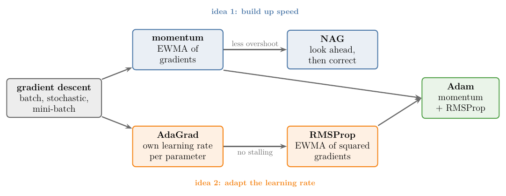
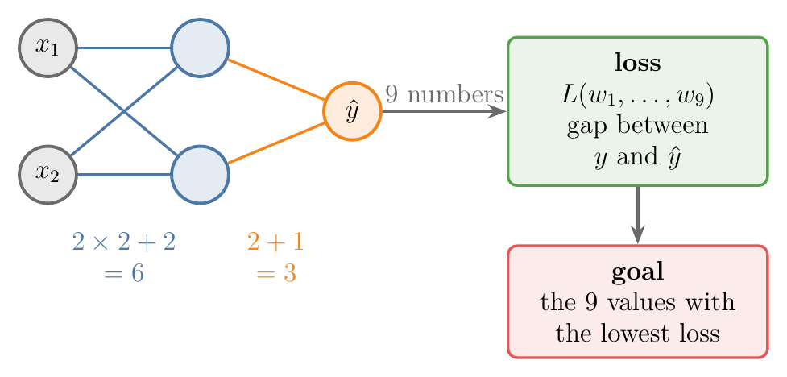
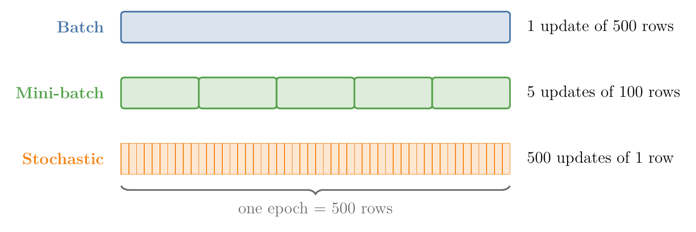
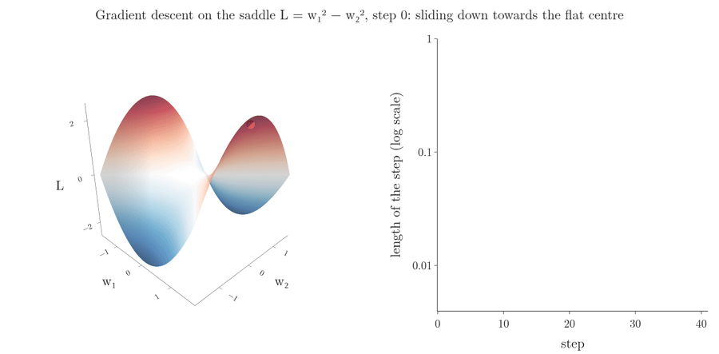
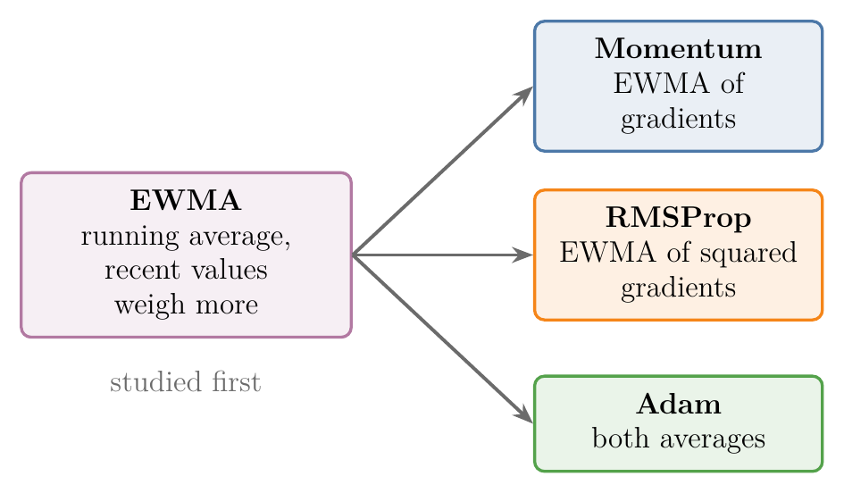

<!-- where-this-fits: generated by course_map/build_map.py; edit concepts.yaml, not this block -->
> **Where this fits:** Pipeline map step 8 (Model). See the [Course map](../01-course-map/note.md).
>
> 
>
> - **Builds on:** Convex sets and convex optimisation ([Note 621](../621-convex-sets-and-functions/note.md)); Backpropagation ([Note 1019](../1019-mlp-memoization/note.md)); Gradient descent ([Note 1020](../1020-gradient-descent-in-neural-networks/note.md)); Mini-batch gradient descent ([Note 1020](../1020-gradient-descent-in-neural-networks/note.md)).
> - **Leads to:** SGD with momentum ([Note 1034](../1034-sgd-with-momentum/note.md)); Nesterov accelerated gradient (NAG) ([Note 1035](../1035-nesterov-accelerated-gradient/note.md)); AdaGrad ([Note 1036](../1036-adagrad/note.md)); RMSProp ([Note 1037](../1037-rmsprop/note.md)); Adam ([Note 1038](../1038-adam/note.md)).
<!-- /where-this-fits -->

## 1. Overview

> **Key point:** An optimizer is the rule that turns gradients into weight updates. Plain gradient descent has five weak spots: choosing the learning rate, fixed learning-rate schedules, one learning rate for every direction, local minima and saddle points. The improved optimizers fix them with two ideas: build up speed, and adapt the learning rate.

Training a deep network can take a long time, so a lot of work goes into making it faster. Three techniques already help:

- good [weight initialisation](../1030-xavier-he-initialization/note.md) (G-947);
- [batch normalisation](../1031-batch-normalization/note.md) (G-266);
- the choice of [activation function](../1027-activation-functions/note.md) (G-165).

The fourth, and probably the most important for speed, is the **optimizer** (G-1401): the algorithm that finds the values of the weights and biases for which the loss is smallest.

{width=100%}

Figure 1 is the plan. Each optimizer is a small change to gradient descent, not something new from scratch. Several of them rely on one tool, the **exponentially weighted moving average** (G-735), which comes first.

## 2. Prerequisites

- The [backpropagation why Note](../1017-backpropagation-why/note.md): the loss as a function of all the weights, and the update rule.
- The [gradient descent in neural networks Note](../1020-gradient-descent-in-neural-networks/note.md): batch, stochastic and mini-batch gradient descent in a network.
- The [gradient descent Note](../57-gradient-descent/note.md): the learning rate and the contour plot.

## 3. What an optimizer does

> **Key point:** Training is an optimisation problem: find the weights and biases that make the loss smallest. We start from random values and improve them step by step.

Take a classification task with two input **features** (G-772; input variables, the columns of the data table) and one **target** (G-1949; the output we predict). A network with one hidden layer of 2 nodes and one output node has $2 \times 2 + 2 = 6$ parameters in the hidden layer and $2 + 1 = 3$ in the output: 9 weights and biases in all (Notebook).

{width=85%}

Figure 2 shows the whole job of an optimizer: 9 numbers go in, one loss comes out, and we want the lowest loss.

Training must find values of these 9 numbers for which the network's predictions $\hat{y}$ are as close as possible to the true values $y$. The loss measures the gap between $y$ and $\hat{y}$, so training is an **optimisation problem** (G-1399): minimise the loss. The weights and biases at the minimum are the network's best parameters.

The loss is a function of all 9 parameters, so its graph lives in 10 dimensions, which we cannot draw. With only 2 weights it becomes a surface over the $(w_1, w_2)$ plane: we start at a random point and walk downhill to the lowest point, the **global minimum** (G-848; see section 3 of the [backpropagation why Note](../1017-backpropagation-why/note.md)).

## 4. Gradient descent, the optimizer so far

> **Key point:** $w_{\text{new}} = w_{\text{old}} - \eta\thinspace\nabla_w L$, repeated over many epochs. Batch, stochastic and mini-batch gradient descent differ only in how many rows they see before each update.

The optimizer used so far is **gradient descent** (G-862):

$$w_{t+1} = w_t - \eta\thinspace\nabla_w L(w_t)$$

where $\eta$ (eta) is the **learning rate** (G-1068) and $\nabla_w L$ the **gradient** (G-863) of the loss with respect to the weights (see the [gradient descent Note](../57-gradient-descent/note.md)). We repeat the update for a chosen number of **epochs** (G-696; full passes over the training data).

Its three variants differ only in the number of rows used for each update (see the [gradient descent in neural networks Note](../1020-gradient-descent-in-neural-networks/note.md)). With 500 rows and 10 epochs:

| Variant | Rows per update | Updates in 10 epochs |
|---|---|---|
| Batch | all 500 | 10 |
| Stochastic (SGD) | 1 | 5,000 |
| Mini-batch, batch size 100 | 100 | 50 |

{width=90%}

Figure 3 shows that the three variants see the same rows per epoch; only the number of updates changes.

So we already have three optimizers. The next section explains why we need more.

## 5. Five weak spots of plain gradient descent

> **Key point:** Gradient descent is hard to tune (learning rate, schedule), treats every direction the same, and can get stuck at local minima and saddle points. Training then becomes slow, or ends at a poor solution.

These five challenges are the standard list for plain mini-batch gradient descent (Ruder 2016, §3).

### 5.1 Choosing the learning rate

> **Key point:** Too small a learning rate converges painfully slowly; too large a one overshoots, oscillates or diverges. The right value depends on the data.

Every update subtracts $\eta$ times the gradient, so $\eta$ sets the size of every step (see section 5 of the [gradient descent Note](../57-gradient-descent/note.md)):

- **Too small:** every step is tiny and **convergence** (G-472) is painfully slow; training may stop before reaching the minimum.
- **Too large:** the steps jump over the minimum, the path zigzags, and the loss can grow without limit.

A value in between works best, but finding it for a given dataset takes trial and error (Ruder 2016, §3).

### 5.2 Learning-rate schedules are fixed in advance

> **Key point:** A schedule lowers the learning rate during training, but its timetable is fixed before training starts, so it cannot adapt to the dataset.

A **learning-rate schedule** (G-1070) changes the learning rate during training, usually lowering it after a set number of epochs or when the loss stops improving by a threshold (see section 6 of the [stochastic gradient descent Note](../59-stochastic-gradient-descent/note.md)). The schedule and the thresholds must be defined before training. Different datasets need different schedules, so a schedule that works well on one dataset may fail on another (Ruder 2016, §3).

### 5.3 One learning rate for every direction

> **Key point:** All parameters share one learning rate. When the loss is steep in one direction and flat in another, a rate safe for the steep direction is far too slow for the flat one.

With 9 parameters, the loss surface has 9 directions to move in. Gradient descent uses the same $\eta$ for all of them, so it descends at the same "speed setting" in every direction. We cannot give $w_1$ one learning rate and $w_2$ another.

The loss is often very sensitive to some directions and insensitive to others (Goodfellow et al. 2016, §8.5). Take a narrow valley,

$$L(w_1, w_2) = \tfrac{1}{2}\left(w_1^2 + 100\thinspace w_2^2\right)$$

which is 100 times steeper across ($w_2$) than along ($w_1$). Each gradient descent step multiplies $w_1$ by $1 - \eta$ and $w_2$ by $1 - 100\eta$. So $w_2$ only shrinks if $|1 - 100\eta| < 1$, that is $\eta < 0.02$; with such a small $\eta$, $w_1$ shrinks by just 2% per step.

{width=95% height=60%}

Figure 4 and the Notebook show the trap. Steps needed to bring the loss below 0.01:

| $\eta$ | 0.002 | 0.005 | 0.01 | 0.019 | 0.02 or more |
|---|---|---|---|---|---|
| Steps | 2,128 | 850 | 424 | 223 | never |

Even the best learning rate needs 223 steps, all because the steep direction caps $\eta$ while the flat direction needs large steps. Plain gradient descent cannot go fast in one direction and slow in another.

### 5.4 Local minima

> **Key point:** A network's loss has many dips. Gradient descent stops in the first one it reaches, which may be a local minimum with a worse loss than the global one.

The loss of a neural network is non-convex (a **non-convex function**, G-1333): it has several minima (see the [convex and non-convex cost functions Note](../590-convex-and-non-convex-cost-functions/note.md)). The best solution is the **global minimum**, the weights with the lowest loss of all. Gradient descent stops wherever the slope is zero, so starting from an unlucky point it settles in a **local minimum** (G-1110) and returns a sub-optimal solution. Stochastic gradient descent's zigzag gives it some chance to jump out; batch and mini-batch gradient descent have less (see the [gradient descent in neural networks Note](../1020-gradient-descent-in-neural-networks/note.md)).

### 5.5 Saddle points

> **Key point:** At a saddle point the surface rises in one direction and falls in another. The slope there is zero and nearly zero on a wide plateau around it, so the updates almost stop.

A **saddle point** (G-1718) is a point where the surface slopes up in one direction and down in another (see section 5.3 of the [Hessian Note](../603-hessian-and-multivariate-taylor/note.md)). At the saddle itself the gradient is zero, so the update $w_{t+1} = w_t - \eta \times 0$ leaves the weights unchanged. Saddle points are usually surrounded by a **plateau** (G-1503) where the gradient is close to zero in every direction, so gradient descent crawls there for a long time even though the point is not a solution (Ruder 2016, §3).

Figure 5 shows the crawl on the simplest saddle, $L = w_1^2 - w_2^2$, which rises along $w_1$ and falls along $w_2$. Gradient descent starts at $(1.5, 0.001)$, almost exactly on the ridge, with learning rate 0.1.

{width=100%}

1. **Steps 1 to 10:** the path runs down the ridge towards the centre. Each step is shorter than the last, because the slope along $w_1$ shrinks.
2. **Around step 19:** the path is at the flat centre. The step length has fallen from 0.30 to 0.008, about 40 times shorter, and 17 of the 40 steps are shorter than a tenth of the first one.
3. **After step 30:** the small slope along $w_2$ has slowly grown, and the path slides off the saddle towards lower loss.

The saddle did not stop gradient descent, but most of the steps were spent on the plateau making almost no progress.

> **Extra:** For deep networks, saddle points may be a bigger obstacle than local minima: Dauphin et al. (2014) argue that in high dimensions most points with zero gradient are saddles, not minima (cited in Ruder 2016, §3; see also Goodfellow et al. 2016, §8.2.3).

### 5.6 What goes wrong as a result

> **Key point:** Training is either very slow, or it ends at a poor solution.

Because of these weak spots, plain gradient descent either trains slowly (a tiny learning rate, a flat direction, a plateau) or stops at a worse solution than it could reach (a local minimum). The optimizers that follow are designed to do better on both counts.

## 6. The optimizers ahead

> **Key point:** Momentum, NAG, AdaGrad, RMSProp and Adam. Each is a small change to the gradient descent update, and most of them use an exponentially weighted moving average.

Five optimizers improve gradient descent along the two ideas of Figure 1:

| Optimizer | Main idea | Weak spot it targets |
|---|---|---|
| [Momentum](../1034-sgd-with-momentum/note.md) | keep a running average of past gradients and build up speed | flat directions, narrow valleys, small local dips |
| [Nesterov accelerated gradient (NAG)](../1035-nesterov-accelerated-gradient/note.md) | momentum that looks ahead before it corrects | momentum's overshooting |
| [AdaGrad](../1036-adagrad/note.md) | a separate, shrinking learning rate for every parameter | one learning rate for every direction |
| [RMSProp](../1037-rmsprop/note.md) | AdaGrad that forgets old gradients | AdaGrad's learning rate shrinking to nothing |
| [Adam](../1038-adam/note.md) | momentum and RMSProp together | both |

Momentum, RMSProp and Adam all keep an [exponentially weighted moving average](../1033-exponentially-weighted-moving-average/note.md) (EWMA): a running average that gives recent values more weight. We study the EWMA first.

{width=80%}

Figure 6 shows why the EWMA comes first: three of the five optimizers are built on it.

> **Extra:** Methods that use second derivatives, such as **Newton's method** (G-1321), can also handle steep and flat directions (see the [Hessian Note](../603-hessian-and-multivariate-taylor/note.md)), but they are too expensive for the millions of parameters of a deep network (Ruder 2016, §4). The optimizers above use only the gradient.

## 7. Summary

| Weak spot of gradient descent | What happens | Fixed by |
|---|---|---|
| Choosing the learning rate | too small: slow; too large: unstable | adaptive learning rates (AdaGrad, RMSProp, Adam) |
| Fixed schedules | cannot adapt to the dataset | adaptive learning rates |
| One learning rate for all directions | slow along flat directions of a narrow valley | momentum; per-parameter rates |
| Local minima | stops at a sub-optimal solution | momentum (can roll through small dips) |
| Saddle points | updates almost stop on the plateau | momentum, adaptive learning rates |

- An optimizer finds the weights and biases that minimise the loss; gradient descent is the basic one.
- Batch, stochastic and mini-batch gradient descent differ only in the rows per update.
- The steep direction of a narrow valley caps the learning rate; the flat direction then crawls: 223 steps at best on our valley.
- The improved optimizers use two ideas: build up speed (momentum, NAG) and adapt the learning rate (AdaGrad, RMSProp); Adam uses both.
- Most of them rely on the exponentially weighted moving average.

## 8. Sources

**Built from**

- CampusX, "Optimizers in Deep Learning | Part 1 | Complete Deep Learning Course", YouTube, https://www.youtube.com/watch?v=iCTTnQJn50E

**Other references**

- Goodfellow, I., Bengio, Y. and Courville, A. (2016). *Deep Learning*. MIT Press. §8.2.3 (saddle points), §8.5 (algorithms with adaptive learning rates).
- Ruder, S. (2016). An overview of gradient descent optimization algorithms. arXiv:1609.04747. §3 (challenges), §4 (algorithms).
- Dauphin, Y., Pascanu, R., Gulcehre, C., Cho, K., Ganguli, S. and Bengio, Y. (2014). Identifying and attacking the saddle point problem in high-dimensional non-convex optimization. NeurIPS 2014.

## 9. Key terms

| Term | Meaning |
|---|---|
| Optimizer | The algorithm that turns the gradients into weight updates to minimise the loss, such as gradient descent or Adam |
| Optimisation problem | Finding the inputs (here the weights and biases) that make a function (here the loss) smallest |
| Feature | An input variable: one column of the data table |
| Target | The output we predict |
| Learning-rate schedule (G-1070) | A plan, fixed before training, for lowering the learning rate during training |
| Global minimum | The point with the lowest loss of all |
| Local minimum | A point lower than everything around it, but not the lowest overall |
| Saddle point | A point where the surface rises in one direction and falls in another; the gradient there is zero |
