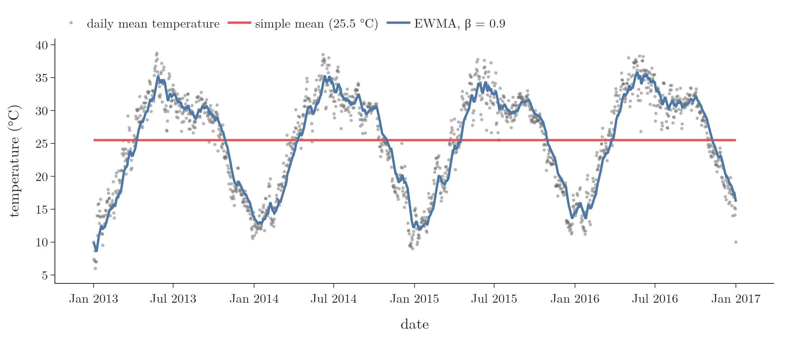
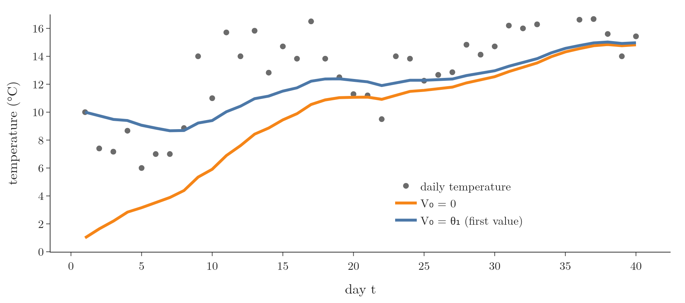
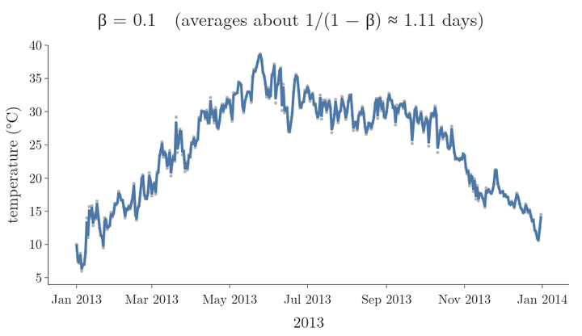
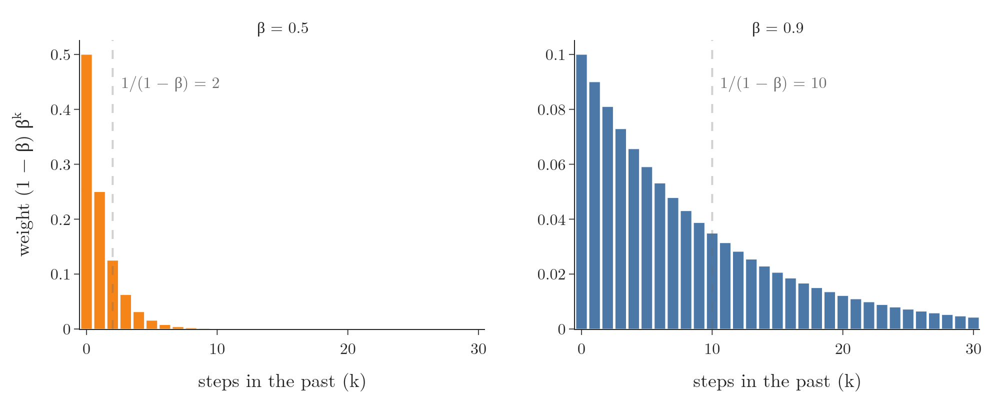

## 1. Overview

> **Key point:** An exponentially weighted moving average keeps one running number and updates it with every new value: $V_t = \beta V_{t-1} + (1-\beta)\thinspace\theta_t$. Recent values count most, old values fade away, and $\beta$ sets how fast they fade.

The **exponentially weighted moving average** (EWMA) is a technique for finding the trend hidden in a time series: data recorded one value after another in time, such as the daily temperature of a city or the daily price of a share. It smooths away the day-to-day noise and keeps the slow pattern.

{width=100%}

Figure 1 shows the difference. The simple mean of all 1,462 days, 25.5 °C, says nothing about summer or winter. The EWMA follows the rise and fall of every year.

EWMA is used in time series forecasting, in finance and in signal processing. In deep learning it is the building block of the improved optimizers: momentum, RMSProp and Adam all keep an EWMA of the gradients, and batch normalisation keeps one of each node's mean and variance (see the [batch normalisation Note](../1031-batch-normalization/note.md)).

## 2. Prerequisites

- The [measures of central tendency Note](../221-measures-of-central-tendency/note.md): the simple mean.
- The [optimizers Note](../1032-optimizers-in-deep-learning/note.md): why deep learning needs better optimizers, which use the EWMA.

## 3. Two rules behind the EWMA

> **Key point:** A newer value always gets more weight than an older one, and the weight of any given value keeps shrinking as time passes.

Take the temperature recorded day by day: day 1, day 2, day 3 and so on. The EWMA follows two rules.

1. **Newer values count more.** On day 3, the value of day 3 gets more weight than the value of day 1, because it came later.
2. **Every value fades with time.** When days 4 and 5 arrive, day 3 is no longer the newest. Its weight drops, and it keeps dropping every day after.

The formula in section 4 is built to obey exactly these two rules. Section 6 proves it does.

## 4. The formula

> **Key point:** Today's average is a mix of yesterday's average (weight $\beta$) and today's value (weight $1 - \beta$).

1. **In words:** keep most of the previous average and mix in a small part of the new value. $V_t$ is the EWMA at time $t$, $\theta_t$ (theta) is the value recorded at time $t$, and $\beta$ (beta) is a constant between 0 and 1.
2. **Formula:**
   $$V_t = \beta\thinspace V_{t-1} + (1 - \beta)\thinspace\theta_t$$
3. **Example:** two days with $\theta_1 = 13$ and $\theta_2 = 17$, with $\beta = 0.9$ and the start $V_0 = 0$:
   $$V_1 = 0.9 \times 0 + 0.1 \times 13 = 1.3$$
   $$V_2 = 0.9 \times 1.3 + 0.1 \times 17 = 1.17 + 1.7 = 2.87$$
   We carry on in the same way for $V_3, V_4, \dots$ up to the last day, and join the points to draw the curve.

$\beta = 0.9$ is the usual value in deep learning optimizers (Ruder 2016, §4.1), and the one we use throughout.

### 4.1 Where to start: $V_0$

> **Key point:** Starting at $V_0 = 0$ drags the first values towards 0. Starting at the first value, $V_0 = \theta_1$, avoids that.

The formula needs a value before the first day, $V_0$. Two choices are common:

- $V_0 = 0$: in the example above, $V_1 = 1.3$ and $V_2 = 2.87$, far below temperatures of 13 and 17.
- $V_0 = \theta_1$, the first value itself: then $V_1 = 0.9 \times 13 + 0.1 \times 13 = 13$ and $V_2 = 0.9 \times 13 + 0.1 \times 17 = 13.4$.

The second choice gives more accurate values at the start, so it is the one we prefer.

{width=90%}

On the Delhi data (Figure 2), the zero start reads 1.0 °C on a day of 10 °C. The two curves still differ by 3.5 °C on day 10 and 1.2 °C on day 20, and only agree within 0.1 °C from day 44 on (Notebook). The zero start's error shrinks by a factor $\beta$ every day, so it fades, but slowly.

> **Extra:** Optimizers start their averages at 0, so they face exactly this start-up error. Adam removes it with a correction factor (see the [Adam Note](../1038-adam/note.md)). Time series books call the starting value $\ell_0$ and estimate it from the data (Hyndman and Athanasopoulos 2021, §8.1).

## 5. The effect of $\beta$

> **Key point:** Large $\beta$ trusts the past: a smooth, slow curve. Small $\beta$ trusts today: a spiky curve that follows every value. The EWMA behaves roughly like an average of the last $1/(1-\beta)$ values.

A handy way to think about $\beta$: the EWMA behaves roughly like a plain average of the last $1/(1-\beta)$ values.

1. **In words:** the number of recent values the EWMA roughly averages over.
2. **Formula:**
   $$n \approx \frac{1}{1 - \beta}$$
3. **Example:**
   $$\beta = 0.9:\ \ n = \frac{1}{0.1} = 10 \text{ days} \qquad\qquad \beta = 0.5:\ \ n = \frac{1}{0.5} = 2 \text{ days}$$

{width=95%}

Figure 3 shows the curve for $\beta$ from 0.1 to 0.98. In the formula, $\beta$ multiplies $V_{t-1}$, the part that carries the past. So $\beta$ decides how much the past is valued:

- **$\beta$ large (0.98):** the past dominates. The curve is smooth and changes slowly.
- **$\beta$ small (0.1):** the present dominates. The curve follows every value and is very spiky.

The Notebook measures the spikiness as the average change of the curve from one day to the next:

| | data | $\beta = 0.1$ | $\beta = 0.5$ | $\beta = 0.9$ | $\beta = 0.98$ |
|---|---|---|---|---|---|
| Mean daily change (°C) | 1.24 | 1.11 | 0.64 | 0.19 | 0.09 |

An everyday picture: a moody person and a calm person. The moody person's mood is decided by whatever happened today (small $\beta$). The calm person's mood is decided by how the last weeks went (large $\beta$). A good EWMA sits at a sweet spot between the two; in deep learning that spot is usually $\beta = 0.9$.

## 6. Why older values get less weight

> **Key point:** Unrolling the formula shows that $\theta_t$ gets weight $(1-\beta)$, the value before it $(1-\beta)\beta$, the one before that $(1-\beta)\beta^2$, and so on. Each step back multiplies the weight by $\beta < 1$.

Start from $V_0 = 0$ and apply the formula four times:

$$V_1 = (1-\beta)\thinspace\theta_1$$
$$V_2 = \beta V_1 + (1-\beta)\thinspace\theta_2 = \beta(1-\beta)\thinspace\theta_1 + (1-\beta)\thinspace\theta_2$$
$$V_3 = \beta V_2 + (1-\beta)\thinspace\theta_3 = \beta^2(1-\beta)\thinspace\theta_1 + \beta(1-\beta)\thinspace\theta_2 + (1-\beta)\thinspace\theta_3$$
$$V_4 = \beta^3(1-\beta)\thinspace\theta_1 + \beta^2(1-\beta)\thinspace\theta_2 + \beta(1-\beta)\thinspace\theta_3 + (1-\beta)\thinspace\theta_4$$

Taking $(1 - \beta)$ out:

$$V_4 = (1-\beta)\left(\beta^3\thinspace\theta_1 + \beta^2\thinspace\theta_2 + \beta\thinspace\theta_3 + \theta_4\right)$$

The oldest value, $\theta_1$, is multiplied by $\beta^3$; $\theta_2$ by $\beta^2$; $\theta_3$ by $\beta$; the newest, $\theta_4$, by 1. Since $\beta$ lies between 0 and 1, $\beta^3 < \beta^2 < \beta < 1$: the older the value, the smaller its weight. Both rules of section 3 hold.

1. **In words:** the weight of a value $k$ steps in the past is $(1 - \beta)$ times $\beta$ multiplied $k$ times.
2. **Formula:**
   $$\text{weight}_k = (1-\beta)\thinspace\beta^k$$
3. **Example:** with $\beta = 0.9$, the weights on $\theta_4, \theta_3, \theta_2, \theta_1$ are
   $$0.1,\quad 0.1 \times 0.9 = 0.09,\quad 0.1 \times 0.81 = 0.081,\quad 0.1 \times 0.729 = 0.0729$$
   On Delhi's first four days (10.0, 7.4, 7.17, 8.67 °C), the loop and the unrolled sum both give $V_4 = 2.84$ (Notebook).

{width=95%}

The weights fall by a constant factor at every step, like an exponential curve, which is where the name "exponentially weighted" comes from (Figure 4).

> **Extra:** Why $1/(1-\beta)$? The weight $\beta^k$ has fallen to about $1/e \approx 0.37$ of the newest weight after $k = 1/(1-\beta)$ steps, because $\ln\beta \approx -(1 - \beta)$ when $\beta$ is close to 1, so $\beta^{1/(1-\beta)} = e^{\ln\beta/(1-\beta)} \approx e^{-1}$. For $\beta = 0.9$: $0.9^{10} = 0.35$. The newest $1/(1-\beta)$ values together carry about two thirds of the total weight: 0.65 for $\beta = 0.9$ (10 values) and 0.64 for $\beta = 0.98$ (50 values) (Notebook). So "the last $1/(1-\beta)$ values" is a rough guide, not a sharp window: older values still count, just less.

## 7. EWMA in pandas

> **Key point:** `Series.ewm(alpha=1 - beta, adjust=False).mean()` computes our formula, starting from the first value.

pandas has the EWMA built in. pandas uses $\alpha$ (alpha) for the weight of the new value, so $\alpha = 1 - \beta$: $\beta = 0.9$ means `alpha=0.1`.

> **Python:** EWMA of the temperature column, added as a new column.
>
> ```python
> import pandas as pd
> df = pd.read_csv("data/delhi_climate.csv")
> # alpha is 1 - beta: beta = 0.9 -> alpha = 0.1
> df["ewma"] = df["meantemp"].ewm(alpha=0.1, adjust=False).mean()
> ```

The first rows are 10.00, 9.74, 9.48, 9.40, 9.06: exactly our formula with $V_0 = \theta_1$ (Notebook). The data is the Daily Delhi Climate dataset (Rao 2019): one row per day from 1 January 2013 to 1 January 2017, of which we keep the date and the mean temperature.

> **Extra:** Leave out `adjust=False` and pandas uses `adjust=True`, its default: it divides the weighted sum by the sum of the weights, $1 + \beta + \dots + \beta^{t-1}$ (pandas documentation, `DataFrame.ewm`). The Notebook checks that this equals the zero-start EWMA divided by $1 - \beta^t$, which is the start-up correction Adam uses.

Writing the EWMA by hand, as the `ewma` function in the Notebook does, is a good exercise: a loop that carries one number $v$ and updates it with each value.

## 8. Summary

| $\beta$ | Roughly averages | Curve | Weight on the newest value |
|---|---|---|---|
| 0.1 | 1 value | spiky, follows the data | 0.9 |
| 0.5 | 2 values | moderately smooth | 0.5 |
| 0.9 | 10 values | smooth (deep learning default) | 0.1 |
| 0.98 | 50 values | very smooth, slow | 0.02 |

- EWMA finds the trend in a time series: $V_t = \beta V_{t-1} + (1-\beta)\theta_t$.
- A value $k$ steps old has weight $(1-\beta)\beta^k$: newer values count more, and every value fades.
- Large $\beta$ means smooth and slow; small $\beta$ means spiky and fast. Roughly an average of the last $1/(1-\beta)$ values.
- Starting from $V_0 = 0$ pulls the first values towards 0; starting from $V_0 = \theta_1$ avoids it.
- In pandas: `ewm(alpha=1 - beta, adjust=False).mean()`.

## 9. Sources

- Hyndman, R. J. and Athanasopoulos, G. (2021). *Forecasting: Principles and Practice*, 3rd edition. OTexts. §8.1 Simple exponential smoothing. otexts.com/fpp3.
- pandas documentation: `pandas.DataFrame.ewm` (parameters `alpha` and `adjust`).
- Ruder, S. (2016). An overview of gradient descent optimization algorithms. arXiv:1609.04747.
- Rao, S. V. (2019). Daily Climate time series data (Delhi, 2013–2017). Kaggle dataset.

## 10. Key terms

| Term | Meaning |
|---|---|
| Time series | Data recorded one value after another in time, such as a daily temperature |
| Exponentially weighted moving average (EWMA) | A running average updated as $V_t = \beta V_{t-1} + (1-\beta)\theta_t$, where older values count less and less |
| $\beta$ (beta) | The EWMA's constant between 0 and 1: the weight kept on the past; usually 0.9 in deep learning |
| $1/(1-\beta)$ | The rough number of recent values the EWMA averages over: 10 for $\beta = 0.9$ |
| $V_0$ | The starting value of the EWMA: 0, or the first value $\theta_1$ |
| `ewm` | The pandas method for exponentially weighted calculations; `alpha` $= 1 - \beta$ |
