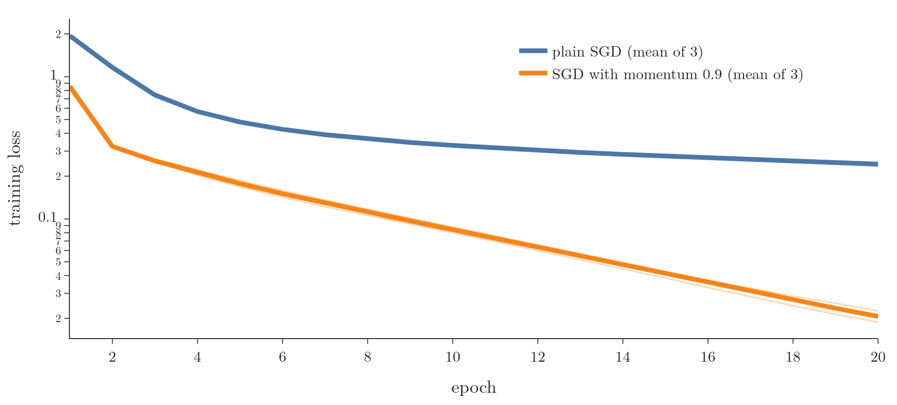

<!-- where-this-fits: generated by course_map/build_map.py; edit concepts.yaml, not this block -->
> **Where this fits:** Pipeline map step 8 (Model). See the [Course map](../01-course-map/note.md).
>
> 
>
> - **Builds on:** Convex sets and convex optimisation ([Note 621](../621-convex-sets-and-functions/note.md)); Optimizers in deep learning ([Note 1032](../1032-optimizers-in-deep-learning/note.md)); Exponentially weighted moving average (EWMA) ([Note 1033](../1033-exponentially-weighted-moving-average/note.md)).
> - **Leads to:** Nesterov accelerated gradient (NAG) ([Note 1035](../1035-nesterov-accelerated-gradient/note.md)); Adam ([Note 1038](../1038-adam/note.md)).
> - **Compare with:** Stochastic gradient descent ([Note 1020](../1020-gradient-descent-in-neural-networks/note.md)); Nesterov accelerated gradient (NAG) ([Note 1035](../1035-nesterov-accelerated-gradient/note.md)).
<!-- /where-this-fits -->

## 1. Overview

> **Key point:** Momentum keeps an exponentially weighted average of past gradients, the velocity $v$, and moves by it: $v_t = \beta v_{t-1} + \eta\thinspace\nabla L(w_t)$, then $w_{t+1} = w_t - v_t$. When many gradients agree, the steps grow and training speeds up; the price is overshooting the minimum.

**Momentum** (Polyak 1964) is the first improved optimizer. Plain gradient descent forgets every gradient as soon as it has used it. Momentum remembers them: if the last few gradients all point the same way, it becomes confident and moves faster in that direction, like a ball gathering speed as it rolls downhill.

{width=95%}

Figure 1 shows the main benefit. On a narrow valley, gradient descent needs 424 steps to get close to the minimum; momentum needs 59. The idea of momentum returns in NAG and Adam, which makes it one of the most important optimizers to understand.

## 2. Prerequisites

- The [optimizers Note](../1032-optimizers-in-deep-learning/note.md): the weak spots of plain gradient descent.
- The [EWMA Note](../1033-exponentially-weighted-moving-average/note.md): $V_t = \beta V_{t-1} + (1-\beta)\theta_t$ and the role of $\beta$.
- The [gradient descent Note](../57-gradient-descent/note.md): the contour plot of a loss surface.

## 3. Three ways to draw a loss

> **Key point:** One parameter: a curve. Two parameters: a surface in 3D. The same surface seen from above: a contour plot, where colour or rings show the height.

The loss is a function of the weights and biases, so we can draw it against them, just as we draw $y = f(x)$. We can only see up to 3 dimensions, so the pictures in this Note use one or two parameters:

- **One parameter, a 2D graph.** A single node with one weight $w$ and no bias: the loss is a curve over $w$.
- **Two parameters, a 3D graph.** Add a bias $b$: the loss is a surface over the $(w, b)$ plane, with the loss as height.
- **A contour plot.** The same surface seen from above (see section 6 of the [gradient descent Note](../57-gradient-descent/note.md)). Each ring joins points of equal loss, and colour or shading shows the height that the top view loses.

Reading a contour plot takes practice. Where the surface is flat, the height changes slowly, so the rings lie far apart. Where it is steep, they crowd together.

## 4. Why plain gradient descent struggles

> **Key point:** Deep learning losses are non-convex. Local minima, saddle points with their flat surroundings, and high curvature all slow plain gradient descent down or trap it.

The losses of neural networks are non-convex (see the [convex and non-convex cost functions Note](../590-convex-and-non-convex-cost-functions/note.md)), which makes the minimum hard to reach for three reasons:

1. **Local minima:** a dip where the slope is zero. Starting from an unlucky point, gradient descent stops there and returns a sub-optimal solution.
2. **Saddle points:** the surface rises in one direction and falls in another, and the slope changes very slowly over a wide flat region. Updates are proportional to the slope, so they become tiny there and training slows down.
3. **High curvature:** a bend with a small radius, such as the steep sides of a narrow valley. Gradient descent zigzags across the bend instead of following it.

Batch, stochastic and mini-batch gradient descent handle these poorly (see section 8 of the [gradient descent in neural networks Note](../1020-gradient-descent-in-neural-networks/note.md) for their paths). Momentum was designed for exactly these situations: high curvature, small but consistent gradients, and noisy gradients (Goodfellow et al. 2016, §8.3.2).

## 5. The idea: confidence builds speed

> **Key point:** If the past gradients keep pointing the same way, move faster that way. Like a ball rolling downhill, the parameters gather speed.

**An everyday picture.** We drive from A to B and do not know the way, so we ask people. If four people in four places all point in the same direction, we become confident and drive faster that way. If two point forward and two point back, we still go forward, but slowly.

**A physics picture.** A ball rolling down a hill gathers speed as it goes. Momentum in physics is mass times velocity; with a unit mass, momentum is simply the velocity (Goodfellow et al. 2016, §8.3.2). The optimizer keeps a **velocity** $v$: the direction and speed with which the parameters move, built from the history of past updates.

The single most important benefit of momentum is speed: it usually reaches a good solution faster than plain gradient descent.

## 6. The update rule

> **Key point:** The velocity is an EWMA of past gradients: $v_t = \beta v_{t-1} + \eta\thinspace\nabla L(w_t)$. The weight moves by the velocity: $w_{t+1} = w_t - v_t$.

Plain gradient descent moves by the current gradient only: $w_{t+1} = w_t - \eta\thinspace\nabla L(w_t)$. Momentum replaces that step by the velocity.

1. **In words:** the new velocity is a fraction $\beta$ of the old velocity plus the current gradient step. The weight then moves by the whole velocity.
2. **Formula:**
   $$v_t = \beta\thinspace v_{t-1} + \eta\thinspace\nabla L(w_t), \qquad w_{t+1} = w_t - v_t$$
   with $v_0 = 0$ and $\beta$ between 0 and 1, usually 0.9.
3. **Example:** the loss $L(w) = w^2/2$, whose gradient is $w$, starting at $w_0 = -10$, with $\eta = 0.1$ and $\beta = 0.9$:
   $$v_1 = 0.9 \times 0 + 0.1 \times (-10) = -1, \qquad w_1 = -10 - (-1) = -9$$
   $$v_2 = 0.9 \times (-1) + 0.1 \times (-9) = -1.8, \qquad w_2 = -9 - (-1.8) = -7.2$$
   Plain gradient descent would be at $w_2 = -9 - 0.1 \times (-9) = -8.1$. Momentum's second step is almost twice as long, because the first step's push is still there (Notebook).

The term $\beta v_{t-1}$ is the momentum. To compute $v_{t-1}$ we needed $v_{t-2}$, which needed $v_{t-3}$, and so on: the velocity carries the whole history of past gradients. Momentum accumulates an exponentially decaying moving average of past gradients and continues to move in their direction (Goodfellow et al. 2016, §8.3.2).

> **Extra:** If every gradient is the same, $g$, the velocity grows until it settles at a **terminal velocity** of $\eta g/(1-\beta)$ (Goodfellow et al. 2016, eq. 8.17). With $\beta = 0.9$, momentum's steps become $1/(1 - 0.9) = 10$ times longer than plain gradient descent's; the Notebook's steps grow from 0.1 to 1.0. This is the $1/(1-\beta)$ of the [EWMA Note](../1033-exponentially-weighted-moving-average/note.md) again. Our velocity adds $\eta\thinspace\nabla L$ rather than the EWMA's $(1-\beta)\thinspace\nabla L$; that only rescales the learning rate.

Each step now has two parts: the push of the past velocity, and the current gradient. When both point the same way, the step is long.

{width=95%}

Figure 2 draws each step as these two arrows placed head to tail. Watch the arrows: across the valley the orange and blue arrows often point opposite ways and cancel, while along the valley the orange arrow, the remembered push, carries most of the motion. Momentum damps the zig-zag across a narrow valley and builds speed along it (Goh 2017).

### 6.1 Why the zigzag fades and speed builds

> **Key point:** Across a narrow valley the gradients keep flipping sign, so they partly cancel in the velocity. Along the valley they agree, so they add up.

In a narrow valley, plain gradient descent can bounce between the steep walls, because each step follows the current slope, which points mostly across the valley (Goodfellow et al. 2016, §8.3.2, figure 8.5). With momentum:

- **Across the valley,** the gradient changes sign as the weight swings from wall to wall. In the velocity, those opposite pushes partly cancel, so the weight stops flipping at every step.
- **Along the valley,** every gradient points the same way. Those components add up, so the velocity grows and the steps lengthen.

Whether gradient descent bounces depends on the step size. On $L = (w_1^2 + 100w_2^2)/2$ the gradient across the valley is $100w_2$, so one step gives $w_2 \leftarrow w_2 - 100\eta w_2 = (1 - 100\eta)\thinspace w_2$:

- **$\eta = 0.01$ (Figure 1):** the factor is $1 - 1 = 0$. The first step puts $w_2$ exactly on the valley floor and it stays there; there is no zigzag, only a slow crawl along $w_1$.
- **$0.01 < \eta < 0.02$:** the factor lies between $-1$ and 0, so $w_2$ flips sign at every step and shrinks: a zigzag. At $\eta = 0.019$ the factor is $-0.9$, and $w_2$ runs $0.4, -0.36, 0.324, -0.292, \dots$ (Notebook).
- **$\eta > 0.02 = 2/100$:** the factor is below $-1$; the zigzag grows and the run blows up.

{width=95%}

Figure 3 puts the three runs side by side (Notebook):

- **Gradient descent, $\eta = 0.019$:** $w_2$ changes sign at all 20 of the first 20 steps, moving 0.334 per step on average.
- **Momentum, $\eta = 0.01$:** $w_2$ changes sign 8 times and moves 0.189 per step. At step 3, for example, the remembered velocity term is $+0.324$ and the new gradient term is $-0.36$; they nearly cancel, so the step across is only 0.036. The swing still fades slowly: by steps 40 to 49, $|w_2|$ is still up to 0.05, against 0.006 for the zigzagging gradient descent.
- **Along the valley,** momentum covers the distance to the minimum in about 24 steps, overshoots, and comes back; both gradient descent runs are still far away after 60 steps.

The update rule explains both speeds. Write the velocity as $v_t = w_t - w_{t+1}$ and take one direction with curvature $\lambda$ (1 along, 100 across), so the gradient is $\lambda w_t$. Then $w_t - w_{t+1} = \beta(w_{t-1} - w_t) + \eta\lambda w_t$, that is

$$w_{t+1} = (1 + \beta - \eta\lambda)\thinspace w_t - \beta\thinspace w_{t-1}.$$

The two roots of $z^2 - (1 + \beta - \eta\lambda)z + \beta = 0$ multiply to $\beta$. When $(1 + \beta - \eta\lambda)^2 < 4\beta$ they are complex with equal size, so each has size $\sqrt{\beta}$: the weight swings and the swing shrinks by $\sqrt{0.9} \approx 0.95$ per step. With $\eta = 0.01$, $\beta = 0.9$ the condition holds in both directions ($0.9^2 = 0.81$ across and $1.89^2 \approx 3.57$ along, both below 3.6). Along the valley, gradient descent shrinks the distance only by $1 - 0.01 = 0.99$ per step, so momentum's $0.95$ is far faster there. Across the valley, the $0.95$ is slower than the $0.9$ of gradient descent at $\eta = 0.019$, which is why the orange swing in Figure 3 lingers. On this valley the gain from momentum is the speed along it.

Momentum increases the step for directions whose gradients point the same way and reduces it for directions whose gradients change sign (Ruder 2016, §4.1). On the valley $L = (w_1^2 + 100w_2^2)/2$ from $(-10, 0.4)$, with $\eta = 0.01$ for both, after 20 steps gradient descent has moved $w_1$ from $-10$ to $-8.18$, while momentum is already at $-1.18$, close to the minimum at 0 (Notebook). To bring the loss below 0.01:

| Optimizer | Steps |
|---|---|
| Gradient descent, $\eta = 0.01$ | 424 |
| Gradient descent, $\eta = 0.019$ (its largest safe value) | 223 |
| Momentum, $\eta = 0.01$, $\beta = 0.9$ | 59 |

## 7. The role of $\beta$

> **Key point:** $\beta = 0$ is plain gradient descent. $\beta$ close to 1 remembers the past for long: more speed, more overshooting. $\beta = 1$ never forgets and never settles. Usual values: 0.5, 0.9, 0.99.

$\beta$ is the **decay factor**: it decides how fast the influence of past velocities dies away. An old gradient's contribution is multiplied by $\beta$ at every step, so recent gradients count most, exactly as in an EWMA. With $\beta = 0.9$ the velocity behaves roughly like an average of the last $1/(1-0.9) = 10$ gradients.

- **$\beta = 0$:** the momentum term disappears, $v_t = \eta\thinspace\nabla L(w_t)$, and the update is plain gradient descent.
- **$\beta = 1$:** nothing decays. Like a ball on a frictionless surface, the parameters keep swinging back and forth forever without settling.
- **In practice:** 0.5, 0.9 or 0.99 (Goodfellow et al. 2016, §8.3.2).

{width=95%}

Figure 4 shows all four. With $\beta = 1$, the weight is still swinging between about $-10$ and 10 after 100 steps (Notebook).

> **Extra:** Goodfellow et al. (2016, §8.3.2) explain the decay as friction. The velocity's decay acts like viscous drag, a force proportional to $-v$, as if the particle moved through syrup. Without it ($\beta = 1$) the particle would slide down one side of the valley and up the other forever, like a hockey puck on frictionless ice.

## 8. Escaping a local minimum, and the cost: overshooting

> **Key point:** The speed that carries momentum through a small dip also carries it past the true minimum. Momentum swings back and forth before settling, and those swings waste time.

{width=95%}

Figure 5 shows two effects on the curve $L(w) = (w^2 - 4)^2/8 - 0.6w$, starting at $w = -3$:

1. **Faster.** The orange ball gains speed as it rolls; the blue ball moves at the pace of the slope.
2. **Out of a local minimum.** The blue ball stops in the small dip near $w = -1.83$ (loss 1.15). The orange ball has enough speed to climb out, crosses the bump, and ends in the global minimum near $w = 2.14$ (loss $-1.24$) (Notebook).

The same speed has a price. The orange ball does not stop at the global minimum: it shoots past to $w = 2.85$, comes back, and swings with shrinking amplitude before settling. In Figure 4, $\beta = 0.9$ crosses the minimum again and again for the same reason. As the decay factor makes the old velocities fade, the swings die out, but the time spent swinging is wasted.

Momentum is still faster than plain gradient descent, but these oscillations make it slower than optimizers that damp them. The biggest problem of momentum is its momentum. The next optimizer, Nesterov accelerated gradient, reduces the swings.

> **Extra:** Escaping a dip is not guaranteed. On this curve it depends on the settings: with $\beta = 0.5$, momentum also stops in the small dip (Notebook). A ball escapes only if it has gathered enough speed before reaching the bump.

## 9. Momentum on real data: MNIST

> **Key point:** On handwritten digits, adding momentum 0.9 to SGD with the same learning rate reached plain SGD's 20-epoch loss by epoch 4.

The data is the MNIST handwritten digits (see the [MNIST Note](../1012-mnist-ann/note.md)): 10,000 training images, each with 784 pixel **features** (input variables) and the digit as **target** (the output we predict), and the 10,000 test images for validation. The network has hidden layers of 128 and 64 ReLU nodes and a softmax output. Both runs use mini-batch SGD with learning rate 0.01, batch size 64 and 20 epochs; only the momentum changes, 0 or 0.9. Each is trained with 3 seeds and the curves are averaged.

{width=90%}

Figure 6 and the Notebook give:

| | Plain SGD | SGD with momentum 0.9 |
|---|---|---|
| Training loss, epoch 1 | 1.94 | 0.85 |
| Training loss, epoch 5 | 0.48 | 0.18 |
| Training loss, epoch 20 | 0.24 | 0.021 |
| Validation accuracy, epoch 20 | 0.917 | 0.950 |

Momentum gets to plain SGD's final loss of 0.24 by epoch 4. Its terminal steps are up to $1/(1-0.9) = 10$ times longer when the gradients agree (section 6), so it covers the same ground in far fewer epochs.

### 9.1 Momentum in Keras

> **Key point:** Pass `momentum` to Keras' `SGD`: 0 is plain SGD, 0.9 is SGD with momentum.

> **Python:** SGD with momentum in Keras.
>
> ```python
> import keras
> opt = keras.optimizers.SGD(learning_rate=0.01, momentum=0.9)
> model.compile(optimizer=opt, loss="sparse_categorical_crossentropy",
>               metrics=["accuracy"])
> ```

`momentum` is $\beta$, and its default is 0. With `momentum=0.9` and `nesterov=False` (the default) Keras uses the update of section 6.

> **Extra:** Keras writes the same update with the sign of $v$ flipped: $v \leftarrow \beta v - \eta g$, then $w \leftarrow w + v$ (Keras `SGD` documentation). Both give the same weights. Some books, such as Goodfellow et al. (2016, §8.3.2), use this form too.

## 10. Summary

| | Plain gradient descent | SGD with momentum |
|---|---|---|
| Step | $\eta\thinspace\nabla L(w_t)$ | $v_t = \beta v_{t-1} + \eta\thinspace\nabla L(w_t)$ |
| Memory of past gradients | none | EWMA, about $1/(1-\beta)$ steps |
| Narrow valley (our example) | 424 steps | 59 steps |
| Small local dip | stops in it | can roll through |
| Near the minimum | arrives directly | overshoots and swings |

- Momentum adds a velocity, an exponentially decaying average of past gradients, to gradient descent.
- Gradients that agree add up (speed); gradients that flip sign cancel (less zigzag).
- $\beta = 0$ is plain gradient descent; $\beta = 1$ never settles; 0.9 is the usual value.
- The speed can carry it out of a small local minimum, and also past the global minimum: overshooting is its main weakness.
- In Keras: `SGD(learning_rate=..., momentum=0.9)`.

## 11. Sources

**Built from**

- CampusX, "SGD with Momentum Explained in Detail with Animations | Optimizers in Deep Learning Part 2", YouTube, https://www.youtube.com/watch?v=vVS4csXRlcQ

**Other references**

- Goh, G. (2017). Why momentum really works. *Distill*, distill.pub/2017/momentum. Introduction: momentum's added inertia damps oscillations and carries the descent through narrow valleys (the statement cited with Figure 2). The two-arrow drawing, data and code are our own.
- Goodfellow, I., Bengio, Y. and Courville, A. (2016). *Deep Learning*. MIT Press. §8.3.2 Momentum (algorithm 8.2, eq. 8.17, the physical analogy).
- Polyak, B. T. (1964). Some methods of speeding up the convergence of iteration methods. *USSR Computational Mathematics and Mathematical Physics* 4(5), 1–17.
- Ruder, S. (2016). An overview of gradient descent optimization algorithms. arXiv:1609.04747. §4.1 Momentum.
- Keras API documentation: `SGD` optimizer, keras.io/api/optimizers/sgd.

## 12. Key terms

| Term | Meaning |
|---|---|
| Momentum (optimizer) | Gradient descent that moves by a velocity, an exponentially decaying average of past gradients |
| Velocity $v$ | The direction and size of the current move, built from past gradients: $v_t = \beta v_{t-1} + \eta\thinspace\nabla L(w_t)$ |
| Decay factor $\beta$ | How much of the old velocity is kept each step; 0 gives plain gradient descent, usually 0.9 |
| Terminal velocity | The step size momentum reaches when every gradient is the same: $\eta g/(1-\beta)$ |
| Overshooting | Moving past the minimum because of the built-up velocity, then swinging back |
| Contour plot | A loss surface seen from above, with rings joining points of equal loss |
| Feature | An input variable, such as one pixel of an image |
| Target | The output we predict, such as the digit |
