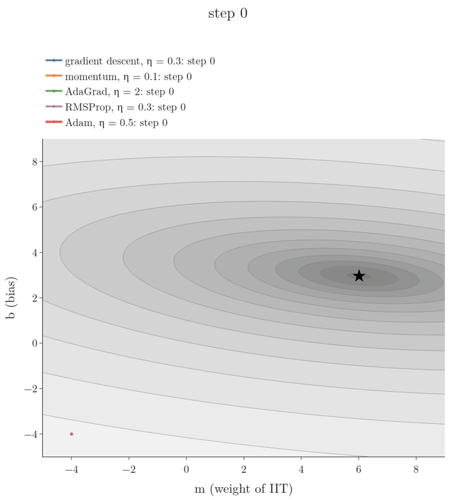
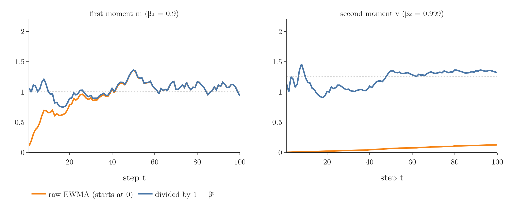
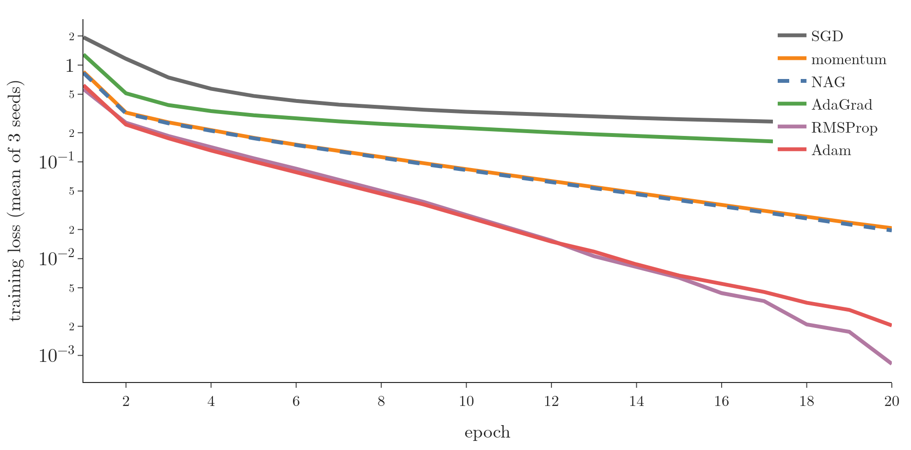

## 1. Overview

> **Key point:** Adam keeps two EWMAs per parameter: of the gradient, $m_t$ (momentum's idea), and of the squared gradient, $v_t$ (RMSProp's idea). It corrects both for starting at 0, then steps by $\eta\thinspace\hat m_t/(\sqrt{\hat v_t} + \epsilon)$. It is the most widely used optimizer and the usual starting point.

**Adam**, short for *adaptive moment estimation* (Kingma and Ba 2015), is the last optimizer of this series and the most used. Whether we train a plain network, a convolutional network or a recurrent network, Adam is usually the first choice.

Adam borrows from the optimizers before it. Momentum and NAG are built on one idea, **speed from past gradients**; AdaGrad and RMSProp on another, **a learning rate that adapts to each parameter**. Adam merges the two.

{width=80%}

Figure 1 shows both ideas at work on the students data of the [AdaGrad Note](../1036-adagrad/note.md).

## 2. Prerequisites

- The [SGD with momentum Note](../1034-sgd-with-momentum/note.md): the velocity, an EWMA of past gradients.
- The [RMSProp Note](../1037-rmsprop/note.md): dividing by the root of an EWMA of squared gradients.
- The [EWMA Note](../1033-exponentially-weighted-moving-average/note.md): why an average started at 0 is too small at first.

## 3. The story so far

> **Key point:** Batch GD is steady but slow; momentum is fast but overshoots; NAG damps the overshoot; AdaGrad handles sparse features but its learning rate dies; RMSProp fixes that.

| Optimizer | What it adds | Its problem |
|---|---|---|
| [Batch gradient descent](../1020-gradient-descent-in-neural-networks/note.md) | the basic step | slow |
| [Momentum](../1034-sgd-with-momentum/note.md) | speed from past gradients | overshoots and oscillates |
| [NAG](../1035-nesterov-accelerated-gradient/note.md) | look ahead, damp the oscillations | can stay in small dips |
| [AdaGrad](../1036-adagrad/note.md) | a learning rate per parameter (sparse features) | the learning rate only shrinks |
| [RMSProp](../1037-rmsprop/note.md) | forget old gradients | no correction for starting at 0 |

The two lines of improvement are independent, so it makes sense to combine them. Adam is perhaps best seen as a combination of RMSProp and momentum, with a few important differences (Goodfellow et al. 2016, §8.5.3).

## 4. The update rule

> **Key point:** Update $m_t$ (EWMA of gradients) and $v_t$ (EWMA of squared gradients), correct both by dividing by $1 - \beta^t$, then move by $\eta\thinspace\hat m_t/(\sqrt{\hat v_t}+\epsilon)$.

1. **In words:**
   - keep an EWMA of the gradient, $m_t$, as momentum does;
   - keep an EWMA of the squared gradient, $v_t$, as RMSProp does;
   - correct both for having started at 0;
   - step in the direction of the corrected average gradient, divided by the root of the corrected average squared gradient.
2. **Formula:**
   $$m_t = \beta_1 m_{t-1} + (1 - \beta_1)\thinspace\nabla L(w_t), \qquad v_t = \beta_2 v_{t-1} + (1 - \beta_2)\thinspace\left(\nabla L(w_t)\right)^2$$
   $$\hat m_t = \frac{m_t}{1 - \beta_1^t}, \qquad \hat v_t = \frac{v_t}{1 - \beta_2^t}$$
   $$w_{t+1} = w_t - \frac{\eta}{\sqrt{\hat v_t} + \epsilon}\thinspace\hat m_t$$
   with $m_0 = v_0 = 0$, where $t$ counts the updates: 1 for the first mini-batch, 2 for the second, and so on. The suggested defaults are $\eta = 0.001$, $\beta_1 = 0.9$, $\beta_2 = 0.999$ and $\epsilon = 10^{-8}$ (Kingma and Ba 2015, algorithm 1).
3. **Example:** one weight with gradients 2 and then 1, using the defaults.
   - $t = 1$: $m_1 = 0.1 \times 2 = 0.2$ and $v_1 = 0.001 \times 4 = 0.004$. Corrected: $\hat m_1 = 0.2/0.1 = 2$ and $\hat v_1 = 0.004/0.001 = 4$. Step: $0.001 \times 2/\sqrt{4} = 0.001$.
   - $t = 2$: $m_2 = 0.9 \times 0.2 + 0.1 \times 1 = 0.28$ and $v_2 = 0.999 \times 0.004 + 0.001 \times 1 = 0.004996$. Corrected: $\hat m_2 = 0.28/0.19 = 1.474$ and $\hat v_2 = 0.004996/0.001999 = 2.499$. Step: $0.001 \times 1.474/\sqrt{2.499} = 0.000932$ (Notebook).

The parts come from the earlier optimizers:

- **$m_t$** is momentum's velocity, written as a true EWMA. In Adam it is an estimate of the first moment, the mean, of the gradient (Goodfellow et al. 2016, §8.5.3).
- **$\sqrt{v_t}$ in the denominator** is RMSProp's. $v_t$ estimates the second moment of the gradient, which gives Adam its name: adaptive **moment** estimation.
- **$\hat m_t$ and $\hat v_t$** are new: the bias correction.

## 5. Bias correction

> **Key point:** An EWMA started at 0 is too small at first: after $t$ steps its weights add up to only $1 - \beta^t$. Dividing by $1 - \beta^t$ removes this start-up bias. With $\beta_2 = 0.999$ the bias would last for thousands of steps.

Both averages start at $m_0 = v_0 = 0$, so in the first steps they are pulled towards 0, exactly like the zero start of the [EWMA Note](../1033-exponentially-weighted-moving-average/note.md) (section 4.1).

**How big the bias is.** Unrolled, the EWMA after $t$ steps is $(1-\beta)\sum_{i=1}^{t}\beta^{t-i} g_i$. If every gradient had the same value $g$, this would be

$$(1-\beta)\left(1 + \beta + \dots + \beta^{t-1}\right) g = \left(1 - \beta^t\right) g$$

because the geometric sum $1 + \beta + \dots + \beta^{t-1}$ equals $(1 - \beta^t)/(1 - \beta)$. The average is too small by exactly the factor $1 - \beta^t$, so dividing by it gives back $g$ (Kingma and Ba 2015, §3).

| | $t = 1$ | $t = 10$ | $t = 100$ | $t = 1000$ |
|---|---|---|---|---|
| $1 - 0.9^t$ | 0.1 | 0.651 | 1.000 | 1.000 |
| $1 - 0.999^t$ | 0.001 | 0.010 | 0.095 | 0.632 |

With $\beta_1 = 0.9$ the factor reaches 1 within a few dozen steps; with $\beta_2 = 0.999$ it is still 0.63 after 1,000 steps (Notebook). The larger $\beta$ is, the longer the bias lasts (Kingma and Ba 2015, §2).

{width=100%}

Figure 2 shows both averages on a noisy gradient. At step 10, the raw $v$ is 0.012 against a true value of 1.25; corrected, it is 1.22 (Notebook).

Without the correction, early steps would be badly scaled: at $t = 1$ in the example above, $m_1/\sqrt{v_1} = 0.2/\sqrt{0.004} = 3.16$ instead of 1, a first step more than three times too large. Kingma and Ba (2015, §3) point out that leaving the correction out leads to much larger initial steps. RMSProp keeps an uncorrected second-moment estimate, which may be strongly biased early in training (Goodfellow et al. 2016, §8.5.3).

## 6. Adam on the students data

> **Key point:** Adam heads for the minimum like an adaptive method, curls in like momentum, and then settles, while RMSProp keeps jittering.

On the elongated bowl of the IIT feature (Figure 1), each optimizer gets a learning rate that works for it. Steps until the loss is within 0.01 of its minimum (Notebook):

| Optimizer | $\eta$ | Steps | Still moving at the end? |
|---|---|---|---|
| Gradient descent | 0.3 | 61 | no |
| Momentum, $\beta = 0.9$ | 0.1 | 64 | no |
| AdaGrad | 2 | 44 | no |
| RMSProp, $\beta = 0.9$ | 0.3 | 48 | yes: up to 0.15 from the best |
| Adam | 0.5 | 42 | no |

Adam's path shows both behaviours. Adam moves in $m$ and $b$ together from the start, like AdaGrad and RMSProp, instead of the "L" of gradient descent. Near the minimum it swings around once, the momentum part, and then settles. RMSProp, with steps of about $\eta$ even near the minimum, keeps jittering up to 0.15 away. On a convex bowl like this one the differences are small; Adam's strengths matter most on the complex, non-convex losses of real networks.

## 7. Adam on real data: MNIST

> **Key point:** On MNIST, Adam and RMSProp train fastest and are close to each other; both are far ahead of plain SGD and AdaGrad, and ahead of momentum and NAG.

The data is the MNIST handwritten digits (see the [MNIST Note](../1012-mnist-ann/note.md)): 10,000 training images, each with 784 pixel **features** (input variables) and the digit as **target** (the output we predict), the 10,000 test images for validation, hidden layers of 128 and 64 ReLU nodes, batch size 64, 20 epochs, 3 seeds. Learning rates: 0.01 for SGD, momentum, NAG ($\beta = 0.9$) and AdaGrad; 0.001, Keras' default, for RMSProp and Adam.

{width=95%}

Figure 3 and the Notebook give, as means over 3 seeds:

| | SGD | Momentum | NAG | AdaGrad | RMSProp | Adam |
|---|---|---|---|---|---|---|
| Learning rate | 0.01 | 0.01 | 0.01 | 0.01 | 0.001 | 0.001 |
| Training loss, epoch 1 | 1.94 | 0.85 | 0.83 | 1.29 | 0.56 | 0.62 |
| Training loss, epoch 5 | 0.48 | 0.18 | 0.18 | 0.30 | 0.11 | 0.10 |
| Training loss, epoch 20 | 0.24 | 0.021 | 0.020 | 0.15 | 0.0008 | 0.0020 |
| Validation accuracy, epoch 20 | 0.917 | 0.949 | 0.949 | 0.934 | 0.956 | 0.954 |

Adam behaves like both of its parents. Adam gets the speed of momentum and the per-parameter learning rates of RMSProp, so it is far ahead of plain SGD and AdaGrad, and ahead of momentum and NAG from the first epochs on. Against RMSProp alone the race is close on this small network: Adam is slightly lower by epoch 5, RMSProp slightly lower by epoch 20, and their validation accuracies differ by 0.001 (Notebook). The learning rates are each optimizer's usual value, not tuned, so small differences between the leaders should not be over-read; Adam's advantage is that it does well across many problems with these defaults (section 8).

## 8. Which optimizer to use

> **Key point:** Start with Adam. If the results are not good, try RMSProp, and sometimes momentum. There is no single best optimizer: tune the choice like any hyperparameter.

There are more optimizers than the five covered here, such as AdaDelta and Nadam (Adam with Nesterov momentum). Which one to use has no clear answer: a large comparison across many tasks found the adaptive methods fairly robust, but no single best algorithm (Goodfellow et al. 2016, §8.5.4). A practical order:

1. **Adam** is a good starting point; over recent years it has given good results on many kinds of problems.
2. If Adam's results are not good, try **RMSProp**; sometimes **momentum** works best.
3. Treat the optimizer as a **hyperparameter** (a setting chosen before training; see the [Optuna Note](../134-optuna/note.md) for tuning in general): try several and keep the one that does best on validation data, for example with Keras Tuner (see the [Keras Tuner Note](../1039-keras-tuner/note.md)).

Adam is generally regarded as fairly robust to the choice of its hyperparameters, though the learning rate sometimes needs changing from the suggested default of 0.001 (Goodfellow et al. 2016, §8.5.3). Its authors describe the hyperparameters as having intuitive meanings and typically requiring little tuning (Kingma and Ba 2015).

> **Extra:** Ruder (2016, §4.10) recommends the adaptive methods when the data is sparse or the network deep or complex, and notes that Kingma and Ba found the bias correction helps Adam slightly outperform RMSProp towards the end of optimisation, as gradients become sparser.

## 9. Adam in Keras

> **Key point:** `keras.optimizers.Adam(learning_rate=0.001, beta_1=0.9, beta_2=0.999)`, or simply `optimizer="adam"`.

> **Python:** Adam in Keras.
>
> ```python
> import keras
> opt = keras.optimizers.Adam(learning_rate=0.001, beta_1=0.9,
>                             beta_2=0.999)
> model.compile(optimizer=opt, loss="sparse_categorical_crossentropy",
>               metrics=["accuracy"])
> ```

The defaults match the paper's except `epsilon=1e-7` (paper: $10^{-8}$) (Keras `Adam` documentation).

> **Extra:** Keras computes the same update in a slightly different order, which the paper suggests for efficiency (Kingma and Ba 2015, §2): $\eta_t = \eta\sqrt{1-\beta_2^t}/(1-\beta_1^t)$, then $w \leftarrow w - \eta_t\thinspace m_t/(\sqrt{v_t} + \epsilon)$. The only difference is where $\epsilon$ sits, which matters only when $v_t$ is tiny.

## 10. Summary

| | Momentum | RMSProp | Adam |
|---|---|---|---|
| EWMA of gradients | yes ($v_t$) | no | yes ($m_t$, $\beta_1 = 0.9$) |
| EWMA of squared gradients | no | yes ($\beta = 0.9$) | yes ($v_t$, $\beta_2 = 0.999$) |
| Learning rate per parameter | no | yes | yes |
| Bias correction | no | no | yes, divide by $1 - \beta^t$ |
| Default learning rate in Keras | 0.01 (SGD) | 0.001 | 0.001 |

- Adam = momentum's average of gradients + RMSProp's average of squared gradients + a correction for starting at 0.
- The update: $w_{t+1} = w_t - \eta\thinspace\hat m_t/(\sqrt{\hat v_t}+\epsilon)$, with $\hat m_t = m_t/(1-\beta_1^t)$ and $\hat v_t = v_t/(1-\beta_2^t)$.
- Defaults: $\eta = 0.001$, $\beta_1 = 0.9$, $\beta_2 = 0.999$; $t$ counts the updates.
- Adam is the usual first choice; RMSProp and momentum are the usual alternatives. No optimizer wins everywhere.

## 11. Sources

- Goodfellow, I., Bengio, Y. and Courville, A. (2016). *Deep Learning*. MIT Press. §8.5.3 Adam (algorithm 8.7), §8.5.4 Choosing the right optimization algorithm.
- Kingma, D. P. and Ba, J. (2015). Adam: A method for stochastic optimization. ICLR 2015. arXiv:1412.6980. Algorithm 1, §2, §3.
- Ruder, S. (2016). An overview of gradient descent optimization algorithms. arXiv:1609.04747. §4.6 Adam, §4.10 Which optimizer to use?
- Keras API documentation: `Adam` optimizer, keras.io/api/optimizers/adam.

## 12. Key terms

| Term | Meaning |
|---|---|
| Adam | Adaptive moment estimation: an optimizer that combines momentum's EWMA of gradients with RMSProp's EWMA of squared gradients, plus bias correction |
| First moment $m_t$ | The EWMA of the gradient: an estimate of its mean |
| Second moment $v_t$ | The EWMA of the squared gradient: an estimate of its mean square |
| Bias correction | Dividing an EWMA started at 0 by $1 - \beta^t$ so it is not too small in the first steps |
| $\beta_1$, $\beta_2$ | Adam's decay factors for $m_t$ and $v_t$; defaults 0.9 and 0.999 |
| Hyperparameter | A setting chosen before training, such as the optimizer or the learning rate |
| Feature | An input variable, such as one pixel of an image |
| Target | The output we predict, such as the digit |
