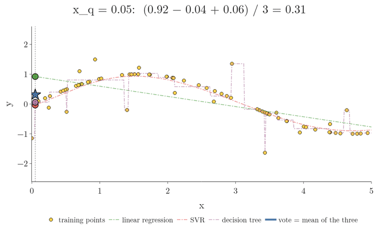
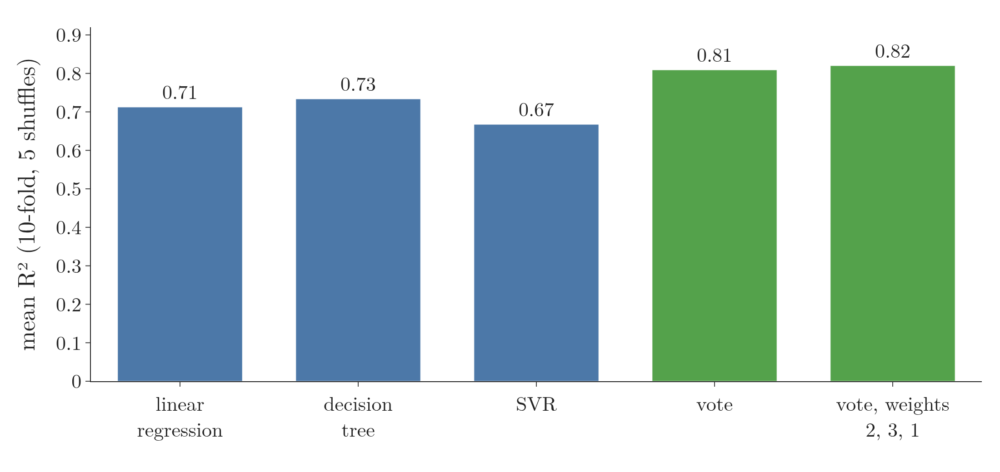
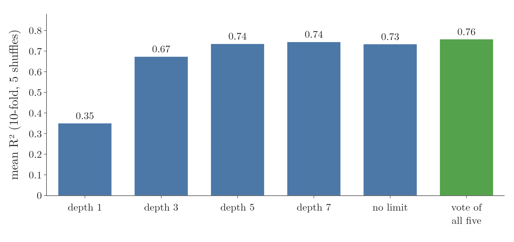
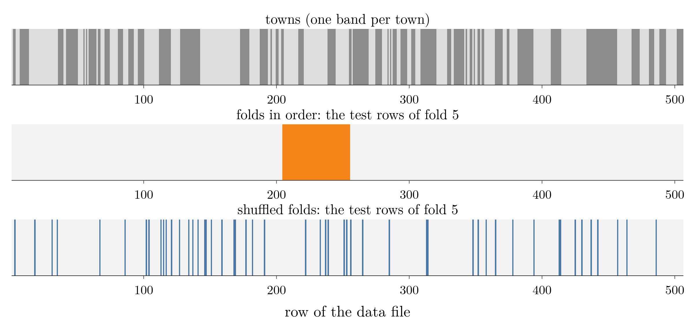
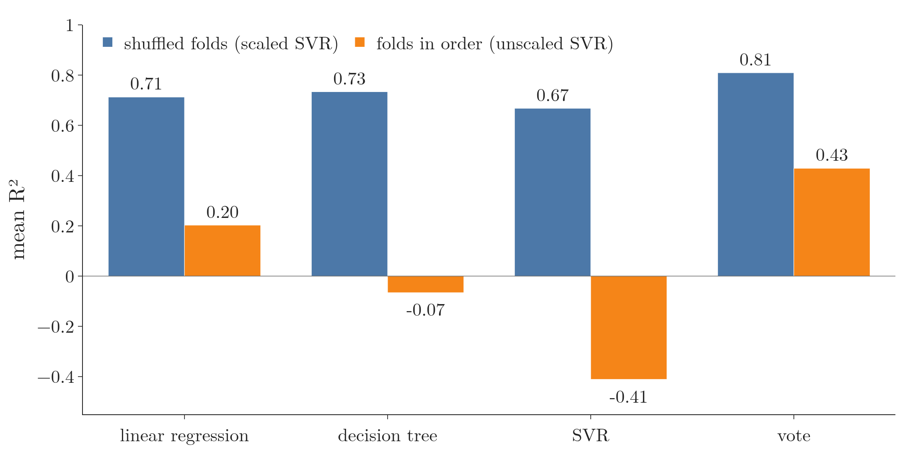

<!-- where-this-fits: generated by course_map/build_map.py; edit concepts.yaml, not this block -->
> **Where this fits:** Pipeline map steps 8 (Model), 9 (Evaluate). See the [Course map](../01-course-map/note.md).
>
> 
>
> - **Builds on:** Independent and mutually exclusive events ([Note 84](../84-mutually-exclusive-events/note.md)); Ensemble learning ([Note 101](../101-ensemble-learning/note.md)); Bernoulli and binomial distributions ([Note 102](../102-voting-ensemble/note.md)).
> - **Leads to:** Grid and random search ([Note 106](../106-bagging-classifier/note.md)); Stacking and blending ([Note 127](../127-stacking-blending/note.md)); Random under- and oversampling ([Note 133](../133-imbalanced-data/note.md)); Optuna ([Note 134](../134-optuna/note.md)).
> - **Compare with:** Train-test split ([Note 13](../13-toy-project/note.md)); Bagging ([Note 105](../105-bagging-intuition/note.md)); OOB score ([Note 105](../105-bagging-intuition/note.md)); Stacking and blending ([Note 127](../127-stacking-blending/note.md)).
<!-- /where-this-fits -->

## 1. Overview

> **Key point:** A voting regressor trains several regressors on the same data and predicts the mean of their outputs, or a weighted mean if we give weights.

The **voting regressor** (G-2097) is the regression version of the voting classifier (the [voting classifier Note](../103-voting-classifier/note.md)). Only the aggregation step changes: instead of a vote, we take the **mean** (G-1203) of the **base models'** (G-260) outputs. This Note covers:

- the core idea (section 2) and a demo with curves (section 3);
- scikit-learn's `VotingRegressor` on the Boston housing data, with `weights` (sections 4.1 to 4.3);
- voting over one algorithm with different settings (section 4.4);
- why the cross-validation folds must be shuffled on this data (section 4.5).

The Notebook (`notebook.ipynb`) runs every experiment. The Dash app `app.py` lets us tick base regressors and redraws their curves next to the voting regressor's.

## 2. The core idea

> **Key point:** Train every regressor on the same data; to predict, average their numerical outputs.

We have base models M1, M2 and M3, all regression algorithms, trained on the same dataset D. For a new query point $x_q$, each returns a number, and the voting regressor returns their mean (the [introduction to ensemble learning Note](../101-ensemble-learning/note.md), section 3.3, works an example). With weights, it returns the weighted mean, exactly as in soft voting (the [voting classifier Note](../103-voting-classifier/note.md), section 4.3).

1. **In words:** add the base models' predictions and divide by how many there are.
2. **Formula:** with $n$ base models predicting $f_1, \dots, f_n$ for the query point, and optional weights $w_1, \dots, w_n$,
   $$\hat y = \frac{1}{n}\sum_{i=1}^{n} f_i \qquad\text{or, with weights,}\qquad \hat y = \frac{\sum_{i=1}^{n} w_i f_i}{\sum_{i=1}^{n} w_i}$$
3. **Example:** three models predict 0.5, 0.8 and 0.55. The vote is $(0.5 + 0.8 + 0.55)/3 = 0.617$. With weights (1, 2, 1) it is $(0.5 + 1.6 + 0.55)/4 = 0.663$, pulled towards the second model.

{height=60%}

In Figure 1, watch the star: at every $x_q$ it sits at the mean of the three dots, and its trail is the voting regressor's curve.

## 3. Seeing it on a curve

> **Key point:** The voting regressor's curve runs between its base models' curves and smooths out the extremes of each. Its score is never below the average score of its members.

The demo data is a sine wave of 80 points between 0 and 5, with every fifth point pushed up or down at random: a non-linear pattern with a few outliers. We train on 72 points and keep 8 for testing. Figure 2 adds three base regressors one at a time and redraws the voting regressor after each.

{height=55%}

Think of three friends guessing a distance: one always guesses short, one guesses well, one guesses wildly. The average of their guesses is rarely the single best guess, but it is never as bad as the worst one, and it is steadier than the wild guesser.

The picture shows the same thing:

- **Linear regression** fits a straight line, which cannot follow a wave.
- **SVR** (support vector regression, the [SVM intuition Note](../92-svm-intuition/note.md)) follows the wave well.
- **A decision tree** (depth 5) jumps to reach many single points, outliers included.
- **The voting curve** runs between them. With two models it sits exactly halfway between the line and the SVR curve; with three, it follows the tree's jumps only a third of the way, so it is much smoother than the tree.

A score from 8 test points depends heavily on which 8 points we drew. So the Notebook draws 30 fresh datasets with the same recipe and averages the **R² score** (G-1717; 1 means perfect predictions, 0 means no better than always predicting the mean; the [regression metrics Note](../52-regression-metrics/note.md)) on their test points:

| Base models | Each model's mean $R^2$ | Average of the members | Voting regressor (G-2097) |
|---|---|---|---|
| linear regression, SVR | 0.45, 0.77 | 0.61 | **0.69** |
| linear regression, SVR, decision tree | 0.45, 0.77, 0.53 | 0.58 | **0.72** |

The vote is always well above the average of its members. It does not beat SVR here, because SVR alone already fits this smooth wave almost as well as any model can, and the line drags the average down. Voting pays off most when the members are about equally good and make different mistakes, as on the real data below.

> **Extra:** Why can the vote never be worse than the average member? Take one test point with true value $y$, and let model $i$ predict $f_i$. The vote predicts $\bar f = \frac{1}{n}\sum_i f_i$. Its error is the mean of the members' errors, $\bar f - y = \frac{1}{n}\sum_i (f_i - y)$, and the square of a mean is never larger than the mean of the squares:
> $$(\bar f - y)^2 = \frac{1}{n}\sum_{i=1}^{n} (f_i - y)^2 \thickspace-\thickspace\frac{1}{n}\sum_{i=1}^{n} (f_i - \bar f)^2$$
> The last term is the spread of the members around their mean, which Krogh and Vedelsby (1995) call the **ambiguity** (G-2155). The more the members disagree, the more the vote gains over the average member. Since $R^2$ falls as squared error rises, the vote's $R^2$ is at least the average of the members' $R^2$ on any test set.

## 4. VotingRegressor on the Boston housing data

> **Key point:** Three base models with R² 0.71, 0.73 and 0.67 combine into a voting regressor with R² 0.81, better than each; weights lift it to 0.82.

### 4.1 The data and the base models

> **Key point:** 506 districts, 13 features, median house price; linear regression, a decision tree and SVR, each scored by shuffled 10-fold cross-validation.

The Boston housing data (the [regression trees Note](../99-regression-trees/note.md), section 7.1, describes it and why `load_boston` was removed from scikit-learn) has 506 **observations** (one record each, here a district; one row of the data table) and 13 **features** (input variables, one column each). The **target**, the output we predict, is `MEDV`, the median house price of each district. The Notebook reads it from `data/boston.csv`.

We score each model under three conditions:

- **shuffled folds:** the observations are stored town by town, so we shuffle them before cutting the 10 folds (section 4.5 shows why);
- **five repeats:** the whole 10-fold **cross-validation** (G-510) is repeated with 5 different shuffles, and we report the mean;
- **scaled SVR:** SVR measures distances between observations, so it gets standardized features (the [standardization Note](../24-standardization/note.md)) through a pipeline (the [pipelines Note](../29-pipelines/note.md)).

> **Python:** Each base model alone.
>
> ```python
> boston = pd.read_csv("data/boston.csv")
> X, y = boston.drop(columns="MEDV"), boston["MEDV"]
> cv = RepeatedKFold(n_splits=10, n_repeats=5, random_state=0)
>
> estimators = [("lr", LinearRegression()),
>               ("dt", DecisionTreeRegressor(random_state=0)),
>               ("svr", make_pipeline(StandardScaler(), SVR()))]
> for name, model in estimators:
>     scores = cross_val_score(model, X, y,
>                              scoring="r2", cv=cv)
>     print(name, scores.mean())
> ```
>
> `scoring="r2"` makes `cross_val_score` report $R^2$ instead of accuracy. `RepeatedKFold` shuffles the observations before cutting each set of folds.

| Model | Linear regression | Decision tree | SVR |
|---|---|---|---|
| Mean $R^2$ | 0.71 | 0.73 | 0.67 |

The three models are about equally good, and they work in very different ways: a straight-line formula, a set of yes/no rules, and a smooth curved surface. Those are the right conditions for a vote: members that are accurate and make different mistakes (the [voting ensemble Note](../102-voting-ensemble/note.md), section 5.2).

### 4.2 The voting regressor

> **Key point:** Passing the same three models to `VotingRegressor` lifts R² from the best member's 0.73 to 0.81.

> **Python:** The voting regressor.
>
> ```python
> from sklearn.ensemble import VotingRegressor
>
> vr = VotingRegressor(estimators)
> cross_val_score(vr, X, y, scoring="r2", cv=cv).mean()   # 0.81
> ```
>
> `VotingRegressor` takes the same list of (name, model) tuples as `VotingClassifier`, plus optional `weights` and `n_jobs`. There is no `voting` setting: regression always averages.

{height=32%}

In Figure 3, compare the green bars with the blue ones: the plain vote already gains 0.08 over the best member; the weights add only 0.01 more.

The vote scores **0.81**, clearly above every member (0.71, 0.73 and 0.67). Where the tree makes a jump that the line does not, and the SVR smooths both, the errors partly cancel in the average.

`n_jobs=-1` trains the base models in parallel on all CPU cores. On small data like this it does not pay: in the Notebook one fit takes about 0.1 seconds on one core but several seconds with `n_jobs=-1`, because starting parallel work has a cost of its own (scikit-learn User Guide §10.3.1).

### 4.3 Weights

> **Key point:** Trying weights 1 to 3 for each model, the best is (2, 3, 1), giving R² 0.82.

As for classification, we try each weight from 1 to 3 for each model, 27 combinations:

| Weights (lr, dt, svr) | (1, 1, 1) | (1, 2, 1) | (3, 3, 1) | **(2, 3, 1)** |
|---|---|---|---|---|
| Mean $R^2$ | 0.809 | 0.818 | 0.818 | **0.820** |

The best weights give the tree, the best single model, the biggest say, and SVR, the weakest, the smallest. The gain over equal weights is small here.

### 4.4 One algorithm, different settings

> **Key point:** Five trees of depth 1, 3, 5, 7 and unlimited score between 0.35 and 0.74; their vote scores 0.76, above the best of them.

We can also vote over one algorithm with different hyperparameter values. Five decision trees of different depths:

| max_depth | 1 | 3 | 5 | 7 | None | Vote of all five |
|---|---|---|---|---|---|---|
| Mean $R^2$ | 0.35 | 0.67 | 0.74 | 0.74 | 0.73 | **0.76** |

{height=32%}

In Figure 4, the green bar is only about 0.01 above the best tree (0.757 against 0.744), a much smaller step than in Figure 3.

The vote beats every tree, even though one member (depth 1) is very weak. The gain is smaller than in section 4.2, because five trees grown on the same data make more similar mistakes than three different algorithms do.

### 4.5 Why we shuffle the folds

> **Key point:** Without shuffling, every test fold holds towns the model never saw, and all scores collapse.

The Boston observations are stored grouped by town: each town's observations sit together (Gilley and Pace, 1996). Plain `cv=10` cuts the folds **in order**, without shuffling, so most test observations come from towns the model never saw in training: 453 of the 506 with folds in order, against only 19 with shuffled folds.

Figure 5 shows the difference on the rows of the data file. Each grey band in the top strip is one town. In the middle strip, the test rows of one fold cut in order form a solid block: 49 of its 51 rows come from towns that have no row in the training part. In the bottom strip, the test rows of a shuffled fold are spread over the whole file, and only 2 of 51 come from towns the model has not seen.

{height=30%}

With folds in order (and the older unscaled SVR), the same models score far lower:

| Model | Linear regression | Decision tree | SVR (unscaled) | Vote |
|---|---|---|---|---|
| $R^2$, folds in order | 0.20 | -0.07 | -0.41 | 0.43 |

{height=34%}

In Figure 6, watch every orange bar fall far below its blue partner; the tree and the unscaled SVR drop below zero.

A negative $R^2$ means worse than always predicting the mean price.

> **Extra:** Holding out whole towns picked at random (`GroupKFold`, with the town names from the corrected data) gives scores in between: linear regression 0.55, decision tree 0.36, scaled SVR 0.61, vote 0.68. So predicting for unseen towns is genuinely harder, and the vote still beats every member there.

## 5. Summary

| | Voting classifier | Voting regressor (G-2097) |
|---|---|---|
| Base models | classifiers | regressors |
| Aggregation | majority vote (hard) or average probability (soft) | mean of the predictions |
| Weights | `weights=[...]` | `weights=[...]` (weighted mean) |
| scikit-learn class | `VotingClassifier` | `VotingRegressor` |

- A voting regressor predicts the mean (or weighted mean) of its base regressors' predictions.
- The vote's squared error is never worse than the average member's; the more the members disagree, the bigger the gain.
- On the noisy sine data, the voting curve smooths out the tree's jumps and scores well above the average member (0.72 against 0.58).
- On Boston, three different models (0.71, 0.73, 0.67) give a vote of 0.81 (0.82 with weights 2, 3, 1); five trees of different depths give 0.76.
- Shuffle the observations before cross-validation when the data is stored in a meaningful order.

## 6. Sources

**Built from**

- CampusX, "Voting Ensemble | Regression | Part 3", YouTube, https://www.youtube.com/watch?v=ut4vh59rGkw

**Other references**

- Gilley, O. W. and Pace, R. K. (1996). "On the Harrison and Rubinfeld Data". *Journal of Environmental Economics and Management* 31, 403–405. Corrected data with town names: StatLib, `boston_corrected.txt` (copy in `data/`).
- Krogh, A. and Vedelsby, J. (1995). "Neural Network Ensembles, Cross Validation, and Active Learning". *Advances in Neural Information Processing Systems 7*, MIT Press, 231–238.
- scikit-learn developers. User Guide, section 10.3.1, "Parallelism". scikit-learn.org, computing/parallelism.

## 7. Key terms

| Term | Meaning |
|---|---|
| Voting regressor (G-2097) | A regressor that predicts the mean (or weighted mean) of several trained regressors' predictions |
| Ambiguity (G-2155) | The spread of the members' predictions around their mean; the amount by which the vote's squared error beats the average member's |
| n_jobs | scikit-learn setting for how many CPU cores to use in parallel; -1 means all |
