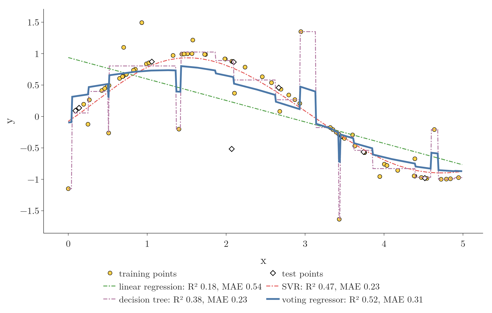

<!-- where-this-fits: generated by course_map/build_map.py; edit concepts.yaml, not this block -->
> **Where this fits:** Pipeline map steps 8 (Model), 9 (Evaluate). See the [Course map](../01-course-map/note.md).
>
> 
>
> - **Builds on:** Independent and mutually exclusive events ([Note 84](../84-mutually-exclusive-events/note.md)); Ensemble learning ([Note 101](../101-ensemble-learning/note.md)).
> - **Leads to:** Grid and random search ([Note 106](../106-bagging-classifier/note.md)).
> - **Compare with:** Train-test split ([Note 13](../13-toy-project/note.md)); Bagging ([Note 105](../105-bagging-intuition/note.md)); Stacking and blending (Video 127, coming).
<!-- /where-this-fits -->

## 1. Overview

> **Key point:** A voting regressor trains several regressors on the same data and predicts the mean of their outputs, or a weighted mean if we give weights.

The voting regressor is the regression version of the voting classifier (the [voting classifier Note](../103-voting-classifier/note.md)). Only the aggregation step changes: instead of a vote, we take the **mean**. This Note covers:

- the core idea and a demo with curves;
- scikit-learn's `VotingRegressor` on the Boston housing data, with `weights`;
- voting over one algorithm with different settings.

The Notebook (`notebook.ipynb`) runs every experiment. The Dash app `app.py` lets us tick base regressors and redraws their curves next to the voting regressor's.

## 2. The core idea

> **Key point:** Train every regressor on the same data; to predict, average their numerical outputs.

We have base models M1, M2 and M3, all regression algorithms, trained on the same dataset D. For a new query point $x_q$, each returns a number, and the voting regressor returns their mean (the [introduction to ensemble learning Note](../101-ensemble-learning/note.md), section 3.3, works an example). With weights, it returns the weighted mean, exactly as in soft voting (the [voting classifier Note](../103-voting-classifier/note.md), section 4.4).

## 3. Seeing it on a curve

> **Key point:** The voting regressor's curve runs between its base models' curves, smoothing out the extremes of each.

The demo data is a sine wave of 80 points between 0 and 5, with every fifth point pushed up or down at random: a non-linear pattern with a few outliers. We train on 72 points and keep 8 for testing. Figure 1 shows three base regressors and the voting regressor.

{height=48%}

Adding models one at a time (R² on the 8 test points):

| Base models | Each model's R² | Voting regressor's R² |
|---|---|---|
| linear regression | 0.18 | 0.18 |
| linear regression, SVR | 0.18, 0.47 | 0.51 |
| linear regression, SVR, decision tree | 0.18, 0.47, 0.38 | 0.52 |

- With **linear regression alone**, the voting regressor is that same line: one model averaged with nothing. A straight line cannot follow a wave, so $R^2$ (the [regression metrics Note](../52-regression-metrics/note.md)) is only 0.18.
- **Adding SVR** (support vector regression, the [SVM intuition Note](../92-svm-intuition/note.md)): SVR follows the wave well. The voting curve runs exactly halfway between the line and the SVR curve, and its $R^2$ (0.51) beats both.
- **Adding a decision tree** (depth 5): the tree jumps to reach many single points, outliers included. The voting curve follows its jumps only a third of the way, so it is much smoother than the tree. $R^2$ rises a little, to 0.52.

The point is the picture: averaging pulls each model's extremes toward the others.

> **Extra:** The legend also shows MAE (mean absolute error). By MAE, SVR and the tree (both 0.23) beat the voting regressor (0.31): with only 8 test points, and one of them an outlier, different metrics can rank models differently. A score from 8 points is a rough guide only; cross-validation, used below, is more reliable.

## 4. VotingRegressor on the Boston housing data

> **Key point:** Three weak models (R² 0.20, -0.07 and -0.41) combine into a voting regressor with R² 0.43; weights lift it to 0.45.

### 4.1 The data and the base models

> **Key point:** 506 districts, 13 inputs, median house price; linear regression, a decision tree and SVR, each scored by 10-fold cross-validation.

The Boston housing data (the [regression trees Note](../99-regression-trees/note.md), section 7.1, describes it and why `load_boston` was removed from scikit-learn) has 506 rows and 13 input columns. The output, `MEDV`, is the median house price of each district. The Notebook reads it from `data/boston.csv`.

> **Python:** Each base model alone.
>
> ```python
> boston = pd.read_csv("data/boston.csv")
> X, y = boston.drop(columns="MEDV"), boston["MEDV"]
>
> estimators = [("lr", LinearRegression()),
>               ("dt", DecisionTreeRegressor(random_state=0)),
>               ("svr", SVR())]
> for name, model in estimators:
>     scores = cross_val_score(model, X, y,
>                              scoring="r2", cv=10)
>     print(name, scores.mean())
> ```
>
> `scoring="r2"` makes `cross_val_score` report $R^2$ instead of accuracy.

| Model | Linear regression | Decision tree | SVR |
|---|---|---|---|
| Mean $R^2$ (10 folds) | 0.20 | -0.07 | -0.41 |

All three are poor: a negative $R^2$ means worse than always predicting the mean price. We could tune each one, but here we only want to compare them with voting.

### 4.2 The voting regressor

> **Key point:** Passing the same three models to `VotingRegressor` doubles the best R², from 0.20 to 0.43.

> **Python:** The voting regressor.
>
> ```python
> from sklearn.ensemble import VotingRegressor
>
> vr = VotingRegressor(estimators)
> cross_val_score(vr, X, y, scoring="r2", cv=10).mean()   # 0.43
> ```
>
> `VotingRegressor` takes the same list of (name, model) tuples as `VotingClassifier`, plus optional `weights` and `n_jobs`. There is no `voting` setting: regression always averages.

`n_jobs=-1` trains the base models in parallel on all CPU cores. It saves time on big data and makes little difference on small data like this.

### 4.3 Weights

> **Key point:** Trying weights 1 to 3 for each model, the best is (2, 1, 1), giving R² 0.45.

As for classification, we try each weight from 1 to 3 for each model, 27 combinations:

| Weights (lr, dt, svr) | (1, 1, 1) | (3, 1, 1) | (3, 2, 2) | **(2, 1, 1)** |
|---|---|---|---|---|
| Mean $R^2$ | 0.429 | 0.433 | 0.445 | **0.447** |

The best weights give linear regression, the best single model, twice the say of the others. The gain over equal weights is small here.

### 4.4 One algorithm, different settings

> **Key point:** Five trees of depth 1, 3, 5, 7 and unlimited score between -0.85 and 0.04; their vote scores 0.19.

We can also vote over one algorithm with different hyperparameter values. Five decision trees of different depths:

| max_depth | 1 | 3 | 5 | 7 | None | Vote of all five |
|---|---|---|---|---|---|---|
| Mean $R^2$ | -0.85 | -0.23 | 0.04 | -0.07 | -0.07 | **0.19** |

Every tree alone is poor, yet their average is clearly better than each of them.

> **Extra:** Why are all these scores so low? The Boston rows are stored grouped by town, and `cv=10` cuts the rows into 10 folds **in order**, without shuffling. Each fold then tests the model on towns it never saw during training. Shuffling first, with `cv=KFold(n_splits=10, shuffle=True, random_state=42)`, gives far higher scores: linear regression 0.72, decision tree 0.76, SVR 0.19, voting 0.75, and the vote of the five trees **0.79**. Note that with shuffled folds the plain vote (0.75) no longer beats the decision tree (0.76): voting is worth trying, not guaranteed to win.

## 5. Summary

| | Voting classifier | Voting regressor |
|---|---|---|
| Base models | classifiers | regressors |
| Aggregation | majority vote (hard) or average probability (soft) | mean of the predictions |
| Weights | `weights=[...]` | `weights=[...]` (weighted mean) |
| scikit-learn class | `VotingClassifier` | `VotingRegressor` |

- A voting regressor predicts the mean (or weighted mean) of its base regressors' predictions.
- On the noisy sine data, the voting curve smooths out the tree's jumps: $R^2$ 0.52 against 0.18, 0.47 and 0.38.
- On Boston, three poor models give a vote of 0.43 (0.45 with weights 2, 1, 1); five trees of different depths give 0.19.
- Shuffle the rows before cross-validation when the data is stored in a meaningful order.

## 6. Key terms

| Term | Meaning |
|---|---|
| Voting regressor | A regressor that predicts the mean (or weighted mean) of several trained regressors' predictions |
| n_jobs | scikit-learn setting for how many CPU cores to use in parallel; -1 means all |
