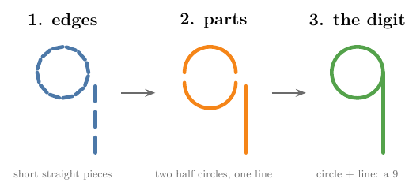
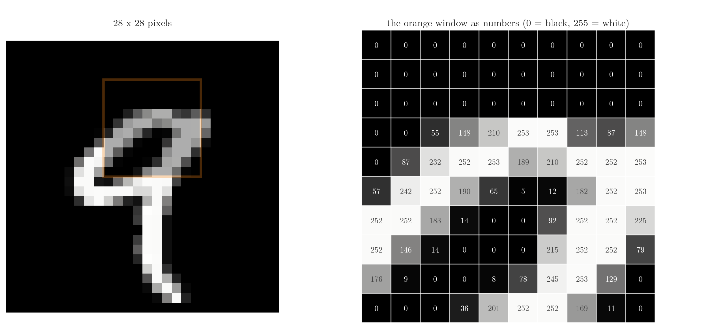
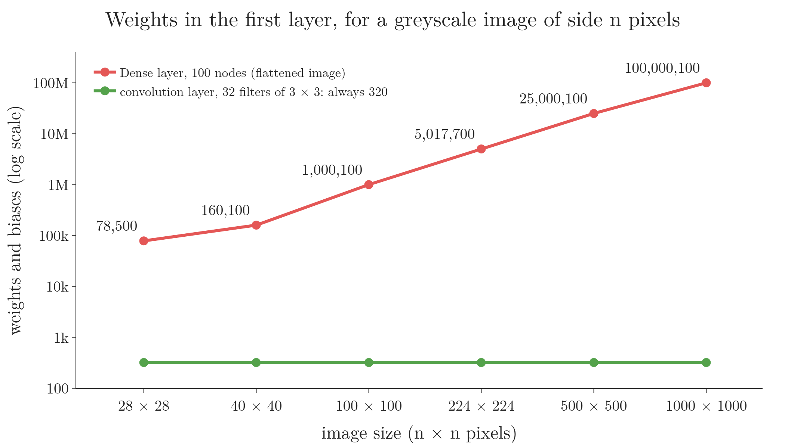
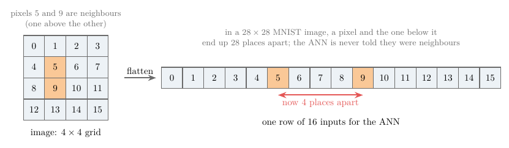
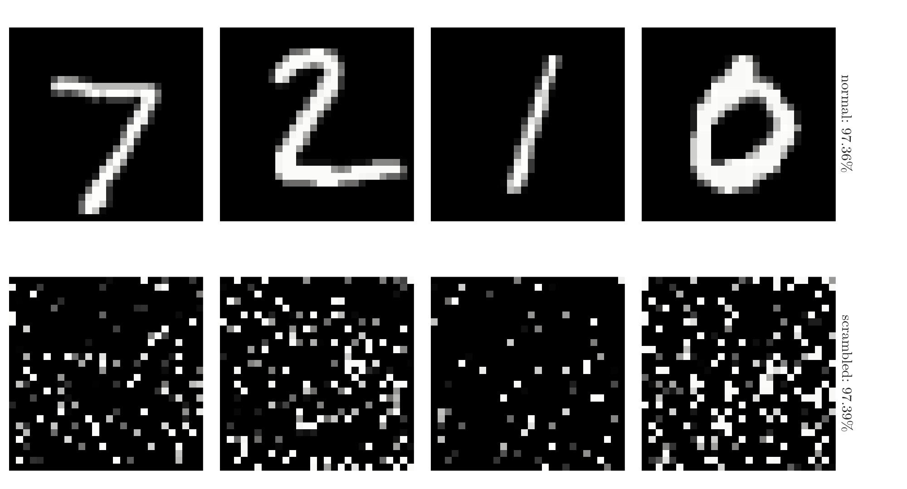
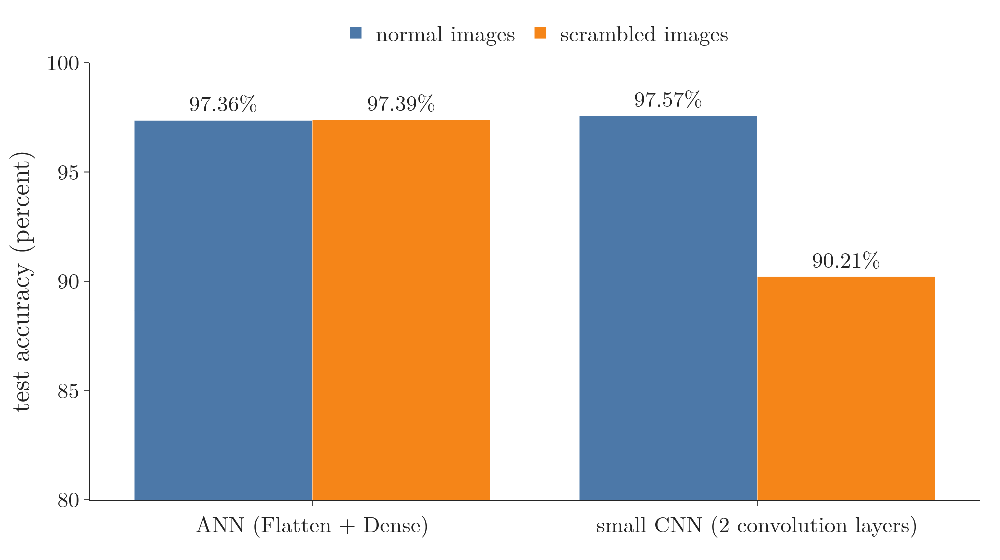
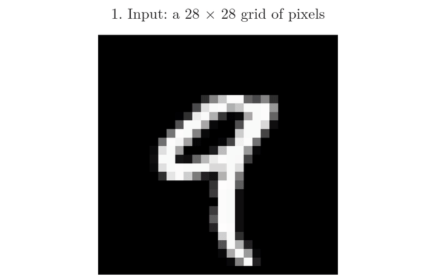
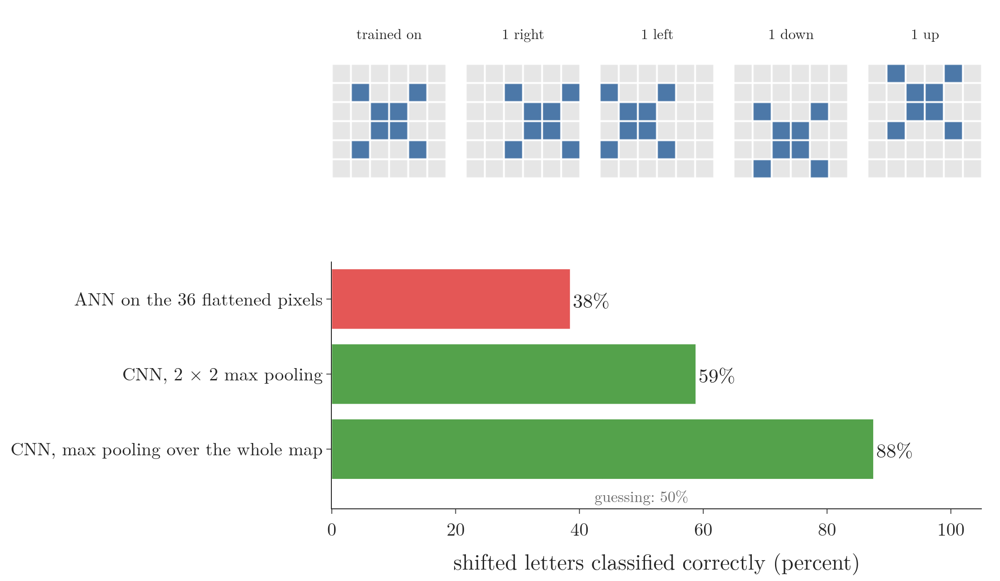

<!-- where-this-fits: generated by course_map/build_map.py; edit concepts.yaml, not this block -->
> **Where this fits:** Pipeline map step 8 (Model). See the [Course map](../01-course-map/note.md).
>
> 
>
> - **Builds on:** Representation learning ([Note 1002](../1002-what-is-deep-learning/note.md)); Convolution operation and feature maps ([Note 1042](../1042-convolution-operation/note.md)); Pooling ([Note 1044](../1044-pooling/note.md)).
> - **Compare with:** Multi-layer perceptron (MLP) ([Note 1009](../1009-mlp-intuition/note.md)).
<!-- /where-this-fits -->

## 1. Overview

> **Key point:** A convolutional neural network (CNN) is a neural network built for grid-like data such as images. Instead of connecting every pixel to every node, it slides small filters over the image to find simple features like edges, then combines them, layer by layer, into more complex features until it can recognise the whole object.

A **convolutional neural network** (G-484; CNN, or ConvNet) is "a specialized kind of neural network for processing data that has a known grid-like topology" (**grid-like topology**, G-873) (Goodfellow et al. 2016, ch. 9). **Time series** (G-1975) are a 1D grid: one value after another at regular time steps. Images are a 2D grid of pixels. Whenever data has such a grid structure, a CNN can be applied, and it usually works very well.

{width=85%}

This Note covers:

- what makes a network a CNN (section 3);
- why a plain ANN struggles with images (section 4);
- how a CNN builds features step by step (section 5, Figure 1);
- one tiny image followed through a whole CNN, number by number (section 6);
- where CNNs are used (section 7).

## 2. Prerequisites

- The [MLP intuition Note](../1009-mlp-intuition/note.md): layers of nodes, each combining the outputs of the previous layer.
- The [MNIST ANN Note](../1012-mnist-ann/note.md): handwritten digits classified by an ANN with a Flatten layer.
- The [overfitting Note](../91-knn/note.md): a model that fits the training data too closely and fails on new data.

## 3. What makes a network a CNN

> **Key point:** A CNN contains at least one convolution layer. A CNN is usually built from three kinds of layers: convolution, pooling and fully connected.

A CNN is a neural network whose **architecture** (G-209) differs slightly from an **ANN**'s (G-216). The difference is a special layer, the **convolution layer** (G-480), which performs a special operation, the **convolution operation** (G-481). An ANN combines its inputs by matrix multiplication (a **matrix product**, G-1179); a CNN uses convolution, in at least one layer (Goodfellow et al. 2016, ch. 9). So if a network's architecture contains a convolution layer, it is a CNN.

A CNN is built from three kinds of layers:

1. **Convolution layers:** they slide small filters over the image to find features. Taught in the [convolution operation Note](../1042-convolution-operation/note.md).
2. **Pooling layers** (G-1520): they shrink the result. Taught in the [pooling Note](../1044-pooling/note.md).
3. **Fully connected layers:** ordinary Dense layers, in which every node is connected to every node of the next layer, as in the [MNIST ANN Note](../1012-mnist-ann/note.md). They are often called **FC layers** (**fully connected (Dense) layers**, G-583).

The design of CNNs was inspired by the visual cortex, the part of the brain we see with (see the [CNN and visual cortex Note](../1041-cnn-vs-visual-cortex/note.md)).

## 4. Why not just use an ANN on images?

> **Key point:** An ANN can classify images, but flattening an image costs a huge number of weights, invites overfitting, throws away where each pixel is, and makes a slightly moved image look like a new one.

An ANN can work on images: the [MNIST ANN Note](../1012-mnist-ann/note.md) reached 97.63% test accuracy on handwritten digits. But a CNN usually does better on images, because an ANN has four problems with them.

### 4.1 An image is a grid of numbers

> **Key point:** A greyscale image is a 2D grid; each cell (pixel) holds one number from 0 (black) to 255 (white).

{width=100%}

To a computer, an image is a 2D grid of **pixels** (G-1501), and each pixel holds a number for its brightness (Figure 2). An MNIST digit is 28 × 28 = 784 pixels. Different numbers in different pixels are what make us see a shape.

To feed such an image to an ANN, we flatten it (**flattening**, G-789): the first row of pixels, then the second row after it, and so on, into one long row of 784 inputs (the Flatten layer of the [MNIST ANN Note](../1012-mnist-ann/note.md)). Every input is then connected to every node of the first hidden layer.

### 4.2 Problem 1: too many weights

> **Key point:** The first Dense layer has (number of pixels) × (number of nodes) weights. A 40 × 40 image and 100 nodes already need 160,000; a 1000 × 1000 image and 500 nodes need 500 million.

1. **In words:** every pixel is connected to every node, so the weights multiply.
2. **Formula:**
   $$\text{weights of the first layer} = \text{height} \times \text{width} \times \text{nodes}$$
3. **Example:** a 40 × 40 image flattened gives 1,600 inputs. With a small hidden layer of 100 nodes: $1{,}600 \times 100 = 160{,}000$ weights, for a tiny image and a tiny layer. A 1000 × 1000 image with 500 nodes: $1{,}000{,}000 \times 500 = 500{,}000{,}000$ weights.

Every one of these weights must be stored, used in **forward propagation** (G-797) and updated by **backpropagation** (G-247). As images grow, the weights grow, and training becomes very slow and costly on a large dataset.

Figure 3 shows the gap. The Dense layer's count grows with the number of pixels: about 78,500 for a 28 × 28 digit and 100 million for a 1000 × 1000 photo. A convolution layer of 32 small filters needs $3 \times 3 \times 32 + 32 = 320$ weights and biases for any image size, because each filter is reused at every position of the image (see the [convolution operation Note](../1042-convolution-operation/note.md)).

### 4.3 Problem 2: overfitting

> **Key point:** With so many connections, the network can memorise tiny details of the training images instead of learning patterns that hold on new ones.

Connecting every pixel to every node gives the network an enormous number of weights to fit, so it tries to capture every minute pattern of the training images. The network then does well on the training data but worse on test data: it **overfits** (**overfitting**, G-1429; see the [overfitting Note](../91-knn/note.md)). The CS231n notes make the same point: full connectivity on images "is wasteful and the huge number of parameters would quickly lead to overfitting".

### 4.4 Problem 3: the spatial arrangement is lost

> **Key point:** Flattening separates neighbouring pixels; the ANN never learns which pixels were next to which. In the Notebook an ANN learns scrambled images, unreadable to us, just as well as normal ones.

In a 2D image, where each pixel sits carries meaning. In a photo of a monkey, the eyes are above the nose, and the distance between them is an important clue that this is a monkey's face. Flattening row by row destroys this arrangement: a pixel and the one just below it end up 28 places apart in the flattened row (Figure 4). The concept of distance in 2D no longer exists in 1D.

{width=100%}

The Notebook shows that an ANN really does not use the arrangement. We take one fixed random shuffle of the 784 pixel positions and apply it to every training and test image. The scrambled digits are unreadable to us (Figure 5), yet the same ANN, trained the same way (5 epochs, 3 seeds), reaches 97.39% test accuracy on them, against 97.36% on the normal images.

{width=85%}

An ANN treats its 784 inputs as an unordered list: shuffle them consistently and it learns the same. It cannot use the fact that some pixels are neighbours, which is exactly the information that makes an image an image. Neighbouring pixels belong together: in a photo of a brown teddy bear, a brown pixel mostly has brown pixels next to it, and the strokes of a digit are runs of bright pixels side by side.

A CNN's filters look at small patches of neighbouring pixels, so they use this structure directly. The same test shows it. The small CNN of section 5.2, trained the same way on both versions (3 epochs, 3 seeds; script `experiments/scrambled_cnn.py`), reaches 97.57% on the normal images but only 90.21% on the scrambled ones (Figure 6).

{width=75%}

### 4.5 Problem 4: a moved image looks new

> **Key point:** Each weight of an ANN belongs to one fixed pixel. Move the object by one pixel and every weight meets a different part of it.

The first layer of an ANN has one weight per pixel position. If a digit is written one pixel further to the right, each stroke now falls on pixels whose weights were learned for something else, and nothing guarantees that the network still recognises it. Section 6.2 tests this on a tiny example. A CNN tolerates small shifts much better, because one filter is slid over every position.

## 5. How a CNN recognises an image

> **Key point:** Early layers find primitive features such as edges; each later layer combines the previous layer's features into more complex ones, until the last layers can recognise the whole object.

### 5.1 Breaking a 9 into features

> **Key point:** We recognise a 9 as a circle on top of a vertical line, whatever the handwriting. A CNN works the same way.

Suppose we must say whether an image shows a 9. The task is not simple: everyone writes a 9 differently, and the model must recognise all of them.

How do we do it ourselves? We look for patterns: a circle at the top and a vertical line down the right side (Figure 1). Even if the circle is a little squashed or the line a little slanted, we still see a 9. We break the digit into features and check that the right features are present.

A CNN follows the same principle. Given the image, it first extracts **primitive features** (G-1561): **edges** (G-661), the short straight segments that make up every stroke, such as the many small edges that form the circle. Then, layer by layer, it combines them into more complex features: two half circles, then a full circle with a line below it, and finally the 9.

### 5.2 Layer by layer

> **Key point:** Filters in the first convolution layer detect edges; the next convolution layers merge them into larger, more meaningful features.

A convolution layer contains **filters** (G-777): small grids of numbers that extract features from the image by simple mathematical operations (see the [convolution operation Note](../1042-convolution-operation/note.md)). Each filter moves over the image and checks, at every place, whether its pattern is there. Where the pattern is present, the filter's output is activated.

These activated features are passed to another convolution layer, whose filters merge them into more complex but more meaningful features. The deeper we go in the network, the more complex the features become, until the last layers hold the features that decide whether the digit is a 9.

Figure 7 shows this in a small CNN trained in the Notebook (two convolution layers, 97.72% test accuracy after 3 epochs). Watch the maps grow coarser and more specific from layer to layer. Layer 1's filters see 3 × 3 pixels; a filter with a red side and a blue side, such as the first, lights up along edges of one direction. Layer 2 works on 2 × 2-pooled layer-1 maps, so each of its 3 × 3 filters covers 8 × 8 pixels of the digit, and its maps mark larger pieces: the stem, the loop, the top stroke.

{width=100%}

The same holds for a photo of a cat:

1. the first layers detect edges;
2. the next layers detect parts such as ears, eyes or a mouth;
3. later layers combine eyes and ears into a face, and the face and body into a cat.

> **Extra:** A real CNN trained on **MNIST** (G-1249) does learn **edge detectors** (G-659) in its first layer without being told to: the [convolution operation Note](../1042-convolution-operation/note.md), section 8, trains one and finds vertical- and horizontal-edge filters among its learned filters.

## 6. One image through a whole CNN

> **Key point:** A tiny CNN does four things in a row. A filter slides over the image and writes a feature map. ReLU sets the negative values to 0. Max pooling keeps the largest value of each block. A small dense network turns the few numbers that are left into the answer.

Sections 4 and 5 gave the reasons and the idea. To see every number, we shrink the problem: a 6 × 6 image that shows either the letter O or the letter X, with 1 for an ink pixel and 0 for an empty one. The network must say which letter it sees.

{width=100% height=60%}

### 6.1 The four steps

> **Key point:** 36 pixels become a 4 × 4 feature map, then 4 pooled numbers, then 2 outputs. The filter's 9 weights and 1 bias are learned, like every other weight.

Figure 8 follows the letter O through the network, one step per frame:

1. **The filter slides.** A **filter** (G-777) is a 3 × 3 grid of weights. We lay it on the top-left 3 × 3 window of the image, multiply each weight by the pixel under it, add the 9 products, and add one more number, the bias (here $-0.50$). The result goes into the first cell of a new grid, the **feature map** (G-766). Then the filter moves one pixel to the right and we repeat. A 3 × 3 filter fits in 4 positions across and 4 down, so the feature map is 4 × 4. A cell is large where the pixels under the filter look like the filter's pattern.
2. **ReLU.** Every value passes through **ReLU** (G-1668), $\max(0, z)$: negative values become 0 and positive values stay. For the O, 7 of the 16 values stay above 0.
3. **Max pooling.** The 4 × 4 map is cut into four 2 × 2 blocks, and **max pooling** (G-1182) keeps only the largest value of each block: 0.49, 0.84, 0.96 and 0. Each of these numbers says how well the filter matched somewhere in its quarter of the image.
4. **The dense part.** The four numbers are flattened into a row and fed to an ordinary small network: one hidden node with ReLU, then two output nodes, one for O and one for X. For the O the hidden node gives 0 and the outputs are O = 1.00 and X = 0.00. For the X the pooled numbers are 1.64, 0.20, 0.22 and 0.40, the hidden node gives 1.41, and the outputs are O = 0.00 and X = 1.00.

Nobody chose the filter's values. Like the dense weights, they started random and were fitted to the two letters (the script `experiments/toy_cnn.py`). In a real CNN they are learned by **backpropagation** (G-247); the [convolution operation Note](../1042-convolution-operation/note.md) shows this on MNIST. The same four steps, with more filters and more layers, make up every CNN in the Notes that follow: the [convolution operation](../1042-convolution-operation/note.md), [padding and strides](../1043-padding-and-strides/note.md), [pooling](../1044-pooling/note.md) and [LeNet-5](../1045-lenet-5/note.md) Notes each take one part of Figure 8 and study it closely.

### 6.2 What the CNN gained

> **Key point:** Fewer inputs for the dense part (36 pixels became 4 numbers), fewer weights (19 against 41), use of neighbouring pixels, and more tolerance to a letter that moves by a pixel.

The toy network answers the problems of section 4:

- **Fewer inputs and weights.** The dense part receives 4 numbers, not 36 pixels. The whole CNN has 19 weights and biases (10 in the filter, 5 in the hidden node, 4 in the outputs). An ANN with one hidden node on the 36 flattened pixels needs 41.
- **Neighbouring pixels are used together.** Each cell of the feature map comes from a 3 × 3 patch of neighbours, the arrangement an ANN throws away (section 4.4).
- **Small shifts matter less** (section 4.5). We fitted each kind of network to the two centred letters only, then showed it the 8 letters moved by one pixel left, right, up or down (Figure 9, top).

{width=90%}

| Network | Shifted letters right |
|---|---|
| ANN on the 36 flattened pixels | 38% |
| CNN, 2 × 2 max pooling (Figure 8) | 59% |
| Same CNN, max pooling over the whole 4 × 4 map | 88% |

(Each network was fitted from 50 random starts; the table averages the starts that learned both centred letters: 26, 10 and 16 of them. Script `experiments/toy_cnn.py`.)

The ANN gets only 38% of them right. Each of its weights belongs to one fixed pixel, so a moved letter lands on weights that were fitted for other pixels. The CNN's filter finds its pattern wherever it sits, and max pooling then keeps the best match of a block, wherever in the block it is. The larger the block, the larger the shift it absorbs: one pixel is a big move on a 6 × 6 image with 2 × 2 blocks, and pooling over the whole map handles it far better. "Pooling helps to make the representation approximately invariant to small translations of the input" (Goodfellow et al. 2016, §9.3). The [pooling Note](../1044-pooling/note.md) studies this **translation invariance** (G-2011).

## 7. Where CNNs are used

> **Key point:** Image classification, object localisation and detection, face recognition, image segmentation, super-resolution, colourisation and pose estimation.

CNNs are among the most successful neural networks in real-world use, from face recognition software to self-driving cars. Some application areas:

| Task | What the CNN does |
|---|---|
| Image classification | Says which class an image belongs to, such as cat or dog |
| Object localisation | Finds where an object is and draws a rectangular box around it |
| Object detection | Finds and boxes every object in an image, with a confidence for each; used in self-driving cars |
| Face detection and recognition | Finds faces and recognises whose they are, as in smartphone cameras |
| Image segmentation | Divides an image into regions, such as a tiger and the grass behind it |
| Super-resolution | Raises the resolution of low-quality images, such as old photos |
| Colourisation | Turns black-and-white photos and films into colour |
| Pose estimation | Detects the posture of a person's body from a camera feed, as in fitness apps and motion-controlled games |

## 8. Summary

| | ANN on images | CNN |
|---|---|---|
| Input | flattened to 1D | kept as a 2D grid |
| Weights | pixels × nodes; huge for big images | small filters |
| Overfitting | likely, with so many weights | less likely |
| Spatial arrangement | lost (scrambling the pixels changes nothing) | used: filters look at neighbouring pixels (scrambling costs 7 points) |
| A small shift of the object | every weight meets different pixels | tolerated better: the filter slides, pooling keeps the best match |
| Features | none built in | edges, then parts, then objects |

- A CNN is a neural network for grid-like data, with at least one convolution layer.
- It is built from convolution layers, pooling layers and fully connected layers.
- An ANN on images needs huge numbers of weights, overfits, ignores where pixels are, and is thrown off by small shifts.
- The pipeline of a CNN: filter → feature map → ReLU → max pooling → flatten → dense layers → answer.
- A CNN finds edges first and combines them into more complex features, layer by layer.
- Its design was inspired by the visual cortex.

## 9. Sources

**Built from**

- CampusX, "What is Convolutional Neural Network (CNN) | CNN Intution", YouTube, https://www.youtube.com/watch?v=hDVFXf74P-U
- Starmer, J. (StatQuest), "Neural Networks Part 8: Image Classification with Convolutional Neural Networks (CNNs)", YouTube, https://www.youtube.com/watch?v=HGwBXDKFk9I (the 6 × 6 O and X followed through filter, ReLU, max pooling and a dense network; the shift test; neighbouring pixels are alike)

**Other references**

- Goodfellow, I., Bengio, Y. and Courville, A. (2016). *Deep Learning*. MIT Press. Chapter 9 introduction (definition of convolutional networks); §9.3 (pooling and invariance to small translations).
- Stanford CS231n course notes, "Convolutional Neural Networks", section "Regular Neural Nets don't scale well to full images", cs231n.github.io/convolutional-networks.

## 10. Key terms

| Term | Meaning |
|---|---|
| Convolutional neural network (CNN) | A neural network for grid-like data that uses convolution in at least one layer |
| Grid-like topology | Data arranged on a regular grid: 1D for time series, 2D for images |
| Pixel | One cell of an image grid, holding a brightness value |
| Convolution layer | A layer that slides small filters over its input to find features |
| Pooling layer | A layer that shrinks the output of a convolution layer |
| Fully connected (FC) layer (G-583) | A Dense layer: every node connected to every node of the next layer |
| Filter (G-777) | A small grid of learned weights slid over the image |
| Feature map (G-766) | The grid of numbers a filter writes, one per position; large where the filter's pattern is present |
| Max pooling | Keeping only the largest value of each block of a feature map |
| Translation invariance | Giving the same answer when the object moves a little in the image |
| Primitive feature | A basic feature such as an edge, found by the first layers |
| Spatial arrangement | Where each pixel sits relative to the others |
