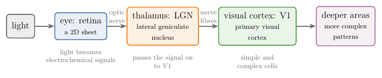

<!-- where-this-fits: generated by course_map/build_map.py; edit concepts.yaml, not this block -->
> **Where this fits:** Pipeline map step 8 (Model). See the [Course map](../01-course-map/note.md).
>
> 
>
> - **Builds on:** Representation learning ([Note 1002](../1002-what-is-deep-learning/note.md)).
> - **Compare with:** Multi-layer perceptron (MLP) ([Note 1009](../1009-mlp-intuition/note.md)).
<!-- /where-this-fits -->

## 1. Overview

> **Key point:** In the visual cortex, simple cells each respond to an edge of one orientation in a small patch of the image, and complex cells respond to the same kind of edge anywhere in a larger patch. A CNN copies both: filters play the simple cells and pooling plays the complex cells.

The [CNN intuition Note](../1040-cnn-intuition/note.md) said that CNNs are inspired by the part of the brain that handles vision. This Note tells that story in three parts: how visual information flows through the brain, the experiments of Hubel and Wiesel on cats, and how their findings led to the Neocognitron, to LeCun's networks and to today's CNNs.

{width=100%}

## 2. Prerequisites

- The [CNN intuition Note](../1040-cnn-intuition/note.md): early layers find edges, later layers combine them.
- The [convolution operation Note](../1042-convolution-operation/note.md): a filter is a small grid of weights slid over the image; its output is large where its pattern is present. (Only this one-line idea is needed here.)
- The [pooling Note](../1044-pooling/note.md): max pooling keeps the largest value of each window.

## 3. How visual information flows

> **Key point:** Light falls on the retina, travels as electrochemical signals along the optic nerve to the lateral geniculate nucleus in the thalamus, and from there to V1, the primary visual cortex at the back of the head.

{width=100%}

Figure 2 shows the path:

1. **Retina.** Light enters the eye and falls on the retina, a 2D sheet of cells at the back of the eye. The retina turns the light into electrochemical signals.
2. **Optic nerve.** A bundle of nerve fibres carries the signals out of the eye.
3. **Lateral geniculate nucleus (LGN).** A region inside the thalamus. For our purposes its main job, like the retina's, is to carry the signal on from the eye to V1 (Goodfellow et al. 2016, §9.10).
4. **Primary visual cortex (V1).** The first area of the cortex to process the signal, at the back of the head. The visual cortex is the part of the brain that a CNN imitates.

V1 is arranged as a 2D map that mirrors the image on the retina: light arriving on the lower half of the retina affects only the corresponding half of V1 (Goodfellow et al. 2016, §9.10). CNNs keep the same 2D structure: their feature maps are grids that mirror the image.

## 4. The experiment of Hubel and Wiesel

> **Key point:** Recording single neurons in a cat's visual cortex while showing it bars of light, Hubel and Wiesel found that each cell responds strongly to a bar of one particular orientation and hardly at all to others.

### 4.1 The setup

> **Key point:** An anaesthetised cat faces a screen; an electrode records one neuron of its visual cortex while lines of light are shown.

Around 1960 the neurophysiologists David Hubel and Torsten Wiesel ran a series of experiments on cats, and later on monkeys (Hubel and Wiesel 1959, 1962, 1968, as summarised in Goodfellow et al. 2016, §9.10). A cat was anaesthetised, its eyes facing a screen. A fine electrode placed in its visual cortex recorded the electrical activity of one neuron at a time. On the screen they projected simple patterns of light, such as bars and edges at precise places, and noted how the neuron responded.

Their work was later recognised with a Nobel prize (Goodfellow et al. 2016, §9.10).

### 4.2 What they saw

> **Key point:** A cell is silent for a horizontal bar, starts firing as the bar tilts, fires most when it is vertical, and falls silent again as it returns to horizontal. Another cell prefers horizontal, another a slant.

Take one recorded cell. A horizontal bar gives no response. As the bar is rotated, there is still nothing at first; past a certain angle the cell starts to fire a little, more as the bar tilts further, and most when the bar is vertical. Rotated further, the response falls again and disappears at horizontal. This cell detects vertical edges.

Another cell behaves the same way but prefers horizontal bars, another a slant, and so on. So different cells of the visual cortex respond to different orientations, each strongly to its own and hardly at all to the others: the neurons of the early visual system "responded most strongly to very specific patterns of light, such as precisely oriented bars, but responded hardly at all to other patterns" (Goodfellow et al. 2016, §9.10).

## 5. Simple cells and complex cells

> **Key point:** A simple cell responds to an edge of one orientation at one place in a small receptive field. A complex cell responds to the same kind of edge, but anywhere within a larger region: it does not care about small shifts.

### 5.1 Simple cells

> **Key point:** Small receptive field, one preferred orientation: edge detectors.

From these experiments Hubel and Wiesel described two types of cells in V1, **simple cells** and **complex cells**.

A simple cell has a small **receptive field**: it looks at a small area of the image only. A simple cell works on the principle of a **preferred stimulus**: it responds to edges of one orientation, say vertical, and not to horizontal or slanted ones. For every orientation there are simple cells that prefer it. Their job is edge detection, so they are also called **feature detectors**.

Why does nature start with edges? Because every image is made of edges. A face is a set of edges, and even a circle can be broken into many short edges. Detecting edges first is the most basic step of seeing.

### 5.2 Complex cells

> **Key point:** Same preferred orientation, larger receptive field, and invariant to small shifts in position.

Complex cells "respond to features that are similar to those detected by simple cells, but complex cells are invariant to small shifts in the position of the feature" (Goodfellow et al. 2016, §9.10). A complex cell that prefers vertical edges fires for a vertical edge anywhere within its larger receptive field. A complex cell works on the output of simple cells and passes its information on to the next stages.

As we pass through further areas of the brain, the same strategy, detection followed by pooling, is applied again and again, and cells respond to more and more complex patterns (Goodfellow et al. 2016, §9.10). Deep inside the visual system some cells respond to a specific concept, such as one particular face, whatever its position, size or lighting. So the brain builds the image up in stages: edges, then combinations of edges, then whole objects.

### 5.3 The same behaviour in a filter and a max

> **Key point:** A small vertical-bar filter, at one position, is tuned to orientation like a simple cell. The maximum of that filter's responses over a neighbourhood keeps the tuning but ignores shifts of the bar, like a complex cell.

The Notebook builds a model, not a brain recording. A "simple cell" is a 7 × 7 filter that is positive in its middle column and negative on both sides, so it answers a bright vertical line; its response is the filter applied at one fixed position, followed by ReLU. A "complex cell" is the maximum of the same filter's responses over all positions within 8 pixels of that point, which is max pooling over a neighbourhood.

{width=100%}

Figure 3 shows both effects:

- **Orientation.** As the bar rotates from horizontal (0°) to vertical (90°), both responses rise from 0 to their maximum, then fall back to 0 at 180°: the tuning Hubel and Wiesel recorded.
- **Position.** Shifting a vertical bar 2 pixels to the side drops the simple cell's response to 0, because the bar has left its small receptive field. The complex cell's response stays at its maximum for every shift from −8 to +8 pixels.

These two models are exactly the two main layers of a CNN. The filter of a convolution layer plays the simple cell, and max pooling plays the complex cell. Goodfellow et al. (2016, §9.10) say the same: the detector units of a CNN "are designed to emulate these properties of simple cells", and complex cells inspire "the pooling units of convolutional networks".

## 6. From the visual cortex to CNNs

> **Key point:** Fukushima's Neocognitron (1980) copied simple and complex cells as S-cells and C-cells. LeCun's networks (from 1989) added training by backpropagation. AlexNet's ImageNet win in 2012 started today's wave of CNNs.

### 6.1 The Neocognitron

> **Key point:** Alternating layers of S-cells (like simple cells) and C-cells (like complex cells); it recognised patterns regardless of their position, but learned without backpropagation.

The first model built on these findings was the **Neocognitron** of the Japanese scientist Kunihiko Fukushima (Fukushima 1980). The Neocognitron is a cascade of modules, each of two layers: **S-cells**, similar to simple cells, followed by **C-cells**, similar to complex cells. Its structure follows "the hierarchy model of the visual nervous system proposed by Hubel and Wiesel", and it recognised stimulus patterns "without affected by their positions" (Fukushima 1980). In the paper it was trained on five stimulus patterns, the numerals 0 to 4.

Like the brain, its first layers recognise simple features such as edges, and later layers combine them into more complex patterns. The Neocognitron was an inspiration for CNNs, but it did not work well enough in practice. The Neocognitron had most of the design elements of a modern convolutional network but relied on a layer-wise unsupervised clustering algorithm, not on backpropagation and gradient descent (Goodfellow et al. 2016, §9.10).

### 6.2 LeCun's CNNs

> **Key point:** Convolution layers, pooling layers and training by backpropagation: the first working CNNs, used to read handwritten digits and bank cheques.

In 1989 Yann LeCun introduced convolutional networks trained with backpropagation (LeCun 1989, cited in Goodfellow et al. 2016, §9.10). His networks combined convolution layers, pooling layers and backpropagation. Their 1998 version, LeNet-5 (see the [LeNet-5 Note](../1045-lenet-5/note.md)), was part of a check-reading system that "is deployed commercially and reads several million checks per day" (LeCun et al. 1998). From there, serious research on CNNs began.

### 6.3 AlexNet and after

> **Key point:** In 2012 a CNN, AlexNet, won the ImageNet object recognition challenge; many CNN architectures followed.

The current wave of commercial interest in deep learning began when Krizhevsky et al. (2012) won the ImageNet object recognition challenge with a CNN, AlexNet (Goodfellow et al. 2016, §9.11). Many more CNN architectures have followed since.

## 7. Summary

| Visual cortex | CNN |
|---|---|
| Retina: a 2D sheet of light receptors | input image: a 2D grid of pixels |
| V1 is a 2D map of the image | feature maps are 2D grids |
| Simple cell: one orientation, small receptive field | filter of a convolution layer |
| Complex cell: same orientation, invariant to small shifts | pooling |
| Deeper areas: more complex patterns | deeper layers: more complex features |

- Visual signals travel from the retina through the optic nerve and the LGN to V1.
- Hubel and Wiesel found cells tuned to the orientation of edges.
- Simple cells detect oriented edges in a small field; complex cells detect them anywhere in a larger field.
- The Neocognitron copied simple and complex cells; LeCun added backpropagation; AlexNet (2012) made CNNs famous.

## 8. Sources

**Built from**

- CampusX, "CNN Vs Visual Cortex | The Famous Cat Experiment | History of CNN", YouTube, https://www.youtube.com/watch?v=aslTGS9ef98

**Other references**

- Fukushima, K. (1980). Neocognitron: A self-organizing neural network model for a mechanism of pattern recognition unaffected by shift in position. *Biological Cybernetics*, 36, 193–202.
- Goodfellow, I., Bengio, Y. and Courville, A. (2016). *Deep Learning*. MIT Press. §9.10 (the neuroscientific basis for convolutional networks) and §9.11 (convolutional networks and the history of deep learning).
- Hubel, D. H. and Wiesel, T. N. (1959). Receptive fields of single neurones in the cat's striate cortex. *Journal of Physiology*, 148, 574–591. (Cited through Goodfellow et al. 2016, §9.10.)
- Hubel, D. H. and Wiesel, T. N. (1962). Receptive fields, binocular interaction and functional architecture in the cat's visual cortex. *Journal of Physiology*, 160, 106–154. (Cited through Goodfellow et al. 2016, §9.10.)
- LeCun, Y., Bottou, L., Bengio, Y. and Haffner, P. (1998). Gradient-based learning applied to document recognition. *Proceedings of the IEEE*, 86(11), 2278–2324.

## 9. Key terms

| Term | Meaning |
|---|---|
| Retina | The 2D sheet of light-sensitive cells at the back of the eye |
| Lateral geniculate nucleus (LGN) | A region of the thalamus that passes visual signals on to V1 |
| Primary visual cortex (V1) | The first area of the cortex that processes visual signals |
| Receptive field | The area of the image that one cell (or one unit of a network) responds to |
| Preferred stimulus | The pattern, such as an edge of one orientation, that a cell responds to most |
| Simple cell | A V1 cell that responds to an edge of one orientation at one place in a small receptive field |
| Complex cell | A V1 cell that responds to a preferred edge anywhere in a larger receptive field |
| Neocognitron | Fukushima's 1980 model of S-cells and C-cells, a forerunner of CNNs |
