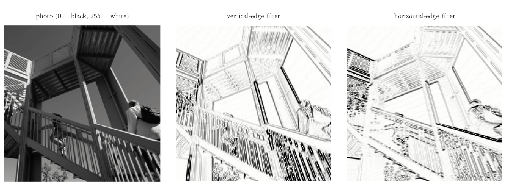
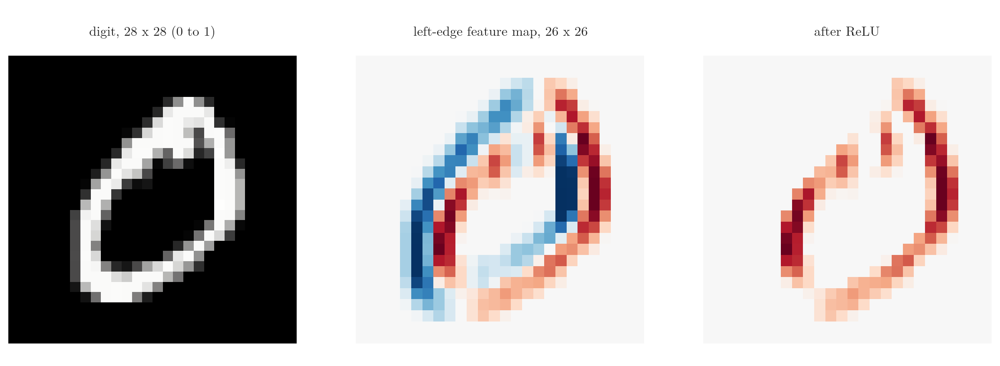
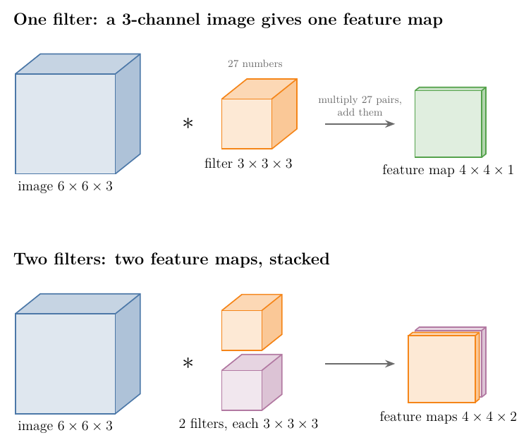

## 1. Overview

> **Key point:** A convolution slides a small grid of numbers, the filter, over an image. At each position it multiplies the filter and the pixels under it cell by cell and adds the products. The numbers it writes out form a new grid, the feature map, which is large wherever the image contains the pattern the filter looks for.

A **convolutional neural network** (CNN) is built from three kinds of layers: convolution layers, pooling layers and fully connected layers (see the [CNN intuition Note](../1040-cnn-intuition/note.md)). The convolution layer is the one that gives the network its name, and the one that finds features such as edges.

{width=100% height=55%}

Figure 1 shows the whole operation on a tiny image. This Note covers how images are stored, what an edge is, the convolution step by step, the size of the result, why the filter values are learned, and what changes for colour images and for many filters.

## 2. Prerequisites

- The [CNN intuition Note](../1040-cnn-intuition/note.md): an image is a grid of pixel values, and the first layers of a CNN look for edges.
- The [MNIST ANN Note](../1012-mnist-ann/note.md): the MNIST digits and scaling pixels to 0–1.
- The [activation functions Note](../1027-activation-functions/note.md): ReLU.
- The [backpropagation Note](../1015-backpropagation-what/note.md): how weights are learned.

## 3. How images are stored

> **Key point:** A greyscale image is one grid of numbers, one per pixel. A colour image is three such grids stacked, one each for red, green and blue: three channels.

### 3.1 Greyscale images

> **Key point:** One channel. Each pixel holds a number from 0 (black) to 255 (white), often scaled to 0–1.

An MNIST digit is a grid of 28 × 28 pixels, and each pixel holds one number between 0 and 255 (see the [CNN intuition Note](../1040-cnn-intuition/note.md) for a digit drawn as its numbers). In MNIST, 0 means black, the background, and 255 means white, the ink. We often divide by 255 to bring the values into the range 0 to 1, as in the [MNIST ANN Note](../1012-mnist-ann/note.md).

To the computer, a greyscale image is just a 2D array of numbers. Every operation on the image is an operation on that array.

### 3.2 Colour (RGB) images

> **Key point:** Three channels, red, green and blue, each a greyscale-like grid of 0–255. Shape: height × width × 3.

A colour image stores three grids of the same size, one for each primary colour: **red, green and blue** (RGB). Mixing the three intensities gives every other colour. Each grid is called a **channel**, and each holds values from 0 to 255.

So a colour image has shape height × width × 3. The only difference between a greyscale and an RGB image is the number of channels: one against three.

## 4. Edges are changes in intensity

> **Key point:** An edge is a place where the brightness changes sharply, from dark to light or light to dark. A filter that compares neighbouring pixels finds it.

Any image is made up of edges: the outline of a face, the side of a building, the stroke of a digit. The first layers of a CNN detect edges, the most basic features of an image (see the [CNN intuition Note](../1040-cnn-intuition/note.md)).

An **edge** is a change in intensity. Where a black region meets a white one, the pixel values jump from 0 to 255. Our eyes see the edge at once; an algorithm must find where the numbers change, and the convolution operation does exactly that.

{width=100%}

Figure 2 shows the result on a real photo. One filter finds the vertical edges, another finds the horizontal ones. Other filters find slanted edges. Sections 5 and 6 show how.

## 5. The convolution operation

> **Key point:** Place the filter on the top-left corner, multiply each filter value by the pixel under it, add the products, write the sum. Slide one pixel right and repeat; at the end of a row, go back left and one pixel down.

### 5.1 Filter and feature map

> **Key point:** The filter (or kernel) is a small matrix, usually 3 × 3. Convolving it with the image gives the feature map.

Three objects take part:

- the **image**, the input;
- the **filter**, also called the **kernel**: a small matrix of numbers, usually 3 × 3 but sometimes larger;
- the **feature map**: the output grid of the convolution.

The filter we use is a **horizontal-edge detector**:

$$K = \begin{bmatrix} -1 & -1 & -1 \cr0 & 0 & 0 \cr1 & 1 & 1 \end{bmatrix}$$

The filter subtracts the row above from the row below. Where the two are equal it gives 0; where the lower row is brighter it gives a large number. The symbol $\ast$ denotes convolution: image $\ast$ filter = feature map.

### 5.2 One step

> **Key point:** One position of the filter gives one number: the sum of 9 products.

1. **In words:** lay the filter on a 3 × 3 window of the image, multiply each pair of overlapping numbers, and add the 9 products.
2. **Formula:** the value at row $i$, column $j$ of the feature map $Z$, for an image $X$ and a 3 × 3 filter $K$ (rows and columns counted from 0):
   $$Z_{ij} = \sum_{m=0}^{2}\sum_{n=0}^{2} X_{i+m,\thinspace j+n}\thinspace K_{mn}$$
3. **Example:** the 6 × 6 image of Figure 1 has three rows of 0 (black) on top of three rows of 255 (white). With the filter on rows 2–4, its top row meets 0s, its middle row meets 0s and its bottom row meets 255s:
   $$(-1)(0) \times 3 + (0)(0) \times 3 + (1)(255) \times 3 = 765$$

### 5.3 Sliding over the whole image

> **Key point:** 16 positions on a 6 × 6 image give a 4 × 4 feature map: 0, then two rows of 765, then 0. The large values mark exactly where the edge is.

The filter moves one pixel to the right at a time. At the end of a row it returns to the left and moves one pixel down. Every position gives one number (Figure 1):

- **Row 1** of the feature map (filter on image rows 0–2): all pixels are 0, so every sum is 0.
- **Rows 2 and 3** (filter on rows 1–3 and 2–4): the bottom of the filter sits on white pixels and the top on black or on the boundary, so each sum is $3 \times 255 = 765$.
- **Row 4** (filter on rows 3–5): all pixels are 255. The top row gives $-765$, the bottom row $+765$, and they cancel to 0.

  $$\begin{bmatrix} 0&0&0&0&0&0\cr0&0&0&0&0&0\cr0&0&0&0&0&0\cr255&255&255&255&255&255\cr255&255&255&255&255&255\cr255&255&255&255&255&255 \end{bmatrix} \ast\begin{bmatrix} -1&-1&-1\cr0&0&0\cr1&1&1 \end{bmatrix} = \begin{bmatrix} 0&0&0&0\cr765&765&765&765\cr765&765&765&765\cr0&0&0&0 \end{bmatrix}$$

The feature map is 0 in flat regions and large along the band where black meets white: it has found the horizontal edge. Shown as an image, it is a bright stripe across the middle.

> **Python:** The convolution in a few lines of NumPy. `X[i:i+3, j:j+3]` cuts out the 3 × 3 window; `*` multiplies cell by cell; `.sum()` adds.
>
> ```python
> def conv2d(X, K):
>     n_r = X.shape[0] - K.shape[0] + 1
>     n_c = X.shape[1] - K.shape[1] + 1
>     Z = np.zeros((n_r, n_c))
>     for i in range(n_r):
>         for j in range(n_c):
>             window = X[i:i + K.shape[0], j:j + K.shape[1]]
>             Z[i, j] = (window * K).sum()
>     return Z
> ```

The Notebook loads the same filter into a Keras `Conv2D` layer: it returns exactly the same 4 × 4 numbers (largest difference 0).

### 5.4 Other filters find other edges

> **Key point:** Turn the filter by 90 degrees and it finds vertical edges. Changing the numbers changes the feature the filter looks for.

The transpose of the horizontal filter,

$$K_v = \begin{bmatrix} -1 & 0 & 1 \cr-1 & 0 & 1 \cr-1 & 0 & 1 \end{bmatrix}$$

compares the column on the right with the column on the left, so it is a **vertical-edge detector**. On our 6 × 6 image, which has no vertical edge, it gives a feature map of all 0s (Notebook). On the photo of Figure 2 it lights up the railings. With other values we get filters for slanted edges, or for edges with the dark side on the left, right, top or bottom.

> **Extra:** Strictly, mathematicians call this operation **cross-correlation**. A true convolution first flips the kernel upside down and left to right. Most deep learning libraries compute the cross-correlation and call it convolution (Goodfellow et al. 2016, §9.1). The Notebook confirms it for Keras: `Conv2D` gives $+765$ where the flipped filter would give $-765$. Because the filter values are learned (section 7), the difference does not matter: training would simply learn the flipped filter.

## 6. The size of the feature map

> **Key point:** An $n \times n$ image convolved with an $f \times f$ filter gives an $(n - f + 1) \times (n - f + 1)$ feature map.

The filter must fit inside the image. Along one row it can start at positions $0, 1, \dots, n - f$: that is $n - f + 1$ positions. The same holds down the columns.

1. **In words:** the feature map is smaller than the image by the filter size minus 1.
2. **Formula:**
   $$\text{output size} = n - f + 1$$
3. **Example:** a 6 × 6 image and a 3 × 3 filter: $6 - 3 + 1 = 4$, a 4 × 4 feature map. An MNIST digit, 28 × 28, with a 3 × 3 filter: $28 - 3 + 1 = 26$. A 64 × 64 image: 62 × 62.

The Notebook checks the formula against Keras for three image sizes and two filter sizes:

| Image $n$ | Filter $f$ | $n - f + 1$ | Keras `Conv2D` output |
|---|---|---|---|
| 6 | 3 | 4 | 4 |
| 6 | 5 | 2 | 2 |
| 28 | 3 | 26 | 26 |
| 28 | 5 | 24 | 24 |
| 64 | 3 | 62 | 62 |
| 64 | 5 | 60 | 60 |

The [padding and strides Note](../1043-padding-and-strides/note.md) extends the formula to padded images and to filters that jump more than one pixel.

## 7. Filters are learned, not designed

> **Key point:** In a CNN the filter values are weights. They start random and backpropagation sets them, so the network builds the filters its task needs.

People have designed many filters by hand: left, right, top and bottom edge detectors and others. A CNN does not need them. In deep learning we only choose the filter size and the number of filters; the values start random and are learned during training by backpropagation, exactly like the weights of an ANN (see the [backpropagation Note](../1015-backpropagation-what/note.md)). The values that come out depend on the training data. Learning its own filters, instead of relying on hand-made ones, is one of the main reasons CNNs became so successful.

The Notebook shows this happening. A small CNN with one convolution layer of 8 filters (3 × 3), followed by Flatten and a softmax output layer, trains for 2 epochs on MNIST and reaches 96.7% test accuracy.

{width=100%}

In Figure 3 nobody told the network what to look for, yet filter 0 has turned negative on its left column and positive on its right: a vertical-edge detector, and its feature map marks the left and right sides of the 0. Filter 1 has become positive on top and negative at the bottom, a horizontal-edge detector, and it marks the top and bottom of the 0. Filter 4 ended with all values negative; on this digit, whose pixels are all 0 or more, its map is empty after ReLU.

> **Extra:** Each filter of a `Conv2D` layer also has one bias, added to every value of its feature map before the activation, just as each node of a `Dense` layer has one bias (Keras documentation, `Conv2D`). The [CNN vs ANN Note](../1046-cnn-vs-ann/note.md) counts these parameters.

## 8. Positive and negative values, and ReLU

> **Key point:** A feature map has positive values where the filter's pattern is present and negative values where its opposite is. ReLU keeps only the positive ones.

Take a **left-edge filter**: positive on its left column, negative on its right, so it gives a large positive value where the image is bright on the left and dark on the right.

$$K_{\text{left}} = \begin{bmatrix} 1 & 0 & -1 \cr1 & 0 & -1 \cr1 & 0 & -1 \end{bmatrix}$$

{width=100%}

On a handwritten 0 (Figure 4, middle), the red values are the places where the filter finds its left edge: the stroke is bright and the background on its right is dark. The blue values are the opposite edge, where the background is on the left: a right edge. The Notebook counts 136 clearly positive cells and 138 clearly negative ones (absolute value above 0.1).

In a CNN, the feature map goes through an activation function next, usually **ReLU**, $\max(0, z)$ (see the [activation functions Note](../1027-activation-functions/note.md)). Negative values become 0 and positive values stay. After ReLU (Figure 4, right) only the red left edges remain: the feature map now answers one question, "is there a left edge here?".

## 9. Convolution on colour images

> **Key point:** On a 3-channel image the filter has 3 channels too: 3 × 3 × 3 = 27 numbers. Each position still gives one number, so the feature map has 1 channel.

On an RGB image, a 3 × 3 filter is automatically a 3 × 3 × 3 filter: one 3 × 3 slice for each of the red, green and blue channels. Think of the image as a box of depth 3 and the filter as a small box of the same depth.

{width=85%}

The small box slides over the large one exactly as before (Figure 5, top). At each position it multiplies 27 pairs of numbers, 9 in each channel, and adds all 27 products into a single number. So the output has one channel.

1. **In words:** the filter covers all channels at once and sums over them, so one filter gives one single-channel feature map.
2. **Formula:** an $n \times n \times c$ image and an $f \times f \times c$ filter give
   $$(n - f + 1) \times (n - f + 1) \times 1$$
3. **Example:** a 6 × 6 × 3 image and a 3 × 3 × 3 filter give a 4 × 4 × 1 feature map. The Notebook checks that Keras' result equals convolving each channel separately with its slice of the filter and adding the three maps.

The number of channels of the filter always equals the number of channels of its input; we never choose it.

## 10. Many filters

> **Key point:** Each filter gives one feature map. With $k$ filters, the maps stack into a volume of depth $k$, which is the input of the next layer.

A convolution layer almost never uses a single filter. It may use one filter for vertical edges, one for horizontal edges, one for slanted edges, and so on. Each filter is convolved with the same image and gives its own feature map of the same size.

The maps are stacked into a volume (Figure 5, bottom):

| Input | Filters | Output |
|---|---|---|
| 6 × 6 × 3 | 1 of 3 × 3 × 3 | 4 × 4 × 1 |
| 6 × 6 × 3 | 2 of 3 × 3 × 3 | 4 × 4 × 2 |
| 6 × 6 × 3 | 10 of 3 × 3 × 3 | 4 × 4 × 10 |

The number of filters becomes the number of channels of the output. The Notebook gets these three shapes from Keras. The output volume works like an image with $k$ channels for the next convolution layer, whose filters then have depth $k$.

> **Python:** In Keras the number of filters and the filter size are the first two arguments of `Conv2D`; the depth of each filter follows from the input.
>
> ```python
> layer = keras.layers.Conv2D(10, 3)    # 10 filters, each 3 x 3
> layer(img[None]).shape                # img: 6 x 6 x 3
> # (1, 4, 4, 10): batch, height, width, channels
> ```

## 11. Summary

| Object | Shape | Meaning |
|---|---|---|
| Greyscale image | $n \times n \times 1$ | one number per pixel, 0 (black) to 255 (white) |
| RGB image | $n \times n \times 3$ | red, green and blue channels |
| Filter (kernel) | $f \times f \times c$ | learned weights; depth $c$ = input channels |
| Feature map | $(n - f + 1) \times (n - f + 1)$ | one per filter |
| Output of a layer with $k$ filters | $(n - f + 1) \times (n - f + 1) \times k$ | the maps stacked |

- Convolution: slide the filter, multiply cell by cell, add, write one number per position.
- An edge is a change in intensity; edge filters give large values where the image changes and 0 where it is flat.
- Output size $n - f + 1$; on a colour image one filter still gives one feature map.
- Filter values are learned by backpropagation, like ANN weights; a small CNN on MNIST learned vertical- and horizontal-edge detectors on its own.
- ReLU after the convolution keeps the positive responses only.

## 12. Sources

- Goodfellow, I., Bengio, Y. and Courville, A. (2016). *Deep Learning*. MIT Press. Chapter 9, Convolutional Networks, §9.1 (the convolution operation, cross-correlation). deeplearningbook.org.
- Keras API documentation: `Conv2D` layer, keras.io/api/layers/convolution_layers/convolution2d.
- Stanford CS231n, Convolutional Neural Networks for Visual Recognition, course notes "Convolutional Neural Networks: Architectures, Convolution / Pooling Layers", cs231n.github.io/convolutional-networks.
- SciPy `ascent` test image (public domain), from the scipy/dataset-ascent repository, used for Figure 2.

## 13. Key terms

| Term | Meaning |
|---|---|
| Pixel | One cell of an image grid, holding an intensity value |
| Channel | One grid of an image: 1 for greyscale, 3 (red, green, blue) for colour |
| Edge | A place where the intensity changes sharply |
| Filter (kernel) | A small matrix of weights slid over the image; its depth equals the input's channels |
| Convolution operation | Sliding a filter over an input, multiplying cell by cell and adding at each position |
| Feature map | The grid of numbers a filter produces; large where the filter's pattern is present |
| Edge detector | A filter whose feature map is large along edges of one direction |
| Cross-correlation | Convolution without flipping the kernel; what deep learning libraries compute |
| `Conv2D` | The Keras layer for 2D convolution: `Conv2D(filters, kernel_size)` |
