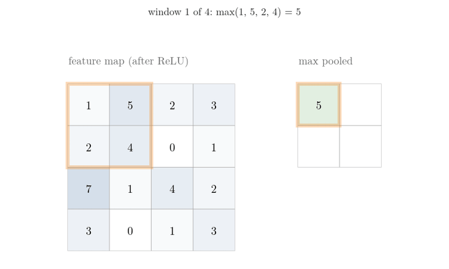
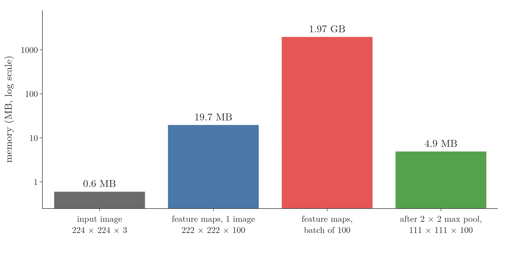
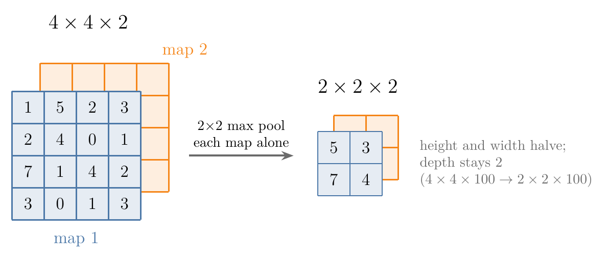
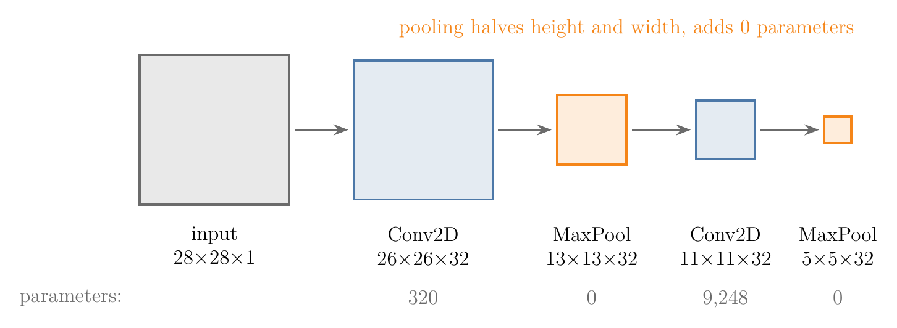
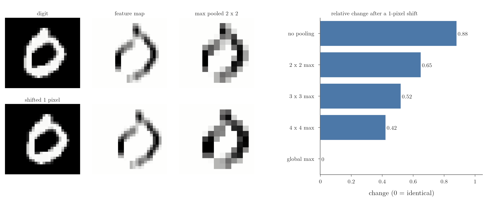
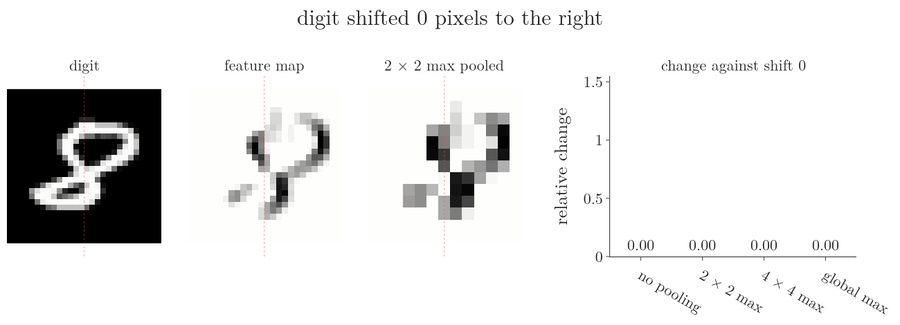
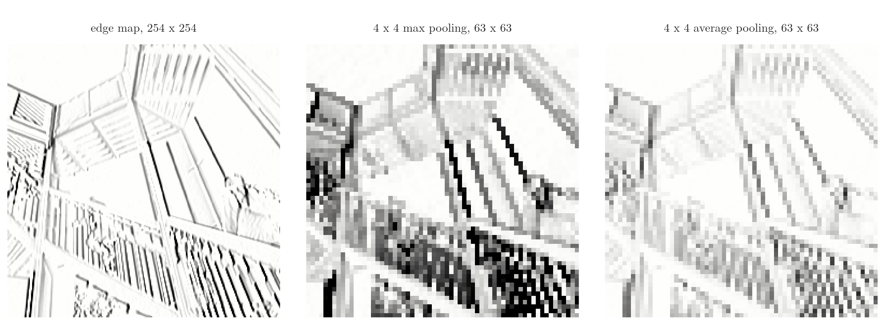
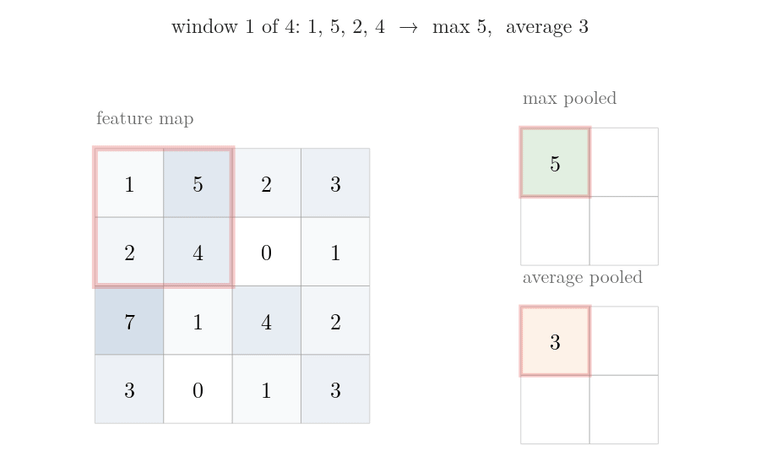
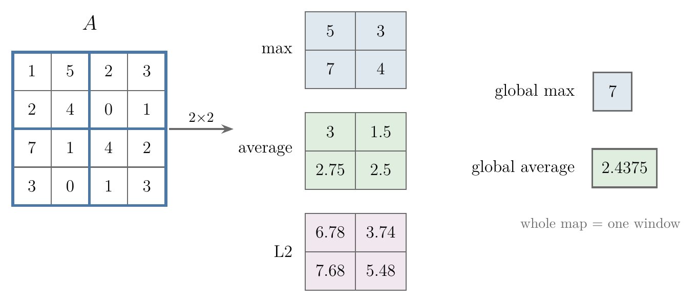

<!-- where-this-fits: generated by course_map/build_map.py; edit concepts.yaml, not this block -->
> **Where this fits:** Pipeline map step 8 (Model). See the [Course map](../01-course-map/note.md).
>
> 
>
> - **Builds on:** Convolution operation and feature maps ([Note 1042](../1042-convolution-operation/note.md)).
> - **Leads to:** CNN architecture (LeNet-5) ([Note 1045](../1045-lenet-5/note.md)); Convolutional neural network (CNN) ([Note 1046](../1046-cnn-vs-ann/note.md)).
<!-- /where-this-fits -->

## 1. Overview

> **Key point:** A pooling layer shrinks each feature map by replacing every small window with one summary number, usually its maximum. Pooling cuts memory, makes the network less sensitive to where exactly a feature sits, and has nothing to train.

A pooling layer comes right after a convolution layer (and its ReLU) in a CNN. Pooling answers two problems of convolution: feature maps take a lot of memory, and their values are tied to the exact position of each feature.

{width=85% height=50%}

Figure 1 shows the most common kind, **max pooling** (G-1182). This Note covers:

- the two problems (section 3);
- how max pooling works (section 4);
- pooling on volumes (section 5);
- pooling in Keras (section 6);
- its advantages (section 7);
- the other kinds of pooling (section 8);
- its disadvantages (section 9).

## 2. Prerequisites

- The [convolution operation Note](../1042-convolution-operation/note.md): feature maps, ReLU after convolution, volumes of feature maps.
- The [padding and strides Note](../1043-padding-and-strides/note.md): the stride and the output-size formula.

## 3. Why pooling is needed

> **Key point:** Feature maps are large: one 224 × 224 colour image through 100 filters needs about 20 MB, and a batch of 100 images about 2 GB. And a convolution's output moves with the input, so the same feature at a different place gives different numbers.

### 3.1 Memory

> **Key point:** 222 × 222 × 100 numbers of 4 bytes each: 19.7 MB per image, 1.97 GB per batch of 100.

Take an RGB image of 224 × 224 × 3, a common input size for image networks (CS231n notes), and a convolution layer with 100 filters of 3 × 3 × 3. Each **filter** (G-777) gives a **feature map** (G-766) of $224 - 3 + 1 = 222$ by 222 (see the [convolution operation Note](../1042-convolution-operation/note.md)), so the layer outputs a volume of 222 × 222 × 100.

1. **In words:** count the numbers in the volume and multiply by 4 bytes, the size of one 32-bit floating-point number.
2. **Formula:**
   $$\text{memory} = \text{height} \times \text{width} \times \text{filters} \times 4 \text{ bytes}$$
3. **Example:** $222 \times 222 \times 100 = 4{,}928{,}400$ numbers, times 4 bytes = 19.7 MB for one image (Notebook). Training sends a whole batch at once: 100 images need 1.97 GB, for the output of one layer alone.

{height=38%}

In Figure 2, each step to the right is a jump of a power of ten or more: one convolution layer turns a 0.6 MB image into 19.7 MB of feature maps, and pooling (green) brings it back down by a factor of 4.

Such volumes can slow a machine down or make the program crash for lack of memory. So we want to shrink the feature maps. A larger stride (see the [padding and strides Note](../1043-padding-and-strides/note.md)) would do it, but pooling also solves a second problem.

### 3.2 Features tied to their location

> **Key point:** If the input shifts, the feature map shifts with it. For classification we care whether a feature is present, not exactly where.

A convolution layer finds features such as edges, eyes or ears. Its output is tied to location: if the cat sits on the left of the image, its ear lights up the left of the feature map; if it sits on the right, the right. In the Notebook, a digit shifted 1 pixel to the right gives exactly the same feature map, shifted 1 pixel to the right.

For a task such as telling cats from dogs, the location of the ear does not matter, only that it is an ear. But the next layers see different numbers for the same ear at different places. We would like the network to treat a feature the same way wherever it appears, a property called **translation invariance** (G-2011). Pooling gives an approximate version of it.

> **Extra:** The precise names (Goodfellow et al. 2016, §9.2 and §9.3): convolution is **equivariant** to translation (**translation equivariance**, G-2010), meaning that if the input shifts, the output shifts in the same way. Pooling makes the output approximately **invariant** to small translations, meaning that the pooled values mostly do not change. The problem of section 3.2 is therefore equivariance where invariance is wanted.

## 4. Max pooling

> **Key point:** Choose a window size (usually 2 × 2), a stride (usually 2) and a type (usually max). Slide the window over the feature map and keep the largest value in each window.

### 4.1 Where pooling sits

> **Key point:** Image, convolution, ReLU, then pooling.

The order inside a CNN is: convolution gives the feature map, ReLU adds non-linearity by turning the negative values into 0, and the pooling layer then shrinks the result. **Pooling** (G-1521) is a **downsampling** (G-636) operation: it reduces the size of the feature map.

### 4.2 The three settings

> **Key point:** Size of the window, stride, and type of pooling.

A pooling layer needs three settings:

1. the **size** of the window, the area it summarises, usually 2 × 2;
2. the **stride** (G-1900), usually 2, so that the windows do not overlap;
3. the **type**: max, average and others (section 8).

### 4.3 One worked example

> **Key point:** A 4 × 4 map with 2 × 2 windows and stride 2 has 4 windows; their maxima 5, 3, 7, 4 form the 2 × 2 output.

1. **In words:** split the map into 2 × 2 blocks and keep the largest number of each block.
2. **Formula:** for output position $(i, j)$, with window size and stride 2,
   $$P_{ij} = \max\big(A_{2i,\thinspace2j},\ A_{2i,\thinspace2j+1},\ A_{2i+1,\thinspace2j},\ A_{2i+1,\thinspace2j+1}\big)$$
3. **Example:** with the feature map of Figure 1,
   $$A = \begin{bmatrix} 1&5&2&3\cr2&4&0&1\cr7&1&4&2\cr3&0&1&3 \end{bmatrix} \quad\Rightarrow\quad P = \begin{bmatrix} \max(1,5,2,4) & \max(2,3,0,1)\cr\max(7,1,3,0) & \max(4,2,1,3) \end{bmatrix} = \begin{bmatrix} 5&3\cr7&4 \end{bmatrix}$$

The 4 × 4 feature map has become 2 × 2. The output size follows the formula of the [padding and strides Note](../1043-padding-and-strides/note.md) without padding: $\lfloor (4 - 2)/2 \rfloor + 1 = 2$ (Dumoulin and Visin 2016, Relationship 7).

What does the largest value mean? A feature map is large where the filter's pattern is present (see the [convolution operation Note](../1042-convolution-operation/note.md)). So the maximum of a window marks the spot where the filter matched the image best, and max pooling keeps exactly that spot.

Within each small region, the **receptive field** (G-1642) of the output value, max pooling keeps the strongest response and drops the weaker ones. The strongest response is the most dominant feature in that region. Low-level detail is discarded, and the dominant features move on.

## 5. Pooling a volume

> **Key point:** Pooling works on each feature map separately. A 4 × 4 × 2 volume becomes 2 × 2 × 2; the number of channels does not change.

After a convolution with several filters we have a volume of feature maps. For example, a 6 × 6 × 3 image and 2 filters of 3 × 3 × 3 give 4 × 4 × 2. After ReLU, pooling is applied to each feature map on its own, first the front one, then the back one, giving a 2 × 2 × 2 volume. With 100 filters, a 4 × 4 × 100 volume becomes 2 × 2 × 100.

{width=85%}

Pooling changes the height and width, never the depth (Figure 3). The Notebook checks that Keras' pooled volume equals pooling each channel by hand.

## 6. Pooling in Keras

> **Key point:** `MaxPooling2D(pool_size=(2, 2), strides=2)` (G-116) after each convolution layer. Pooling layers have 0 parameters.

> **Python:** Two convolution layers, each followed by max pooling.
>
> ```python
> model = keras.Sequential([
>     keras.Input(shape=(28, 28, 1)),
>     keras.layers.Conv2D(32, 3, activation="relu"),
>     keras.layers.MaxPooling2D(pool_size=(2, 2), strides=2),
>     keras.layers.Conv2D(32, 3, activation="relu"),
>     keras.layers.MaxPooling2D(pool_size=(2, 2), strides=2),
>     keras.layers.Flatten(),
>     keras.layers.Dense(10, activation="softmax")])
> ```

The shapes and parameter counts from `model.summary()` (Notebook):

| Layer | Output shape | Parameters |
|---|---|---|
| Conv2D, 32 filters 3 × 3 | 26 × 26 × 32 | 320 |
| MaxPooling2D 2 × 2 | 13 × 13 × 32 | 0 |
| Conv2D, 32 filters 3 × 3 | 11 × 11 × 32 | 9,248 |
| MaxPooling2D 2 × 2 | 5 × 5 × 32 | 0 |
| Flatten | 800 | 0 |
| Dense, 10 nodes | 10 | 8,010 |

Each max pooling layer halves the height and width; $11 \to 5$ because $\lfloor (11 - 2)/2 \rfloor + 1 = 5$. Every pooling layer has 0 trainable parameters: taking a maximum is a fixed aggregate operation with nothing to learn. In Keras, `strides` defaults to the pool size, so `MaxPooling2D(2)` is the same layer (Keras documentation).

{width=100%}

In Figure 4, watch the orange squares: each pooling layer halves the side of the map and adds 0 parameters, while each convolution layer trims only 2 pixels and carries trainable weights.

## 7. Advantages of pooling

> **Key point:** Smaller feature maps, approximate translation invariance, stronger dominant features (max pooling only), and no parameters to train.

### 7.1 Reduced size

> **Key point:** 2 × 2 pooling with stride 2 keeps a quarter of the values: 222 × 222 × 100 becomes 111 × 111 × 100, 4.9 MB instead of 19.7 MB.

In the example of section 3.1, 2 × 2 max pooling turns the 222 × 222 × 100 volume into 111 × 111 × 100, a quarter of the values and of the memory (Notebook). The next layers also have less work to do.

### 7.2 Translation invariance

> **Key point:** On 1,000 digits shifted by 1 pixel, the feature map changes by 0.88 (relative), the 2 × 2 max-pooled map by 0.65, the 4 × 4 by 0.42, and the global maximum not at all.

Downsampling keeps the dominant feature of each region and forgets exactly where in the region it was. So a small shift of the input changes the pooled map much less than the feature map.

{width=100%}

The Notebook measures it on 1,000 MNIST test digits, each shifted 1 pixel to the right. The relative change is the size of the difference between the representations of the original and the shifted digit, divided by the size of the original's representation:

| Representation | Relative change after a 1-pixel shift |
|---|---|
| Feature map, no pooling | 0.88 |
| After 2 × 2 max pooling | 0.65 |
| After 3 × 3 max pooling | 0.52 |
| After 4 × 4 max pooling | 0.42 |
| After global max pooling | 0.00 |

Larger pooling windows give more invariance, and a single maximum over the whole map (section 8.2) does not change at all. Pooling makes the network focus on whether a feature is present and less on where it is.

The invariance holds for small shifts only. Figure 6 moves one digit 8 further and further to the right. Watch the feature map slide with the digit, while the pooled map keeps roughly the same dark cells at a shift of 1 pixel and then starts to change too.

{width=100%}

| Shift | No pooling | 2 × 2 max | 4 × 4 max | Global max |
|---|---|---|---|---|
| 1 pixel | 0.88 | 0.65 | 0.42 | 0.00 |
| 2 pixels | 1.30 | 1.04 | 0.70 | 0.00 |
| 3 pixels | 1.38 | 1.27 | 0.88 | 0.00 |

At every shift the pooled maps change less than the feature map, and a larger window changes less than a smaller one. But a 2 × 2 window cannot hide a shift of 2 or 3 pixels: its change climbs from 0.65 to 1.04 and 1.27 (Notebook). Pooling absorbs small shifts, not large ones.

### 7.3 Enhanced features (max pooling only)

> **Key point:** Max pooling keeps the strongest value of each window, so the edges in a pooled edge map look bolder; average pooling dilutes them.

{width=100%}

Each window of an edge map holds a few strong edge values and many weak ones. Max pooling keeps the strong one, so the pooled map shows the edges brighter and bolder (Figure 7, middle). **Average pooling** (G-238) mixes the strong values with the weak ones, and the edges fade (right). In the Notebook the mean value of the edge map is 24.7; after max pooling it is 77.8, after average pooling 24.6. This enhancement only happens with max pooling.

### 7.4 Nothing to train

> **Key point:** A pooling layer only needs its settings. A pooling layer has no weights, so backpropagation has nothing to update in it.

The values of a convolution filter are learned by backpropagation. Pooling needs no training: we only choose the window size, the stride and the type, and finding the largest of 4 numbers needs no learning. With nothing to update, a pooling layer adds no parameters and no training cost.

## 8. Types of pooling

> **Key point:** Max pooling is the most used; average pooling takes the mean; global pooling reduces each whole feature map to one number.

### 8.1 Max, average and L2 pooling

> **Key point:** On the windows of section 4.3: max gives 5, 3, 7, 4; average gives 3, 1.5, 2.75, 2.5.

Max pooling keeps the largest value of each window. **Average pooling** (G-238) keeps the mean of the window instead: add the four values and divide by 4. In Figure 8, watch the same window fill both maps: the first window, 1, 5, 2, 4, gives 5 in the max-pooled map and $12/4 = 3$ in the average-pooled map.

{width=80% height=45%}

The window can be summarised in other ways too (Goodfellow et al. 2016, §9.3):

| Type | Summary of each window | On the example of section 4.3 |
|---|---|---|
| Max pooling | largest value | 5, 3, 7, 4 |
| Average pooling | mean value | 3, 1.5, 2.75, 2.5 |
| L2 pooling | $\sqrt{\text{sum of squares}}$ | 6.78, 3.74, 7.68, 5.48 |

{width=100%}

Figure 9 puts the summaries side by side on the same map: max keeps the peaks 5, 3, 7, 4, average dilutes them, and the global versions squeeze the whole map into a single number.

Min pooling, the smallest value, is also possible but is not a Keras layer. Keras has `MaxPooling2D` and `AveragePooling2D`, and the Notebook checks that both give the numbers above. Max pooling is used most; average pooling can be worth trying in some problems.

### 8.2 Global pooling

> **Key point:** Global pooling uses the whole feature map as one window: one number per map. A 4 × 4 × 3 volume gives 3 numbers.

**Global pooling** (G-849) treats the whole feature map as one window. **Global max pooling** keeps the largest value of the whole feature map; for the map of section 4.3 that is 7. **Global average pooling** takes the mean of the whole map: 2.4375. With several feature maps, each gives one number: a 4 × 4 × 3 volume becomes a vector of 3 values.

Global pooling can replace the Flatten layer before the fully connected layers. For a 5 × 5 × 32 volume, Flatten gives 800 values and a `Dense(10)` layer on them has 8,010 parameters; global average pooling gives 32 values and the same layer has 330 (Notebook). Fewer parameters reduce overfitting.

> **Extra:** Global average pooling as a replacement for the fully connected part was introduced by Lin et al. (2014), who describe it as "itself a structural regularizer, which natively prevents overfitting", whereas fully connected layers "are prone to overfitting".

## 9. Disadvantages of pooling

> **Key point:** Pooling throws away location, which hurts tasks where location matters, and it discards 75% of the values.

1. **Lost location.** Translation invariance helps when only the presence of a feature matters, as in image classification. In some computer vision tasks the location is the answer, such as **image segmentation** (G-2268), which divides an image into regions and must say exactly which pixels belong to the car. There, pooling can hurt: if a task relies on preserving precise spatial information, pooling on all features can increase the training error (Goodfellow et al. 2016, §9.4).
2. **Lost information.** 2 × 2 pooling with stride 2 turns 16 values into 4: it keeps a quarter and discards exactly 75% of the values (CS231n notes).

Whether to pool depends on the application.

> **Extra:** Some work drops pooling altogether. Springenberg et al. (2015) found that "max-pooling can simply be replaced by a convolutional layer with increased stride without loss in accuracy" on several image recognition benchmarks, and built a network of convolution layers only.

## 10. Summary

| | Max pooling | Average pooling | Global pooling |
|---|---|---|---|
| Summary of a window | largest value | mean | one value per whole map |
| Typical setting | 2 × 2, stride 2 | 2 × 2, stride 2 | whole map |
| Keras layer | `MaxPooling2D` | `AveragePooling2D` | `GlobalMaxPooling2D`, `GlobalAveragePooling2D` |
| Parameters | 0 | 0 | 0 |

- Pooling follows convolution and ReLU, and downsamples each feature map separately.
- It solves two problems: large feature maps (memory) and features tied to location.
- Advantages: smaller maps, approximate translation invariance, stronger dominant features (max only), no training.
- Disadvantages: location is lost (bad for segmentation-like tasks) and 75% of the values are discarded.
- Global pooling turns each feature map into one number and can replace Flatten.

## 11. Sources

**Built from**

- CampusX, "Pooling Layer in CNN | MaxPooling in Convolutional Neural Network", YouTube, https://www.youtube.com/watch?v=DwmGefkowCU
- StatQuest with Josh Starmer, "Neural Networks Part 8: Image Classification with Convolutional Neural Networks (CNNs)", YouTube, https://www.youtube.com/watch?v=HGwBXDKFk9I (max pooling keeps the spot where the filter matched best; average pooling)

**Other references**

- Dumoulin, V. and Visin, F. (2016). A guide to convolution arithmetic for deep learning. arXiv:1603.07285. Relationship 7 (pooling arithmetic).
- Goodfellow, I., Bengio, Y. and Courville, A. (2016). *Deep Learning*. MIT Press. §9.2 (equivariance), §9.3 (pooling, invariance to small translations, types of pooling), §9.4 (pooling can cause underfitting).
- Keras API documentation: `MaxPooling2D`, `AveragePooling2D`, `GlobalMaxPooling2D` layers, keras.io/api/layers/pooling_layers.
- Lin, M., Chen, Q. and Yan, S. (2014). Network In Network. ICLR 2014. arXiv:1312.4400.
- Springenberg, J. T., Dosovitskiy, A., Brox, T. and Riedmiller, M. (2015). Striving for Simplicity: The All Convolutional Net. ICLR 2015 workshop. arXiv:1412.6806.
- Stanford CS231n course notes, "Convolutional Neural Networks", cs231n.github.io/convolutional-networks.

## 12. Key terms

| Term | Meaning |
|---|---|
| Pooling | Replacing each small window of a feature map with one summary number, to shrink the map |
| Downsampling | Reducing the height and width of a feature map |
| Max pooling | Pooling that keeps the largest value of each window |
| Average pooling | Pooling that keeps the mean of each window |
| Global pooling | Pooling over the whole feature map: one number per map |
| Receptive field | The region of the input that one output value depends on |
| Translation invariance | The output stays (almost) the same when the input is shifted slightly |
| Translation equivariance | The output shifts in the same way as the input; a property of convolution |
| `MaxPooling2D` | The Keras layer for 2D max pooling: `MaxPooling2D(pool_size, strides)` |
| Image segmentation (G-2268) | Dividing an image into regions by saying which pixels belong to which object |
