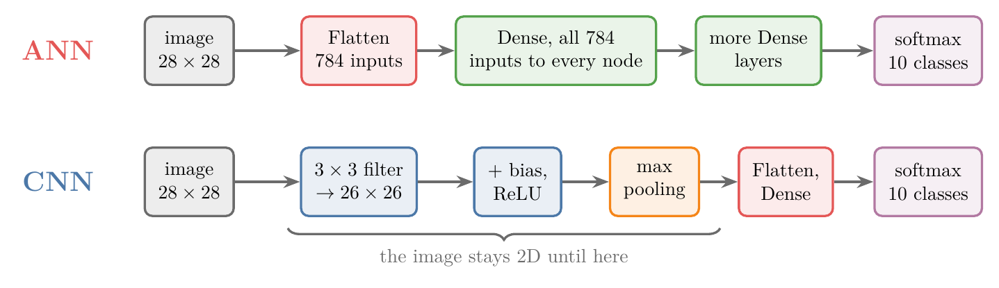

<!-- where-this-fits: generated by course_map/build_map.py; edit concepts.yaml, not this block -->
> **Where this fits:** Pipeline map step 8 (Model). See the [Course map](../01-course-map/note.md).
>
> 
>
> - **Builds on:** Representation learning ([Note 1002](../1002-what-is-deep-learning/note.md)); Convolution operation and feature maps ([Note 1042](../1042-convolution-operation/note.md)); Pooling ([Note 1044](../1044-pooling/note.md)).
> - **Compare with:** Multi-layer perceptron (MLP) ([Note 1009](../1009-mlp-intuition/note.md)).
<!-- /where-this-fits -->

## 1. Overview

> **Key point:** A filter in a CNN does what a node in an ANN does, a weighted sum plus a bias, then an activation, but on a small window at a time, sliding across the image with the same weights. So a convolution layer's parameter count depends only on its filters, never on the image size, and a small CNN beats a larger ANN on images.

The [CNN intuition Note](../1040-cnn-intuition/note.md) gave three problems of an ANN on images:

1. too many weights;
2. overfitting;
3. the lost arrangement of the pixels.

Having built a CNN from its parts ([convolution](../1042-convolution-operation/note.md), [padding and strides](../1043-padding-and-strides/note.md), [pooling](../1044-pooling/note.md), [LeNet-5](../1045-lenet-5/note.md)), we can now compare the two kinds of network directly: how they are alike, and how they differ.

The similarity matters for the next Notes: if a **filter** (G-778) works like a node, then the backpropagation learned for ANNs carries over to CNNs (see the [backpropagation in a CNN Note](../1047-backpropagation-in-cnn/note.md)).

## 2. Prerequisites

- The [MNIST ANN Note](../1012-mnist-ann/note.md): an ANN on images, Flatten, counting parameters.
- The [convolution operation Note](../1042-convolution-operation/note.md): filters, feature maps, colour images.
- The [LeNet-5 Note](../1045-lenet-5/note.md): the CNN architecture and its parameter count.

## 3. The same task, two networks

> **Key point:** The ANN flattens the 28 × 28 image to 784 inputs and connects all of them to every node. The CNN keeps the image 2D, convolves it with filters, adds a bias, applies ReLU, pools, and only then flattens.

Take MNIST, a collection of 28 × 28 images of digits, and the task of classifying them.

- **ANN:** the 28 × 28 grid is flattened into 784 inputs. Hidden layers follow, as many as we like, all fully connected, and a softmax output layer gives the class.
- **CNN:** the image stays 2D. A 3 × 3 filter convolves it into a 26 × 26 **feature map** (G-766). Each filter has one bias, added to every value of its feature map; with a bias of 1, every value goes up by 1. The result goes through an activation such as ReLU, then max pooling, then Flatten, fully connected layers and the softmax output.

{width=100%}

In Figure 1, compare where the red Flatten box sits: first in the ANN, near the end in the CNN. Everything before it in the CNN works on the 2D image.

## 4. How they are similar: a filter is a node

> **Key point:** An ANN node computes $\text{ReLU}(w_1x_1 + \dots + w_{784}x_{784} + b)$ over all inputs at once. A filter computes $\text{ReLU}(w_1x_1 + \dots + w_9x_9 + b)$ over the 9 pixels under it, then slides and repeats with the same weights.

{width=100%}

Look at what one node of the ANN does (Figure 2, left). Its inputs are $x_1, x_2, \dots, x_{784}$. The node multiplies each by a weight and adds them up, adds its bias, and passes the result through an activation function:

$$a = \text{ReLU}(w_1x_1 + w_2x_2 + \dots + w_{784}x_{784} + b)$$

Now look at a filter at one position (Figure 2, right). The filter covers 9 pixels, $x_1$ to $x_9$. The filter's values are trainable weights, so it computes $w_1x_1 + \dots + w_9x_9$, adds the filter's bias, and passes the result through ReLU:

$$a = \text{ReLU}(w_1x_1 + w_2x_2 + \dots + w_9x_9 + b)$$

Both compute the same thing: a dot product, plus a bias, through an activation. The Notebook checks it: the top-left value of a Keras `Conv2D` layer with ReLU equals a node with 9 inputs, given the same 9 weights and bias (0.93582 both).

The difference is in how the inputs are taken. A node uses all its inputs at once. A filter takes them in chunks, one window at a time, and slides across the image, repeating the same calculation with the same weights. Sliding is how the filter captures 2D patterns, the spatial arrangement of the pixels.

So, as a shortcut: **a filter of a CNN works like a node of an ANN**. In an ANN we train the weights of the nodes; in a CNN we train the values of the filters. Adding one more filter, with its own bias, is like adding one more node.

> **Extra:** Goodfellow et al. (2016, §9.2) name the two differences. **Sparse interactions:** (G-1842) each output depends only on a small window of the input, because the kernel is smaller than the input. **Parameter sharing:** (G-1447) the same weights are used at every position, instead of a separate weight for every input-output pair. Both reduce the number of parameters.

## 5. How they differ: the parameter count

> **Key point:** 50 filters of 3 × 3 × 3 have $50 \times 27 + 50 = 1{,}400$ parameters, whether the image is 224 × 224 or 1080 × 1080. A Dense layer of 100 nodes on the same flattened images needs 15 million or 350 million.

### 5.1 Counting the parameters of a convolution layer

> **Key point:** Each filter: height × width × channels weights, plus 1 bias.

1. **In words:** count the weights in one filter, add its bias, multiply by the number of filters.
2. **Formula:**
   $$\text{parameters} = (f \times f \times c + 1) \times k$$
   for $k$ filters of size $f \times f$ on an input with $c$ channels.
3. **Example:** an RGB image of 224 × 224 × 3 and 50 filters of 3 × 3 × 3. One filter has $3 \times 3 \times 3 = 27$ weights; 50 filters have $1{,}350$; each filter has one trainable bias, $+50$. Total: $1{,}400$ learnable parameters. The output is a 222 × 222 × 50 volume.

### 5.2 The image size does not matter

> **Key point:** Change the image to 1080 × 1080 × 3 and the answer is still 1,400.

Now take a much bigger image, 1080 × 1080 × 3, with the same 50 filters of 3 × 3 × 3. The number of learnable parameters is still 1,400: the weights and biases belong to the filters, and the filters do not depend on the size of the input. A bigger image only means more positions for the same filters to slide over.

{height=45%}

In Figure 3, watch the two lines as the image grows: the blue line stays flat at 1,400, while the red line climbs with the number of pixels, $(n \times n \times 3 + 1) \times 100$, past 349 million at 1080 × 1080.

An ANN behaves very differently. Flattening gives $224 \times 224 \times 3$ inputs, and a hidden layer of $y$ nodes needs (inputs × $y$) weights. If the inputs grow to $1080 \times 1080 \times 3$, the weights grow with them, into the millions. The Notebook builds both layers in Keras:

| Image | Conv2D, 50 filters of 3 × 3 | Dense, 100 nodes on the flattened image |
|---|---|---|
| 224 × 224 × 3 | 1,400 | 15,052,900 |
| 1080 × 1080 × 3 | 1,400 | 349,920,100 |

This independence from the image size answers two of the three problems of the [CNN intuition Note](../1040-cnn-intuition/note.md). Weights that do not grow with the image keep the network small (problem 1), and fewer weights leave less room to **overfit** (G-1429) (problem 2). The third problem, the lost spatial arrangement, is answered by the sliding window itself: a filter always sees neighbouring pixels together, so it captures 2D patterns.

The fully connected part of a CNN does depend on the image size, since Flatten's output grows with the image. The growing Flatten output is why most of LeNet-5's 61,706 parameters (48,120) sit in its first Dense layer (see the [LeNet-5 Note](../1045-lenet-5/note.md)), and why pooling, which shrinks the maps before Flatten, matters.

## 6. The comparison on real data

> **Key point:** With 8 times fewer parameters, a small CNN beats the ANN on MNIST (98.82% against 97.80%) and on Fashion-MNIST (89.08% against 88.22%), and it overfits less.

The Notebook trains two networks on the same data, with the same optimizer (Adam), 15 epochs and batch size 128, 3 seeds each:

- **ANN:** Flatten, Dense(128, ReLU), Dense(10, softmax), as in the [MNIST ANN Note](../1012-mnist-ann/note.md): 101,770 parameters.
- **CNN:** Conv2D(16 filters, 3 × 3, ReLU), MaxPooling 2 × 2, Conv2D(32 filters, 3 × 3, ReLU), MaxPooling 2 × 2, Flatten, Dense(10, softmax): 12,810 parameters.

The data are MNIST and **Fashion-MNIST** (G-756), a dataset of the same format (28 × 28 greyscale images, 10 classes, 60,000 training and 10,000 test images) showing clothing items such as shirts, sneakers and bags (Keras documentation). It is harder: both networks score about 10 points lower on it than on MNIST.

{width=100%}

| | MNIST | Fashion-MNIST |
|---|---|---|
| ANN test accuracy (101,770 parameters) | 97.80% | 88.22% |
| CNN test accuracy (12,810 parameters) | 98.82% | 89.08% |
| ANN training minus test accuracy | 2.01 points | 3.77 points |
| CNN training minus test accuracy | 0.66 points | 2.11 points |

On both datasets every CNN run beats every ANN run (Notebook). The CNN also has a smaller gap between training and test accuracy: the ANN fits its training data more closely than it generalises, while the CNN's shared filters generalise better.

> **Extra:** Fewer parameters does not mean fewer calculations. Each of the CNN's filter weights is reused at every position, so per image the CNN above performs 662,912 multiplications against the ANN's 101,632 (Notebook). Compared with a fully connected layer producing an output of the same size, though, a convolution needs far fewer operations, because each output uses only a small window (Goodfellow et al. 2016, §9.2).

## 7. Summary

| | ANN | CNN |
|---|---|---|
| Input | flattened to 1D | kept 2D (or 3D with channels) |
| Basic unit | node: weighted sum of all inputs + bias, activation | filter: weighted sum of a window + bias, activation, slid over the image |
| What is trained | weights and biases of the nodes | filter values and one bias per filter |
| Parameters of the first layer | inputs × nodes: grows with the image | $(f \times f \times c + 1) \times k$: independent of the image |
| Spatial arrangement | lost | captured by the sliding window |
| On MNIST / Fashion-MNIST (Notebook) | 97.80% / 88.22% with 101,770 parameters | 98.82% / 89.08% with 12,810 parameters |

- A filter is to a CNN what a node is to an ANN: dot product, bias, activation.
- A convolution layer's parameters depend on the number and size of its filters, not on the image size.
- So CNNs need fewer parameters, overfit less and use the 2D structure of images.

## 8. Sources

**Built from**

- CampusX, "Comparing CNN Vs ANN | CampusX", YouTube, https://www.youtube.com/watch?v=niE5DRKvD_E

**Other references**

- Goodfellow, I., Bengio, Y. and Courville, A. (2016). *Deep Learning*. MIT Press. §9.2 (sparse interactions, parameter sharing).
- Keras API documentation: `Conv2D`, `Dense`, and the Fashion-MNIST dataset (`keras.datasets.fashion_mnist`), keras.io/api.
- Xiao, H., Rasul, K. and Vollgraf, R. (2017). Fashion-MNIST: a Novel Image Dataset for Benchmarking Machine Learning Algorithms. arXiv:1708.07747.

## 9. Key terms

| Term | Meaning |
|---|---|
| Learnable (trainable) parameters | The weights and biases that training changes; for a convolution layer, the filter values and one bias per filter |
| Sparse interactions | Each output of a convolution depends only on a small window of the input |
| Parameter sharing | The same filter weights are used at every position of the image |
| Fashion-MNIST | A dataset of 28 × 28 greyscale images of 10 kinds of clothing, in the same format as MNIST |
