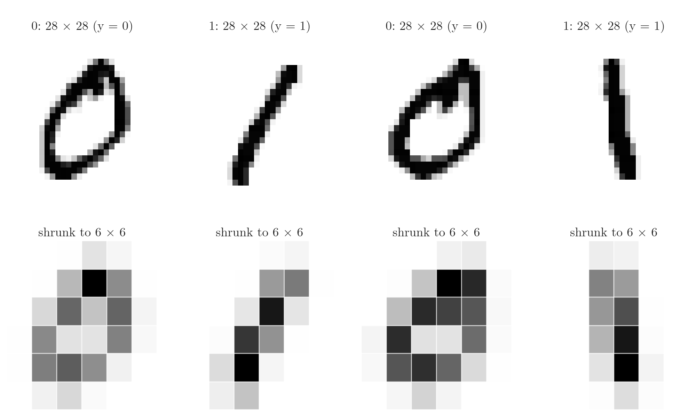
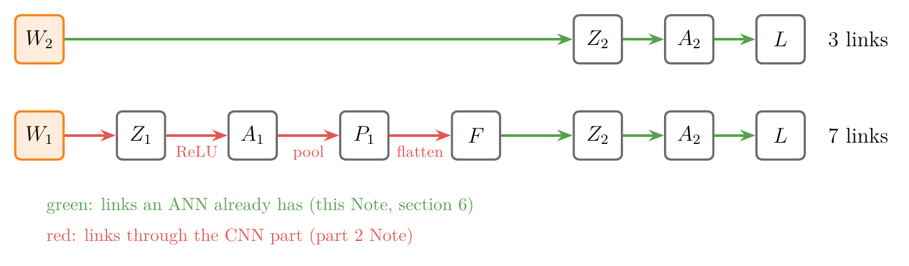

<!-- where-this-fits: generated by course_map/build_map.py; edit concepts.yaml, not this block -->
> **Where this fits:** Pipeline map step 8 (Model). See the [Course map](../01-course-map/note.md).
>
> 
>
> - **Builds on:** Backpropagation ([Note 1019](../1019-mlp-memoization/note.md)); Convolution operation and feature maps ([Note 1042](../1042-convolution-operation/note.md)).
<!-- /where-this-fits -->

## 1. Overview

> **Key point:** A CNN is trained exactly like an ANN: forward propagation, a loss, then gradient descent on every weight, with the gradients found by the chain rule. We split a small CNN into its CNN part and its ANN part; the ANN part's gradients are the familiar ones, $\partial L/\partial W_2 = (a_2 - y)F^{\mathsf T}$ and $\partial L/\partial b_2 = a_2 - y$.

**Backpropagation** (G-247) for an ANN was taught in the [backpropagation Notes](../1015-backpropagation-what/note.md). A CNN adds three new operations, and the **chain rule** (G-371) must pass through each of them:

- convolution;
- max pooling;
- flatten. This Note sets the problem up on the smallest possible CNN and finds the gradients of its last layer. The [part 2 Note](../1048-backpropagation-cnn-layers/note.md) goes back through flatten, max pooling and convolution.

{width=100%}

In practice Keras computes all of this for us. Knowing how the gradients flow through a CNN still helps us understand and use the tools better.

## 2. Prerequisites

- The [backpropagation Notes](../1015-backpropagation-what/note.md), [how it runs](../1016-backpropagation-how/note.md) and [why it works](../1017-backpropagation-why/note.md): the chain rule along a network, and the update $w \leftarrow w - \eta\thinspace\partial L/\partial w$.
- The [CNN vs ANN Note](../1046-cnn-vs-ann/note.md): a **filter** (G-777) works like a node, its values are weights.
- The [convolution operation Note](../1042-convolution-operation/note.md) and the [pooling Note](../1044-pooling/note.md).
- The [log loss Note](../73-log-loss/note.md) and the [sigmoid derivative Note](../74-sigmoid-derivative/note.md).

## 3. A small CNN

> **Key point:** 6 × 6 image → one 3 × 3 filter with bias → ReLU → 2 × 2 max pooling → flatten → one sigmoid node. Shapes: 6 × 6 → 4 × 4 → 4 × 4 → 2 × 2 → 4 → 1.

### 3.1 The architecture and the shapes

> **Key point:** Convolution gives 4 × 4, ReLU keeps the shape, pooling halves it to 2 × 2, flatten gives 4 numbers, the output node gives 1.

The network (Figure 1) has:

1. **Input:** a 6 × 6 greyscale image $X$.
2. **Convolution:** one 3 × 3 filter with its bias, giving a 4 × 4 **feature map** (G-766) ($6 - 3 + 1 = 4$).
3. **ReLU** (G-1668): negatives become 0; the shape stays 4 × 4.
4. **Max pooling** (G-1182): 2 × 2 window, stride 2, giving 2 × 2.
5. **Flatten:** 4 numbers.
6. **Output:** a single node with sigmoid, giving the prediction $\hat{y}$, a number between 0 and 1.

The network is a binary classifier: is this a picture of a cat or a dog, or, in the Notebook, is this MNIST digit a 1 ($y = 1$) or a 0 ($y = 0$)? The Notebook shrinks real MNIST digits to 6 × 6 so that every shape matches this Note.

{height=40%}

In Figure 2, the 6 × 6 versions keep only the rough shape, a ring for a 0 and a vertical stroke for a 1.

### 3.2 The trainable parameters

> **Key point:** 9 filter weights + 1 filter bias + 4 output weights + 1 output bias = 15 parameters.

Only two places in the network hold parameters:

| Parameter | Where | Shape | Count |
|---|---|---|---|
| $W_1$ | the filter | 3 × 3 | 9 |
| $b_1$ | the filter's bias | 1 × 1 | 1 |
| $W_2$ | weights of the output node | 1 × 4 | 4 |
| $b_2$ | bias of the output node | 1 × 1 | 1 |

The total is $9 + 1 + 4 + 1 = 15$ **trainable parameters** (G-1065). ReLU, max pooling and flatten have none. Training means finding the 15 values that make the loss smallest.

### 3.3 The loss

> **Key point:** Binary cross-entropy (log loss), the same loss as in logistic regression.

For one image with target $y$ and prediction $a_2 = \hat{y}$, the loss is the **binary cross-entropy** (G-303) (see the [log loss Note](../73-log-loss/note.md)):

$$L = -y\log a_2 - (1 - y)\log(1 - a_2)$$

For a batch of $m$ images the loss is the average of the $m$ single losses. For several classes we would use softmax and categorical cross-entropy instead (see the [loss functions Note](../1014-dl-loss-functions/note.md)). The loss of a CNN is exactly the loss of an ANN.

## 4. Forward propagation

> **Key point:** **Forward propagation** (G-797) computes the prediction from the image, one operation at a time: $Z_1 = X \ast W_1 + b_1$, $A_1 = \text{ReLU}(Z_1)$, $P_1 = \text{maxpool}(A_1)$, $F = \text{flatten}(P_1)$, $Z_2 = W_2F + b_2$, $A_2 = \sigma(Z_2)$.

Figure 1 is the **logical diagram** (G-1118) of the network: each arrow is one operation, each box one tensor. Written as equations:

| Step | Equation | Shape |
|---|---|---|
| Convolution | $Z_1 = X \ast W_1 + b_1$ | 4 × 4 (the feature map) |
| ReLU | $A_1 = \text{ReLU}(Z_1)$ | 4 × 4 |
| Max pooling | $P_1 = \text{maxpool}(A_1)$ | 2 × 2 |
| Flatten | $F = \text{flatten}(P_1)$ | 4 × 1 |
| Output node | $Z_2 = W_2 F + b_2$ | (1 × 4)(4 × 1) = 1 × 1 |
| Sigmoid | $A_2 = \sigma(Z_2)$ | 1 × 1 (the prediction) |

Here $\ast$ is the convolution and $b_1$ is added to every cell of the feature map. The product is written $W_2 F$, not $F W_2$, so that the shapes fit: $(1 \times 4)$ times $(4 \times 1)$ gives $1 \times 1$. With these equations we can code the forward pass and predict for any image; the Notebook does it in NumPy.

## 5. What we need: four derivatives

> **Key point:** Gradient descent needs $\partial L/\partial W_1$, $\partial L/\partial b_1$, $\partial L/\partial W_2$ and $\partial L/\partial b_2$. Each derivative has the shape of its parameter.

Training starts from random values of $W_1, b_1, W_2, b_2$ and repeats gradient descent until the loss is small (see the [backpropagation why Note](../1017-backpropagation-why/note.md)):

$$W_1 \leftarrow W_1 - \eta\frac{\partial L}{\partial W_1}, \quad b_1 \leftarrow b_1 - \eta\frac{\partial L}{\partial b_1}, \quad W_2 \leftarrow W_2 - \eta\frac{\partial L}{\partial W_2}, \quad b_2 \leftarrow b_2 - \eta\frac{\partial L}{\partial b_2}$$

$W_1$ and $W_2$ are matrices, so their derivatives are matrices of the same shape: one partial derivative per weight (see the [Jacobian and matrix gradients Note](../602-jacobian-and-matrix-gradients/note.md)). So the whole task is to find these four derivatives.

### 5.1 Two parts: a CNN and an ANN

> **Key point:** Everything up to flatten is the CNN part; everything after is an ordinary one-node ANN. Study them separately, then join them.

It helps to see the network as two networks joined together (Figure 1): a **CNN part** (convolution, ReLU, max pooling, flatten) and an **ANN part** (the output node). This Note finds the ANN part's derivatives; the [part 2 Note](../1048-backpropagation-cnn-layers/note.md) finds the CNN part's.

### 5.2 The chains

> **Key point:** $W_2$ reaches the loss through 3 links; $W_1$ through 7. The chain rule multiplies the derivative of every link.

A derivative such as $\partial L/\partial W_2$ asks: if $W_2$ changes by a little, how much does the loss change? $W_2$ is not connected to $L$ directly. A change in $W_2$ changes $Z_2$, which changes $A_2$, which changes $L$. The chain rule multiplies the three links (see section 5.3 of the [derivatives Note](../600-derivatives-of-one-variable/note.md)):

$$\frac{\partial L}{\partial W_2} = \frac{\partial L}{\partial A_2}\cdot\frac{\partial A_2}{\partial Z_2}\cdot\frac{\partial Z_2}{\partial W_2}, \qquad \frac{\partial L}{\partial b_2} = \frac{\partial L}{\partial A_2}\cdot\frac{\partial A_2}{\partial Z_2}\cdot\frac{\partial Z_2}{\partial b_2}$$

Only the last factor differs between the two.

For the filter the path is much longer. A change in $W_1$ changes $Z_1$, then $A_1$, $P_1$, $F$, $Z_2$, $A_2$ and finally $L$:

$$\frac{\partial L}{\partial W_1} = \frac{\partial L}{\partial A_2}\cdot\frac{\partial A_2}{\partial Z_2}\cdot\frac{\partial Z_2}{\partial F}\cdot\frac{\partial F}{\partial P_1}\cdot\frac{\partial P_1}{\partial A_1}\cdot\frac{\partial A_1}{\partial Z_1}\cdot\frac{\partial Z_1}{\partial W_1}$$

and $\partial L/\partial b_1$ is the same chain with $\partial Z_1/\partial b_1$ as its last factor.

{width=100%}

Figure 3 shows the two chains side by side: the last three links are shared, so the work of section 6 is reused for the filter; the four red links, through the CNN part, are left for the part 2 Note.

Figure 4 plays the whole plan. First the forward chain is drawn, one operation per arrow. Then the gradients appear from right to left, one per tensor, each with the same shape as its tensor: 1 × 1 at the output, then 4 × 1, 2 × 2 and 4 × 4. The last frame shows where the two weight gradients come from.

{width=100%}

Three of these factors are new: $\partial F/\partial P_1$ goes back through flatten, $\partial P_1/\partial A_1$ through max pooling, and $\partial Z_1/\partial W_1$ through the convolution. The part 2 Note finds them.

## 6. The ANN part: $\partial L/\partial W_2$ and $\partial L/\partial b_2$

> **Key point:** The log loss and the sigmoid cancel: $\partial L/\partial Z_2 = a_2 - y$. Times $F^{\mathsf T}$ for the weights, times 1 for the bias.

### 6.1 The first two factors

> **Key point:** $\dfrac{\partial L}{\partial A_2}\cdot\dfrac{\partial A_2}{\partial Z_2} = \dfrac{a_2 - y}{a_2(1 - a_2)}\cdot a_2(1 - a_2) = a_2 - y$.

Take one image, so $A_2$ is a single number $a_2$. The two factors shared by both chains are exactly those of section 7.1 of the [backpropagation how Note](../1016-backpropagation-how/note.md):

- differentiating the log loss: $\dfrac{\partial L}{\partial a_2} = -\dfrac{y}{a_2} + \dfrac{1 - y}{1 - a_2} = \dfrac{a_2 - y}{a_2(1 - a_2)}$;
- the sigmoid's derivative (see the [sigmoid derivative Note](../74-sigmoid-derivative/note.md)): $\dfrac{\partial a_2}{\partial Z_2} = \sigma(Z_2)\big(1 - \sigma(Z_2)\big) = a_2(1 - a_2)$.

Multiplied, $a_2(1 - a_2)$ cancels:

$$\frac{\partial L}{\partial Z_2} = a_2 - y$$

### 6.2 The last factors

> **Key point:** $Z_2 = W_2F + b_2$, so $\partial Z_2/\partial W_2 = F$ and $\partial Z_2/\partial b_2 = 1$.

From $Z_2 = W_2 F + b_2 = w_{1}f_1 + w_{2}f_2 + w_{3}f_3 + w_{4}f_4 + b_2$, the derivative with respect to each weight $w_k$ is the input $f_k$ it multiplies, and with respect to $b_2$ it is 1.

1. **In words:** the error at the output, $a_2 - y$, times the input each weight multiplied.
2. **Formula:**
   $$\frac{\partial L}{\partial W_2} = (a_2 - y)\thinspace F^{\mathsf T}, \qquad \frac{\partial L}{\partial b_2} = a_2 - y$$
3. **Example:** in the Notebook, the first image is a 0 ($y = 0$) and the untrained network predicts $a_2 = 0.2104$, so $a_2 - y = 0.2104$. Its flattened pooled values $F$ are $(0.4947, 0.4006, 0.5311, 0.7707)$, which gives
   $$\frac{\partial L}{\partial W_2} = 0.2104 \times (0.4947,\ 0.4006,\ 0.5311,\ 0.7707) = (0.1041,\ 0.0843,\ 0.1117,\ 0.1621), \qquad \frac{\partial L}{\partial b_2} = 0.2104$$

TensorFlow's `GradientTape` (G-88), which differentiates the same network automatically, gives the same numbers (largest difference 0, Notebook).

{width=100%}

Figure 5 plays the forward equations of section 4 on this image, then this section's gradient. Watch the last step: every weight of $W_2$ gets the same error, 0.21, times the value of $F$ it multiplied.

### 6.3 Checking the shapes

> **Key point:** $(1 \times 1)(1 \times 4) = 1 \times 4$, the shape of $W_2$. The transpose is what makes the shapes fit.

A derivative is used to update its parameter, so it must have the same shape. $W_2$ is 1 × 4. The error $a_2 - y$ is 1 × 1 and $F$ is 4 × 1, so we use its transpose $F^{\mathsf T}$, 1 × 4:

$$\underset{1 \times 1}{\underbrace{(a_2 - y)}}\thickspace\underset{1 \times 4}{\underbrace{F^{\mathsf T}}} = \underset{1 \times 4}{\underbrace{\frac{\partial L}{\partial W_2}}}$$

## 7. A batch of images

> **Key point:** For $m$ images, $F$ is 4 × $m$ and $A_2$, $Y$ are 1 × $m$. Then $\partial L/\partial W_2 = \frac{1}{m}(A_2 - Y)F^{\mathsf T}$, still 1 × 4.

With **mini-batch gradient descent** (G-1222), a batch of, say, 32 or 64 images goes forward together and backpropagation runs once for the batch (see the [gradient descent in neural networks Note](../1020-gradient-descent-in-neural-networks/note.md)).

With $m$ images, each column holds one image:

- $F$ has shape $4 \times m$;
- the predictions $A_2$ and the targets $Y$ have shape $1 \times m$.

1. **In words:** the same formula, with the matrices of the whole batch. The loss of the batch is the average of the single losses, so a factor $1/m$ appears.
2. **Formula:**
   $$\frac{\partial L}{\partial W_2} = \frac{1}{m}\thinspace(A_2 - Y)\thinspace F^{\mathsf T}, \qquad \frac{\partial L}{\partial b_2} = \frac{1}{m}\sum_{i=1}^{m}(a_{2,i} - y_i)$$
3. **Example (shapes):** $(1 \times m)(m \times 4) = 1 \times 4$. The $m$ cancels in the matrix product, so the derivative is 1 × 4 whatever the batch size, the shape of $W_2$. In the Notebook, with $m = 32$, the formula and `GradientTape` agree to within $6 \times 10^{-17}$.

The matrix product adds up the 32 single-image gradients, and the $1/m$ turns the sum into an average.

{height=40%}

In Figure 6, the images of 0s (blue) push every weight one way and the images of 1s (red) the other way, because $a_2 - y$ is positive for a 0 and negative for a 1; the batch gradient is the average of both groups.

## 8. Summary

| Derivative | Formula (one image) | Formula (batch of $m$) | Shape |
|---|---|---|---|
| $\partial L/\partial Z_2$ | $a_2 - y$ | $A_2 - Y$ | $1 \times 1$ or $1 \times m$ |
| $\partial L/\partial W_2$ | $(a_2 - y)F^{\mathsf T}$ | $\frac{1}{m}(A_2 - Y)F^{\mathsf T}$ | $1 \times 4$ |
| $\partial L/\partial b_2$ | $a_2 - y$ | mean of $A_2 - Y$ | $1 \times 1$ |
| $\partial L/\partial W_1$, $\partial L/\partial b_1$ | chains of 7 factors through flatten, max pooling, ReLU and convolution | | $3 \times 3$, $1 \times 1$ |

- A CNN is trained like an ANN: forward pass, loss, chain rule, gradient descent.
- The small CNN has 15 parameters: $W_1$ (9), $b_1$, $W_2$ (4), $b_2$.
- Split it into a CNN part and an ANN part; the ANN part gives $\partial L/\partial W_2 = (a_2 - y)F^{\mathsf T}$.
- Every derivative has the shape of its parameter; shapes guide where to put transposes.
- The filter's gradients need the backward steps through flatten, max pooling and convolution: the [part 2 Note](../1048-backpropagation-cnn-layers/note.md).

## 9. Sources

**Built from**

- CampusX, "Backpropagation in CNN | Part 1 | Deep Learning", YouTube, https://www.youtube.com/watch?v=RvCCFttGFMY

**Other references**

- TensorFlow API documentation: `tf.GradientTape`, tensorflow.org/api_docs/python/tf/GradientTape.

## 10. Key terms

| Term | Meaning |
|---|---|
| Logical diagram | A drawing of a network as a chain of tensors linked by operations |
| Forward propagation | Computing the prediction from the input, operation by operation |
| Trainable parameter (G-1065) | A number changed by gradient descent: filter values, weights and biases |
| Binary cross-entropy (G-303) | The log loss $-y\log a - (1 - y)\log(1 - a)$ used for two classes |
| $\partial L/\partial Z_2 = a_2 - y$ | The error at a sigmoid output with log loss |
| `GradientTape` | TensorFlow's tool that records a computation and returns its gradients automatically |
