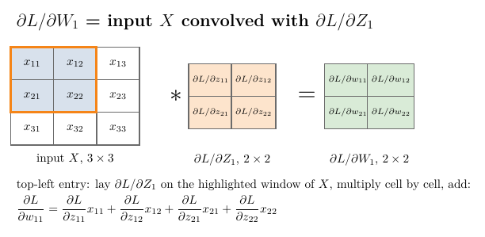

<!-- where-this-fits: generated by course_map/build_map.py; edit concepts.yaml, not this block -->
> **Where this fits:** Pipeline map step 8 (Model). See the [Course map](../01-course-map/note.md).
>
> 
>
> - **Builds on:** Backpropagation ([Note 1019](../1019-mlp-memoization/note.md)); Convolution operation and feature maps ([Note 1042](../1042-convolution-operation/note.md)).
<!-- /where-this-fits -->

## 1. Overview

> **Key point:** Going backwards, flatten is undone by a reshape, max pooling sends each gradient to the position that held the maximum, ReLU lets gradients through only where its input was positive, and the convolution gives $\partial L/\partial b_1$ as the sum of $\partial L/\partial Z_1$ and $\partial L/\partial W_1 = X \ast\partial L/\partial Z_1$: the filter's gradient is itself a convolution.

The [part 1 Note](../1047-backpropagation-in-cnn/note.md) set up a small CNN, wrote its forward equations and found the gradients of its output node. To train the filter we still need to go back through flatten, max pooling, ReLU and the convolution. This Note finds each of these backward steps.

{width=85%}

Figure 1 shows the final result. The Notebook checks every formula against TensorFlow's `GradientTape`, then trains the small CNN on real MNIST digits using only these formulas.

## 2. Prerequisites

- The [part 1 Note](../1047-backpropagation-in-cnn/note.md): the network, its forward equations, the chains of derivatives, and $\partial L/\partial Z_2 = a_2 - y$.
- The [convolution operation Note](../1042-convolution-operation/note.md) and the [pooling Note](../1044-pooling/note.md).
- The [memoization Note](../1019-mlp-memoization/note.md): backpropagation stores one gradient per step and reuses it.

## 3. The plan

> **Key point:** Six derivatives remain. The first two factors, $\partial L/\partial A_2 \cdot \partial A_2/\partial Z_2 = a_2 - y$, are already known from part 1.

Recall the network of the part 1 Note: $X$ (6 × 6) → convolution with $W_1$ (3 × 3) and $b_1$ → $Z_1$ (4 × 4) → ReLU → $A_1$ (4 × 4) → max pooling → $P_1$ (2 × 2) → flatten → $F$ (4 × 1) → $Z_2 = W_2F + b_2$ → $A_2 = \sigma(Z_2)$ → loss $L$.

The chains for the filter's weights and bias are

$$\frac{\partial L}{\partial W_1} = \underbrace{\frac{\partial L}{\partial A_2}\frac{\partial A_2}{\partial Z_2}}_{a_2 - y}\cdot\frac{\partial Z_2}{\partial F}\cdot\frac{\partial F}{\partial P_1}\cdot\frac{\partial P_1}{\partial A_1}\cdot\frac{\partial A_1}{\partial Z_1}\cdot\frac{\partial Z_1}{\partial W_1}$$

and the same with $\partial Z_1/\partial b_1$ at the end. Part 1 found the first two factors. We now take the rest one at a time, from the output backwards.

The gradient flowing back has a name at every step: $\partial L/\partial Z_2$, then $\partial L/\partial F$, $\partial L/\partial P_1$ (2 × 2), $\partial L/\partial A_1$ (4 × 4), $\partial L/\partial Z_1$ (4 × 4), and finally $\partial L/\partial W_1$ and $\partial L/\partial b_1$. Each has the shape of its tensor. As in the [memoization Note](../1019-mlp-memoization/note.md), each one is computed once and reused for the next step.

## 4. Back through the output node: $\partial Z_2/\partial F = W_2$

> **Key point:** $\partial L/\partial F = W_2^{\mathsf T}(a_2 - y)$, a 4 × 1 column, the shape of $F$.

From $Z_2 = W_2F + b_2 = w_1f_1 + w_2f_2 + w_3f_3 + w_4f_4 + b_2$, the derivative with respect to each input $f_k$ is its weight $w_k$. So $\partial Z_2/\partial F$ is made of the 4 weights of $W_2$.

The gradient with respect to $F$ must have the shape of $F$, 4 × 1, because there is one gradient for every value of $F$. $W_2$ is 1 × 4, so we use its transpose:

$$\frac{\partial L}{\partial F} = \underbrace{W_2^{\mathsf T}}_{4 \times 1}\thinspace\underbrace{(a_2 - y)}_{1 \times 1}$$

## 5. Back through flatten: reshape

> **Key point:** Flatten only rearranges numbers, so going back means rearranging the gradients the same way: reshape the 4 × 1 gradient into 2 × 2, the shape of $P_1$.

Flatten has no trainable parameters, and it does no arithmetic: it takes the 2 × 2 values of $P_1$ and lays them out as a 4 × 1 column $F$. Each value of $F$ is one value of $P_1$, moved. So there is nothing to differentiate in the usual sense; the backward step simply reverses the forward one.

1. **In words:** put each gradient back where its value came from.
2. **Formula:**
   $$\frac{\partial L}{\partial P_1} = \text{reshape}\Big(\frac{\partial L}{\partial F},\ \text{shape of } P_1\Big)$$
3. **Example:** if $\partial L/\partial F = (0.1,\ -0.2,\ 0.3,\ 0.4)^{\mathsf T}$, then
   $$\frac{\partial L}{\partial P_1} = \begin{bmatrix} 0.1 & -0.2 \cr0.3 & 0.4 \end{bmatrix}$$

So far: $\partial L/\partial P_1 = \text{reshape}\big(W_2^{\mathsf T}(a_2 - y)\big)$, four numbers.

## 6. Back through max pooling: route to the maximum

> **Key point:** Only the maximum of each window reached the output, so only it receives a gradient. Every other position of $A_1$ gets 0.

Max pooling has no trainable parameters either. Going backwards we must turn the 2 × 2 gradient $\partial L/\partial P_1$ into the 4 × 4 gradient $\partial L/\partial A_1$: the reverse of max pooling.

In every window, max pooling passed one value forward, the maximum, and dropped the other three. The dropped values had no role in the prediction $\hat{y}$, so no role in the loss: their gradient is 0. A small change in the maximum, on the other hand, changes $P_1$ by exactly the same amount, so the maximum receives the window's gradient unchanged.

{width=100%}

1. **In words:** ask $A_1$ where the maximum of each window was, put the window's gradient there, and 0 everywhere else.
2. **Formula:** for position $(m, n)$ of $A_1$, inside the window that produced $P_{1,xy}$:
   $$\frac{\partial L}{\partial A_{1,mn}} = \begin{cases} \dfrac{\partial L}{\partial P_{1,xy}} & \text{if } A_{1,mn} \text{ is the maximum of its window} \cr0 & \text{otherwise} \end{cases}$$
3. **Example (Figure 2):** the maxima of $A_1$ are 5, 3, 7 and 4. With $\partial L/\partial P_1 = \begin{bmatrix} 0.1 & -0.2 \cr0.3 & 0.4 \end{bmatrix}$:
   $$\frac{\partial L}{\partial A_1} = \begin{bmatrix} 0 & 0.1 & 0 & -0.2 \cr0 & 0 & 0 & 0 \cr0.3 & 0 & 0.4 & 0 \cr0 & 0 & 0 & 0 \end{bmatrix}$$

The indices $x, y$ number the positions of $P_1$ and $m, n$ those of $A_1$; they help when writing the code. To do this backward step, the forward pass must remember where each maximum was (CS231n notes call these positions the "switches"). When a window holds two equal maxima, as in an all-zero window after ReLU, the Notebook sends the gradient to the first of them.

## 7. Back through ReLU: a mask

> **Key point:** ReLU's derivative is 1 where $Z_1 > 0$ and 0 elsewhere, so $\partial L/\partial Z_1 = \partial L/\partial A_1$ wherever $Z_1$ was positive, and 0 elsewhere.

$A_1 = \text{ReLU}(Z_1)$ applies $\max(0, z)$ to each of the 16 cells of $Z_1$ separately. Its derivative is 1 for a positive input and 0 for a negative one (see the [activation functions Note](../1027-activation-functions/note.md), section 8):

$$\frac{\partial A_{1,xy}}{\partial Z_{1,xy}} = \begin{cases} 1 & \text{if } Z_{1,xy} > 0 \cr0 & \text{otherwise} \end{cases}$$

Multiplying cell by cell:

$$\frac{\partial L}{\partial Z_1} = \frac{\partial L}{\partial A_1} \odot \mathbb{1}[Z_1 > 0]$$

where $\odot$ means cell-by-cell multiplication. We now have $\partial L/\partial Z_1$, a 4 × 4 matrix: how the loss changes with each value of the feature map.

## 8. Back through the convolution

> **Key point:** Every value of $Z_1$ contains $b_1$ once, so $\partial L/\partial b_1$ is the sum of all of $\partial L/\partial Z_1$. Each weight $w_{ij}$ multiplies a window of $X$, so $\partial L/\partial W_1$ is $X$ convolved with $\partial L/\partial Z_1$.

The convolution layer, unlike flatten and max pooling, has trainable parameters, the filter $W_1$ and its bias $b_1$. To see the pattern clearly we shrink the example: a 3 × 3 input and a 2 × 2 filter, so $Z_1$ and $\partial L/\partial Z_1$ are 2 × 2. Everything else stays the same.

$$X = \begin{bmatrix} x_{11} & x_{12} & x_{13}\cr x_{21} & x_{22} & x_{23}\cr x_{31} & x_{32} & x_{33} \end{bmatrix}, \qquad W_1 = \begin{bmatrix} w_{11} & w_{12}\cr w_{21} & w_{22} \end{bmatrix}$$

The forward convolution gives four equations:

$$z_{11} = x_{11}w_{11} + x_{12}w_{12} + x_{21}w_{21} + x_{22}w_{22} + b_1$$

$$z_{12} = x_{12}w_{11} + x_{13}w_{12} + x_{22}w_{21} + x_{23}w_{22} + b_1$$

$$z_{21} = x_{21}w_{11} + x_{22}w_{12} + x_{31}w_{21} + x_{32}w_{22} + b_1$$

$$z_{22} = x_{22}w_{11} + x_{23}w_{12} + x_{32}w_{21} + x_{33}w_{22} + b_1$$

### 8.1 The bias: a sum

> **Key point:** $\partial L/\partial b_1 = \sum \partial L/\partial Z_1$, a single number like $b_1$.

$b_1$ appears in all four values of $Z_1$, so a change in $b_1$ reaches the loss along four paths, and the chain rule adds them:

$$\frac{\partial L}{\partial b_1} = \frac{\partial L}{\partial z_{11}}\frac{\partial z_{11}}{\partial b_1} + \frac{\partial L}{\partial z_{12}}\frac{\partial z_{12}}{\partial b_1} + \frac{\partial L}{\partial z_{21}}\frac{\partial z_{21}}{\partial b_1} + \frac{\partial L}{\partial z_{22}}\frac{\partial z_{22}}{\partial b_1}$$

Each $\partial z/\partial b_1$ is 1, because $b_1$ enters every equation with coefficient 1. So:

1. **In words:** add up all the values of $\partial L/\partial Z_1$.
2. **Formula:**
   $$\frac{\partial L}{\partial b_1} = \sum_{x,y}\frac{\partial L}{\partial Z_{1,xy}}$$
3. **Example:** with $\partial L/\partial Z_1 = \begin{bmatrix} 0.5 & -1 \cr0.25 & 2 \end{bmatrix}$, $\partial L/\partial b_1 = 0.5 - 1 + 0.25 + 2 = 1.75$. TensorFlow gives 1.75 (Notebook).

### 8.2 The filter: a convolution

> **Key point:** $\partial L/\partial w_{ij}$ adds up $\partial L/\partial z$ times the input pixel that $w_{ij}$ multiplied in each equation. The pattern is exactly the convolution of $X$ with $\partial L/\partial Z_1$.

Each weight also appears in all four equations, each time multiplying a different pixel. For $w_{11}$ these pixels are $x_{11}, x_{12}, x_{21}, x_{22}$, so

$$\frac{\partial L}{\partial w_{11}} = \frac{\partial L}{\partial z_{11}}x_{11} + \frac{\partial L}{\partial z_{12}}x_{12} + \frac{\partial L}{\partial z_{21}}x_{21} + \frac{\partial L}{\partial z_{22}}x_{22}$$

and the same reasoning for the other weights gives

$$\frac{\partial L}{\partial w_{12}} = \frac{\partial L}{\partial z_{11}}x_{12} + \frac{\partial L}{\partial z_{12}}x_{13} + \frac{\partial L}{\partial z_{21}}x_{22} + \frac{\partial L}{\partial z_{22}}x_{23}$$

$$\frac{\partial L}{\partial w_{21}} = \frac{\partial L}{\partial z_{11}}x_{21} + \frac{\partial L}{\partial z_{12}}x_{22} + \frac{\partial L}{\partial z_{21}}x_{31} + \frac{\partial L}{\partial z_{22}}x_{32}$$

$$\frac{\partial L}{\partial w_{22}} = \frac{\partial L}{\partial z_{11}}x_{22} + \frac{\partial L}{\partial z_{12}}x_{23} + \frac{\partial L}{\partial z_{21}}x_{32} + \frac{\partial L}{\partial z_{22}}x_{33}$$

These look complex, but there is a pattern. In $\partial L/\partial w_{11}$, the 2 × 2 matrix $\partial L/\partial Z_1$ is laid on the top-left 2 × 2 window of $X$, multiplied cell by cell and summed. In $\partial L/\partial w_{12}$ the same matrix is laid one step to the right; in $\partial L/\partial w_{21}$ one step down; in $\partial L/\partial w_{22}$ down and right. This pattern is the convolution operation, with $\partial L/\partial Z_1$ playing the role of the filter (Figure 1).

1. **In words:** convolve the input with the gradient of the feature map.
2. **Formula:**
   $$\frac{\partial L}{\partial W_1} = X \ast\frac{\partial L}{\partial Z_1}$$
3. **Example:** $X = \begin{bmatrix} 1&2&3\cr4&5&6\cr7&8&9 \end{bmatrix}$ and $\partial L/\partial Z_1 = \begin{bmatrix} 0.5 & -1 \cr0.25 & 2 \end{bmatrix}$. The top-left entry is
   $$0.5(1) - 1(2) + 0.25(4) + 2(5) = 9.5$$
   and the full result is $\begin{bmatrix} 9.5 & 11.25 \cr14.75 & 16.5 \end{bmatrix}$, exactly what `GradientTape` returns (Notebook).

The shapes agree: a $3 \times 3$ input convolved with a $2 \times 2$ matrix gives $3 - 2 + 1 = 2$, the shape of $W_1$. In the 6 × 6 network of part 1, $X$ is 6 × 6 and $\partial L/\partial Z_1$ is 4 × 4, which gives $6 - 4 + 1 = 3$: the 3 × 3 shape of the filter.

> **Extra:** Goodfellow et al. (2016, §9.5, equation 9.11) give the same result for any number of channels and any stride: the gradient for kernel entry $K_{i,j,k,l}$ is a sum over output positions of the incoming gradient times the input value that entry multiplied. For a network with more convolution layers, the gradient must also pass back to the layer's input, $\partial L/\partial X$; that backward pass "is also a convolution (but with spatially-flipped filters)" (CS231n notes).

## 9. The whole backward pass

> **Key point:** Five steps: $a_2 - y$ → multiply by $W_2^{\mathsf T}$ → reshape → route through max pooling → mask with ReLU → sum (bias) and convolve with $X$ (filter).

Putting the steps together, for one image:

| Step | Gradient | Shape | Rule |
|---|---|---|---|
| Output node | $\partial L/\partial Z_2 = a_2 - y$ | 1 × 1 | log loss and sigmoid (part 1) |
| Into $F$ | $\partial L/\partial F = W_2^{\mathsf T}(a_2 - y)$ | 4 × 1 | weights of the output node |
| Flatten | $\partial L/\partial P_1 = \text{reshape}(\partial L/\partial F)$ | 2 × 2 | reverse the reshape |
| Max pooling | $\partial L/\partial A_1$ | 4 × 4 | route to the maximum, 0 elsewhere |
| ReLU | $\partial L/\partial Z_1 = \partial L/\partial A_1 \odot \mathbb{1}[Z_1 > 0]$ | 4 × 4 | mask |
| Convolution | $\partial L/\partial b_1 = \sum \partial L/\partial Z_1$ | 1 × 1 | sum |
| Convolution | $\partial L/\partial W_1 = X \ast\partial L/\partial Z_1$ | 3 × 3 | convolution |

{width=100%}

Figure 3 runs the table from top to bottom on a real image (Notebook, last section). Watch the shapes: 1 number becomes 4, then a 2 × 2 grid, then a 4 × 4 grid with only 4 non-zero cells, and finally the 3 × 3 shape of the filter. Only those 4 cells matter in the slide, so each value of $\partial L/\partial W_1$ adds up just 4 products. The sum of the 4 cells gives $\partial L/\partial b_1 = -0.44$.

With a batch of images, each image goes through these steps and the gradients are averaged over the batch, as for $W_2$ in part 1.

### 9.1 Checking against TensorFlow

> **Key point:** On a real 28 × 28 MNIST digit, all four gradients match `GradientTape` to within $3 \times 10^{-16}$.

The Notebook builds the same kind of network at full MNIST size: a 28 × 28 digit, one 3 × 3 filter (26 × 26 feature map), ReLU, 2 × 2 max pooling (13 × 13), flatten (169 values), one sigmoid node. The task: is the digit a 1 ($y = 1$) or a 7 ($y = 0$)? The hand-coded backward pass and TensorFlow's automatic gradients agree for $W_1$, $b_1$, $W_2$ and $b_2$, with the largest difference below $3 \times 10^{-16}$, rounding error. Of the 676 values of $\partial L/\partial A_1$, 169 are non-zero: one per pooling window.

### 9.2 Training with these formulas only

> **Key point:** Mini-batch gradient descent with the hand-derived gradients takes test accuracy from 54.7% to 99.4% in 2 epochs.

Using nothing but the formulas of this Note and part 1, the Notebook trains the network with mini-batch gradient descent: batches of 32 images, learning rate 0.1, 2 epochs over 13,007 training images of 1s and 7s.

{width=85%}

The test accuracy on 2,163 unseen 1s and 7s goes from 54.7% before training to 99.0% after the first epoch and 99.4% after the second. Backpropagation through convolution, max pooling and flatten works exactly as derived.

## 10. Summary

| Layer | Trainable parameters | Backward rule |
|---|---|---|
| Dense (output node) | $W_2$, $b_2$ | $\partial L/\partial W_2 = (a_2 - y)F^{\mathsf T}$; pass $W_2^{\mathsf T}(a_2 - y)$ back |
| Flatten | none | reshape to the input's shape |
| Max pooling | none | gradient to each window's maximum, 0 elsewhere |
| ReLU | none | multiply by 1 where the input was positive, 0 elsewhere |
| Convolution | $W_1$, $b_1$ | $\partial L/\partial b_1 = \sum \partial L/\partial Z_1$; $\partial L/\partial W_1 = X \ast\partial L/\partial Z_1$ |

- Layers without parameters still pass the gradient back; they just have nothing to update.
- Flatten: reshape. Max pooling: route to the maximum. ReLU: mask.
- The bias of a filter collects the sum of the gradient over the whole feature map.
- The gradient of a filter is the convolution of the input with the gradient of the feature map.
- Checked against `GradientTape`, and enough to train a CNN from scratch.

## 11. Sources

**Built from**

- CampusX, "CNN Backpropagation Part 2 | How Backpropagation works on Convolution, Maxpooling and Flatten Layers", YouTube, https://www.youtube.com/watch?v=OoSDzOodY3Y

**Other references**

- Goodfellow, I., Bengio, Y. and Courville, A. (2016). *Deep Learning*. MIT Press. §9.5, equations 9.11–9.13 (gradients of a convolution with respect to the kernel and the input).
- Stanford CS231n course notes, "Convolutional Neural Networks", sections on the backward pass of convolution and of pooling, cs231n.github.io/convolutional-networks.
- TensorFlow API documentation: `tf.GradientTape`, tensorflow.org/api_docs/python/tf/GradientTape.

## 12. Key terms

| Term | Meaning |
|---|---|
| Backward pass | Computing the gradient of the loss for every tensor, from the output back to the input |
| Gradient routing | In max pooling's backward pass, sending each gradient only to the position of its window's maximum |
| Switches | The stored positions of the maxima, needed for max pooling's backward pass |
| ReLU mask | The 0/1 matrix $\mathbb{1}[Z > 0]$ that ReLU's backward pass multiplies by |
| $\partial L/\partial b_1$ | The sum of the gradient over the whole feature map |
| $\partial L/\partial W_1$ | The convolution of the input with the gradient of the feature map |
