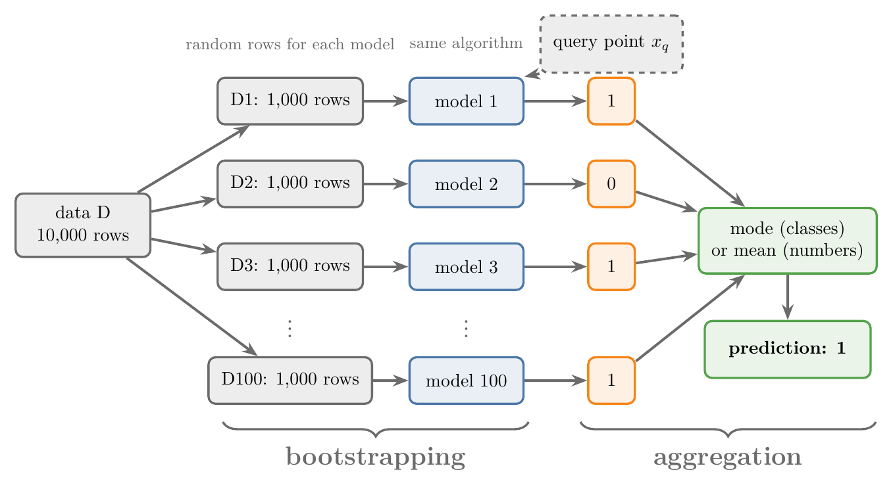
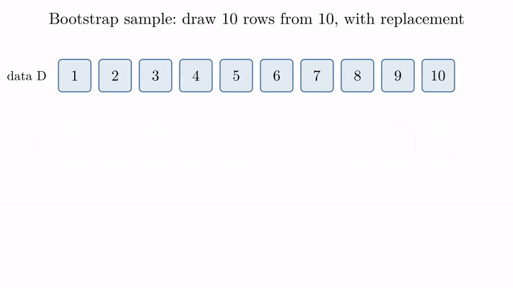
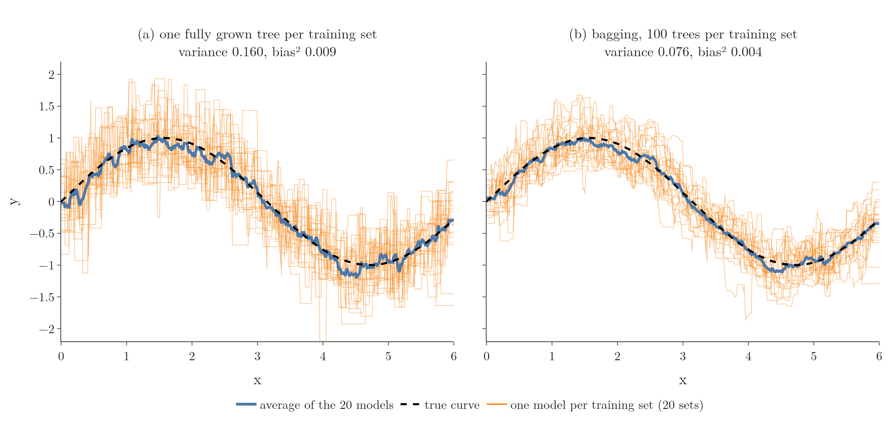
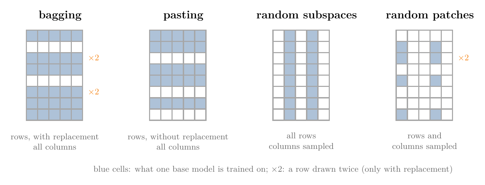

<!-- where-this-fits: generated by course_map/build_map.py; edit concepts.yaml, not this block -->
> **Where this fits:** Pipeline map steps 8 (Model), 9 (Evaluate). See the [Course map](../01-course-map/note.md).
>
> 
>
> - **Builds on:** Bias-variance trade-off ([Note 62](../62-bias-variance/note.md)); Overfitting ([Note 91](../91-knn/note.md)); Grid and random search ([Note 99](../99-regression-trees/note.md)); Decision trees ([Note 100](../100-dtreeviz/note.md)); Ensemble learning ([Note 101](../101-ensemble-learning/note.md)).
> - **Leads to:** Random forest ([Note 108](../108-random-forest-intro/note.md)).
> - **Compare with:** Boosting ([Note 101](../101-ensemble-learning/note.md)); Voting ensembles ([Note 104](../104-voting-regressor/note.md)); Cross-validation ([Note 104](../104-voting-regressor/note.md)); Random forest ([Note 108](../108-random-forest-intro/note.md)).
<!-- /where-this-fits -->

## 1. Overview

> **Key point:** Bagging trains many copies of one algorithm, each on a different random sample of the rows (bootstrapping), and combines their predictions by vote or mean (aggregation). It keeps the low bias of a flexible model and cuts its variance.

**Bagging**, short for **bootstrap aggregation**, is one of the two most important ensemble techniques, with boosting (the [introduction to ensemble learning Note](../101-ensemble-learning/note.md), section 4.3, introduced it). The name joins its two steps: **B**ootstrapping and **AGG**regation.

This Note covers the core idea, why bagging works, when to use it, a small worked example in code, and the four ways to sample: bagging, pasting, random subspaces and random patches. The next two Notes apply it to classification ([bagging classifier](../106-bagging-classifier/note.md)) and regression ([bagging regressor](../107-bagging-regressor/note.md)).

The Notebook (`notebook.ipynb`) runs the worked example.

## 2. The core idea

> **Key point:** Same algorithm for every base model; different random rows for each; then vote or average.

{height=45%}

Take a classification dataset D of 10,000 rows with a yes/no output. Figure 1 shows the two steps.

### 2.1 Bootstrapping

> **Key point:** Draw a random sample of rows for each base model and train it on that sample.

1. Choose a number of base models, say 100 (it could be 10 or 1,000). They all use the **same algorithm**: all decision trees, all KNN, or all SVMs. Unlike voting, bagging does not mix algorithms; it could, but nobody does.
2. Choose how many rows each model sees, say 1,000.
3. Draw 1,000 rows at random from D: this is dataset D1. Train model 1 on D1.
4. Draw another random 1,000 rows: D2, for model 2. It differs from D1, because the rows are random. And so on, up to D100.

Drawing random samples from data is called **bootstrapping**: it is a statistics technique for drawing random samples from a population. Each base model is trained on a different subset, so each learns something slightly different, and the ensemble gets its variety from the data rather than from the algorithms.

### 2.2 Aggregation

> **Key point:** Send the query point to every model and combine their answers: the mode for classification, the mean for regression.

For a new query point $x_q$, every trained model predicts. For classification, the bagging classifier returns the most common answer, the **mode**: in Figure 1, most models say 1, so the answer is 1. For regression it returns the mean. This combining step is the **aggregation**.

So the only difference from voting (the [voting ensemble Note](../102-voting-ensemble/note.md)) is where the variety comes from:

| | Voting | Bagging |
|---|---|---|
| Base models | different algorithms | one algorithm |
| Data each model sees | the same data | a different random sample |

Because the base models differ, the probability argument of the voting ensemble Note applies, and the combined model usually performs better than its base models. In practice scikit-learn does all of this for us; the [bagging classifier Note](../106-bagging-classifier/note.md) shows how.

### 2.3 Drawing with replacement

> **Key point:** In a bootstrap sample a row can be drawn more than once, and some rows are never drawn: on average a sample holds about 63% of the distinct rows.

Rows can be drawn **with replacement**: after a row is drawn, it is put back and can be drawn again. Figure 2 draws 10 rows from 10, with replacement, twice.



- D1 holds only 6 different rows: 3, 6, 8 and 9 appear twice, and rows 1, 4, 5 and 7 are never drawn.
- D2 holds 7 different rows: 2 appears twice and 5 three times, while 3, 4 and 8 are missing.

A sample of the same size as the data, drawn with replacement, is a **bootstrap sample** (the term was used in the [Ridge key points Note](../66-ridge-key-points/note.md)). Drawing rows without replacement is also possible; section 5 calls that pasting.

> **Extra:** How many different rows does a bootstrap sample hold?
>
> 1. **In words:** one draw misses a given row with probability $1 - 1/n$. All $n$ draws miss it with probability $(1 - 1/n)^n$. So the share of rows that appear at least once is $1 - (1 - 1/n)^n$.
> 2. **Formula:** as $n$ grows, $(1 - 1/n)^n$ approaches $1/e$, so
> $$\text{share of distinct rows} = 1 - \left(1 - \frac{1}{n}\right)^n \;\longrightarrow\; 1 - \frac{1}{e} \approx 0.632$$
> 3. **Example:** for $n = 10$: $(0.9)^{10} = 0.349$, so $1 - 0.349 = 0.651$, about 6.5 distinct rows out of 10 (Figure 2 got 6 and 7). For $n = 10{,}000$ the share is 0.632.
>
> The Notebook checks this by simulation: 0.655 for $n = 10$, 0.632 for $n = 1{,}000$ and above. The roughly 37% of rows a model never sees are its **out-of-bag** rows; the [bagging classifier Note](../106-bagging-classifier/note.md) uses them to score the model.

## 3. Why bagging works

> **Key point:** Bagging takes low-bias, high-variance models, such as fully grown trees, and averages away much of their variance, leaving a model with low bias and low variance.

### 3.1 The bias-variance problem

> **Key point:** We want low bias and low variance, but in a single model reducing one usually raises the other.

From the [bias-variance Note](../62-bias-variance/note.md): **bias** is a model's inability to fit even its training data, and **variance** is how much its predictions change when the training data changes. A good model has low bias (accurate on the training data) and low variance (consistent results when the data changes slightly).

The trouble is that the two pull against each other. Most algorithms end up either low bias, high variance (they overfit) or high bias, low variance (they underfit).

### 3.2 How bagging lowers variance

> **Key point:** A change in the data is spread across many models, so no single change can swing the ensemble.

Bagging uses base models that are **low bias, high variance**:

- a **fully grown decision tree** (`max_depth=None`, the [decision tree hyperparameters Note](../98-decision-tree-hyperparameters/note.md)), which fits its training data perfectly but overfits;
- **KNN with a small k**;
- an **SVM** with a very flexible boundary.

Their bias is already low, so bagging leaves it alone. It attacks the variance.

Suppose we replace 100 of the 10,000 rows with very different, noisy rows. A single tree trained on all the data would change its logic completely because of those 100 rows. In bagging, each tree sees a random 5,000 rows, so the 100 new rows are spread out: one tree gets 10 of them, another 50, another none, another 35.

No single tree absorbs all the change, so the behaviour of each tree changes less, and the average changes even less. The ensemble gives consistent results: **low variance**. Since its base models were already accurate (low bias), we end up with the combination we wanted: **low bias, low variance**.

{height=45%}

Figure 3 shows this. We draw 20 different training sets of 60 noisy points from a sine curve and fit a model to each:

- **(a) one fully grown tree per set:** the 20 curves swing wildly around the truth. Average variance **0.160**.
- **(b) bagging with 100 trees per set:** the 20 curves stay close together. Average variance **0.076**, less than half.

The bias stays tiny in both (0.009 and 0.004): both average curves follow the true curve.

## 4. When to use bagging

> **Key point:** Whenever the model is low bias and high variance (it overfits), try bagging; it is not limited to decision trees.

Bagging is worth trying in almost every project, and especially when a model overfits: low bias, high variance. It is what makes **random forests** (bagging with decision trees, see the [random forest Note](../108-random-forest-intro/note.md)) so popular.

A common misunderstanding is that bagging only works with decision trees. Trees are the usual choice because they are easy to explain and give good results, but **any algorithm** can be bagged. The [bagging classifier Note](../106-bagging-classifier/note.md) bags KNN and SVMs too.

## 5. Bagging by hand

> **Key point:** Three trees, each trained on 8 rows drawn with replacement, then a majority vote.

To see each step, we bag three decision trees on a tiny dataset.

### 5.1 The data

> **Key point:** Versicolor against virginica, with sepal width and petal length; 10 training rows.

From the iris data (the [softmax regression Note](../79-softmax-regression/note.md)) we keep versicolor (class 1) and virginica (class 2), two species that overlap, and two columns: sepal width and petal length. That leaves 100 rows.

The rows are stored species by species, so we first shuffle them with `df.sample(100)`. Then we take tiny sets so that every step can be printed: 10 random rows for training, 5 for validation and 5 for testing.

### 5.2 Bootstrapping: three samples, three trees

> **Key point:** Each tree gets its own 8 rows drawn with replacement, and grows fully on them.

> **Python:** One bootstrap sample and its tree.
>
> ```python
> # 8 rows from the 10, with replacement
> df_bag = df_train.sample(8, replace=True)
> X, y = df_bag.iloc[:, 0:2], df_bag.iloc[:, -1]
> # max_depth not set: a fully grown tree
> tree = DecisionTreeClassifier().fit(X, y)
> ```
>
> `sample(n)` draws `n` random rows; `replace=True` puts each row back after drawing it, so rows can repeat. The default, `replace=False`, never repeats a row.

Running this three times gives three different samples. In the Notebook, the first sample holds row 91 three times and row 69 twice; the third holds row 105 three times. With so few rows, each tree makes a single split on petal length, but each at a different place:

| Tree | Split | Validation accuracy (5 rows) |
|---|---|---|
| 1 | petal length $\le$ 5.20 $\rightarrow$ class 1 | 0.4 |
| 2 | petal length $\le$ 4.90 $\rightarrow$ class 1 | 0.8 |
| 3 | petal length $\le$ 4.95 $\rightarrow$ class 1 | 0.6 |

### 5.3 Aggregation: the vote

> **Key point:** For a virginica with sepal width 2.2 and petal length 5.0, the trees say 1, 2, 2; the majority says 2, which is right.

We send a new flower to all three trees: sepal width 2.2, petal length 5.0. It is a virginica (class 2).

- Tree 1 (split at 5.20): 5.0 is below, so **class 1**.
- Tree 2 (split at 4.90): above, so **class 2**.
- Tree 3 (split at 4.95): above, so **class 2**.

The majority says **2**, which is correct, although tree 1 alone would have been wrong. On real data, with thousands of rows and hundreds of trees, each tree grows much deeper and both classes always appear in every sample.

## 6. Types of bagging

> **Key point:** Sample rows with replacement (bagging) or without (pasting), sample columns only (random subspaces), or both (random patches).

{height=34%}

So far we sampled **rows**. We can sample **columns** too: instead of giving each tree every column, we give it a random subset. This helps with high-dimensional data such as images or text. Combining these choices gives four types (Figure 4).

### 6.1 Bagging

> **Key point:** Row sampling with replacement.

What we have done so far: each model gets random rows, drawn with replacement, and all the columns.

### 6.2 Pasting

> **Key point:** Row sampling without replacement: no row repeats inside a sample.

**Pasting** is the same as bagging except that rows are drawn **without replacement**. In pandas, `df_train.sample(8)` gives 8 rows with no repeats, because `replace=False` is the default.

### 6.3 Random subspaces

> **Key point:** Column sampling only: every model gets all the rows but only some of the columns.

In **random subspaces**, there is no row sampling. Each model gets every row but a random subset of the columns, drawn with or without replacement.

> **Python:** Sampling columns.
>
> ```python
> df1.sample(2, replace=True, axis=1)   # 2 random columns
> ```
>
> `axis=1` tells `sample` to pick columns instead of rows. With `replace=True` the same column can be picked twice.

### 6.4 Random patches

> **Key point:** Row sampling and column sampling together.

In **random patches**, each model gets a random set of rows **and** a random set of columns. In pandas we chain two samples:

> **Python:** Sampling rows, then columns.
>
> ```python
> df1.sample(8, replace=True).sample(2, replace=True, axis=1)
> ```

All four aim at the same thing: give each base model different data, so the models differ. The [bagging classifier Note](../106-bagging-classifier/note.md) runs all four in scikit-learn and compares them.

## 7. Summary

| Type | Rows | Columns |
|---|---|---|
| Bagging | sampled, with replacement | all |
| Pasting | sampled, without replacement | all |
| Random subspaces | all | sampled (with or without replacement) |
| Random patches | sampled | sampled |

- Bagging = bootstrapping (each model trains on random rows) + aggregation (mode or mean of the predictions).
- All base models use the same algorithm; the variety comes from the data.
- A bootstrap sample holds about 63.2% of the distinct rows; the rest are out-of-bag.
- Bagging keeps the low bias of a flexible model and cuts its variance: 0.160 to 0.076 in Figure 3.
- Use it whenever a model overfits; decision trees are the usual choice, but any algorithm works.

## 8. Key terms

| Term | Meaning |
|---|---|
| Bootstrapping | Drawing random samples of the data to train each base model |
| Aggregation | Combining the base models' predictions into one: mode for classes, mean for numbers |
| With replacement | Sampling in which each drawn item is put back, so it can be drawn again |
| Out-of-bag rows | The rows a base model never saw because its bootstrap sample missed them (about 37%) |
| Pasting | Bagging with rows sampled without replacement |
| Random subspaces | Bagging in which each model gets all rows but a random subset of columns |
| Random patches | Bagging in which each model gets random rows and random columns |
