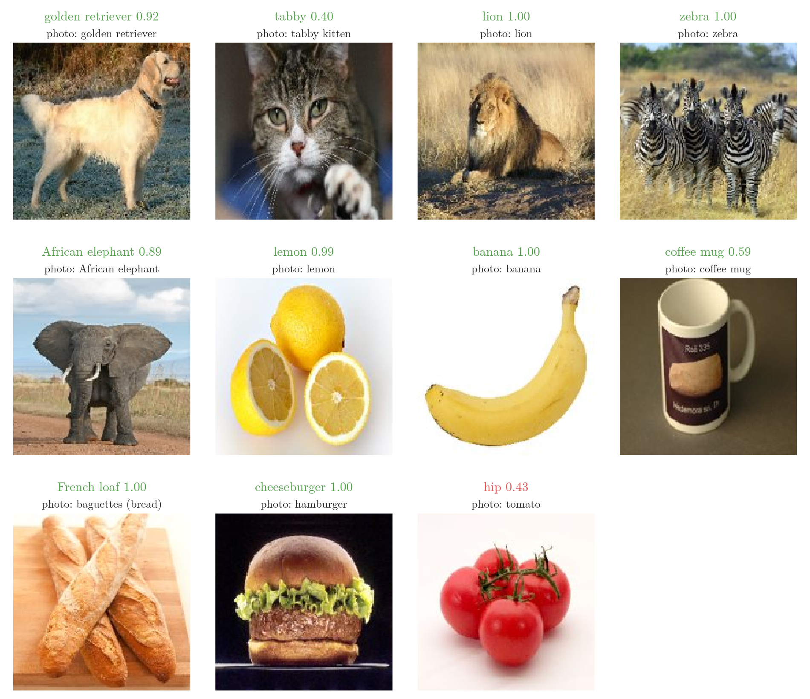
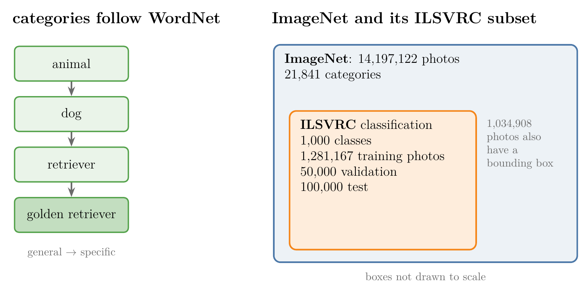
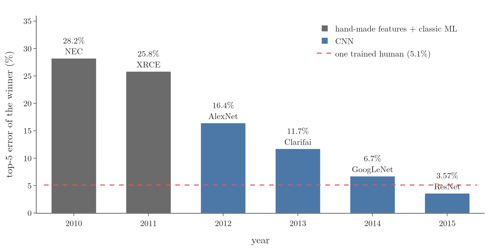
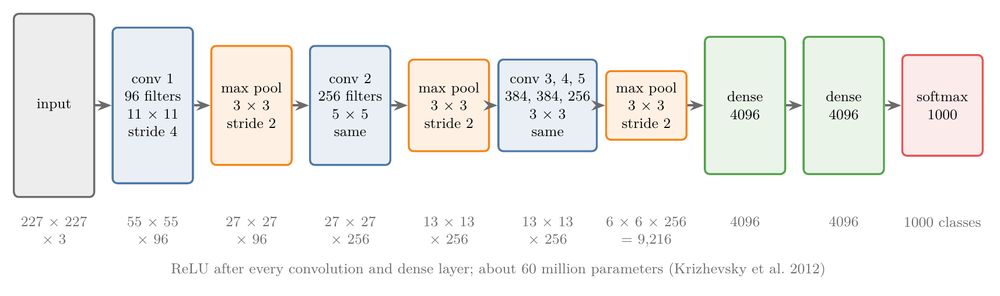
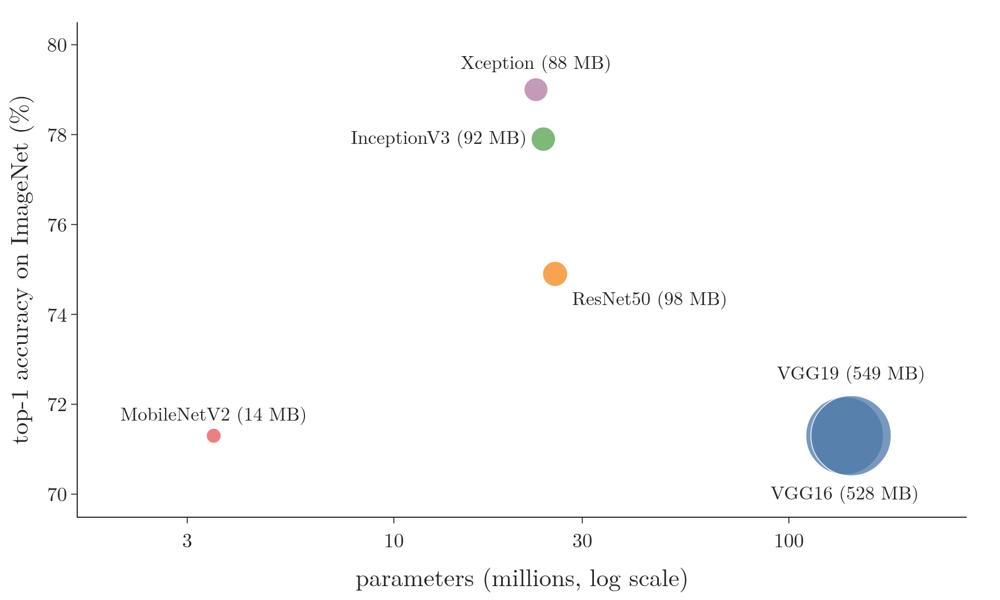
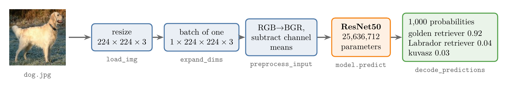

<!-- where-this-fits: generated by course_map/build_map.py; edit concepts.yaml, not this block -->
> **Where this fits:** Pipeline map step 8 (Model). See the [Course map](../01-course-map/note.md).
>
> 
>
> - **Builds on:** Labelled data ([Note 7](../07-challenges-in-ml/note.md)); CNN architecture (LeNet-5) ([Note 1045](../1045-lenet-5/note.md)).
> - **Leads to:** Visualising what a CNN learns ([Note 1052](../1052-visualizing-cnn/note.md)); Transfer learning (feature extraction and fine-tuning) ([Note 1053](../1053-transfer-learning/note.md)).
<!-- /where-this-fits -->

## 1. Overview

> **Key point:** A **pretrained model** (G-1558) is a network that someone else has already designed and trained on a huge dataset. The famous ones were trained on ImageNet, a collection of over 14 million labelled photos, and many won the yearly ImageNet competition. Keras can download them with their trained weights in one line, and they classify everyday photos correctly with no training at all.

Training a good convolutional neural network (CNN) needs a great deal of labelled data and a lot of computing time. A pretrained model skips both: researchers have already trained it on a dataset of over a million photos in 1,000 categories, and we simply reuse the result.

In this Note we use one such model, ResNet50, on eleven photos it has never seen. The model names ten of them correctly, with no training (Figure 1). The eleventh, a tomato, fails for a reason that leads straight to transfer learning.

{width=95%}

This Note covers:

- why pretrained models exist (section 3);
- the ImageNet dataset (section 4);
- the ImageNet competition and the networks it produced (section 5);
- the models available in Keras (section 6);
- how to use one (section 7).

## 2. Prerequisites

- [CNN architecture and LeNet-5 Note](../1045-lenet-5/note.md): convolution and pooling blocks, Flatten, dense layers.
- [Padding and strides Note](../1043-padding-and-strides/note.md): the output-size formula $\lfloor (n + 2p - f)/s \rfloor + 1$.
- [Cat vs dog CNN Note](../1049-cat-vs-dog-cnn/note.md): building, training and using our own CNN in Keras.
- [What is deep learning Note](../1002-what-is-deep-learning/note.md), section 5.4: the idea of reusing a trained architecture.

## 3. Why use someone else's model

> **Key point:** Two reasons: labelled image data is expensive to collect, and training on a lot of it takes hours to weeks.

Deep learning is data hungry: a CNN performs well only when it has seen many images. For classification the images must also be **labelled**: every photo needs a tag saying what it shows.

1. **Data is expensive.** Downloading 10,000 photos of cats and dogs from the web is easy. Labelling them is not: someone must look at each photo and write "cat" or "dog". A company has to pay people for that work, so a large labelled dataset costs a lot of time and money.
2. **Training is slow.** Even with the data, training a deep network on it takes hours, days or weeks, depending on the size of the data and of the network.

An everyday analogy: to get from one city to another we do not build our own car. We use one that a car maker has already designed, built and tested. A pretrained model is the car: the hard work of design and training is already done.

## 4. ImageNet: the dataset behind the models

> **Key point:** ImageNet is a database of over 14 million photos, each labelled with one of about 22,000 categories arranged in a hierarchy. People hired online did the labelling.

### 4.1 Why it was built

> **Key point:** Around 2006 most research went into new algorithms; Fei-Fei Li bet that a very large, well-labelled dataset was just as important.

In the mid-2000s, most machine learning research focused on models and algorithms. The computer scientist Fei-Fei Li argued that the data mattered just as much: algorithms can only be compared, and improved, on a large and well-labelled dataset. Her group began building **ImageNet** (G-920), and the first ImageNet paper appeared in 2009 (Deng et al. 2009).

### 4.2 What it contains

> **Key point:** 14,197,122 images in 21,841 categories, organised by the WordNet hierarchy, and about a million images with boxes around the objects.

- **Images and categories.** As of August 2014, ImageNet held 14,197,122 labelled images in 21,841 categories (Russakovsky et al. 2015, §1.1). The categories are everyday things: animals, plants, food, vehicles, furniture, tools.
- **A hierarchy.** The categories follow **WordNet** (G-2128), an English dictionary that arranges words from general to specific (Deng et al. 2009). "Golden retriever" sits under "retriever", under "dog", under "animal", so every label also says what more general things the photo shows.
- **Bounding boxes.** About a million images (1,034,908) also have a **bounding box** (G-328): a rectangle drawn around the object, which shows where in the photo the object is (ImageNet summary statistics). Boxes are what object localisation and detection need.

{width=100%}

In Figure 2, notice how much smaller the competition subset is: 1,000 of the 21,841 categories and about 1.3 of the 14.2 million photos. The pretrained models in this Note learned from that subset.

### 4.3 How it was labelled

> **Key point:** By crowdsourcing: thousands of paid workers on Amazon Mechanical Turk checked and labelled the photos.

Labelling 14 million photos by a small team was impossible. ImageNet used **Amazon Mechanical Turk**, an online platform where anyone can post small tasks for a payment (Russakovsky et al. 2015, §3.1.3). Workers were shown candidate photos found by web image search and asked whether each one contained a given object. Several workers labelled the same photo independently, and a photo was accepted only when enough of them agreed (Deng et al. 2009, §3.2). Spreading a task over many paid strangers this way is called **crowdsourcing** (G-512).

## 5. The ImageNet challenge (ILSVRC)

> **Key point:** From 2010 the ImageNet Large Scale Visual Recognition Challenge asked teams to classify about 1.2 million training photos into 1,000 classes. In 2012 a CNN, AlexNet, won by a wide margin; from then on every winner was a CNN, and by 2015 the winning error was lower than a trained human's.

### 5.1 The competition

> **Key point:** A subset of ImageNet: 1,000 classes, 1.28 million training photos, scored by the top-5 error.

The **ImageNet Large Scale Visual Recognition Challenge** (**ILSVRC** (G-917)) ran every year from 2010 (Russakovsky et al. 2015). Its classification task used a subset of ImageNet, to keep the problem manageable: 1,000 classes instead of about 22,000, with 1,281,167 training photos, 50,000 validation photos and 100,000 test photos (Russakovsky et al. 2015, Table 2). The 1,000 classes include 120 breeds of dog (Russakovsky et al. 2015, Figure 2), which makes the task much harder than "dog or not".

Entries are scored by their **top-5 error** (G-1990).

1. **In words:** the model lists its five most likely classes for each photo. The answer counts as correct if the true class is anywhere among the five. The top-5 error is the share of photos where it is not. The **top-1 error** (G-1989) counts only the single most likely class.
2. **Formula:** for $N$ test photos,
   $$\text{top-5 error} = \frac{\text{number of photos whose true class is not among the model's 5 guesses}}{N}$$
3. **Example:** a model shown 100 photos whose true class is missing from its five guesses for 28 of them has a top-5 error of $28/100$, that is 28%.

Top-5 is fair on ImageNet because many photos contain several objects, and some classes are very close (two similar dog breeds).

### 5.2 The results, year by year

> **Key point:** Hand-made features won in 2010 and 2011 with about 28% and 26% error. CNNs won every year from 2012, and the error fell to 3.6% in 2015.

{width=95%}

Figure 3 shows the winners (Russakovsky et al. 2015, Tables 5 to 7; He et al. 2016, Table 5):

| Year | Winner | Top-5 error | How |
|---|---|---|---|
| 2010 | NEC | 28.2% | hand-made image features (SIFT and LBP) and classic machine learning |
| 2011 | XRCE | 25.8% | hand-made image features and classic machine learning |
| 2012 | SuperVision (AlexNet) | 16.4% | a CNN trained on GPUs |
| 2013 | Clarifai | 11.7% | a CNN |
| 2014 | GoogLeNet | 6.7% | a 22-layer CNN; VGG came second with 7.3% |
| 2015 | ResNet | 3.57% | a CNN of up to 152 layers with skip connections |

In 2010 and 2011, the winners were classic machine learning systems. People designed the image features by hand, for example the **SIFT** and **LBP** descriptors used by the 2010 winner (Russakovsky et al. 2015, §5.1), and then trained a classifier on them. A top-5 error of 28% means that for 28 photos in 100, the true class was not even among the five guesses.

How good is a human? One trained annotator, who first studied 500 training photos, labelled 1,500 test photos and had a top-5 error of 5.1% (Russakovsky et al. 2015, §6.4.1). The 2015 winner's 3.57% is below that estimate.

The networks also grew deeper every year: 8 layers with weights in AlexNet, 16 and 19 in VGG, 22 in GoogLeNet (Szegedy et al. 2015) and up to 152 in ResNet (He et al. 2016). The [vanishing gradients Note](../1018-vanishing-exploding-gradients/note.md) explains the skip connections that let ResNet train so deep.

### 5.3 AlexNet, the 2012 winner

> **Key point:** Five convolution layers and three dense layers, about 60 million parameters, trained on two GPUs with ReLU. Its 16.4% error was almost ten points better than the runner-up's 26.2%.

In 2012, Alex Krizhevsky, Ilya Sutskever and Geoffrey Hinton entered a deep CNN, later called **AlexNet** (G-187) (Krizhevsky et al. 2012). The [history section](../1003-nn-types-history-applications/note.md) of the neural network history Note tells why this was a turning point. Three things made it work at that scale:

- **GPUs.** The network was trained on two NVIDIA GTX 580 graphics cards, which do the matrix arithmetic of a CNN far faster than a CPU (Krizhevsky et al. 2012, §1).
- **ReLU.** (G-1668) AlexNet used the ReLU activation, $\max(0, x)$, instead of tanh. On the CIFAR-10 dataset, a network with ReLU reached 25% training error six times faster than the same network with tanh (Krizhevsky et al. 2012, §3.1 and Figure 1). See the [activation functions Note](../1027-activation-functions/note.md).
- **Less overfitting.** AlexNet used **dropout** (G-639) and **data augmentation** (G-531) (the [dropout Note](../1024-dropout/note.md) and the [data augmentation Note](../1050-data-augmentation/note.md)).

{width=100%}

Figure 4 shows the layers (Krizhevsky et al. 2012, §3.5). Every size in it follows from the output-size formula of the [padding and strides Note](../1043-padding-and-strides/note.md).

1. **In words:** the output size is the input size, minus the filter size, divided by the stride, plus one (no padding).
2. **Formula:** $\text{output} = \lfloor (n - f)/s \rfloor + 1$.
3. **Example:** the first layer has 96 filters of $11 \times 11$ with stride 4 on a $227 \times 227$ photo:
   $$\frac{227 - 11}{4} + 1 = 55$$
   so it outputs $55 \times 55 \times 96$. The first max pooling ($3 \times 3$, stride 2) then gives $(55 - 3)/2 + 1 = 27$.

> **Extra:** The AlexNet paper says the input is $224 \times 224 \times 3$, but with 224 the first layer gives $(224 - 11)/4 + 1 = 54.25$, not a whole number. The 55 in the paper's own figure only comes out with 227, as above. The last pooling layer outputs $6 \times 6 \times 256 = 9{,}216$ numbers, which are flattened and passed to the dense layers.

> **Extra:** Two corrections to the usual telling of this story. First, AlexNet was not the first network to use ReLU; its authors write that they follow Nair and Hinton (2010), and that they "are not the first to consider alternatives to traditional neuron models in CNNs" (Krizhevsky et al. 2012, §3.1). Second, the often-quoted 15.3% error came from a version pre-trained on extra ImageNet data; trained on the competition data alone, the entry scored 16.4%, against 26.2% for the next team (Krizhevsky et al. 2012, §6; Russakovsky et al. 2015, Table 6).

## 6. Pretrained models in Keras

> **Key point:** `keras.applications` offers the famous ImageNet networks with their trained weights. The table on the Keras site lists each model's size, accuracy and number of parameters.

The winners of ILSVRC and their successors were published, and their trained weights were released. Keras collects many of them in `keras.applications`. Some of them (Keras documentation, Keras Applications):

| Model | Size | Top-1 accuracy | Top-5 accuracy | Parameters |
|---|---|---|---|---|
| VGG16 | 528 MB | 71.3% | 90.1% | 138.4 million |
| VGG19 | 549 MB | 71.3% | 90.0% | 143.7 million |
| ResNet50 | 98 MB | 74.9% | 92.1% | 25.6 million |
| InceptionV3 | 92 MB | 77.9% | 93.7% | 23.9 million |
| Xception | 88 MB | 79.0% | 94.5% | 22.9 million |
| MobileNetV2 | 14 MB | 71.3% | 90.1% | 3.5 million |

The accuracies are measured on ImageNet's validation photos. MobileNetV2 is by far the smallest of these models.

{height=40%}

In Figure 5, look at the two VGG models: they are the largest by far, yet no more accurate than MobileNetV2, which has about 40 times fewer parameters. More parameters do not buy accuracy by themselves.

Why is VGG16 so large? The file stores every trained weight, and each weight is a 32-bit number, which takes 4 bytes.

1. **In words:** the file size is about the number of parameters times 4 bytes.
2. **Formula:** $\text{size} \approx 4 \times \text{parameters}$ bytes.
3. **Example:** VGG16 has 138.4 million parameters: $4 \times 138.4 \text{ million} = 553.6$ million bytes. Divided by $1{,}048{,}576$ bytes per megabyte, that is 528 MB, the size in the table.

ResNet50 is five times smaller than VGG16 and more accurate. Most of VGG16's weights sit in its dense layers (see the [transfer learning Note](../1053-transfer-learning/note.md)).

## 7. A universal classifier with ResNet50

> **Key point:** Load ResNet50 with its ImageNet weights, resize a photo to 224 × 224, prepare its pixels the way the model was trained, predict, and decode the 1,000 probabilities into class names. Ten everyday photos out of ten were named correctly.

### 7.1 The code

> **Key point:** Four steps: load the model, load and resize the photo, prepare it, predict and decode.

> **Python:** Classify one photo with ResNet50.
>
> ```python
> import numpy as np, keras
> from keras.applications.resnet50 import (ResNet50, preprocess_input,
>                                          decode_predictions)
>
> # downloads the trained weights once
> model = ResNet50(weights="imagenet")
> img = keras.utils.load_img("dog.jpg", target_size=(224, 224))
> # a (224, 224, 3) array of pixels
> x = keras.utils.img_to_array(img)
> # a batch of one: (1, 224, 224, 3)
> x = np.expand_dims(x, axis=0)
> # the same pixel preparation as in training
> x = preprocess_input(x)
> probs = model.predict(x)                                # 1,000 probabilities
> # the 3 most likely class names
> print(decode_predictions(probs, top=3))
> ```
>
> `weights="imagenet"` asks for the weights learned on ImageNet. `preprocess_input` belongs to each model: for ResNet50 and VGG16 it reorders the colour channels from RGB to BGR and subtracts ImageNet's average value of each channel, as was done to the training photos (Keras documentation, `preprocess_input`). New photos must be prepared the same way. `decode_predictions` turns the 1,000 numbers into readable class names.

{width=100%}

In Figure 6, follow the shapes: the photo becomes a $224 \times 224 \times 3$ array, gains a batch dimension of 1, and leaves the network as 1,000 probabilities, of which `decode_predictions` shows the top 3.

The loaded model has 25,636,712 parameters, takes $224 \times 224 \times 3$ photos and outputs 1,000 probabilities, one per ILSVRC class (Notebook).

### 7.2 The results

> **Key point:** Correct on all ten photos of things that are ImageNet classes, mostly with probabilities above 0.9; the tomato, which is not a class, became "hip" and "strawberry".

We gave the model eleven photos from Wikimedia Commons, none of them from ImageNet (Figure 1; Notebook):

| Photo | Top answer | Probability | Second answer |
|---|---|---|---|
| golden retriever | golden retriever | 0.92 | Labrador retriever (0.04) |
| tabby kitten | tabby | 0.40 | Egyptian cat (0.32) |
| lion | lion | 1.00 | cheetah (0.00) |
| zebra | zebra | 1.00 | prairie chicken (0.00) |
| African elephant | African elephant | 0.89 | tusker (0.07) |
| lemon | lemon | 0.99 | orange (0.01) |
| banana | banana | 1.00 | hook (0.00) |
| coffee mug | coffee mug | 0.59 | cup (0.11) |
| baguettes | French loaf | 1.00 | corn (0.00) |
| hamburger | cheeseburger | 1.00 | bagel (0.00) |
| tomato | hip | 0.43 | strawberry (0.22) |

The model not only says "dog", it names the breed. Where it is less sure, the runner-up is a close relative: the tabby's other guesses are Egyptian cat and tiger cat, both kinds of cat.

The tomato fails, and the reason is simple: "tomato" is not one of the 1,000 ILSVRC classes (the Notebook searches the class list). A model can only answer with a class it was trained on. It picked **hip**, the round red fruit of the rose, and strawberry: the closest red, round things it knows.

A pretrained model is therefore a ready-made classifier only for its own 1,000 classes. For a problem with other classes, such as phones versus tablets, or a dataset of our own, we keep what the network has learned about images and teach it the new classes. That is **transfer learning** (G-2005), the subject of the [transfer learning Note](../1053-transfer-learning/note.md).

## 8. Summary

| Idea | In one line |
|---|---|
| Pretrained model | A network designed and trained by someone else, reused as it is |
| Why | Labelled data is costly; training takes hours to weeks |
| ImageNet | 14 million labelled photos, about 22,000 categories, WordNet hierarchy, crowdsourced labels |
| ILSVRC | 1,000 classes, 1.28 million training photos, top-5 error; yearly from 2010 |
| AlexNet (2012) | The first CNN winner: 16.4% against 26.2%, on two GPUs, with ReLU |
| ResNet (2015) | 3.57% top-5 error, below one trained human's 5.1% |
| `keras.applications` | VGG16, ResNet50, MobileNet and others, with ImageNet weights |

- A pretrained model needs no data and no training when our classes are among its 1,000.
- Use the model's own `preprocess_input`, and the input size it was trained on.
- For classes outside the 1,000, transfer learning adapts the model to new data.

## 9. Sources

**Built from**

- CampusX, "Pretrained models in CNN | ImageNET Dataset | ILSVRC | Keras Code", YouTube, https://www.youtube.com/watch?v=0MVXteg7TB4

**Other references**

- Deng, J., Dong, W., Socher, R., Li, L.-J., Li, K. and Fei-Fei, L. (2009). ImageNet: A Large-Scale Hierarchical Image Database. *CVPR 2009*. (ImageNet built on the WordNet hierarchy; §3.2: candidate photos verified by several Amazon Mechanical Turk workers each.)
- Russakovsky, O. et al. (2015). ImageNet Large Scale Visual Recognition Challenge. *International Journal of Computer Vision* 115, 211–252. arXiv:1409.0575. §1.1 (14,197,122 images, 21,841 synsets), §3.1.3 (Mechanical Turk), Table 2 (1,281,167 / 50,000 / 100,000 photos), Figure 2 (120 dog breeds), §4.1 (top-1 and top-5), §5.1 (the 2010 winner's SIFT and LBP features), Tables 5–7 (winners 2010–2014), §6.4.1 (human error 5.1%).
- "ImageNet: Summary and Statistics", image-net.org, 30 April 2010 (archived 7 September 2020): 21,841 synsets, 14,197,122 images, 1,034,908 with bounding-box annotations.
- Krizhevsky, A., Sutskever, I. and Hinton, G. E. (2012). ImageNet Classification with Deep Convolutional Neural Networks. *NeurIPS 2012*. §1 (two GTX 580 GPUs), §3.1 and Figure 1 (ReLU, Nair and Hinton 2010), §3.5 (layers), §6 (results).
- Nair, V. and Hinton, G. E. (2010). Rectified Linear Units Improve Restricted Boltzmann Machines. *ICML 2010*.
- Simonyan, K. and Zisserman, A. (2015). Very Deep Convolutional Networks for Large-Scale Image Recognition. *ICLR 2015*. arXiv:1409.1556. (16 and 19 weight layers; 7.3% top-5, second place in ILSVRC 2014 classification.)
- Szegedy, C. et al. (2015). Going Deeper with Convolutions. *CVPR 2015*. arXiv:1409.4842. (GoogLeNet, 22 layers, 6.67% top-5.)
- He, K., Zhang, X., Ren, S. and Sun, J. (2016). Deep Residual Learning for Image Recognition. *CVPR 2016*. arXiv:1512.03385. Table 5 (3.57%, first place in ILSVRC 2015; up to 152 layers).
- Keras documentation: Keras Applications, keras.io/api/applications (model table: size, top-1 and top-5 accuracy, parameters); `imagenet_utils.preprocess_input` ("caffe" mode: RGB to BGR, each channel centred on its ImageNet mean).
- Photos: Wikimedia Commons. Golden retriever (Janneke Vreugdenhil, public domain); kitten (David Corby, CC BY 2.5); lion (Kevin Pluck, CC BY 2.0); zebra (Paul Maritz, CC BY 2.5); African elephant (Muhammad Mahdi Karim, GFDL 1.2); lemon (André Karwath, CC BY-SA 2.5); banana (Evan-Amos, CC BY-SA 3.0); coffee mug (Jackie Taffinder, CC BY-SA 3.0); baguettes (jules / stonesoup, CC BY 2.0); hamburger (Len Rizzi, public domain); tomato (Softeis, CC BY-SA 3.0).

## 10. Key terms

| Term | Meaning |
|---|---|
| Pretrained model | A network already trained by someone else on a large dataset, reused for our own predictions |
| Labelled data | Data in which every observation comes with its correct answer, such as "cat" for a photo |
| ImageNet | A database of over 14 million labelled photos in about 22,000 categories |
| WordNet | An English dictionary that arranges words from general to specific; ImageNet's categories follow it |
| Bounding box | A rectangle drawn around an object to show where it is in a photo |
| Crowdsourcing | Splitting a large task, such as labelling, among many paid online workers |
| ILSVRC | The ImageNet Large Scale Visual Recognition Challenge: 1,000 classes, about 1.2 million training photos |
| Top-1 error | The share of photos whose true class is not the model's single most likely class |
| Top-5 error | The share of photos whose true class is not among the model's five most likely classes |
| AlexNet | The CNN that won ILSVRC 2012: five convolution layers, three dense layers, two GPUs, ReLU |
| `keras.applications` | The Keras module that provides famous pretrained networks with their weights |
| `preprocess_input` | The function that prepares pixels the way a given pretrained model expects |
| `decode_predictions` | The function that turns 1,000 ImageNet probabilities into class names |
