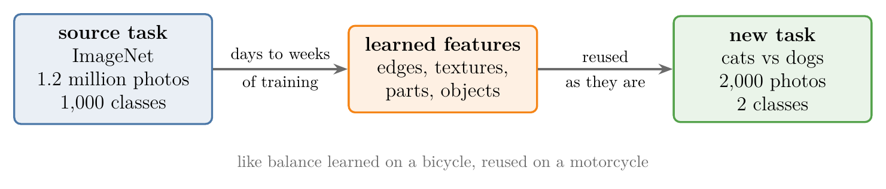
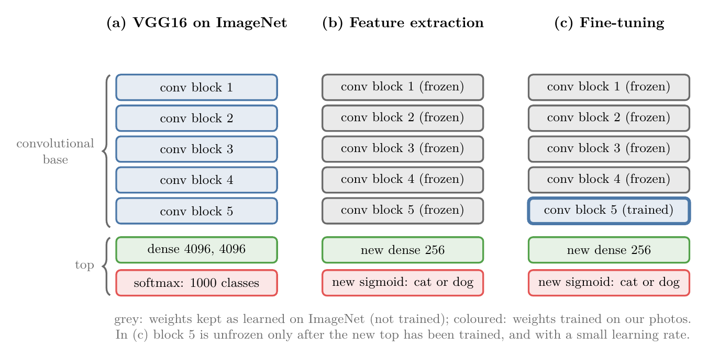
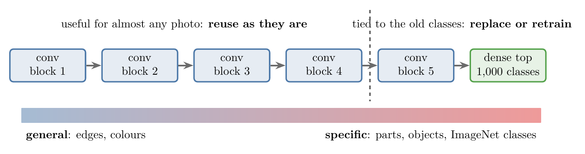
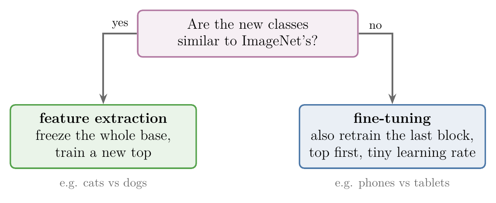
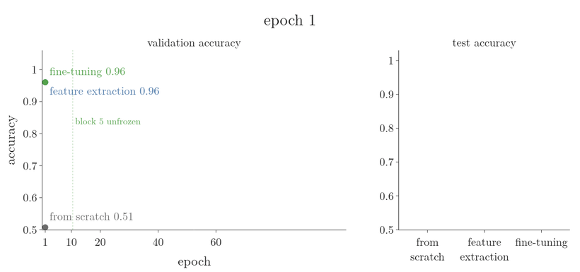

<!-- where-this-fits: generated by course_map/build_map.py; edit concepts.yaml, not this block -->
> **Where this fits:** Pipeline map step 8 (Model). See the [Course map](../01-course-map/note.md).
>
> 
>
> - **Builds on:** Enough data ([Note 7](../07-challenges-in-ml/note.md)); Overfitting ([Note 1026](../1026-regularization-in-dl/note.md)); Pretrained models and ImageNet ([Note 1051](../1051-pretrained-models/note.md)).
> - **Compare with:** Image classification with a CNN (cats vs dogs) ([Note 1049](../1049-cat-vs-dog-cnn/note.md)).
<!-- /where-this-fits -->

## 1. Overview

> **Key point:** **Transfer learning** (G-2005) reuses what a network learned on one large dataset for a new, related problem. We keep the convolutional base of a pretrained CNN, replace its top with new layers for our own classes, and train only what is needed. On 2,000 photos of cats and dogs, feature extraction reached 94.9% test accuracy against 76.5% for a CNN trained from scratch, and fine-tuning the last block added a little more: 95.7%.

A pretrained model such as VGG16 knows the 1,000 ImageNet classes (the [pretrained models Note](../1051-pretrained-models/note.md)). Our own problem often has other classes, and only a little labelled data. Training a CNN from scratch on that little data **overfits** (G-1429); transfer learning avoids most of the problem by starting from features that are already good.

This Note covers:

- why transfer learning is needed (section 3);
- how it works (section 4);
- why it works (section 5);
- its two forms, **feature extraction** (G-762) and **fine-tuning** (G-779) (sections 6 and 7);
- an experiment that compares them with training from scratch (section 8).

## 2. Prerequisites

- [Pretrained models Note](../1051-pretrained-models/note.md): ImageNet, VGG16, `keras.applications`.
- [What a CNN sees Note](../1052-visualizing-cnn/note.md): early layers detect edges, deeper layers parts and objects.
- [Data augmentation Note](../1050-data-augmentation/note.md): the small cats-vs-dogs dataset and the CNN trained from scratch on it.
- [What is deep learning Note](../1002-what-is-deep-learning/note.md), section 5.4: the idea of reusing a trained network.

## 3. Why transfer learning

> **Key point:** Training from scratch needs a lot of labelled data and a lot of time. A pretrained model saves both, but only knows its own 1,000 classes.

Two problems make training a deep network from scratch hard:

1. **Data.** Deep learning is data hungry. A cat-vs-dog classifier might need 10,000 labelled photos, and someone has to label every one by hand, which costs time and money.
2. **Time.** On a large dataset, training takes days or weeks, sometimes months.

A pretrained model solves both: it was trained once, on ImageNet, and we reuse it. But it has a limit. Suppose we must tell phones from tablets, and suppose neither is among the 1,000 ImageNet classes. The pretrained model can only answer with a class it knows, as the tomato in the [pretrained models Note](../1051-pretrained-models/note.md) showed. We need a way to keep what the network has learned while teaching it new classes. That way is transfer learning.

"Transfer learning consists of taking features learned on one problem, and leveraging them on a new, similar problem" (Keras documentation, Transfer learning and fine-tuning). People do the same. Someone who can ride a bicycle learns to ride a motorcycle faster, because both need balance. Someone who plays the violin learns the guitar faster, because both use the same musical notes. Knowledge from one task speeds up a related task.

{width=100%}

In Figure 1, the expensive arrow is the first one: the days of training on 1.2 million photos are paid once, and the new task with only 2,000 photos reuses the result.

## 4. How it works

> **Key point:** Cut the pretrained CNN into its convolutional base and its dense top. Keep the base, freeze it, put new dense layers for our classes on top, and train.

### 4.1 Base and top

> **Key point:** The convolutional base finds features in the image; the dense top turns them into ImageNet's 1,000 classes.

VGG16 has two parts (Figure 2a). The **convolutional base** (G-482), its 13 convolution layers and 5 pooling layers, finds the spatial patterns in an image: edges, textures, parts, objects. The **top** (G-1988), its dense layers and its 1,000-way softmax, uses those features to classify the image into the ImageNet classes. The base holds 14,714,688 of VGG16's 138,357,544 parameters; the top holds the rest (Notebook).

{width=100%}

### 4.2 Replace the top, freeze the base

> **Key point:** Remove the top, add new dense layers ending in one sigmoid node for cat or dog, and freeze the base so its weights do not change.

For our cats and dogs:

1. Keep the convolutional base with its ImageNet weights.
2. Throw away the top, and put new layers in its place: here a dense layer of 256 nodes and one output node with a sigmoid, because the problem has two classes.
3. **Freeze** (G-805) the base: mark its weights as not trainable, so that training does not change them. The knowledge learned on ImageNet lives in those weights.
4. Train on our own data. Only the new top learns.

The Keras guide describes exactly this workflow: take layers from a trained model, freeze them "so as to avoid destroying any of the information they contain", add new trainable layers on top, and train them on the new dataset (Keras documentation, Transfer learning and fine-tuning).

## 5. Why it works

> **Key point:** Early layers learn general features such as edges and colour blobs, useful for almost any photo. Only the later layers are specific to the original classes.

The [what a CNN sees Note](../1052-visualizing-cnn/note.md) showed that VGG16's early layers respond to edges and colours, and its deeper layers to parts and whole objects. Edges, textures and shapes appear in every photo, whatever it shows. So the features learned on 1.2 million ImageNet photos are useful for our photos too, and there is no reason to learn them again: we do not reinvent the wheel.

Yosinski et al. (2014) measured this. First-layer features "appear not to be specific to a particular dataset or task, but general", while features "must eventually transition from general to specific by the last layer". They also found that "the transferability of features decreases as the distance between the base task and target task increases" (Yosinski et al. 2014, abstract). The more the new classes resemble the old ones, the more of the network can be reused unchanged.

{width=100%}

Figure 3 is the reason behind both methods of section 6: the blocks left of the dashed line are reused as they are by both methods, the dense top is always replaced, and block 5 is retrained only by fine-tuning.

## 6. Two ways to transfer

> **Key point:** Feature extraction freezes the whole base and trains a new top: best when the new classes are similar to ImageNet's. Fine-tuning also retrains the last convolution layers: better when the new problem is further away.

### 6.1 Feature extraction

> **Key point:** Freeze the entire convolutional base; train only the new top.

**Feature extraction** is the method of section 4: the base turns each photo into features, and the new top learns to classify those features (Figure 2b). It suits problems whose classes resemble ImageNet's. Cats and dogs are a good example: ImageNet's 1,000 classes include many cat and dog breeds (the [pretrained models Note](../1051-pretrained-models/note.md)), so the deep layers already recognise the features of these animals, and only the top needs to change.

### 6.2 Fine-tuning

> **Key point:** Unfreeze the last block of the base as well, and retrain it together with the new top, with a very small learning rate.

In **fine-tuning** we also unfreeze the last few convolution layers, here VGG16's block 5, and retrain them together with the new top (Figure 2c). The early layers stay frozen, because their general features suit any photo. The last layers hold the most specialised features, and fine-tuning adapts them to the new problem. Fine-tuning therefore helps most when the new classes differ from ImageNet's, such as phones versus tablets in our example.

Chollet gives the reasoning: "Earlier layers in the convolutional base encode more generic, reusable features, while layers higher up encode more specialized features. It is more useful to fine-tune the more specialized features" (Chollet 2017, §5.3). Two rules come with fine-tuning:

1. **Train the new top first.** A new top starts with random weights and makes large errors. "If the classifier wasn't already trained, then the error signal propagating through the network during training would be too large, and the representations previously learned by the layers being fine-tuned would be destroyed" (Chollet 2017, §5.3).
2. **Use a very low learning rate.** The **learning rate** (G-1068) sets how far each update moves a weight. The filters of block 5 are already good: they were trained on 1.2 million photos. A normal learning rate would move them far from those values in a few updates, on only 2,000 photos, and the learned features would be lost. A very low learning rate changes each filter only a little, so the block adapts without forgetting. Chollet gives this reason: the low rate is there to "limit the magnitude of the modifications we make to the representations" of the unfrozen layers (Chollet 2017, §5.3). The Keras guide gives the same one: the model is now much larger and the dataset small, so "you are at risk of overfitting very quickly if you apply large weight updates"; we "only want to readapt the pretrained weights in an incremental way" (Keras documentation, Transfer learning and fine-tuning).

Figure 4 plays the two methods one after the other. Watch the padlocks: all five blocks are locked for feature extraction, and only block 5 opens for fine-tuning.

{width=100%}

{width=75%}

Figure 5 sums up the section: the closer the new classes are to ImageNet's, the less of the network needs to change.

## 7. Transfer learning in Keras

> **Key point:** `VGG16(weights="imagenet", include_top=False)` gives the base; `trainable = False` freezes it; a `Sequential` model puts the new top on it.

### 7.1 Feature extraction

> **Python:** VGG16's base with a new top, frozen.
>
> ```python
> import keras
> from keras import layers
> from keras.applications.vgg16 import VGG16, preprocess_input
>
> conv_base = VGG16(weights="imagenet", include_top=False,
>                   input_shape=(150, 150, 3))
> conv_base.trainable = False                    # freeze every layer of the base
> model = keras.Sequential([
>     keras.Input(shape=(150, 150, 3)),
>     layers.Lambda(preprocess_input),           # VGG16's own pixel preparation
>     conv_base,
>     layers.Flatten(),
>     layers.Dense(256, activation="relu"),
>     layers.Dense(1, activation="sigmoid")])
> model.compile(optimizer="adam", loss="binary_crossentropy",
>               metrics=["accuracy"])
> ```
>
> `include_top=False` loads only the convolutional base. `input_shape` may differ from ImageNet's $224 \times 224$; for $150 \times 150$ photos the base outputs $4 \times 4 \times 512$. `trainable = False` on the base freezes all its layers.

The parameter counts show what freezing does (Notebook):

| | Parameters |
|---|---|
| Whole model | 16,812,353 |
| Trainable, base frozen | 2,097,665 (the new top: $(8{,}192 + 1) \times 256 + (256 + 1) \times 1$) |
| Trainable, block 5 unfrozen | 9,177,089 |
| Trainable, nothing frozen | 16,812,353 |

The top's count follows from the dense-layer formula: Flatten gives $4 \times 4 \times 512 = 8{,}192$ numbers, so the 256-node layer has $(8{,}192 + 1) \times 256 = 2{,}097{,}408$ parameters and the output node $256 + 1 = 257$.

{width=85%}

In Figure 6, the gap between the grey and green bars is block 5 alone: three $3 \times 3$ convolution layers of 512 filters, $3 \times (3 \times 3 \times 512 \times 512 + 512) = 7{,}079{,}424$ parameters that fine-tuning sets free.

> **Extra:** Each pretrained model expects its inputs prepared the way its training photos were. For VGG16, `preprocess_input` reorders the colour channels to BGR and subtracts ImageNet's mean of each channel (the [pretrained models Note](../1051-pretrained-models/note.md)). Dividing by 255 instead also trains, because the new top adapts, but the frozen base then receives inputs on a different scale from the one it learned on.

### 7.2 Fine-tuning

> **Python:** After the top has trained, unfreeze block 5 and continue with a tiny learning rate.
>
> ```python
> conv_base.trainable = True
> for layer in conv_base.layers:
>     layer.trainable = layer.name.startswith("block5")   # only block 5 learns
> model.compile(optimizer=keras.optimizers.RMSprop(learning_rate=1e-5),
>               loss="binary_crossentropy", metrics=["accuracy"])
> model.fit(train_ds, epochs=10, validation_data=val_ds)
> ```
>
> Changing `trainable` takes effect only after `compile` is called again. Chollet (2021, ch. 8) fine-tunes VGG16's last block with the same RMSprop learning rate of $10^{-5}$.

## 8. Experiment: from scratch vs feature extraction vs fine-tuning

> **Key point:** On the same 2,000 training photos, a CNN trained from scratch reached 76.5% test accuracy, feature extraction 94.9%, and fine-tuning 95.7%.

### 8.1 Setup

> **Key point:** The same 2,000 training photos, 1,000 validation and 1,000 test photos; three methods, three seeds each.

The data is the small cats-vs-dogs set of the [data augmentation Note](../1050-data-augmentation/note.md): 1,000 cats and 1,000 dogs for training, 500 + 500 for validation, 500 + 500 for testing, all $150 \times 150$. We compare:

1. **From scratch:** the small CNN of the augmentation Note, with augmentation, trained for 60 epochs. Augmentation makes this the strongest from-scratch model of that Note. Here it uses batches of 32, like the other two methods, instead of 16, so its result differs slightly from the 78.2% reported there.
2. **Feature extraction:** VGG16's frozen base and the new top, trained for 20 epochs with Adam.
3. **Fine-tuning:** the same as feature extraction for the first 10 epochs; then block 5 is unfrozen and training continues for 10 more epochs with RMSprop at a learning rate of $10^{-5}$.

Methods 2 and 3 thus both train for 20 epochs from the same start; the only difference is whether block 5 is unfrozen for the second half. Each method is trained with three seeds, and the test accuracy is measured once at the end.

> **Extra:** Blocks 1 to 4 stay frozen in both transfer methods, and the photos are not augmented, so those blocks turn each photo into the same numbers in every epoch. The Notebook therefore runs every photo through blocks 1 to 4 once, stores the result, and trains block 5 and the top on it. The Notebook checks that this gives the same output as the original base; only repeated work is skipped.

### 8.2 Results

> **Key point:** Transfer learning beats training from scratch by about 18 points. Fine-tuning block 5 adds 0.8 points on average and makes the three runs agree more closely.

{width=100%}

In Figure 7, watch the first frame: after one epoch the two transfer models are already at 0.96, while the model trained from scratch starts at 0.51 and is still climbing 60 epochs later.

| Method | Test accuracy (mean of 3 seeds) | Lowest–highest | Training accuracy, last epoch |
|---|---|---|---|
| From scratch (with augmentation, 60 epochs) | 76.5% | 74.3%–79.7% | 81.7% |
| Feature extraction (20 epochs) | 94.9% | 94.3%–95.9% | 99.5% |
| Fine-tuning (10 + 10 epochs) | 95.7% | 95.5%–95.9% | 100.0% |

Three things stand out (Figure 7; Notebook).

**Transfer learning wins by a wide margin.** With the same 2,000 photos, the frozen VGG16 base gives 94.9% test accuracy, against 76.5% for the best model trained from scratch. Feature extraction reaches 96.0% validation accuracy after a single epoch, a level the scratch model never approaches: its best validation accuracy in 60 epochs is 78.0%. The base was trained on 1.2 million ImageNet photos, including many cats and dogs, so its features already separate the two animals; 2,000 photos are far too few to learn such features from nothing.

**Fine-tuning helps a little.** Up to epoch 10 the two transfer methods are the same model. In the second half, the model with block 5 unfrozen ends at 95.7% test accuracy against 94.9%, and its three runs lie between 95.5% and 95.9%, against 94.3% to 95.9% without fine-tuning. Its validation loss also stays lower: 0.73 at epoch 20 against 1.37. For cats and dogs, classes close to ImageNet's, feature extraction already does most of the work, as section 6.1 expects; adapting the most specialised block adds the last bit.

**Both transfer models fit the training photos almost perfectly** (99.5% and 100% training accuracy), while validation accuracy stays near 96%. The top alone has 2.1 million parameters for 2,000 photos. Even so, their test accuracy is 18 to 19 points above the scratch model's.

## 9. Summary

| | Feature extraction | Fine-tuning |
|---|---|---|
| Frozen | the whole convolutional base | the early blocks (here 1 to 4) |
| Trained | the new top | the new top, then the last block too |
| Learning rate | normal (Adam) | very low for the second stage ($10^{-5}$), so the pretrained filters change only a little |
| When | new classes similar to ImageNet's (cats, dogs) | new classes further from ImageNet's |
| Here (test accuracy) | 94.9% | 95.7% (from scratch: 76.5%) |

- Transfer learning reuses a pretrained network's knowledge for a new, related problem.
- Keep the convolutional base, replace the dense top, freeze what should not change.
- Early layers learn general features; later layers become specific, so they are the ones to fine-tune.
- Train the new top before unfreezing anything, and fine-tune with a very low learning rate.
- On 2,000 cat and dog photos: from scratch 76.5%, feature extraction 94.9%, fine-tuning 95.7% test accuracy.

## 10. Sources

**Built from**

- CampusX, "What is Transfer Learning? Transfer Learning in Keras | Fine Tuning Vs Feature Extraction", YouTube, https://www.youtube.com/watch?v=WWcgHjuKVqA

**Other references**

- Keras documentation: Transfer learning and fine-tuning, keras.io/guides/transfer_learning (definition; the workflow: take layers, freeze them, add new trainable layers, train, then optionally fine-tune "with a very low learning rate"; the reason for the low rate: large weight updates overfit quickly, the pretrained weights should be readapted incrementally).
- Yosinski, J., Clune, J., Bengio, Y. and Lipson, H. (2014). How transferable are features in deep neural networks? *NeurIPS 2014*. arXiv:1411.1792. Abstract (general first-layer features, specific last-layer features; transferability falls as the tasks grow apart).
- Chollet, F. (2017). *Deep Learning with Python*. Manning. §5.3 and its companion notebook (fine-tuning: train the top first, fine-tune the specialised higher layers, use a very low learning rate).
- Chollet, F. (2021). *Deep Learning with Python*, 2nd ed. Manning. Ch. 8, companion notebook (VGG16 base at 150 × 150; fine-tuning the last block with `RMSprop(learning_rate=1e-5)`).
- Simonyan, K. and Zisserman, A. (2015). Very Deep Convolutional Networks for Large-Scale Image Recognition. *ICLR 2015*. arXiv:1409.1556. (VGG16.)
- Keras documentation: VGG16 and `preprocess_input`, keras.io/api/applications/vgg.

## 11. Key terms

| Term | Meaning |
|---|---|
| Transfer learning | Reusing what a network learned on one problem as the starting point for a related problem |
| Convolutional base | The convolution and pooling layers of a CNN, which find features in the image |
| Top | The dense layers at the end of a CNN, which turn features into classes |
| Freeze | Mark a layer's weights as not trainable, so that training leaves them unchanged |
| Feature extraction | Transfer learning that freezes the whole base and trains only a new top |
| Fine-tuning | Transfer learning that also retrains the last layers of the base, with a very low learning rate |
| `include_top=False` | The `keras.applications` option that loads a model without its dense top |
| `trainable` | The Keras attribute that decides whether a layer's weights are updated in training |
