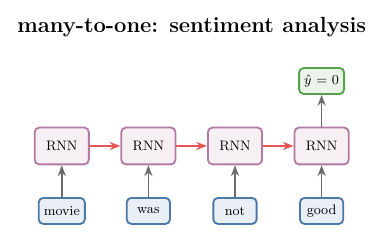
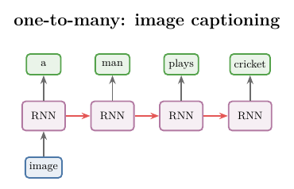
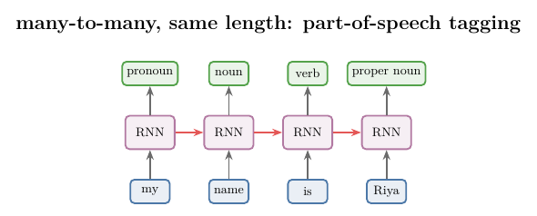
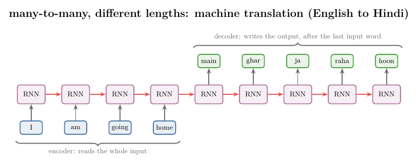
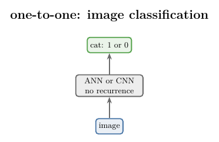

<!-- where-this-fits: generated by course_map/build_map.py; edit concepts.yaml, not this block -->
> **Where this fits:** Pipeline map step 8 (Model). See the [Course map](../01-course-map/note.md).
>
> 
>
> - **Builds on:** Recurrent neural network (RNN) ([Note 1057](../1057-rnn-sentiment-analysis/note.md)).
> - **Leads to:** Attention mechanism ([Note 1069](../1069-attention-mechanism/note.md)); Transformer ([Note 1071](../1071-introduction-to-transformers/note.md)).
<!-- /where-this-fits -->

## 1. Overview

> **Key point:** RNNs are grouped by two questions: is the input a sequence, and is the output a sequence? The answers give many-to-one, one-to-many and many-to-many (same or different lengths). One-to-one, with no sequence on either side, is an ordinary network, not an RNN.

The [RNN forward propagation Note](../1056-rnn-forward-propagation/note.md) built one RNN: it reads a review word by word and gives one prediction at the end. The same recurrent layer can be wired in other ways, depending on what goes in and what comes out.

| Type | Input | Output | Example |
|---|---|---|---|
| Many-to-one | sequence | one value | sentiment analysis, rating prediction |
| One-to-many | one value (not a sequence) | sequence | image captioning, music generation |
| Many-to-many, same length | sequence | sequence, one output per input | part-of-speech tagging, named entity recognition |
| Many-to-many, different lengths | sequence | sequence of another length | machine translation |
| One-to-one | one value | one value | image classification (not an RNN) |

Each type has its own unrolled picture, shown in Figures 1 to 5. The type also changes how backpropagation runs through the network, which the [backpropagation through time Note](../1059-backpropagation-through-time/note.md) covers.

## 2. Prerequisites

- The [why RNNs Note](../1055-why-rnn/note.md): sequential and non-sequential data.
- The [RNN forward propagation Note](../1056-rnn-forward-propagation/note.md): the recurrent layer, the hidden state $h_t$ and unfolding through time.
- The [RNN sentiment analysis Note](../1057-rnn-sentiment-analysis/note.md): a many-to-one RNN trained in Keras.

## 3. Many-to-one

> **Key point:** A sequence goes in, one value comes out. The RNN reads every time step and predicts only after the last one.

A **many-to-one** RNN takes a sequence as input, such as a sentence, a string of characters or a time series, and gives a non-sequential output: one number, such as a class label 1 or 0.

- **Sentiment analysis:** the input is a review, read word by word; the output is its sentiment, 1 (positive) or 0 (negative).
- **Rating prediction:** the input is a review; the output is a star rating from 1 to 5. The output is still one value, so this is a multi-class classification problem on top of a many-to-one RNN.

{width=70%}

Figure 1 is the RNN of the [RNN forward propagation Note](../1056-rnn-forward-propagation/note.md), unrolled: many inputs, one output, hence the name. Goodfellow §10.2 describes this pattern as a network that reads an entire sequence and then produces a single output, a fixed-size summary of the sequence.

> **Python:** In Keras a recurrent layer returns only its last hidden state by default (`return_sequences=False`), which is exactly many-to-one.
>
> ```python
> model = keras.Sequential([
>     keras.Input(shape=(4, 5)),      # (time steps, features)
>     keras.layers.SimpleRNN(3),      # last hidden state only
>     keras.layers.Dense(1, activation="sigmoid")])
> # input (3, 4, 5) -> output (3, 1): one number per review
> ```

## 4. One-to-many

> **Key point:** One non-sequential input goes in, a sequence comes out. The input enters once, and the RNN produces an output at every time step.

A **one-to-many** RNN takes a non-sequential input and produces a sequence. An image is non-sequential data: it is a grid of numbers with no order in time. The output can be words, a sentence or a time series.

- **Image captioning:** the input is one image; the output is a sentence that describes it. An image of a man playing cricket might give "a man plays cricket".
- **Music generation:** one input starts the network, and it keeps producing music notes, one per time step.

{width=70%}

In Figure 1 the arrows fanned in to one output; in Figure 2 they fan out. The input enters once, at the first time step. At every time step the RNN produces an output and passes its hidden state on to the next step. Goodfellow §10.2.4 names image captioning as the standard task for an RNN that maps one fixed-length vector to a sequence.

> **Extra:** Goodfellow §10.4 gives two ways to feed the single input to such an RNN: as the initial hidden state, or as an input at every time step (and the two can be combined). The Notebook uses the second way: Keras' `RepeatVector(6)` copies the input to 6 time steps, and the RNN with `return_sequences=True` returns 6 hidden states. An input of shape $(2, 8)$, two "images" of 8 numbers, gives an output of shape $(2, 6, 5)$: 6 words per image, each a probability over 5 words.

## 5. Many-to-many

> **Key point:** A sequence goes in and a sequence comes out. Such models are also called sequence-to-sequence models. The two sequences can have the same length or different lengths.

A **many-to-many** RNN takes a sequence and returns a sequence, so it is also called a **sequence-to-sequence** (seq2seq) model. It comes in two kinds.

### 5.1 Same length

> **Key point:** One output for every input: the RNN predicts at every time step.

In a **same-length many-to-many** RNN, the output sequence has as many elements as the input sequence.

- **Part-of-speech tagging:** for each word of a sentence, predict its part of speech. "my name is Riya" gives pronoun, noun, verb, proper noun: 4 words in, 4 tags out. In natural language processing (NLP), tagging is a common preprocessing step.
- **Named entity recognition (NER):** for each word, decide whether it is an entity, a specific thing the program must act on. In "let's meet at 7 pm at the airport", "7 pm" and "airport" are entities. Chatbots use NER to pick out times and places.

{width=70%}

In Figure 3, each time step takes the next input and gives an output, and the hidden state moves on, until the inputs run out. Goodfellow §10.2 lists this as the first RNN pattern: an output at each time step, with recurrent connections between hidden units.

> **Python:** `return_sequences=True` makes the recurrent layer return the hidden state of every time step. A `Dense` layer on that 3D output acts on the last axis, so it makes one prediction per time step (Keras documentation, `Dense`).
>
> ```python
> model = keras.Sequential([
>     keras.Input(shape=(4, 5)),
>     keras.layers.SimpleRNN(3, return_sequences=True),
>     keras.layers.Dense(4, activation="softmax")])  # 4 tags
> # input (3, 4, 5) -> output (3, 4, 4): 4 tags per word
> ```

With the same weights, the last of the hidden states returned by `return_sequences=True` equals the single hidden state returned by `return_sequences=False` (Notebook). The two settings run the same computation and differ only in what they hand on.

### 5.2 Different lengths

> **Key point:** The output sequence can be longer or shorter than the input. The RNN first reads the whole input (the encoder), and only then starts writing the output (the decoder).

In a **variable-length many-to-many** RNN, the input and output sequences can have different lengths. The standard example is **machine translation**: translating a sentence from one language into another. Nothing guarantees that a sentence and its translation have the same number of words: some languages say the same thing in fewer words. "I am going home" has 4 words; its Hindi translation "main ghar ja raha hoon" has 5.

{width=100%}

In Figure 4 the network produces nothing while it reads the input. It starts producing output only after the last input word. The reason is the task: translation does not work word by word. We read the whole sentence, understand its meaning and grammar, and only then decide on the translation. Translating each word as soon as it arrives would lose both the grammar and the context.

The two parts have names.

- The **encoder** is the part that reads the input. It emits a summary of the input, usually a simple function of its last hidden state (Goodfellow §10.4).
- The **decoder** is the part that writes the output, starting from that summary.

Together they form an **encoder-decoder** architecture. Its advance over the earlier patterns is that the input length and the output length can differ (Goodfellow §10.4). Speech recognition and question answering have the same need (Goodfellow §10.4).

> **Extra:** A minimal encoder-decoder in Keras (Notebook): a `SimpleRNN(3)` encoder keeps only its last hidden state; `RepeatVector(6)` hands it to 6 time steps; a `SimpleRNN(3, return_sequences=True)` decoder and a `Dense(7, activation="softmax")` layer produce 6 words from a 7-word vocabulary. An input of shape $(3, 4, 5)$ gives an output of shape $(3, 6, 7)$: 4 input words become 6 output words. The model is untrained; it only shows the shapes.

## 6. One-to-one

> **Key point:** Non-sequential in, non-sequential out: no time steps and no recurrence. One-to-one is an ordinary ANN or CNN, so technically it is not an RNN.

A **one-to-one** network takes a non-sequential input and gives a non-sequential output. Image classification is an example: the input is an image, a grid of values, and the output is 1 or 0, cat or not.

{width=35%}

In Figure 5 everything happens in a single time step, with no feedback connection. Such a network is the plain neural network of the earlier Notes, an ANN or a CNN. One-to-one is listed only to complete the picture; technically there are three types of RNN: many-to-one, one-to-many and many-to-many, the last with its two kinds.

## 7. The types in Keras

> **Key point:** Two switches build every type: `return_sequences` decides whether the recurrent layer hands on one hidden state or all of them, and `RepeatVector` turns one vector into a sequence.

The Notebook builds one small model of each type, untrained, and checks its shapes. The input is the batch of three one-hot reviews from the [RNN forward propagation Note](../1056-rnn-forward-propagation/note.md), shape $(3, 4, 5)$, or two "images" of 8 numbers, shape $(2, 8)$.

| Type | Layers | Input shape | Output shape |
|---|---|---|---|
| Many-to-one | `SimpleRNN(3)`, `Dense(1)` | $(3, 4, 5)$ | $(3, 1)$ |
| Many-to-many, same length | `SimpleRNN(3, return_sequences=True)`, `Dense(4)` | $(3, 4, 5)$ | $(3, 4, 4)$ |
| One-to-many | `RepeatVector(6)`, `SimpleRNN(3, return_sequences=True)`, `Dense(5)` | $(2, 8)$ | $(2, 6, 5)$ |
| Many-to-many, different lengths | `SimpleRNN(3)`, `RepeatVector(6)`, `SimpleRNN(3, return_sequences=True)`, `Dense(7)` | $(3, 4, 5)$ | $(3, 6, 7)$ |
| One-to-one | `Dense(3)`, `Dense(1)` | $(2, 8)$ | $(2, 1)$ |

A 3D output (batch, time steps, values) means one prediction per time step; a 2D output (batch, values) means one prediction per observation.

## 8. Summary

| Type | Input | Output | Unrolled shape | Example |
|---|---|---|---|---|
| Many-to-one | sequence | one value | output at the last step only | sentiment analysis |
| One-to-many | one value | sequence | input at the first step, output at every step | image captioning |
| Many-to-many, same length | sequence | sequence, same length | input and output at every step | part-of-speech tagging, NER |
| Many-to-many, different lengths | sequence | sequence, other length | encoder reads all, then decoder writes | machine translation |
| One-to-one | one value | one value | one step, no recurrence | image classification |

- RNN types are named by whether the input and the output are sequences.
- Many-to-one reads the whole sequence and predicts once; Keras' default `return_sequences=False`.
- One-to-many turns one input into a sequence, as in image captioning.
- Many-to-many (sequence-to-sequence) predicts at every step when the lengths match, and uses an encoder and a decoder when they differ.
- One-to-one has no time steps, so it is an ordinary ANN or CNN, not an RNN.

## 9. Sources

**Built from**

- CampusX, "Types of RNN | Many to Many | One to Many | Many to One RNNs", YouTube, https://www.youtube.com/watch?v=TkOBxzhIySg

**Other references**

- Goodfellow, I., Bengio, Y. and Courville, A. (2016). *Deep Learning*. MIT Press. Chapter 10: §10.2 (design patterns for recurrent networks, single output at the end of the sequence), §10.2.4 (vector-to-sequence RNNs, image captioning), §10.4 (encoder-decoder sequence-to-sequence architectures). deeplearningbook.org/contents/rnn.html.
- Keras API documentation: `SimpleRNN` (`return_sequences`), `RepeatVector` and `Dense` (inputs of rank greater than 2) layers, keras.io/api/layers/.

## 10. Key terms

| Term | Meaning |
|---|---|
| Many-to-one RNN | An RNN that reads a sequence and gives one output at the end |
| One-to-many RNN | An RNN that takes one non-sequential input and produces a sequence |
| Many-to-many RNN | An RNN that takes a sequence and produces a sequence; also called sequence-to-sequence |
| Sequence-to-sequence (seq2seq) model | A model whose input and output are both sequences |
| Same-length many-to-many | Many-to-many with one output per input time step |
| Variable-length many-to-many | Many-to-many whose output length can differ from its input length |
| One-to-one | A network with non-sequential input and output: an ordinary ANN or CNN, not an RNN |
| Encoder | The part of a sequence-to-sequence model that reads the whole input and summarises it |
| Decoder | The part of a sequence-to-sequence model that writes the output from the encoder's summary |
| Part-of-speech tagging | Labelling every word of a sentence with its part of speech |
| Named entity recognition (NER) | Marking the words of a sentence that are entities, such as times and places |
| Machine translation | Translating a sentence from one language into another |
| Image captioning | Producing a sentence that describes an image |
| `return_sequences` | Keras switch: `False` returns the last hidden state, `True` returns the hidden state of every time step |
| `RepeatVector` | Keras layer that repeats one vector at several time steps |
