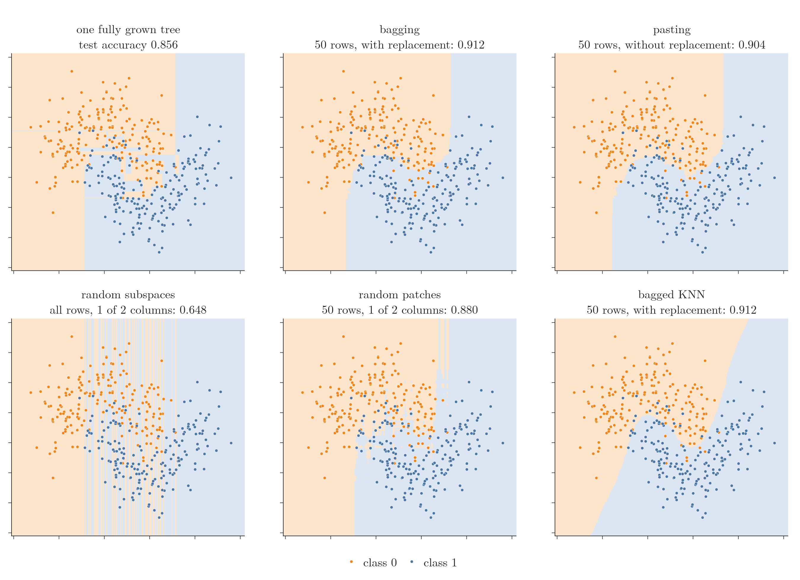

<!-- where-this-fits: generated by course_map/build_map.py; edit concepts.yaml, not this block -->
> **Where this fits:** Pipeline map steps 8 (Model), 9 (Evaluate), 10 (Tune). See the [Course map](../01-course-map/note.md).
>
> 
>
> - **Builds on:** Simple imputation (mean, median, mode, constant) ([Note 37](../37-missing-categorical-data/note.md)); ML pipelines ([Note 38](../38-missing-indicator-random-sample/note.md)); Bias-variance trade-off ([Note 62](../62-bias-variance/note.md)); Overfitting ([Note 91](../91-knn/note.md)); Hyperparameter tuning ([Note 98](../98-decision-tree-hyperparameters/note.md)); Decision trees ([Note 100](../100-dtreeviz/note.md)).
> - **Leads to:** Random forest ([Note 108](../108-random-forest-intro/note.md)).
> - **Compare with:** Boosting ([Note 101](../101-ensemble-learning/note.md)); Voting ensembles ([Note 104](../104-voting-regressor/note.md)); Cross-validation ([Note 104](../104-voting-regressor/note.md)); Random forest ([Note 108](../108-random-forest-intro/note.md)); Optuna ([Note 134](../134-optuna/note.md)); Bayesian optimisation ([Note 134](../134-optuna/note.md)).
<!-- /where-this-fits -->

## 1. Overview

> **Key point:** scikit-learn's `BaggingClassifier` trains many copies of one classifier on random samples of the rows and/or columns and takes their majority vote. Its settings choose the type: bagging, pasting, random subspaces or random patches.

The idea was explained in the [bagging Note](../105-bagging-intuition/note.md): bootstrapping, then aggregation, in four variants. This Note applies it to classification:

- a demo of decision surfaces, comparing one model with its bagged version, for each of the four types;
- `BaggingClassifier` in code on a dataset of 10,000 rows, with its hyperparameters;
- the out-of-bag score;
- what works in practice, and tuning with `GridSearchCV`.

The Notebook (`notebook.ipynb`) runs every experiment. The Dash app `app.py` has a control for every bagging setting and redraws the decision surfaces.

## 2. Seeing bagging on decision surfaces

> **Key point:** On the moons data, one fully grown tree overfits (test accuracy 0.856); bagging 100 trees smooths the boundary and reaches 0.912.

The demo data is the two-moons toy dataset (500 points, 375 for training), the same as in the [decision tree hyperparameters Note](../98-decision-tree-hyperparameters/note.md), section 4. The app asks for six settings, the main hyperparameters of `BaggingClassifier`:

- **base model** (`estimator`): decision tree (the default), KNN or SVM;
- **`n_estimators`:** how many base models;
- **`max_samples`:** how many rows each model gets (here out of 375);
- **`bootstrap`:** draw those rows with replacement (`True`) or without (`False`);
- **`max_features`:** how many columns each model gets (here out of 2);
- **`bootstrap_features`:** draw those columns with replacement or without.

{height=60%}

### 2.1 Bagging against a single tree

> **Key point:** The tree draws small boxes around single points; the bagged trees draw one smooth boundary.

With a decision tree, 100 estimators, 50 rows each, drawn with replacement, and both columns:

- **One tree** (Figure 1, top left): 0.856. Its surface has small boxes of one colour inside the other: overfitting. It is right on the training data, wrong on new data.
- **Bagging** (top middle): 0.912. The boundary is much smoother: the bias stays low and the variance falls, as the [bagging Note](../105-bagging-intuition/note.md) predicted.

### 2.2 Other base models

> **Key point:** Bagging KNN gives a slightly smoother boundary; bagging SVMs makes them a little worse.

Any classifier can be bagged:

- **KNN:** a single KNN (k = 5) already gives a smooth boundary and scores 0.912. Bagged, its boundary is a little smoother still (Figure 1, bottom right), with the same 0.912.
- **SVM:** a single SVM scores 0.896, but 100 bagged SVMs score only 0.872.

In practice, decision trees are bagged most often, KNN sometimes, SVMs rarely.

### 2.3 More estimators, more rows

> **Key point:** Beyond a point, more models or more rows change little.

With 500 trees instead of 100 (50 rows each), accuracy moves only from 0.912 to 0.920. With 500 trees of 150 rows each it is 0.904. More estimators usually help up to some number, then stop making a difference. Both settings are worth tuning.

### 2.4 Pasting, random subspaces and random patches

> **Key point:** Pasting behaves like bagging here; sampling one of only two columns hurts badly.

- **Pasting** (50 rows, `bootstrap=False`): 0.904. On a small toy dataset there is little difference from bagging; on large real datasets the difference can show.
- **Random subspaces** (all 375 rows, `bootstrap=False`, `max_features=1`, `bootstrap_features=True`): **0.648**, much worse than one tree. Each tree sees only one column, so it can only cut along one axis. The surface becomes vertical stripes (Figure 1, bottom left).
- **Random patches** (50 rows with replacement, 1 column): 0.880. Row sampling brings back some variety, but one column is still too little.

Column sampling makes sense only when there are many columns: 10, 20, 50, 100 or more. With two columns, sample rows (bagging or pasting) instead.

## 3. BaggingClassifier in code

> **Key point:** On 10,000 rows with 10 columns, one tree scores 0.927; 500 bagged trees score 0.945.

### 3.1 The data and a single tree

> **Key point:** `make_classification` builds 10,000 rows; 8,000 train, 2,000 test.

We make a dataset of 10,000 rows and 10 columns with `make_classification` (the [perceptron code Note](../71-perceptron-code/note.md)), of which 3 columns carry the information. 8,000 rows go to training and 2,000 to testing. A single fully grown decision tree scores **0.9265**: the number to beat.

### 3.2 Bagging

> **Key point:** 500 trees, each trained on 2,000 rows (25%) drawn with replacement.

> **Python:** A bagging classifier.
>
> ```python
> from sklearn.ensemble import BaggingClassifier
> from sklearn.tree import DecisionTreeClassifier
>
> bag = BaggingClassifier(
>     estimator=DecisionTreeClassifier(),
>     n_estimators=500,
>     max_samples=0.25,  # 25% of 8,000 rows
>     bootstrap=True,    # with replacement
>     random_state=42,
>     n_jobs=-1)         # all CPU cores
> bag.fit(X_train, y_train)
> accuracy_score(y_test, bag.predict(X_test))   # 0.945
> ```
>
> `max_samples` is a share of the rows when it is a decimal (0.25 means 25%) and a row count when it is a whole number (50 means 50 rows). `max_features` works the same way for columns.

Bagging scores **0.945**, against 0.9265 for one tree. Training takes a while: 500 trees are trained instead of one. `n_jobs=-1` spreads them over every CPU core.

> **Extra:** Older code passes the base model as `base_estimator=`. That name was removed in scikit-learn 1.4; the current name is `estimator`. Also, `max_samples` now defaults to `None`, which means "as many rows as the training set", the same as the old default of 1.0.

### 3.3 Which rows and columns each tree got

> **Key point:** Two attributes record what each tree saw: `estimators_samples_` (its rows) and `estimators_features_` (its columns).

After training, the classifier records what each base model saw:

- `bag.estimators_samples_[0]` holds the row numbers the first tree was trained on: 2,000 of them (25% of 8,000), starting 2523, 3113, 7114, ... Rows can repeat, because of replacement.
- `bag.estimators_features_[0]` holds its columns: all 10, `[0 1 2 ... 9]`, because we did not sample columns.

With `max_samples=0.5`, each tree gets 4,000 rows instead, and the accuracy is 0.950.

### 3.4 Other base models, pasting, subspaces and patches

> **Key point:** Bagged SVMs 0.913, pasting 0.946, random subspaces 0.942, random patches 0.938: all within a point or so of bagging, except the SVMs.

Every variant is the same class with different settings:

| Variant | Settings (all with 500 estimators) | Test accuracy |
|---|---|---|
| Bagging | `max_samples=0.25, bootstrap=True` | 0.945 |
| Bagged SVMs | `estimator=SVC()`, otherwise as bagging | 0.9125 |
| Pasting | `max_samples=0.25, bootstrap=False` | 0.946 |
| Random subspaces | `max_samples=1.0, bootstrap=False, max_features=0.5, bootstrap_features=True` | 0.9415 |
| Random patches | `max_samples=0.25, bootstrap=True, max_features=0.5, bootstrap_features=True` | 0.938 |

- The **SVMs** do worse than trees and take much longer, one reason trees are the usual choice.
- For **pasting**, we also set `verbose=1`, which prints training progress, and `n_jobs=-1`.
- For **random subspaces**, `estimators_samples_[0]` now has all 8,000 rows, and `estimators_features_[0]` has 5 columns, for example `[9 2 9 7 7]`. Column 9 and column 7 appear twice because `bootstrap_features=True` draws columns with replacement.

## 4. The out-of-bag score

> **Key point:** About 37% of the rows are never drawn for a given tree; scoring each tree on its unseen rows gives a free estimate of test accuracy.

When rows are drawn with replacement, some rows come up again and again, and some never come up for a given tree. On average about 63% of the rows are drawn and 37% are not (the [bagging Note](../105-bagging-intuition/note.md), section 2.3, derives this). The rows a tree never saw are its **out-of-bag** (OOB) rows.

Rows a tree did not see during training are like a test set for that tree. So scikit-learn can score the ensemble on them, without a separate test set:

> **Python:** The out-of-bag score.
>
> ```python
> bag = BaggingClassifier(DecisionTreeClassifier(),
>         n_estimators=500, max_samples=0.25,
>         bootstrap=True, oob_score=True,
>         random_state=42, n_jobs=-1)
> bag.fit(X_train, y_train)
> bag.oob_score_      # 0.9429
> ```
>
> `oob_score=True` (default `False`) needs `bootstrap=True`: without replacement there is no fixed out-of-bag set.

The OOB score, **0.943**, is close to the real test accuracy, **0.945**: a good estimate of how the model will do on new data. The [OOB score Note](../113-oob-score/note.md) covers it in full.

## 5. What works in practice

> **Key point:** Bagging usually beats pasting; start `max_samples` at 0.25 to 0.5; sample columns only with many columns; tune with `GridSearchCV`.

From experiments on many datasets:

1. **Bagging usually beats pasting.** Drawing with replacement makes the samples more varied, so the ensemble's variance is lower and it does better on new data, at the cost of a little more bias. Since it is only `bootstrap=True` or `False`, try both.
2. **`max_samples` between 0.25 and 0.5** usually works best for row sampling. Start at 0.25.
3. **Column sampling** (random subspaces, random patches) is for **high-dimensional** data, with many columns. With few columns it hurts, as Figure 1 showed.
4. **Tune with `GridSearchCV` or `RandomizedSearchCV`** instead of guessing (the [KNN Note](../91-knn/note.md), section 4.2, and the [regression trees Note](../99-regression-trees/note.md), section 7.2).

> **Python:** Grid search over the bagging settings.
>
> ```python
> parameters = {"n_estimators": [50, 100, 500],
>               "max_samples": [0.1, 0.4, 0.7, 1.0],
>               "bootstrap": [True, False],
>               "max_features": [0.1, 0.4, 0.7, 1.0]}
> search = GridSearchCV(BaggingClassifier(random_state=42),
>                       parameters, cv=5, n_jobs=-1)
> search.fit(X_train, y_train)
> search.best_params_
> ```

This tries $3 \times 4 \times 2 \times 4 = 96$ combinations with 5-fold cross-validation: 480 fits, about 5 minutes on 12 cores. The best: **500 trees, 70% of the rows without replacement (pasting), 70% of the columns**. Its cross-validation accuracy is 0.955, and its test accuracy 0.952, the best of all our settings.

Here pasting wins: the rules are a starting point; the search decides.

## 6. Summary

| Hyperparameter | Default | Meaning |
|---|---|---|
| `estimator` | `None` (decision tree) | the base model (formerly `base_estimator`) |
| `n_estimators` | 10 | number of base models |
| `max_samples` | `None` (all rows) | rows per model: a share (0.25) or a count (50) |
| `bootstrap` | `True` | rows with replacement (bagging) or without (pasting) |
| `max_features` | 1.0 (all columns) | columns per model: a share or a count |
| `bootstrap_features` | `False` | columns with replacement or without |
| `oob_score` | `False` | score the ensemble on out-of-bag rows (`oob_score_`) |
| `n_jobs` | `None` (1 core) | cores to use; -1 means all |

- On the moons data, bagging lifts one tree from 0.856 to 0.912; with only two columns, column sampling hurts (0.648).
- On 10,000 rows, bagging lifts one tree from 0.927 to 0.945; a grid search finds 0.952.
- The OOB score (0.943) estimates test accuracy (0.945) without a test set.
- Start with bagging and `max_samples` 0.25 to 0.5; sample columns only with many columns; tune with a grid search.

## 7. Key terms

| Term | Meaning |
|---|---|
| BaggingClassifier | scikit-learn class for bagging, pasting, random subspaces and random patches in classification |
| estimator | The base model that bagging copies (formerly base_estimator) |
| n_estimators | The number of base models in an ensemble |
| max_samples | The number or share of rows each base model gets |
| bootstrap | BaggingClassifier setting: draw rows with replacement (True, bagging) or without (False, pasting) |
| bootstrap_features | BaggingClassifier setting: draw columns with replacement or without |
| estimators_samples_ | The row numbers each trained base model was given |
| estimators_features_ | The column numbers each trained base model was given |
| Out-of-bag (OOB) score | The ensemble's accuracy measured on the rows each model never saw |
| verbose | scikit-learn setting that prints progress messages during training |
