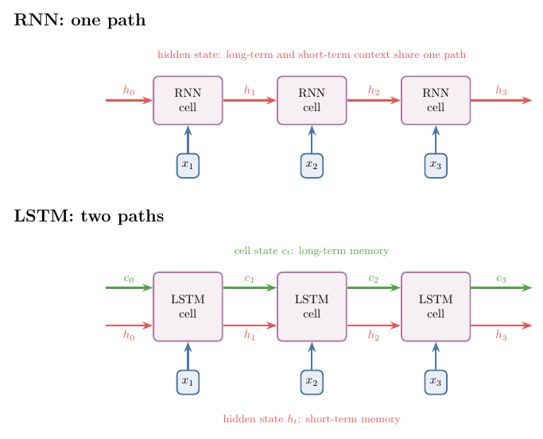
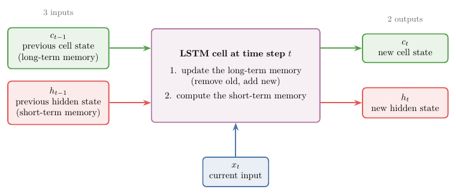

## 1. Overview

> **Key point:** A long short-term memory network (LSTM) is an RNN with two memory paths instead of one: a long-term memory (the cell state) and a short-term memory (the hidden state), plus a cell that decides what moves between them.

A simple RNN carries everything it remembers along one path, its hidden state, and over long sequences the early inputs fade. A **long short-term memory network** (LSTM; Hochreiter and Schmidhuber 1997) adds a second path that is built to keep information for a long time. Information placed on that path stays there until the network decides to remove it.

{width=90%}

Figure 1 shows the difference. This Note builds the intuition; the [LSTM architecture Note](../1062-lstm-architecture/note.md) opens the cell and gives the maths.

## 2. Prerequisites

- The [RNN forward propagation Note](../1056-rnn-forward-propagation/note.md): the hidden state carries information from step to step.
- The [problems with RNNs Note](../1060-problems-with-rnn/note.md): why a simple RNN forgets early inputs in long sequences.
- The [why RNNs Note](../1055-why-rnn/note.md): sequential data.

## 3. Where a simple RNN fails

> **Key point:** An RNN works on short sentences. When the word to predict depends on a word far back, the RNN has often forgotten it.

An RNN reads a sentence one word per time step, and its hidden state $h_t$ carries the past forward (see the [RNN forward propagation Note](../1056-rnn-forward-propagation/note.md)). In theory that is enough. In practice, trouble starts when sentences get long.

Take the sentence "Maharashtra is a beautiful state. The language spoken there is ___". The answer, Marathi, depends on the first word, Maharashtra. With only a few words in between, an RNN can manage. Now make it longer: "Maharashtra is a beautiful state. It has 25 cities, beautiful forests, … its capital is Mumbai, … The language spoken there is ___". Many more time steps now separate the blank from Maharashtra, and by the end a simple RNN has largely forgotten what the paragraph was about.

The cause is the vanishing gradient problem in long chains of time steps, taught in the [problems with RNNs Note](../1060-problems-with-rnn/note.md). The effect is that recent inputs dominate the hidden state, and the influence of early inputs on far-away predictions is small. A simple RNN behaves like someone who has watched a long series but remembers only the latest episodes.

## 4. How we read a story: two kinds of context

> **Key point:** While reading, we keep a short-term context (what is happening right now) and a long-term context (what matters for the whole story). We add to and remove from the long-term context as the story goes.

Read a short story and decide, at the end, whether it is a good story or a bad one: a text classification task, exactly what a sentiment network does.

> A thousand years ago, in the Indian kingdom of Pratapgarh, there lived a king called Vikram: powerful, kind and loved by his people. One day the king of a neighbouring land, XYZ, attacked. Vikram fought bravely and drove XYZ back, but died in the war. Years later his son, Vikram Junior, even stronger than his father, became king and swore revenge. He attacked XYZ, and XYZ killed him too. Vikram Junior's son, Vikram Super Junior, was not strong, but he was clever. At fifteen he attacked XYZ; XYZ almost beat him, but he outwitted XYZ and killed him, avenging his father and grandfather.

Our mind processes such a story word by word, and keeps two kinds of context.

- **Short-term context:** what is happening in the story right now.
- **Long-term context:** what matters for the story as a whole. The mind builds it from the short-term context, keeping only what seems important.

The long-term context changes as the story goes:

| The story says | Long-term context afterwards |
|---|---|
| a thousand-year-old story | old story (swords, not guns) |
| in Pratapgarh | old story, Pratapgarh |
| a great king, Vikram | old story, Pratapgarh, **Vikram (hero?)** |
| XYZ attacks | old story, Pratapgarh, Vikram, **XYZ (villain)** |
| Vikram dies | old story, Pratapgarh, XYZ (Vikram removed: not the hero) |
| Vikram Junior becomes king | old story, Pratapgarh, XYZ, **Vikram Junior** |
| Vikram Junior is killed | old story, Pratapgarh, XYZ (Vikram Junior removed) |
| Vikram Super Junior kills XYZ | old story, Pratapgarh, XYZ, **Vikram Super Junior** (stays) |

When asked "good or bad?", we answer from the long-term context, not from the last sentence alone.

## 5. Why one path is not enough

> **Key point:** A simple RNN has a single path, the hidden state, for both the long-term and the short-term context. On that one path, the short-term context wins.

In a simple RNN the only way to remember the past is the hidden-state line from one time step to the next. That single line must hold the long-term context and the short-term context at once. Because early contributions fade along the chain (section 3), the recent, short-term content dominates. The network keeps the latest episodes and loses the fact that Vikram was the grandfather.

## 6. The core idea: a second path for long-term memory

> **Key point:** Keep two paths: one for short-term memory, one for long-term memory. At each step, the current input decides what to add to the long-term path and what to remove. Whatever is not removed reaches the end, however long the sequence.

The fix is to run two lines through the network:

- the lower line carries the **short-term memory**, much like the RNN's hidden state;
- the upper line carries the **long-term memory**.

If something important appears at the first time step and is never removed from the long-term line, it reaches the last time step and the output, no matter how long the chain.

An example with pronouns. A text says "Ankita is a great girl." The next sentence needs a pronoun: "___ is a state topper." To choose "she", the network must remember that the subject is a girl. So when "Ankita is a great girl" arrives, the short-term memory passes "Ankita, girl" to the long-term memory. Later the text says "Rahul is a cricketer. ___ has scored three centuries this season." Now the long-term memory drops Ankita and girl and stores Rahul and boy, and the pronoun becomes "he". Olah (2015) uses the same picture: the cell state may hold the gender of the current subject, so that the right pronoun can be used, and forgets it when a new subject appears.

> **Extra:** The name "long short-term memory" comes from the original paper (Hochreiter and Schmidhuber 1997). There, "short-term memory" means what a recurrent network stores in its activations (as opposed to "long-term memory" stored in slowly changing weights). An LSTM is a network whose short-term memory lasts long: its stored activations can bridge time lags of more than 1000 time steps on the paper's artificial tasks. The "long-term memory" and "short-term memory" of this Note are the usual teaching picture of the cell state and hidden state.

## 7. Two differences between an RNN and an LSTM

> **Key point:** An LSTM passes two states instead of one, and its cell is more complex, because the two memories must communicate.

Figure 1 puts the two side by side.

1. **Two states instead of one.** An RNN passes only the hidden state. An LSTM passes the hidden state $h_t$ (short-term memory) and the **cell state** $c_t$ (long-term memory). This is the first and biggest difference.
2. **A more complex cell.** Inside an RNN cell there is one tanh layer. Inside an LSTM cell there is more machinery, because the cell has an extra job: making the two memories talk. When the short-term memory sees that something new and important has arrived, it must tell the long-term memory to add it; when something has become irrelevant, it must tell the long-term memory to remove it.

## 8. The three gates in one line each

> **Key point:** The machinery inside the cell is split into three gates. The forget gate removes from the long-term memory, the input gate adds to it, and the output gate reads from it to produce the output and the next short-term memory.

The parts of the LSTM cell are called **gates**, and there are three of them. Their maths is in the [LSTM architecture Note](../1062-lstm-architecture/note.md); here is what each one does, based on the current input and the short-term memory.

| Gate | What it does | In the story |
|---|---|---|
| **Forget gate** | decides what to remove from the long-term memory | Vikram dies: remove Vikram |
| **Input gate** | decides what new information to add to the long-term memory | Vikram Junior becomes king: add him |
| **Output gate** | decides what to read out of the long-term memory as output, and produces the short-term memory for the next time step | at the end: answer "good or bad" |

The output gate works at every time step, not only at the end. At the last step it gives the output; at the steps in between, its result is the short-term memory passed to the next step.

## 9. The LSTM cell as a small computer

> **Key point:** Three inputs ($c_{t-1}$, $h_{t-1}$, $x_t$), two outputs ($c_t$, $h_t$), and two jobs inside: update the long-term memory, then compute the short-term memory.

A computer takes input, processes it and gives output. The LSTM cell at time step $t$ does the same.

{width=95%}

Figure 2 shows the cell as a box.

- **Inputs (3):** the previous cell state $c_{t-1}$ (long-term memory), the previous hidden state $h_{t-1}$ (short-term memory), and the current input $x_t$, for example the current word.
- **Processing (2 jobs):**
  1. update the long-term memory: remove old information and add new information, turning $c_{t-1}$ into $c_t$;
  2. compute the new short-term memory $h_t$.
- **Outputs (2):** the new cell state $c_t$ and the new hidden state $h_t$. Both go on to the next time step; $h_t$ can also be the output at this step.

## 10. The two paths on real reviews

> **Key point:** On real movie reviews whose sentiment words are followed by 25 extra time steps, a SimpleRNN falls to chance while an LSTM keeps the sentiment: XX against XX validation accuracy.

PLACEHOLDER

## 11. Summary

| | Simple RNN | LSTM |
|---|---|---|
| States passed between time steps | one: hidden state $h_t$ | two: cell state $c_t$ and hidden state $h_t$ |
| Long-term context | shares the hidden state, fades over long sequences | kept on the cell state until removed |
| Inside the cell | one tanh layer | three gates (forget, input, output) |
| Inputs, outputs per step | $x_t$, $h_{t-1}$ in; $h_t$ out | $x_t$, $h_{t-1}$, $c_{t-1}$ in; $h_t$, $c_t$ out |

- A simple RNN forgets early inputs in long sequences because one path must carry both short-term and long-term context.
- An LSTM adds a second path, the cell state, for long-term memory; the hidden state remains the short-term memory.
- Information on the cell state stays until the network removes it, so it can reach the end of a long sequence.
- The forget gate removes from the cell state, the input gate adds to it, the output gate produces the output and the next hidden state.

## 12. Sources

- Hochreiter, S. and Schmidhuber, J. (1997). Long Short-Term Memory. *Neural Computation* 9(8), 1735-1780.
- Goodfellow, I., Bengio, Y. and Courville, A. (2016). *Deep Learning*. MIT Press. §10.7 (long-term dependencies), §10.10.1 (LSTM). deeplearningbook.org/contents/rnn.html.
- Olah, C. (2015). Understanding LSTM Networks. Blog post, colah.github.io/posts/2015-08-Understanding-LSTMs/.
- Keras API documentation: `SimpleRNN` and `LSTM` layers, keras.io/api/layers/recurrent_layers/; IMDB dataset, keras.io/api/datasets/imdb.

## 13. Key terms

| Term | Meaning |
|---|---|
| Long short-term memory (LSTM) | An RNN that passes a cell state (long-term memory) and a hidden state (short-term memory) between time steps, controlled by gates |
| Short-term context | What is happening in the sequence right now |
| Long-term context | What matters for the sequence as a whole, kept from earlier steps |
| Cell state ($c_t$) | The LSTM's long-term memory path |
| Hidden state ($h_t$) | The LSTM's short-term memory path, also its output at each step |
| Gate | A part of the LSTM cell that controls what moves into, out of, or along the cell state |
| Forget gate | Removes information from the cell state |
| Input gate | Adds new information to the cell state |
| Output gate | Produces the output and the next hidden state from the cell state |
